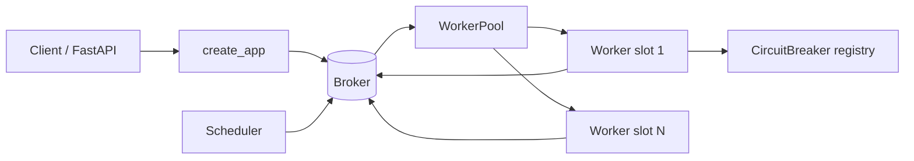
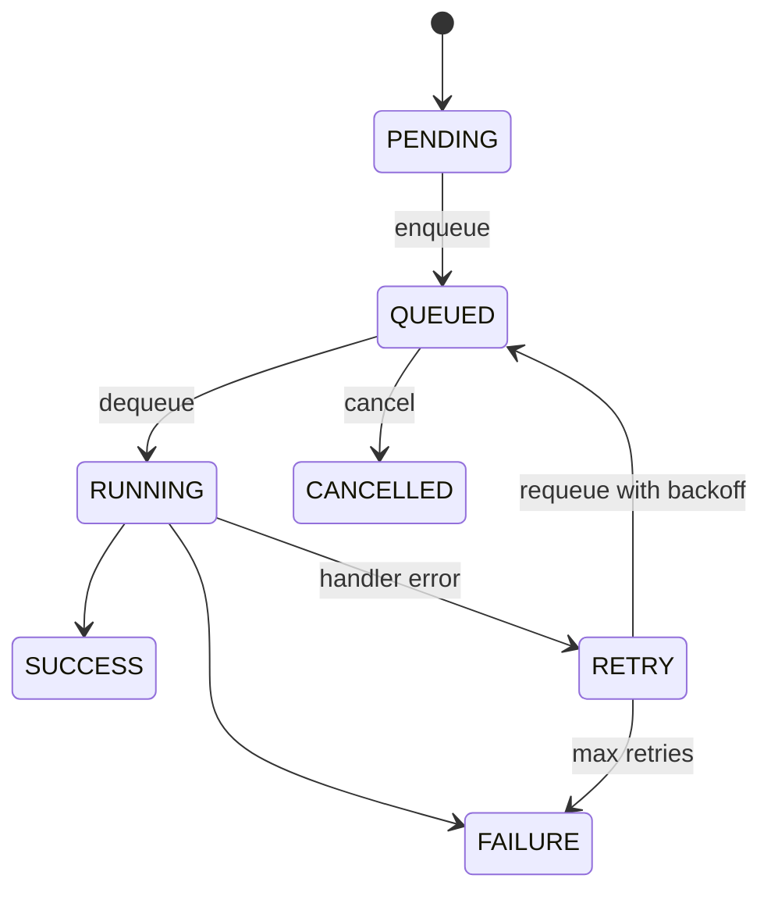

# Distributed Job Queue

An asynchronous task-processing system built from scratch in Python, inspired by Celery and SQS. It pairs a pluggable broker (in-memory or Redis-backed) with priority queues, a worker pool, cron/interval scheduling, circuit breakers, and idempotent deduplication, all exposed through a FastAPI control plane.

## Features

- **Priority queues** — four levels (`CRITICAL`, `HIGH`, `NORMAL`, `LOW`) backed by a per-queue binary heap so higher-priority tasks dequeue first (`TaskPriority` / `broker.py`).
- **Pluggable brokers** — an abstract `Broker` interface with an `InMemoryBroker` (heaps, visibility locks) and a `RedisBroker` for persistence (`broker.py` / `redis_broker.py`).
- **Async workers** — each `Worker` runs N concurrent slots, polls the broker, executes registered handlers under a timeout, and tracks heartbeats (`worker.py`).
- **Worker pools** — `WorkerPool` manages multiple workers, shares handler registration, and scales up/down dynamically (`pool.py`).
- **Automatic retries** — failed tasks retry with exponential backoff plus jitter up to `max_retries`, then settle into failure or a dead-letter queue (`worker.py`).
- **Circuit breakers** — per-task-type `CircuitBreaker` with `CLOSED` / `OPEN` / `HALF_OPEN` states to fail fast on repeatedly failing handlers (`circuit_breaker.py`).
- **Scheduling** — `Scheduler` fires recurring tasks via cron expressions (croniter) or fixed intervals; `schedule_delayed` enqueues one-shot delayed tasks via `eta` (`scheduler.py`).
- **Idempotency** — idempotency keys deduplicate tasks at enqueue time; a standalone `DeduplicationLayer` offers TTL-based dedup with pluggable stores (`deduplication.py`).
- **Visibility timeouts** — in-flight tasks hold a visibility lock so a crashed worker's task becomes redeliverable after the timeout (`broker.py`).
- **REST API** — FastAPI app to submit, inspect, cancel, and retry tasks, plus queue stats and Prometheus metrics (`api.py`).

## Architecture



| Component | Module | Responsibility |
|-----------|--------|----------------|
| Task models | `src/jobqueue/models.py` | Pydantic `Task`, `TaskResult`, `TaskCreate`, `QueueStats`, `WorkerInfo` |
| Broker interface | `src/jobqueue/broker.py` | Abstract `Broker` plus `InMemoryBroker` (heaps, visibility locks, dedup) |
| Redis broker | `src/jobqueue/redis_broker.py` | Persistent broker with dead-letter support |
| Worker | `src/jobqueue/worker.py` | Concurrent slots, handler dispatch, retries, heartbeats |
| Worker pool | `src/jobqueue/pool.py` | Multi-worker management and dynamic scaling |
| Scheduler | `src/jobqueue/scheduler.py` | Cron/interval jobs and delayed task enqueue |
| Circuit breaker | `src/jobqueue/circuit_breaker.py` | Per-task-type breaker plus `CircuitBreakerRegistry` |
| Deduplication | `src/jobqueue/deduplication.py` | TTL-based idempotency with pluggable store |
| API | `src/jobqueue/api.py` | FastAPI endpoints and Prometheus metrics |

Tasks move through the states defined by `TaskStatus`:



## Quick Start

### Prerequisites

- Python 3.11 or higher
- Redis 7.0+ is optional — only `RedisBroker` needs it; the in-memory broker, tests, and examples run with no external services

### Installation

```bash
cd 01-distributed-job-queue
pip install -e ".[dev]"
```

### Running

```bash
# Run the FastAPI control plane (in-memory broker)
python -m jobqueue.api
# or: uvicorn jobqueue.api:app --reload

# Run the full in-process demo (pool + scheduler + circuit breaker)
python examples/full_example.py
```

The API serves interactive docs at `http://localhost:8000/docs`.

## Usage

Workers take a broker instance and register async handlers. The example below enqueues and processes tasks fully in-process:

```python
import asyncio
from jobqueue import Task, TaskPriority, InMemoryBroker, WorkerPool

async def main():
    broker = InMemoryBroker()
    pool = WorkerPool(broker, queues=["default"], min_workers=2, max_workers=4)

    @pool.task("add")
    async def add(task: Task) -> int:
        return task.payload["a"] + task.payload["b"]

    pool_task = asyncio.create_task(pool.start(num_workers=2))

    task = await broker.enqueue(Task(name="add", payload={"a": 2, "b": 3},
                                     priority=TaskPriority.HIGH))
    await asyncio.sleep(0.5)

    result = await broker.get_result(task.id)
    print(result.status, result.result)  # success 5

    await pool.stop()
    pool_task.cancel()

asyncio.run(main())
```

Schedule recurring and delayed work with the `Scheduler` and `schedule_delayed`:

```python
from jobqueue import Scheduler, schedule_delayed

scheduler = Scheduler(broker)
scheduler.add_job("nightly_backup", task_name="backup", cron="0 2 * * *")
scheduler.add_job("health", task_name="ping", interval_seconds=300)

await schedule_delayed(broker, task_name="add", delay_seconds=10,
                       payload={"a": 1, "b": 1})
```

## What's Real vs Simulated

- **Real:** the broker abstraction, `InMemoryBroker` (priority heaps, visibility locks, idempotency-key dedup), workers with concurrent slots and graceful shutdown, retry/backoff, the circuit breaker state machine, cron/interval scheduling via croniter, the deduplication layer, and the full FastAPI surface with Prometheus counters. All of this is exercised by the test suite with no external services.
- **Simulated / requires credentials:** `RedisBroker` needs a running Redis and is only imported when the `redis` package is present. The example handlers (email, report generation) are stubs that sleep and return fake payloads — there is no real email or storage integration. Prometheus metrics are exported in-process; there is no bundled Grafana/Prometheus deployment.

## Testing

```bash
pytest
pytest --cov=jobqueue          # with coverage
```

The suite covers models, broker semantics, worker execution and retries, the circuit breaker, deduplication, the scheduler, the API, and an end-to-end integration test — all against the in-memory broker, so no Redis is required.

## Project Structure

```
01-distributed-job-queue/
  README.md                    # this file
  pyproject.toml
  src/jobqueue/
    models.py                  # Task, TaskResult, enums, stats
    broker.py                  # Broker interface + InMemoryBroker
    redis_broker.py            # Redis-backed broker
    worker.py                  # Worker execution loop
    pool.py                    # WorkerPool scaling
    scheduler.py               # cron/interval/delayed scheduling
    circuit_breaker.py         # breaker + registry
    deduplication.py           # idempotency layer
    api.py                     # FastAPI app + metrics
  examples/                    # basic_usage.py, full_example.py
  tests/                       # unit + integration tests
  docs/BLUEPRINT.md            # full architecture and design
```

## License

MIT — see [LICENSE](../LICENSE)
