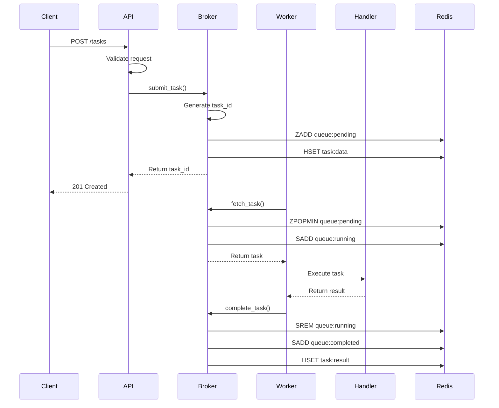
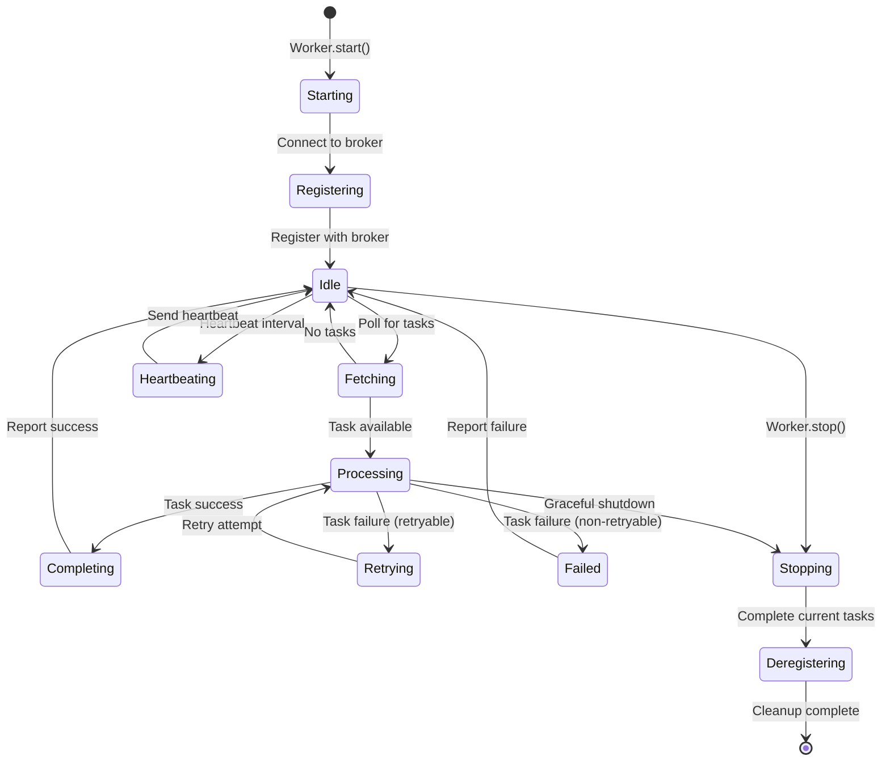

# Distributed Job Queue - System Architecture

## Overview

The Distributed Job Queue is a high-performance, scalable task processing system inspired by Celery, built with Python and Redis. It provides reliable asynchronous task execution with support for priority queues, retries, circuit breakers, and comprehensive monitoring.

## System Components

### Core Architecture

```
┌─────────────────┐     ┌──────────────────┐     ┌─────────────────┐
│   Client Apps   │────▶│    API Gateway   │────▶│  Redis Broker   │
└─────────────────┘     └──────────────────┘     └─────────────────┘
                                                           │
                              ┌────────────────────────────┼────────────────────────────┐
                              │                            │                            │
                              ▼                            ▼                            ▼
                    ┌──────────────────┐     ┌──────────────────┐     ┌──────────────────┐
                    │   Worker Pool 1   │     │   Worker Pool 2   │     │   Worker Pool N   │
                    └──────────────────┘     └──────────────────┘     └──────────────────┘
                              │                            │                            │
                              └────────────────────────────┼────────────────────────────┘
                                                           │
                                                           ▼
                                                ┌──────────────────┐
                                                │  Metrics Store   │
                                                └──────────────────┘
```

## Component Details

### 1. Redis Broker

The message broker is the central hub for task distribution and state management.

**Responsibilities:**
- Task queue management (FIFO, priority-based)
- Task state persistence
- Worker registration and heartbeat tracking
- Pub/Sub for real-time notifications
- Dead Letter Queue (DLQ) management

**Data Structures:**
```python
# Task Queues (Sorted Sets)
"queue:{queue_name}:pending" -> ZADD score=priority, member=task_id
"queue:{queue_name}:running" -> SET of task_ids
"queue:{queue_name}:completed" -> SET of task_ids

# Task Data (Hashes)
"task:{task_id}" -> {
    "id": str,
    "name": str,
    "payload": json,
    "status": str,
    "created_at": timestamp,
    "priority": int,
    ...
}

# Worker Registry (Hashes)
"worker:{worker_id}" -> {
    "id": str,
    "hostname": str,
    "queues": json_array,
    "status": str,
    "last_heartbeat": timestamp,
    ...
}
```

### 2. Worker Architecture

Workers are the execution units that process tasks from the broker.

**Components:**

```python
class Worker:
    def __init__(self):
        self.broker: Broker               # Connection to Redis
        self.handlers: Dict[str, Callable] # Task name -> handler function
        self.circuit_registry: CircuitBreakerRegistry
        self.task_pool: asyncio.TaskGroup # Concurrent task execution
        self.heartbeat_task: asyncio.Task # Background heartbeat
```

**Execution Flow:**

1. **Fetch Task**: Poll broker for available tasks
2. **Claim Task**: Atomically move task to running state
3. **Execute**: Run handler with timeout protection
4. **Report Result**: Update task status and result
5. **Error Handling**: Retry logic and circuit breaker

### 3. API Gateway

FastAPI-based REST API for task submission and monitoring.

**Endpoints:**

```
POST   /tasks                 - Submit new task
GET    /tasks/{task_id}       - Get task status
POST   /tasks/{task_id}/cancel - Cancel task
GET    /queues/stats          - Queue statistics
GET    /workers               - List active workers
POST   /schedule              - Schedule recurring task
GET    /metrics               - Prometheus metrics
```

### 4. Task Scheduler

Cron-based scheduling system for recurring tasks.

**Architecture:**
```python
class Scheduler:
    def __init__(self):
        self.schedules: Dict[str, Schedule]  # Active schedules
        self.cron_parser: CronParser         # Cron expression parser
        self.next_runs: PriorityQueue        # Upcoming executions
```

## Data Flow

### Task Submission Flow



### Worker Lifecycle



## Scaling Strategy

### Horizontal Scaling

**Worker Scaling:**
- Add worker instances dynamically based on queue depth
- Each worker can process multiple tasks concurrently
- Workers can be distributed across multiple machines

**Queue Partitioning:**
- Separate queues by priority (critical, high, normal, low)
- Dedicated queues for specific task types
- Geographic queue distribution for multi-region

### Vertical Scaling

**Concurrency Tuning:**
```python
worker = Worker(
    concurrency=10,  # Tasks per worker
    prefetch_limit=20,  # Pre-fetch for efficiency
)
```

**Resource Optimization:**
- Memory pooling for large payloads
- Connection pooling for Redis clients
- Task batching for bulk operations

## Fault Tolerance

### Circuit Breaker Pattern

Prevents cascading failures when external services are down:

```python
circuit = CircuitBreaker(
    failure_threshold=5,
    recovery_timeout=60,
    expected_exception=ServiceException
)

@circuit
async def call_external_service():
    # Protected service call
    pass
```

States:
- **CLOSED**: Normal operation
- **OPEN**: Failures exceeded threshold, reject requests
- **HALF_OPEN**: Testing if service recovered

### Retry Mechanism

Exponential backoff with jitter:

```python
retry_delay = min(
    base_delay * (2 ** attempt) + random.uniform(0, 1),
    max_delay
)
```

### Dead Letter Queue

Failed tasks after max retries are moved to DLQ for investigation:

```python
if task.retry_count >= task.max_retries:
    await broker.move_to_dlq(task)
    # Task available in "dlq:{queue_name}" for manual processing
```

## Monitoring & Observability

### Metrics Collection

**Task Metrics:**
- Tasks submitted/completed/failed per minute
- Average task execution time
- Queue depth and latency
- Retry rate and DLQ size

**Worker Metrics:**
- Active/idle worker count
- CPU and memory usage per worker
- Task throughput per worker
- Heartbeat success rate

### Distributed Tracing

OpenTelemetry integration for request tracing:

```python
tracer = trace.get_tracer("jobqueue")

with tracer.start_as_current_span("process_task") as span:
    span.set_attribute("task.id", task.id)
    span.set_attribute("task.name", task.name)
    # Task processing
```

### Logging

Structured logging with contextual information:

```python
logger = structlog.get_logger()
logger.info(
    "task_completed",
    task_id=task.id,
    duration=execution_time,
    worker_id=worker.id
)
```

## Security Considerations

### Authentication & Authorization

- API key-based authentication for task submission
- Role-based access control (RBAC) for management endpoints
- Worker authentication via shared secrets

### Data Protection

- Payload encryption for sensitive data
- TLS for Redis connections
- Secrets management via environment variables

### Rate Limiting

- Per-client rate limits on task submission
- Queue-level submission limits
- Worker-level concurrency limits

## Performance Optimization

### Caching Strategy

- Task result caching with TTL
- Worker capability caching
- Queue statistics caching

### Batch Processing

```python
# Batch task submission
tasks = [create_task(i) for i in range(100)]
await broker.submit_batch(tasks)

# Batch result fetching
results = await broker.get_results(task_ids)
```

### Connection Management

```python
# Connection pooling
redis_pool = redis.ConnectionPool(
    max_connections=50,
    max_idle_time=30,
    connection_class=redis.Connection
)
```

## Deployment Architecture

### Containerized Deployment

```yaml
services:
  redis:
    image: redis:7-alpine
    volumes:
      - redis_data:/data

  api:
    build: .
    command: uvicorn api:app
    environment:
      - REDIS_URL=redis://redis:6379

  worker:
    build: .
    command: python -m jobqueue.worker
    deploy:
      replicas: 3
    environment:
      - REDIS_URL=redis://redis:6379
```

### Kubernetes Deployment

- Horizontal Pod Autoscaling based on queue depth
- StatefulSets for Redis persistence
- ConfigMaps for configuration management
- Secrets for sensitive data

## Future Enhancements

1. **Multi-Broker Support**: Support for RabbitMQ, Kafka
2. **Task Workflows**: DAG-based task dependencies
3. **Result Backend**: Separate storage for large results
4. **WebSocket Support**: Real-time task status updates
5. **Machine Learning Integration**: Smart task routing based on historical data