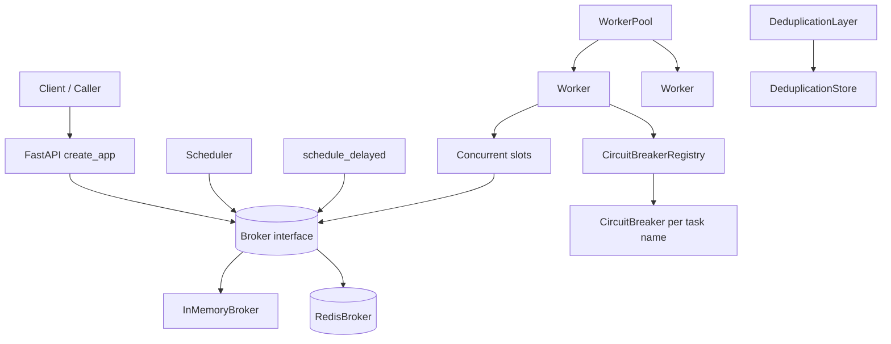
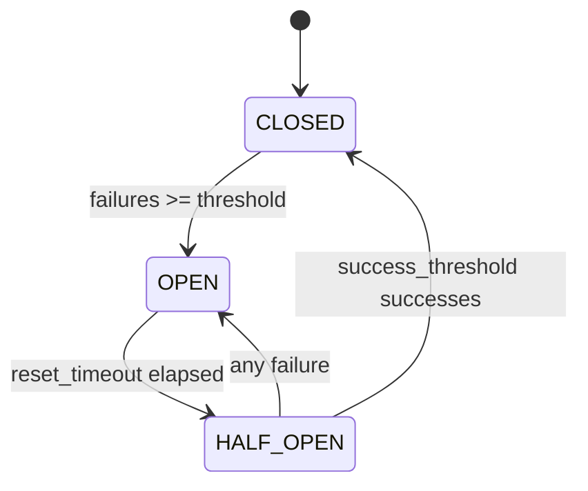
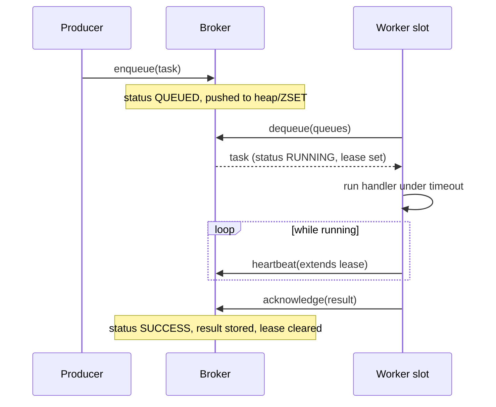

# Distributed Job Queue

## Overview

The Distributed Job Queue is an asynchronous task-processing system built from scratch
in Python. It takes a task — a named unit of work with a JSON payload — accepts it
through an API or directly into a broker, holds it in a durable priority queue, and hands
it to a worker that runs a registered handler. Around that core loop it layers the
machinery that real queueing systems need: priority ordering, visibility timeouts so a
crashed worker's task is redelivered, exponential-backoff retries, dead-letter handling,
circuit breakers that stop hammering a failing dependency, idempotency keys that suppress
duplicate submissions, and cron/interval scheduling for recurring work.

The system is designed around a single abstraction — the `Broker` — so the same workers,
pool, scheduler, and API run unchanged against an in-process `InMemoryBroker` (heaps and
dictionaries) or a `RedisBroker` (sorted sets and hashes). The in-memory broker is the
default and is what the test suite exercises end to end; Redis adds persistence and
cross-process delivery without changing any caller code.

The concepts this project teaches are the ones behind Celery, Sidekiq, BullMQ, and AWS
SQS: queue semantics and at-least-once delivery, worker lifecycle and liveness detection,
backpressure and priority scheduling, idempotent operations and deduplication, fault
isolation via circuit breakers, and time-based triggering. The goal is a faithful,
readable implementation of those patterns rather than a drop-in replacement for any one
of those systems.

Scope: this is an asyncio system. Workers, the pool, the scheduler, and both brokers are
all coroutine-based and share a single event loop within a process. Concurrency comes from
worker *slots* (independent coroutines polling the broker) and from running multiple
worker or pool processes against a shared Redis broker. There is no custom thread pool and
no multiprocessing layer; CPU-bound handlers should offload work themselves.

Two design principles run through the whole system and explain most of the specific
choices. The first is *the broker is the only shared state*. Producers, workers, the
scheduler, and the API never talk to each other directly — they communicate exclusively by
mutating broker state. That is what makes a worker process interchangeable, lets the
scheduler be a dumb producer, and allows the same code to run single-process or
multi-process just by swapping the broker. The second is *every guarantee is a bound*.
Rather than promise exactly-once execution or unbounded buffering, the system pins each
risk to an explicit, tunable limit — a visibility lease, a retry cap, a worker clamp, a
result TTL — so behavior under failure is predictable instead of best-effort. Reading the
rest of this document, almost every component decision traces back to one of these two
principles.

The teaching value is in seeing those principles applied concretely: how at-least-once
delivery falls out of leasing rather than deleting; why idempotency must live with the
handler, not the queue; how a circuit breaker differs from a retry; and why a scheduler
needs no timer of its own. These are the load-bearing ideas in every production task queue,
and the codebase is small enough to hold all of them in your head at once.

## Architecture



The system splits into four layers that communicate only through the `Broker` interface
and Pydantic models:

- **Control plane (`api.py`).** A FastAPI application that translates HTTP requests into
  broker calls. It owns a single broker instance for the process lifetime, exposes task
  CRUD-style endpoints and queue statistics, and serves Prometheus metrics. It never
  executes handlers itself.
- **Broker layer (`broker.py`, `redis_broker.py`).** The durable heart of the system.
  It defines the abstract contract every other component depends on and provides two
  concrete implementations. The broker owns task state, queue ordering, visibility locks,
  idempotency mappings, results, and worker registration.
- **Execution layer (`worker.py`, `pool.py`, `circuit_breaker.py`).** Workers poll the
  broker, dispatch tasks to registered handlers under a timeout, apply retry/backoff,
  and emit heartbeats. The pool runs and scales a set of workers; the circuit breaker
  registry isolates failing handler types.
- **Scheduling layer (`scheduler.py`).** Translates time — cron expressions, fixed
  intervals, and one-shot delays — into ordinary enqueued tasks. The scheduler is just a
  producer; once a task is enqueued it is indistinguishable from any other.

Data flows in one direction through the broker: producers (API, scheduler, direct callers)
enqueue `Task` objects; the broker orders them; workers dequeue, execute, and acknowledge
with a `TaskResult`; results are stored back in the broker for retrieval.

The layering is enforced by dependency direction, not just convention. The execution and
scheduling layers import the `Broker` abstract class and the model types, never a concrete
broker, so they cannot accidentally couple to in-memory or Redis specifics. The two
concrete brokers depend only on the models. The API layer depends on the broker interface
and the models. Nothing depends on the API. This acyclic structure is what allows the test
suite to instantiate the entire execution and scheduling stack against an `InMemoryBroker`
with no network, no FastAPI, and no Redis, while the exact same worker and scheduler code
runs unmodified in a deployment that uses Redis and exposes the HTTP control plane.

## Core Components

### Broker interface

`Broker` (in `broker.py`) is an abstract base class that fixes the contract the rest of
the system relies on. Every method is a coroutine:

```python
class Broker(ABC):
    async def enqueue(self, task: Task) -> Task: ...
    async def dequeue(self, queues: list[str], timeout: float = 0) -> Task | None: ...
    async def acknowledge(self, task_id: str, result: TaskResult) -> None: ...
    async def requeue(self, task_id: str) -> None: ...
    async def get_task(self, task_id: str) -> Task | None: ...
    async def get_result(self, task_id: str) -> TaskResult | None: ...
    async def get_queue_stats(self, queue: str) -> QueueStats: ...
    async def register_worker(self, worker_info: WorkerInfo) -> None: ...
    async def heartbeat(self, worker_id: str, current_task: str | None = None) -> None: ...
    async def cancel_task(self, task_id: str) -> bool: ...
```

Because workers, the pool, the scheduler, and the API only ever call this interface, the
storage backend is fully swappable. The contract encodes the delivery model: `dequeue`
hands out a task and starts a visibility timer; `acknowledge` finalizes it; `requeue`
returns it for another attempt; an un-acknowledged task whose visibility lock expires
becomes eligible for redelivery — i.e. at-least-once delivery.

### InMemoryBroker

`InMemoryBroker` is the default backend and the one the tests run against. It keeps
everything in process memory guarded by two asyncio locks (`_queue_lock`, `_task_lock`):

- **Priority queues.** One binary heap per queue name, holding `(priority, timestamp,
  task_id)` tuples. Because `TaskPriority` is an `IntEnum` where `CRITICAL = 0` is the
  smallest value, the heap naturally surfaces the highest-priority task first, and the
  timestamp breaks ties FIFO within a priority level.
- **Task and result tables.** `_tasks` maps id → `Task`, `_results` maps id →
  `TaskResult`.
- **Visibility locks.** `_visibility_locks` maps an in-flight `task_id` to
  `(worker_id, expires_at)`. While the lock is live, `dequeue` skips the task; once it
  expires, the task is redelivered. Heartbeats extend the lock for the current task.
- **Idempotency map.** `_idempotency_keys` maps an idempotency key to the id of the first
  task that claimed it; a re-enqueue with the same key returns the existing task instead
  of creating a duplicate.

The `dequeue` loop scans the requested queues, skips tasks that are cancelled, not yet at
their `eta`, or still under a live visibility lock, and selects the globally
highest-priority ready task. With a positive `timeout` it waits on an `asyncio.Event` that
`enqueue`/`requeue` set, re-checking at most once per second so newly-ready ETA tasks are
not missed.

The selection is subtler than a single heap pop because a worker may listen on several
queues at once. For each requested queue the loop peeks the heap top, validates it (exists,
still `QUEUED`, past its `eta`, not locked), and keeps a running "best" by `(priority,
timestamp)` across queues — so a `CRITICAL` task on the second queue still wins over a
`NORMAL` task on the first. Stale heap entries (tasks that were cancelled or already taken)
are lazily popped during the scan rather than eagerly removed at cancel time, which keeps
cancellation O(1) at the cost of a little cleanup work on the next dequeue. Once a winner is
chosen it is spliced out of its heap, a visibility lock is installed, and the task flips to
`RUNNING` with `started_at` stamped — all under the queue lock so two slots can never
observe the same task as available.

Idempotency is enforced at `enqueue`: if the task carries an `idempotency_key` already
present in `_idempotency_keys`, the broker returns the *existing* task untouched instead of
queueing a second copy, so duplicate submissions collapse to one unit of work. This is the
in-broker counterpart to the standalone `DeduplicationLayer` and covers the common case
where the same producer retries a submission.

### RedisBroker

`RedisBroker` implements the same interface over Redis data structures, giving persistence
and cross-process delivery. Key choices:

- Each queue is a Redis **sorted set** keyed `jobqueue:queue:<name>`, with score
  `priority * 1e12 + timestamp`. The huge multiplier guarantees priority dominates and the
  timestamp orders within a priority band, reproducing the heap's ordering in Redis.
- Task bodies are stored as JSON at `jobqueue:task:<id>`; results live at
  `jobqueue:result:<id>` with a configurable `result_ttl_seconds` so old results expire.
- Idempotency keys map to task ids with the same TTL.
- A `move_to_dlq` method implements the dead-letter path for permanently failed tasks.

Delivery and recovery differ from the in-memory broker in one important way: instead of an
in-process lock table, the Redis broker keeps a second sorted set per queue,
`jobqueue:processing:<name>`, whose *score is the visibility-expiry timestamp*. `dequeue`
atomically pops the lowest-score (highest-priority) member of the queue with `ZPOPMIN`,
re-validates ETA and status, and adds the task to the processing set with its expiry score.
`acknowledge` and `requeue` remove it from the processing set; `heartbeat` rewrites the
expiry score to extend the lease.

This design makes crash recovery a range query. `recover_stuck_tasks` runs
`ZRANGEBYSCORE(processing, -inf, now)` per queue to find tasks whose lease has lapsed and
requeues any still marked `RUNNING`. That is how an at-least-once guarantee survives a
worker dying mid-task: the lease expires, a sweep finds the orphan, and it goes back on the
queue. Per-queue completed/failed counters are maintained with `INCR` so `get_queue_stats`
is a handful of O(1) reads (`ZCARD` for depth plus two counter `GET`s) rather than a scan.

The broker must be `connect()`-ed before use and is only importable when the `redis`
package is installed — `jobqueue/__init__.py` guards the import behind
`importlib.util.find_spec`.

### Worker

`Worker` (in `worker.py`) is the execution engine. Construction takes a broker plus tuning
knobs:

```python
Worker(
    broker,
    queues=["default"],
    concurrency=1,
    poll_interval=1.0,
    heartbeat_interval=5.0,
    enable_circuit_breaker=True,
    circuit_failure_threshold=5,
    circuit_reset_timeout=60.0,
    use_dlq=True,
)
```

Handlers are async functions registered by name, either imperatively
(`register_handler`) or with the `@worker.task("name")` decorator. On `start()` the worker
registers itself with the broker, installs SIGTERM/SIGINT handlers for graceful shutdown,
launches a heartbeat coroutine, and spawns `concurrency` independent slot coroutines.

Each slot runs `_worker_loop`: poll the broker with `dequeue`, and if a task comes back,
hand it to `_process_task`. Processing looks up the handler, runs it under
`asyncio.wait_for(handler(task), timeout=task.timeout_ms / 1000)`, and — when the breaker
is enabled — routes the call through the per-task-name circuit breaker. Success produces a
`TaskResult` with `duration_ms` and is acknowledged. A `CircuitOpenError` requeues the
task immediately *without* counting as a failure, so an open breaker sheds load rather than
burning retries.

The slot model is what gives a single worker concurrency without threads. Each slot is an
independent coroutine in the same event loop; `concurrency=N` means N tasks can be in
flight at once for one worker, bounded by the loop's ability to interleave their `await`
points. The worker tracks which task each slot holds in `_current_tasks`, both so the
heartbeat loop can report a representative in-flight task and so a slot always cleans up its
entry in a `finally` block even if processing raises. Shutdown is cooperative: `stop()`
flips `_running` to `False`, slots exit their loops at the next iteration boundary, and the
SIGTERM/SIGINT handlers installed in `start()` route OS signals into the same path so a
`kill` drains in-flight work rather than dropping it. The heartbeat coroutine is separate
from the slots so liveness reporting continues even while every slot is busy, which is
exactly when the broker most needs to know the worker is still alive.

### Retry and dead-letter logic

`_handle_task_failure` centralizes failure handling for both timeouts and handler
exceptions. If `task.retries < task.max_retries`, it computes a backoff, sleeps, and
requeues:

```python
def _calculate_backoff(self, attempt: int, base_delay: float = 1.0) -> float:
    delay = base_delay * (2 ** attempt)
    jitter = random.uniform(0, delay * 0.1)
    return min(delay + jitter, 60.0)  # cap at 60s
```

The exponential term spreads retries out (1s, 2s, 4s, 8s, …), the jitter avoids
thundering-herd synchronization across many failing tasks, and the cap bounds worst-case
delay. When retries are exhausted, the worker either calls `move_to_dlq` (if the broker
supports it and `use_dlq` is set) or acknowledges a terminal `FAILURE` result.

### Worker pool

`WorkerPool` (in `pool.py`) runs and scales a group of identical workers against one
broker. It holds a shared handler registry so a single `@pool.task(...)` decorator applies
to every worker, present and future. `start(num_workers)` clamps the count into
`[min_workers, max_workers]` and launches each worker as a background task; `scale(target)`
adds or removes workers to hit a target; `stop()` shuts them all down gracefully. It
aggregates per-worker counters into pool-wide stats and merges circuit-breaker state across
workers. Total throughput capacity is `worker_count * concurrency_per_worker` slots.

The shared handler registry is what makes scaling transparent. When `register_handler` (or
the `@pool.task` decorator) is called, the pool both records the handler and forwards it to
every existing worker; when `_add_worker` later spins up a new worker, it replays the full
registry into it. The result is that handlers can be registered before or after workers
exist, and a worker added by `scale()` at runtime is immediately able to process every task
type — there is no window where a freshly-added worker is missing handlers. Scaling itself
is symmetric: `scale(target)` clamps the target into the configured bounds, then adds
workers (each started as a background task) or removes them (each stopped gracefully) to
close the gap. Because all workers share one broker, adding a worker simply increases the
number of slots competing for the same queues, and the broker's atomic dequeue keeps the
work partitioned correctly without any coordination between workers.

### Circuit breaker

`CircuitBreaker` (in `circuit_breaker.py`) implements the classic three-state machine to
isolate a failing dependency. A `CircuitBreakerRegistry` lazily creates one breaker per
task name, so a flood of failures in one handler type cannot trip the breaker for others.
The state machine:



In `CLOSED` state calls pass through and a success resets the failure count. After
`failure_threshold` consecutive failures the breaker trips `OPEN` and rejects calls with
`CircuitOpenError` until `reset_timeout` elapses, at which point it moves to `HALF_OPEN`
and admits up to `half_open_max_calls` probe calls. Enough probe successes
(`success_threshold`) close it; any probe failure reopens it. All transitions are guarded
by an `asyncio.Lock` so concurrent slots see a consistent state.

The per-task-name granularity is a deliberate isolation choice. A worker may run many
handler types; if one type's downstream dependency is failing, only that type's breaker
should trip, leaving healthy task types unaffected. The `CircuitBreakerRegistry` realizes
this by lazily creating a breaker the first time a task name is seen and caching it, so the
cost is one dictionary lookup per task. The lock discipline inside `call` is careful: the
state check and any half-open admission accounting happen under the lock, the handler runs
*outside* the lock (so a slow handler never blocks other slots from reading breaker state),
and the success/failure bookkeeping re-acquires the lock afterward. This keeps the breaker
both correct under concurrency and non-serializing on the hot path. The registry also
exposes aggregate stats and a `reset_all`, which the pool surfaces so an operator can clear
breakers across every worker at once.

### Deduplication layer

Beyond the broker's built-in idempotency map, `deduplication.py` provides a standalone,
reusable `DeduplicationLayer` over a pluggable `DeduplicationStore` (with an
`InMemoryDeduplicationStore` provided). It supports TTL-based expiry, a background cleanup
loop, an atomic `get_or_create` that runs a factory only on a cache miss, and `extend_ttl`.
This lets callers deduplicate at a higher level than the broker — for example across
producers — using arbitrary idempotency keys.

The `DeduplicationStore` abstraction mirrors the `Broker` pattern: it is an ABC with
`get`, `set`, `delete`, `exists`, and `cleanup_expired`, so an in-memory store is the
default and a Redis-backed store could drop in unchanged. The atomicity of `get_or_create`
is what makes it safe under concurrency: it holds the layer's lock while checking for an
existing entry and, on a miss, invoking the caller's `factory` and recording the result, so
two coroutines racing on the same key cannot both create work — one wins and creates, the
other observes the entry and returns `is_new=False`. The background cleanup loop, started
with `start_cleanup_task`, periodically sweeps expired entries so the store does not grow
without bound even if callers never delete keys explicitly. Splitting this out from the
broker's inline idempotency check is what lets the same dedup machinery protect operations
that never touch the queue at all.

### Scheduler

`Scheduler` (in `scheduler.py`) turns time into tasks. A `ScheduledJob` carries either a
cron expression or an `interval_seconds`, and `calculate_next_run` uses `croniter` (for
cron) or simple arithmetic (for intervals) to compute the next fire time. The scheduler
loop wakes every `poll_interval`, finds enabled jobs whose `next_run` has passed, enqueues
a fresh `Task` for each, and advances `next_run`. `run_once` fires a job on demand. The
module-level `schedule_delayed` helper enqueues a single task with a future `eta`, relying
on the broker's ETA check to hold it until ready — no separate timer needed.

`add_job` validates its inputs up front: it rejects a job that specifies neither cron nor
interval (and one that specifies both), and it parses the cron expression through `croniter`
immediately so a malformed schedule fails at registration time rather than silently never
firing. Job management is a small CRUD surface — `add_job`, `remove_job`, `get_job`,
`list_jobs`, `enable_job`, `disable_job` — with enable/disable recomputing `next_run` so a
re-enabled job does not immediately backfire for the time it was paused. Each fired task
carries the originating job name and scheduled time in its `metadata`, so a task produced by
the scheduler is traceable back to its job even though it is otherwise an ordinary task. The
scheduler is intentionally a thin producer with no persistence of its own: jobs live in the
process, and durability of the *work* comes from the broker the tasks land in.

### API / control plane

`api.py` builds the FastAPI app via `create_app()`. A `lifespan` handler instantiates a
single `InMemoryBroker` for the process. Endpoints translate HTTP to broker calls: create
a task from a `TaskCreate` body, fetch a task or its result, cancel, retry, list queues,
and read per-queue stats. Internal endpoints (`/internal/dequeue`, `/internal/acknowledge`,
`/internal/heartbeat`) expose the broker contract over HTTP so out-of-process workers
could talk to it. Prometheus counters and a histogram are incremented inline and exposed at
`/metrics`.

The result endpoint encodes the asynchronous nature of the system in its status codes:
`GET /tasks/{id}/result` returns the `TaskResult` once the task is terminal, but answers
`202 Accepted` (with the current status in the detail) while the task is still pending,
queued, or running. Callers poll until they get a `200`. Cancel and retry guard on state —
only `PENDING`/`QUEUED` tasks can be cancelled, only `FAILURE`/`CANCELLED` tasks can be
retried — returning `400` otherwise so the API never silently no-ops.

### Observability and configuration

Two optional modules round out the system without being on the critical path:

- **`metrics.py`** declares the full Prometheus surface — counters for tasks
  enqueued/dequeued/completed/retried and broker operations, gauges for queue depth, active
  workers, circuit-breaker state, DLQ depth, and scheduled-job counts, plus duration
  histograms — and thin `record_*` helpers so call sites stay readable. The API increments
  a focused subset of these inline; the rest are available for instrumenting workers and
  the scheduler.
- **`tracing.py`** wraps OpenTelemetry. `setup_tracing` wires a tracer provider and
  exporter; async context managers (`trace_task_enqueue`, `trace_task_process`,
  `trace_broker_operation`) open spans around the key operations and tag them with task id,
  queue, and name, so a task's journey from enqueue to completion is a single trace.
- **`config.py`** centralizes tunables in a `pydantic-settings` `Settings` model that reads
  from the environment: API host/port, Redis URL, worker queues/concurrency/poll and
  heartbeat intervals, default task timeout and retry count, visibility timeout, and result
  TTL. Defaults match the constructor defaults of the components, so the system runs with
  zero configuration.

## Delivery Semantics and Failure Handling

The queue's correctness story is the most important part of the design, so it is worth
making the guarantees explicit. The happy-path lifecycle of a single task, from submission
to acknowledgement, looks like this:



If the worker dies after `dequeue` but before `acknowledge`, the lease is never cleared; it
expires, and the next dequeue scan (in memory) or `recover_stuck_tasks` sweep (Redis)
returns the task to the queue for another attempt.

### At-least-once delivery

A task is never considered done until the worker that ran it calls `acknowledge`. Between
`dequeue` and `acknowledge` the task is *leased*, not deleted: the in-memory broker holds a
visibility lock and the Redis broker keeps the task in the `processing` sorted set. If the
worker crashes, times out, or the process is killed, the lease expires and the task becomes
eligible for redelivery — in memory via the `dequeue` scan skipping then dropping the
expired lock, in Redis via `recover_stuck_tasks`. The consequence is at-least-once
delivery: a task may run more than once (e.g. a worker that finished the work but died
before acknowledging), so handlers should be idempotent. The system deliberately does not
claim exactly-once execution, because that is not achievable without cooperation from the
handler's own side effects.

### Visibility timeout as a heartbeat-extended lease

The visibility timeout defaults to 30s but is not a hard cap on task runtime. While a
worker is processing a task it sends heartbeats every `heartbeat_interval` (default 5s),
and each heartbeat extends the lease for the current task. A long-running task therefore
keeps its lease alive as long as the worker is alive and heartbeating; the lease only
lapses when the worker actually stops heartbeating. This decouples "how long may a task
run" (bounded by `timeout_ms`) from "how long before we assume the worker is dead"
(bounded by missed heartbeats), which is the same split SQS and Celery use.

### Retry ladder and the dead-letter queue

When a handler raises or times out, the worker consults `task.retries` against
`task.max_retries`. If retries remain, it sleeps for the jittered exponential backoff and
requeues, which increments `retries` and resets the task to `QUEUED`. When retries are
exhausted the task is terminal: it is either moved to the dead-letter queue (Redis broker,
when `use_dlq` is on) or acknowledged with a `FAILURE` `TaskResult` carrying the error
string and traceback. The DLQ is an inspection-and-replay surface — failures are not lost,
they are parked with their error context so an operator can examine and re-enqueue them.

### Circuit-open shedding vs. failure

There is a deliberate distinction between a *task failure* and a *circuit-open rejection*.
When the breaker for a task type is open, `breaker.call` raises `CircuitOpenError` before
the handler runs. The worker catches that specific exception and requeues the task
immediately, **without** incrementing `retries` or counting a failure. The effect is load
shedding: while a dependency is down, tasks bounce back onto the queue cheaply instead of
burning their retry budget against a service that is known to be failing. Only once the
breaker half-opens and a probe actually fails does it count as a real failure.

### ETA and scheduling are just enqueue-time metadata

Delayed and scheduled execution add no separate timer infrastructure. `schedule_delayed`
sets a future `eta` on an otherwise ordinary task; both brokers refuse to hand out a task
whose `eta` is in the future (the in-memory broker breaks the dequeue scan, the Redis
broker pops then re-adds it). The `Scheduler` likewise just enqueues normal tasks when a
job's `next_run` passes. This keeps the execution path uniform: a worker cannot tell a
scheduled task from a hand-submitted one.

## Data Structures

The canonical task and result types are Pydantic models in `models.py`:

```python
class TaskStatus(str, Enum):
    PENDING = "pending"
    QUEUED = "queued"
    RUNNING = "running"
    SUCCESS = "success"
    FAILURE = "failure"
    RETRY = "retry"
    CANCELLED = "cancelled"


class TaskPriority(int, Enum):
    CRITICAL = 0   # smallest value => dequeued first
    HIGH = 1
    NORMAL = 2
    LOW = 3


class Task(BaseModel):
    id: str = Field(default_factory=lambda: str(uuid.uuid4()))
    name: str
    queue: str = "default"
    payload: dict[str, Any] = Field(default_factory=dict)
    priority: TaskPriority = TaskPriority.NORMAL

    retries: int = 0
    max_retries: int = 3

    timeout_ms: int = 30000
    eta: datetime | None = None
    created_at: datetime = Field(default_factory=lambda: datetime.now(timezone.utc))
    started_at: datetime | None = None
    completed_at: datetime | None = None

    idempotency_key: str | None = None
    metadata: dict[str, Any] = Field(default_factory=dict)
    status: TaskStatus = TaskStatus.PENDING
    worker_id: str | None = None
```

```python
class TaskResult(BaseModel):
    task_id: str
    status: TaskStatus
    result: Any = None
    error: str | None = None
    traceback: str | None = None
    started_at: datetime | None = None
    completed_at: datetime = Field(default_factory=lambda: datetime.now(timezone.utc))
    duration_ms: float | None = None
    worker_id: str | None = None
```

`TaskCreate` is the API request body (a subset of `Task` fields). `QueueStats` reports
`pending` / `running` / `completed` / `failed` / `total` counts per queue. `WorkerInfo`
records a worker's id, queues, current task, heartbeat timestamps, and completion counters.

The scheduler's job definition and the deduplication entry are the other two persistent
shapes:

```python
class ScheduledJob(BaseModel):
    id: str = Field(default_factory=lambda: str(uuid.uuid4()))
    name: str                       # unique job name
    task_name: str                  # task type to enqueue
    queue: str = "default"
    payload: dict[str, Any] = Field(default_factory=dict)
    priority: TaskPriority = TaskPriority.NORMAL

    cron: str | None = None         # cron expression, OR
    interval_seconds: int | None = None  # fixed interval

    enabled: bool = True
    last_run: datetime | None = None
    next_run: datetime | None = None
    run_count: int = 0

    max_retries: int = 3
    timeout_ms: int = 30000
    metadata: dict[str, Any] = Field(default_factory=dict)


@dataclass
class DeduplicationEntry:
    task_id: str
    created_at: float
    expires_at: float | None = None
```

A `ScheduledJob` must carry exactly one of `cron` or `interval_seconds`;
`calculate_next_run` dispatches on which is set. `DeduplicationEntry` is intentionally
minimal — it maps an idempotency key to the originating task id plus an optional expiry,
which is all the dedup layer needs to answer "have I seen this key, and which task owns it."

The in-memory broker's internal layout (plain structures, not on the wire):

```
_queues:            queue_name -> heap[ (priority, timestamp, task_id) ]
_tasks:             task_id -> Task
_results:           task_id -> TaskResult
_workers:           worker_id -> WorkerInfo
_visibility_locks:  task_id -> (worker_id, expires_at)
_idempotency_keys:  idempotency_key -> task_id
```

The Redis broker's key layout:

```
jobqueue:queue:<name>          ZSET   member=task_id, score=priority*1e12 + ts
jobqueue:queues                SET    all known queue names
jobqueue:task:<id>             STRING task JSON
jobqueue:result:<id>           STRING result JSON (TTL = result_ttl_seconds)
jobqueue:idempotency:<key>     STRING task_id (TTL)
jobqueue:dlq                    LIST   dead-lettered task entries
```

## API Design

### Public Python API

The package re-exports its public surface from `jobqueue/__init__.py`, importing each
piece defensively so the core is usable even when optional dependencies are absent:

```python
from jobqueue import (
    Task, TaskStatus, TaskPriority, TaskResult,   # models
    Broker, InMemoryBroker,                        # broker layer
    Worker, WorkerPool,                            # execution
    Scheduler, ScheduledJob, schedule_delayed,     # scheduling
    CircuitBreaker, CircuitBreakerRegistry, CircuitOpenError,
    DeduplicationLayer, DeduplicationStore,
    InMemoryDeduplicationStore, DeduplicationEntry,
    create_app,                                    # FastAPI factory
)
# RedisBroker is additionally exported when the `redis` package is installed.
```

A minimal producer/consumer cycle against the in-memory broker:

```python
broker = InMemoryBroker()
worker = Worker(broker, queues=["default"], concurrency=4)

@worker.task("add")
async def add(task: Task) -> int:
    return task.payload["a"] + task.payload["b"]

task = await broker.enqueue(Task(name="add", payload={"a": 1, "b": 2}))
# ... worker.start() runs slots that dequeue and execute ...
result = await broker.get_result(task.id)
```

### REST endpoints

| Method | Path | Purpose |
|--------|------|---------|
| GET | `/health` | Liveness probe with timestamp |
| GET | `/metrics` | Prometheus exposition |
| POST | `/tasks` | Enqueue a task from a `TaskCreate` body |
| GET | `/tasks/{id}` | Fetch a task by id |
| GET | `/tasks/{id}/result` | Fetch a terminal task's result (`202` while still running) |
| DELETE | `/tasks/{id}` | Cancel a pending/queued task |
| POST | `/tasks/{id}/retry` | Requeue a failed/cancelled task |
| GET | `/queues` | List known queue names |
| GET | `/queues/{name}/stats` | Per-queue `QueueStats` |
| POST | `/internal/dequeue` | Worker-facing dequeue |
| POST | `/internal/acknowledge` | Worker-facing acknowledge |
| POST | `/internal/heartbeat` | Worker-facing heartbeat |

The exported Prometheus series are `jobqueue_tasks_enqueued_total{queue,priority}`,
`jobqueue_tasks_completed_total{queue,status}`, and the
`jobqueue_task_duration_seconds{queue}` histogram.

The package's `__init__.py` is itself part of the API design. Each public group is imported
inside its own `try/except ImportError` and only added to `__all__` on success, so the core
(`models`, `broker`, `Worker`, `WorkerPool`, scheduler, circuit breaker, dedup) stays
importable even when an optional dependency is missing, and `RedisBroker` is exported only
when the `redis` package is actually installed. This means `from jobqueue import ...`
degrades gracefully rather than failing at import time — a caller who only wants the
in-memory broker and the models never pays for FastAPI or Redis being absent.

## Performance

The design choices target predictable latency and throughput rather than a specific
headline benchmark — the repository ships no load-test harness, so the notes below describe
the cost model implied by the data structures rather than measured numbers.

- **Enqueue / dequeue.** The in-memory broker pushes to a binary heap in O(log n) and pops
  the highest-priority ready task in amortized O(log n); the dequeue scan is linear in the
  number of requested queues, not the queue depth. The Redis broker uses sorted-set
  operations (`ZADD` / range reads) that are O(log n) on the server.
- **Concurrency model.** Throughput scales with total slots
  (`worker_count * concurrency_per_worker`). Because everything is asyncio, slots are cheap
  and I/O-bound handlers overlap well; CPU-bound handlers serialize on the event loop and
  should offload work to a thread/process pool themselves.
- **Polling vs. notification.** The in-memory broker avoids busy-waiting by parking
  `dequeue` on an `asyncio.Event` that producers set, with a 1-second re-check ceiling so
  ETA-delayed tasks become visible promptly without tight spinning.
- **Backpressure and bounding.** `timeout_ms` bounds any single task's runtime; the retry
  backoff caps at 60s; result TTLs (Redis) bound result-store growth; visibility timeouts
  bound how long a crashed worker can hold a task before redelivery.
- **Jittered backoff.** Adding up to 10% jitter to each retry delay de-correlates retries
  across many simultaneously-failing tasks, smoothing load on a recovering dependency.

### Scaling model

Horizontal scale comes in two forms. Within a process, a `WorkerPool` runs more workers,
each with more slots; `scale(target)` adds or drops workers at runtime, so the pool can
track offered load. Across processes, multiple worker or pool processes point at the same
`RedisBroker`; because dequeue is an atomic `ZPOPMIN`, no two processes ever pull the same
task, and the priority/FIFO ordering is preserved globally rather than per-process. The
`InMemoryBroker` is single-process by construction — it is the development and test
backend — so multi-process scale specifically requires Redis.

### Where the bottlenecks are

The honest performance picture is shaped by the asyncio model. The brokers' data-structure
operations are cheap (heap or sorted-set, logarithmic), so for I/O-bound handlers the
limiting factors are handler latency and the number of slots overlapping that I/O. For
CPU-bound handlers the event loop is the bottleneck: a handler that does not `await` will
block every other slot in its process, so such work must be pushed to a thread or process
pool by the handler itself. The polling design also imposes a small floor on pickup
latency — a slot that finds no work sleeps briefly (0.1s) before retrying — which trades a
little latency for avoiding a hot spin loop. The Redis broker's dequeue similarly polls
with a short sleep rather than using blocking pops, so its pickup latency under an empty
queue is bounded by that poll interval.

### Resource bounding, restated

Every unbounded-growth risk in a queue system has an explicit bound here: task runtime is
capped by `timeout_ms`; retry delay is capped at 60s; the number of in-flight workers is
clamped to `[min_workers, max_workers]`; results in Redis expire after
`result_ttl_seconds`; idempotency keys expire on the same TTL; and a worker that dies
cannot hold a task indefinitely because the visibility lease lapses. These bounds are what
let the system degrade predictably rather than exhaust memory under sustained failure.

## Testing Strategy

Tests live in `tests/` and run entirely against the in-memory broker, so the full suite
passes with no Redis or other external service:

- **Unit tests.** `test_models.py` checks model defaults and enum ordering;
  `test_broker.py` covers enqueue/dequeue ordering, priority selection, visibility locks,
  cancellation, and idempotency; `test_circuit_breaker.py` drives every state transition
  (closed→open→half-open→closed and half-open→open); `test_deduplication.py` exercises
  TTL expiry, `get_or_create`, and cleanup; `test_scheduler.py` validates cron/interval
  next-run computation and job management; `test_worker.py` covers handler dispatch,
  timeouts, retry/backoff, and DLQ routing.
- **API tests.** `test_api.py` uses FastAPI's test client to verify the HTTP surface —
  task creation, retrieval, result polling (`202` while running), cancel, retry, and queue
  stats — including error paths like unknown ids.
- **Integration tests.** `test_integration.py` wires a pool, scheduler, and broker
  together and runs tasks end to end, asserting on completion counts and final statuses.
- **Edge cases under test.** Duplicate suppression via idempotency keys, ETA tasks not
  dequeued early, retries that exhaust and dead-letter, circuit breakers rejecting calls
  while open and recovering after the reset timeout, and graceful pool scale-up/scale-down.

Shared fixtures live in `conftest.py`: a session-scoped event loop, a `task_factory` for
constructing tasks with overridable fields, and a `mock_redis_client` so the Redis broker's
logic can be exercised without a live Redis (a `real_redis_client` fixture is available for
opt-in integration runs against an actual server). Counting roughly: the broker suite has
about 15 cases, the worker suite 16, the circuit-breaker suite 14, the scheduler suite 14,
and the integration suite 9, alongside the model, dedup, and API suites.

The testing philosophy follows the delivery guarantees the system claims. Because the
contract is at-least-once with idempotent handlers, the tests assert on observable
end-states (a task reaches `SUCCESS`, a result is stored, a counter advances) rather than
on exact execution counts, which keeps them robust to legitimate redelivery. State-machine
components — the circuit breaker especially — are tested transition by transition so that
every edge in the diagram is covered, not just the happy path. Time-dependent behavior
(backoff, visibility expiry, cron next-run) is tested by driving the relevant parameters to
small values and asserting ordering and counts rather than wall-clock durations.

Run the suite with `pytest`, or `pytest --cov=jobqueue` for a coverage report. `pytest` is
configured for `asyncio_mode = "auto"`, so async tests need no per-test markers.

## References

- [Celery — internals guide](https://docs.celeryq.dev/en/stable/internals/guide.html)
- [AWS SQS — visibility timeout and at-least-once delivery](https://docs.aws.amazon.com/AWSSimpleQueueService/latest/SQSDeveloperGuide/sqs-visibility-timeout.html)
- Martin Kleppmann, *Designing Data-Intensive Applications*, Ch. 11 (stream processing)
- [Michael Nygard, *Release It!* — Circuit Breaker pattern](https://pragprog.com/titles/mnee2/release-it-second-edition/)
- [Redis sorted sets](https://redis.io/docs/latest/develop/data-types/sorted-sets/)
- [croniter](https://github.com/kiorky/croniter)
