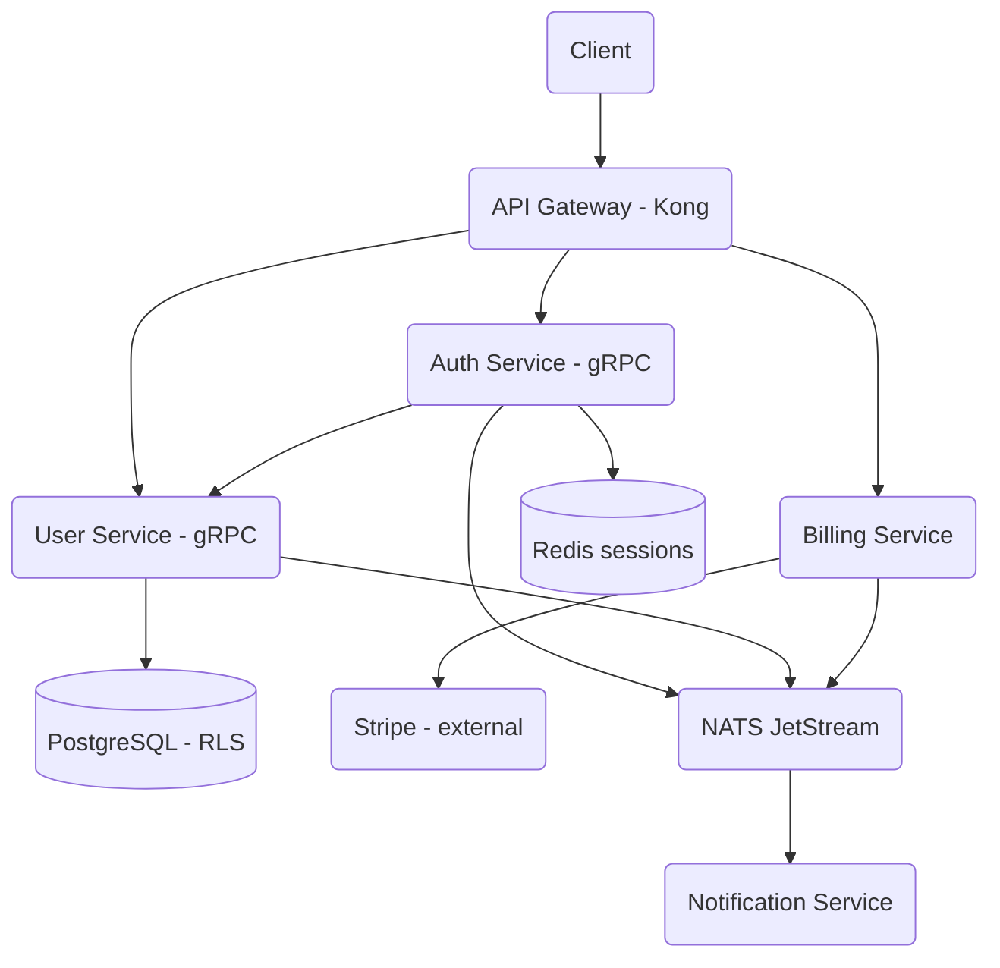

# Microservice Platform

A multi-tenant microservice platform built from scratch in Go, centered on user
management and JWT authentication with gRPC inter-service communication, Redis-backed
sessions, PostgreSQL row-level security for tenant isolation, and a NATS JetStream event
bus. Billing (Stripe) and notification (multi-channel) services are included as
additional, credential-gated components.

## Features

- **RS256 JWT auth** — access/refresh token pairs signed with RSA, with claims for user,
  tenant, roles, permissions, and session (`JWTManager` / `internal/auth/jwt.go`).
- **Password authentication** — bcrypt verification on login and hashing on user creation
  (`internal/auth/service.go`, `internal/user/service.go`).
- **Redis session store** — sessions persisted with TTL and indexed per user for listing
  and bulk revocation (`SessionRepository` / `internal/auth/session.go`).
- **User CRUD** — create, get, update, delete, list (paginated), and lookup-by-email over
  a `pgx` connection pool (`Repository` / `internal/user/repository.go`).
- **Multi-tenant isolation** — every query is keyed by `tenant_id`, backed by PostgreSQL
  row-level security policies using `app.current_tenant` (`internal/common/database.go`,
  `migrations/user/000001_init_schema.up.sql`).
- **gRPC services** — user and auth services run gRPC servers with logging interceptors,
  health checks, and reflection (`cmd/user-service`, `cmd/auth-service`).
- **Event bus** — domain events (`user.*`, `auth.*`, `billing.*`) published to and consumed
  from NATS JetStream (`EventBus` / `pkg/events/eventbus.go`).
- **Structured logging** — `slog`-based logger with tenant/user/context enrichment
  (`Logger` / `internal/common/logger.go`).
- **Protobuf IDLs** — service contracts for user, auth, billing, notification, and common
  types (`proto/`).
- **Billing service** — Stripe SDK integration for customers, subscriptions, invoices, and
  payment methods (`services/billing-service/internal/stripe`).
- **Notification service** — async Python service rendering templates and dispatching over
  email/SMS/webhook providers (`services/notification-service`).

## Architecture



| Component | Module | Responsibility |
|-----------|--------|----------------|
| Auth service | `internal/auth`, `cmd/auth-service` | Login, register, refresh, validate, logout |
| JWT manager | `internal/auth/jwt.go` | RS256 token issuance and verification |
| Session store | `internal/auth/session.go` | Redis-backed session lifecycle |
| User service | `internal/user`, `cmd/user-service` | User CRUD and email lookup |
| User repository | `internal/user/repository.go` | `pgx` data access, pagination, roles |
| Common | `internal/common` | Config, logger, database pool, tenant context |
| Event bus | `pkg/events/eventbus.go` | NATS JetStream publish/subscribe |
| Billing | `services/billing-service` | Stripe customers, subscriptions, invoices |
| Notification | `services/notification-service` | Multi-channel async delivery |

## Quick Start

### Prerequisites

- Go 1.23+
- Docker and Docker Compose (for PostgreSQL, Redis, NATS, and optional Kong/observability)
- `protoc` with the Go and gRPC plugins (only needed to regenerate protobuf code)

The unit tests run with no external services. PostgreSQL, Redis, and NATS are only required
to run the services end to end.

### Installation

```bash
cd 02-microservice-platform
go mod download
```

### Running

```bash
# Start infrastructure (databases, redis, nats, jaeger, prometheus, grafana)
make infra-up

# Run a service directly
go run ./cmd/auth-service     # gRPC on :9090 by default
go run ./cmd/user-service     # gRPC on :9090 by default
```

## Usage

The auth and JWT logic are exercised directly as a Go package. Minimal example using the
real `JWTManager` public API:

```go
package main

import (
	"fmt"
	"time"

	"github.com/mlai/microservice-platform/internal/auth"
)

func main() {
	// nil keys => a development RSA key pair is generated in-process
	mgr, err := auth.NewJWTManager(nil, nil, 15*time.Minute, 7*24*time.Hour)
	if err != nil {
		panic(err)
	}

	pair, err := mgr.GenerateTokenPair(
		"user-123", "tenant-456", "user@example.com", "session-789",
		[]string{"admin"}, []string{"read", "write"},
	)
	if err != nil {
		panic(err)
	}

	claims, err := mgr.ValidateToken(pair.AccessToken)
	if err != nil {
		panic(err)
	}

	fmt.Println(claims.UserID, claims.TenantID, claims.TokenType) // user-123 tenant-456 access
}
```

## What's Real vs Simulated

- **Real:** JWT generation/validation/refresh (RS256), bcrypt password hashing and
  verification, the user repository against PostgreSQL via `pgx`, the Redis session
  repository, configuration and structured logging, the NATS JetStream event bus, and the
  Stripe client wrapper in the billing service. Multi-tenant row-level security is defined
  in the migrations and applied by setting `app.current_tenant`.
- **Simulated / requires credentials:** The gRPC servers in `cmd/` register only the
  health service — protobuf service registration is a placeholder (the request/response
  types in `internal/{auth,user}/service.go` stand in for generated code), and the auth
  service's user client is a mock. The API gateway is external Kong configuration, not Go
  code. Billing needs a Stripe API key; the notification service needs SendGrid/Twilio/FCM
  credentials and falls back to placeholder addresses when Redis is absent. There is a
  second, larger `src/` service tree (auth/user/billing/notification/gateway) that is not
  built or tested by the top-level module.

## Testing

```bash
# Unit tests for the top-level module (no external services needed)
go test ./internal/... -v

# Benchmarks for token generation/validation
go test ./internal/auth -bench=.
```

The suite covers JWT generation, validation, refresh, invalid/expired tokens, user CRUD
and tenant-isolation logic (via an in-memory mock repository), and configuration loading.
The `make test` target instead builds and tests the separate `services/` Go modules.

## Project Structure

```
02-microservice-platform/
  cmd/
    user-service/      # User gRPC server entry point
    auth-service/      # Auth gRPC server entry point
  internal/
    common/            # Config, logger, pgx pool, tenant context
    user/              # User service, repository, tests
    auth/              # JWT, session store, auth service, tests
  pkg/events/          # NATS JetStream event bus
  proto/               # Protobuf IDLs (user, auth, billing, notification, common)
  migrations/          # PostgreSQL schemas (user, auth)
  services/            # Standalone billing (Go) and notification (Python) services
  deployments/         # Dockerfiles and compose configs
  src/                 # Expanded service tree (gateway, OPA, tracing, k8s/helm)
  docs/BLUEPRINT.md    # Full architecture and design
```

## License

MIT — see [LICENSE](../LICENSE)
