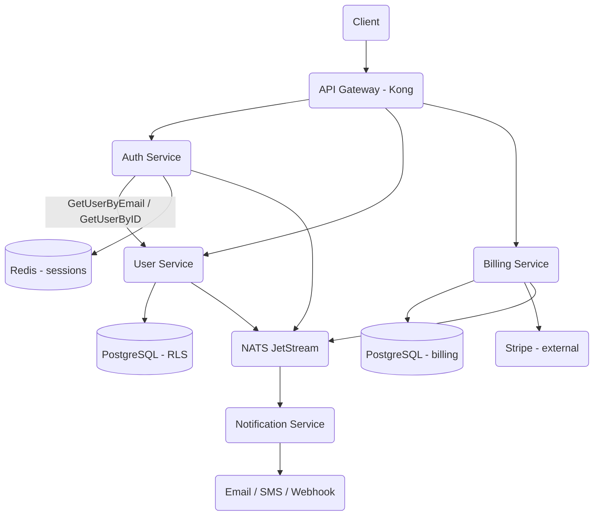

# Microservice Platform

## Overview

This project is a multi-tenant microservice platform written from scratch in Go. It
demonstrates the core building blocks a SaaS backend needs: identity (users), authentication
(JWT), session management, tenant isolation, asynchronous events, and supporting services for
billing and notifications. The emphasis is on the patterns that recur in real platforms —
service decomposition, gRPC contracts, token-based auth, row-level tenant isolation, and an
event bus — implemented at a level that is small enough to read end to end yet faithful to how
the real systems are built.

The platform is organized as a set of independent services that communicate over gRPC and a
shared event bus:

- **User service** — the system of record for users, roles, and tenants. It owns the
  PostgreSQL `users`, `roles`, `user_roles`, and `tenants` tables and exposes CRUD plus an
  email lookup used by the auth service.
- **Auth service** — authenticates users (bcrypt password verification), issues and validates
  RS256 JWT access/refresh token pairs, and manages sessions in Redis. It depends on the user
  service for user data.
- **Billing service** — wraps the Stripe SDK to manage customers, subscriptions, invoices, and
  payment methods, and persists local copies of subscription state.
- **Notification service** — a Python `asyncio` service that renders templates and delivers
  notifications across email, SMS, and webhook providers.
- **Common library** (`internal/common`) — configuration loading, structured logging, a `pgx`
  connection pool, and tenant-context helpers shared by the Go services.
- **Event bus** (`pkg/events`) — a NATS JetStream wrapper for publishing and subscribing to
  domain events.

The concepts this project teaches are: how to draw service boundaries around bounded contexts;
how stateless JWT auth interacts with stateful sessions; how to enforce multi-tenancy at the
database layer with row-level security rather than relying solely on application checks; how to
decouple services with an event bus; and how to wrap an external SaaS API (Stripe) behind a
local domain model.

Scope is deliberately bounded. The Go services compile and the auth, JWT, user-repository,
session, config, and event-bus code is fully implemented; the gRPC entry points wire up servers
but register only the health service, leaving generated-protobuf registration as a placeholder.
The platform is a learning-grade reference, not a hardened production deployment.

## Architecture



The platform follows a service-per-bounded-context layout. Each service owns its data and
exposes a gRPC contract defined in `proto/`. Synchronous calls (auth asking the user service for
a user record) travel over gRPC; loosely-coupled reactions (sending a welcome email after a user
is created) travel over the NATS JetStream event bus on the `events.>` subject hierarchy.

The runtime layers are:

- **Edge.** An API gateway (Kong, configured outside the Go code in `infra/kong/kong.yml`)
  terminates client traffic, routes to services, and is the natural place for rate limiting and
  JWT verification at the boundary.
- **Services.** Go services built around three internal packages each: a transport entry point
  in `cmd/`, business logic in `internal/<service>/service.go`, and persistence in
  `repository.go` (PostgreSQL) or `session.go` (Redis).
- **Shared library.** `internal/common` provides the cross-cutting pieces — `Config`, `Logger`,
  `Database`, and tenant-context helpers — so each service reads configuration, logs, and
  connects to PostgreSQL the same way.
- **Data.** PostgreSQL per logical domain (users, auth audit, billing) with row-level security
  for tenant isolation; Redis for sessions; NATS JetStream for durable events.

### Request lifecycle

A typical authenticated request flows like this:

1. The client logs in through the gateway, which forwards to the auth service.
2. The auth service fetches the user by email and tenant from the user service, verifies the
   bcrypt password hash, creates a Redis session, and returns an RS256 access/refresh token pair.
3. The client sends subsequent requests with the access token. The gateway (or a service
   interceptor) validates the token's signature and claims.
4. Services scope every database operation to the caller's `tenant_id`, and PostgreSQL row-level
   security provides a second enforcement layer via the `app.current_tenant` session variable.
5. State changes publish domain events (`user.created`, `auth.login`, `billing.subscription.created`)
   that downstream services consume asynchronously.

## Core Components

### Auth Service (`internal/auth/service.go`)

The auth service is the platform's identity gateway. It exposes `Login`, `Logout`,
`RefreshToken`, `ValidateToken`, and `Register`, each implemented as a method on `Service`.

`Service` holds four dependencies: a `*SessionRepository` (Redis), a `*JWTManager`, a
`UserServiceClient` interface for talking to the user service, and a `*common.Logger`. Wiring the
user service behind an interface keeps the auth logic testable and lets the gRPC entry point swap
in a mock client during development.

`Login` is the centerpiece. It validates that email, password, and tenant ID are present;
fetches the user via `userClient.GetUserByEmail`; rejects inactive accounts; verifies the
password with `bcrypt.CompareHashAndPassword`; creates a session with a seven-day expiry; and
finally issues a token pair. Every gRPC-facing error is mapped to an appropriate
`google.golang.org/grpc/codes` status (`InvalidArgument`, `Unauthenticated`, `PermissionDenied`,
`Internal`), so callers get meaningful failures without leaking which check failed — invalid
credentials and unknown users both return `Unauthenticated` with the same message.

```go
func (s *Service) Login(ctx context.Context, req *LoginRequest) (*LoginResponse, error) {
    if req.Email == "" {
        return nil, status.Error(codes.InvalidArgument, "email is required")
    }
    // ... tenant_id and password checks ...

    user, err := s.userClient.GetUserByEmail(ctx, req.Email, req.TenantID)
    if err != nil {
        if errors.Is(err, ErrUserNotFound) {
            return nil, status.Error(codes.Unauthenticated, "invalid credentials")
        }
        return nil, status.Error(codes.Internal, "authentication failed")
    }

    if user.Status != "active" {
        return nil, status.Error(codes.PermissionDenied, "user account is not active")
    }

    if err := bcrypt.CompareHashAndPassword(
        []byte(user.PasswordHash), []byte(req.Password)); err != nil {
        s.logger.WithTenant(req.TenantID).Warn("failed login attempt", "email", req.Email)
        return nil, status.Error(codes.Unauthenticated, "invalid credentials")
    }
    // ... create session, generate tokens ...
}
```

`RefreshToken` validates the refresh token, confirms the backing session still exists in Redis,
re-fetches the user (so role/permission changes propagate into freshly minted tokens), updates the
session's `LastActivity`, and issues a new pair. `Logout` parses the access token to find the
session ID and deletes the session; it tolerates an expired access token so a logout still
succeeds. `Register` delegates user creation to the user service, then creates a session and
issues tokens, returning the same shape as `Login`.

### JWT Manager (`internal/auth/jwt.go`)

`JWTManager` encapsulates all token cryptography. It is constructed with optional PEM-encoded RSA
keys; when none are supplied it generates a fresh 2048-bit key pair in process, which is what the
development entry points and tests use. The issuer is `microservice-platform` and the audience is
`microservice-platform-api`.

`GenerateTokenPair` builds two `TokenClaims` values. The access token carries the full identity
context — user ID, tenant ID, email, roles, permissions, session ID, and `type: "access"` — plus
standard registered claims (issuer, subject, audience, `exp`, `iat`, `nbf`, and a unique `jti`).
The refresh token carries a minimal claim set and `type: "refresh"`. Both are signed with
`SigningMethodRS256` using the private key. `ExpiresIn` is reported in seconds derived from the
configured access-token expiry.

`ValidateToken` parses with `jwt.ParseWithClaims`, explicitly rejecting any token whose signing
method is not RSA (a defense against algorithm-substitution attacks), and verifies the signature
with the public key. It distinguishes expiry (`ErrExpiredToken`) from all other failures
(`ErrInvalidToken`) so callers can decide whether a refresh is appropriate.

`RefreshAccessToken` validates a refresh token, asserts its `type` is `refresh`, and issues a new
pair carrying caller-supplied roles, permissions, and email — letting the auth service inject the
latest user attributes rather than trusting stale values embedded in the old token.

### Session Repository (`internal/auth/session.go`)

Sessions are stored in Redis, keyed `session:<id>`, with a TTL equal to the time remaining until
the session's `ExpiresAt`. Each session is JSON-serialized and carries user ID, tenant ID, IP
address, user agent, and creation/expiry/last-activity timestamps.

The repository maintains a secondary index — a Redis set at `session:user:<userID>` — so all of a
user's sessions can be listed (`GetUserSessions`) or revoked at once (`DeleteUserSessions`), which
is what "log out everywhere" and forced-revocation flows need. `Create` writes both the session
key and the index entry with matching TTLs; `Delete` reads the session first to find the owning
user, removes the session key, and prunes the index. `GetByID` maps a Redis miss to
`ErrSessionNotFound`. `HealthCheck` pings Redis for readiness probes.

### User Service (`internal/user/service.go`)

The user service implements `CreateUser`, `GetUser`, `UpdateUser`, `DeleteUser`, `ListUsers`, and
`GetUserByEmail`. It validates required fields, hashes passwords with `bcrypt.DefaultCost` on
creation, and translates repository sentinel errors (`ErrUserAlreadyExists`, `ErrUserNotFound`)
into gRPC status codes (`AlreadyExists`, `NotFound`).

`UpdateUser` reads the existing record, applies only the fields present in the request (the
update request uses pointer fields so "set to empty" is distinguishable from "leave unchanged"),
and writes the result. `GetUser` also loads the user's roles via a join through `user_roles`.
`ListUsers` clamps the page size to a default of 20 and a maximum of 100 before delegating to the
repository's keyset pagination. A `userToProto` helper converts the internal `User` domain type
into the protobuf-shaped `UserProto`, including `timestamppb` conversion of timestamps.

### User Repository (`internal/user/repository.go`)

The repository is the PostgreSQL data-access layer, built on a `pgxpool.Pool`. Every query that
reads or mutates a user is scoped by `tenant_id` in addition to the primary key, so tenant
isolation holds even before row-level security is considered.

`Create` assigns a UUID and timestamps, defaults `status` to `active`, inserts, and returns the
stored row. `GetByID`, `GetByEmail`, `Update`, and `Delete` are all tenant-scoped and map
`pgx.ErrNoRows` (or a zero rows-affected result on delete) to `ErrUserNotFound`.

`List` implements keyset pagination: it filters by tenant and optional status, applies an
`id > pageToken` cursor, orders by `id`, and fetches `pageSize + 1` rows to detect whether a next
page exists. If the extra row is present, the last in-page ID becomes the next page token. A
separate count query reports the tenant's total. `GetRoles` joins `roles` and `user_roles` to
return a user's role names.

### Common Library (`internal/common`)

`Config` is loaded entirely from environment variables with sensible development defaults:
gRPC port `9090`, HTTP port `8080`, a local PostgreSQL DSN, `redis://localhost:6379`, a 15-minute
access-token expiry, and a 7-day refresh-token expiry. `getDurationEnv` interprets numeric
environment values as minutes.

`Logger` wraps `log/slog`. In `production` it emits JSON at info level; otherwise it emits text at
debug level. `WithTenant`, `WithUser`, and `WithContext` return enriched loggers that attach
`tenant_id`, `user_id`, and trace/request identifiers to every line — the basis for log
correlation across services.

`Database` wraps a `pgxpool.Pool` configured with a 25-connection ceiling, a 5-connection floor,
hour-long maximum connection lifetime, and periodic health checks. Crucially it provides
`SetTenantContext` and `WithTenant`, which run `SET app.current_tenant = $1` so PostgreSQL
row-level security policies can filter rows to the active tenant.

### Event Bus (`pkg/events/eventbus.go`)

The event bus is a thin wrapper over NATS JetStream. On construction it connects with reconnect
handlers, obtains a JetStream context, and ensures an `EVENTS` stream exists that captures the
`events.>` subject space with file storage and a 7-day retention window.

`Event` is the canonical envelope: an ID, type, tenant ID, UTC timestamp, schema version, a
free-form `data` map, a metadata map, the source service, and a correlation ID. `Publish`
serializes the event and publishes it to `events.<type>`. `Subscribe` creates a durable consumer
(named from the service plus a sanitized pattern), unmarshals incoming messages, invokes the
handler, and acknowledges or negatively-acknowledges based on the handler result so failures are
redelivered. The package also ships constructor helpers (`UserCreatedEvent`, `LoginEvent`,
`SubscriptionCreatedEvent`, `PaymentSucceededEvent`, and others) that standardize event payloads.

### Billing Service (`services/billing-service`)

The billing service wraps the Stripe Go SDK (`stripe-go/v76`) behind a `Client`. It can create and
retrieve customers; create, get, update (plan change with optional proration), and cancel
subscriptions (immediately or at period end); attach and set default payment methods; and list
invoices. Conversion helpers (`SubscriptionToModel`, `InvoiceToModel`, `PaymentMethodToModel`)
translate Stripe objects into the service's own domain models, and every subscription is tagged
with `tenant_id` and `user_id` in Stripe metadata so external records stay correlated with local
ones. This service is a separate Go module and requires a Stripe API key to run.

### Notification Service (`services/notification-service`)

The notification service is an `asyncio` Python application. `NotificationService.send` checks the
recipient's preferences (channel toggles, category unsubscribes, and quiet hours read from Redis),
resolves the template and the recipient's channel address, validates the address with the
provider, renders channel-appropriate content via a Jinja-style template engine, dispatches
through the matching provider (SendGrid for email, Twilio for SMS, a webhook provider), and records
delivery status in Redis with a 7-day TTL. `send_batch` fans out concurrently with
`asyncio.gather`. Providers require their respective credentials; without Redis the service falls
back to placeholder recipient addresses for local testing.

## Event-Driven Design

Synchronous gRPC handles request/response interactions where the caller needs an immediate
answer (auth fetching a user). Everything else — reactions, fan-out, and side effects that
should not block the originating request — flows asynchronously through the event bus. This keeps
services loosely coupled: the user service does not know that a notification service exists; it
simply announces `user.created`, and any number of consumers may react.

### Event taxonomy

`pkg/events/eventbus.go` defines the canonical event types as constants, grouped by the service
that emits them:

```go
// User events
EventUserCreated = "user.created"
EventUserUpdated = "user.updated"
EventUserDeleted = "user.deleted"

// Auth events
EventUserLoggedIn   = "auth.login"
EventUserLoggedOut  = "auth.logout"
EventTokenRefreshed = "auth.token_refreshed"
EventUserRegistered = "auth.registered"

// Billing events
EventSubscriptionCreated  = "billing.subscription.created"
EventSubscriptionUpdated  = "billing.subscription.updated"
EventSubscriptionCanceled = "billing.subscription.canceled"
EventPaymentSucceeded     = "billing.payment.succeeded"
EventPaymentFailed        = "billing.payment.failed"
EventInvoiceCreated       = "billing.invoice.created"
EventInvoicePaid          = "billing.invoice.paid"
```

The dotted namespace (`<service>.<aggregate>.<action>`) maps cleanly onto NATS subjects: events are
published to `events.<type>`, and the `EVENTS` stream captures the entire `events.>` subject space.
A consumer can therefore subscribe narrowly (`billing.payment.succeeded`) or broadly (`billing.>`)
without the producer needing to know.

### Delivery semantics

Publishing serializes the `Event` envelope to JSON and writes it to JetStream, which persists it to
disk before acknowledging — so an event survives a producer crash immediately after publish.
Consumers are durable: `Subscribe` derives a stable consumer name from the service name and a
sanitized subject pattern, so a restarting consumer resumes from where it left off rather than
replaying the whole stream or missing messages while it was down. Each message is processed under
manual acknowledgment: the handler runs, and the message is `Ack`-ed on success or `Nak`-ed on
failure, which asks JetStream to redeliver. This yields at-least-once delivery, so consumers must
be idempotent — keying side effects on the event ID is the intended pattern.

### Correlation

Every event carries a `CorrelationID` and a `Metadata` map. Combined with the structured logger's
`WithContext` (which propagates `trace_id`, `request_id`, and `tenant_id`), this lets an operator
follow a single user action across the synchronous gRPC hop and the asynchronous event hops in the
logs — the practical payoff of distributed observability in a system this size.

## Cross-Cutting Concerns

The expanded service tree under `src/` implements the platform-wide concerns that every service
shares — resilience, authorization, rate limiting, and multi-factor authentication. These are
factored into reusable packages so that no single service reinvents them.

### Resilience: circuit breaking (`src/pkg/resilience/circuitbreaker.go`)

Synchronous gRPC calls between services (auth to user, gateway to billing) are wrapped in a
circuit breaker so a failing dependency degrades gracefully instead of cascading. `CircuitBreaker`
is a classic three-state machine — `Closed`, `Open`, `HalfOpen` — built around a mutex-guarded
failure counter.

```go
type State int

const (
    StateClosed State = iota
    StateOpen
    StateHalfOpen
)

type Config struct {
    Name        string
    MaxFailures int           // failures before opening (default 5)
    Timeout     time.Duration // how long to stay open (default 30s)
    HalfOpenMax int           // probe successes before closing (default 3)
}
```

In the closed state calls pass through and failures are counted; once failures reach
`MaxFailures`, the breaker opens and short-circuits subsequent calls with `ErrCircuitOpen`. After
`Timeout` elapses it transitions to half-open and admits a limited number of probe requests; if
those succeed it closes, and if any fails it reopens. A configurable `onStateChange` callback lets
the platform emit metrics on every transition. The defaults (5 failures, 30 s timeout, 3 half-open
probes) are applied when a caller leaves the config zero-valued.

### Authorization: OPA policy engine (`src/internal/opa/opa.go`)

Coarse authentication (who you are) lives in the auth service; fine-grained authorization (what
you may do) is delegated to an Open Policy Agent integration so policy can evolve independently of
service code. `PolicyEngine` loads Rego policies from a directory, prepares evaluation queries, and
can hot-reload them on an interval.

```go
type AuthzInput struct {
    Subject  Subject  `json:"subject"`
    Action   string   `json:"action"`
    Resource Resource `json:"resource"`
    Context  AuthzCtx `json:"context"`
}

type Subject struct {
    UserID   string   `json:"user_id"`
    TenantID string   `json:"tenant_id"`
    Roles    []string `json:"roles"`
    Groups   []string `json:"groups"`
}
```

An authorization decision takes a subject (user, tenant, roles, groups), an action, a resource,
and request context, and evaluates them against the loaded policies. Because the subject carries
`TenantID`, policies can enforce tenant-scoped rules in addition to role checks, complementing the
database-level row-level security with an explicit policy layer at the application boundary.

### Rate limiting (`src/internal/gateway/ratelimit.go`)

The gateway protects services with a Redis-backed sliding-window rate limiter. `RateLimiter.Allow`
runs a single Redis pipeline that prunes timestamps older than the window, counts the survivors,
records the current request, and refreshes the key's expiry — an atomic sliding window keyed per
caller.

```go
func (r *RateLimiter) Allow(ctx context.Context, key string) (bool, int, error) {
    now := time.Now().UnixMicro()
    windowStart := now - r.config.WindowDuration.Microseconds()

    pipe := r.client.Pipeline()
    pipe.ZRemRangeByScore(ctx, key, "0", fmt.Sprintf("%d", windowStart))
    countCmd := pipe.ZCard(ctx, key)
    pipe.ZAdd(ctx, key, redis.Z{Score: float64(now), Member: now})
    pipe.Expire(ctx, key, r.config.WindowDuration)
    // ... exec, compute remaining ...
}
```

The method returns whether the request is allowed plus the remaining budget, which the gateway
surfaces as `X-RateLimit-Remaining`. Using a sorted set scored by microsecond timestamp gives a
true sliding window rather than the coarser bucketing of a fixed-window counter.

### Multi-factor authentication (`src/internal/auth/mfa.go`)

The MFA package implements TOTP from first principles — HMAC over a time counter, truncated and
reduced to a numeric code — alongside SMS, email, and single-use recovery-code methods.

```go
type MFAMethod string

const (
    MFAMethodTOTP     MFAMethod = "totp"
    MFAMethodSMS      MFAMethod = "sms"
    MFAMethodEmail    MFAMethod = "email"
    MFAMethodRecovery MFAMethod = "recovery"
)

type MFAConfig struct {
    Issuer          string
    TOTPDigits      int
    TOTPPeriod      int
    TOTPSkew        int // periods of clock-skew tolerance
    RecoveryCodeLen int
    RecoveryCodeNum int
}
```

`TOTPSkew` allows a configurable number of time steps on either side of the current period so that
small clock differences between the client authenticator and the server do not reject otherwise
valid codes. Recovery codes are single-use; `ErrMFARecoveryUsed` guards against replay. The
`auth.proto` `InitiateMFA`/`VerifyMFA` RPCs are the contract this engine fulfills.

## Data Structures

### Token claims and pair

```go
type TokenClaims struct {
    jwt.RegisteredClaims
    UserID      string   `json:"uid"`
    TenantID    string   `json:"tid"`
    Email       string   `json:"email"`
    Roles       []string `json:"roles"`
    Permissions []string `json:"perms"`
    SessionID   string   `json:"sid"`
    TokenType   string   `json:"type"` // access or refresh
}

type TokenPair struct {
    AccessToken  string
    RefreshToken string
    ExpiresIn    int64 // seconds
}
```

### Session

```go
type Session struct {
    ID           string    `json:"id"`
    UserID       string    `json:"user_id"`
    TenantID     string    `json:"tenant_id"`
    IPAddress    string    `json:"ip_address"`
    UserAgent    string    `json:"user_agent"`
    CreatedAt    time.Time `json:"created_at"`
    ExpiresAt    time.Time `json:"expires_at"`
    LastActivity time.Time `json:"last_activity"`
}
```

### User domain type

```go
type User struct {
    ID            string
    TenantID      string
    Email         string
    EmailVerified bool
    PasswordHash  string
    FirstName     string
    LastName      string
    AvatarURL     string
    Status        string // active, inactive, suspended
    Metadata      map[string]string
    Roles         []string
    CreatedAt     time.Time
    UpdatedAt     time.Time
}
```

### Event envelope

```go
type Event struct {
    ID            string                 `json:"event_id"`
    Type          string                 `json:"event_type"`
    TenantID      string                 `json:"tenant_id"`
    Timestamp     time.Time              `json:"timestamp"`
    Version       string                 `json:"version"`
    Data          map[string]interface{} `json:"data"`
    Metadata      map[string]string      `json:"metadata"`
    SourceService string                 `json:"source_service"`
    CorrelationID string                 `json:"correlation_id"`
}
```

### Database schema (user service)

The user database is the heart of tenant isolation. Tenants own users, roles, and the
`user_roles` join; users are unique per `(tenant_id, email)`; and row-level security policies
restrict every read to the active tenant.

```sql
CREATE TABLE users (
    id UUID PRIMARY KEY DEFAULT uuid_generate_v4(),
    tenant_id UUID NOT NULL REFERENCES tenants(id) ON DELETE CASCADE,
    email VARCHAR(255) NOT NULL,
    email_verified BOOLEAN DEFAULT FALSE,
    password_hash VARCHAR(255),
    first_name VARCHAR(100),
    last_name VARCHAR(100),
    avatar_url TEXT,
    status VARCHAR(20) DEFAULT 'active',
    metadata JSONB DEFAULT '{}',
    created_at TIMESTAMPTZ DEFAULT NOW(),
    updated_at TIMESTAMPTZ DEFAULT NOW(),
    UNIQUE(tenant_id, email)
);

ALTER TABLE users ENABLE ROW LEVEL SECURITY;

CREATE POLICY tenant_isolation_users ON users
    USING (tenant_id = current_setting('app.current_tenant', true)::UUID);
```

Roles carry a JSONB permissions array, and seed data inserts a default tenant plus `admin`,
`user`, and `viewer` roles. Indexes cover `tenant_id`, `email`, `status`, and `created_at` on
users, and the join columns on `user_roles`. A trigger keeps `updated_at` current on writes.

The auth database (`migrations/auth`) is separate and small: it holds a `token_blacklist` for
revocation and an `auth_audit_log` for login/logout/refresh events, both with their own indexes
and RLS policy. Sessions themselves live in Redis, not PostgreSQL.

## API Design

Service contracts are defined as protobuf IDLs in `proto/`. The internal Go services currently
mirror these contracts with hand-written request/response structs in their `service.go` files;
the generated protobuf bindings are wired as a placeholder in the gRPC entry points.

### Auth service (`proto/auth/auth.proto`)

```
service AuthService {
    rpc Login(LoginRequest) returns (LoginResponse);
    rpc Logout(LogoutRequest) returns (LogoutResponse);
    rpc RefreshToken(RefreshTokenRequest) returns (TokenResponse);
    rpc ValidateToken(ValidateTokenRequest) returns (ValidateTokenResponse);
    rpc InitiateMFA(InitiateMFARequest) returns (MFAChallenge);
    rpc VerifyMFA(VerifyMFARequest) returns (TokenResponse);
    rpc Register(RegisterRequest) returns (RegisterResponse);
}
```

`Login`, `Logout`, `RefreshToken`, `ValidateToken`, and `Register` are implemented in
`internal/auth/service.go`. The MFA RPCs are declared in the proto but not implemented in the
top-level module.

### User service (`proto/user/user.proto`)

```
service UserService {
    rpc CreateUser(CreateUserRequest) returns (CreateUserResponse);
    rpc GetUser(GetUserRequest) returns (GetUserResponse);
    rpc UpdateUser(UpdateUserRequest) returns (UpdateUserResponse);
    rpc DeleteUser(DeleteUserRequest) returns (DeleteUserResponse);
    rpc ListUsers(ListUsersRequest) returns (ListUsersResponse);
    rpc GetUserByEmail(GetUserByEmailRequest) returns (GetUserByEmailResponse);
}
```

`ListUsersRequest` embeds a shared `common.v1.PaginationRequest`, and `GetUserByEmailResponse`
optionally returns the password hash for internal auth-service use only. All six RPCs are
implemented in `internal/user/service.go`.

### Billing service (`proto/billing/billing.proto`)

```
service BillingService {
    rpc CreateSubscription(...) returns (...);
    rpc GetSubscription(...) returns (...);
    rpc UpdateSubscription(...) returns (...);
    rpc CancelSubscription(...) returns (...);
    rpc ListSubscriptions(...) returns (...);
    rpc CreatePaymentMethod(...) returns (...);
    rpc ListInvoices(...) returns (...);
    rpc GetUsage(...) returns (...);
}
```

### Public Go API surface

The most directly reusable interface is the JWT manager:

```
NewJWTManager(privateKeyPEM, publicKeyPEM []byte, accessExpiry, refreshExpiry time.Duration) (*JWTManager, error)
(*JWTManager) GenerateTokenPair(userID, tenantID, email, sessionID string, roles, permissions []string) (*TokenPair, error)
(*JWTManager) ValidateToken(tokenString string) (*TokenClaims, error)
(*JWTManager) RefreshAccessToken(refreshTokenString string, roles, permissions []string, email string) (*TokenPair, error)
(*JWTManager) GetPublicKey() *rsa.PublicKey
```

The session repository and user repository expose analogous CRUD methods, and the event bus
exposes `NewEventBus`, `Publish`, `Subscribe`, and `Close`.

## Performance

The platform's design choices favor predictable latency and horizontal scalability over raw
throughput numbers; the repository ships unit benchmarks rather than load-test results, so the
figures below are design intents, not measured SLAs.

### Connection pooling

The PostgreSQL pool (`internal/common/database.go`) is sized for steady-state service load: a
maximum of 25 connections and a minimum of 5 warm connections per service instance, with a
one-hour maximum connection lifetime and 30-minute idle timeout to recycle stale connections.
Sizing the floor above zero avoids cold-start latency on the first request after an idle period.

### Stateless tokens, stateful sessions

RS256 token validation needs only the public key and no network round-trip, so the gateway and
services can verify tokens locally — the cheap, hot path. The trade-off is that revocation is not
instantaneous for the access token's 15-minute lifetime; the session in Redis and the
`token_blacklist` table provide the revocation mechanism for refresh and logout flows. Short
access-token lifetimes bound the exposure window.

### Pagination

`ListUsers` uses keyset (cursor) pagination rather than `OFFSET`, so page retrieval stays
constant-time as the dataset grows — the `id > $token ORDER BY id LIMIT $n+1` pattern reads only
the next page's worth of rows regardless of how deep into the result set the caller is.

### Event bus

JetStream persists events to disk with a 7-day retention window and durable consumers, decoupling
producers from consumers: a slow or temporarily-down notification service does not block the user
or billing services, and unacknowledged events are redelivered rather than lost.

### Benchmarks

`internal/auth/jwt_test.go` includes `BenchmarkJWTManager_GenerateTokenPair` and
`BenchmarkJWTManager_ValidateToken`. Run them with `go test ./internal/auth -bench=.` to measure
RSA signing and verification cost on the target hardware. RSA signing (token generation) is the
more expensive of the two operations, which reinforces the design choice to make validation — the
high-frequency operation performed on every authenticated request — the cheaper path, while signing
happens only at login and refresh.

### Observability

The platform is built to be observable. The structured logger emits machine-parseable JSON in
production and attaches `service`, and on demand `tenant_id`, `user_id`, `trace_id`, and
`request_id`, to every line. The expanded `src/pkg` tree adds Prometheus metrics
(`src/pkg/metrics`) and OpenTelemetry tracing (`src/pkg/tracing`) with gRPC and HTTP interceptors,
so latency histograms and distributed traces can be collected without touching business logic.
`make infra-up` provisions Jaeger, Prometheus, and Grafana so these signals have somewhere to land
during end-to-end runs. The event bus's correlation ID ties asynchronous work back to the
originating request in all three signal types.

### Scaling posture

Because the Go services are stateless (all durable state lives in PostgreSQL, Redis, or NATS), they
scale horizontally: additional instances behind the gateway share the same data stores and the same
JetStream durable consumers. The connection-pool ceiling is per instance, so total database load
scales with instance count and must be sized against the database's own connection limit — the
reason production deployments would front PostgreSQL with a pooler. Redis and NATS are similarly
shared infrastructure that all instances coordinate through.

## Testing Strategy

### Unit tests

The top-level module's tests run with no external dependencies:

- **JWT (`internal/auth/jwt_test.go`).** Generation and validation round-trips assert that every
  claim survives a sign/verify cycle and that access vs refresh token types are correct. Negative
  tests confirm an invalid token returns `ErrInvalidToken`, an expired token (created with a
  1 ms expiry) returns `ErrExpiredToken`, refreshing with a refresh token rotates roles and
  permissions, and refreshing with an *access* token is rejected.
- **User service (`internal/user/service_test.go`).** A hand-written in-memory `mockRepository`
  stands in for PostgreSQL so the CRUD and tenant logic can be exercised deterministically. Tests
  cover create, duplicate rejection, get, not-found, wrong-tenant isolation (fetching a user under
  a different tenant must fail), update (and that `updated_at` advances past `created_at`), delete,
  list with tenant filtering, and email lookup.
- **Config and logging (`internal/common/config_test.go`).** Verify default values, environment
  overrides, the `getEnv`/`getDurationEnv` helpers, and that the logger and its
  `WithTenant`/`WithUser` enrichers construct correctly.

### Integration testing

End-to-end exercises (auth flows that span the auth and user services, repository tests against a
real PostgreSQL with RLS engaged, Redis-backed session lifecycle, and NATS publish/consume) require
the infrastructure from `make infra-up`. These confirm that tenant isolation holds at the database
layer, that `app.current_tenant` filtering matches the application-level `tenant_id` scoping, and
that events published by one service are durably delivered to another.

### Edge cases

The most important correctness boundaries the design targets are: cross-tenant access attempts
(must return not-found, never another tenant's data); algorithm-substitution attacks on JWTs
(rejected by the explicit RSA-method check in `ValidateToken`); expired vs invalid tokens (must be
distinguishable so the client knows whether to refresh); logout with an already-expired access
token (must still revoke the session); and duplicate user creation (must return `AlreadyExists`).

### Service-level tests

The standalone services under `services/` (billing in Go, notification in Python) have their own
modules and dependencies. The `make test` target builds and tests the Go services; the billing
service's Stripe paths require API credentials and so are validated against Stripe test keys rather
than in the dependency-free unit suite.

## Design Rationale

A handful of decisions shape the whole platform; they are recorded here with the trade-offs that
motivated them.

### Why per-tenant scoping *and* row-level security

Tenant isolation is enforced twice: every repository query includes `tenant_id` in its `WHERE`
clause, and PostgreSQL row-level security policies independently filter rows to
`app.current_tenant`. The redundancy is deliberate. Application-level scoping is explicit and easy
to read, but a single forgotten predicate in a future query would leak data across tenants. RLS is
a backstop that holds even when application code is wrong — a defense-in-depth posture appropriate
for multi-tenant data. The cost is that the database connection must have its tenant variable set
on every request (`Database.SetTenantContext` / `WithTenant`), which couples request handling to
the connection lifecycle.

### Why stateless tokens with a stateful session

JWTs make the common path cheap: any service or the gateway can verify a token offline with the
public key, no database or Redis round-trip required. The downside of pure JWTs is revocation — a
stolen token is valid until it expires. The platform mitigates this with two mechanisms: a short
15-minute access-token lifetime that bounds the exposure window, and a stateful session in Redis
(plus a `token_blacklist` table) that the refresh and logout flows consult. The refresh path
re-checks the session's existence and re-reads the user, so privilege changes and revocations take
effect within one access-token lifetime. This is the standard hybrid: stateless for the hot path,
stateful where correctness demands it.

### Why an interface for the user-service client

The auth service depends on the user service through the `UserServiceClient` interface rather than
a concrete gRPC client. This keeps the auth business logic unit-testable without a running user
service, and it lets the development entry point inject a mock. It is also the seam at which a real
generated gRPC client would be substituted, and where a circuit breaker (see Cross-Cutting
Concerns) naturally wraps the outbound call.

### Why keyset pagination

`ListUsers` paginates by cursor (`id > token`) rather than `LIMIT/OFFSET`. Offset pagination
degrades linearly — page 1000 must scan and discard the preceding rows — and can skip or duplicate
rows when the underlying data changes between requests. Keyset pagination reads only the next
page's rows and is stable under concurrent inserts, at the cost of not supporting random page jumps
(you can only page forward from a cursor), which is an acceptable limitation for a user list.

### Why RS256 over HS256

Tokens are signed with RSA (asymmetric) rather than an HMAC shared secret. With RS256 only the auth
service holds the private signing key, while every other service and the gateway verify with the
freely distributable public key. A compromised verifier cannot mint tokens. The explicit
RSA-method check in `ValidateToken` closes the classic algorithm-confusion attack in which an
attacker submits an `HS256` token signed with the public key as if it were the HMAC secret.

### Known limitations

The top-level module's gRPC entry points register only the health service; full protobuf service
registration is left as a placeholder, and the auth service ships with a mock user client. MFA, the
gateway, OPA, and resilience packages live in the separate `src/` tree and are not built or tested
by the top-level module. These boundaries are documented honestly in the README's "What's Real vs
Simulated" section so the reference is not mistaken for a turnkey deployment.

## References

- [Microservices patterns](https://microservices.io/patterns/)
- [gRPC documentation](https://grpc.io/docs/)
- [Protocol Buffers](https://protobuf.dev/)
- [JSON Web Tokens (RFC 7519)](https://datatracker.ietf.org/doc/html/rfc7519)
- [PostgreSQL row-level security](https://www.postgresql.org/docs/current/ddl-rowsecurity.html)
- [NATS JetStream](https://docs.nats.io/nats-concepts/jetstream)
- [Stripe API reference](https://stripe.com/docs/api)
- [pgx PostgreSQL driver](https://github.com/jackc/pgx)
