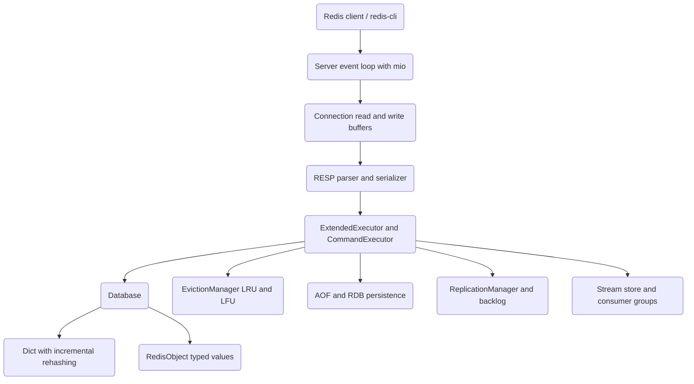

# High-Performance Cache (redis-lite)

A Redis-compatible in-memory caching server written from scratch in Rust. It implements
the RESP serialization protocol, a custom incrementally-rehashing hash table, typed value
objects, approximate LRU/LFU eviction, AOF and RDB persistence, and master-replica
replication primitives — exposed through a command dispatch layer that speaks the Redis
wire protocol.

## Features

- **RESP protocol** — full RESP2 parser and serializer for simple strings, errors,
  integers, bulk strings, and (nested) arrays (`RespValue` / `RespParser` in `resp/`),
  plus a RESP3 value layer (`Resp3Value`).
- **Custom hash table** — `Dict<K, V>` with two-table incremental rehashing (10 buckets
  moved per operation) and random-key sampling for eviction (`storage/dict.rs`).
- **Typed objects** — `RedisObject` covering strings, lists, sets, hashes, and sorted
  sets, with integer-encoded strings (`StringObject::Int`) and a score-sorted `ZSetObject`.
- **Command surface** — strings, lists, sets, hashes, sorted sets, key/TTL, and server
  commands via `CommandExecutor`, extended with Lua scripting and streams via
  `ExtendedExecutor`.
- **Eviction** — `EvictionManager` implements approximate LRU/LFU and random/TTL policies
  using random sampling (default sample size 5), driven by `EvictionPolicy`.
- **Persistence** — append-only file with `Always` / `EverySecond` / `No` fsync policies
  (`AOF` / `FsyncPolicy`) and RDB-style snapshotting (`RDB`).
- **Replication** — `ReplicationManager` with a ring-buffer replication backlog, replica
  registry, offset tracking, partial-resync checks, and replica-to-master promotion.
- **TTL and expiration** — per-key expiry with lazy deletion on access and `TTL`/`PTTL`/
  `PERSIST` support (`storage/database.rs`).
- **Streams** — `Stream`, `StreamId`, `StreamEntry`, and `ConsumerGroup` backing the
  `XADD`/`XREAD`/`XRANGE`/`XGROUP` command family.
- **Transactions** — `MULTI`/`EXEC`/`DISCARD`/`WATCH`/`UNWATCH` queuing with optimistic
  locking (`TransactionContext`).
- **TLS** — `TlsAcceptor` / `TlsConfig` built on `rustls` for encrypted connections.

## Architecture



| Component | Module | Responsibility |
|-----------|--------|----------------|
| Server | `server::Server` | mio-based event loop, accept loop, connection lifecycle |
| Connection | `server::Connection` | Per-client read/write buffering |
| TLS | `server::tls` | rustls-based TLS acceptor and stream |
| RESP | `resp::RespParser` / `RespValue` | Protocol parsing and serialization |
| Dispatch | `commands::CommandExecutor` | Maps command names to handlers |
| Extended dispatch | `commands::ExtendedExecutor` | Adds scripting and stream commands |
| Storage | `storage::Database` | Key-value store, expiration, type ops |
| Hash table | `storage::Dict` | Incrementally-rehashing dictionary |
| Objects | `storage::RedisObject` | Typed string/list/set/hash/zset values |
| Eviction | `eviction::EvictionManager` | Approximate LRU/LFU/random/TTL eviction |
| Persistence | `persistence::AOF` / `RDB` | Append-only log and snapshots |
| Replication | `replication::ReplicationManager` | Backlog, replica tracking, promotion |
| Streams | `storage::Stream` | Stream entries and consumer groups |
| Transactions | `transactions::TransactionContext` | MULTI/EXEC queuing and WATCH |

## Quick Start

### Prerequisites

- Rust 1.75+ (stable) with `cargo`
- No external services are needed to build, run, or test.

### Installation

The crate manifest lives in `src/`, so build from there:

```bash
cd 03-high-performance-cache/src
cargo build
```

### Running

```bash
cargo build --release
./target/release/redis-lite --port 6379
```

Available CLI flags include `--host`, `--port`, `--maxmemory`, `--maxmemory-policy`,
`--databases`, `--appendonly`, `--appendfilename`, `--dbfilename`, `--dir`, and
`--loglevel` (see `bin/main.rs`). Connect with any Redis client:

```bash
redis-cli -p 6379 SET foo bar
redis-cli -p 6379 GET foo
```

## Usage

The command layer is a pure function over `RespValue` arguments and a mutable `Database`,
which makes it easy to drive directly from Rust:

```rust
use redis_lite::commands::CommandExecutor;
use redis_lite::resp::RespValue;
use redis_lite::storage::Database;

let mut db = Database::new();

// SET foo bar
let resp = CommandExecutor::execute(
    "SET",
    &[RespValue::bulk_string("foo"), RespValue::bulk_string("bar")],
    &mut db,
);
assert_eq!(resp, RespValue::ok());

// GET foo
let resp = CommandExecutor::execute(
    "GET",
    &[RespValue::bulk_string("foo")],
    &mut db,
);
assert_eq!(resp, RespValue::BulkString(Some(b"bar".to_vec())));

// INCR counter
let resp = CommandExecutor::execute(
    "INCR",
    &[RespValue::bulk_string("counter")],
    &mut db,
);
assert_eq!(resp, RespValue::Integer(1));
```

Parsing and serializing the wire protocol directly:

```rust
use redis_lite::resp::{RespParser, RespValue};

let mut parser = RespParser::new();
parser.feed(b"*2\r\n$3\r\nGET\r\n$3\r\nfoo\r\n");
let value = parser.parse().unwrap().unwrap();

let bytes = RespValue::ok().serialize();
assert_eq!(bytes, b"+OK\r\n");
```

## What's Real vs Simulated

**Real:** RESP2 parsing/serialization; the `Dict` hash table with incremental rehashing;
the `Database` key-value store with expiration; string/list/set/hash/sorted-set/key/TTL
command handlers; the `EvictionManager` sampling logic; AOF append with all three fsync
policies and RDB snapshot save/load; the `ReplicationManager` backlog, offset tracking,
and promotion; stream storage and consumer groups; transaction queuing; and the
`rustls`-backed TLS acceptor. All of these are exercised by the unit test suite.

**Simulated / partial:**
- **Lua scripting** — `ScriptEngine` runs a small custom interpreter for a Lua-like
  subset (`scripting/mod.rs` notes that full Lua needs `mlua`/`rlua`); it is not a
  complete Lua VM.
- **Pub/Sub commands** — a full `PubSub` registry type exists, but the `PUBLISH`/`PUBSUB`
  command handlers are not wired to it and return placeholder values (`PUBLISH` returns 0)
  because cross-connection client state is not propagated at the command layer.
- **Cluster mode** — `ClusterState` and slot mapping exist, but the executor invokes
  `CLUSTER` with no cluster state, so multi-node sharding and redirection are not active.

## Testing

```bash
cd 03-high-performance-cache/src
cargo test
```

The suite contains 338 unit tests across the storage, RESP, command, eviction,
persistence, replication, and supporting modules. No external services are required.
Run with `cargo test -- --nocapture` to see test output.

## Project Structure

```
03-high-performance-cache/
  README.md                  # This file
  docs/BLUEPRINT.md          # Full architecture and design
  src/
    Cargo.toml               # Crate manifest (build from here)
    lib.rs                   # Crate root and public re-exports
    bin/main.rs              # CLI entry point (clap)
    resp/                    # RESP2/RESP3 parser, value, serializer
    storage/                 # Database, Dict, RedisObject, streams
    commands/                # Command dispatch (strings, lists, sets, ...)
    eviction/                # LRU/LFU/random/TTL eviction manager
    persistence/             # AOF and RDB
    replication/             # Master/replica state and backlog
    pubsub/                  # Channel subscription registry
    transactions/            # MULTI/EXEC/DISCARD/WATCH
    scripting/               # Lua-subset script engine
    cluster/                 # Cluster slot mapping and node state
    server/                  # Event loop, connection, threaded IO, TLS
    config.rs                # Server configuration
```

## License

MIT — see ../LICENSE
