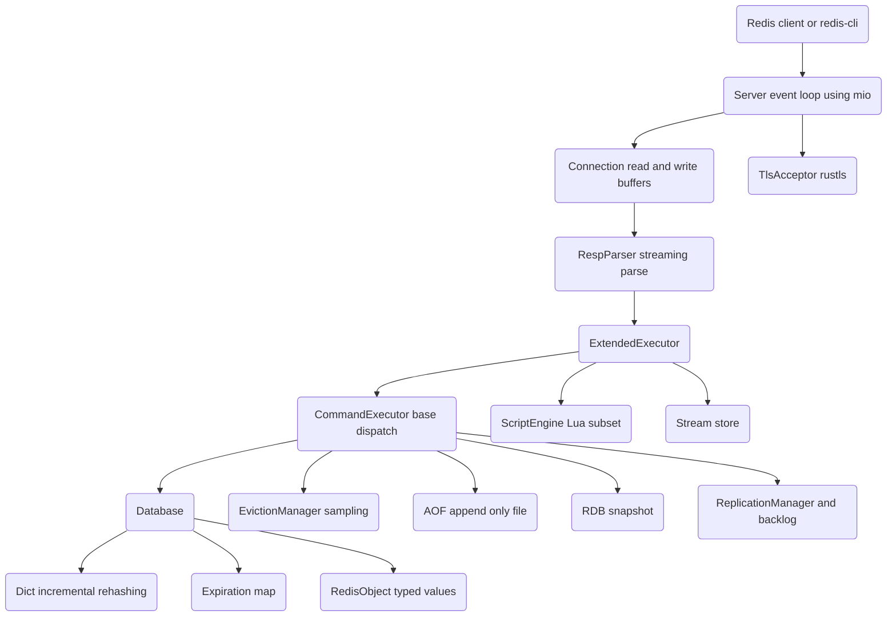

# High-Performance Cache (redis-lite)

## Overview

`redis-lite` is a Redis-compatible in-memory caching server built from scratch in Rust.
It reimplements the moving parts that make Redis fast and durable — the RESP wire
protocol, an incrementally-rehashing hash table, typed value objects, approximate cache
eviction, append-only and snapshot persistence, and master-replica replication — without
depending on an existing Redis implementation.

The project is a teaching vehicle for systems-level concepts that recur across every
production cache and key-value store:

- **Protocol design and parsing.** RESP (the REdis Serialization Protocol) is a simple,
  prefix-typed binary protocol. Implementing a streaming parser that tolerates partial
  reads is the gateway to understanding any length-prefixed wire format.
- **Hash table internals.** Redis avoids stop-the-world rehashes by keeping two tables and
  migrating a bounded number of buckets per operation. The `Dict<K, V>` type reproduces
  this incremental rehashing directly.
- **Memory management under pressure.** When a cache hits its memory ceiling it must evict.
  Redis uses approximate LRU/LFU via random sampling rather than exact ordering, trading a
  little accuracy for O(1) decisions. `EvictionManager` follows the same strategy.
- **Durability.** A cache that can lose all data on restart is limited. The append-only
  file (AOF) records every mutating command; the RDB snapshot writes a point-in-time dump.
  Both are implemented here with the same fsync trade-offs Redis exposes.
- **Replication.** A replication backlog (ring buffer) plus offset tracking is what lets a
  replica reconnect and catch up without a full resync. `ReplicationManager` implements
  the backlog, the offset accounting, and replica-to-master promotion.

Scope: the focus is the data path and the storage/durability/replication machinery, all
verified by an in-process unit-test suite of 338 tests. Some surface-level features
(Lua scripting, pub/sub command wiring, multi-node cluster sharding) are present as
partial or interpreter-subset implementations; the "What Is Real vs Simulated" section of
the README documents the boundaries precisely.

The crate is named `redis-lite` and its manifest lives in `src/Cargo.toml`. The library
root (`src/lib.rs`) re-exports the public surface; the binary (`src/bin/main.rs`) wires a
`clap`-based CLI into the server.

## Architecture



The server is organized as a layered pipeline. Bytes arrive on a TCP connection, are
buffered per-connection, and fed to a streaming RESP parser. Parsed command arrays are
dispatched by name to typed handlers that operate on a `Database`. Side-effecting paths
(persistence, replication, eviction) hang off the dispatch layer rather than the storage
layer, so the storage engine stays a pure in-memory data structure.

**Network layer (`server/`).** `Server` (in `server/event_loop.rs`) owns a `mio::Poll`,
registers a listening socket, and runs the accept/read/write loop. `Connection`
(`server/connection.rs`) holds per-client read and write buffers. `ThreadedIO`
(`server/threaded_io.rs`) provides an optional worker-thread pool model for offloading
socket reads and writes. `tls.rs` wraps `rustls` to provide a `TlsAcceptor`, `TlsStream`,
and `TlsConfig`.

**Protocol layer (`resp/`).** `RespParser` consumes a `BytesMut` buffer and yields
`RespValue` values, returning `Ok(None)` when more bytes are needed so the caller can read
more from the socket. `RespValue::serialize` turns responses back into wire bytes. A
RESP3 value layer (`resp3.rs`) models the newer protocol's additional types.

**Dispatch layer (`commands/`).** `CommandExecutor::execute` is a large `match` over the
uppercased command name that routes to per-type handler modules (`strings`, `lists`,
`sets`, `hashes`, `zsets`, `keys`, `server_cmd`, `pubsub_cmd`, `transaction_cmd`,
`cluster_cmd`). `ExtendedExecutor` wraps it, adding scripting (`EVAL`, `EVALSHA`,
`SCRIPT`) and stream commands (`XADD`, `XREAD`, ...) before delegating everything else.

**Storage layer (`storage/`).** `Database` is the per-DB key-value store: a `Dict<String,
RedisObject>` for data plus a `HashMap<String, Instant>` for expirations. `Dict` is the
custom incrementally-rehashing hash table. `RedisObject` is the typed value enum.
`streams.rs` holds the stream data structures.

**Supporting subsystems.** `eviction/` decides which keys to drop under memory pressure;
`persistence/` writes AOF and RDB; `replication/` tracks replicas and the backlog;
`transactions/` queues `MULTI`/`EXEC`; `pubsub/` holds a subscription registry; `cluster/`
models hash-slot assignment; `scripting/` runs a Lua-subset interpreter; `config.rs` holds
runtime configuration.

## Core Components

### Server and event loop

`Server::new(config)` binds the listening socket and constructs the poll registry;
`Server::run` drives the loop. The design uses `mio` for readiness-based, non-blocking
I/O: rather than a thread per connection, a single loop polls for events and services
whichever connections are ready. The `ThreadedIO` builder lets read/write work be fanned
out to a configurable pool of worker threads when single-threaded dispatch becomes the
bottleneck — modeling Redis 6+'s threaded I/O for socket handling while keeping command
execution serialized.

### Connection and threaded I/O

`Connection` (`server/connection.rs`) is the per-client object the event loop services. It
owns a read buffer (accumulating bytes off the socket until a full RESP frame is available)
and a write buffer (holding serialized responses until the socket is writable). Because the
loop is readiness-driven, a single command can arrive across several `read` events and a
single response can drain across several `write` events; the buffers make both partial
cases transparent to the dispatch layer.

`ThreadedIO` (`server/threaded_io.rs`) models Redis 6+'s threaded socket I/O. Command
execution stays serialized on the main thread — preserving the single-writer simplicity
that the storage engine relies on — while the *syscall* work of reading and writing sockets
is fanned out to a worker pool:

```rust
pub struct ThreadedIOConfig {
    pub io_threads: usize,            // 0 = main thread only
    pub threaded_reads: bool,         // writes are always threaded when enabled
    pub max_pending_per_thread: usize, // backpressure bound
}
```

`ReadJob`/`WriteJob` carry a `mio::Token` (to identify the connection), a file descriptor,
and a buffer; results flow back through an `IOResult` channel and `IOStats` records
counters. The `ThreadedIOBuilder` constructs the pool, and `io_threads: 0` cleanly degrades
to single-threaded operation.

### RESP parser

The parser is fully streaming: it never assumes a complete frame is present. `parse`
returns `Ok(None)` when the buffer holds only a partial value, so the connection layer can
read more bytes and retry without losing state.

```rust
pub fn parse(&mut self) -> Result<Option<RespValue>, ParseError> {
    if self.buffer.is_empty() {
        return Ok(None);
    }

    let (value, consumed) = match self.parse_value(0)? {
        Some(result) => result,
        None => return Ok(None),
    };

    // Remove only the bytes this value consumed; leftover stays buffered.
    let _ = self.buffer.split_to(consumed);
    Ok(Some(value))
}
```

Dispatch on the type prefix byte mirrors the RESP grammar:

```rust
let prefix = self.buffer[offset];
match prefix {
    b'+' => self.parse_simple_string(offset),
    b'-' => self.parse_error(offset),
    b':' => self.parse_integer(offset),
    b'$' => self.parse_bulk_string(offset),
    b'*' => self.parse_array(offset),
    _ => Err(ParseError::InvalidPrefix(prefix)),
}
```

Each `parse_*` method returns `(RespValue, bytes_consumed)` and is offset-based, so array
parsing recurses into nested values and accumulates the total consumed length. Bulk
strings and arrays handle the `$-1` / `*-1` null encodings. The parser feeds data through
`feed(&mut self, data: &[u8])`, which appends to the internal `BytesMut`.

Serialization is the inverse — `RespValue::serialize_into(&mut BytesMut)` writes the
prefix byte, the payload, and CRLF terminators. The round-trip is verified by tests such
as the nested-array case: `*2\r\n*2\r\n:1\r\n:2\r\n*2\r\n:3\r\n:4\r\n`.

`RespValue` also carries the ergonomics the rest of the codebase leans on: constructor
helpers (`ok`, `null`, `error`, `bulk`, `bulk_string`, `integer`, `array`), accessors
(`as_str`, `as_bytes`, `as_int`, `is_null`, `into_array`), and `From` conversions from
`String`, `&str`, `i64`, `Vec<u8>`, and `Vec<RespValue>`. The two null forms are explicit
in the type: `BulkString(None)` serializes to `$-1\r\n` and `Array(None)` to `*-1\r\n`,
which is how the command layer expresses "key missing" versus "no result set" distinctly.

### Incrementally-rehashing dictionary

`Dict<K, V>` is the heart of the storage engine. It keeps an array of two hash tables. In
steady state, all entries live in `tables[0]`. When the load factor crosses a threshold,
a larger `tables[1]` is allocated and `rehash_idx` begins tracking migration progress.

```rust
const INITIAL_SIZE: usize = 4;
const RESIZE_RATIO: usize = 5;

pub struct Dict<K, V> {
    tables: [HashTable<K, V>; 2],
    rehash_idx: Option<usize>,
}
```

Expansion triggers when `used >= size * RESIZE_RATIO`:

```rust
fn expand_if_needed(&mut self) {
    if self.is_rehashing() {
        return;
    }
    let table = &self.tables[0];
    if table.size == 0 {
        return; // first insert allocates lazily
    }
    if table.used >= table.size * RESIZE_RATIO {
        let new_size = table.used * 2;
        self.tables[1] = HashTable::with_size(new_size);
        self.rehash_idx = Some(0);
    }
}
```

Each mutating operation performs one bounded rehash step, migrating up to 10 buckets from
the old table to the new one. This spreads the cost of resizing across many operations so
no single command stalls:

```rust
fn rehash_step(&mut self) {
    if let Some(idx) = self.rehash_idx {
        let mut entries_moved = 0;
        let mut current_idx = idx;
        while entries_moved < 10 && current_idx < self.tables[0].size {
            while let Some(mut entry) = self.tables[0].buckets[current_idx].take() {
                let next = entry.next.take();
                let hash = self.hash_key(&entry.key);
                let new_idx = hash as usize & self.tables[1].mask;
                entry.next = self.tables[1].buckets[new_idx].take();
                self.tables[1].buckets[new_idx] = Some(entry);
                self.tables[1].used += 1;
                self.tables[0].used -= 1;
                self.tables[0].buckets[current_idx] = next;
                entries_moved += 1;
            }
            current_idx += 1;
        }
        if current_idx >= self.tables[0].size {
            let (first, second) = self.tables.split_at_mut(1);
            std::mem::swap(&mut first[0], &mut second[0]);
            self.tables[1] = HashTable::new();
            self.rehash_idx = None;
        } else {
            self.rehash_idx = Some(current_idx);
        }
    }
}
```

While rehashing is in progress, lookups must check both tables, because an entry could
live in either. `get` searches `tables[0]` and — only if `is_rehashing()` — `tables[1]`.
Collisions are resolved by separate chaining: each bucket is an `Option<Box<Entry<K, V>>>`
where `Entry` holds a `next` pointer. Keys are hashed with the standard library
`DefaultHasher`. `random_keys(count)` samples buckets pseudo-randomly to support eviction.

### Database and expiration

`Database` composes the dictionary with an expiration map:

```rust
pub struct Database {
    data: Dict<String, RedisObject>,
    expires: HashMap<String, Instant>,
}
```

Expiration is lazy: there is no background sweeper. Every read path (`get`, `get_mut`,
`exists`) first calls `is_expired`, and if the key's deadline has passed, deletes it and
reports a miss. This keeps the hot path cheap and matches Redis's lazy-expiry behavior.

```rust
pub fn get(&mut self, key: &str) -> Option<&RedisObject> {
    if self.is_expired(key) {
        self.delete(key);
        return None;
    }
    self.data.get(&key.to_string())
}
```

`ttl`/`pttl` follow Redis conventions: `-2` for a missing or already-expired key, `-1` for
a key with no expiration, and the remaining time otherwise. `expire`/`expire_at` set a
deadline only if the key exists; `persist` removes a deadline. The database also exposes
typed convenience operations — `set_string`, `get_string`, `incr`, `append`, `strlen`,
`mset`/`mget`, `setnx`, `setex` — and `random_keys`/`all_keys` for eviction and
persistence.

### Typed objects

`RedisObject` is the value variant stored under each key:

```rust
pub enum RedisObject {
    String(StringObject),
    List(Vec<Vec<u8>>),
    Set(HashSet<Vec<u8>>),
    Hash(HashMap<Vec<u8>, Vec<u8>>),
    ZSet(ZSetObject),
}
```

Strings carry an optimization: a string that parses cleanly as an integer is stored as
`StringObject::Int(i64)` rather than raw bytes, which makes `INCR`/`DECR` cheap and shrinks
the footprint of numeric values. `from_bytes` performs the encoding choice; `incr` does a
checked add and returns an error on overflow.

```rust
pub enum StringObject {
    Raw(Vec<u8>),
    Int(i64),
}
```

`ZSetObject` keeps a `HashMap<member, score>` for O(1) score lookup alongside a
score-sorted `Vec<(f64, Vec<u8>)>` maintained with `partition_point` for ordered range
queries. (Redis uses a skip list here; this implementation uses a sorted vector, which the
source notes as the simplification.)

### Collection command handlers

The per-type handler modules turn `RespValue` argument slices into operations on
`RedisObject` variants, returning Redis-faithful responses and `WRONGTYPE` errors when a
key holds a different type. Each module is a flat set of free functions taking
`(args, db)`:

- **Lists** (`commands/lists.rs`) back `RedisObject::List(Vec<Vec<u8>>)`: `lpush`/`rpush`
  prepend/append (returning the new length), `lpop`/`rpop` remove from the ends, `llen`
  reports length, and `lrange`/`lindex`/`lset` provide indexed access with negative-index
  support.
- **Sets** (`commands/sets.rs`) back `RedisObject::Set(HashSet<Vec<u8>>)`: `sadd`/`srem`
  mutate membership, `sismember`/`scard`/`smembers` query it, and `sinter`/`sunion`/`sdiff`
  compute multi-key set algebra.
- **Hashes** (`commands/hashes.rs`) back `RedisObject::Hash(HashMap<Vec<u8>, Vec<u8>>)`
  with the full `hset`/`hget`/`hdel`/`hexists`/`hlen`/`hgetall`/`hkeys`/`hvals`/`hmset`/
  `hmget` surface.
- **Sorted sets** (`commands/zsets.rs`) back `ZSetObject`: `zadd`/`zrem`/`zincrby` mutate,
  `zscore`/`zcard`/`zrank`/`zcount` query, and `zrange` returns members in score order
  using the maintained `sorted` vector.

Keeping handlers as pure functions over `(args, db)` is what makes the suite able to test
command behavior without a socket, and what lets AOF replay re-drive the exact same code
path that a live client would.

### Eviction

`EvictionManager` decides which keys to drop when `current_memory` exceeds `max_memory`.
It supports the full set of Redis policies through `EvictionPolicy`:

```rust
pub enum EvictionPolicy {
    NoEviction,
    AllKeysLRU,   VolatileLRU,
    AllKeysLFU,   VolatileLFU,
    AllKeysRandom, VolatileRandom,
    VolatileTTL,
}
```

Eviction is approximate: rather than maintaining a global ordering, it samples a small
number of keys (default `DEFAULT_SAMPLE_SIZE = 5`) and picks the best candidate from the
sample. This is the key Redis trade-off — exact LRU needs a linked list threaded through
every entry; sampled LRU needs nothing but a random-key generator and is good enough in
practice.

```rust
pub fn evict_if_needed(&mut self, db: &mut Database) -> Result<usize, &'static str> {
    if self.config.max_memory == 0 {
        return Ok(0);
    }
    if self.current_memory <= self.config.max_memory {
        return Ok(0);
    }
    if self.config.policy == EvictionPolicy::NoEviction {
        return Err("OOM command not allowed when used memory > 'maxmemory'");
    }
    let mut evicted = 0;
    let target_memory = (self.config.max_memory * 95) / 100; // free down to 95%
    while self.current_memory > target_memory {
        let key = match self.select_key_to_evict(db) {
            Some(k) => k,
            None => break,
        };
        let freed = self.estimate_key_memory(db, &key);
        if db.delete(&key) {
            self.current_memory = self.current_memory.saturating_sub(freed);
            self.evicted_keys += 1;
            evicted += 1;
        } else {
            break;
        }
    }
    Ok(evicted)
}
```

`select_key_to_evict` dispatches on policy to `select_lru`, `select_lfu`, `select_random`,
or `select_ttl`. The `volatile-*` policies skip keys with no TTL (`db.ttl(&key) ==
Some(-1)`). The LRU/LFU selectors take a random sample from the database; the access-time
and frequency tracking needed for fully accurate ranking is a deliberately simplified part
of the implementation (the per-object `EntryMetadata` carries `lru_time` and an
`lfu_counter`, but the manager's sample loop does not yet read them for full ordering).
`EntryMetadata::increment_lfu` does implement Redis's probabilistic logarithmic counter,
where the chance of incrementing falls as the counter grows:

```rust
pub fn increment_lfu(&mut self) {
    if self.lfu_counter == 255 { return; }
    let r: f64 = rand::random();
    let base_val = (self.lfu_counter.saturating_sub(5)) as f64; // LFU_INIT_VAL = 5
    let p = 1.0 / (base_val * 10.0 + 1.0);                       // log factor = 10
    if r < p {
        self.lfu_counter = self.lfu_counter.saturating_add(1);
    }
}
```

### Persistence: AOF

The append-only file records mutating commands in RESP form so the dataset can be rebuilt
by replaying the log. `FsyncPolicy` mirrors Redis's durability knob:

```rust
pub enum FsyncPolicy {
    Always,      // sync after every write — safest, slowest
    EverySecond, // batch and sync periodically — the Redis default
    No,          // let the OS flush — fastest, least durable
}
```

`AOF::append` serializes the command and, under `Always`, immediately writes, flushes, and
`sync_all`s the underlying file. Under `EverySecond`/`No` it accumulates in an in-memory
buffer and flushes once the buffer exceeds 4 KiB, leaving the actual fsync timing to the
configured cadence or the OS:

```rust
pub fn append(&self, command: &[RespValue]) -> io::Result<()> {
    if command.is_empty() { return Ok(()); }
    let resp = self.command_to_resp(command);
    let mut buffer = self.buffer.lock().unwrap();
    buffer.extend_from_slice(&resp);
    match self.policy {
        FsyncPolicy::Always => {
            let mut file = self.file.lock().unwrap();
            if let Some(f) = file.as_mut() {
                f.write_all(&buffer)?;
                f.flush()?;
                f.get_ref().sync_all()?;
            }
            buffer.clear();
        }
        FsyncPolicy::EverySecond | FsyncPolicy::No => {
            if buffer.len() > 4096 {
                // flush buffered bytes to the writer
            }
        }
    }
    Ok(())
}
```

The handler is interior-mutable (`Mutex`-guarded file, buffer, and size counters) so it can
be shared across the dispatch layer without an exclusive borrow.

### Persistence: RDB

The RDB component writes a compact point-in-time snapshot — a magic header, auxiliary
fields, a database selector, then length-prefixed key/value pairs with optional expiry
markers, terminated by an EOF byte and a CRC checksum. On load it verifies the header and
reconstructs a `Database`. RDB is faster to load than replaying a long AOF and is the right
tool for periodic backups, while AOF gives finer-grained durability — the same
complementary pairing Redis offers.

### Replication

`ReplicationManager` models a node that can act as master or replica.

```rust
pub enum ReplicationRole { Master, Replica }

pub struct ReplicationManager {
    role: ReplicationRole,
    config: ReplicationConfig,
    replicas: HashMap<String, ReplicaInfo>,
    backlog: ReplicationBacklog,
    master_host: Option<String>,
    master_port: Option<u16>,
}
```

The replication backlog is a fixed-capacity ring buffer (1 MiB by default). As the master
processes writes it feeds them into the backlog and advances `master_offset`:

```rust
pub fn feed_backlog(&mut self, data: &[u8]) {
    self.backlog.append(data);
    self.config.master_offset += data.len() as u64;
}
```

When a replica reconnects it presents the replication ID it last saw and its offset.
`can_partial_resync` checks that the ID matches (current or secondary) and that the offset
is still inside the backlog window; if so, `get_partial_data` returns just the missing tail
instead of forcing a full resync. `promote_to_master` handles failover: it flips the role,
rotates the replication ID (keeping the old one as `repl_id2` so connected replicas can
still partial-resync), and records the changeover offset.

`ReplicationConfig` generates a 40-hex-character replication ID at startup and carries the
backlog size and replica timeout. `info()` renders the `role:`, `connected_slaves:`,
`master_replid:`, and `master_repl_offset:` lines used by the `INFO` command.

### Transactions

`TransactionContext` implements `MULTI`/`EXEC`/`DISCARD`/`WATCH`/`UNWATCH`. `MULTI` moves
the client into the `Queued` state; subsequent commands are appended to a queue (each
returning `+QUEUED`) rather than executed; `EXEC` runs them in order. `WATCH` records a
version per watched key so that `EXEC` can abort (transition to `Aborted`) if a watched key
changed — Redis's optimistic-locking model.

```rust
pub enum TransactionState { None, Queued, Aborted }

pub struct QueuedCommand {
    pub command: String,
    pub args: Vec<RespValue>,
}
```

### Streams

The stream types (`Stream`, `StreamId`, `StreamEntry`, `ConsumerGroup`, `Consumer`,
`PendingEntry`) back the `X*` command family. `StreamId` is a `(ms, seq)` pair with
parsing, auto-generation from the last ID, and `min()`/`max()` sentinels for range
queries. `ConsumerGroup` tracks per-consumer pending entries and supports acknowledgement,
which is what makes `XREADGROUP`/`XACK` at-least-once delivery possible.

### Pub/Sub registry

The `PubSub` type is a complete subscription registry, even though the command handlers are
not yet wired to it. It keeps `RwLock`-guarded maps in both directions — channel to
subscriber set, pattern to subscriber set, and the inverse client-to-subscriptions maps —
plus a per-client outgoing message buffer:

```rust
pub struct PubSub {
    channels: RwLock<HashMap<String, HashSet<ClientId>>>,
    patterns: RwLock<HashMap<String, HashSet<ClientId>>>,
    client_channels: RwLock<HashMap<ClientId, HashSet<String>>>,
    client_patterns: RwLock<HashMap<ClientId, HashSet<String>>>,
    messages: RwLock<HashMap<ClientId, Vec<RespValue>>>,
}
```

`subscribe`/`unsubscribe` update both directions and return the Redis-shaped acknowledgement
arrays (`subscribe`, channel, current count). `publish(channel, message)` returns the number
of clients reached, and pattern subscriptions are matched with a glob matcher that the test
module exercises against `*`, `?`, character classes, negated classes, and escapes. The gap
documented in "What Is Real vs Simulated" is purely the *wiring*: the `PUBLISH`/`PUBSUB`
command handlers in `commands/pubsub_cmd.rs` return placeholders because per-connection
client identity is not threaded from the event loop into the registry yet.

### Scripting

`ScriptEngine` caches scripts by SHA1 (computed with the `sha1` crate) so `EVALSHA` can
run a previously-loaded script by hash. Execution runs a small custom interpreter over a
Lua-like subset rather than a full Lua VM; the source explicitly notes that complete Lua
support would mean integrating `mlua` or `rlua`. Scripts run with a configurable timeout
(5 s default) and memory limit (10 MiB default).

## Data Structures

The central value type and its string specialization:

```rust
/// Top-level value stored under a key.
pub enum RedisObject {
    String(StringObject),
    List(Vec<Vec<u8>>),
    Set(std::collections::HashSet<Vec<u8>>),
    Hash(std::collections::HashMap<Vec<u8>, Vec<u8>>),
    ZSet(ZSetObject),
}

/// Strings are raw bytes or an integer-encoded fast path.
pub enum StringObject {
    Raw(Vec<u8>),
    Int(i64),
}

/// Sorted set: O(1) score lookup plus an order-maintained vector.
pub struct ZSetObject {
    pub dict: std::collections::HashMap<Vec<u8>, f64>,
    pub sorted: Vec<(f64, Vec<u8>)>,
}
```

The RESP value type used for both requests and responses:

```rust
pub enum RespValue {
    SimpleString(String),
    Error(String),
    Integer(i64),
    BulkString(Option<Vec<u8>>), // None encodes RESP null ($-1)
    Array(Option<Vec<RespValue>>), // None encodes null array (*-1)
}
```

The dictionary and its internal hash table:

```rust
pub struct Dict<K, V> {
    tables: [HashTable<K, V>; 2],
    rehash_idx: Option<usize>,
}

struct HashTable<K, V> {
    buckets: Vec<Option<Box<Entry<K, V>>>>,
    size: usize,
    mask: usize,
    used: usize,
}

struct Entry<K, V> {
    key: K,
    value: V,
    next: Option<Box<Entry<K, V>>>, // separate chaining
}
```

Per-object cache-tracking metadata used by the eviction policies:

```rust
pub struct EntryMetadata {
    pub lru_time: Instant, // last access (LRU)
    pub lfu_counter: u8,   // logarithmic frequency counter (LFU)
    pub lfu_last_decr: u64,
}
```

Replication and stream identifiers:

```rust
pub struct ReplicationConfig {
    pub repl_id: String,     // 40 hex chars
    pub repl_id2: String,    // secondary ID for post-failover resync
    pub master_offset: u64,
    pub second_offset: i64,
    pub backlog_size: usize,
    pub repl_timeout: u64,
}

pub struct StreamId { /* (ms, seq) */ }
```

## API Design

The public surface is re-exported from `src/lib.rs`:

```rust
pub use config::Config;
pub use persistence::{AOF, RDB, FsyncPolicy};
pub use eviction::{EvictionManager, EvictionPolicy};
pub use pubsub::PubSub;
pub use transactions::{TransactionContext, TransactionManager};
pub use replication::{ReplicationManager, ReplicationRole};
pub use cluster::{ClusterState, CLUSTER_SLOTS};
pub use scripting::{ScriptEngine, ScriptResult, ScriptContext};
pub use commands::{ExtendedExecutor, CommandExecutor, StreamStore, new_stream_store};
```

The command layer is the primary entry point. Both executors take an uppercased command
name, a slice of `RespValue` arguments, and a mutable `Database`:

```rust
// Base commands (strings, lists, sets, hashes, zsets, keys, server, ...).
impl CommandExecutor {
    pub fn execute(cmd: &str, args: &[RespValue], db: &mut Database) -> RespValue;
}

// Adds scripting (EVAL/EVALSHA/SCRIPT) and streams (X*); delegates the rest.
impl ExtendedExecutor {
    pub fn new() -> Self;
    pub fn with_config(script_timeout_ms: u64, script_max_memory: usize) -> Self;
    pub fn execute(&self, cmd: &str, args: &[RespValue], db: &mut Database) -> RespValue;
}
```

Supported command families (dispatched in `commands/executor.rs` and
`commands/extended_executor.rs`):

```
Strings : GET SET SETNX SETEX PSETEX MGET MSET APPEND STRLEN
          INCR INCRBY DECR DECRBY GETSET
Lists   : LPUSH RPUSH LPOP RPOP LLEN LRANGE LINDEX LSET
Sets    : SADD SREM SMEMBERS SISMEMBER SCARD SINTER SUNION SDIFF
Hashes  : HSET HGET HDEL HEXISTS HLEN HGETALL HKEYS HVALS HMSET HMGET
ZSets   : ZADD ZREM ZSCORE ZCARD ZRANGE ZRANK ZCOUNT ZINCRBY
Keys    : DEL EXISTS EXPIRE EXPIREAT PEXPIRE TTL PTTL PERSIST TYPE
          KEYS DBSIZE FLUSHDB RENAME RENAMENX
Server  : PING ECHO INFO COMMAND
Pub/Sub : PUBLISH PUBSUB
Txn     : MULTI EXEC DISCARD WATCH UNWATCH
Cluster : CLUSTER READONLY READWRITE
Script  : EVAL EVALSHA EVAL_RO EVALSHA_RO SCRIPT
Streams : XADD XLEN XRANGE XREVRANGE XREAD XREADGROUP XGROUP XACK
          XTRIM XDEL XINFO
```

The storage layer can also be driven directly. Selected `Database` methods:

```rust
impl Database {
    pub fn new() -> Self;
    pub fn get(&mut self, key: &str) -> Option<&RedisObject>;
    pub fn set(&mut self, key: String, value: RedisObject) -> Option<RedisObject>;
    pub fn set_string(&mut self, key: String, value: Vec<u8>) -> Option<RedisObject>;
    pub fn get_string(&mut self, key: &str) -> Option<Vec<u8>>;
    pub fn delete(&mut self, key: &str) -> bool;
    pub fn exists(&mut self, key: &str) -> bool;
    pub fn expire(&mut self, key: &str, duration: Duration) -> bool;
    pub fn ttl(&self, key: &str) -> Option<i64>;   // -2 missing, -1 no TTL
    pub fn persist(&mut self, key: &str) -> bool;
    pub fn incr(&mut self, key: &str, amount: i64) -> Result<i64, &'static str>;
    pub fn key_type(&mut self, key: &str) -> Option<&'static str>;
    pub fn keys(&mut self, pattern: &str) -> Vec<String>;
    pub fn random_keys(&self, count: usize) -> Vec<String>;
}
```

The CLI (`bin/main.rs`) builds a `Config` from flags and calls `Server::new(config)?`
followed by `server.run()?`. Configuration fields:

```rust
pub struct Config {
    pub bind: String,
    pub port: u16,
    pub maxmemory: usize,
    pub maxmemory_policy: String,
    pub databases: usize,
    pub dbfilename: String,
    pub dir: String,
    pub appendonly: bool,
    pub appendfilename: String,
}
```

## Performance

The design choices are oriented toward predictable, low-latency operations rather than any
specific benchmarked throughput number (the repository does not ship benchmark results, so
none are claimed here).

- **Amortized resizes.** Incremental rehashing moves at most 10 buckets per mutating
  operation, so growing the table never produces a single multi-millisecond stall. The
  cost of a full resize is spread across the operations that follow it.
- **O(1) eviction decisions.** Sampling a fixed `DEFAULT_SAMPLE_SIZE` (5) keys makes
  eviction independent of dataset size — there is no global LRU list to maintain or scan.
  Eviction frees memory down to 95% of `maxmemory` per pass to avoid thrashing right at the
  boundary.
- **Lazy expiration.** Expired keys are reclaimed on access rather than by a background
  scan, keeping the cost off the write path and bounded by actual key usage.
- **Integer-encoded strings.** Numeric string values are stored as `i64`, avoiding
  allocation and making `INCR`/`DECR` a checked add rather than a parse-mutate-format
  cycle.
- **Streaming parse with no recopy of incomplete frames.** The RESP parser consumes only
  the bytes of a fully-parsed value (`split_to(consumed)`) and leaves partial frames in the
  buffer, so a slow or fragmented client never forces re-parsing from scratch.
- **Buffered, policy-driven fsync.** AOF batches writes into a 4 KiB buffer except under
  `Always`, letting the operator trade durability for throughput explicitly.
- **Non-blocking I/O and optional I/O threads.** The `mio` event loop avoids a thread per
  connection; `ThreadedIO` can fan socket reads/writes across a worker pool when dispatch
  is not the bottleneck.
- **Release profile.** `Cargo.toml` enables `lto = true`, `codegen-units = 1`, and
  `opt-level = 3` for release builds.

## Testing Strategy

Correctness is verified by 338 in-process unit tests (`#[test]` functions across `src/`),
runnable with `cargo test` from the `src/` directory. No external services or a running
server are required, because the command layer is a pure function over `RespValue` and a
`Database`.

- **Protocol round-trips.** `resp/value.rs` exhaustively tests serialization of every
  `RespValue` variant, including empty and null forms, nested arrays, and mixed arrays, and
  the inverse conversions (`as_str`, `as_int`, `into_array`, `Display`).
- **Hash table behavior.** `storage/dict.rs` tests basic insert/get/update/remove and a
  1000-entry stress test that forces rehashing and then re-verifies every entry, exercising
  the dual-table lookup path.
- **Database semantics.** `storage/database.rs` covers set/get, delete idempotence, real
  TTL-based expiration (with a sleep), `INCR` accumulation across signs, and the `-2`/`-1`
  TTL conventions.
- **Command dispatch.** `commands/executor.rs` tests run commands end-to-end through
  `CommandExecutor::execute`, asserting on `RespValue` responses (e.g. `GET` on a missing
  key returns null; `SET` returns `+OK`).
- **Eviction, persistence, replication.** Each subsystem has unit tests for its core
  invariants — the eviction manager's policy selection, AOF/RDB write paths, and the
  replication manager's backlog feed, replica registration, and promotion
  (`replication/mod.rs` tests `feed_backlog`, `add_replica`, and `promote_to_master`).
- **Edge cases.** Tests cover null encodings, empty arrays, integer overflow on `INCR`,
  wrong-type errors (`WRONGTYPE`), and the `NoEviction` OOM error path.

The natural extensions to this strategy — protocol fuzzing of the RESP parser, end-to-end
integration against a live socket, and `redis-cli`/client-library compatibility runs — are
not part of the current suite.

## References

- [Redis Internals documentation](https://redis.io/docs/reference/internals/)
- [Redis source code](https://github.com/redis/redis)
- [RESP protocol specification](https://redis.io/docs/reference/protocol-spec/)
- [W. Pugh, "Skip Lists: A Probabilistic Alternative to Balanced Trees" (CACM 1990)](https://15721.courses.cs.cmu.edu/spring2018/papers/08-oltpindexes1/pugh-skiplists-cacm1990.pdf)
- [mio — metal I/O event loop for Rust](https://github.com/tokio-rs/mio)
- [rustls — modern TLS in Rust](https://github.com/rustls/rustls)
