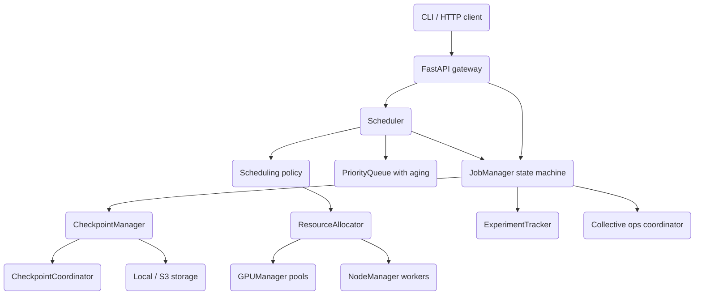

# ML Training Orchestrator

A distributed ML training orchestration platform built from scratch in Python: it manages
the lifecycle of training jobs, allocates GPU and CPU resources across worker nodes, schedules
jobs under several policies, coordinates checkpointing, and tracks experiments. The control
plane is exposed as an async FastAPI gateway, with all state kept in-process.

## Features

- **Job lifecycle state machine** — a 12-state model (`JobStatus`) with an explicit
  `VALID_TRANSITIONS` table; submit, queue, schedule, run, pause, resume, preempt, retry,
  cancel, and timeout (`JobManager` / `core/job_manager.py`).
- **Priority scheduling with aging** — a min-heap `PriorityQueue` that boosts effective
  priority by waiting time to prevent starvation, plus a `MultiLevelQueue` (`scheduling/priority_queue.py`).
- **Pluggable scheduling policies** — FIFO, priority, fair-share, gang, backfill, preemptive,
  and a weighted composite, all implementing one `SchedulingPolicy` interface (`scheduling/policies.py`).
- **Resource allocation strategies** — first-fit, best-fit, worst-fit, bin-packing, and
  affinity-aware policies with fragmentation scoring (`ResourceAllocator` / `resources/allocator.py`).
- **GPU pool management** — per-node GPU registration, type/memory-aware allocation,
  same-node preference, topology cache, and failure detection (`GPUManager` / `resources/gpu_manager.py`).
- **Node management** — worker registration, heartbeat-based health monitoring, drain/uncordon,
  and metrics history (`NodeManager` / `resources/node_manager.py`).
- **Quota enforcement** — per-user and per-team CPU/memory/GPU/concurrency limits (`ResourceQuota`).
- **Checkpointing** — periodic / best-metric / manual policies, keep-last-N cleanup, and
  local + S3 storage backends (`CheckpointManager` / `checkpoint/`).
- **Distributed checkpoint coordination** — a barrier protocol across workers
  (`CheckpointCoordinator` / `checkpoint/coordinator.py`).
- **Collective operations** — in-process AllReduce, AllGather, Broadcast, and ReduceScatter
  coordinators (`distributed/collective.py`).
- **Experiment tracking** — experiments, runs, metric history, parameters, artifacts, and
  run comparison (`ExperimentTracker` / `experiment/tracker.py`).
- **REST gateway + CLI** — FastAPI routers for jobs, resources, experiments, and health, plus
  a Click/Rich CLI that talks to the API over HTTP (`api/`, `cli.py`).

## Architecture



| Component | Module | Responsibility |
|-----------|--------|----------------|
| JobManager | `core/job_manager.py` | Job lifecycle, state transitions, retry, in-memory `JobStore` |
| Scheduler | `scheduling/scheduler.py` | Background loops, worker/quota tracking, decision execution |
| PriorityQueue | `scheduling/priority_queue.py` | Aging min-heap of queued jobs |
| Policies | `scheduling/policies.py` | FIFO / priority / fair-share / gang / backfill / preemptive |
| ResourceAllocator | `resources/allocator.py` | Fit strategies, allocation tracking, fragmentation |
| GPUManager | `resources/gpu_manager.py` | GPU pools, allocation, topology, failure detection |
| NodeManager | `resources/node_manager.py` | Node registration, health, drain/uncordon |
| CheckpointManager | `checkpoint/manager.py` | Checkpoint policy, cleanup, storage routing |
| CheckpointCoordinator | `checkpoint/coordinator.py` | Distributed barrier checkpointing |
| ExperimentTracker | `experiment/tracker.py` | Experiments, runs, metrics, comparison |
| API gateway | `api/` | FastAPI app and routers |

## Quick Start

### Prerequisites

- Python 3.10+
- No external services are required for the unit tests or to run the API — all state is
  in-process. S3 checkpoint storage and Kubernetes/GPU integrations are optional extras.

### Installation

```bash
pip install -e ".[dev]"
```

### Running

```bash
# Start the API gateway (FastAPI + Uvicorn)
mlorchestrator serve --host 0.0.0.0 --port 8000

# Or directly with uvicorn
uvicorn ml_orchestrator.api.app:app --reload
```

### Security & limits

The gateway ships a production hardening baseline that is opt-in via environment
variables (all stdlib, no extra deps). Health checks and the docs/OpenAPI
endpoints are always open; the `/api/v1/*` routers are protected when auth is on.

| Env var | Default | Effect |
|---------|---------|--------|
| `API_KEYS` | *(unset)* | Comma-separated valid keys. Unset/empty ⇒ auth disabled (a startup warning is logged). When set, `/api/v1/*` requires `Authorization: Bearer <key>` or `X-API-Key: <key>`; missing/invalid ⇒ 401. |
| `RATE_LIMIT_PER_MINUTE` | `120` | Per-client sliding-window limit (keyed by API key, else client IP). `0` disables. Over-limit ⇒ 429 with `Retry-After`. |
| `REQUEST_TIMEOUT_SECONDS` | `30` | Per-request timeout. `0` disables. On timeout ⇒ 504 JSON. |

```bash
API_KEYS=my-secret-key mlorchestrator serve &
curl -H "Authorization: Bearer my-secret-key" http://localhost:8000/api/v1/jobs
```

## Usage

The managers are async. The example below submits a job, drives it through its lifecycle, and
logs a metric using the real public API exported from `ml_orchestrator`:

```python
import asyncio
from ml_orchestrator import JobManager, JobConfig, ResourceRequest, JobPriority


async def main():
    manager = JobManager()

    job = await manager.submit_job(
        name="resnet50-imagenet",
        user_id="alice",
        config=JobConfig(script_path="train.py", epochs=90),
        resources=ResourceRequest(cpus=8, memory_gb=64, gpus=4, gpu_type="A100"),
        priority=JobPriority.HIGH,
    )

    # Drive the lifecycle through valid transitions
    await manager.queue_job(job.id)
    await manager.schedule_job(job.id, worker_ids=["worker-1"])
    await manager.start_job(job.id)
    await manager.run_job(job.id)

    await manager.log_metric(job.id, name="train_loss", value=2.31, epoch=1)
    await manager.update_progress(job.id, epoch=1, progress_percent=1.1)
    await manager.complete_job(job.id)

    print(await manager.get_stats())


asyncio.run(main())
```

## What's Real vs Simulated

- **Real:** the job state machine, priority-queue scheduler with aging, all scheduling and
  allocation policies, GPU pool tracking, node management, quota enforcement, checkpoint manager
  with keep-last-N cleanup, local-filesystem checkpoint storage, the barrier-based checkpoint
  coordinator, collective-op coordination logic, the experiment tracker, and the FastAPI gateway.
  These are exercised directly by the test suite. The gateway also has a real, opt-in hardening
  baseline — API-key auth, in-process rate limiting, and request timeouts (see **Security &
  limits**) — off by default so the quick-start needs no configuration.
- **Simulated / requires credentials:** the distributed layer
  (`distributed/collective.py`, `distributed/coordinator.py`, `distributed/elastic.py`)
  coordinates collective operations and membership purely in-process — there is no real
  `torch.distributed` backend, NCCL, or inter-process communication. GPU records carry
  utilization/temperature fields that are set programmatically; no hardware is queried (the
  `gpu` extra with `pynvml`/`torch` is optional). The S3 storage backend requires `aioboto3`
  and AWS credentials. The CLI is a thin HTTP client.

## Testing

```bash
pytest tests/ -v
```

The suite has 153 test functions across 18 files under `tests/unit/`, covering the models,
job manager, priority queue, scheduling policies, allocator, GPU/node managers, checkpoint
manager and coordinator, collective ops, experiment tracker, comparison/artifacts, exceptions,
and the API (via FastAPI's `TestClient`). No external services are required; the API tests run
against the in-process app.

## Project Structure

```
04-ml-training-orchestrator/
  src/ml_orchestrator/
    core/         # TrainingJob models, JobManager state machine, exceptions
    resources/    # GPUManager, NodeManager, ResourceAllocator
    scheduling/   # PriorityQueue, scheduling policies, Scheduler
    distributed/  # Collective ops, coordinator, elastic training (in-process)
    checkpoint/   # CheckpointManager, coordinator, storage backends
    experiment/   # ExperimentTracker, artifacts, run comparison
    api/          # FastAPI gateway (jobs, resources, experiments, health)
    cli.py        # Click + Rich CLI (HTTP client)
  tests/unit/     # 153 unit tests across 18 files
  docs/BLUEPRINT.md   # Full architecture and design
```

## License

MIT — see [LICENSE](../LICENSE)
