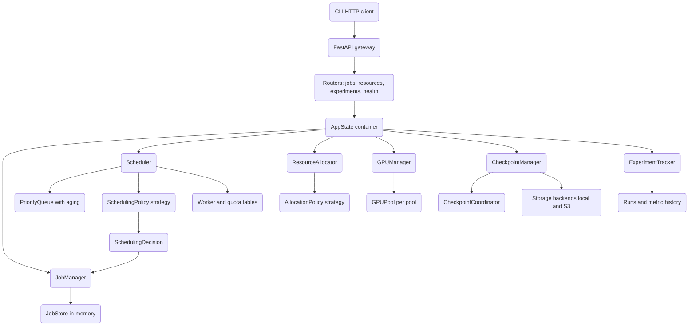

# ML Training Orchestrator

## Overview

The ML Training Orchestrator is a control plane for running machine-learning training jobs on a
pool of worker nodes. It is built from scratch in Python and models the concerns a real
cluster scheduler must handle: a job lifecycle with explicit state transitions, a scheduler
that decides which job runs next under a configurable policy, a resource allocator that places
jobs onto workers, GPU and node bookkeeping, checkpointing (including a coordinated barrier
protocol for multi-worker jobs), and experiment tracking. A FastAPI gateway exposes the control
plane over HTTP, and a Click/Rich CLI talks to that gateway.

The project's purpose is pedagogical: it implements the *orchestration* logic of a system like
Kubernetes batch scheduling, Slurm, or Ray's job layer — priority queues with aging, fit-based
bin packing, gang scheduling, preemption, quota accounting, keep-last-N checkpoint retention,
and barrier coordination — without depending on a real distributed-training runtime. Everything
runs in a single process: the data stores are in-memory dictionaries guarded by `asyncio.Lock`,
and the "distributed" layer simulates collective operations and worker membership in-process
rather than driving NCCL or `torch.distributed`.

The concepts this codebase teaches:

- **State machines** — a validated transition table for job status, with timestamps and events.
- **Priority scheduling** — a min-heap with an aging function and tombstone-based lazy removal.
- **Scheduling policies** — the strategy pattern applied to FIFO, priority, fair-share, gang,
  backfill, preemptive, and composite scheduling.
- **Resource fitting** — first/best/worst-fit and bin-packing placement, plus a fragmentation
  metric.
- **Quota accounting** — per-entity allocation/release with concurrency caps.
- **Checkpoint retention and coordination** — keep-last-N with best-checkpoint protection, and
  a barrier protocol across ranks.
- **Async concurrency correctness** — every shared structure is lock-guarded, and three real
  concurrency bugs (a priority-queue tombstone leak and two non-reentrant-lock deadlocks) were
  found and fixed; their fixes are documented inline in the source.

### Scope and non-goals

In scope: the orchestration control plane, its data model, its REST surface, and its tests.
Out of scope: a real training runtime, real GPU hardware access, durable storage, multi-process
communication, and authentication. Where a boundary to the "real world" exists (S3, GPU
telemetry, distributed backends), the code defines the interface and a simulated implementation.

This separation is intentional and is what keeps the project runnable and testable anywhere: the
orchestration logic is the interesting, fully-implemented part, and the boundaries to physical
infrastructure are clean seams behind abstract base classes (`CheckpointStorage`,
`SchedulingPolicy`, `AllocationPolicy`, `CollectiveOperation`). A reader can study how a scheduler
ages a queue, how a bin-packer consolidates jobs, or how a barrier checkpoint coordinates ranks,
without standing up a GPU cluster. The same seams are where a production system would slot in a
real `torch.distributed` backend, an S3 client with credentials, or a persistent job store —
each is a single subclass away.

## Architecture



### How the pieces fit

The HTTP layer is a thin shell. `create_app()` builds a `FastAPI` instance and mounts four
routers. On startup, the `lifespan` context manager constructs an `AppState`, which eagerly
instantiates one of each manager (`JobManager`, `Scheduler`, `ResourceAllocator`, `GPUManager`,
`CheckpointManager`, `ExperimentTracker`) and starts the scheduler's background tasks. Every
request handler reaches the managers through `request.app.state.orchestrator`.

The control flow for a job is event-driven. `JobManager.submit_job` stores a `PENDING` job and
emits a `job_submitted` event. The `Scheduler` has registered a callback on that event: it
transitions the job to `QUEUED` and pushes it onto the `PriorityQueue`. The scheduler's
background loop periodically pulls schedulable jobs, asks the active `SchedulingPolicy` for a
`SchedulingDecision`, and — if one is returned — preempts any victims, removes the job from the
queue, marks it `SCHEDULED`, allocates worker/quota resources, and drives it to `RUNNING`. When
a job completes, fails, or is cancelled, a second callback releases its resources and removes it
from the queue.

`ResourceAllocator`, `GPUManager`, and `NodeManager` are independent bookkeeping services. The
allocator and GPU manager each maintain their own worker/GPU tables; in the API they are wired
beside the scheduler so that the same `WorkerInfo` model flows through all of them.

### End-to-end lifecycle walkthrough

A single job traverses the whole system as follows:

1. **Submit.** `JobManager.submit_job` validates the config (`_validate_job_config`,
   `_validate_resources`), constructs a `TrainingJob` in `PENDING`, adds it to the `JobStore`,
   and emits `job_submitted`.
2. **Queue.** The scheduler's `_on_job_submitted` callback fires: it calls `queue_job`
   (transition `PENDING -> QUEUED`, sets `queued_at`) and `PriorityQueue.push`, which computes
   the aged effective priority.
3. **Decide.** On the next scheduling tick, `_schedule_pending_jobs` pulls schedulable jobs and
   the active policy returns a `SchedulingDecision` naming the job, its workers, and any
   preemption victims.
4. **Execute.** `_execute_decision` preempts victims (`PREEMPTED`), removes the job from the
   queue, transitions it `QUEUED -> SCHEDULED -> STARTING -> RUNNING`, and calls
   `_allocate_resources` to charge worker capacity and quotas.
5. **Run.** While running, the trainer calls `update_progress`, `log_metric`, `heartbeat`, and
   `add_checkpoint`; for distributed jobs the `CheckpointCoordinator` and collective ops mediate
   barrier points.
6. **Finish.** `complete_job`/`fail_job`/`cancel_job`/`timeout_job` move the job to a terminal
   state; the scheduler's `_on_job_completed` callback releases worker and quota resources and
   removes any queue entry. `fail_job` may instead re-queue the job for retry.

## Core Components

### JobManager and JobStore

`JobManager` (`core/job_manager.py`) owns the job lifecycle. State is held in a `JobStore`, an
**in-memory** dictionary store with secondary indexes by status, user, team, and experiment,
all guarded by an `asyncio.Lock`. (The README's earlier claim of a SQLAlchemy/SQLite backing
store does not match the code — the store is purely in-process.)

The heart of the component is the `VALID_TRANSITIONS` table mapping each `JobStatus` to the set
of states it may move to. `_transition_state` rejects any move not in that set by raising
`JobStateError`, updates the relevant timestamp (`queued_at`, `started_at`, `paused_at`,
`completed_at`), persists the change, and emits a `state_changed` event. The public methods
(`queue_job`, `schedule_job`, `start_job`, `run_job`, `pause_job`, `resume_job`, `preempt_job`,
`complete_job`, `fail_job`, `cancel_job`, `timeout_job`) are thin wrappers that enforce extra
preconditions — for example, `preempt_job` refuses non-preemptible jobs, and `resume_job`
requires the job to be `PAUSED`.

The transition table is the contract that keeps the system honest. An abbreviated view:

```python
VALID_TRANSITIONS: dict[JobStatus, set[JobStatus]] = {
    JobStatus.PENDING:   {QUEUED, CANCELLED, FAILED},
    JobStatus.QUEUED:    {SCHEDULED, CANCELLED, FAILED, TIMEOUT},
    JobStatus.SCHEDULED: {STARTING, QUEUED, CANCELLED, FAILED},
    JobStatus.RUNNING:   {PAUSED, CHECKPOINTING, COMPLETED, FAILED,
                          CANCELLED, PREEMPTED, TIMEOUT, QUEUED},
    JobStatus.PREEMPTED: {QUEUED, CANCELLED, FAILED},
    JobStatus.COMPLETED: set(),   # terminal
    JobStatus.FAILED:    set(),   # terminal
    # ...
}
```

Retry is handled in `fail_job`: if `retry_count < config.retry.max_retries`, the job is
re-queued instead of being marked `FAILED`, with an exponential-backoff delay capped at
`max_delay_seconds`:

```python
delay = job.config.retry.retry_delay_seconds
if job.config.retry.exponential_backoff:
    delay = min(delay * (2 ** (job.retry_count - 1)),
                job.config.retry.max_delay_seconds)
job = await self._transition_state(job, JobStatus.QUEUED)  # re-queue
```

A callback/event bus (`register_callback` / `_emit_event`) lets other components subscribe to
lifecycle events; callbacks may be sync or coroutine functions and are invoked defensively
(exceptions are logged, not propagated). The `JobStore` keeps secondary indexes
(`_by_status`, `_by_user`, `_by_team`, `_by_experiment`) so that list queries do not scan the
whole table, and `update` repairs the status index when a job changes state.

Liveness is tracked with a heartbeat dictionary. `check_timeouts` flags running jobs whose
heartbeat has gone stale (`heartbeat_timeout_seconds`) or whose wall-clock duration exceeds
`config.timeout_hours`. `cleanup_terminal_jobs` garbage-collects old terminal jobs.

### Scheduler

`Scheduler` (`scheduling/scheduler.py`) coordinates the queue, the policy, worker state, and
quotas. It runs two background tasks started by `start()`: a scheduling loop that calls
`_schedule_pending_jobs` every `scheduling_interval_seconds`, and a priority-refresh loop that
re-ages the queue every `priority_refresh_interval_seconds`.

`_schedule_pending_jobs` gathers available worker resources, pulls up to `max_concurrent`
schedulable jobs from the queue, fetches running jobs (needed for preemption), and asks the
policy for a decision. `PreemptivePolicy` receives the running-jobs list as an extra argument;
all other policies use the three-argument `select_job`. `_execute_decision` then preempts
victims, schedules the chosen job, allocates resources on its workers, and runs it, incrementing
the `jobs_scheduled` / `jobs_preempted` / `scheduling_failures` counters. The scheduler also
exposes worker registration, quota management, queue inspection (`get_queue_position`,
`get_queue_size`), and `get_resource_utilization`.

### PriorityQueue

`PriorityQueue` (`scheduling/priority_queue.py`) is a min-heap of `PriorityItem`s. Because Python's
`heapq` is a min-heap, effective priority is stored negated: `-(base_priority + age_boost*100)`,
where `age_boost = min(age_hours, max_age_hours) * aging_factor`. Longer-waiting jobs therefore
sort earlier. The queue supports `push`, `pop`, `peek`, `remove`, `update_priority`,
`refresh_priorities`, and statistics.

The aging calculation, the core of starvation prevention:

```python
def _calculate_effective_priority(self, base_priority, queue_time):
    age_hours = min((datetime.utcnow() - queue_time).total_seconds() / 3600,
                    self._max_age_hours)
    age_boost = age_hours * self._aging_factor
    return -(base_priority + age_boost * 100)   # negated for the min-heap
```

Removal is lazy: `remove` deletes the entry from `_job_map` and records the id in a `_removed`
tombstone set; `pop`/`peek` skip tombstoned ids. A real bug lived here — `update_priority`
called the internal remove (which adds a tombstone) and then re-pushed a fresh item with the
same id, so the next `pop` would skip the freshly re-pushed job. The fix, documented inline,
clears the tombstone with `self._removed.discard(job_id)` after re-pushing:

```python
heapq.heappush(self._heap, new_item)
self._job_map[job_id] = new_item
# _remove_internal marked this id as removed; clear that tombstone so the
# freshly re-pushed item isn't skipped by pop()/peek().
self._removed.discard(job_id)
```

`refresh_priorities` rebuilds the whole heap with recomputed ages and clears all tombstones in
one O(n) pass. A companion `MultiLevelQueue` maps priorities into five round-robin levels via
`_priority_to_level` (CRITICAL/HIGHEST at level 0, LOWEST at level 4).

### Scheduling policies

All policies (`scheduling/policies.py`) implement the abstract `SchedulingPolicy.select_job`,
returning a `SchedulingDecision` (job id, assigned workers, jobs to preempt, reason, score) or
`None`. Shared helpers `_find_workers_for_job` (uses `ResourceRequest.fits_in`) and
`_check_quota` are provided by the base class.

- **FIFOPolicy** — orders by `queued_at`/`created_at`, schedules the first job that fits.
- **PriorityPolicy** — scores `base_priority + age_bonus` with aging, schedules highest score.
- **FairSharePolicy** — scores by `share / usage` so under-served entities win, and records
  usage on placement and completion.
- **GangSchedulingPolicy** — for distributed jobs, only schedules when at least `world_size`
  suitable workers exist, assigning them together; otherwise falls back to single-worker jobs.
- **BackfillPolicy** — serves high-priority jobs first, then backfills short low-priority jobs
  (bounded by `max_backfill_duration_hours`) into the gaps.
- **PreemptivePolicy** — when a job cannot be placed, looks for lower-priority preemptible
  victims whose priority gap exceeds `priority_threshold` and that have run at least
  `min_run_time_minutes`.
- **CompositePolicy** — runs several weighted policies and returns the highest weighted-score
  decision.

The preemption guard captures the three conditions that protect running work:

```python
def _can_preempt(self, high_priority_job, running_job):
    if high_priority_job.priority.value - running_job.priority.value < self._priority_threshold:
        return False
    if not running_job.preemptible:
        return False
    if running_job.started_at and datetime.utcnow() - running_job.started_at < self._min_run_time:
        return False
    return True
```

### ResourceAllocator

`ResourceAllocator` (`resources/allocator.py`) places jobs onto workers using a pluggable
`AllocationPolicy`: `FirstFitPolicy`, `BestFitPolicy` (least remaining capacity, GPUs weighted
10x), `WorstFitPolicy`, `BinPackingPolicy` (prefers most-utilized workers, GPUs weighted 3x),
and `AffinityAwarePolicy` (GPU-type affinity, node-affinity labels, anti-affinity spread). It
tracks active allocations and history, can take periodic `ResourceSnapshot`s, and computes a
`get_fragmentation_score` in [0, 1] from the gap between the largest single-worker capacity and
total available capacity.

The bin-packing utilization metric weights GPUs heavily so jobs consolidate onto already-busy
GPU nodes, freeing whole idle nodes:

```python
weights = [1, 1, 3]                 # cpu, memory, gpu
utils = [cpu_util, mem_util, gpu_util]
return sum(u * w for u, w in zip(utils, weights)) / sum(weights)
```

Two methods — `get_utilization` and `get_stats` — deliberately do **not** hold `self._lock`,
because they call the already-locked helpers `get_total_resources`/`get_available_resources`
and `asyncio.Lock` is not reentrant; wrapping them would deadlock. This was a real bug, and the
fix is documented inline. Allocation failures raise `ResourceExhaustedError`, which carries the
requested and available amounts for diagnostics.

### GPUManager

`GPUManager` (`resources/gpu_manager.py`) manages GPUs across named `GPUPool`s. Each pool holds
`GPUInfo` records (type, memory, utilization, temperature, PCIe info, compute capability) and
serves allocation requests filtered by type and memory, preferring co-location on a single node.
`GPUAllocation` records track which GPUs a job holds. The manager adds cross-pool aggregation,
a per-node `get_gpu_topology` cache, `find_best_allocation` (single-node preferred, multi-node
fallback), and `detect_failed_gpus`:

```python
for gpu in gpus:
    if gpu.status == GPUStatus.FAILED:
        failed.append(gpu)
    elif gpu.temperature_celsius > 90:                 # overheating
        failed.append(gpu)
    elif gpu.status == GPUStatus.ALLOCATED and gpu.utilization_percent == 0:
        if gpu.allocated_at and datetime.utcnow() - gpu.allocated_at > timedelta(minutes=5):
            failed.append(gpu)                          # allocated but idle -> likely crash
```

Allocation within a pool sorts candidates to prefer co-location (all GPUs on the node with the
most free GPUs) so multi-GPU jobs land on a single node where NVLink would exist on real
hardware. A request for more GPUs than are available raises `GPUNotAvailableError`.

### NodeManager

`NodeManager` (`resources/node_manager.py`) tracks worker nodes as `WorkerInfo`. A background
health-check loop marks nodes `UNHEALTHY` after one heartbeat timeout and `OFFLINE` after two,
emitting status-change events. It records bounded metrics (`NodeMetrics`) and events
(`NodeEvent`) histories, and supports `drain_node` (set `DRAINING`, wait for jobs, then
`OFFLINE`) and `uncordon_node`. The two-stage degradation is in `_check_all_nodes`: a node missing one heartbeat timeout becomes
`UNHEALTHY`, and at twice the timeout it becomes `OFFLINE` with a recorded event; a later
heartbeat recovers it to `READY`. `get_cluster_health` summarizes healthy/degraded/unhealthy
counts and an overall status (`HEALTHY` if all healthy, `DEGRADED` above 50%, else `UNHEALTHY`).
Like the allocator, `get_stats` calls a lock-free `_cluster_health` helper to avoid re-entering
the non-reentrant lock — another documented deadlock fix. `drain_node` flips the node to
`DRAINING`, optionally waits up to `drain_timeout_seconds` for its `current_jobs` to clear
(polling outside the lock so heartbeats can still arrive), then sets it `OFFLINE`; `uncordon_node`
returns a drained/offline node to `READY`.

### CheckpointManager and storage

`CheckpointManager` (`checkpoint/manager.py`) creates checkpoints, routes them to a
`CheckpointStorage` backend chosen by `config.storage_backend`, tracks per-job checkpoint lists
and per-metric best checkpoints, and runs keep-last-N cleanup that **protects** best checkpoints
from deletion. `should_checkpoint` decides whether to checkpoint given the job's
`CheckpointPolicy` (periodic by epoch/step, best-metric, or manual). `get_resume_checkpoint`
returns an explicit resume checkpoint or the latest valid one.

The retention logic is the subtle part. `_cleanup_checkpoints` sorts by `(epoch, step)`, marks
everything except the last N for deletion, but first builds a protected set from the per-metric
best checkpoints so a best model is never reclaimed:

```python
best_ids = {ckpt.id for ckpt in self._best_checkpoints.get(job_id, {}).values()}
for ckpt in to_delete:
    if ckpt.id in best_ids:
        continue                      # never delete a best checkpoint
    if await storage.delete(ckpt.path):
        ckpt.status = CheckpointStatus.DELETED
```

`_update_best_checkpoint` compares the new metric value against the current best using
`config.metric_mode` (`"min"` for losses, `"max"` otherwise). `TrainingJob.add_checkpoint` on the
`JobManager` keeps a parallel embedded list on the job itself, also bounded to
`config.checkpoint.keep_last_n`. Metrics counters (`checkpoints_created`, `checkpoints_deleted`,
`total_bytes_saved`, `total_bytes_deleted`) are surfaced by `get_stats`.

`CheckpointStorage` (`checkpoint/storage.py`) is an abstract backend with two implementations:
`LocalStorage` writes `<base>/<job_id>/<ckpt_id>.ckpt` plus a `.meta.json` sidecar (with an MD5
checksum) using `run_in_executor` for blocking IO, and `S3Storage` uses `aioboto3` (imported
lazily; raises if missing) to put/get objects and metadata.

### CheckpointCoordinator

`CheckpointCoordinator` (`checkpoint/coordinator.py`) implements the distributed barrier
protocol. A leader calls `initiate_checkpoint`; each worker calls `worker_acknowledge` and waits
on `wait_for_barrier` until all `world_size` workers have acknowledged (state flips to `SAVING`);
each worker then calls `worker_saved`, and when all have saved the checkpoint becomes
`COMPLETED`. `worker_failed` fails the whole checkpoint, and `check_timeouts` expires
checkpoints past their deadline. This is fully implemented in-process but is not wired to real
inter-process communication.

The barrier readiness is expressed through `CoordinatedCheckpoint` properties:

```python
@property
def all_workers_ready(self) -> bool:
    if len(self.workers) < self.world_size:
        return False
    return all(w.state != CoordinatedCheckpointState.PENDING for w in self.workers.values())

@property
def all_workers_saved(self) -> bool:
    if len(self.workers) < self.world_size:
        return False
    return all(w.state == CoordinatedCheckpointState.COMPLETED for w in self.workers.values())
```

`wait_for_barrier` and `wait_for_completion` poll these on a 0.1s interval, returning early on
expiry. The state machine is `PENDING -> BARRIER_WAIT -> SAVING -> COMPLETED`, with `FAILED` and
`TIMEOUT` as alternative terminals.

### Collective operations

`distributed/collective.py` provides in-process coordinators for `AllReduceOp` (SUM/PRODUCT/MIN/
MAX/AVG), `AllGatherOp`, `BroadcastOp`, and `ReduceScatterOp`. All extend a `CollectiveOperation`
base that holds an `asyncio.Event` so workers can `wait()` for completion with a timeout. Workers
`contribute` data; once `world_size` contributions arrive the result is computed and a
`CollectiveResult` (with a `duration_ms` property) is returned to each worker. AllReduce reduces
the contributed values; AllGather returns the list; Broadcast distributes the root's value once
all receivers register; ReduceScatter reduces per-chunk and hands each rank its own chunk,
rejecting inputs whose length does not equal `world_size`. `CollectiveManager` creates and tracks
operations per job and reports `by_status` counts. These reduce Python values, not tensors, and
stand in for a real NCCL/`torch.distributed` backend.

### Distributed coordinator and elastic training

`distributed/coordinator.py` models worker membership for a distributed job — `DistributedWorker`
records rank, local rank, world size, role (`MASTER`/`WORKER`), and a `WorkerState`
(`INITIALIZING -> READY -> TRAINING`, plus `BARRIER_WAITING`, `CHECKPOINTING`, `FAILED`,
`FINISHED`). `distributed/elastic.py` adds `ElasticTrainingManager`, which tracks an
`ElasticState` (min/max/current/target workers, active/pending/failed worker sets, restart count)
per job and records every `MembershipChange` (`WORKER_JOINED`, `WORKER_LEFT`, `WORKER_FAILED`,
`SCALE_UP`, `SCALE_DOWN`). `worker_joined` refuses to exceed `max_workers`; `worker_left` and
failure handling shrink the set and may trigger a restart subject to `min_restart_interval` and
`max_restarts`. Like the rest of the distributed layer, this is in-process simulation: it tracks
membership and emits events but does not launch or signal real processes.

### ExperimentTracker

`ExperimentTracker` (`experiment/tracker.py`) manages `Experiment`s and `Run`s. A run captures a
job's config, parameters, artifacts, and per-name metric history. `log_metric` appends to history
and updates the experiment's best metric (loss/error minimized, others maximized).
`get_metrics_summary` returns min/max/last/avg/count per metric, `compare_runs` returns a
side-by-side view, and `get_best_run` selects the best completed run for a metric and mode.

A separate `ExperimentComparison` (`experiment/comparison.py`) builds richer reports:
`MetricComparison` (best/worst run, mean, std, mode per metric), `ParamComparison` (unique values
and an `is_constant` flag to surface which hyperparameters actually varied), and a
`ComparisonResult` that ranks runs by a primary metric. An `ArtifactStore`
(`experiment/artifacts.py`) tracks artifact files associated with runs.

## Data Structures

The core domain models are Pydantic v2 `BaseModel`s in `core/models.py`. Enums define the job
status set, priority levels (integer-valued), checkpoint and worker statuses, and the policy/
strategy enumerations.

```python
class JobStatus(str, Enum):
    PENDING = "pending"; QUEUED = "queued"; SCHEDULED = "scheduled"
    STARTING = "starting"; RUNNING = "running"; PAUSED = "paused"
    CHECKPOINTING = "checkpointing"; PREEMPTED = "preempted"
    COMPLETED = "completed"; FAILED = "failed"; CANCELLED = "cancelled"
    TIMEOUT = "timeout"


class JobPriority(int, Enum):
    LOWEST = 0; LOW = 25; NORMAL = 50; HIGH = 75; HIGHEST = 100; CRITICAL = 150
```

`ResourceRequest` is the unit of resource accounting, with helpers used throughout scheduling
and allocation:

```python
class ResourceRequest(BaseModel):
    cpus: int = Field(default=1, ge=0, le=256)
    memory_gb: float = Field(default=4.0, ge=0, le=2048)
    gpus: int = Field(default=0, ge=0, le=16)
    gpu_type: Optional[str] = None
    gpu_memory_gb: Optional[float] = None
    network_bandwidth_gbps: Optional[float] = None
    storage_gb: float = 10.0
    shared_memory_gb: Optional[float] = None

    def fits_in(self, available: "ResourceRequest") -> bool: ...
    def subtract(self, other: "ResourceRequest") -> "ResourceRequest": ...
    def add(self, other: "ResourceRequest") -> "ResourceRequest": ...
```

`TrainingJob` is the central aggregate. It carries config, requested resources, status,
priority, assigned workers/GPUs, progress, an embedded checkpoint list, metric history, timing
fields, and retry/error fields. Computed properties drive scheduling decisions:

```python
class TrainingJob(BaseModel):
    id: str; name: str; user_id: str
    team_id: Optional[str]; experiment_id: Optional[str]
    config: JobConfig
    resources: ResourceRequest = Field(default_factory=ResourceRequest)
    status: JobStatus = JobStatus.PENDING
    priority: JobPriority = JobPriority.NORMAL
    preemptible: bool = True
    assigned_workers: list[str]; assigned_gpus: list[str]
    current_epoch: int; current_step: int; progress_percent: float
    checkpoints: list[Checkpoint]; latest_checkpoint_id: Optional[str]
    metrics: list[MetricValue]; best_metrics: dict[str, float]
    created_at: datetime; queued_at: Optional[datetime]
    started_at: Optional[datetime]; completed_at: Optional[datetime]
    retry_count: int; error_message: Optional[str]

    @property
    def is_terminal(self) -> bool: ...      # COMPLETED/FAILED/CANCELLED/TIMEOUT
    @property
    def is_schedulable(self) -> bool: ...   # QUEUED or PREEMPTED
    def get_latest_checkpoint(self) -> Optional[Checkpoint]: ...
    def get_best_checkpoint(self, metric, mode="min") -> Optional[Checkpoint]: ...
```

`JobConfig` nests `DistributedConfig`, `CheckpointConfig`, and `RetryConfig`, each with model
validators (for example, `DistributedConfig` infers `min_nodes`/`max_nodes` when elastic, and
`JobConfig` forbids setting both `epochs` and `max_steps`).

`WorkerInfo` is the node/worker model shared by the scheduler, allocator, and node manager. Its
`available_resources` derives from total minus allocated, and `can_run_job` combines a status
check with a resource fit:

```python
class WorkerInfo(BaseModel):
    id: str; hostname: str; ip_address: str; port: int = 8000
    status: WorkerStatus = WorkerStatus.INITIALIZING
    resources: ResourceRequest
    allocated_resources: ResourceRequest
    current_jobs: list[str]; last_heartbeat: datetime; labels: dict[str, str]

    @property
    def available_resources(self) -> ResourceRequest:
        return self.resources.subtract(self.allocated_resources)

    def is_healthy(self, timeout_seconds: int = 60) -> bool: ...
    def can_run_job(self, resources: ResourceRequest) -> bool: ...
```

`ResourceQuota` enforces per-user and per-team caps. `can_allocate` checks CPU/memory/GPU limits
and the concurrent-job cap; `allocate`/`release` mutate the used counters (clamped at zero):

```python
class ResourceQuota(BaseModel):
    entity_id: str; entity_type: str
    max_cpus: int = 100; max_memory_gb: float = 500.0; max_gpus: int = 8
    max_concurrent_jobs: int = 10
    used_cpus: int = 0; used_memory_gb: float = 0.0; used_gpus: int = 0
    active_jobs: int = 0

    def can_allocate(self, resources: ResourceRequest) -> bool: ...
```

Other supporting structures: `Checkpoint` (with `is_valid()`), `MetricValue`, and `Experiment`.
Scheduling, allocation, and the distributed layer use plain dataclasses — `PriorityItem`,
`SchedulingDecision`, `AllocationResult`, `ResourceSnapshot`, `GPUInfo`, `GPUAllocation`,
`NodeMetrics`, `NodeEvent`, `CoordinatedCheckpoint`, `WorkerCheckpointState`, `CollectiveResult`,
`ElasticState`, and `MembershipChange`. The split is deliberate: data that crosses the API
boundary is a validated Pydantic model, while purely internal bookkeeping uses lighter
dataclasses.

The exception hierarchy (`core/exceptions.py`) is rooted at `OrchestratorError` (carrying a
message and a details dict) and includes `JobNotFoundError`, `JobStateError`,
`ResourceError`/`ResourceExhaustedError`/`QuotaExceededError`/`GPUNotAvailableError`,
`CheckpointError`/`CheckpointNotFoundError`/`CheckpointCorruptedError`, `SchedulingError`/
`PreemptionError`, `WorkerError`/`WorkerNotFoundError`/`WorkerUnhealthyError`,
`ExperimentError`/`ExperimentNotFoundError`, `ConfigurationError`, and `ValidationError`.

## API Design

### Public Python API

The package re-exports the managers and core models from `ml_orchestrator/__init__.py`:

```python
from ml_orchestrator import (
    TrainingJob, JobConfig, JobStatus, JobPriority,
    ResourceRequest, Checkpoint, MetricValue, MetricType,
    JobManager, Scheduler, ResourceAllocator, GPUManager,
    CheckpointManager, ExperimentTracker,
)
```

Representative async signatures:

```python
# JobManager
async def submit_job(name, user_id, config, resources=None,
                     priority=JobPriority.NORMAL, team_id=None,
                     experiment_id=None, preemptible=True, tags=None,
                     resume_from_checkpoint=None) -> TrainingJob
async def queue_job(job_id) -> TrainingJob
async def schedule_job(job_id, worker_ids) -> TrainingJob
async def run_job(job_id) -> TrainingJob
async def fail_job(job_id, error_message, error_traceback=None, retry=True) -> TrainingJob
async def add_checkpoint(job_id, path, epoch, step, metrics=None, size_bytes=0) -> Checkpoint

# ResourceAllocator
async def allocate(job: TrainingJob) -> AllocationResult       # raises ResourceExhaustedError
async def release(job_id) -> bool
async def get_fragmentation_score() -> float

# GPUManager
async def allocate_gpus(job_id, count, gpu_type=None, memory_gb=None,
                        pool_id="default") -> GPUAllocation     # raises GPUNotAvailableError

# CheckpointManager
async def create_checkpoint(job, data, epoch, step, metrics=None, metadata=None) -> Checkpoint
async def load_checkpoint(job_id, checkpoint_id=None,
                          storage_backend=StorageBackend.LOCAL) -> tuple[Checkpoint, bytes]
```

### REST API

`create_app()` mounts four routers. Selected endpoints:

```
# Health
GET    /health
GET    /health/ready
GET    /health/live
GET    /health/stats

# Jobs   (/api/v1/jobs)
POST   /api/v1/jobs
GET    /api/v1/jobs
GET    /api/v1/jobs/{job_id}
GET    /api/v1/jobs/{job_id}/details
PATCH  /api/v1/jobs/{job_id}
POST   /api/v1/jobs/{job_id}/pause
POST   /api/v1/jobs/{job_id}/resume
POST   /api/v1/jobs/{job_id}/cancel
GET    /api/v1/jobs/{job_id}/metrics
GET    /api/v1/jobs/{job_id}/checkpoints
GET    /api/v1/jobs/{job_id}/queue-position

# Resources   (/api/v1/resources)
POST   /api/v1/resources/workers
GET    /api/v1/resources/workers
GET    /api/v1/resources/workers/{worker_id}
DELETE /api/v1/resources/workers/{worker_id}
POST   /api/v1/resources/workers/{worker_id}/heartbeat
GET    /api/v1/resources/utilization
GET    /api/v1/resources/gpus
GET    /api/v1/resources/gpus/available
GET    /api/v1/resources/capacity

# Experiments   (/api/v1/experiments)
POST   /api/v1/experiments
GET    /api/v1/experiments
GET    /api/v1/experiments/{experiment_id}
DELETE /api/v1/experiments/{experiment_id}
GET    /api/v1/experiments/{experiment_id}/runs
GET    /api/v1/experiments/{experiment_id}/runs/{run_id}
POST   /api/v1/experiments/{experiment_id}/runs/{run_id}/metrics
GET    /api/v1/experiments/{experiment_id}/runs/{run_id}/metrics/{metric_name}
POST   /api/v1/experiments/{experiment_id}/compare
GET    /api/v1/experiments/{experiment_id}/best-run
```

Request/response bodies are Pydantic models (e.g. `SubmitJobRequest`, `JobResponse.from_job`).
Errors map domain exceptions to HTTP status codes: `JobNotFoundError` to 404, `ValidationError`
and `JobStateError` to 400. CORS is permissive (configured for development).

The wiring lives in `AppState`, constructed once per process in the `lifespan` hook:

```python
class AppState:
    def __init__(self):
        self.job_manager = JobManager()
        self.scheduler = Scheduler(self.job_manager)
        self.allocator = ResourceAllocator()
        self.gpu_manager = GPUManager()
        self.checkpoint_manager = CheckpointManager()
        self.experiment_tracker = ExperimentTracker()
```

`lifespan` calls `scheduler.start()` on entry and `scheduler.stop()` on shutdown, so the
background scheduling and aging loops run for the lifetime of the server. Handlers reach these
singletons through `request.app.state.orchestrator`. Two response shapes are used for jobs: the
slim `JobResponse` (id, name, status, priority, progress, timing, error) for list/get, and the
full `job.model_dump()` for the `/details` endpoint. Health endpoints aggregate `get_stats` from
every manager so `/health/stats` is a single-call system snapshot.

### CLI

`cli.py` defines a Click group `mlorchestrator` (registered as a console script in
`pyproject.toml`) with a `serve` command (launches Uvicorn) and a `jobs` subgroup that issues
HTTP requests to a running gateway with `httpx` and renders results with `rich` tables. The CLI
holds no orchestration state of its own — it is purely a client of the REST API, which is why it
takes an `--api-url` option on its commands.

### Configuration and utilities

`utils/config.py` provides a `pydantic-settings` configuration object so deployment knobs (host,
port, log level, storage paths, intervals) can come from environment variables, and
`utils/logging.py` wires up `structlog` for the structured JSON logs emitted throughout the
codebase (`logger.info("job_state_changed", job_id=..., old_status=..., new_status=...)`). These
structured events are what a real deployment would ship to a log aggregator; here they double as
a trace of every state transition the managers make.

## Performance

This is a single-process, in-memory control plane, so the relevant costs are algorithmic rather
than throughput numbers measured against hardware. No benchmark suite ships with the project, so
the figures below are design properties, not measured results.

- **Queue operations** are heap-based: `push` is O(log n); `pop` is amortized O(log n) but may
  skip tombstoned entries. `refresh_priorities` rebuilds the heap in O(n) and is run on a slow
  background interval, not per scheduling tick.
- **Scheduling tick** considers up to `max_concurrent_scheduling` (default 10) jobs and scans
  available workers, so a tick is bounded by O(jobs x workers) for the fit check.
- **Allocation** policies scan workers once: O(workers) for first/best/worst-fit; bin-packing
  adds an O(workers log workers) sort.
- **Checkpoint cleanup** sorts a job's checkpoints, O(c log c), and keeps the last N.
- **Memory** is bounded deliberately: node metrics keep the last 1000 samples per node, node
  events the last 10000, and allocator snapshots the last 1000.

Async correctness is the real performance concern. Every shared structure is guarded by an
`asyncio.Lock`, and because `asyncio.Lock` is not reentrant, helper methods that already lock
(`get_total_resources`, `get_available_resources`, `_cluster_health`) are called *without*
re-acquiring the lock from `get_utilization`/`get_stats`. The two deadlock fixes and the
priority-queue tombstone fix are documented inline at their call sites.

The three concurrency bugs that were found and fixed during testing illustrate the failure modes
this design must avoid:

1. **Priority-queue tombstone leak** — `update_priority` left a stale tombstone after re-pushing,
   so the re-prioritized job was silently skipped by `pop`. Fixed by discarding the tombstone.
2. **`ResourceAllocator` self-deadlock** — `get_utilization`/`get_stats` held `self._lock` while
   calling helpers that also take it. Fixed by calling the helpers lock-free.
3. **`NodeManager` self-deadlock** — `get_stats` called `get_cluster_health` (which re-locks).
   Fixed by extracting a lock-free `_cluster_health` helper.

Blocking IO is kept off the event loop. `LocalStorage` performs every filesystem operation
through `run_in_executor`, so checkpoint writes and reads do not stall the scheduler or API.
Background loops (`Scheduler._scheduling_loop`, `Scheduler._priority_refresh_loop`,
`NodeManager._health_check_loop`) sleep between iterations and swallow per-iteration exceptions so
a transient error cannot kill the loop.

## Testing Strategy

Tests live in `tests/unit/` — 153 test functions across 18 files, run with `pytest` in
`asyncio_mode = "auto"` (so `async def` tests need no decorator). `pyproject.toml` sets
`addopts = "-v --tb=short -x"` and configures branch coverage over `src/ml_orchestrator`.

- **Models** (`test_models.py`) — validation rules, `fits_in`/`add`/`subtract`, quota
  accounting, computed properties, and checkpoint validity.
- **Job manager** (`test_job_manager.py`) — every valid and invalid transition, retry with
  backoff, cancellation guards, checkpoint cleanup, and timeout detection.
- **Priority queue** (`test_priority_queue.py`) — aging order, lazy removal, and specifically
  the `update_priority` tombstone regression.
- **Policies** (`test_policies.py`) — FIFO/priority/fair-share/gang/backfill/preemptive
  decisions and quota filtering.
- **Scheduler** (`test_scheduler.py`) — queueing via callbacks, decision execution, worker and
  quota tracking, utilization.
- **Allocator** (`test_allocator.py`) — each fit strategy, release, fragmentation scoring, and
  the lock-reentrancy fix paths.
- **GPU / node managers** (`test_gpu_manager.py`, `test_node_manager.py`) — pool allocation,
  failure detection, health transitions, drain/uncordon.
- **Checkpointing** (`test_checkpoint.py`, `test_checkpoint_coordinator.py`) — policy decisions,
  keep-last-N with best-checkpoint protection, local storage round-trips, and the barrier
  protocol including timeouts and failures.
- **Collectives** (`test_collective.py`) — AllReduce reductions, AllGather, Broadcast, and
  ReduceScatter, including invalid-input handling.
- **Experiments** (`test_experiment_tracker.py`, `test_comparison.py`, `test_artifacts.py`) —
  run lifecycle, metric history, best-metric tracking, comparison, and artifacts.
- **Exceptions** (`test_exceptions.py`) — message formatting and detail payloads.
- **API** (`test_api.py`, `test_api_extra.py`) — endpoints via FastAPI's `TestClient` against
  the in-process app, covering success and error status codes.

The approach favors unit tests against the public method surface, with edge cases (invalid
transitions, exhausted resources, expired barriers, malformed collective input) tested
explicitly. Because every dependency is in-process, no external services, database, or GPU is
needed to run the suite.

### What is and is not covered

The tests exercise the orchestration logic end to end at the unit level: a job can be submitted,
queued, scheduled, run, checkpointed, and completed entirely against in-memory managers, and the
API tests drive the same path through HTTP. The three concurrency-bug regressions
(priority-queue tombstone, allocator and node-manager lock reentrancy) are guarded by tests that
would deadlock or skip a job if the fixes were reverted.

What the suite does **not** cover, by design, is anything that crosses the simulated boundary:
there is no test that a real `torch.distributed` AllReduce produces correct gradients, that S3
uploads succeed against a live bucket, or that GPU telemetry matches hardware — those paths are
either stubbed (collectives over Python values), credential-gated (S3 via `aioboto3`), or set
programmatically (GPU stats). The `gpu`, `kubernetes`, and `full` optional dependency groups are
not required for the default `pytest tests/ -v` run.

### Test layout

```
tests/
  conftest.py              # shared fixtures
  unit/
    test_models.py             test_job_manager.py
    test_priority_queue.py     test_policies.py
    test_scheduler.py          test_allocator.py
    test_gpu_manager.py        test_node_manager.py
    test_checkpoint.py         test_checkpoint_coordinator.py
    test_collective.py         test_experiment_tracker.py
    test_comparison.py         test_artifacts.py
    test_exceptions.py         test_utils.py
    test_api.py                test_api_extra.py
```

Coverage is configured with branch tracking over `src/ml_orchestrator`, excluding the usual
non-executable lines (`__repr__`, `TYPE_CHECKING` blocks, `raise NotImplementedError`,
`if __name__ == "__main__"`).

## References

- Kubernetes scheduling (priorities, preemption, gang/co-scheduling concepts).
- Slurm Workload Manager (backfill scheduling, fair-share, quotas).
- PyTorch Distributed and `torchrun`/TorchElastic (collective operations, rendezvous, elastic
  membership) — the interfaces this project simulates.
- The NCCL collective communication primitives (AllReduce, AllGather, Broadcast, ReduceScatter).
- MLflow and Weights & Biases (experiment, run, and metric tracking models).
</content>
