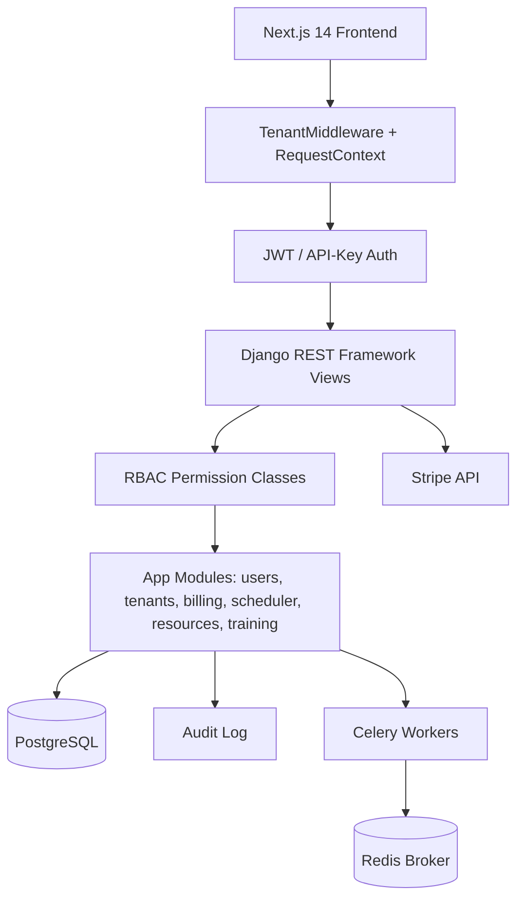

# SaaS Web Platform

A multi-tenant SaaS web platform built from scratch with a Django REST Framework
backend and a Next.js 14 frontend. It implements the cross-cutting machinery every
SaaS product needs — token and API-key authentication, organization-scoped role-based
access control, Stripe billing, audit logging, background task scheduling, and admin
dashboards — plus GPU/compute resource and ML training orchestration apps.

## Features

- **JWT + API-key authentication** — HS256 tokens issued with PyJWT, short-lived access
  plus long-lived refresh tokens, and SHA-256-hashed API keys (`apps.users.authentication`).
- **Custom user model** — email-as-username `User` with Argon2 password hashing and UUID
  primary keys (`apps.users.models`).
- **Multi-tenancy** — `Tenant`, `TenantMembership`, and `Invitation` models with per-request
  tenant resolution from header, query param, or subdomain (`apps.core.middleware.TenantMiddleware`).
- **Role-based access control** — owner/admin/member/viewer roles enforced by DRF permission
  classes `IsTenantMember`, `IsTenantAdmin`, `IsTenantOwner`, and `HasAPIKeyScope`
  (`apps.core.permissions`).
- **Stripe billing** — subscriptions, plans, invoices, payment methods, usage records,
  checkout/portal sessions, and webhook handling (`apps.billing`).
- **Audit logging** — thread-local request context feeds an `AuditLog` of create/update/
  delete/login/logout actions (`apps.core.audit`).
- **Background scheduling** — `ScheduledTask`/`TaskExecution` over Celery with once/interval/
  cron schedules and retry tracking (`apps.scheduler`).
- **Resource + training orchestration** — GPU compute nodes, allocations, quotas, and
  distributed ML training jobs, experiments, and sweeps (`apps.resources`, `apps.training`).
- **Next.js frontend** — App Router with auth, dashboard, and admin route groups, React
  Query, Zustand, and Zod (`frontend/`).

## Architecture



| Component | Module | Responsibility |
|-----------|--------|----------------|
| Authentication | `apps.users.authentication` | JWT and API-key auth classes, token creation |
| Users | `apps.users.models` | Custom `User`, `APIKey` |
| Tenancy | `apps.tenants.models` | `Tenant`, `TenantMembership`, `Invitation` |
| Tenant context | `apps.core.middleware` | Resolve tenant per request, thread-local context |
| RBAC | `apps.core.permissions` | Role and scope permission classes |
| Billing | `apps.billing` | Stripe service, models, webhook handlers |
| Audit | `apps.core.audit` | `AuditService` writing `AuditLog` entries |
| Scheduler | `apps.scheduler` | Celery-backed scheduled tasks and executions |
| Resources | `apps.resources` | Compute nodes, GPUs, allocations, quotas |
| Training | `apps.training` | Distributed training jobs, experiments, sweeps |
| Frontend | `frontend/app` | Next.js App Router pages and route groups |

## Quick Start

### Prerequisites

- Python 3.11+
- Node.js 18+ (for the frontend)
- PostgreSQL 15+ and Redis 7+ (or use Docker Compose)
- Stripe test keys are only needed to exercise live billing calls

### Installation

```bash
# Backend
cd backend
pip install -r requirements.txt

# Frontend
cd ../frontend
npm install
```

### Running

```bash
# Start Postgres + Redis, then both dev servers
make dev

# Or run the backend alone
cd backend
python manage.py migrate
python manage.py runserver
```

The backend serves under `/api/v1/`; the frontend dev server runs on
`http://localhost:3000`. See [`docs/DEPLOYMENT.md`](docs/DEPLOYMENT.md) for Docker and
production deployment.

## Usage

Register a user and call an authenticated endpoint:

```bash
# Register — returns access_token and refresh_token
curl -X POST http://localhost:8000/api/v1/auth/register/ \
  -H 'Content-Type: application/json' \
  -d '{"email":"dev@example.com","password":"DevPass123!","first_name":"Dev"}'

# Use the access token
curl http://localhost:8000/api/v1/auth/me/ \
  -H 'Authorization: Bearer <access_token>'

# Create a tenant (the creator becomes owner)
curl -X POST http://localhost:8000/api/v1/tenants/ \
  -H 'Authorization: Bearer <access_token>' \
  -H 'Content-Type: application/json' \
  -d '{"name":"Acme","slug":"acme"}'
```

Mint a JWT directly against the real auth helper:

```python
from apps.users.models import User
from apps.users.authentication import create_jwt_token

user = User.objects.create_user(email="dev@example.com", password="DevPass123!")
access = create_jwt_token(user, expires_in_hours=1)
refresh = create_jwt_token(user, expires_in_hours=24 * 7)
```

See [`docs/API.md`](docs/API.md) for the full endpoint reference and
[`docs/ARCHITECTURE.md`](docs/ARCHITECTURE.md) for the system design.

## What's Real vs Simulated

- **Real:** The custom user model, JWT/API-key authentication, tenant resolution
  middleware, RBAC permission classes, audit logging, and the relational models for
  tenants, billing, scheduler, resources, and training. Django/DRF wiring, URL routing,
  and serializers are fully implemented and exercised by the test suite.
- **Simulated / requires credentials:** Stripe calls (`apps.billing.services.StripeService`)
  hit the live Stripe API and require `STRIPE_SECRET_KEY` / `STRIPE_WEBHOOK_SECRET`; tests
  mock them. Celery task execution requires a running Redis broker and workers. Password-reset
  email delivery is stubbed (the view returns success without sending). Resource and training
  apps model and track orchestration state but do not provision real GPUs or launch real jobs.

## Testing

```bash
cd backend
pytest                       # or: make test  (backend + frontend)
```

The backend suite (`tests/backend/`) covers authentication and JWT handling,
subscriptions, scheduler, resources, and training. Tests auto-skip when Django is not
installed (`tests/backend/conftest.py`); Stripe and Celery are mocked. Frontend tests run
under Jest (`tests/frontend/`).

## Project Structure

```
05-saas-web-platform/
├── backend/
│   ├── apps/
│   │   ├── users/          # User, APIKey, JWT + API-key auth
│   │   ├── tenants/        # Tenant, membership, invitation
│   │   ├── billing/        # Stripe service, models, webhooks
│   │   ├── core/           # middleware, permissions, audit, exceptions
│   │   ├── scheduler/      # Celery-backed scheduled tasks
│   │   ├── resources/      # GPU/compute nodes, allocations, quotas
│   │   ├── training/       # distributed ML training jobs
│   │   └── admin_dashboard/# admin stats and audit endpoints
│   └── config/             # Django settings, urls, celery
├── frontend/               # Next.js 14 App Router app
├── tests/                  # backend (pytest), frontend (jest), integration
└── docs/
    ├── BLUEPRINT.md        # Full architecture and design
    ├── API.md              # Full endpoint reference
    ├── ARCHITECTURE.md     # Deeper architecture notes
    └── DEPLOYMENT.md       # Deployment runbook
```

## API Reference

Core route groups (full detail in [`docs/API.md`](docs/API.md)):

- `auth/` — register, login, logout, me, password change/reset, token refresh
- `tenants/` — list/create tenants, members, invitation acceptance
- `billing/` — plans, subscription, invoices, payment methods, checkout, portal, webhook
- `scheduler/`, `resources/`, `training/` — DRF ViewSet routers
- `admin/` — dashboard stats, users, tenants, audit logs

## License

MIT — see [LICENSE](../LICENSE)
