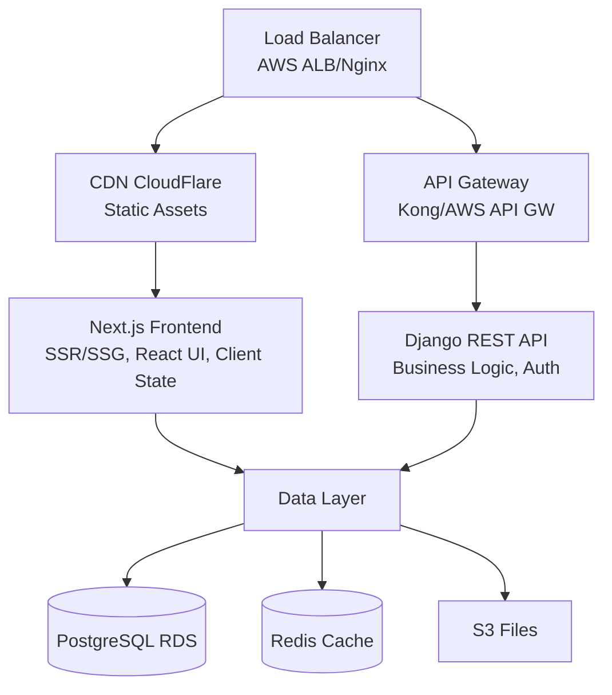

# SaaS Web Platform - Architecture Documentation

## Table of Contents
- [Overview](#overview)
- [System Architecture](#system-architecture)
- [Technology Stack](#technology-stack)
- [Component Design](#component-design)
- [Data Flow](#data-flow)
- [Security Architecture](#security-architecture)
- [Deployment Architecture](#deployment-architecture)
- [Scalability & Performance](#scalability--performance)

## Overview

The SaaS Web Platform is a modern, scalable multi-tenant application built with a microservices-oriented architecture. It combines a Next.js frontend with a Django REST API backend, designed to handle enterprise-grade workloads while maintaining developer productivity.

### Key Architectural Principles

1. **Separation of Concerns**: Clear boundaries between presentation, business logic, and data layers
2. **Scalability**: Horizontal scaling capabilities for both frontend and backend services
3. **Security First**: Zero-trust security model with defense in depth
4. **Developer Experience**: Modern tooling and clear development workflows
5. **Observability**: Comprehensive monitoring and logging throughout the stack

## System Architecture

### High-Level Architecture



### Microservices Breakdown

| Service | Technology | Purpose | Scaling Strategy |
|---------|-----------|---------|------------------|
| Frontend | Next.js | User Interface, SSR | Horizontal (Kubernetes) |
| API | Django REST | Business Logic | Horizontal (ECS/K8s) |
| Auth | Django + JWT | Authentication | Vertical + Caching |
| Billing | Django + Stripe | Subscription Management | Vertical |
| Workers | Celery | Async Processing | Horizontal (Queue-based) |
| WebSocket | Django Channels | Real-time Features | Horizontal (Redis Pub/Sub) |

## Technology Stack

### Frontend Stack
- **Framework**: Next.js 14 with App Router
- **UI Library**: React 18
- **Styling**: Tailwind CSS + CSS Modules
- **State Management**: Redux Toolkit + RTK Query
- **Forms**: React Hook Form + Zod validation
- **Testing**: Jest + React Testing Library
- **Build Tool**: Webpack 5 (via Next.js)

### Backend Stack
- **Framework**: Django 4.2 LTS
- **API**: Django REST Framework 3.14
- **Authentication**: JWT (djangorestframework-simplejwt)
- **Task Queue**: Celery 5.3 + Redis
- **WebSockets**: Django Channels 4.0
- **Database ORM**: Django ORM
- **Testing**: pytest + Factory Boy

### Infrastructure Stack
- **Container**: Docker + Docker Compose
- **Orchestration**: Kubernetes (EKS/GKE)
- **Database**: PostgreSQL 15
- **Cache**: Redis 7
- **Object Storage**: AWS S3 / MinIO
- **Message Queue**: Redis / RabbitMQ
- **Monitoring**: Prometheus + Grafana
- **Logging**: ELK Stack (Elasticsearch, Logstash, Kibana)

## Component Design

### Frontend Components

#### 1. Layout System
```typescript
interface LayoutProps {
  children: React.ReactNode;
  authenticated?: boolean;
  permissions?: string[];
}

// Nested layout structure
- RootLayout
  - AuthLayout (authenticated routes)
    - DashboardLayout
    - ProjectLayout
  - PublicLayout (public routes)
    - MarketingLayout
```

#### 2. Authentication Flow
```typescript
// Client-side auth state management
interface AuthState {
  user: User | null;
  tokens: {
    access: string;
    refresh: string;
  } | null;
  isAuthenticated: boolean;
  isLoading: boolean;
}

// Token refresh middleware
const tokenRefreshMiddleware = (store) => (next) => (action) => {
  if (isTokenExpired(store.getState().auth.tokens?.access)) {
    return refreshToken().then(() => next(action));
  }
  return next(action);
};
```

#### 3. Data Fetching Strategy
- **SSR**: Initial page loads for SEO-critical pages
- **SSG**: Marketing pages and documentation
- **CSR**: Dashboard and interactive features
- **ISR**: Blog posts and dynamic content

### Backend Components

#### 1. Multi-Tenancy Model
```python
class Organization(models.Model):
    """Tenant model for multi-tenancy"""
    id = models.UUIDField(primary_key=True, default=uuid.uuid4)
    name = models.CharField(max_length=255)
    slug = models.SlugField(unique=True)
    created_at = models.DateTimeField(auto_now_add=True)

class TenantAwareModel(models.Model):
    """Base model for tenant-scoped data"""
    organization = models.ForeignKey(Organization, on_delete=models.CASCADE)

    class Meta:
        abstract = True
```

#### 2. Permission System
```python
class RoleBasedPermission:
    """RBAC implementation"""
    ROLES = {
        'owner': ['*'],  # All permissions
        'admin': ['read', 'write', 'delete', 'invite'],
        'editor': ['read', 'write'],
        'viewer': ['read']
    }

    @staticmethod
    def has_permission(user, organization, permission):
        role = OrganizationMembership.objects.get(
            user=user,
            organization=organization
        ).role
        return permission in RoleBasedPermission.ROLES.get(role, [])
```

#### 3. API Versioning
```python
# URL-based versioning
urlpatterns = [
    path('api/v1/', include('apps.api.v1.urls')),
    path('api/v2/', include('apps.api.v2.urls')),
]

# Header-based versioning
class APIVersionMiddleware:
    def process_request(self, request):
        version = request.headers.get('API-Version', 'v1')
        request.api_version = version
```

## Data Flow

### Request Lifecycle

1. **Client Request** → CDN (static) or API Gateway (dynamic)
2. **Authentication** → JWT validation in middleware
3. **Authorization** → Permission checks based on user role
4. **Business Logic** → Service layer processing
5. **Data Access** → ORM queries with tenant filtering
6. **Response** → Serialization and caching
7. **Client Update** → State management and UI update

### Caching Strategy

```python
# Multi-level caching
CACHES = {
    'default': {
        'BACKEND': 'django_redis.cache.RedisCache',
        'LOCATION': 'redis://redis:6379/1',
        'OPTIONS': {
            'CLIENT_CLASS': 'django_redis.client.DefaultClient',
            'PARSER_CLASS': 'redis.connection.HiredisParser',
            'CONNECTION_POOL_CLASS': 'redis.BlockingConnectionPool',
            'CONNECTION_POOL_CLASS_KWARGS': {
                'max_connections': 50,
                'timeout': 20,
            },
        },
        'KEY_PREFIX': 'saas',
        'TIMEOUT': 300,  # 5 minutes default
    }
}

# Cache invalidation patterns
@receiver(post_save, sender=Project)
def invalidate_project_cache(sender, instance, **kwargs):
    cache_keys = [
        f'project_{instance.id}',
        f'org_{instance.organization_id}_projects',
        f'user_{instance.created_by_id}_projects',
    ]
    cache.delete_many(cache_keys)
```

### Real-time Updates

```python
# WebSocket consumer for real-time updates
class ProjectConsumer(AsyncWebsocketConsumer):
    async def connect(self):
        self.project_id = self.scope['url_route']['kwargs']['project_id']
        self.project_group = f'project_{self.project_id}'

        # Join project group
        await self.channel_layer.group_add(
            self.project_group,
            self.channel_name
        )
        await self.accept()

    async def project_update(self, event):
        # Send update to WebSocket
        await self.send(text_data=json.dumps(event['data']))
```

## Security Architecture

### Authentication & Authorization

1. **JWT-based Authentication**
   - Access token: 15 minutes TTL
   - Refresh token: 7 days TTL
   - Token rotation on refresh

2. **OAuth2 Integration**
   - Google OAuth
   - GitHub OAuth
   - SAML 2.0 for enterprise SSO

3. **Multi-Factor Authentication**
   - TOTP-based 2FA
   - SMS backup codes
   - Recovery codes

### Security Measures

```python
# Security middleware stack
MIDDLEWARE = [
    'django.middleware.security.SecurityMiddleware',
    'corsheaders.middleware.CorsMiddleware',
    'apps.security.middleware.RateLimitMiddleware',
    'apps.security.middleware.XSSProtectionMiddleware',
    'apps.security.middleware.CSRFProtectionMiddleware',
    'apps.security.middleware.SQLInjectionProtectionMiddleware',
]

# Rate limiting
RATE_LIMITS = {
    'api': '100/hour',
    'auth': '5/minute',
    'password_reset': '3/hour',
}

# Content Security Policy
CSP_DIRECTIVES = {
    'default-src': ["'self'"],
    'script-src': ["'self'", "'unsafe-inline'", 'https://cdn.jsdelivr.net'],
    'style-src': ["'self'", "'unsafe-inline'", 'https://fonts.googleapis.com'],
    'font-src': ["'self'", 'https://fonts.gstatic.com'],
    'img-src': ["'self'", 'data:', 'https:'],
}
```

### Data Protection

1. **Encryption at Rest**
   - Database encryption (AWS RDS encryption)
   - File storage encryption (S3 SSE)

2. **Encryption in Transit**
   - TLS 1.3 for all connections
   - Certificate pinning for mobile apps

3. **PII Handling**
   - Field-level encryption for sensitive data
   - Audit logging for data access
   - GDPR compliance tools

## Deployment Architecture

### Container Architecture

```dockerfile
# Multi-stage build for production
FROM node:18-alpine AS frontend-builder
WORKDIR /app
COPY frontend/package*.json ./
RUN npm ci --only=production
COPY frontend/ ./
RUN npm run build

FROM python:3.11-slim AS backend
WORKDIR /app
COPY backend/requirements.txt ./
RUN pip install --no-cache-dir -r requirements.txt
COPY backend/ ./
COPY --from=frontend-builder /app/.next /app/static/.next
CMD ["gunicorn", "config.wsgi:application", "--bind", "0.0.0.0:8000"]
```

### Kubernetes Deployment

```yaml
apiVersion: apps/v1
kind: Deployment
metadata:
  name: saas-platform-api
spec:
  replicas: 3
  strategy:
    type: RollingUpdate
    rollingUpdate:
      maxSurge: 1
      maxUnavailable: 0
  template:
    spec:
      containers:
      - name: api
        image: saas-platform:latest
        resources:
          requests:
            memory: "256Mi"
            cpu: "250m"
          limits:
            memory: "512Mi"
            cpu: "500m"
        livenessProbe:
          httpGet:
            path: /health
            port: 8000
          initialDelaySeconds: 30
          periodSeconds: 10
        readinessProbe:
          httpGet:
            path: /ready
            port: 8000
          initialDelaySeconds: 5
          periodSeconds: 5
```

### CI/CD Pipeline

```yaml
# GitHub Actions workflow
name: Deploy to Production
on:
  push:
    branches: [main]

jobs:
  test:
    runs-on: ubuntu-latest
    steps:
      - uses: actions/checkout@v3
      - name: Run tests
        run: |
          docker-compose -f docker-compose.test.yml up --abort-on-container-exit

  build-and-deploy:
    needs: test
    runs-on: ubuntu-latest
    steps:
      - name: Build and push Docker image
        run: |
          docker build -t ${{ secrets.ECR_REGISTRY }}/saas-platform:${{ github.sha }} .
          docker push ${{ secrets.ECR_REGISTRY }}/saas-platform:${{ github.sha }}

      - name: Deploy to Kubernetes
        run: |
          kubectl set image deployment/saas-platform-api \
            api=${{ secrets.ECR_REGISTRY }}/saas-platform:${{ github.sha }}
```

## Scalability & Performance

### Horizontal Scaling Strategy

1. **Frontend Scaling**
   - CDN for static assets
   - Multiple Next.js instances behind load balancer
   - Edge caching for SSG pages

2. **Backend Scaling**
   - Stateless API servers
   - Database read replicas
   - Connection pooling with pgBouncer

3. **Cache Scaling**
   - Redis Cluster for distributed caching
   - Cache warming strategies
   - Lazy loading for expensive computations

### Performance Optimization

```python
# Query optimization
class OptimizedProjectViewSet(viewsets.ModelViewSet):
    def get_queryset(self):
        return Project.objects.select_related(
            'organization',
            'created_by',
        ).prefetch_related(
            'members',
            'tags',
            Prefetch('tasks', queryset=Task.objects.filter(status='active'))
        ).filter(
            organization=self.request.user.organization
        )
```

### Monitoring & Observability

```python
# Custom metrics
from prometheus_client import Counter, Histogram, Gauge

api_requests = Counter('api_requests_total', 'Total API requests', ['method', 'endpoint'])
api_latency = Histogram('api_latency_seconds', 'API latency', ['endpoint'])
active_users = Gauge('active_users', 'Number of active users')

# Distributed tracing
import opentelemetry
from opentelemetry import trace
from opentelemetry.instrumentation.django import DjangoInstrumentor

DjangoInstrumentor().instrument()
tracer = trace.get_tracer(__name__)

@tracer.start_as_current_span("process_payment")
def process_payment(amount, user):
    span = trace.get_current_span()
    span.set_attribute("payment.amount", amount)
    span.set_attribute("user.id", user.id)
    # Payment processing logic
```

### Database Optimization

1. **Query Optimization**
   - Proper indexing strategy
   - Query analysis and EXPLAIN plans
   - N+1 query prevention

2. **Connection Management**
   - Connection pooling
   - Read/write splitting
   - Prepared statements

3. **Data Partitioning**
   - Table partitioning by tenant
   - Time-based partitioning for logs
   - Archival strategy for old data

## Disaster Recovery

### Backup Strategy
- **Database**: Daily automated backups with point-in-time recovery
- **Files**: S3 versioning and cross-region replication
- **Configuration**: GitOps with version control

### High Availability
- Multi-AZ deployment
- Auto-failover for databases
- Circuit breakers for external services
- Graceful degradation for non-critical features

### Recovery Procedures
1. **RTO**: 1 hour for critical services
2. **RPO**: 1 hour for transactional data
3. **Automated failover** for stateless services
4. **Manual intervention** for data consistency checks