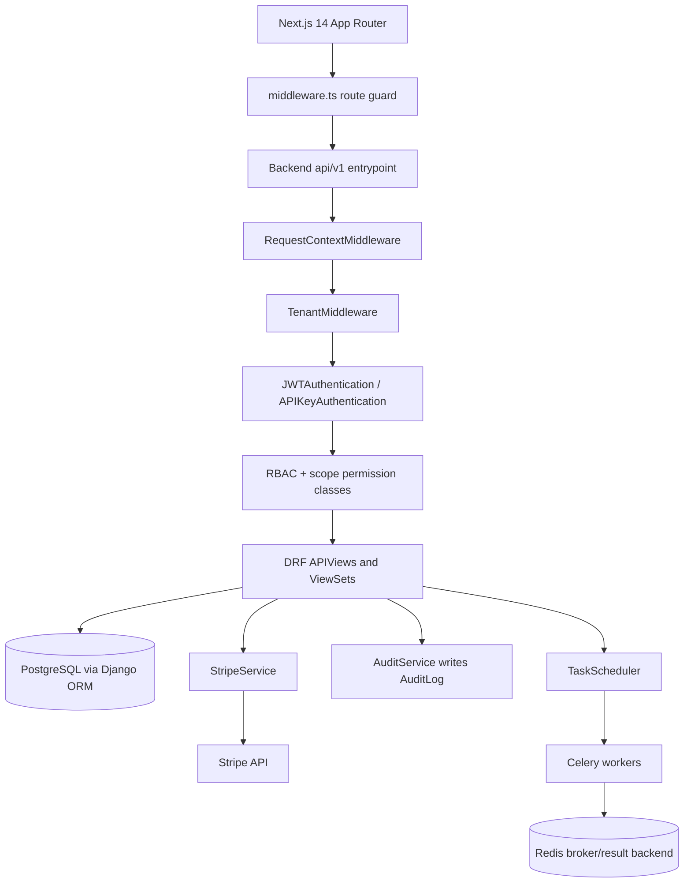

# SaaS Web Platform

## Overview

This project is a multi-tenant SaaS web platform built from scratch. The backend is a
Django REST Framework application; the frontend is a Next.js 14 App Router application.
The goal is not a single product feature but the *substrate* that nearly every SaaS
product re-implements: identity, organizations, role-based authorization, subscription
billing, audit trails, background work, and admin tooling — assembled so the cross-cutting
concerns compose cleanly rather than being bolted onto a single domain.

The domain on top of that substrate is GPU/compute resource management and distributed
ML training orchestration. Those two apps (`resources` and `training`) demonstrate that
the platform layer is reusable: they are ordinary tenant-scoped apps that lean on the same
authentication, tenancy, permission, and audit machinery as billing or user management.

### Goals

- **Tenant isolation by construction.** Every request resolves a tenant; data access and
  permissions hang off tenant membership rather than ad-hoc per-view checks.
- **Two first-class authentication paths.** Interactive users authenticate with JWTs;
  programmatic clients authenticate with hashed API keys carrying explicit scopes.
- **Authorization as composable policy.** Roles map to DRF permission classes that can be
  attached per view, and API keys carry scopes that gate machine access independently.
- **Billing that mirrors Stripe's lifecycle.** Local models shadow Stripe objects and are
  reconciled through webhooks, so the database is the source of truth for the UI while
  Stripe remains the source of truth for money.
- **Observability and safety.** Audit logging captures who did what; sensitive operations
  are funneled through services rather than scattered across views.

### Concepts it teaches

- Multi-tenant data modeling and per-request tenant resolution.
- Stateless JWT authentication and the trade-offs of refresh tokens.
- API-key authentication: prefix indexing, hash verification, scope checks.
- Role-based access control expressed as reusable permission policies.
- Stripe subscription billing and webhook-driven state reconciliation.
- Audit logging via thread-local request context.
- Celery-backed task scheduling with once/interval/cron semantics.
- Modeling orchestration state (GPU allocation, distributed training) relationally.

### Scope

In scope: the Django backend (models, auth, permissions, middleware, services, views,
URLs), the Next.js frontend skeleton (route groups, guards, providers), and the test
suite. Out of scope: real GPU provisioning, real distributed-training launch, production
secret management, and any live third-party integration beyond the Stripe client calls
the billing service makes.

### Design principles

A few principles recur throughout and are worth stating up front, because they explain why
the code is shaped the way it is:

- **Tenant is ambient, authorization is explicit.** The tenant is resolved once, in
  middleware, and made available everywhere via the request and thread-local storage — so no
  view has to parse it. Authorization, by contrast, is never ambient: every protected view
  attaches the specific permission policy it requires, so the access rule is visible at the
  call site rather than buried in a base class.
- **Side effects belong in services, not views.** Anything that touches Stripe, mutates the
  GPU fleet, schedules background work, or writes an audit record goes through a service
  object. Views orchestrate; services act. This keeps the HTTP layer thin and the
  side-effecting logic unit-testable without a request.
- **The database constrains state.** Statuses and roles are enumerated with Django
  `TextChoices`/`IntegerChoices`, uniqueness constraints prevent duplicate memberships and
  runs, and the hot query paths are explicitly indexed. Invalid states are made
  unrepresentable where practical.
- **Stripe is the source of truth for money; the database is the source of truth for the
  UI.** Local billing models shadow Stripe and are reconciled by webhooks, so the product can
  render fast from its own tables without round-tripping to Stripe on every page load.

### Why this stack

Django REST Framework supplies the user model, ORM, migrations, admin, serialization, and a
pluggable authentication/permission pipeline — exactly the cross-cutting surface a SaaS
backend needs — so the project can focus on the platform logic rather than HTTP plumbing.
PostgreSQL provides JSON columns for open-ended per-record configuration alongside relational
integrity for the things that must be consistent. Redis backs Celery for background and
scheduled work. Next.js 14's App Router gives the frontend server components, route groups,
and edge middleware for auth guarding. The combination is intentionally conventional: the
interesting work is in how the pieces compose, not in any single exotic dependency.

## Architecture



### Layering

Requests enter through Django's middleware stack. `RequestContextMiddleware` stashes the
request in thread-local storage so deep helpers (the audit service in particular) can reach
the current user and tenant without threading them through every call. `TenantMiddleware`
then resolves the active tenant from the `X-Tenant-ID` header, a `tenant_id` query
parameter, or a subdomain, and attaches it to both the request and thread-local storage.

DRF then authenticates the request. Two authentication classes coexist: `JWTAuthentication`
validates a `Bearer` token, and `APIKeyAuthentication` validates an `X-API-Key` header.
Whichever succeeds sets `request.user` and `request.auth`. Permission classes run next:
the tenant-membership policies (`IsTenantMember`, `IsTenantAdmin`, `IsTenantOwner`) and
`HasAPIKeyScope` decide whether the authenticated principal may act in the resolved tenant.

Views are deliberately thin. Stripe interactions live in `StripeService`; audit writes
live in `AuditService`; scheduling lives in `TaskScheduler`. This keeps the HTTP layer
focused on serialization and orchestration and makes the side-effecting logic unit-testable
in isolation.

### App map

| App | Purpose |
|-----|---------|
| `apps.users` | Custom `User`, `APIKey`, JWT and API-key authentication, auth views |
| `apps.tenants` | `Tenant`, `TenantMembership`, `Invitation`, workspace views |
| `apps.core` | Base models, tenant/audit middleware, permission classes, exceptions, audit service |
| `apps.billing` | `Plan`, `Subscription`, `Invoice`, `PaymentMethod`, `UsageRecord`, Stripe service, webhooks |
| `apps.scheduler` | `ScheduledTask`, `TaskExecution`, Celery-backed `TaskScheduler` |
| `apps.resources` | `ComputeNode`, `GPU`, `ResourceAllocation`, `ResourceQuota`, `ResourceReservation` |
| `apps.training` | `TrainingJob`, `TrainingRun`, `Experiment`, `HyperparameterSweep`, `ModelArtifact` |
| `apps.admin_dashboard` | Platform-wide stats, users, tenants, audit-log, growth-chart endpoints |

## Core Components

### Authentication (`apps.users.authentication`)

Two stateless authentication classes back the API. Both are registered (alongside
`SessionAuthentication`) in `REST_FRAMEWORK['DEFAULT_AUTHENTICATION_CLASSES']`.

**JWT.** `create_jwt_token` builds an HS256 token with `user_id`, `email`, `iat`, and an
`exp` derived from `expires_in_hours`. Views issue a short-lived access token
(`expires_in_hours=1`) and a long-lived refresh token (`24 * 7` hours) at register/login.
`JWTAuthentication.authenticate` parses the `Authorization: Bearer <token>` header, decodes
and validates the token, loads the user, and rejects inactive accounts.

```python
def create_jwt_token(user, expires_in_hours=None):
    payload = {
        'user_id': str(user.id),
        'email': user.email,
        'exp': datetime.utcnow() + timedelta(hours=expires_in_hours),
        'iat': datetime.utcnow(),
    }
    return jwt.encode(payload, settings.JWT_SECRET_KEY, algorithm=settings.JWT_ALGORITHM)
```

Tokens are signed and verified with `settings.JWT_SECRET_KEY` — a secret kept distinct from
Django's `SECRET_KEY` so the two can be rotated independently. It is sourced from the
environment (`JWT_SECRET_KEY`); base settings supply no insecure default and production
settings raise `ImproperlyConfigured` when it is missing, so a misconfigured deployment
fails loudly instead of signing tokens with a predictable key.

Because JWTs are stateless, logout is a no-op on the server (the client discards the token).
Token refresh verifies the refresh token's signature and expiry through the same
`decode_jwt_token` helper before minting a fresh access token — an expired or forged refresh
token is rejected. This is the standard trade-off: cheap, horizontally scalable verification
at the cost of not being able to revoke an individual token before it expires.

**API keys.** `generate_api_key` produces a URL-safe secret, takes the first 8 characters
as a `prefix` (indexed for fast lookup), and stores only the SHA-256 hash. On each request
`APIKeyAuthentication` extracts the prefix, finds the candidate key, recomputes the hash of
the presented key, and compares — so the raw key is never persisted. It also enforces
expiry and updates `last_used_at`.

```python
def generate_api_key():
    key = secrets.token_urlsafe(32)
    prefix = key[:8]
    key_hash = hashlib.sha256(key.encode()).hexdigest()
    return key, prefix, key_hash
```

### Users (`apps.users.models`)

`User` is a custom `AbstractBaseUser` + `PermissionsMixin` with email as the username
field, a UUID primary key, `email_verified`, name fields, an `avatar_url`, and
`last_login_at`. A `UserManager` provides `create_user`/`create_superuser`. Passwords are
hashed with Argon2 (`PASSWORD_HASHERS` puts `Argon2PasswordHasher` first). `APIKey` belongs
to a user and carries `name`, `key_hash`, `prefix`, a `scopes` JSON list, and optional
expiry.

### Tenancy (`apps.tenants.models`, `apps.core.middleware`)

`Tenant` is an organization/workspace with a unique `slug`, a free-form `settings` JSON
blob, and a `stripe_customer_id`. `TenantMembership` links a user to a tenant with a role
drawn from `Role` (`owner`, `admin`, `member`, `viewer`) and tracks invitation/acceptance
timestamps; `(tenant, user)` is unique. `Invitation` represents a pending invite by email
with a unique token and expiry.

`TenantMiddleware` resolves the active tenant per request:

```python
def process_request(self, request):
    tenant_id = request.headers.get('X-Tenant-ID')
    if not tenant_id:
        tenant_id = request.GET.get('tenant_id')
    if not tenant_id:
        host = request.get_host().split(':')[0]
        parts = host.split('.')
        if len(parts) > 2:
            tenant = Tenant.objects.get(slug=parts[0])
            tenant_id = str(tenant.id)
    # ... load Tenant by id, attach to request.tenant and thread-local
```

When a tenant is created, the creating user is immediately made an `OWNER` member with
`accepted_at` set, so a brand-new tenant always has exactly one fully privileged member.

### Authorization (`apps.core.permissions`)

Authorization is expressed as small DRF permission classes that read the resolved tenant
and the membership table:

- `IsTenantMember` — the user has any membership in `request.tenant`.
- `IsTenantAdmin` — membership role is `OWNER` or `ADMIN`.
- `IsTenantOwner` — membership role is `OWNER`.
- `HasAPIKeyScope` — when the request is authenticated by an API key, the required scope
  must be present in the key's `scopes`; JWT-authenticated requests pass through.

```python
class IsTenantAdmin(permissions.BasePermission):
    def has_permission(self, request, view):
        if not request.user.is_authenticated:
            return False
        tenant = getattr(request, 'tenant', None)
        if not tenant:
            return False
        return TenantMembership.objects.filter(
            tenant=tenant,
            user=request.user,
            role__in=[TenantMembership.Role.OWNER, TenantMembership.Role.ADMIN],
        ).exists()
```

This keeps authorization declarative: a view attaches the policy it needs, and the policy
encapsulates the membership query. Role and scope checks are orthogonal — a request can be
gated on both a role (interactive users) and a scope (API keys) without the view caring how
the principal authenticated.

### Billing (`apps.billing`)

The billing models shadow Stripe's object graph. `Plan` holds monthly/yearly prices and
the corresponding Stripe price IDs plus limits (`max_users`, `max_storage_gb`, `features`).
`Subscription` is one-to-one with a tenant and carries a `Status` enum (`active`,
`past_due`, `canceled`, `trialing`, `paused`), a billing interval, the
`stripe_subscription_id`, and period/trial/cancel timestamps. `Invoice`, `PaymentMethod`
(masked card details), and `UsageRecord` (metered metrics) round out the model.

`StripeService` is the single entry point for Stripe calls — customer creation, subscription
create/cancel/update (with `proration_behavior='create_prorations'`), setup intents, payment
method attach/detach, billing-portal and checkout sessions, usage recording, and invoice
sync. Subscriptions are created with a 14-day trial:

```python
stripe_sub = stripe.Subscription.create(
    customer=customer_id,
    items=[{'price': price_id}],
    default_payment_method=payment_method_id,
    trial_period_days=14,
    metadata={'tenant_id': str(tenant.id), 'plan_id': str(plan.id)},
)
```

`webhooks.handle_webhook` verifies the signature with `STRIPE_WEBHOOK_SECRET` and dispatches
on event type — subscription created/updated/deleted, invoice paid/created/payment_failed,
payment-method attached, and checkout completed. `map_subscription_status` translates
Stripe's status vocabulary into the local `Subscription.Status` enum, and a failed invoice
flips the subscription to `past_due`. The pattern is webhook-as-reconciliation: our database
trails Stripe, and webhooks keep it consistent.

### Audit logging (`apps.core.audit`, `apps.core.models`)

`AuditLog` records `action` (`create`/`update`/`delete`/`login`/`logout`), `resource_type`,
`resource_id`, a `changes` JSON diff, the actor, the tenant, and request metadata
(`ip_address`, `user_agent`), indexed by `(tenant, created_at)`, `(user, created_at)`, and
`(resource_type, resource_id)`. `AuditService` provides `log`, `log_create`, `log_update`,
`log_delete`, `log_login`, and `log_logout`. When user/tenant/request data is not passed
explicitly, the service pulls it from thread-local storage populated by the middleware, so
callers usually only supply the action and resource. `get_client_ip` honors
`X-Forwarded-For`.

### Scheduling (`apps.scheduler`)

`ScheduledTask` describes a unit of background work: the Celery `task_name`, JSON `args`/
`kwargs`, a `schedule_type` of `once`/`interval`/`cron`, the cron expression or interval,
the computed `next_run`, a `TaskStatus`, a `TaskPriority`, retry configuration, and optional
tenant/owner. `TaskExecution` records each attempt with timing, result, error, and traceback.

`TaskScheduler` creates tasks (computing the initial `next_run`, using `croniter` for cron
schedules when available), submits them to Celery via `current_app.send_task`, cancels them
(revoking running Celery tasks), retries failed ones up to `max_retries`, and surfaces
status. `TaskQueueManager` inspects live workers (`active`/`reserved`/`scheduled`, worker
ping/stats). `CronSchedule.get_presets` ships common cron strings (every minute, hourly,
daily, weekly, monthly).

### Resources and training (`apps.resources`, `apps.training`)

These are the domain apps layered on the platform. `resources` models a GPU fleet:
`ComputeNode` (hardware spec, region, status, per-hour price in cents), `GPU` (per-device
metrics and current allocation), `ResourceAllocation` (tenant request with priority, status,
cost tracking, and a `calculate_cost` helper), `ResourceQuota` (per-tenant limits and live
usage with `can_allocate_gpus`), and `ResourceReservation` (future/recurring reservations).

The allocation lifecycle lives in `ResourceManager` and is the clearest example of the
service pattern doing real work under a transaction. `allocate` runs the full admission path:

1. **Quota admission.** `check_quota` loads (or lazily creates) the tenant's `ResourceQuota`
   and rejects the request if it would exceed `max_gpus`, exhaust monthly GPU hours, hit the
   `max_concurrent_jobs` ceiling, or blow the monthly budget — each with a specific message.
2. **Placement.** `find_available_nodes` annotates each `ComputeNode` with its count of
   `AVAILABLE` GPUs, filters to nodes that can satisfy `gpu_count` (optionally constrained by
   `gpu_type` and `region`), and orders by `price_per_hour` so the cheapest viable node wins.
3. **Reservation of devices.** The first `requested_gpus` available `GPU` rows on the chosen
   node are flipped to `ALLOCATED` and pointed at the new `ResourceAllocation`.
4. **Accounting.** The quota's live counters (`current_gpus_allocated`, `current_jobs_running`)
   are incremented, an estimated cost is recorded, and the allocation transitions
   `PENDING → ACTIVE` with `started_at` set.

```python
@transaction.atomic
def allocate(self, tenant, created_by, requested_gpus=1, gpu_type=None, ...):
    can_allocate, reason = self.check_quota(tenant, requested_gpus)
    if not can_allocate:
        raise ValueError(reason)
    nodes = self.find_available_nodes(gpu_type, requested_gpus, region)
    if not nodes:
        raise ValueError("No available nodes ...")
    node = nodes[0]
    allocation = ResourceAllocation.objects.create(tenant=tenant, node=node, ...)
    for gpu in node.gpus.filter(status=ResourceStatus.AVAILABLE)[:requested_gpus]:
        gpu.status = ResourceStatus.ALLOCATED
        gpu.current_allocation = allocation
        gpu.save()
    # increment quota counters, mark allocation ACTIVE
```

`release` runs the inverse: it frees the GPUs, computes the *actual* cost from
`duration_hours × price_per_hour × requested_gpus`, transitions the allocation to
`COMPLETED`, and decrements the live quota counters while folding the consumed GPU-hours and
spend into the monthly totals. `preempt` is layered on top — it refuses to touch a
non-`preemptible` allocation, otherwise records a reason and calls `release`, which is how a
higher-priority request reclaims capacity. Wrapping the whole sequence in
`@transaction.atomic` is deliberate: GPU state, quota counters, and allocation status must
move together or not at all, or the fleet's bookkeeping drifts.

`QuotaManager` owns quota defaults (4 GPUs, 100 monthly GPU-hours, 5 concurrent jobs, 100 GB)
and monthly resets. `ReservationManager` checks for overlapping reservations of the same GPU
type before booking future capacity and can later `activate_reservation` by handing the
reservation off to `ResourceManager.allocate`.

`training` models distributed ML jobs on top of those allocations: `TrainingJob` (framework,
distributed strategy — DDP/FSDP/ZeRO/tensor/pipeline parallel — code source, resource
requirements, world size, mixed precision, progress and metrics, checkpoint config) linked to
a `ResourceAllocation`; `TrainingRun` (individual attempts), `Experiment` (grouping with
best-result tracking), `HyperparameterSweep` (grid/random/Bayesian/Hyperband search), and
`ModelArtifact` (checkpoints and exports). Both apps expose DRF `ViewSet` routers under
`resources/` and `training/`.

### Admin dashboard (`apps.admin_dashboard`)

The admin endpoints are gated by DRF's `IsAdminUser` (i.e. `is_staff`) rather than tenant
membership, because they span every tenant. `AdminDashboardView` returns a summary plus the
most recent users and tenants; `AdminStatsView` aggregates platform-wide counts — users
(total, active, new in the last 7 days), tenants, subscription status breakdown, and revenue
derived from `PAID` invoices, with a 30-day MRR figure computed by summing paid invoice
totals over the trailing month. `AdminAuditLogsView` exposes the audit trail, and
`AdminGrowthChartView` buckets signups by day with `TruncDate`. These views are read-mostly
aggregations over the same models the product API writes, which is why the audit log and the
subscription status enum need to be reliable: they are the ground truth the dashboard reports.

### Request lifecycle

Putting the pieces together, a typical authenticated, tenant-scoped write request flows as:

1. `RequestContextMiddleware` stores the request in thread-local storage.
2. `TenantMiddleware` resolves the tenant (header → query param → subdomain) and attaches it.
3. DRF runs `JWTAuthentication` then `APIKeyAuthentication`; the first to return a principal
   sets `request.user` and `request.auth`.
4. The view's permission classes run — e.g. `IsTenantAdmin` checks the membership table for
   an owner/admin role in the resolved tenant; `HasAPIKeyScope` additionally checks the key's
   scopes when the principal is an API key.
5. The view deserializes input, delegates side effects to a service (`StripeService`,
   `ResourceManager`, `TaskScheduler`), and optionally records an `AuditLog` entry — for
   which `AuditService` reads the actor/tenant/IP back out of thread-local storage.
6. `process_response` on each middleware tears down the thread-local entries so nothing leaks
   between requests on a reused worker thread.

### Frontend (`frontend/`)

The Next.js App Router app organizes pages into route groups: `(auth)` for login/register,
`(dashboard)` for the authenticated product surface (billing, profile, settings, API keys,
team), and a top-level `admin/` area. `middleware.ts` guards routes at the edge;
`components/guards` provides `require-auth` and `require-permission` wrappers. Data fetching
uses React Query, client state uses Zustand, and form validation uses Zod.

### Serializers and view contracts

Serializers enforce the read/write contract at the boundary. `UserSerializer` marks `id`,
`email`, `email_verified`, `created_at`, and `last_login_at` read-only, so a profile PATCH
can never escalate or rewrite identity fields. `RegisterSerializer` performs a
case-insensitive duplicate-email check and runs Django's `validate_password` against the
configured validators (minimum length 8, common-password and numeric-password checks).
`APIKeySerializer` deliberately omits the key hash and the raw key from its field list — only
the `prefix` is ever exposed — and `CreateAPIKeySerializer` bounds `expires_in_days` to
1–365.

Views layer authorization on top of serializer validation. The billing views illustrate the
graduated model in practice: viewing a subscription or invoices requires only tenant
membership (`get_object_or_404(TenantMembership, ...)`), creating or changing a subscription
requires `OWNER` or `ADMIN`, and canceling a subscription requires `OWNER` specifically.
`CheckoutSessionView`, `BillingPortalView`, and the payment-method mutations apply the same
owner/admin gate before calling into `StripeService`. The Stripe webhook receiver
(`WebhookView`) is the lone `AllowAny` endpoint, because it is authenticated by Stripe's
signature rather than by a platform principal; it reads the raw body and the
`Stripe-Signature` header and hands both to `handle_webhook`.

This split — serializers validate shape, permission classes validate identity, views encode
the role thresholds for each operation, and services perform the side effects — is the
consistent spine across every app.

## Data Structures

Key backend models (Django ORM, abridged to load-bearing fields):

```python
class User(AbstractBaseUser, PermissionsMixin):
    id = models.UUIDField(primary_key=True, default=uuid.uuid4, editable=False)
    email = models.EmailField(unique=True)
    email_verified = models.BooleanField(default=False)
    USERNAME_FIELD = 'email'

class APIKey(models.Model):
    user = models.ForeignKey(User, on_delete=models.CASCADE, related_name='api_keys')
    key_hash = models.CharField(max_length=255)
    prefix = models.CharField(max_length=10)      # indexed
    scopes = models.JSONField(default=list)
    expires_at = models.DateTimeField(null=True, blank=True)

class Tenant(models.Model):
    id = models.UUIDField(primary_key=True, default=uuid.uuid4, editable=False)
    slug = models.SlugField(unique=True)
    settings = models.JSONField(default=dict)
    stripe_customer_id = models.CharField(max_length=100, blank=True)

class TenantMembership(models.Model):
    class Role(models.TextChoices):
        OWNER = 'owner'; ADMIN = 'admin'; MEMBER = 'member'; VIEWER = 'viewer'
    tenant = models.ForeignKey(Tenant, on_delete=models.CASCADE, related_name='memberships')
    user = models.ForeignKey(User, on_delete=models.CASCADE, related_name='tenant_memberships')
    role = models.CharField(max_length=20, choices=Role.choices, default=Role.MEMBER)
    class Meta:
        unique_together = ['tenant', 'user']
```

Billing core:

```python
class Subscription(models.Model):
    class Status(models.TextChoices):
        ACTIVE='active'; PAST_DUE='past_due'; CANCELED='canceled'
        TRIALING='trialing'; PAUSED='paused'
    tenant = models.OneToOneField(Tenant, on_delete=models.CASCADE, related_name='subscription')
    plan = models.ForeignKey(Plan, on_delete=models.PROTECT)
    status = models.CharField(max_length=20, choices=Status.choices, default=Status.TRIALING)
    stripe_subscription_id = models.CharField(max_length=100, blank=True)
    trial_ends_at = models.DateTimeField(null=True, blank=True)
    current_period_end = models.DateTimeField(null=True, blank=True)
```

Audit:

```python
class AuditLog(BaseModel):
    class Action(models.TextChoices):
        CREATE='create'; UPDATE='update'; DELETE='delete'; LOGIN='login'; LOGOUT='logout'
    tenant = models.ForeignKey('tenants.Tenant', on_delete=models.CASCADE, null=True, blank=True)
    user = models.ForeignKey('users.User', on_delete=models.SET_NULL, null=True, blank=True)
    action = models.CharField(max_length=20, choices=Action.choices)
    resource_type = models.CharField(max_length=100)
    resource_id = models.CharField(max_length=100)
    changes = models.JSONField(default=dict)
    class Meta:
        indexes = [
            models.Index(fields=['tenant', 'created_at']),
            models.Index(fields=['resource_type', 'resource_id']),
        ]
```

Scheduling:

```python
class ScheduledTask(models.Model):
    task_name = models.CharField(max_length=255)         # Celery task name
    args = models.JSONField(default=list, blank=True)
    kwargs = models.JSONField(default=dict, blank=True)
    schedule_type = models.CharField(max_length=20, default='once')  # once/interval/cron
    cron_expression = models.CharField(max_length=100, blank=True, null=True)
    interval_seconds = models.IntegerField(null=True, blank=True)
    next_run = models.DateTimeField(null=True, blank=True)
    max_retries = models.IntegerField(default=3)
```

Billing plan limits and metered usage:

```python
class Plan(models.Model):
    slug = models.SlugField(unique=True)
    price_monthly = models.DecimalField(max_digits=10, decimal_places=2)
    price_yearly = models.DecimalField(max_digits=10, decimal_places=2)
    stripe_price_id_monthly = models.CharField(max_length=100, blank=True)
    stripe_price_id_yearly = models.CharField(max_length=100, blank=True)
    max_users = models.IntegerField(default=5)
    max_storage_gb = models.IntegerField(default=10)
    features = models.JSONField(default=dict)

class UsageRecord(models.Model):
    tenant = models.ForeignKey(Tenant, on_delete=models.CASCADE, related_name='usage_records')
    subscription = models.ForeignKey(Subscription, on_delete=models.CASCADE)
    metric = models.CharField(max_length=50)   # e.g. 'api_calls', 'storage_gb'
    quantity = models.IntegerField()
    timestamp = models.DateTimeField()
    class Meta:
        indexes = [models.Index(fields=['tenant', 'metric', 'timestamp'])]
```

Resource fleet and allocation:

```python
class ComputeNode(models.Model):
    gpu_type = models.CharField(max_length=50, choices=GPUType.choices)
    gpu_count = models.IntegerField(default=1)
    region = models.CharField(max_length=50)
    status = models.CharField(max_length=20, choices=ResourceStatus.choices,
                              default=ResourceStatus.AVAILABLE)
    price_per_hour = models.IntegerField(help_text="Price per hour in cents")
    class Meta:
        indexes = [
            models.Index(fields=['gpu_type', 'status']),
            models.Index(fields=['region', 'status']),
        ]

class ResourceAllocation(models.Model):
    class AllocationStatus(models.TextChoices):
        PENDING='pending'; ACTIVE='active'; COMPLETED='completed'
        FAILED='failed'; CANCELLED='cancelled'; PREEMPTED='preempted'
    tenant = models.ForeignKey(Tenant, on_delete=models.CASCADE, related_name='resource_allocations')
    node = models.ForeignKey(ComputeNode, on_delete=models.CASCADE, related_name='allocations')
    requested_gpus = models.IntegerField(default=1)
    priority = models.IntegerField(default=5)        # 1=low ... 20=critical
    preemptible = models.BooleanField(default=False)
    estimated_cost_cents = models.IntegerField(null=True, blank=True)
    actual_cost_cents = models.IntegerField(null=True, blank=True)

class ResourceQuota(models.Model):
    tenant = models.OneToOneField(Tenant, on_delete=models.CASCADE, related_name='resource_quota')
    max_gpus = models.IntegerField(default=4)
    max_gpu_hours_monthly = models.IntegerField(default=100)
    max_concurrent_jobs = models.IntegerField(default=5)
    current_gpus_allocated = models.IntegerField(default=0)
    gpu_hours_used_this_month = models.FloatField(default=0)
```

Distributed training job (abridged):

```python
class TrainingJob(models.Model):
    tenant = models.ForeignKey(Tenant, on_delete=models.CASCADE, related_name='training_jobs')
    framework = models.CharField(max_length=20, choices=TrainingFramework.choices,
                                 default=TrainingFramework.PYTORCH)
    strategy = models.CharField(max_length=20, choices=DistributedStrategy.choices,
                                default=DistributedStrategy.DATA_PARALLEL)
    gpu_count = models.IntegerField(default=1)
    world_size = models.IntegerField(default=1)
    mixed_precision = models.CharField(max_length=10, default='fp16')  # fp32/fp16/bf16
    allocation = models.ForeignKey(ResourceAllocation, on_delete=models.SET_NULL,
                                   null=True, blank=True, related_name='training_jobs')
    status = models.CharField(max_length=20, choices=JobStatus.choices,
                              default=JobStatus.PENDING)
    progress_percent = models.FloatField(default=0)
    checkpoint_interval_steps = models.IntegerField(default=1000)
```

UUID primary keys are used throughout (tenant-facing identifiers should not be guessable
sequential integers), `TextChoices`/`IntegerChoices` enums encode every status and role so
state is constrained at the database layer, and JSON fields (`settings`, `metadata`,
`features`, `metrics`, `distributed_config`) hold the open-ended, per-record configuration
that does not warrant its own column.

## API Design

Routing is anchored in `config/urls.py`; every app is mounted under `api/v1/`. The full
request/response reference lives in [`API.md`](API.md). The route groups:

```
api/v1/auth/
  POST   register/                 register, returns access + refresh tokens
  POST   login/                    authenticate, returns tokens
  POST   logout/                   client discards token (no-op server side)
  GET    me/                       current user profile
  PATCH  me/                       update profile
  POST   password/change/          change password
  POST   token/refresh/            mint a new access token from a refresh token
  POST   password/reset/           request reset (email stubbed)
  POST   password/reset/confirm/   confirm reset with token

api/v1/tenants/
  GET    /                         list the caller's tenants
  POST   /                         create a tenant (creator becomes owner)
  GET    {tenant_id}/              tenant detail
  PATCH  {tenant_id}/              update tenant
  DELETE {tenant_id}/              delete tenant
  GET    {tenant_id}/members/      list members
  POST   {tenant_id}/members/      invite a member
  POST   invitations/{token}/accept/   accept an invitation

api/v1/billing/
  GET    plans/                                  list active plans
  GET    tenants/{tenant_id}/subscription/       get/manage subscription
  GET    tenants/{tenant_id}/invoices/           list invoices
  GET    tenants/{tenant_id}/payment-methods/    list payment methods
  POST   tenants/{tenant_id}/checkout/           create a checkout session
  POST   tenants/{tenant_id}/portal/             create a billing-portal session
  POST   webhooks/stripe/                        Stripe webhook receiver

api/v1/scheduler/   tasks/ executions/ queues/ cron-schedules/   (DRF ViewSet routers)
api/v1/resources/   nodes/ gpus/ allocations/ quotas/ reservations/
api/v1/training/    jobs/ runs/ experiments/ sweeps/ artifacts/
api/v1/admin/       dashboard, stats/, users/, tenants/, audit-logs/, charts/growth/
api/v1/health/      health/  ready/
```

Authentication interfaces:

```
JWTAuthentication       header  Authorization: Bearer <jwt>
APIKeyAuthentication    header  X-API-Key: <key>
TenantMiddleware        header  X-Tenant-ID: <uuid>   (or ?tenant_id=, or subdomain)
```

DRF defaults from `settings.base`: `IsAuthenticated` default permission, `PageNumberPagination`
with `PAGE_SIZE=20`, and `DjangoFilterBackend` + search + ordering filter backends. Errors
are shaped by `apps.core.exceptions.custom_exception_handler`, with typed exceptions
(`PermissionDenied` → 403, `ResourceNotFound` → 404, `ValidationError` → 400, `ConflictError`
→ 409).

### Representative request/response shapes

Registration accepts an email, password, and optional names, and returns the serialized user
alongside both tokens:

```
POST /api/v1/auth/register/
{ "email": "dev@example.com", "password": "DevPass123!", "first_name": "Dev" }

201 Created
{
  "user": { "id": "...", "email": "dev@example.com", "full_name": "Dev",
            "email_verified": false, "created_at": "..." },
  "access_token": "<jwt, 1h>",
  "refresh_token": "<jwt, 7d>"
}
```

Creating a tenant returns the serialized tenant and silently makes the caller its owner:

```
POST /api/v1/tenants/
Authorization: Bearer <jwt>
{ "name": "Acme", "slug": "acme" }

201 Created
{ "id": "...", "name": "Acme", "slug": "acme", "is_active": true }
```

Creating or changing a subscription is owner/admin-only and returns the local subscription
record that shadows Stripe:

```
POST /api/v1/billing/tenants/{tenant_id}/subscription/
{ "plan_id": "...", "billing_interval": "monthly", "payment_method_id": "pm_..." }

201 Created
{ "id": "...", "plan": "...", "status": "trialing",
  "billing_interval": "monthly", "trial_ends_at": "...", "current_period_end": "..." }
```

A non-member receives `403` from the permission layer before the view body runs, and a
request for a missing tenant or subscription surfaces a typed `404` through the custom
exception handler. The Stripe webhook endpoint returns `{ "status": "success", "type": <event_type> }`
on a verified event and `400` with an error message on signature or payload failure.

## Performance

The platform targets the operational shape of an interactive SaaS API rather than a
benchmark number. The design choices that matter:

- **Indexes on hot paths.** `APIKey.prefix` is indexed so key lookup is a single indexed
  read before hash comparison. `AuditLog` is indexed by `(tenant, created_at)` and
  `(resource_type, resource_id)`. Scheduler, resource, and training tables are indexed by
  the `(status, …)` and `(tenant, status)` tuples their queries filter on.
- **Stateless authentication.** JWT verification is a signature check plus one user lookup
  with no session store, so authentication scales horizontally without shared state.
- **Thin views, isolated side effects.** Stripe, audit, and scheduling work is encapsulated
  in services, keeping request handlers cheap and making the expensive/external calls easy
  to cache, batch, or move off the request path.
- **Background work offloaded to Celery.** Long-running and scheduled work runs on Celery
  workers backed by Redis, keeping the request/response path fast.
- **Pagination by default.** All list endpoints paginate at 20 items, bounding response
  size and query cost.

Tunables exposed through settings include access/refresh token lifetimes (`expires_in_hours`
at issue time), the 14-day Stripe trial, `PAGE_SIZE`, and scheduler retry counts/delays.

### Concurrency and consistency

The resource allocation path is the one place where concurrent requests can race for the
same scarce GPUs. `ResourceManager.allocate`, `release`, and `preempt` are each wrapped in
`@transaction.atomic`, so GPU status changes, quota counter updates, and allocation status
transitions commit as a unit. Quota counters (`current_gpus_allocated`,
`current_jobs_running`) are maintained eagerly rather than recomputed on every read, which
keeps admission checks cheap at the cost of needing every mutation to go through the manager.
Reservation booking guards against double-booking by summing overlapping reservations of the
same GPU type and region before granting new capacity.

### Security considerations

Several deliberate choices harden the platform: passwords use Argon2 first in
`PASSWORD_HASHERS`; raw API keys are never stored — only a SHA-256 hash plus an indexed
prefix — so a database leak does not expose usable keys; Stripe webhooks are signature-verified
with `STRIPE_WEBHOOK_SECRET` before any state change; the password-reset endpoint returns the
same response whether or not the email exists, avoiding account enumeration; and audit logging
captures the actor, IP (honoring `X-Forwarded-For`), and user agent for every mutating action.
The sensitive auth endpoints (login, register, token refresh, and password reset/confirm)
carry a per-scope DRF `ScopedRateThrottle` to blunt credential-stuffing and brute-force
attempts; the limits are configurable via settings (`DEFAULT_THROTTLE_RATES`, env-overridable)
and default to 10/min for login, 5/min for register and password reset, and 30/min for
refresh, on top of the baseline anon/user throttles. JWTs are stateless, so individual tokens
cannot be revoked before expiry — the mitigation is short access-token lifetimes (1 hour)
backed by longer refresh tokens.

## Testing Strategy

The suite lives under `tests/` and is split into `backend/` (pytest), `frontend/` (Jest),
and `integration/`.

**Skip-on-missing-Django.** `tests/backend/conftest.py` detects whether Django is installed
and, if not, marks the backend tests skipped — so the suite is importable and runnable even
in an environment without the Django stack. When Django is present it calls `django.setup()`
against `config.settings.development` and provides fixtures (`api_client`, `user_factory`,
`authenticated_client`, `admin_user`).

**Unit and endpoint tests.** `test_auth.py` exercises registration (including duplicate
email), login, token issuance, and JWT decoding against the real auth views via DRF's
`APIClient` and `reverse()`. `test_subscriptions.py`, `test_scheduler.py`, `test_resources.py`,
and `test_training.py` cover the billing, scheduling, resource, and training apps.

**External services mocked.** Stripe and Celery are not contacted by the suite — Stripe
calls are mocked (`unittest.mock`) and scheduler tests do not require live workers, so tests
are deterministic and offline.

**Edge cases.** Tests assert on the negative paths that matter for a multi-tenant API:
duplicate registration, invalid credentials, expired/invalid tokens, and permission denial
for non-members. New work should add the negative-path test alongside the happy path,
mock any boundary that reaches Stripe or Celery, and assert on serialized response shape via
`APIClient`.

**Layout.** The suite is organized so each concern is testable independently:

```
tests/
├── backend/
│   ├── conftest.py            # Django detection + fixtures
│   ├── test_auth.py           # registration, login, JWT
│   ├── test_subscriptions.py  # billing models and Stripe-mocked flows
│   ├── test_scheduler.py      # scheduled tasks and executions
│   ├── test_resources.py      # allocation, quota, reservation logic
│   └── test_training.py       # training jobs, experiments, sweeps
├── frontend/                  # Jest + React Testing Library
└── integration/               # cross-cutting end-to-end checks
```

**What to mock vs exercise.** The rule of thumb mirrors the "Real vs Simulated" split: the
ORM, serializers, permission classes, and service logic are exercised against a real test
database; anything that crosses a network boundary (Stripe, Celery's broker) is mocked. The
resource and training tests are particularly valuable because they exercise the
transactional allocation lifecycle — quota admission, device reservation, cost accounting,
and release — entirely in-process, with no external dependency, which is where subtle
double-allocation or counter-drift bugs would surface.

**Running locally.** `pytest` from `backend/` runs the backend suite against
`config.settings.development`; `make test` additionally runs the frontend Jest suite. Because
`conftest.py` skips cleanly when Django is absent, the repository's tests can be collected in
a minimal environment without import errors.

## References

- [Django REST Framework](https://www.django-rest-framework.org/)
- [Next.js App Router](https://nextjs.org/docs/app)
- [Stripe Subscriptions and Webhooks](https://stripe.com/docs/billing/subscriptions/overview)
- [PyJWT](https://pyjwt.readthedocs.io/)
- [Argon2 password hashing](https://github.com/P-H-C/phc-winner-argon2)
- [Celery](https://docs.celeryq.dev/)
- [croniter](https://github.com/kiorky/croniter)
