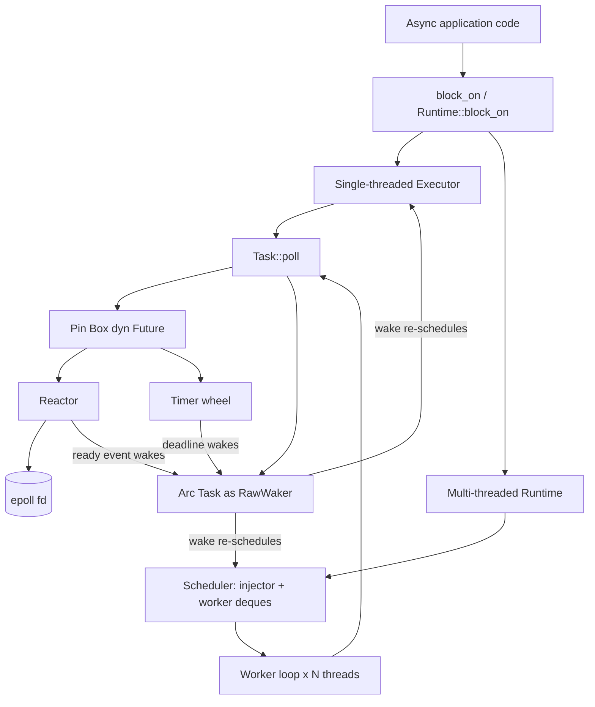

# Async Runtime

## Overview

This project is a from-scratch asynchronous runtime in the spirit of Tokio, built
directly on top of Linux `epoll` with no `tokio`, `mio`, or `async-std` dependency.
It implements the full chain that turns an `async` block into running work: a
reactor that translates kernel I/O readiness into `Waker` wake-ups, a scheduler
that distributes `Task`s across worker threads, an executor that drives a future to
completion, a timer wheel that fires deadlines efficiently, and a layer of async
primitives (channels, locks, cancellation, structured concurrency, sockets) on top.

The goal is to make every piece of the standard `Future`/`Poll`/`Context`/`Waker`
contract explicit and inspectable. In particular it shows:

- How a `RawWaker` and its `RawWakerVTable` are built by hand from an `Arc<Task>`,
  and how `wake()` re-schedules a task.
- How an `epoll` file descriptor is registered, polled edge-triggered, and used to
  wake exactly the tasks whose fds became ready.
- How a hierarchical timer wheel gives amortized O(1) timer insertion and
  cancellation with cascading between wheels of increasing granularity.
- How a work-stealing scheduler balances load with a global injector queue plus
  per-worker deques and cross-worker stealing.
- How higher-level combinators (`select`, `join`, `timeout`) and synchronization
  primitives are composed purely from `poll` and `Waker`.

The crate is **Linux-only**: the reactor calls the `epoll` syscall family
unconditionally, and `lib.rs` emits a `compile_error!` on any non-Linux target.

There are two ways to drive futures, and the distinction matters throughout this
document:

- **Single-threaded executor** (`executor::Executor`), reachable through the free
  functions `block_on` and `spawn`. This is what the examples and most unit tests
  use, and it is the path the I/O futures wire their wakers into.
- **Multi-threaded runtime** (`runtime::Runtime` + `runtime::Builder`), which owns
  a work-stealing `Scheduler` and a pool of worker threads, and whose `spawn`
  returns a `JoinHandle<T>`.

## Architecture



The runtime is organized into three layers:

1. **Driver layer** — the `Reactor` and the `TimerWheel`. The reactor owns one
   `epoll` fd and a `Token -> Waker` map; the timer wheel owns the deadline data
   structure. Both produce `Waker` wake-ups: the reactor on fd readiness, the timer
   wheel on deadline expiry.

2. **Scheduling layer** — `Task`, `Executor`, `Scheduler`, and `Runtime`. A `Task`
   wraps a `Pin<Box<dyn Future<Output = ()> + Send>>` and a state byte. The
   executor (single-threaded) and the scheduler (multi-threaded, work-stealing)
   both call `Task::poll`. When a task is woken it is pushed back onto whichever
   driver is current on the calling thread, tracked through two thread-locals:
   `RUNTIME_SCHEDULER` (preferred) and `EXECUTOR` (fallback).

3. **Primitives layer** — everything user code touches: `time` (sleep/timeout/
   interval), `future` (select/join/yield), `sync` (oneshot/mpsc/mutex/notify/
   cancellation), `scope` (structured concurrency), and `net` (tcp/udp/unix).
   These are pure `Future` implementations that register wakers with the driver
   layer and otherwise return `Poll::Pending`.

### How a poll cycle flows

In `block_on`, the executor pins the top-level future and loops:

1. Poll the top-level future with a no-op waker. If `Ready`, return the result.
2. Drain up to 61 queued tasks from the `SegQueue`, calling `Task::poll` on each.
   Each `Task::poll` installs the task's own `Waker` so the future can re-schedule
   itself when it next becomes ready.
3. If no tasks were processed, poll the reactor with a 1 ms timeout so fd readiness
   can wake pending tasks.

The multi-threaded worker loop is similar, but each worker pops from its local
deque (stealing from the injector and other workers when empty), and spins briefly
before falling back to a 1 ms reactor poll when idle.

## Core Components

### Reactor (`reactor.rs`)

The reactor is the I/O driver. It wraps a single `epoll` fd created with
`epoll_create1(EPOLL_CLOEXEC)` and a `Mutex<HashMap<Token, Waker>>`.

- `register(fd, interest, waker)` allocates a fresh `Token` from an
  `AtomicUsize`, calls `epoll_ctl(EPOLL_CTL_ADD)` with the token packed into the
  `epoll_event.u64` field, and stores the waker.
- `modify` and `deregister` map to `EPOLL_CTL_MOD` / `EPOLL_CTL_DEL`.
- `poll(timeout)` calls `epoll_wait` into a 1024-slot `Events` buffer, then for
  each ready event looks up the token's waker and calls `wake_by_ref()`.
  `EINTR` is treated as zero events rather than an error.
- Interest is always registered **edge-triggered** (`EPOLLET`), with `EPOLLIN`
  and/or `EPOLLOUT` set from the `Interest` flags.
- `Drop` closes the `epoll` fd.

Because registration is edge-triggered, readiness must be drained fully by the
consuming future (the socket futures retry the syscall and only register on
`WouldBlock`).

### Task and Waker (`task.rs`)

A `Task` holds the boxed future behind a `parking_lot::Mutex` and an `AtomicU8`
state (`IDLE`, `SCHEDULED`, `RUNNING`, `COMPLETED`).

`Task::poll(self: Arc<Self>)` stores `RUNNING`, builds a `Waker` from the `Arc`,
locks the future, and polls once. On `Ready` it stores `COMPLETED`; on `Pending`
it stores `IDLE`.

The waker is the most delicate part. `into_waker` turns `Arc<Task>` into a
`RawWaker` whose data pointer is `Arc::into_raw(self)` and whose vtable is a single
`static TASK_WAKER_VTABLE`. The four vtable functions manage the `Arc` refcount by
hand:

- **clone** — reconstruct the `Arc`, clone it, `mem::forget` the original, hand
  back a new `RawWaker` from the clone.
- **wake** — reconstruct the `Arc` (consuming the reference) and call `wake()`.
- **wake_by_ref** — reconstruct, clone-and-wake, `mem::forget` to keep the original
  reference alive.
- **drop** — reconstruct and let the `Arc` drop, releasing one reference.

`wake()` swaps the state to `SCHEDULED`; only if the previous state was `IDLE` does
it re-schedule, which prevents duplicate enqueues. Re-scheduling prefers the
`RUNTIME_SCHEDULER` thread-local and falls back to the `EXECUTOR` thread-local.

`noop_waker()` provides a do-nothing waker (null data pointer) used to drive the
top-level future in `block_on` and throughout the tests.

### Executor (`executor.rs`)

The single-threaded executor owns a `crossbeam_queue::SegQueue<Arc<Task>>`, a
shutdown flag, and an `Arc<Reactor>`. `spawn` wraps a future in a `Task` and pushes
it; `schedule` pushes an already-built task. `block_on` runs the poll cycle
described above. The free functions `block_on`/`spawn` set the `EXECUTOR`
thread-local for the duration of the call so that wakers and I/O futures can find
the current executor.

The heart of the executor is the `block_on` loop, which interleaves the top-level
future, the queued tasks, and the reactor:

```rust
pub fn block_on<F, T>(&self, future: F) -> T where F: Future<Output = T> {
    let mut future = std::pin::pin!(future);
    let waker = crate::task::noop_waker();
    let mut cx = std::task::Context::from_waker(&waker);

    loop {
        // 1. Poll the top-level future; return its result if ready.
        if let Poll::Ready(result) = future.as_mut().poll(&mut cx) {
            return result;
        }

        // 2. Drain up to 61 queued tasks, polling each once.
        let mut processed = 0;
        while let Some(task) = self.queue.pop() {
            task.poll();
            processed += 1;
            if processed >= 61 { break; } // fairness: yield back to step 1/3
        }

        // 3. If nothing ran, block in the reactor briefly so I/O can wake tasks.
        if processed == 0 {
            let _ = self.reactor.poll(Some(Duration::from_millis(1)));
        }
    }
}
```

The `61` bound is a fairness budget borrowed from production runtimes: it caps how
long the executor stays in the task queue before giving the top-level future and
the reactor a turn, preventing a hot stream of wake-ups from starving I/O.

The free functions install the executor as the current one for the call's
duration:

```rust
pub fn block_on<F, T>(future: F) -> T where F: Future<Output = T> {
    let executor = Executor::new().expect("Failed to create executor");
    EXECUTOR.with(|ex| *ex.borrow_mut() = Some(executor.clone()));
    let result = executor.block_on(future);
    EXECUTOR.with(|ex| *ex.borrow_mut() = None);
    result
}
```

Because `spawn` resolves the executor through the `EXECUTOR` thread-local, calling
it outside a `block_on` scope panics with "No executor running".

### Scheduler (`scheduler.rs`)

The work-stealing scheduler is built on `crossbeam_deque`. It owns a global
`Injector<Arc<Task>>`, a `Vec<Stealer<Arc<Task>>>` (one per worker), the worker
count, a shutdown flag, and an `active_tasks` counter.

`Scheduler::new(n)` creates `n` FIFO `Worker` deques, keeps their stealers, and
returns the shared scheduler plus a `WorkerHandle` per worker. `WorkerHandle::pop`
implements the stealing policy:

1. Pop from the local deque.
2. Otherwise `steal_batch_and_pop` from the global injector (retrying on contention).
3. Otherwise round-robin `steal` from the other workers' stealers.

`push` increments `active_tasks` and enqueues to the injector (or, via
`WorkerHandle::push`, to a local deque). The stealing policy in full:

```rust
pub fn pop(&self) -> Option<Arc<Task>> {
    // 1. Local FIFO deque (cheap, lock-free for the owner).
    if let Some(task) = self.worker.pop() {
        return Some(task);
    }
    // 2. Global injector — steal a batch, return one, keep the rest local.
    loop {
        match self.scheduler.injector.steal_batch_and_pop(&self.worker) {
            Steal::Success(task) => return Some(task),
            Steal::Empty => break,
            Steal::Retry => continue, // lost a race, try again
        }
    }
    // 3. Round-robin steal from peers, skipping ourselves.
    let start = self.id;
    for i in 0..self.scheduler.num_workers {
        let idx = (start + i + 1) % self.scheduler.num_workers;
        if idx == self.id { continue; }
        loop {
            match self.scheduler.stealers[idx].steal() {
                Steal::Success(task) => return Some(task),
                Steal::Empty => break,
                Steal::Retry => continue,
            }
        }
    }
    None
}
```

`steal_batch_and_pop` moves a chunk of work from the global queue into the local
deque in one shot, which amortizes the cost of touching the shared injector and
keeps subsequent pops local. The `Steal::Retry` arm handles the lock-free deque's
optimistic-CAS failures by simply retrying.

### Runtime (`runtime.rs`)

`Runtime` ties the scheduler to OS threads. `Builder` configures worker count
(defaulting to `available_parallelism`), thread name prefix, and optional
start/stop hooks, then spawns one OS thread per worker running `worker_loop`. Each
worker sets the `RUNTIME_SCHEDULER` thread-local, pops tasks, polls them, and
spins/parks when idle (falling back to a 1 ms reactor poll after 61 idle spins).

`Runtime::spawn` wraps the future so its result is sent through a `oneshot` channel
and returns a `JoinHandle<T>` whose `Future` impl resolves the receiver to
`Result<T, JoinError>` (`JoinError::Cancelled` if the sender was dropped).
`Runtime::block_on` drives a top-level future on the calling thread while the
worker pool processes spawned tasks. `shutdown` flips the flag, signals the
scheduler, and joins the worker threads.

The worker loop is what each OS thread runs. It claims the scheduler in its
thread-local, then loops popping and polling tasks, spinning briefly when idle:

```rust
fn worker_loop(handle: Arc<Mutex<WorkerHandle>>, reactor: Arc<Reactor>, shutdown: Arc<AtomicBool>) {
    // Make this worker's scheduler the wake target for tasks polled here.
    let scheduler = handle.lock().scheduler().clone();
    RUNTIME_SCHEDULER.with(|s| *s.borrow_mut() = Some(scheduler));

    let mut idle_count = 0;
    loop {
        if shutdown.load(Ordering::Relaxed) { break; }

        let task = { handle.lock().pop() }; // local -> injector -> peers
        if let Some(task) = task {
            task.poll();
            handle.lock().task_completed();
            idle_count = 0;
        } else {
            idle_count += 1;
            if idle_count > 61 {
                let _ = reactor.poll(Some(Duration::from_millis(1))); // park on I/O
                idle_count = 0;
            } else {
                std::hint::spin_loop(); // short busy-wait before parking
            }
        }
    }
}
```

The brief spin before a reactor poll trades a little CPU for lower wake-up latency
when work arrives in bursts. `spawn` plumbs the future's result back to the caller
through a oneshot channel:

```rust
pub fn spawn<F, T>(&self, future: F) -> JoinHandle<T>
where F: Future<Output = T> + Send + 'static, T: Send + 'static {
    let (tx, rx) = oneshot::channel();
    let task = Task::new(async move {
        let result = future.await;
        let _ = tx.send(result); // ignore error if the JoinHandle was dropped
    });
    self.scheduler.push(task);
    JoinHandle { receiver: rx }
}
```

`JoinHandle<T>` is therefore just a typed wrapper over the oneshot receiver; its
`poll` forwards to the receiver and maps a closed channel to `JoinError::Cancelled`.

### Timer wheel (`timer.rs`)

`TimerWheel` is a four-level hierarchical timing wheel. Wheel 0 has 256 slots,
wheels 1–3 have 64 slots each, giving ranges of roughly 256 ticks, 256×64 ticks,
256×64×64 ticks, and beyond, at a default 1 ms tick. State: the four wheels,
`current_tick`, the tick duration, a `start_time` anchor, a monotonic `next_id`,
and a `handles: HashMap<u64, (usize, usize)>` for cancellation.

- `insert(deadline, waker)` converts the deadline to ticks, computes the delta from
  `current_tick`, selects `(wheel, slot)` via `calculate_slot`, pushes a
  `TimerEntry`, records the handle, and returns a `TimerHandle`.
- `cancel(handle)` removes the handle from the map; the entry is left in the wheel
  and skipped when the slot is processed (lazy deletion).
- `advance(now)` walks ticks forward one at a time. For each tick it drains wheel
  0's current slot: cancelled entries are skipped, due entries contribute their
  waker, and not-yet-due entries are re-inserted. When wheel 0 wraps (slot 0) it
  cascades from the higher wheels via `cascade`, which re-distributes a higher
  wheel's slot into lower wheels.
- `next_deadline()` scans for the earliest live entry.

`calculate_slot` is the routing function that picks the coarsest wheel that can
still represent a delta, and `advance` drives the cascade:

```rust
fn calculate_slot(&self, delta: u64) -> (usize, usize) {
    if delta < 256                 { (0,  delta as usize) }
    else if delta < 256 * 64       { (1, (delta / 256) as usize) }
    else if delta < 256 * 64 * 64  { (2, (delta / (256 * 64)) as usize) }
    else                           { (3, (delta / (256 * 64 * 64)).min(63) as usize) }
}

pub fn advance(&mut self, now: Instant) -> Vec<Waker> {
    let target = self.instant_to_ticks(now);
    let mut wakers = Vec::new();
    while self.current_tick < target {
        self.current_tick += 1;
        let slot_idx = (self.current_tick as usize) & self.wheels[0].mask;
        for entry in std::mem::take(&mut self.wheels[0].slots[slot_idx]) {
            if !self.handles.contains_key(&entry.id) { continue; } // cancelled
            if entry.deadline <= self.current_tick {
                self.handles.remove(&entry.id);
                wakers.push(entry.waker);          // fire
            } else {
                let delta = entry.deadline - self.current_tick;
                let (w, s) = self.calculate_slot(delta);
                self.wheels[w].slots[s].push(entry); // not due yet; re-slot
            }
        }
        if slot_idx == 0 && self.current_tick > 0 { self.cascade(1); }
    }
    wakers
}
```

Cancellation is lazy: `cancel` only removes the handle from the map, and `advance`
skips entries whose handle is gone. This keeps `cancel` O(1) at the cost of leaving
a tombstone entry in its slot until that slot is next processed.

The timer wheel is thread-local (`time::TIMER_WHEEL`) and advanced by
`time::process_timers()`, which calls `advance(Instant::now())` and wakes each
returned waker.

### Time utilities (`time.rs`)

`sleep`/`sleep_until` return a `Sleep` future that, on first `Pending` poll,
registers its deadline and waker with the thread-local timer wheel and re-registers
on subsequent polls if the waker changed; `Drop` cancels the timer. `timeout`/
`timeout_at` wrap an inner future together with a `Sleep`, polling the inner future
first and returning `Err(Elapsed)` when the sleep wins. `interval`/`Interval`
yields ticks at a fixed period by repeatedly sleeping until the next deadline.

### Future combinators (`future.rs`)

- `select(a, b)` polls both and returns `Either::Left`/`Either::Right` for the
  first to complete.
- `join`/`join3` poll all inputs each call, parking completed ones in a `MaybeDone`
  enum, and return the tuple once all are done.
- `yield_now()` returns `Pending` once (after waking its own waker) and `Ready`
  thereafter, giving other tasks a chance to run.
- `ready(v)` / `pending()` are the trivial always-ready / never-ready futures.

### Channels (`sync/oneshot.rs`, `sync/mpsc.rs`)

`oneshot` is a single-use channel. Its `Inner` holds an `AtomicU8` state
(`EMPTY`/`SENDING`/`SENT`/`CLOSED`), an `UnsafeCell<Option<T>>` value slot, and a
waker slot. `Sender::send` CAS-transitions `EMPTY -> SENDING`, stores the value,
publishes `SENT`, and wakes the receiver. `Receiver` implements `Future` and also
exposes `try_recv`.

The oneshot send path shows the state machine and the receiver hand-off:

```rust
pub fn send(self, value: T) -> Result<(), SendError<T>> {
    if Arc::strong_count(&self.inner) == 1 {       // receiver already gone
        return Err(SendError(value));
    }
    match self.inner.state.compare_exchange(EMPTY, SENDING, SeqCst, SeqCst) {
        Ok(_) => {
            unsafe { *self.inner.value.get() = Some(value); } // publish value
            self.inner.state.store(SENT, SeqCst);             // then mark SENT
            if let Some(w) = self.inner.waker.lock().take() { w.wake(); }
            Ok(())
        }
        Err(_) => Err(SendError(value)),
    }
}
```

The `EMPTY -> SENDING -> SENT` two-step ensures the receiver only observes `SENT`
after the value is fully written. `Receiver::poll` re-checks the state after
registering its waker to close the race where the sender publishes between the
first load and the waker store.

`mpsc` is a bounded multi-producer/single-consumer channel. `Inner` holds a
`Mutex<VecDeque<T>>`, the capacity, a closed flag, a sender refcount, a vector of
send-wakers, and a single recv-waker. `try_send`/`Send` enforce backpressure
(`Pending` / `TrySendError::Full` when the buffer is full) and wake the receiver on
success; `try_recv`/`Recv` pop and wake parked senders. The last `Sender` drop
closes the channel.

The `Send` future implements the backpressure handshake — it re-parks the value
and registers a send-waker when the buffer is full:

```rust
fn poll(self: Pin<&mut Self>, cx: &mut Context<'_>) -> Poll<Self::Output> {
    let this = self.get_mut();
    let value = this.value.take().expect("polled after completion");
    if this.sender.inner.closed.load(SeqCst) {
        return Poll::Ready(Err(SendError(value)));
    }
    let mut buffer = this.sender.inner.buffer.lock();
    if buffer.len() >= this.sender.inner.capacity {
        this.value = Some(value);                                   // keep the value
        this.sender.inner.send_wakers.lock().push(cx.waker().clone());
        return Poll::Pending;                                       // wait for room
    }
    buffer.push_back(value);
    drop(buffer);
    if let Some(w) = this.sender.inner.recv_waker.lock().take() { w.wake(); }
    Poll::Ready(Ok(()))
}
```

On the consuming side, `try_recv`/`Recv` drain all parked `send_wakers` after a
successful pop, so blocked senders are re-polled and can retry the buffer.

### Synchronization primitives (`sync/mutex.rs`, `sync/notify.rs`, `sync/cancellation.rs`)

- `Mutex<T>` / `RwLock<T>` are async-aware locks: an atomic state plus a queue of
  `Waker`s, yielding to the runtime instead of blocking the thread.
- `Notify` is an async notification with `notify_one` / `notify_all` /
  `notified()`. `Semaphore` (with `SemaphorePermit`) and `Barrier` (with
  `BarrierWaitResult`) build on the same waker-queue pattern.
- `CancellationToken` is hierarchical: `child_token()` registers a child that is
  cancelled when the parent is, `cancel()` wakes all waiters and recurses into
  children, `cancelled()` returns a future, and `run_until_cancelled(fut)` races a
  future against cancellation, returning `Option<T>`. `DropGuard` cancels on drop
  unless disarmed.

`Notified::poll` shows the common "consume-or-park, then re-check" pattern these
primitives share, here over an atomic `pending` counter:

```rust
fn poll(mut self: Pin<&mut Self>, cx: &mut Context<'_>) -> Poll<()> {
    // Consume a pending notification if one exists (CAS-decrement).
    loop {
        let pending = self.inner.pending.load(SeqCst);
        if pending > 0 {
            if self.inner.pending
                .compare_exchange(pending, pending - 1, SeqCst, SeqCst).is_ok() {
                return Poll::Ready(());
            }
            continue; // lost the race, retry
        }
        break;
    }
    // Otherwise register, then double-check to avoid a lost wake-up.
    if !self.registered {
        self.inner.waiters.lock().push(cx.waker().clone());
        self.registered = true;
        let pending = self.inner.pending.load(SeqCst);
        if pending > 0
            && self.inner.pending
                .compare_exchange(pending, pending - 1, SeqCst, SeqCst).is_ok() {
            return Poll::Ready(());
        }
    }
    Poll::Pending
}
```

`run_until_cancelled` is built from a small purpose-made combinator that polls the
cancellation future first and the work second, mapping cancellation to `None`:

```rust
impl<F, C, T> Future for CancellableFuture<F, C> where /* F: Future<T>, C: Future<()> */ {
    type Output = Option<T>;
    fn poll(self: Pin<&mut Self>, cx: &mut Context<'_>) -> Poll<Self::Output> {
        let this = unsafe { self.get_unchecked_mut() };
        let cancelled = unsafe { Pin::new_unchecked(&mut *this.cancelled) };
        if cancelled.poll(cx).is_ready() { return Poll::Ready(None); }
        let future = unsafe { Pin::new_unchecked(&mut *this.future) };
        match future.poll(cx) {
            Poll::Ready(v) => Poll::Ready(Some(v)),
            Poll::Pending => Poll::Pending,
        }
    }
}
```

### Structured concurrency (`scope.rs`)

`Scope` tracks an `active_tasks` counter, collected results, a completion waker,
and a `CancellationToken`. `Scope::spawn` transmutes the future's lifetime (sound
because the scope joins all tasks before returning), wraps it with a child
cancellation token, decrements the counter on completion, and pushes the task to
the current scheduler/executor. `scope(f)` / `scope_detached(f)` run the closure,
then await a `ScopeCompletion` future that resolves when `active_tasks` hits zero.
`TaskSet<T>` is the un-scoped sibling: spawn many tasks, then `join_all().await`
to collect their results.

```rust
pub fn spawn<F>(&self, future: F) where F: Future<Output = T> + Send + 'env {
    self.active_tasks.fetch_add(1, SeqCst);
    let active_tasks = self.active_tasks.clone();
    let results = self.results.clone();
    let completion_waker = self.completion_waker.clone();
    let cancel_token = self.cancel_token.child_token();

    // Sound because `scope` awaits ScopeCompletion (all tasks done) before returning,
    // so the borrowed 'env data outlives every spawned task.
    let future: Pin<Box<dyn Future<Output = T> + Send>> =
        unsafe { std::mem::transmute(Box::pin(future) as Pin<Box<dyn Future<Output = T> + Send + 'env>>) };

    let task = crate::task::Task::new(async move {
        if let Some(result) = cancel_token.run_until_cancelled(future).await {
            results.lock().push(result);
        }
        if active_tasks.fetch_sub(1, SeqCst) == 1 {   // last task to finish
            if let Some(w) = completion_waker.lock().take() { w.wake(); }
        }
    });
    // Push onto the current scheduler, or the single-threaded executor as fallback.
    /* RUNTIME_SCHEDULER.with(...) else EXECUTOR.with(...) */
}
```

The lifetime transmute is the linchpin of structured concurrency: it lets tasks
borrow stack data from the enclosing frame, and the `ScopeCompletion` await
guarantees none of those borrows can outlive the data. Each spawned task also gets
a child cancellation token, so cancelling the scope cancels all of its tasks.

### Networking (`net/tcp.rs`, `net/udp.rs`, `net/unix.rs`)

Each socket type wraps the corresponding `std::net` type, sets `O_NONBLOCK` via
`fcntl`, and exposes async operations as futures. `TcpListener::bind` is
synchronous; `accept()` returns an `Accept` future that retries
`std::net::TcpListener::accept` and, on `WouldBlock`, registers the listener fd
with the **current executor's** reactor for `READABLE` interest. `TcpStream`
exposes `read`/`write`/`write_all` futures that do the same with `READABLE` /
`WRITABLE` interest. `UdpSocket` provides `send`/`recv`/`send_to`/`recv_from`, and
`UnixListener`/`UnixStream` mirror the TCP API over Unix domain sockets.

The read future is representative of the readiness pattern: attempt the syscall,
and only register with the reactor when the kernel returns `WouldBlock`:

```rust
impl<'a> Future for TcpReadFuture<'a> {
    type Output = io::Result<usize>;
    fn poll(self: Pin<&mut Self>, cx: &mut Context<'_>) -> Poll<Self::Output> {
        let this = self.get_mut();
        match this.stream.inner.read(this.buf) {
            Ok(n) => Poll::Ready(Ok(n)),                       // data was ready
            Err(e) if e.kind() == WouldBlock => {              // not ready yet
                let fd = this.stream.as_raw_fd();
                EXECUTOR.with(|ex| {
                    if let Some(executor) = ex.borrow().as_ref() {
                        let reactor = executor.reactor();
                        let _ = reactor.register(fd, Interest::READABLE, cx.waker().clone());
                    }
                });
                Poll::Pending                                  // reactor will wake us
            }
            Err(e) => Poll::Ready(Err(e)),
        }
    }
}
```

`write_all` is a thin loop over the single-write future that retries until the
whole buffer is flushed:

```rust
pub async fn write_all(&mut self, buf: &[u8]) -> io::Result<()> {
    let mut written = 0;
    while written < buf.len() {
        let n = self.write(&buf[written..]).await?;
        if n == 0 {
            return Err(io::Error::new(io::ErrorKind::WriteZero, "failed to write whole buffer"));
        }
        written += n;
    }
    Ok(())
}
```

Because these futures register through the `EXECUTOR` thread-local, socket I/O is
wired for the single-threaded `block_on`/`spawn` path; see *Testing Strategy* and
the README's "What's Real vs Simulated" for the multi-threaded caveat.

## Data Structures

The crate-level I/O vocabulary types (`lib.rs`):

```rust
/// Interest flags for I/O events (readable / writable).
#[derive(Clone, Copy, Debug)]
pub struct Interest { flags: u8 }

impl Interest {
    pub const READABLE: Interest = Interest { flags: 0b01 };
    pub const WRITABLE: Interest = Interest { flags: 0b10 };
    pub fn readable(self) -> Self { /* set bit */ }
    pub fn writable(self) -> Self { /* set bit */ }
    pub fn is_readable(&self) -> bool { self.flags & 0b01 != 0 }
    pub fn is_writable(&self) -> bool { self.flags & 0b10 != 0 }
}

/// Identifies a registered I/O source; packed into epoll_event.u64.
#[derive(Clone, Copy, Debug, PartialEq, Eq, Hash)]
pub struct Token(pub usize);

/// A readiness event decoded from an epoll_event.
#[derive(Clone, Copy, Debug)]
pub struct Event { token: Token, readable: bool, writable: bool }

/// Buffer of raw epoll_event slots filled by epoll_wait.
pub struct Events { inner: Vec<libc::epoll_event> }
```

The reactor's state:

```rust
pub struct Reactor {
    epoll_fd: RawFd,
    wakers: Mutex<HashMap<Token, Waker>>,
    next_token: AtomicUsize,
}
```

The task and its hand-rolled waker vtable:

```rust
pub struct Task {
    future: Mutex<Pin<Box<dyn Future<Output = ()> + Send>>>,
    state: AtomicU8, // IDLE | SCHEDULED | RUNNING | COMPLETED
}

static TASK_WAKER_VTABLE: RawWakerVTable = RawWakerVTable::new(
    /* clone        */ |ptr| { /* Arc::from_raw, clone, forget */ },
    /* wake         */ |ptr| { /* Arc::from_raw(ptr).wake() */ },
    /* wake_by_ref  */ |ptr| { /* clone().wake(), forget */ },
    /* drop         */ |ptr| { /* Arc::from_raw(ptr) drops */ },
);
```

The scheduler:

```rust
pub struct Scheduler {
    injector: Injector<Arc<Task>>,       // global queue
    stealers: Vec<Stealer<Arc<Task>>>,   // one per worker
    num_workers: usize,
    shutdown: AtomicBool,
    active_tasks: AtomicUsize,
}

pub struct WorkerHandle {
    id: usize,
    worker: Worker<Arc<Task>>,           // local FIFO deque
    scheduler: Arc<Scheduler>,
}
```

The hierarchical timer wheel:

```rust
pub struct TimerWheel {
    wheels: [Wheel; 4],            // 256, 64, 64, 64 slots
    current_tick: u64,
    tick_duration: Duration,       // 1ms default
    start_time: Instant,
    next_id: u64,
    handles: HashMap<u64, (usize, usize)>, // id -> (wheel, slot)
}

struct Wheel { slots: Vec<Vec<TimerEntry>>, mask: usize }
struct TimerEntry { id: u64, deadline: u64, waker: Waker }

#[derive(Clone, Copy, Debug, PartialEq, Eq, Hash)]
pub struct TimerHandle { id: u64 }
```

The `Either` result of `select`:

```rust
pub enum Either<A, B> { Left(A), Right(B) }
```

## API Design

Public exports from `lib.rs`:

```rust
// Executor (single-threaded)
pub use executor::{spawn, block_on};

// Runtime (multi-threaded)
pub use runtime::{Runtime, Builder, JoinHandle, JoinError};

// Channels
pub use sync::{oneshot_channel, mpsc_channel};
// (also: sync::oneshot::channel, sync::mpsc::channel)

// Cancellation
pub use sync::{CancellationToken, Cancelled, DropGuard};

// Async locks
pub use sync::{Mutex, MutexGuard, RwLock, RwLockReadGuard, RwLockWriteGuard};

// Notification / coordination
pub use sync::{Notify, Notified, Semaphore, SemaphorePermit, Barrier, BarrierWaitResult};

// Time
pub use time::{sleep, sleep_until, timeout, timeout_at, interval, Elapsed};

// Combinators
pub use future::{select, join, join3, yield_now, ready, pending, Either};

// Structured concurrency
pub use scope::{scope, scope_detached, Scope, TaskSet};

// I/O vocabulary
pub struct Interest; pub struct Token; pub struct Event; pub struct Events;
```

Key signatures:

```rust
// Free functions — single-threaded executor
pub fn block_on<F, T>(future: F) -> T where F: Future<Output = T>;
pub fn spawn<F>(future: F) where F: Future<Output = ()> + Send + 'static;

// Multi-threaded runtime
impl Runtime {
    pub fn new() -> io::Result<Self>;
    pub fn block_on<F, T>(&self, future: F) -> T where F: Future<Output = T>;
    pub fn spawn<F, T>(&self, future: F) -> JoinHandle<T>
        where F: Future<Output = T> + Send + 'static, T: Send + 'static;
    pub fn shutdown(self);
}

impl Builder {
    pub fn new() -> Self;
    pub fn worker_threads(self, n: usize) -> Self;
    pub fn thread_name(self, name: impl Into<String>) -> Self;
    pub fn on_thread_start<F: Fn() + Send + Sync + 'static>(self, f: F) -> Self;
    pub fn on_thread_stop<F: Fn() + Send + Sync + 'static>(self, f: F) -> Self;
    pub fn build(self) -> io::Result<Runtime>;
}

// Time
pub fn sleep(duration: Duration) -> Sleep;
pub fn timeout<F>(duration: Duration, future: F) -> Timeout<F>; // -> Result<F::Output, Elapsed>

// Channels
pub fn oneshot::channel<T>() -> (oneshot::Sender<T>, oneshot::Receiver<T>);
pub fn mpsc::channel<T>(capacity: usize) -> (mpsc::Sender<T>, mpsc::Receiver<T>);

// Combinators
pub fn select<A: Future, B: Future>(a: A, b: B) -> Select<A, B>; // -> Either
pub fn join<A: Future, B: Future>(a: A, b: B) -> Join<A, B>;     // -> (A::Output, B::Output)

// Reactor (driver layer)
impl Reactor {
    pub fn new() -> io::Result<Self>;
    pub fn register(&self, fd: RawFd, interest: Interest, waker: Waker) -> io::Result<Token>;
    pub fn modify(&self, fd: RawFd, token: Token, interest: Interest, waker: Waker) -> io::Result<()>;
    pub fn deregister(&self, fd: RawFd, token: Token) -> io::Result<()>;
    pub fn poll(&self, timeout: Option<Duration>) -> io::Result<usize>;
}

// Networking
impl net::TcpListener {
    pub fn bind(addr: SocketAddr) -> io::Result<Self>;
    pub fn accept(&self) -> Accept<'_>; // -> io::Result<(TcpStream, SocketAddr)>
    pub fn local_addr(&self) -> io::Result<SocketAddr>;
}
impl net::TcpStream {
    pub async fn connect(addr: SocketAddr) -> io::Result<Self>;
    pub fn read<'a>(&'a mut self, buf: &'a mut [u8]) -> TcpReadFuture<'a>;
    pub fn write<'a>(&'a mut self, buf: &'a [u8]) -> TcpWriteFuture<'a>;
    pub async fn write_all(&mut self, buf: &[u8]) -> io::Result<()>;
}
```

Error handling follows Rust conventions: fallible setup (`Runtime::new`,
`Reactor::new`, `TcpListener::bind`) returns `io::Result`; channels return typed
errors (`SendError<T>`, `RecvError`, `TrySendError<T>`, `TryRecvError`); timeouts
return `Result<_, Elapsed>`; and `JoinHandle` resolves to `Result<T, JoinError>`.

## Performance

The crate uses a release profile tuned for runtime benchmarking
(`lto = true`, `codegen-units = 1`) and ships Criterion benchmarks
(`benches/benchmarks.rs`, `harness = false`):

| Benchmark | What it measures |
|-----------|------------------|
| `spawn_noop` | `block_on(async { spawn(async {}) })` round trip |
| `timer_insert` | `TimerWheel::insert` of a single timer |
| `timer_cancel` | insert + immediate `cancel` |
| `oneshot_create` | constructing a oneshot channel |
| `oneshot_send_recv` | `send` then `try_recv` on a oneshot |
| `mpsc_send_recv` | `try_send` then `try_recv` on a bounded mpsc |
| `block_on_ready` | `block_on(async { 42 })` baseline |

Run them with `cargo bench`. (Specific timings are environment-dependent and are
not asserted here.)

Design choices that bound cost:

- **Timer wheel.** `insert` and `cancel` are amortized O(1): insert is a slot index
  plus a `Vec::push`; cancel is a `HashMap::remove` with lazy deletion from the
  slot. Cascading only runs when wheel 0 wraps, amortizing the cost of moving
  far-future timers down into finer wheels.
- **Work stealing.** Per-worker FIFO deques keep most pops local and lock-free; the
  global injector and cross-worker stealing only engage when a worker runs dry,
  minimizing contention under load.
- **Edge-triggered epoll.** `EPOLLET` registration reduces redundant wake-ups: a
  task is woken once per readiness edge and is expected to drain the fd, cutting
  `epoll_wait` churn.
- **Wake de-duplication.** `Task::wake` only re-enqueues when the prior state was
  `IDLE`, so a burst of wakes for an already-scheduled task does not flood the
  queue.
- **Bounded poll batches.** Both the executor and worker loop process at most 61
  tasks before yielding to the reactor, preventing task-queue starvation of I/O.

## Testing Strategy

Correctness is verified by in-module `#[cfg(test)]` unit tests, which run against
the real public API and require no external services:

- **Reactor** — create, register (readable/writable/both), register multiple,
  modify, deregister, poll empty / with a ready fd / with multiple events, waker-map
  integrity, and `Drop`. Tests use `UnixStream::pair()` to produce real fds and make
  them readable.
- **Timer wheel** — insert-and-fire, cancel, fire-exactly-at-deadline, ordered
  firing, multiple timers at one deadline, `next_deadline`, `calculate_slot` for each
  wheel level, long-duration timers, cascading, and a 100-timer stress test.
- **Scheduler** — create, push/pop, work stealing between workers, and shutdown.
- **Executor / Runtime** — `block_on` for plain values, computations, nested async,
  `Option`/`Result`/`String` outputs; spawning single and multiple tasks; builder
  worker-thread configuration; `Runtime::spawn` round-trips through its `JoinHandle`.
- **Channels** — oneshot send/recv plus sender/receiver drop semantics; mpsc
  send/recv, sender clone, full-buffer backpressure, and all-senders-dropped closing.
- **Combinators** — `ready`, `select` left-bias, and `join` of two ready futures.
- **TCP** — bind, loopback bind, local address, `as_raw_fd`, non-blocking flag,
  `WouldBlock` accept, sync read/write sanity, double-bind failure, and future
  construction.

Aspirational integration tests live in `tests/executor_tests.rs` and
`tests/io_tests.rs`. They describe a broader target API (`ExecutorConfig`,
`async_runtime::fs`, async `bind`/`accept`, `TcpStream::split`, task-locals,
metrics) that is **not** implemented and therefore does not compile against the
current crate; they are intentionally retained as a design target, not as part of
the passing suite. The crate is also Linux-only, so the entire suite is run on a
Linux host.

## References

- [Tokio Internals tutorial](https://tokio.rs/tokio/tutorial)
- [The Rust Async Book](https://rust-lang.github.io/async-book/)
- [`std::task` documentation (Waker / RawWaker)](https://doc.rust-lang.org/std/task/)
- [`epoll(7)` man page](https://man7.org/linux/man-pages/man7/epoll.7.html)
- [Hashed and Hierarchical Timing Wheels (Varghese & Lauck)](http://www.cs.columbia.edu/~nahum/w6998/papers/sosp87-timing-wheels.pdf)
- [crossbeam-deque (Chase-Lev work-stealing deque)](https://docs.rs/crossbeam-deque/)
- [libuv design overview](https://docs.libuv.org/en/v1.x/design.html)
