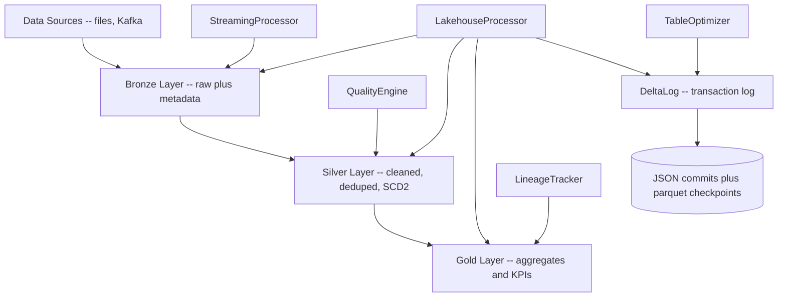

# Data Lakehouse

A data lakehouse built from scratch in Python around the **medallion architecture**
(Bronze → Silver → Gold). The core is a hand-written **Delta Lake transaction log**
(`delta_log.py`) that provides ACID commits, time travel, checkpoints, and optimistic
concurrency control with no Spark dependency. PySpark/Delta-backed processors layer
batch ETL, streaming, data-quality validation, optimization, lineage, and cost analysis
on top.

## Features

- **Hand-written Delta transaction log** — append-only JSON commits, snapshot
  reconstruction by log replay, parquet (or JSON-fallback) checkpoints (`DeltaLog`,
  `delta_log.py`).
- **ACID commits with optimistic concurrency** — `commit()` writes versioned log files
  with put-if-absent semantics and retries on `FileExistsError` (`DeltaLog.commit`).
- **Time travel** — reconstruct table state at any version via `time_travel()` /
  `get_snapshot(version)` (`TableState.apply_actions`).
- **Vacuum and statistics** — retention-based file cleanup, active-file resolution, and
  table stats over the log (`DeltaLog.vacuum`, `collect_stats`, `get_active_files`).
- **Medallion processing** — Bronze ingestion with metadata, Bronze→Silver dedup/merge,
  Silver→Gold SQL aggregation, and SCD Type 2 (`LakehouseProcessor`, `processor.py`).
- **Data quality validation** — a chainable, Great-Expectations-style engine returning a
  structured `ValidationResult` (`QualityEngine`, `quality.py`).
- **Streaming** — Kafka source, windowed aggregation, dedup, and Change Data Feed
  propagation (`StreamingProcessor`, `ChangeDataFeedProcessor`, `streaming.py`).
- **Optimization** — compaction, Z-order/partition analysis, bin-packing, and storage
  reports (`TableOptimizer`, `PartitionOptimizer`, `CompactionScheduler`, `optimizer.py`).
- **Lineage and enterprise tooling** — column/table lineage graph with impact analysis,
  plus DAG orchestration, monitoring, and cost reports (`lineage.py`, `enterprise.py`).

## Architecture



| Component | Module | Responsibility |
|-----------|--------|----------------|
| `DeltaLog` | `delta_log.py` | Pure-Python transaction log: commit, snapshot, time travel, checkpoint, vacuum |
| `LakehouseProcessor` | `processor.py` | Medallion ETL: bronze ingest, silver merge/dedup, gold aggregation, SCD2 |
| `QualityEngine` | `quality.py` | Chainable expectation checks returning `ValidationResult` |
| `StreamingProcessor` | `streaming.py` | Kafka ingestion, windowed aggregation, dedup, CDF |
| `TableOptimizer` | `optimizer.py` | Compaction, Z-order, partition analysis, storage reports |
| `LineageTracker` | `lineage.py` | Table/column lineage graph and impact analysis |
| `WorkflowOrchestrator` | `enterprise.py` | DAG orchestration, monitoring, cost analysis |

## Quick Start

### Prerequisites

- Python 3.9+
- The `DeltaLog` core and its tests run with **no external services**. The Spark-backed
  processors require `pyspark>=3.4.0` and `delta-spark>=2.4.0` (a JVM/Java install).

### Installation

```bash
cd 07-data-lakehouse
pip install -e ".[dev]"
```

### Running

The transaction log is usable directly in pure Python:

```bash
python -c "from lakehouse import DeltaLog; print(DeltaLog('/tmp/tbl').current_version)"
```

## Usage

Commit files to a table, then time-travel — no Spark required:

```python
from lakehouse import DeltaLog, AddFile, RemoveFile

log = DeltaLog("/tmp/events_table")

# v0: add two files
v0 = log.commit([
    AddFile(path="part-0.parquet", partition_values={"dt": "2024-01-01"},
            size=1_048_576, modification_time=1_700_000_000, data_change=True,
            stats='{"numRecords": 1000}'),
    AddFile(path="part-1.parquet", partition_values={"dt": "2024-01-02"},
            size=2_097_152, modification_time=1_700_000_100, data_change=True,
            stats='{"numRecords": 2000}'),
])

# v1: remove one file
v1 = log.commit([
    RemoveFile(path="part-0.parquet", deletion_timestamp=1_700_000_200, data_change=True),
])

print("current version:", log.current_version)          # 1
print("active files now:", len(log.get_active_files()))  # 1
print("files at v0:", len(log.time_travel(0)))           # 2
print("stats:", log.collect_stats())                     # totals across active files

log.create_checkpoint()  # parquet checkpoint (JSON fallback without pyarrow)
```

Validate a Spark DataFrame with the quality engine (requires pyspark):

```python
from lakehouse import QualityEngine

result = (
    QualityEngine()
    .expect_column_to_exist("customer_id")
    .expect_column_values_to_not_be_null("customer_id")
    .expect_column_values_to_be_between("amount", 0, 1_000_000)
    .expect_column_values_to_be_in_set("status", ["pending", "completed", "cancelled"])
    .validate(df)
)
print(result.success, result.statistics)
for failure in result.failed_expectations:
    print(failure.expectation_type, failure.result)
```

## What's Real vs Simulated

- **Real:** The entire `DeltaLog` transaction log — versioned JSON commits, atomic
  put-if-absent writes, optimistic-concurrency retries, snapshot replay, time travel,
  checkpoints, vacuum, partition grouping, and stats — is fully implemented in pure
  Python and exercised by the test suite without any external service. The `QualityEngine`
  expectation logic, `LineageTracker` graph/impact analysis, and the pure-Python
  optimizer helpers (`StorageOptimizer` bin-packing, `CompactionStrategy`,
  `OptimizationPlan`) are also real and directly tested.
- **Simulated / requires credentials:** The Spark-backed paths (`LakehouseProcessor`,
  `StreamingProcessor`, `ChangeDataFeedProcessor`, `TableOptimizer` execution,
  `LakehouseMonitor`, `CostOptimizer`) delegate to `pyspark` and `delta-spark` and need a
  JVM plus those packages installed; without `pyspark` they import as `None` and their
  tests are skipped. `DeltaLog.optimize_z_order` returns the active file list as a
  placeholder rather than rewriting files. Streaming requires a running Kafka broker.

## Testing

```bash
pytest tests/ -v
```

The suite has ~200 tests. The transaction-log, time-travel, transaction, checkpoint,
lineage, and pure-Python optimizer tests run with no external dependencies; tests that
need `pyspark` are automatically skipped when it is not installed (see `tests/conftest.py`).

## Project Structure

```
07-data-lakehouse/
  README.md
  pyproject.toml
  src/lakehouse/
    delta_log.py    # pure-Python Delta transaction log (core)
    processor.py    # medallion ETL (Spark)
    quality.py      # data-quality expectation engine
    streaming.py    # Kafka / CDF streaming (Spark)
    optimizer.py    # compaction, Z-order, partition analysis
    lineage.py      # lineage graph + impact analysis
    enterprise.py   # orchestration, monitoring, cost
    config.py       # config and shared dataclasses
  tests/            # ~200 tests; Spark tests skip without pyspark
  docs/
    BLUEPRINT.md      # full architecture and design
    ARCHITECTURE.md   # deeper architecture notes
    API.md            # full API reference
    DEPLOYMENT.md     # deployment runbook
```

## License

MIT — see [LICENSE](../LICENSE)
