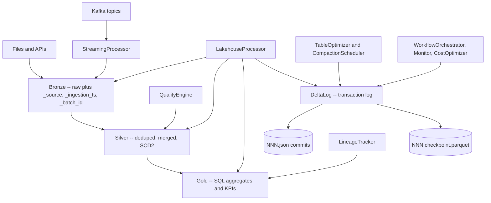

# Data Lakehouse

## Overview

This project is a data lakehouse built from scratch in Python. A lakehouse stores data in
open file formats on cheap object storage (like a data lake) while layering the ACID
transactions, schema management, and time travel of a data warehouse on top. The unifying
mechanism is a **transaction log**: a serializable, append-only record of every change to a
table, from which the current state — and any historical state — can be reconstructed.

The heart of this implementation is `delta_log.py`, a **pure-Python re-implementation of
the Delta Lake transaction protocol**. It depends on nothing but the standard library
(plus optional `pyarrow` for parquet checkpoints), which makes the core algorithms —
atomic versioned commits, optimistic concurrency control, snapshot replay, checkpointing,
time travel, and vacuum — directly readable and testable without spinning up a JVM or a
Spark cluster. Around that core, the project provides a set of PySpark/Delta-backed
processors that implement the **medallion architecture** (Bronze → Silver → Gold), data
quality validation, streaming ingestion, file optimization, lineage tracking, and cost
analysis.

**Goals**

- Implement the Delta transaction-log protocol (Add/Remove/Metadata/Protocol actions,
  versioned JSON commits, parquet checkpoints) faithfully and from scratch.
- Provide ACID semantics through optimistic concurrency control with put-if-absent writes.
- Support time travel and table restore by replaying the log to an arbitrary version.
- Model the medallion architecture as a concrete ETL pipeline with deduplication, merge,
  SCD Type 2, and SQL aggregation.
- Offer a chainable data-quality engine and a lineage graph with impact analysis.

**Concepts it teaches**

- Log-structured table formats and the difference between the log and the data files.
- Optimistic concurrency control and conflict detection via exclusive file creation.
- Checkpointing as a log-compaction technique to bound read cost.
- Snapshot isolation through deterministic log replay.
- The Bronze/Silver/Gold refinement pattern and slowly-changing-dimension handling.

**Scope**

The pure-Python transaction log is complete and fully tested. The Spark-backed processors
are real PySpark code but require `pyspark`, `delta-spark`, and a JVM to execute; without
them the modules import as `None` and their tests are skipped. Streaming requires a Kafka
broker. This is a learning-oriented implementation, not a drop-in replacement for the
production Delta Lake engine.

## Architecture



The system has two cleanly separated tiers.

**Tier 1 — the transaction log (pure Python, `delta_log.py`).** Every table is a directory
containing data files plus a `_delta_log/` subdirectory. Each commit is a JSON file named
by a 20-digit zero-padded version (`00000000000000000000.json`). The log is the single
source of truth: the set of files that logically belong to the table at any version is
computed by replaying every commit up to that version and folding the actions into a
`TableState`. Periodic checkpoints snapshot the active-file set into parquet so reads do
not have to replay the entire history.

**Tier 2 — the Spark processors.** `LakehouseProcessor` reads and writes Delta tables
through `pyspark` and `delta-spark`, moving data through the Bronze, Silver, and Gold
layers. `QualityEngine` validates DataFrames, `StreamingProcessor` and
`ChangeDataFeedProcessor` handle continuous ingestion, `TableOptimizer` and friends manage
file layout, and the `enterprise` module adds orchestration, monitoring, and cost
reporting. These wrap the production Delta engine rather than the Tier-1 log; the Tier-1
log is the from-scratch teaching artifact.

**Medallion layers.**

- **Bronze** — raw data landed as-is, append-only, enriched with metadata columns
  (`_source`, `_ingestion_ts`, `_batch_id`, `_input_file`, `_ingestion_date`) and
  partitioned by ingestion date.
- **Silver** — cleaned and conformed: transformations applied, deduplicated by business
  key keeping the latest record per watermark, then merged (upsert) into the target.
  Supports SCD Type 2 for dimension history.
- **Gold** — business-ready aggregates produced by registering silver tables as temp views
  and running a SQL aggregation, optionally Z-ordered for query performance.

## Core Components

### DeltaLog — the transaction log

`DeltaLog` (`delta_log.py`) is the central abstraction. It manages a `_delta_log/`
directory and exposes commit, snapshot, time-travel, checkpoint, vacuum, and statistics
operations.

**Commit (optimistic concurrency control).** `commit()` computes the next version as
`latest_version + 1`, then performs an *atomic* write of a new JSON log file using exclusive
creation (`open(path, "x")`). If two writers race, the second `open` raises
`FileExistsError`; the loser catches it, recomputes the version, and retries up to
`max_retries`. This is optimistic concurrency control: writers assume no conflict and
detect collisions at commit time rather than holding locks.

```python
def commit(self, actions: List[Action], max_retries: int = 3) -> int:
    for attempt in range(max_retries):
        try:
            version = self._get_latest_version() + 1
            log_file = self.log_path / f"{version:020d}.json"
            self._atomic_write(log_file, actions)   # open(path, "x") -> put-if-absent
            self._current_version = version
            self._snapshot.extend(actions)
            return version
        except FileExistsError:
            continue   # conflict: another writer took this version, retry
    raise Exception("Max retries exceeded for commit")
```

**Snapshot reconstruction.** `get_snapshot(version)` builds table state by (1) finding the
latest checkpoint at or before the target version, (2) loading that checkpoint into a
`TableState`, and (3) replaying every commit after the checkpoint up to the target. With no
checkpoint, it replays from version 0. `TableState.apply_actions` folds each action: an
`AddFile` appends to the file list, a `RemoveFile` drops the matching path, and
`Metadata`/`Protocol` overwrite the schema/protocol.

```python
def get_snapshot(self, version: Optional[int] = None) -> Snapshot:
    checkpoint_version = self._find_latest_checkpoint()
    if checkpoint_version is not None:
        state = self._read_checkpoint(checkpoint_version)
        start_version = checkpoint_version + 1
    else:
        state = TableState()
        start_version = 0
    target = version if version is not None else self._get_latest_version()
    for v in range(start_version, target + 1):
        state = state.apply_actions(self._read_log_file(v))
    return Snapshot(version=target, state=state)
```

**Time travel.** `time_travel(version)` replays log files `0..version` into a fresh
`TableState` and returns the active `AddFile` list — the exact set of files that made up the
table at that version. This is how historical reads and `restore` are expressed.

**Active-file resolution.** `get_active_files()` walks the in-memory action snapshot,
tracking added and removed paths, so that a file added then removed does not appear, and a
removed path is excluded even if its add came earlier. `get_partitions()` groups the active
files by a canonicalized (sorted-key) JSON of their partition values.

**Checkpoints.** `create_checkpoint()` writes the current active-file set to
`NNN.checkpoint.parquet` via `pyarrow`. When `pyarrow` is unavailable it falls back to a
JSON checkpoint and `touch`es an empty `.parquet` placeholder so checkpoint *detection*
(`_find_latest_checkpoint`, which globs `*.checkpoint.parquet`) still works. Reads prefer
the parquet checkpoint and fall back to the JSON one.

**Vacuum.** `vacuum(retention_hours)` returns the paths of `RemoveFile` actions whose
deletion timestamp is older than the retention cutoff (`retention_hours == 0` selects all),
identifying tombstoned files that are safe to physically delete.

**Stats.** `collect_stats()` sums sizes across active files and parses each file's `stats`
JSON (`numRecords`) to report total files, total size, total records, partitions, and the
current version.

**Why exclusive creation gives atomicity.** The protocol's correctness hinges on one
property: a versioned commit file either does not exist or exists fully, and only one writer
can create it. POSIX `O_EXCL` (`open(path, "x")`) provides exactly that — a put-if-absent
primitive. Two writers that both compute version *v* will both try to create
`{v:020d}.json`; the OS guarantees exactly one succeeds and the other gets `FileExistsError`.
There is no read-modify-write window to lose, so no lock is required. The retry loop simply
re-reads the latest version and tries *v+1*. On object stores that lack `O_EXCL`, the same
role is played by conditional writes (put-if-absent); the algorithm is identical.

**Action serialization.** `_action_to_json` / `_parse_action` translate between the dataclass
actions and the on-wire JSON envelope keyed by action kind (`add`, `remove`, `metaData`,
`protocol`), using Delta's camelCase field names (`partitionValues`, `modificationTime`,
`dataChange`, `minReaderVersion`). Each commit file is newline-delimited JSON — one action
per line — so files can be appended to and parsed line-by-line without loading the whole
commit into memory.

**Checkpoint read/fallback.** `_read_checkpoint` prefers the parquet file (`pyarrow` →
pandas → reconstruct `AddFile`s) and, on any failure or when `pyarrow` is missing, falls
through to the JSON checkpoint, parsing each line back into an action. `_find_latest_checkpoint`
globs `*.checkpoint.parquet` and takes the max version, which is why the JSON-fallback path
still `touch`es an empty `.parquet` placeholder — detection and reading are deliberately
decoupled so the rest of the code never branches on which checkpoint format exists.

### LakehouseProcessor — medallion ETL

`LakehouseProcessor` (`processor.py`) requires `pyspark`; calling its constructor without it
raises a descriptive `ImportError`. It implements the layer transitions.

- **`bronze_ingestion`** reads JSON/CSV/Parquet (with optional schema), appends the bronze
  metadata columns, and writes append-only Delta partitioned by `_ingestion_date`.
  `bronze_ingestion_df` does the same for an existing DataFrame. The metadata columns are not
  decoration — they are the provenance and idempotency backbone: `_source` records where the
  row came from, `_ingestion_ts` and `_ingestion_date` timestamp and partition it,
  `_batch_id` (a fresh UUID per ingest) lets a bad batch be isolated and re-run, and
  `_input_file` ties each row back to its source file for debugging. Bronze never transforms
  the payload, which preserves a faithful, replayable record of exactly what arrived.
- **`bronze_to_silver`** reads bronze, filters incrementally against the silver watermark if
  the target exists, applies the supplied transformation functions, deduplicates with a
  window (`row_number()` over `partitionBy(dedup_keys).orderBy(watermark desc)` keeping
  `row_num == 1`), strips the `_`-prefixed bronze metadata, and merges (upsert) into silver
  via `whenMatchedUpdateAll().whenNotMatchedInsertAll()`.
- **`silver_to_gold`** registers each silver table as a temp view, runs the aggregation SQL,
  overwrites gold, and optionally Z-orders.
- **`apply_scd_type2`** implements Slowly Changing Dimension Type 2: it hashes the tracked
  columns (`sha2(concat_ws(...))`) to detect change, closes the current record (sets
  `end_date`, `is_current = false`) when the hash differs, and inserts new versions for
  changed keys, preserving full history.
- Utility methods cover time-travel reads (`read_table`), `optimize_table`, `vacuum_table`,
  `get_table_history`, `restore_table`, generic `merge_delta_tables`, and `create_business_view`.

The Bronze→Silver dedup-and-merge is the load-bearing transition. Bronze is append-only, so
the same business key can appear many times; Silver must keep exactly the latest. The window
function ranks rows per key by the watermark and keeps rank 1, then the result is upserted so
re-running the job is idempotent:

```python
window = Window.partitionBy(dedup_keys).orderBy(col(watermark_col).desc())
df_deduped = (df.withColumn("_row_num", row_number().over(window))
                .filter(col("_row_num") == 1)
                .drop("_row_num"))
# strip bronze metadata, then upsert into silver
(silver_table.alias("target")
    .merge(df_clean.alias("source"), merge_condition)
    .whenMatchedUpdateAll()
    .whenNotMatchedInsertAll()
    .execute())
```

Incrementality comes from reading the silver watermark first
(`agg(max(watermark_col))`) and filtering bronze to only newer rows, so each run processes a
slice rather than the full history; `df.rdd.isEmpty()` short-circuits when there is nothing
new.

The SCD Type 2 path layers change-detection on top of merge. A hash of the tracked columns is
the change signal: matched rows whose hash differs have their current version closed
(`whenMatchedUpdate` with a condition on `is_current = true AND hashes differ`), and a second
pass appends fresh current rows for the changed keys, so the dimension carries a full validity
timeline (`effective_date`, `end_date`, `is_current`).

### QualityEngine — data quality validation

`QualityEngine` (`quality.py`) offers a fluent, Great-Expectations-style API. Each
`expect_*` method appends a declarative expectation and returns `self` for chaining;
`validate(df)` evaluates them all and returns a `ValidationResult`. Supported expectations:
column existence, not-null, uniqueness, in-set membership, between-bounds, and table
row-count bounds. Each check computes concrete counts (e.g. null count, duplicate count,
out-of-range count) so failures are diagnosable, and `ValidationResult.failed_expectations`
returns only the failures. The expectation registry is in-memory; the actual counts require
`pyspark`.

The two-phase shape — declare, then evaluate — keeps expectations data-agnostic and reusable
across DataFrames, and lets `validate` compute the shared `row_count` once. Each check is a
small, self-contained function that first guards against a missing column (returning a
failure with an `error` message rather than throwing), then expresses the violation as a
filter whose `count()` is the number of bad rows:

```python
def _check_between(self, df, column, min_value, max_value) -> ExpectationResult:
    if column not in df.columns:
        return ExpectationResult(..., success=False, result={"error": f"Column {column} not found"})
    conditions = []
    if min_value is not None: conditions.append(col(column) < min_value)
    if max_value is not None: conditions.append(col(column) > max_value)
    filter_condition = conditions[0]
    for cond in conditions[1:]:
        filter_condition = filter_condition | cond
    outside_count = df.filter(filter_condition).count()
    return ExpectationResult(..., success=outside_count == 0,
        result={"outside_count": outside_count, "total_count": df.count(),
                "min_value": min_value, "max_value": max_value})
```

The aggregate `ValidationResult.success` is the logical AND of every check, and its
`statistics` records how many expectations ran and how many passed — enough for a pipeline to
decide whether to fail the run or merely warn.

### StreamingProcessor and ChangeDataFeedProcessor

`StreamingProcessor` (`streaming.py`) builds Structured Streaming pipelines:
`stream_from_kafka` parses JSON message values against a schema; `stream_to_bronze` writes a
watermarked, metadata-enriched append stream; `stream_aggregation` performs tumbling/sliding
windowed aggregation; `stream_dedupe` drops duplicates within a watermark; `monitor_query`
surfaces a streaming query's status and progress.

`ChangeDataFeedProcessor` enables Delta Change Data Feed, reads or streams row-level changes
between versions/timestamps, and `propagate_changes` applies inserts/updates/deletes from a
source table's CDF into a target table inside a `foreachBatch` merge. The micro-batch handler
splits the change stream by `_change_type`: `insert` and `update_postimage` rows are unioned
and upserted, while `delete` rows are translated into a `DELETE` predicate on the merge keys.
This makes a target table a continuously-maintained materialized replica of the source — the
streaming analog of the batch Bronze→Silver merge.

Watermarks are central to the streaming design: every aggregation, dedup, and bronze stream
declares `withWatermark(col, delay)` so Spark can bound the in-flight state it must retain for
late-arriving events and emit/close windows. Dedup remembers IDs only within the watermark
horizon (`stream_dedupe`), and windowed aggregation uses `update` output mode so partial
window results are revised as more data arrives.

### TableOptimizer and the optimizer toolkit

`TableOptimizer` (`optimizer.py`) wraps Delta `OPTIMIZE` (with optional Z-ordering),
`VACUUM` (with dry-run), storage analysis (`analyze_storage` returns a `StorageReport` with
file count, average size, small-file count, version count, and recommendations), and table
property configuration. `PartitionOptimizer` evaluates candidate partition columns by
cardinality, and `CompactionScheduler` decides whether to compact from heuristics
(`should_compact`) and runs full `schedule_maintenance` (analyze → compact → vacuum).

Several optimizer helpers are **pure Python** and unit-tested directly:
`StorageOptimizer.identify_small_files` / `calculate_compaction_bins`,
`CompactionStrategy.bin_packing` / `adapt_target_size` / `select_incremental`, and
`OptimizationPlan.create_plan` / `prioritize_tasks` / `estimate_cost` / `create_schedule`.

Compaction is fundamentally a bin-packing problem: many small files must be combined into
fewer ~1 GB files. `CompactionStrategy.bin_packing` implements **first-fit-decreasing** —
sort files largest-first, then place each into the first bin that can hold it (allowing 20%
overflow), opening a new bin only when none fits:

```python
def bin_packing(self, files: List[Dict]) -> List[List[Dict]]:
    sorted_files = sorted(files, key=lambda x: x.get("size_mb", 0), reverse=True)
    bins, bin_sizes = [], []
    for f in sorted_files:
        size = f.get("size_mb", 0)
        for i, bin_size in enumerate(bin_sizes):
            if bin_size + size <= self.target_file_size_mb * 1.2:   # 20% overflow allowed
                bins[i].append(f); bin_sizes[i] += size
                break
        else:
            bins.append([f]); bin_sizes.append(size)
    return bins
```

`OptimizationPlan.create_plan` turns table statistics into a concrete action list: it flags
compaction when files exceed 100 or average size drops below 128 MB, vacuum when deleted
files exist, and Z-ordering when the file count is high — accumulating a rough
`estimated_duration_minutes` per operation. `create_schedule` then greedily packs the
highest-priority tables into a fixed maintenance window. These planners are deterministic and
Spark-free, which is why they are exercised directly in the test suite.

### LineageTracker — lineage and impact analysis

`LineageTracker` (`lineage.py`) maintains a `LineageGraph` of `TableNode`s and
`LineageEdge`s with forward and reverse adjacency maps. `register_table` adds nodes;
`add_transformation` records source→target edges plus column-level `ColumnLineage` entries
typed by `LineageType` (direct, derived, filtered, joined, aggregated). Graph queries
include depth-bounded `get_upstream`/`get_downstream`, `get_column_lineage`,
`impact_analysis` (which downstream tables and columns a change touches, grouped by layer),
and `get_full_upstream_path`. `create_medallion_lineage` is a helper that wires a standard
Bronze→Silver→Gold lineage from mapping dicts. This module is pure Python.

Traversal is a depth-bounded DFS over the adjacency maps with a `visited` set, so cycles and
diamond dependencies terminate and are not double-counted:

```python
def get_downstream(self, table_name: str, depth: int = -1) -> Set[str]:
    downstream, visited = set(), set()
    def traverse(name: str, current_depth: int):
        if name in visited or (depth >= 0 and current_depth > depth):
            return
        visited.add(name)
        for target in self._adjacency.get(name, set()):
            downstream.add(target)
            traverse(target, current_depth + 1)
    traverse(table_name, 0)
    return downstream
```

`impact_analysis` builds on this: it reports the directly affected tables (one hop), all
transitively affected tables, the affected count, and a per-layer grouping, plus — when a
column is given — the specific downstream columns and the transformation that produced each.
This answers "if I change this column, what breaks?" before the change is made.

### Enterprise — orchestration, monitoring, cost

`enterprise.py` adds `WorkflowOrchestrator` (build an Airflow-compatible DAG definition and
execute tasks in dependency order with simple topological scheduling and failure
short-circuiting), `LakehouseMonitor` (collect `TableMetrics`, register and evaluate
`Alert`s, summarize table history), and `CostOptimizer` (estimate storage/query cost and
apply cost-saving table properties plus vacuum/optimize). The Spark-touching methods require
`pyspark`; the orchestration scheduling logic itself is plain Python.

`execute_dag` runs a simple Kahn-style topological loop: in each round it executes every task
whose dependencies are all complete, marks successes complete, and removes failed tasks
without running their dependents. If a full round makes no progress while tasks remain, it
raises — surfacing a circular or blocked dependency rather than hanging:

```python
while remaining:
    executed_this_round = False
    for task in remaining[:]:
        if all(dep in completed for dep in task.depends_on):
            result = self.execute_task(task)
            results[task.task_id] = result
            if result["status"] == "success":
                completed.add(task.task_id)
            remaining.remove(task)
            executed_this_round = True
    if not executed_this_round and remaining:
        raise RuntimeError(f"Cannot execute remaining tasks: {[t.task_id for t in remaining]}")
```

`execute_task` wraps each handler in try/except so a failure becomes a structured result
(`status="failed"` plus the error string and timing) instead of an exception that aborts the
whole DAG — the same defensive pattern `check_alerts` uses when evaluating alert conditions.

### Concurrency and isolation semantics

The transaction log is what makes concurrent access safe, and it is worth stating the
guarantees precisely because the tests assert them.

- **Atomicity.** A commit is a single `O_EXCL` file creation. Either the whole commit file
  exists (and all its actions take effect on the next replay) or it does not. There is no
  partial commit, because readers only ever see complete, named version files.
- **Serializability of the version order.** Versions are dense integers assigned by
  put-if-absent. Because only one writer can create version *v*, the committed history is a
  total order `0, 1, 2, …` with no gaps and no duplicates — which `test_transactions.py`
  verifies by committing from many threads and checking the resulting version set.
- **Snapshot isolation for readers.** A reader resolves a target version and replays the log
  up to exactly that version. Commits that land while it reads have higher version numbers
  and are simply not included, so the read sees a consistent point-in-time snapshot without
  blocking writers.
- **Conflict handling.** The only conflict is two writers choosing the same next version; the
  loser retries against the new latest version. The implementation retries blindly up to
  `max_retries` (it does not yet check whether the concurrent commit logically conflicts with
  the in-flight one — a deliberate simplification of Delta's conflict-detection rules).

The cost of these guarantees is that the log grows by one file per commit. Checkpoints bound
the *read* cost of a long history, and `vacuum` plus log retention bound the *storage* cost by
identifying tombstoned data files and old log entries that can be removed.

### End-to-end walkthrough

Tracing one record clarifies how the pieces compose. Suppose a sales event arrives as JSON.

1. **Ingest (Bronze).** `bronze_ingestion` reads the file, tags the row with `_source`,
   `_ingestion_ts`, `_batch_id`, `_input_file`, `_ingestion_date`, and appends it to the
   bronze Delta table partitioned by ingestion date. The write produces a new data file and a
   commit containing an `AddFile` action; bronze keeps every version of the event, including
   duplicates from retried deliveries.
2. **Refine (Silver).** `bronze_to_silver` reads only bronze rows newer than the silver
   watermark, applies cleaning transforms, ranks rows per business key by the watermark and
   keeps the latest, strips the `_`-prefixed metadata, and upserts into silver. The same
   commit machinery records the merge as add/remove actions, so silver is itself
   time-travelable and the job is safe to re-run.
3. **Validate.** Before or after the merge, a `QualityEngine` suite checks the silver
   DataFrame — keys non-null and unique, amounts in range, status in an allowed set — and
   returns a `ValidationResult` the pipeline can branch on.
4. **Aggregate (Gold).** `silver_to_gold` registers silver as a temp view, runs the
   aggregation SQL (e.g. daily revenue per category), overwrites gold, and optionally
   Z-orders the result on the columns queries filter by.
5. **Track and maintain.** `LineageTracker` records the bronze→silver→gold edges so an
   `impact_analysis` can later answer what a schema change would break, and
   `CompactionScheduler.schedule_maintenance` periodically analyzes, compacts, and vacuums the
   tables as their file counts and versions grow.

At every step the *log* — not the data files — is authoritative about what the table contains,
which is what lets reads at step 4 see a consistent snapshot even while step 1 keeps appending.

## Data Structures

### Transaction-log actions

The protocol actions are dataclasses. They are the alphabet of every commit.

```python
@dataclass
class AddFile(Action):
    path: str
    partition_values: Dict[str, str]
    size: int
    modification_time: int
    data_change: bool
    stats: Optional[str] = None            # JSON column statistics, e.g. {"numRecords": 1000}
    tags: Optional[Dict[str, str]] = None

@dataclass
class RemoveFile(Action):
    path: str
    deletion_timestamp: int                # used by vacuum retention
    data_change: bool
    extended_file_metadata: bool = False
    partition_values: Dict[str, str] = field(default_factory=dict)

@dataclass
class Metadata(Action):
    id: str
    name: str
    description: str
    schema_string: str
    partition_columns: List[str]
    configuration: Dict[str, str] = field(default_factory=dict)
    format_provider: str = "parquet"

@dataclass
class Protocol(Action):
    min_reader_version: int
    min_writer_version: int
    reader_features: List[str] = field(default_factory=list)
    writer_features: List[str] = field(default_factory=list)

@dataclass
class CommitInfo(Action):
    timestamp: int
    user_id: str = ""
    operation: str = ""
    operation_parameters: Dict[str, str] = field(default_factory=dict)
    job_name: str = ""
    notebook_id: str = ""
    is_blind_append: bool = True

@dataclass
class SetTransaction(Action):
    app_id: str
    version: int
    last_updated: Optional[int] = None
```

### Table state and snapshot

`TableState` is the folded result of applying actions; `Snapshot` pairs it with a version.

```python
@dataclass
class TableState:
    files: List[AddFile] = field(default_factory=list)
    metadata: Optional[Metadata] = None
    protocol: Optional[Protocol] = None

    def apply_actions(self, actions: List[Action]) -> "TableState":
        new_state = TableState(files=self.files.copy(),
                               metadata=self.metadata, protocol=self.protocol)
        for action in actions:
            if isinstance(action, AddFile):
                new_state.files.append(action)
            elif isinstance(action, RemoveFile):
                new_state.files = [f for f in new_state.files if f.path != action.path]
            elif isinstance(action, Metadata):
                new_state.metadata = action
            elif isinstance(action, Protocol):
                new_state.protocol = action
        return new_state

@dataclass
class Snapshot:
    version: int
    state: TableState
```

### On-disk layout

A table directory holds data files plus the log:

```
events_table/
  _delta_log/
    00000000000000000000.json            # commit v0 (one JSON action per line)
    00000000000000000001.json            # commit v1
    00000000000000000010.checkpoint.parquet   # checkpoint at v10
  dt=2024-01-01/part-0.parquet
  dt=2024-01-02/part-1.parquet
```

Each `.json` line is one serialized action, e.g.
`{"add": {"path": "...", "partitionValues": {...}, "size": ..., "stats": "..."}}`.

### Configuration and quality types

```python
class Layer(Enum):
    BRONZE = "bronze"; SILVER = "silver"; GOLD = "gold"

@dataclass
class LakehouseConfig:
    lakehouse_path: str
    checkpoint_path: str
    spark_master: str = "local[*]"
    app_name: str = "data-lakehouse"
    enable_change_data_feed: bool = True
    auto_compact: bool = True
    optimize_write: bool = True
    log_retention_days: int = 30
    deleted_file_retention_hours: int = 168          # 7 days

    def get_layer_path(self, layer: Layer) -> str:
        return f"{self.lakehouse_path}/{layer.value}"

@dataclass
class ValidationResult:
    success: bool
    results: List[ExpectationResult]
    statistics: Dict[str, Any]

    @property
    def failed_expectations(self) -> List[ExpectationResult]:
        return [r for r in self.results if not r.success]
```

### Lineage types

```python
class LineageType(Enum):
    DIRECT = "direct"; DERIVED = "derived"; FILTERED = "filtered"
    JOINED = "joined"; AGGREGATED = "aggregated"

@dataclass
class ColumnLineage:
    source_table: str
    source_column: str
    target_table: str
    target_column: str
    lineage_type: LineageType
    transformation: Optional[str] = None
```

## API Design

### DeltaLog (pure Python — no external services)

```python
class DeltaLog:
    def __init__(self, table_path: str): ...
    @property
    def current_version(self) -> int: ...
    @property
    def snapshot(self) -> List[Action]: ...

    def commit(self, actions: List[Action], max_retries: int = 3) -> int: ...
    def get_snapshot(self, version: Optional[int] = None) -> Snapshot: ...
    def read_version(self, version: int) -> List[Dict[str, Any]]: ...
    def time_travel(self, version: int) -> List[AddFile]: ...
    def create_checkpoint(self) -> None: ...
    def get_active_files(self) -> List[AddFile]: ...
    def get_partitions(self) -> Dict[str, List[AddFile]]: ...
    def get_table_properties(self) -> Dict[str, Any]: ...
    def vacuum(self, retention_hours: int = 168) -> List[str]: ...
    def optimize_z_order(self, columns: List[str]) -> List[AddFile]: ...   # placeholder
    def collect_stats(self) -> Dict[str, Any]: ...
```

### LakehouseProcessor (requires pyspark)

```python
class LakehouseProcessor:
    def __init__(self, spark, config: Optional[LakehouseConfig] = None): ...
    def bronze_ingestion(self, source_path, bronze_path, source_name,
                         schema=None, file_format="json") -> None: ...
    def bronze_ingestion_df(self, df, bronze_path, source_name) -> None: ...
    def bronze_to_silver(self, bronze_path, silver_path, dedup_keys,
                         watermark_col, transformations=None) -> None: ...
    def silver_to_gold(self, silver_tables, gold_path,
                       aggregation_query, z_order_cols=None) -> None: ...
    def apply_scd_type2(self, silver_path, updates_df, key_columns,
                        track_columns, ...) -> None: ...
    def read_table(self, path, version=None, timestamp=None): ...
    def optimize_table(self, path, partition_filter=None, z_order_by=None) -> Dict: ...
    def vacuum_table(self, path, retention_hours=168) -> None: ...
    def get_table_history(self, path, limit=None): ...
    def restore_table(self, path, version) -> None: ...
    def merge_delta_tables(self, target_path, source_df, merge_keys,
                           update_columns=None, delete_condition=None) -> Dict: ...
```

### QualityEngine (fluent, evaluation requires pyspark)

```python
class QualityEngine:
    def expect_column_to_exist(self, column) -> "QualityEngine": ...
    def expect_column_values_to_not_be_null(self, column) -> "QualityEngine": ...
    def expect_column_values_to_be_unique(self, column) -> "QualityEngine": ...
    def expect_column_values_to_be_in_set(self, column, value_set) -> "QualityEngine": ...
    def expect_column_values_to_be_between(self, column, min_value=None,
                                           max_value=None) -> "QualityEngine": ...
    def expect_table_row_count_to_be_between(self, min_value, max_value) -> "QualityEngine": ...
    def validate(self, df) -> ValidationResult: ...
    def clear_expectations(self) -> None: ...
```

The full method-by-method reference (signatures, parameters, return shapes for every
module) lives in [API.md](API.md); deployment instructions are in
[DEPLOYMENT.md](DEPLOYMENT.md) and deeper architecture notes in
[ARCHITECTURE.md](ARCHITECTURE.md).

## Performance

Performance numbers here describe the design's intent and the heuristics that are actually
coded; they are not benchmark measurements.

- **Bounded read cost via checkpoints.** Without checkpoints, reconstructing the table at
  version *N* replays *N+1* JSON files — O(N) log reads. `create_checkpoint()` collapses the
  active-file set into a single parquet file so `get_snapshot` only replays commits *after*
  the latest checkpoint, bounding read amplification regardless of history depth.
- **Commit cost.** A commit is a single exclusive file write plus a directory listing to
  find the latest version; conflicts cost one extra listing + write per retry, up to
  `max_retries` (default 3).
- **Active-file resolution** is a single pass over the in-memory action snapshot
  (`get_active_files`), so partition grouping and stats are linear in the number of actions.
- **File-size targets.** The optimizer treats files under **128 MB** as "small" and targets
  roughly **1 GB** compacted files (`_generate_recommendations`, `analyze_storage`).
  `CompactionScheduler.should_compact` triggers when small files exceed a threshold, average
  file size drops below the minimum, or the version count grows large (default >50).
- **Partition vs Z-order guidance.** `PartitionOptimizer` recommends partitioning for
  columns with cardinality under ~100, coarser granularity up to ~1000, and Z-ordering
  instead for higher cardinality; `ZOrderOptimizer` favors low-selectivity columns and caps
  Z-order at 4 columns.
- **Adaptive compaction targets.** `CompactionStrategy.adapt_target_size` shrinks target
  file size for streaming workloads (down to 32 MB for high-frequency) and grows it for
  low-frequency batch (up to 256 MB), trading write latency against scan throughput.
- **Cost estimation is parametric, not measured.** `CostOptimizer` uses a configurable
  `storage_cost_per_gb` (default $0.023, S3-like) for monthly storage and a
  `cost_per_tb_scanned` (default $5.00) for query cost; `OptimizationPlan.estimate_cost`
  models compute-hours per operation type (compaction scales with file count and size,
  Z-order with size, vacuum cheaply with size) plus 2× I/O for read+write. These are
  transparent formulas meant to *rank* tables and operations, not to predict a cloud bill.
- **Recommendation thresholds.** `StorageReport` recommendations fire at concrete cutoffs:
  average file size below 50% of the 1 GB target suggests `OPTIMIZE`, more than 10 small
  files suggests auto-compaction, and more than 100 versions suggests `VACUUM`. The same
  cutoffs drive `CompactionScheduler.should_compact`, so analysis and action stay consistent.

## Testing Strategy

The suite (~200 tests across `tests/`) is split by whether `pyspark` is required.
`tests/conftest.py` lists the pyspark-free test files and, when `pyspark` is not installed,
applies a skip marker to every other test — so the transaction-log core is always
verifiable in a plain Python environment.

**Unit tests — transaction log.** `test_delta_log_comprehensive.py`, `test_delta_log.py`,
and `test_checkpoint.py` import `delta_log.py` directly (bypassing the package `__init__`
to avoid the pyspark import) and exercise action serialization round-trips, commit/version
sequencing, snapshot replay, active-file resolution after add/remove, partition grouping,
checkpoint creation/detection (parquet and JSON-fallback), vacuum retention, and stats.

**Concurrency tests.** `test_transactions.py` drives `commit()` from multiple threads and a
`ThreadPoolExecutor`, asserting that optimistic concurrency control produces a contiguous,
conflict-free version sequence and that atomic put-if-absent writes hold under contention.

**Time-travel tests.** `test_time_travel.py` checks version- and timestamp-oriented reads,
restore semantics, history queries, and snapshot consistency by reconstructing state at
historical versions and comparing against expected file sets.

**Optimizer tests.** `test_optimizer.py` covers the pure-Python helpers — small-file
identification, bin-packing into compaction groups, adaptive target sizing, incremental
selection, and plan creation/prioritization/cost estimation — none of which need Spark.

**Query and processor tests.** `test_query_processing.py` and `test_processor*.py` use mock
Spark sessions / import-level checks so they run without a JVM; the genuinely
Spark-dependent assertions are skipped when `pyspark` is absent.

**Integration tests.** `test_integration.py` walks a Bronze→Silver→Gold flow to verify the
layers compose (skipped without pyspark).

**Edge cases covered.** Empty tables and empty commits, replaying past the latest version,
removing a file added in the same logical history, retention boundary at
`retention_hours == 0`, checkpoint detection when only the JSON fallback exists, and
canonicalized partition-value keys.

**Why the core tests bypass the package `__init__`.** The pyspark-free test files load
`delta_log.py` with `importlib.util.spec_from_file_location` rather than `from lakehouse import
DeltaLog`. This is deliberate: the package `__init__` imports the Spark-backed modules, so a
normal import would pull in (or stub out) `pyspark`. Loading the module file directly proves
the transaction log has *no* hidden Spark dependency and keeps the core test run fast and
hermetic. `conftest.py` reinforces this by listing the pyspark-free files in
`NO_PYSPARK_REQUIRED` and skipping everything else when `pyspark` is absent, so
`pytest tests/` is green on a bare Python install and exercises the full Spark surface only
when the optional dependencies are present.

**What the Spark tests stand in for.** `test_processor*.py` and `test_query_processing.py` use
mock Spark sessions and import-level assertions so they can verify wiring (method signatures,
argument plumbing, that `_require_pyspark` raises cleanly) without a JVM, while the genuine
DataFrame behavior is validated only under a real `pyspark` install. This keeps the boundary
between "tested everywhere" and "tested with Spark" explicit and intentional.

Run the suite with:

```bash
pytest tests/ -v
# with coverage:
pytest tests/ --cov=lakehouse --cov-report=term
```

## References

- Delta Lake — <https://delta.io/>
- Delta Lake transaction protocol — <https://github.com/delta-io/delta/blob/master/PROTOCOL.md>
- Apache Spark Structured Streaming — <https://spark.apache.org/docs/latest/structured-streaming-programming-guide.html>
- Databricks medallion architecture — <https://www.databricks.com/glossary/medallion-architecture>
- Slowly Changing Dimensions (Kimball) — <https://www.kimballgroup.com/data-warehouse-business-intelligence-resources/kimball-techniques/dimensional-modeling-techniques/>
- Apache Parquet — <https://parquet.apache.org/>
- Optimistic concurrency control — <https://en.wikipedia.org/wiki/Optimistic_concurrency_control>
- Bin packing problem — <https://en.wikipedia.org/wiki/Bin_packing_problem>
