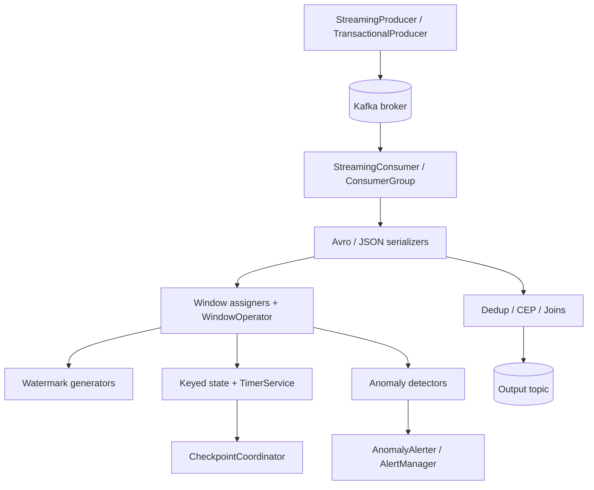

# Streaming Platform

A Kafka- and Flink-style stream-processing platform built from scratch in Python. It wraps `confluent-kafka` with reliability-first producer/consumer clients and implements the event-time machinery — windowing, watermarks, keyed state, checkpointing, and exactly-once patterns — as pure-Python data structures you can read and test without a running cluster.

## Features

- **Reliable Kafka producer** — idempotent, `acks=all` producer with batching, buffer-full back-off, and transactional send for exactly-once (`StreamingProducer` / `TransactionalProducer` in `producer.py`).
- **Manual-commit consumer** — batch consumption, rebalance-aware offset commits, seek/pause/resume, and read-committed isolation (`StreamingConsumer` / `ConsumerGroup` / `Message` in `consumer.py`).
- **Event-time windowing** — tumbling, sliding, and session window assigners with watermark-driven firing (`TumblingWindowAssigner`, `SlidingWindowAssigner`, `SessionWindowAssigner`, `WindowOperator` in `windowing.py`).
- **Watermarks** — bounded out-of-orderness and idle-partition-aware generators (`BoundedOutOfOrdernessGenerator`, `IdleAwareWatermarkGenerator`).
- **Keyed state and timers** — value/list/map state over a pluggable backend, plus event-time and processing-time timers (`ValueState`, `ListState`, `MapState`, `TimerService` in `state.py`).
- **Checkpoint coordination** — trigger/complete/restore checkpoints for fault-tolerant state (`CheckpointCoordinator`).
- **Streaming patterns** — deduplication, debouncing, sessionization, a fluent CEP engine, and windowed/interval stream joins (`Deduplicator`, `Debouncer`, `SessionProcessor`, `CEPEngine`, `StreamJoiner`, `IntervalJoiner` in `patterns.py`).
- **Avro/JSON serialization** — Confluent wire-format Avro with the 5-byte magic header, plus prebuilt event/metric/aggregation schemas (`AvroSerializer`, `JsonSerializer` in `serializers.py`).
- **Flink job builder** — declarative source/sink/transform specs that emit a job spec dict and PyFlink DDL code (`FlinkJobBuilder` in `flink_jobs.py`).
- **Anomaly detection** — rolling Z-score, MAD, and EMA detectors with rate-limited alerting (`StatisticalDetector`, `StreamingAnomalyDetector` in `anomaly_detection.py`).
- **Enterprise utilities** — in-process schema registry, MirrorMaker 2 config generation, compacted-topic management, Prometheus metrics export, and a Flink autoscaler (`enterprise.py`).

## Architecture



| Component | Module | Responsibility |
|-----------|--------|----------------|
| Producer | `producer.py` | Idempotent and transactional publishing, topic admin |
| Consumer | `consumer.py` | Manual-commit consumption, rebalance handling, offset control |
| Serialization | `serializers.py` | Avro (registry wire format) and JSON encode/decode |
| Windowing | `windowing.py` | Window assignment, watermarks, windowed aggregation |
| State | `state.py` | Keyed value/list/map state, timers, checkpoints |
| Patterns | `patterns.py` | Dedup, debounce, sessions, CEP, stream joins |
| Anomaly detection | `anomaly_detection.py` | Z-score / MAD / EMA detection and alert aggregation |
| Flink jobs | `flink_jobs.py` | Job-spec builder and PyFlink DDL generation |
| Enterprise | `enterprise.py` | Schema registry, replication, metrics, autoscaling |
| Config | `config.py` | Dataclass config mapped to confluent-kafka properties |

## Quick Start

### Prerequisites

- Python 3.9+
- `confluent-kafka`, `fastavro` (installed via the package). A running Kafka broker is only needed to actually produce/consume — the windowing, state, pattern, and anomaly code runs entirely in-process.
- Docker (optional) for the bundled Kafka / Schema Registry / Flink stack.

### Installation

```bash
cd 08-streaming-platform
pip install -e ".[dev]"
```

### Running

```bash
# Optional: start Kafka + Zookeeper + Schema Registry
docker-compose up -d

# Optional: add the Flink cluster or Kafka UI
docker-compose --profile flink up -d
docker-compose --profile debug up -d

# Run the test suite (no broker required)
pytest tests/ -v
```

## Usage

Event-time windowed aggregation runs purely in-process — no broker needed:

```python
from streaming.windowing import TumblingWindowAssigner, WindowOperator, sum_aggregator

# 5-second tumbling windows, summing values per key
op = WindowOperator(TumblingWindowAssigner(size_ms=5000), sum_aggregator)

op.process_element("user-1", 10.0, timestamp=1000)
op.process_element("user-1", 20.0, timestamp=2000)
op.process_element("user-1", 5.0, timestamp=7000)   # next window

# Advance the watermark past the first window to fire it
results = op.advance_watermark(5000)
for r in results:
    print(r.window, r.value)   # -> sum 30.0 for [0ms, 5000ms)
```

Configure a reliable producer (requires a broker to send):

```python
from streaming.config import ProducerConfig
from streaming.producer import StreamingProducer
from streaming.serializers import create_event_serializer

config = ProducerConfig(bootstrap_servers="localhost:9092")  # idempotent + acks=all by default
producer = StreamingProducer(config)

serializer = create_event_serializer()
value = serializer.serialize({
    "event_id": "e-1", "event_type": "click", "user_id": "u-1",
    "timestamp": 1700000000000, "payload": {"page": "home"},
    "metadata": {"source": "web", "version": 1, "correlation_id": None},
})
producer.produce(topic="raw.events", key="u-1", value=value)
producer.flush()
```

## What's Real vs Simulated

- **Real:** All event-time logic is fully implemented and unit-tested in-process: window assigners, watermark generators, the `WindowOperator`, keyed state (`ValueState`/`ListState`/`MapState`), `TimerService`, `CheckpointCoordinator`, every streaming pattern (`Deduplicator`, `Debouncer`, `SessionProcessor`, `CEPEngine`, `StreamJoiner`, `IntervalJoiner`), the anomaly detectors, and Avro/JSON serialization (including the Confluent 5-byte wire header). Producer/consumer wrappers are real `confluent-kafka` clients and talk to a real broker when one is available.
- **Simulated / requires credentials:** Actually publishing and consuming requires a running Kafka broker (use `docker-compose up -d`). The `FlinkJobBuilder` builds job-spec dicts and generates PyFlink DDL strings — it does not submit jobs to a Flink cluster. The `enterprise.py` `SchemaRegistry` is an in-process cache (schema IDs are hashed, no HTTP calls); `MirrorMaker`, `CompactedTopicManager`, `SavepointManager`, and `FlinkAutoscaler` generate config / log intended actions rather than calling Kafka/Flink/Kubernetes APIs.

## Testing

```bash
pytest tests/ -v
```

The suite has 7 modules covering the producer, consumer, windowing, state, exactly-once, patterns, and end-to-end integration paths. Producer/consumer tests mock the `confluent-kafka` client, so no broker is required; the integration tests fall back to an in-process `MockKafkaCluster` when Testcontainers/Kafka is unavailable. All tests `importorskip("confluent_kafka")` and are skipped if the library is not installed.

## Project Structure

```
08-streaming-platform/
  README.md                 # this file
  pyproject.toml            # package + dev deps
  docker-compose.yml        # Kafka, Schema Registry, Flink, Kafka UI
  .env.example              # sample configuration
  src/streaming/            # core stream-processing engine
    config.py               # dataclass configuration
    producer.py             # Kafka producer + transactions + topic admin
    consumer.py             # Kafka consumer + rebalance + offsets
    serializers.py          # Avro / JSON serialization
    windowing.py            # windows, watermarks, window operator
    state.py                # keyed state, timers, checkpoints
    patterns.py             # dedup, debounce, sessions, CEP, joins
    anomaly_detection.py    # Z-score / MAD / EMA detection
    flink_jobs.py           # Flink job-spec builder + PyFlink codegen
    enterprise.py           # registry, replication, metrics, autoscaling
  tests/                    # 7 pytest modules
  docs/BLUEPRINT.md         # full architecture and design
```

## License

MIT — see ../LICENSE
