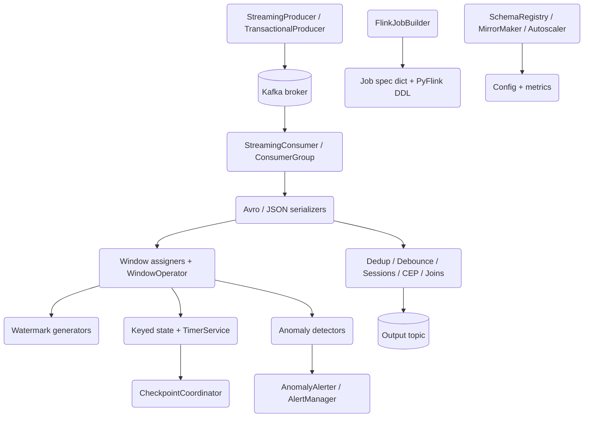

# Streaming Platform

## Overview

The Streaming Platform is a Kafka- and Flink-style stream-processing engine built
from scratch in Python. It has two clearly separated halves that mirror how real
streaming systems are layered:

- A **transport layer** that wraps `confluent-kafka` with reliability-first producer
  and consumer clients — idempotent and transactional publishing, manual-commit
  consumption, rebalance-aware offset management, and Confluent-wire-format Avro
  serialization.
- An **event-time processing layer** implemented as pure-Python data structures:
  window assigners, watermark generators, a windowed aggregation operator, keyed
  value/list/map state over a pluggable backend, event-time and processing-time
  timers, checkpoint coordination, streaming patterns (deduplication, debouncing,
  sessionization, complex event processing, and stream joins), and statistical
  anomaly detection.

The design goal is that everything above the broker runs and is unit-tested
in-process. You can construct a `WindowOperator`, feed it elements, advance a
watermark, and observe windows firing without a running Kafka cluster or Flink
job manager. The Kafka clients are real `confluent-kafka` objects and talk to a
real broker when one is available, but their tests mock the underlying client so
the suite runs anywhere the library is installed.

**Concepts this project teaches:**

- Event time vs. processing time, and why watermarks are the mechanism that
  reconciles them.
- Window assignment strategies: tumbling (fixed, non-overlapping), sliding
  (overlapping), and session (gap-based, mergeable).
- Watermark-driven window firing and the trade-off between latency and
  completeness under bounded out-of-orderness.
- Keyed state as the foundation of stateful stream processing, and how a
  checkpoint coordinator turns in-memory state into a fault-tolerant snapshot.
- Exactly-once semantics assembled from idempotent producers, Kafka transactions,
  the consume-transform-produce pattern, and read-committed isolation.
- Streaming patterns that are built on top of state and time: dedup, debounce,
  sessionization, CEP, and windowed / interval joins.
- The Confluent Schema Registry wire format (a one-byte magic header plus a
  four-byte schema ID) and Avro schemaless encoding.

**Scope.** This is a single-process library plus a docker-compose stack for a real
Kafka / Schema Registry / Flink environment. It is not a distributed runtime: there
is no scheduler that shards operators across task managers, and the `FlinkJobBuilder`
emits job specifications and PyFlink DDL rather than submitting jobs. Those
boundaries are stated explicitly in the "What's Real vs Simulated" section of the
README and reflected in every simulated component below.

## Architecture



The system is organized around the flow of a record from producer to sink:

- **Transport (`producer.py`, `consumer.py`, `serializers.py`).** A record is
  serialized (Avro or JSON), published by `StreamingProducer` with idempotence and
  `acks=all`, and later pulled by `StreamingConsumer` in manual-commit batches. The
  producer optionally runs inside a Kafka transaction for exactly-once; the consumer
  runs at `read_committed` isolation so it never sees aborted records.

- **Event-time core (`windowing.py`, `state.py`).** Deserialized values flow into a
  `WindowOperator`, which assigns each element to windows and buffers them keyed by
  `(key, window_start)`. A `WatermarkGenerator` tracks event-time progress; when the
  watermark passes a window's end, the operator fires that window through an
  aggregation function. Keyed state (`ValueState`, `ListState`, `MapState`) and a
  `TimerService` provide the primitives that stateful process functions need, and a
  `CheckpointCoordinator` snapshots that state for recovery.

- **Patterns (`patterns.py`).** Higher-level operators compose state and time:
  `Deduplicator` and `Debouncer` use time-windowed maps, `SessionProcessor` groups
  events by activity gaps, `CEPEngine` matches sequences of conditions within a time
  bound, and `StreamJoiner` / `IntervalJoiner` buffer two streams and emit matched
  pairs.

- **Observability (`anomaly_detection.py`, part of `enterprise.py`).** Metric values
  feed statistical, EMA, and threshold detectors; detected anomalies pass through a
  rate-limiting `AnomalyAlerter`. `MetricsCollector` and `AlertManager` provide a
  Prometheus export and a rule-based alert layer.

- **Job orchestration and enterprise (`flink_jobs.py`, `enterprise.py`).**
  `FlinkJobBuilder` accumulates source/sink/transform specs and emits a job-spec dict
  or generates PyFlink DDL. `enterprise.py` adds an in-process schema registry,
  MirrorMaker 2 config generation, compacted-topic management, and a Flink autoscaler.

- **Configuration (`config.py`).** Frozen-ish dataclasses (`ProducerConfig`,
  `ConsumerConfig`, `FlinkConfig`, `TopicConfig`, `SchemaRegistryConfig`) hold the
  tunables and expose `to_dict()` methods that map onto the exact `confluent-kafka`
  and topic property keys.

| Component | Module | Responsibility |
|-----------|--------|----------------|
| Producer | `producer.py` | Idempotent and transactional publishing, topic admin |
| Consumer | `consumer.py` | Manual-commit consumption, rebalance handling, offset control |
| Serialization | `serializers.py` | Avro (registry wire format) and JSON encode/decode |
| Windowing | `windowing.py` | Window assignment, watermarks, windowed aggregation |
| State | `state.py` | Keyed value/list/map state, timers, checkpoints |
| Patterns | `patterns.py` | Dedup, debounce, sessions, CEP, stream joins |
| Anomaly detection | `anomaly_detection.py` | Z-score / MAD / EMA detection and alert aggregation |
| Flink jobs | `flink_jobs.py` | Job-spec builder and PyFlink DDL generation |
| Enterprise | `enterprise.py` | Schema registry, replication, metrics, autoscaling |
| Config | `config.py` | Dataclass config mapped to confluent-kafka properties |

## Core Components

### StreamingProducer and TransactionalProducer

`StreamingProducer` (`producer.py`) wraps `confluent_kafka.Producer`, constructing it
from `ProducerConfig.to_dict()`. The config defaults are reliability-first:
`enable.idempotence=True`, `acks=all`, `retries=2147483647`,
`max.in.flight.requests.per.connection=5`, `linger.ms=10`, `compression.type=lz4`,
and a 32 MiB buffer. If `transactional_id` is set, the constructor calls
`init_transactions()` immediately.

The core `produce()` method encodes string keys, converts a headers dict into
`confluent-kafka`'s list-of-tuples form, and delegates to the underlying producer. Its
notable behavior is **buffer-full back-off**: if the client raises `BufferError`
because the local queue is full, `produce()` flushes with a 30-second timeout and
retries the same record once. Delivery outcomes are tracked by a `DeliveryReport`
whose `callback` increments success/error counters and records error strings.

`produce_batch()` iterates a list of `{key, value, headers?, timestamp?}` messages,
calling `poll(0)` every `poll_interval` records to service delivery callbacks, then
does a final `flush()` and returns a fresh `DeliveryReport`.

Transaction support is exposed as thin methods — `begin_transaction()`,
`commit_transaction()`, `abort_transaction()`, and `send_offsets_to_transaction()` —
each guarding on `transactional_id` being configured.
`TransactionalProducer` subclasses `StreamingProducer`, requires a
`transactional_id`, and adds `produce_transactionally(messages)` which wraps a
begin / produce-all / commit sequence and aborts on `KafkaException`.

### TopicManager

`TopicManager` wraps `confluent_kafka.admin.AdminClient`. `create_topic()` builds a
`NewTopic` from a `TopicConfig` (partitions, replication factor, and the property
dict from `TopicConfig.to_dict()`), submits it, and treats
`TOPIC_ALREADY_EXISTS` as success so creation is idempotent. It also provides
`delete_topic()`, `list_topics()`, and `topic_exists()`.

### StreamingConsumer and ConsumerGroup

`StreamingConsumer` (`consumer.py`) wraps `confluent_kafka.Consumer` built from
`ConsumerConfig.to_dict()`, which defaults to `enable.auto.commit=False`,
`auto.offset.reset=earliest`, and `isolation.level=read_committed`. Every raw Kafka
message is normalized into a `Message` dataclass (topic, partition, offset, key,
value bytes, timestamp, headers) via `_wrap_message()`, which decodes the key and
header bytes and reads the message timestamp only when the timestamp type is set.

Consumption comes in three shapes:

- `poll(timeout)` returns a single `Message` or `None`, translating
  `_PARTITION_EOF` into `None` and raising `KafkaException` on real errors.
- `consume_batch(num_messages, timeout)` returns a list of `Message`, skipping EOF
  markers.
- `consume(handler, batch_size, poll_timeout, commit_interval)` is the continuous
  loop: it processes each message through `handler`, commits every `commit_interval`
  messages, commits any remainder at the end of each batch, and closes the consumer
  in a `finally` block. `shutdown()` flips the `_running` flag to break the loop.

Offset and partition control is first-class: manual `commit()` (whole-assignment or a
specific `Message`, which commits `offset + 1`), `get_committed()`, `get_position()`,
`seek()`, `seek_to_beginning()`, `seek_to_end()` (using `get_watermark_offsets`), and
`pause()` / `resume()`.

The `RebalanceListener` is wired into `subscribe()`. On revocation it performs a
synchronous commit before partitions are taken away — the standard technique to avoid
reprocessing after a rebalance — and then invokes any user callback. `ConsumerGroup`
is a small helper that spins up `num_consumers` `StreamingConsumer` instances
subscribed to the same topics for parallel processing.

### Serializers

`serializers.py` implements the Confluent wire format directly. `AvroSerializer`
parses the schema with `fastavro.schema.parse_schema`, and `serialize()` writes the
5-byte header — `struct.pack(">bI", MAGIC_BYTE, schema_id)` where `MAGIC_BYTE == 0` —
only when a `schema_id` is supplied, then appends the Avro body via
`fastavro.schemaless_writer`. `AvroDeserializer` mirrors this: with
`expect_registry_format=True` it validates the magic byte, reads the 4-byte schema
ID, and then runs `schemaless_reader`; `extract_schema_id()` pulls the ID out of the
first five bytes. `JsonSerializer` / `JsonDeserializer` are UTF-8 JSON. Three prebuilt
schemas ship as module constants — `EVENT_SCHEMA`, `METRIC_SCHEMA`,
`AGGREGATION_SCHEMA` — with `create_event_serializer()` and friends as factories.

### Windowing and watermarks

`windowing.py` is the heart of the event-time layer.

A `Window` is a half-open `[start, end)` interval in milliseconds with a `contains()`
predicate and a `duration_ms` property. Three assigners derive from `WindowAssigner`:

- `TumblingWindowAssigner(size_ms)` maps a timestamp to the single window
  `[(t // size) * size, +size)`.
- `SlidingWindowAssigner(size_ms, slide_ms)` returns every window that contains the
  timestamp by walking back from the last window start in `slide_ms` steps.
- `SessionWindowAssigner(gap_ms)` initially emits `[t, t + gap)` per event and
  exposes `merge_windows()`, which sorts windows by start and coalesces any that
  overlap, implementing gap-based session merging.

`WatermarkGenerator(max_out_of_orderness_ms)` tracks `current_max_timestamp` via
`on_event()` and emits `Watermark(current_max - max_out_of_orderness)`.
`BoundedOutOfOrdernessGenerator` is the standard bounded-lateness variant.
`IdleAwareWatermarkGenerator` additionally records wall-clock arrival time and, when a
source has been silent longer than `idle_timeout_ms`, advances the watermark to
`now - max_out_of_orderness` so idle partitions do not stall downstream windows.

`WindowOperator(assigner, aggregator)` ties these together. `process_element(key,
value, timestamp)` updates the watermark generator, assigns the element to windows,
and appends the value into per-`(key, window_start)` `WindowState`. Windows do **not**
fire on element arrival — this operator uses explicit watermark advancement.
`advance_watermark(timestamp)` sets the generator's max timestamp and, for every key,
fires each window whose `end <= watermark`, applying the aggregator to the buffered
elements, emitting a `WindowedValue`, and deleting the fired window's state. A set of
aggregation functions is provided — `count_aggregator`, `sum_aggregator`,
`avg_aggregator`, `min_aggregator`, `max_aggregator`, and `full_aggregator` (which
returns an `AggregationResult` with count/sum/min/max/avg).

### Keyed state, timers, and checkpoints

`state.py` provides the stateful-processing primitives. `StateBackend` is an abstract
`get`/`put`/`delete`/`keys` interface; `InMemoryStateBackend` implements it over a
dict and adds `clear()`. Three keyed state types layer on top, each namespacing its
storage key as `"{name}:{key}"` and defaulting to pickle serialization:

- `ValueState` — a single value per key (`value()`, `update()`, `clear()`).
- `ListState` — an appendable list (`get()`, `add()`, `add_all()`, `update()`,
  `clear()`).
- `MapState` — a nested map (`get`, `put`, `remove`, `contains`, `keys`, `values`,
  `items`, `clear`).

`TimerService` maintains sorted per-key lists of event-time and processing-time
timers. `advance_watermark(watermark)` pops and returns every event-time timer at or
below the watermark; `advance_processing_time(timestamp)` does the same for
processing-time timers. Timers can be registered and deleted individually — this is
the mechanism a session-timeout process function would use.

`CheckpointCoordinator` monotonically numbers checkpoints. `trigger_checkpoint()`
writes a `{id, timestamp, completed: false}` record into the backend and returns
`CheckpointMetadata`; `complete_checkpoint()` flips the completed flag;
`get_latest_checkpoint()` scans backward for the newest completed checkpoint; and
`restore_from_checkpoint()` validates that a checkpoint is completed before resetting
the counter. `StateContext` is a convenience wrapper that lazily creates and caches
value/list/map states for a given key.

### Streaming patterns

`patterns.py` composes the primitives above into reusable operators:

- **`Deduplicator`** remembers event IDs (extracted by a configurable function) in a
  map of `id -> timestamp`, evicting entries older than `window_ms` on each check.
  `is_duplicate()` returns True for a repeat; `process()` returns the event or `None`.
- **`Debouncer`** keeps the latest pending event per key and emits the previous one
  only once a quiet period of `window_ms` has elapsed; `flush()` drains everything
  pending.
- **`SessionProcessor`** groups events per user into `Session` objects, closing a
  session and starting a new one when the inter-event gap exceeds `gap_ms`.
  `close_idle_sessions(current_time)` sweeps sessions that have gone quiet.
- **`CEPEngine`** with the fluent `Pattern` / `PatternCondition` builder
  (`begin().where().next()/.followed_by()`, plus `one` / `one_or_more` / `optional`
  quantifiers and a `within(ms)` time bound). `process_event()` buffers events per
  registered pattern, prunes events outside the time window, and attempts a sequential
  match, emitting a `PatternMatch` when all conditions are satisfied.
- **`StreamJoiner`** buffers left and right streams keyed by extractor functions and,
  on each arriving event, emits pairs whose timestamps fall within `window_ms`, with
  buffer cleanup based on twice the window. **`IntervalJoiner`** overrides the match
  test to use asymmetric `[lower_bound_ms, upper_bound_ms]` interval bounds.

### Anomaly detection

`anomaly_detection.py` implements online statistical detection. `RollingStatistics`
maintains count, sum, sum-of-squares, min, and max plus a bounded `deque` of recent
values, computing mean and variance via a Welford-style formula and median / MAD from
the retained window. Three detectors share an `AnomalyEvent` output:

- `StatisticalDetector` flags a value when its Z-score exceeds `z_threshold` or its
  MAD-based modified Z-score (scaled by `k = 0.6745`) exceeds `mad_threshold`, after a
  `min_samples` warm-up. Severity escalates with the score.
- `ExponentialMovingAverageDetector` tracks an EMA and EMA variance per metric and
  flags deviations beyond `threshold_factor` standard deviations.
- `ThresholdDetector` flags values outside static `(min, max)` bounds.

`AnomalyAlerter` rate-limits alerts per `(metric, anomaly_type)` key, aggregating
suppressed events, and keeps a bounded alert history. `StreamingAnomalyDetector` runs
the statistical and EMA detectors (plus optional thresholds) together, picks the most
severe event, and routes it through the alerter — returning an event only when an
alert actually fires.

### Flink job builder

`FlinkJobBuilder` (`flink_jobs.py`) is a fluent builder over `SourceConfig`,
`SinkConfig`, and `WindowConfig`. `add_kafka_source()` / `add_kafka_sink()` accumulate
connector specs (the sink defaulting to `exactly-once` delivery), and
`add_filter()` / `add_map()` / `add_window_aggregation()` / `add_join()` append
transformation descriptors. `build()` renders the whole job as a spec dict
(job name, parallelism, checkpoint config, sources, sinks, transformations), and
`generate_pyflink_code()` emits a runnable-looking PyFlink script with Kafka source
and sink DDL. `create_simple_pipeline()` is a one-call helper that wires a
source-to-sink passthrough.

### Enterprise features

`enterprise.py` bundles the operational layer. `SchemaRegistry` is an in-process cache
that assigns schema IDs by hashing the schema string (no HTTP). `MirrorMaker` models
clusters (`ClusterConfig`) and replication flows (`ReplicationFlow`) and generates a
MirrorMaker 2 properties file. `CompactedTopicManager` records compacted-topic
configuration and logs tombstones. `MetricsCollector` stores producer/consumer/job
metrics and exports them in Prometheus text format, while `AlertManager` evaluates
dot-path threshold rules. The autoscaling stack — `FlinkAutoscaler`, `ScalingPolicy`,
`ScalingDecision`, `SavepointManager`, and `AutoscalingController` — evaluates
metric-driven scaling with cooldowns and records a scaling history, but simulates the
actual scale action unless a Kubernetes client is injected.

## Data Structures

### Configuration dataclasses

```python
@dataclass
class ProducerConfig(KafkaConfig):
    schema_registry_url: Optional[str] = None
    acks: str = "all"
    enable_idempotence: bool = True
    retries: int = 2147483647
    max_in_flight_requests: int = 5
    batch_size: int = 16384
    linger_ms: int = 10
    compression_type: str = "lz4"
    buffer_memory: int = 33554432
    transactional_id: Optional[str] = None

    def to_dict(self) -> Dict[str, Any]:
        # maps onto confluent-kafka keys: acks, enable.idempotence, retries,
        # max.in.flight.requests.per.connection, batch.size, linger.ms,
        # compression.type, buffer.memory, and (if set) transactional.id
        ...


@dataclass
class ConsumerConfig(KafkaConfig):
    group_id: str = ""
    auto_offset_reset: str = "earliest"
    enable_auto_commit: bool = False
    isolation_level: str = "read_committed"
    max_poll_records: int = 500
    max_poll_interval_ms: int = 300000
```

`TopicConfig` carries partitions, replication factor, retention, cleanup policy, and
segment settings, exposing `to_dict()` with string-typed values ready for the Kafka
admin API. `FlinkConfig` holds parallelism, checkpoint interval / timeout / mode,
state backend, and restart strategy.

### Window and windowed value

```python
@dataclass
class Window:
    start: int  # milliseconds
    end: int    # milliseconds

    @property
    def duration_ms(self) -> int:
        return self.end - self.start

    def contains(self, timestamp: int) -> bool:
        return self.start <= timestamp < self.end


@dataclass
class WindowedValue(Generic[T]):
    window: Window
    value: T
    timestamp: int
```

`WindowState` holds the buffered `elements` for a window, and `AggregationResult`
carries `count`, `sum`, `min`, `max`, and `avg` for the full aggregator.

### Message and timers

```python
@dataclass
class Message:
    topic: str
    partition: int
    offset: int
    key: Optional[str]
    value: bytes
    timestamp: int
    headers: Dict[str, str]


@dataclass
class Timer:
    timestamp: int
    key: str
    timer_type: str = "event_time"  # or "processing_time"


@dataclass
class CheckpointMetadata:
    checkpoint_id: int
    timestamp: int
    completed: bool = False
```

### Session, pattern match, and anomaly event

```python
@dataclass
class Session:
    session_id: str
    user_id: str
    start_time: int
    end_time: int
    events: List[Any] = field(default_factory=list)
    event_count: int = 0

    @property
    def duration_ms(self) -> int:
        return self.end_time - self.start_time


@dataclass
class PatternMatch:
    pattern_name: str
    events: List[Any]
    start_time: int
    end_time: int


@dataclass
class AnomalyEvent:
    timestamp: datetime
    value: float
    expected_value: float
    anomaly_type: AnomalyType   # POINT / CONTEXTUAL / COLLECTIVE / TREND / SEASONAL
    score: float
    severity: AlertSeverity     # INFO / WARNING / CRITICAL
    metric_name: str
    context: Dict[str, Any] = field(default_factory=dict)
```

### Event Avro schema

The prebuilt `EVENT_SCHEMA` used by `create_event_serializer()`:

```json
{
  "type": "record",
  "name": "Event",
  "namespace": "streaming.events",
  "fields": [
    {"name": "event_id", "type": "string"},
    {"name": "event_type", "type": "string"},
    {"name": "user_id", "type": ["null", "string"], "default": null},
    {"name": "timestamp", "type": "long", "logicalType": "timestamp-millis"},
    {"name": "payload", "type": {"type": "map", "values": "string"}},
    {"name": "metadata", "type": {
      "type": "record",
      "name": "Metadata",
      "fields": [
        {"name": "source", "type": "string"},
        {"name": "version", "type": "int", "default": 1},
        {"name": "correlation_id", "type": ["null", "string"], "default": null}
      ]
    }}
  ]
}
```

### Confluent Avro wire format

The serialized bytes for an Avro message with a schema ID follow the Confluent layout
(a byte/field map, not a diagram):

```
+---------+-------------------+---------------------------+
| byte 0  | bytes 1..4        | bytes 5..N                |
| magic=0 | schema_id (int32) | Avro schemaless body      |
+---------+-------------------+---------------------------+
```

The header is written by `struct.pack(">bI", 0, schema_id)`, big-endian, and read back
by `AvroDeserializer.extract_schema_id()`.

## API Design

The public surface is what `streaming/__init__.py` re-exports. All examples run
in-process except where a broker is noted.

### Windowing

```python
from streaming.windowing import (
    TumblingWindowAssigner, SlidingWindowAssigner, SessionWindowAssigner,
    WindowOperator, BoundedOutOfOrdernessGenerator,
    sum_aggregator, count_aggregator, full_aggregator,
)

op = WindowOperator(TumblingWindowAssigner(size_ms=5000), sum_aggregator)
op.process_element("user-1", 10.0, timestamp=1000)
op.process_element("user-1", 20.0, timestamp=2000)
op.process_element("user-1", 5.0, timestamp=7000)   # next window

results = op.advance_watermark(5000)   # fire the first window
for r in results:
    print(r.window, r.value)            # -> sum 30.0 for [0ms, 5000ms)
```

### State and timers

```python
from streaming.state import (
    InMemoryStateBackend, ValueState, ListState, MapState,
    TimerService, CheckpointCoordinator,
)

backend = InMemoryStateBackend()
count = ValueState[int]("count", backend, key="user-1")
count.update((count.value() or 0) + 1)

timers = TimerService()
timers.register_event_time_timer("user-1", timestamp=9000)
fired = timers.advance_watermark(10000)   # -> [Timer(9000, "user-1", "event_time")]

coordinator = CheckpointCoordinator(backend)
meta = coordinator.trigger_checkpoint()
coordinator.complete_checkpoint(meta.checkpoint_id)
```

### Patterns

```python
from streaming.patterns import (
    Deduplicator, DeduplicationConfig,
    SessionProcessor, StreamJoiner, JoinConfig,
    CEPEngine, Pattern,
)

dedup = Deduplicator(DeduplicationConfig(window_ms=60_000,
                                         id_extractor=lambda e: e["id"]))
assert dedup.process({"id": "a"}) is not None
assert dedup.process({"id": "a"}) is None   # duplicate suppressed

joiner = StreamJoiner(JoinConfig(
    left_key_extractor=lambda e: e["k"],
    right_key_extractor=lambda e: e["k"],
    window_ms=1000,
))
joiner.process_left({"k": "x", "side": "L"}, timestamp=100)
pairs = joiner.process_right({"k": "x", "side": "R"}, timestamp=200)
```

### Serialization

```python
from streaming.serializers import create_event_serializer, create_event_deserializer

ser = create_event_serializer(schema_id=42)      # writes 5-byte header
de = create_event_deserializer(expect_registry=True)

raw = ser.serialize({
    "event_id": "e-1", "event_type": "click", "user_id": "u-1",
    "timestamp": 1700000000000, "payload": {"page": "home"},
    "metadata": {"source": "web", "version": 1, "correlation_id": None},
})
event = de.deserialize(raw)
```

### Producer and consumer (require a broker)

```python
from streaming.config import ProducerConfig, ConsumerConfig
from streaming.producer import StreamingProducer
from streaming.consumer import StreamingConsumer

producer = StreamingProducer(ProducerConfig(bootstrap_servers="localhost:9092"))
producer.produce(topic="raw.events", key="u-1", value=raw)
producer.flush()

consumer = StreamingConsumer(ConsumerConfig(bootstrap_servers="localhost:9092",
                                            group_id="demo"))
consumer.subscribe(["raw.events"])
consumer.consume(handler=lambda msg: print(msg.key, msg.offset),
                 commit_interval=100)
```

### Flink job builder and anomaly detection

```python
from streaming.flink_jobs import create_simple_pipeline
from streaming.anomaly_detection import StreamingAnomalyDetector

builder = create_simple_pipeline(
    job_name="passthrough", source_topic="in", sink_topic="out",
    bootstrap_servers="localhost:9092", group_id="flink-demo",
)
spec = builder.build()               # job-spec dict
code = builder.generate_pyflink_code()   # PyFlink DDL string

detector = StreamingAnomalyDetector(z_threshold=3.0, min_samples=30)
for v in stream_of_values:
    event = detector.process("latency_ms", v)
    if event:
        print(event.severity, event.score)
```

### Key exports

```
Config:     KafkaConfig, ProducerConfig, ConsumerConfig, FlinkConfig,
            TopicConfig, SchemaRegistryConfig, StreamingPlatformConfig
Producer:   StreamingProducer, TransactionalProducer, TopicManager, DeliveryReport
Consumer:   StreamingConsumer, ConsumerGroup, Message
Serializers: AvroSerializer, AvroDeserializer, JsonSerializer, JsonDeserializer,
            create_event_serializer, create_event_deserializer
Windowing:  Window, WindowedValue, TumblingWindowAssigner, SlidingWindowAssigner,
            SessionWindowAssigner, Watermark, WatermarkGenerator,
            BoundedOutOfOrdernessGenerator, WindowOperator, AggregationResult
State:      StateBackend, InMemoryStateBackend, ValueState, ListState, MapState,
            TimerService, Timer, CheckpointCoordinator, StateContext
Patterns:   Deduplicator, Debouncer, Session, SessionProcessor, Pattern,
            PatternMatch, CEPEngine, StreamJoiner, JoinConfig, IntervalJoiner
Enterprise: SchemaRegistry, MirrorMaker, CompactedTopicManager, MetricsCollector,
            AlertManager, FlinkAutoscaler, SavepointManager, AutoscalingController
Anomaly:    AnomalyType, AlertSeverity, AnomalyEvent, RollingStatistics,
            StatisticalDetector, ExponentialMovingAverageDetector,
            ThresholdDetector, AnomalyAlerter, StreamingAnomalyDetector
```

## Performance

Because the processing layer is deliberately in-process, its performance is dominated
by the data-structure choices rather than network or disk I/O. The design targets are
qualitative and grounded in the implementation:

- **Producer reliability without collapsing throughput.** The default config keeps
  idempotence and `acks=all` on while batching with `linger.ms=10`,
  `batch.size=16384`, and `lz4` compression, and allows up to 5 in-flight requests per
  connection — the maximum the idempotent producer supports while preserving ordering.
  The buffer-full path flushes and retries rather than dropping records, trading a
  brief stall for durability.

- **Consumer batch amortization.** `consume_batch()` pulls up to `num_messages` per
  call and `consume()` commits only every `commit_interval` messages, amortizing the
  commit round-trip. Manual commit at `read_committed` isolation is what makes
  exactly-once end-to-end processing possible.

- **Window operator memory.** State is a two-level dict keyed by
  `key -> {window_start -> WindowState}`. Fired windows are deleted immediately after
  emission in `_fire_windows()`, so memory is bounded by the number of open (not yet
  watermark-passed) windows per key rather than by total event volume. Window firing
  is O(open windows per key) per watermark advance.

- **Rolling statistics.** `RollingStatistics` keeps count/sum/sum-of-squares in O(1)
  per update for mean and variance, while median and MAD are computed from a bounded
  `deque` (default `maxlen` 1000), giving O(window log window) per computation with a
  fixed memory ceiling regardless of stream length.

- **Deduplication and join buffers.** `Deduplicator` evicts IDs older than `window_ms`
  on every check, and `StreamJoiner._cleanup_buffer()` prunes events older than twice
  the join window, keeping both structures bounded by the configured time window.

The docker-compose stack (Kafka, Schema Registry, and an optional Flink cluster) exists
to exercise the transport layer against a real broker; the repository does not ship
recorded throughput or latency benchmarks, so no specific msgs/sec or p99 numbers are
claimed here.

## Testing Strategy

Tests live under `tests/` as seven pytest modules. `conftest.py` prepends `src/` to
`sys.path` and uses `pytest_collection_modifyitems` to skip the entire suite when
`confluent_kafka` is not importable, so the library dependency is a hard gate but
missing brokers are not.

- **`test_producer.py`** covers `DeliveryReport` accounting, `StreamingProducer`
  produce / batch / flush / poll behavior, transaction methods, `TransactionalProducer`,
  `TopicManager` topic lifecycle, and `ProducerConfig` mapping. The underlying
  `confluent_kafka.Producer` is mocked, so these run without a broker.

- **`test_consumer.py`** covers `Message` wrapping, the `RebalanceListener` commit-on-
  revoke path, `StreamingConsumer` poll / batch / continuous-consume / commit / seek /
  pause-resume behavior, `ConsumerGroup`, and `ConsumerConfig` mapping — again against
  a mocked consumer.

- **`test_windowing.py`** unit-tests each window assigner (tumbling alignment, sliding
  overlap, session merging), the watermark generators including the idle-aware variant,
  and the `WindowOperator` firing semantics (elements buffer, windows fire only on
  `advance_watermark`, multiple keys and multiple windows).

- **`test_state.py`** exercises `InMemoryStateBackend`, all three keyed state types,
  `TimerService` event- and processing-time firing, `CheckpointCoordinator`
  trigger / complete / restore, `StateContext`, and a state-integration scenario.

- **`test_exactly_once.py`** validates the idempotent producer, transactional
  exactly-once produce, consumer read-committed behavior, deduplication,
  checkpoint-based exactly-once, an end-to-end exactly-once path, schema-registry
  interaction, and delivery guarantees.

- **`test_patterns.py`** covers `Deduplicator`, `Debouncer`, `Session` /
  `SessionProcessor`, the `Pattern` builder and `CEPEngine`, `StreamJoiner`,
  `IntervalJoiner`, and a patterns-integration scenario.

- **`test_integration.py`** runs end-to-end pipelines against an in-process
  `MockKafkaCluster` (with `MockStreamingProducer` / `MockStreamingConsumer`) when a
  real broker or Testcontainers is unavailable. It covers produce/consume,
  multi-topic and partition ordering, consumer-group offset tracking, transactional
  commit / abort, failure recovery (restart from committed offset), rebalancing,
  schema evolution, metrics, windowed processing, and deduplication.

The overall approach is: pure event-time logic is tested directly and deterministically
in-process; transport code is tested against mocks; and the integration module falls
back to a mock cluster so the full pipeline can be exercised anywhere.

## References

- [Apache Kafka Documentation](https://kafka.apache.org/documentation/)
- [Apache Flink Documentation](https://flink.apache.org/docs/)
- [Confluent Schema Registry — Wire Format](https://docs.confluent.io/platform/current/schema-registry/fundamentals/serdes-develop/index.html#wire-format)
- [Kafka Transactions and Exactly-Once Semantics (KIP-98)](https://cwiki.apache.org/confluence/display/KAFKA/KIP-98+-+Exactly+Once+Delivery+and+Transactional+Messaging)
- Tyler Akidau, Slava Chernyak, Reuven Lax — *Streaming Systems* (O'Reilly)
- Martin Kleppmann — *Designing Data-Intensive Applications* (O'Reilly)
- [MirrorMaker 2.0 (KIP-382)](https://cwiki.apache.org/confluence/display/KAFKA/KIP-382%3A+MirrorMaker+2.0)
