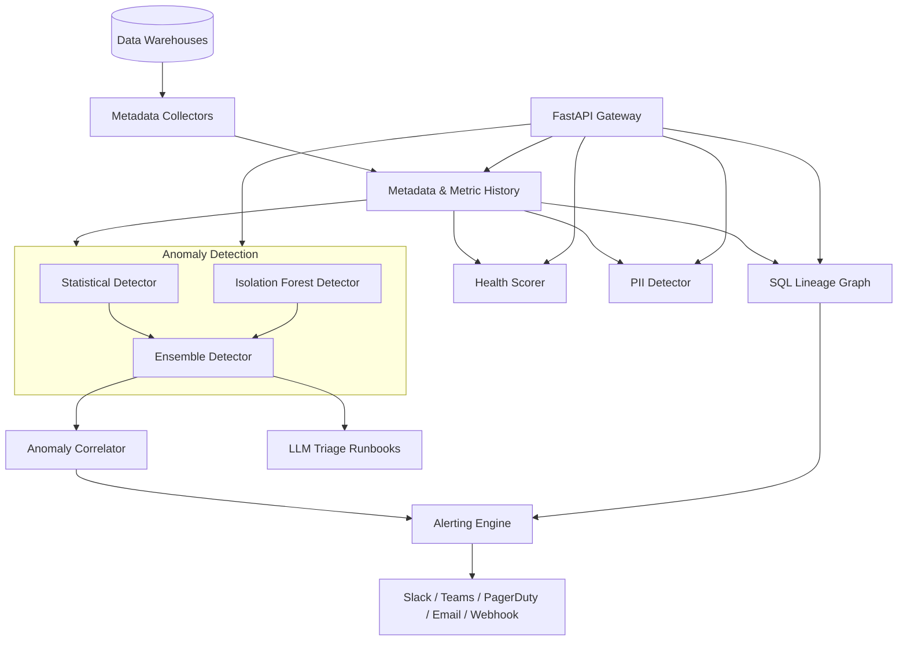

# Data Observability Platform

A Monte Carlo–style data observability platform — implemented from scratch in Python.
It collects table and column metadata from data warehouses, detects anomalies in
freshness, volume, schema, null rates, and distributions using both statistical and
ML-based methods, tracks column-level lineage by parsing SQL, scores data health, and
routes alerts to on-call channels with escalation and (optionally) LLM-generated triage
runbooks.

## Features

- **Multi-warehouse metadata collection** — adapters for Postgres, Snowflake, BigQuery,
  Redshift, and Databricks behind a common `MetadataCollector` interface, plus an
  `InMemoryCollector` for testing.
- **Anomaly detection** — freshness, volume, schema-drift, null-rate, and distribution
  monitors (`AnomalyDetector`), each emitting typed `Anomaly` records with severity.
- **ML-based detection** — an `EnsembleDetector` combining a `StatisticalDetector`
  (z-score / IQR) with an `IsolationForestDetector` (scikit-learn) over engineered
  feature vectors, with anomaly correlation into incident groups.
- **Column-level lineage** — a hand-written `SQLParser` / `LineageExtractor` builds a
  `LineageGraph` from query text for upstream/downstream impact analysis.
- **Health scoring** — `HealthScorer` / `HealthMonitor` roll per-table signals into a
  `DataHealthScore`.
- **PII detection** — `PIIDetector` scans column metadata and values, maintaining a
  `PIIRegistry` of findings.
- **Alerting** — pluggable channels (Slack, Teams, PagerDuty, Email, Webhook, Log) with
  `AlertRule` matching and `EscalationPolicy` support.
- **Forecasting** — `MetricForecaster` projects metric trends to anticipate anomalies.
- **Integrations** — Airflow, dbt, and Spark hooks plus auto-remediation actions
  (`remediate_freshness`, `remediate_volume_drop`).
- **LLM triage** — `LLMTriageEngine` generates runbooks via Anthropic or OpenAI (with a
  `MockLLMClient` default so the path runs without API keys).
- **REST API** — a FastAPI app exposing tables, anomalies, lineage, health, and PII.

## Architecture



| Component | Module | Responsibility |
|-----------|--------|----------------|
| Collectors | `collectors.py` | Pull table/column metadata from warehouses |
| Detector | `detector.py` | Freshness/volume/schema/null/distribution monitors |
| ML detector | `ml_detector.py` | Statistical + Isolation Forest ensemble, correlation |
| Lineage | `lineage.py`, `sql_parser.py` | Parse SQL into a column-level lineage graph |
| Health | `health.py` | Aggregate signals into a data health score |
| PII | `pii.py` | Detect and register PII in columns |
| Alerting | `alerting.py` | Rule matching, channels, escalation |
| Forecaster | `forecaster.py` | Project metric trends |
| Integrations | `integrations.py` | Airflow/dbt/Spark hooks, auto-remediation |
| LLM triage | `llm_triage.py` | Generate incident runbooks |
| API | `api.py` | FastAPI REST gateway |

## Quick Start

### Prerequisites

- Python 3.9+
- No live warehouse required — the test suite and examples run against the in-memory collector.

### Installation

```bash
conda activate dev
cd 06-real-world-projects/09-data-observability
pip install -e ".[dev]"
```

### Running the API

```bash
uvicorn observability.api:app --reload
```

The API serves interactive docs at http://localhost:8000/docs.

### Security & limits

The API ships with an opt-in hardening baseline (all stdlib, no extra deps). All three
are **off by default** so the quick-start and tests work with no configuration.

| Env var | Default | Effect |
|---------|---------|--------|
| `API_KEYS` | _unset_ | Comma-separated valid keys. When set, all routes require a key via `Authorization: Bearer <key>` or `X-API-Key: <key>` (401 otherwise). Unset ⇒ auth disabled. |
| `RATE_LIMIT_PER_MINUTE` | `120` | Per-minute request cap, keyed by API key (or client IP). `0` disables. Over-limit ⇒ 429 with `Retry-After`. |
| `REQUEST_TIMEOUT_SECONDS` | `30` | Per-request timeout. `0` disables. Exceeded ⇒ 504. |

`/health`, `/`, and the docs (`/docs`, `/redoc`, `/openapi.json`) stay open and exempt
from auth and rate limiting.

```bash
API_KEYS=my-secret-key uvicorn observability.api:app
curl -H "Authorization: Bearer my-secret-key" http://localhost:8000/tables
```

## Usage

### Detecting anomalies

```python
import asyncio
from observability import AnomalyDetector

detector = AnomalyDetector()

# Record observations over time
for rows in [1000, 1010, 990, 1005]:
    detector.record_volume("sales.orders", rows)

async def main():
    # A sudden drop is flagged as a volume anomaly
    anomaly = await detector.detect_volume_anomaly("sales.orders", row_count=200)
    if anomaly:
        print(anomaly.anomaly_type, anomaly.severity)

asyncio.run(main())
```

### ML ensemble detection

```python
from observability import EnsembleDetector

ensemble = EnsembleDetector()

# Feed historical samples, then train the Isolation Forest
for _ in range(60):
    ensemble.record_sample("sales.orders", {"row_count": 1000, "null_ratio": 0.01})
ensemble.train_ml_model(min_samples=50)
```

### Routing alerts

```python
from observability import AlertingEngine, SlackChannel, FRESHNESS_ALERT_RULE

engine = AlertingEngine()
engine.add_channel("slack", SlackChannel(webhook_url="https://hooks.slack.com/..."))
engine.add_rule(FRESHNESS_ALERT_RULE)
```

## What's Real vs Simulated

- **Real:** the anomaly monitors, the statistical and Isolation Forest detectors
  (scikit-learn), the SQL lineage parser and graph, health scoring, PII detection,
  alert-rule matching and escalation, forecasting, and the FastAPI gateway. The gateway
  ships with a real, opt-in hardening baseline — API-key auth, in-process rate limiting,
  and request timeouts (see [Security & limits](#security--limits)), all disabled by
  default. The `InMemoryCollector` backs the full test suite with no external
  dependencies.
- **Simulated / requires credentials:** the warehouse collectors (Snowflake, BigQuery,
  Redshift, Databricks, Postgres) are adapters written against each vendor's client
  library and need real connections and drivers to run against live data — they are not
  exercised by the tests. The Slack/Teams/PagerDuty/Email/Webhook channels require real
  endpoints to deliver. LLM triage defaults to `MockLLMClient`; the Anthropic/OpenAI
  clients need API keys.

## Testing

```bash
pytest tests/ -v
```

16 test modules cover collectors, the detectors, channels, alerting, lineage, health,
config, the API, and the security hardening. No warehouse or network access is required.

## Project Structure

```
src/observability/
  collectors.py     # Warehouse metadata collectors
  detector.py       # Rule-based anomaly monitors
  ml_detector.py    # Statistical + Isolation Forest ensemble
  lineage.py        # Lineage graph
  sql_parser.py     # SQL lineage extraction
  health.py         # Health scoring
  pii.py            # PII detection
  alerting.py       # Alert rules and channels
  forecaster.py     # Metric forecasting
  integrations.py   # Airflow / dbt / Spark hooks
  llm_triage.py     # LLM runbook generation
  api.py            # FastAPI gateway
tests/              # 15 test modules
docs/BLUEPRINT.md   # Full architecture and design
```

## License

MIT — see [LICENSE](../LICENSE)
