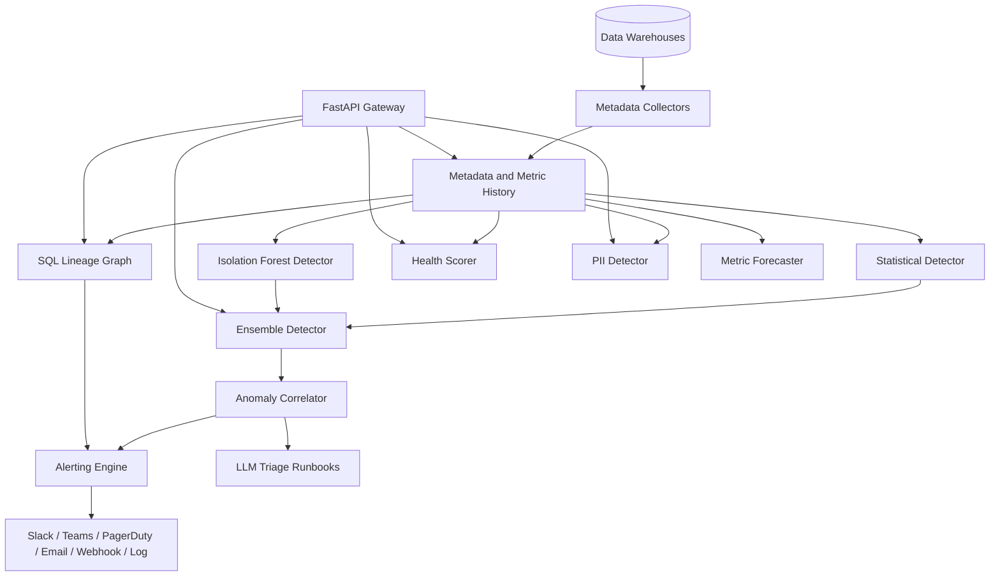

# Data Observability Platform

## Overview

This is a Monte Carlo–style data observability platform, implemented from scratch in
Python. It watches the tables in a data warehouse and answers the operational questions a
data team asks every day: is this table fresh, did its row count move, did its schema
change, are its null rates climbing, is its value distribution drifting, and — when
something breaks — what downstream tables, pipelines, and dashboards are affected.

The platform is organized around a metadata model (`TableMetadata`, `ColumnMetadata`,
`ColumnStats`) that every subsystem shares. Collectors pull that metadata from a warehouse;
the detectors keep a rolling history of metrics per table and flag deviations; a hand-built
SQL parser turns query text into a column-level lineage graph; a health scorer rolls the
signals into a single 0–100 score; a PII scanner classifies sensitive columns; and an
alerting engine matches anomalies against rules and routes them to channels with
escalation. A FastAPI gateway exposes the whole thing over REST.

The goals are to demonstrate:

- **Statistical and ML anomaly detection** — z-score, IQR, and modified-z-score methods
  alongside an Isolation Forest ensemble over engineered feature vectors.
- **Metadata graph construction** — a directed lineage graph with table- and column-level
  edges, transitive upstream/downstream traversal, and impact analysis.
- **SQL static analysis** — extracting sources, targets, and column mappings from
  `SELECT` / `INSERT` / `CREATE TABLE AS` / `MERGE` / `UPDATE` statements.
- **Operational alerting** — rule matching, deduplication, multi-channel routing, and
  time-based escalation.

The concepts this project is built to teach run through every component: the difference
between a hard threshold and a robust statistical estimator (and why the latter matters once
a metric history contains a past incident); how an anomaly detector earns trust by staying
silent until it has a baseline; how a lineage graph turns "this table broke" into "here is
everything downstream that broke with it"; and how an alerting layer avoids both
under-paging (missing a real incident) and over-paging (firing the same alert repeatedly or
once per affected table). The codebase favors small, explicit algorithms — z-scores, IQR
fences, median/MAD, additive seasonal decomposition, breadth-first graph traversal — over
heavyweight frameworks, so the mechanics are visible rather than hidden behind a library.

Scope is deliberately in-process: the default `InMemoryCollector` and `LogChannel` let the
entire pipeline — collection, detection, lineage, health, PII, alerting — run and be tested
with no external services. The warehouse collectors and network channels are real adapters
written against vendor client libraries but require credentials to exercise against live
systems.

## Architecture



| Component | Module | Responsibility |
|-----------|--------|----------------|
| Collectors | `collectors.py` | Pull table/column metadata and stats from warehouses |
| Rule detector | `detector.py` | Freshness/volume/schema/null/distribution monitors |
| ML detector | `ml_detector.py` | Statistical + Isolation Forest ensemble and correlation |
| Lineage graph | `lineage.py` | Directed table/column graph, traversal, impact analysis |
| SQL parser | `sql_parser.py` | Extract sources, targets, and column mappings from SQL |
| Health | `health.py` | Roll signals into a 0–100 `DataHealthScore` |
| PII | `pii.py` | Name- and value-based PII classification |
| Alerting | `alerting.py` | Rule matching, dedup, routing, escalation, channels |
| Forecaster | `forecaster.py` | Trend/seasonal decomposition for proactive alerts |
| Integrations | `integrations.py` | Airflow/dbt/Spark hooks and auto-remediation |
| LLM triage | `llm_triage.py` | Generate incident triage and runbooks |
| API | `api.py` | FastAPI REST gateway |

The platform is a set of cooperating components rather than a layered monolith, and they
communicate through the shared dataclasses in `models.py`:

- **Collection layer** (`collectors.py`) — abstract `MetadataCollector` with concrete
  warehouse adapters and an in-memory implementation. Produces `TableMetadata` and
  `ColumnStats`.
- **Detection layer** (`detector.py`, `ml_detector.py`) — keeps rolling per-table metric
  history and emits typed `Anomaly` records. Two implementations: a rule-based
  `AnomalyDetector` and an `EnsembleDetector` that combines statistical methods with an
  Isolation Forest.
- **Lineage layer** (`lineage.py`, `sql_parser.py`) — a `LineageGraph` built either by
  hand or from parsed SQL, supporting transitive traversal and impact analysis.
- **Scoring and classification** (`health.py`, `pii.py`) — aggregate signals into a
  `DataHealthScore` and classify columns as PII.
- **Alerting and triage** (`alerting.py`, `llm_triage.py`) — rule matching, routing,
  escalation, and optional LLM-generated runbooks.
- **Forecasting** (`forecaster.py`) — projects metric trends to anticipate anomalies.
- **Integrations** (`integrations.py`) — Airflow/dbt/Spark hooks and auto-remediation.
- **Gateway** (`api.py`) — a FastAPI app wiring the components behind REST endpoints.

The end-to-end flow for a single monitoring sweep ties these together:

1. A `MetadataCollector` returns the table's current `TableMetadata` and a
   `{column -> ColumnStats}` map.
2. The detector compares those values against its rolling history and emits zero or more
   typed `Anomaly` records, then records the new observations for next time.
3. The `AnomalyCorrelator` folds the new anomalies into incident groups using the lineage
   graph, so related failures collapse into one incident.
4. The `HealthScorer` recomputes the table's `DataHealthScore` from the same metadata,
   stats, and recent anomalies.
5. Each anomaly flows into the `AlertingEngine`, which deduplicates, matches rules, routes
   to channels, and optionally schedules escalation.
6. For high-severity incidents, the `LLMTriageEngine` generates a triage summary and
   runbook from the anomaly and its context.

The same components are reachable individually through the FastAPI gateway, which is how the
API tests drive them without an event loop of their own.

## Core Components

### Metadata Collectors

`MetadataCollector` (`collectors.py`) is an abstract base with four coroutine methods:

```python
class MetadataCollector(ABC):
    @abstractmethod
    async def collect_schema(self, table_ref: str) -> TableMetadata: ...
    @abstractmethod
    async def collect_stats(self, table_ref: str) -> Dict[str, ColumnStats]: ...
    @abstractmethod
    async def collect_lineage(self, table_ref: str) -> LineageInfo: ...
    @abstractmethod
    async def get_column_sample(self, table_ref: str, column: str, size: int) -> List[Any]: ...
```

`InMemoryCollector` is the reference implementation used by the tests. Tables and samples
are registered up front with `add_table(...)` and `add_sample(...)`, and the four collect
methods serve them back. Because the interface is fully async, the in-memory path exercises
the same coroutine call sites as the warehouse adapters.

`GenericSQLCollector` implements the shared SQL-profiling logic: it opens a connection,
queries the `information_schema` for columns, and builds a per-column profiling query to
populate `ColumnStats`. The profiling query branches on whether the column is numeric — for
numeric types it computes `AVG` and `STDDEV` alongside the universal counts, and for
non-numeric types it leaves `mean`/`stddev` null:

```python
async def _profile_column(self, table_ref, column_name, data_type):
    is_numeric = data_type.lower() in (
        "integer", "int", "bigint", "smallint",
        "numeric", "decimal", "float", "double", "real", "number",
    )
    # SELECT COUNT(*), SUM(CASE WHEN col IS NULL ...), COUNT(DISTINCT col),
    #        MIN(col), MAX(col) [, AVG(col), STDDEV(col) if numeric] FROM table_ref
    row = (await self._execute(query))[0]
    total, null_count = row["total_count"], row["null_count"]
    return ColumnStats(
        null_count=null_count,
        null_ratio=null_count / total if total > 0 else 0,
        distinct_count=row["distinct_count"],
        min_value=row.get("min_value"), max_value=row.get("max_value"),
        mean=float(row["mean"]) if row.get("mean") else None,
        stddev=float(row["stddev"]) if row.get("stddev") else None,
    )
```

`collect_stats` calls `_profile_column` for every column returned by `collect_schema`, and
`get_column_sample` issues a `SELECT … WHERE col IS NOT NULL LIMIT n` for the PII scanner.
The vendor adapters — `SnowflakeCollector`, `BigQueryCollector`, `PostgresCollector`,
`RedshiftCollector`, `DatabricksCollector` — subclass `GenericSQLCollector` and override
`connect()` and `_execute_with_connection()` to use the appropriate driver and dialect; the
`information_schema` query in `collect_schema` is overridden where a warehouse exposes
metadata differently. `create_collector(...)` is a factory that dispatches on
`warehouse_type` so callers can configure a warehouse purely from a `WarehouseConfig`
without importing the concrete class. This is the seam between the tested in-process path
and the credential-gated live path: every subsystem above the collector is written against
the abstract interface and the `InMemoryCollector`, so swapping in a real warehouse changes
nothing downstream.

### Anomaly Detection — Rule-Based

`AnomalyDetector` (`detector.py`) maintains rolling history dictionaries keyed by table
(and column, where relevant), capped at the last 100 points. Each `record_*` method appends
and trims; each `detect_*` coroutine reads the history and returns an `Optional[Anomaly]`.

- **Volume** — computes mean and standard deviation of the row-count history and a z-score
  for the current count. When `std == 0` it substitutes an effective standard deviation of
  `mean / volume_threshold` so that a flat history still flags a large jump. Severity is
  `critical` above a z-score of 5, otherwise `warning`.
- **Freshness** — takes the first difference of the update-timestamp history to get typical
  intervals, then flags when the current interval exceeds `mean + 3·std`. Severity is
  `critical` when the table is more than 24 hours overdue.
- **Schema** — diffs the previous and current `TableMetadata` via `_diff_schemas`,
  producing `SchemaChange` records for added, removed, and type-changed columns. Removals
  and type changes are `critical`; additions are `warning`.
- **Null rate** — z-score against the column's null-ratio history, with the same
  effective-std floor as volume. A null ratio at or above 0.5 is `critical`.
- **Distribution** — accumulates a multi-dimensional anomaly score from the z-scores of
  null ratio, distinct count, and mean (where numeric), flagging when the total exceeds 3.

`detect_all_anomalies` runs every check for a table, then records the new observations so
the next call sees them.

The volume check is the canonical example of the design. The effective-standard-deviation
floor is what makes a flat history usable: a table that has reported exactly 1000 rows ten
times in a row has `std == 0`, and a naive z-score would divide by zero or never fire.
Substituting `mean / volume_threshold` as the effective std means a 3× threshold flags any
count that moves by more than the mean itself, so a drop to 200 rows is caught even with no
historical variance:

```python
async def detect_volume_anomaly(self, table_id, current_count):
    history = self._volume_history.get(table_id, [])
    if len(history) < self.config.min_history_points:
        return None
    mean = float(np.mean(history))
    std = float(np.std(history))
    min_tolerance = mean if mean > 0 else 1
    effective_std = max(std, min_tolerance / self.config.volume_threshold) if std == 0 else std
    z_score = (current_count - mean) / effective_std
    if abs(z_score) > self.config.volume_threshold:
        severity = "critical" if abs(z_score) > 5 else "warning"
        return Anomaly(..., anomaly_type=AnomalyType.VOLUME, severity=severity,
                       expected_range=(mean - 3 * std, mean + 3 * std), ...)
    return None
```

Freshness detection works on *intervals* rather than absolute timestamps: it takes
`np.diff` of the recorded update times to recover the table's natural cadence, so a table
that updates hourly and one that updates daily are each judged against their own rhythm
rather than a fixed staleness limit. Schema detection is a set diff over column names and
types, classified into added / removed / type-changed, with removals and type changes
treated as breaking. Every returned `Anomaly` carries a `context` dictionary with the
supporting numbers (z-score, historical mean and std, the diff, the last ten history
points) so a downstream consumer — or the LLM triage engine — has the evidence behind the
verdict.

### Anomaly Detection — ML Ensemble

`ml_detector.py` adds an Isolation Forest path that runs alongside the statistical methods.

`IsolationForestDetector` wraps scikit-learn's `IsolationForest`. Training samples are
`FeatureVector` objects buffered in memory; `fit(min_samples=30)` scales the features with
`StandardScaler` and fits the forest. `predict` returns a `DetectionResult` with an
`is_anomaly` flag, a normalized `anomaly_score`, per-feature contributions (the scaled
deviation from the mean, used as a SHAP-free proxy), and a confidence derived from the
distance to the decision boundary. sklearn is an optional dependency — the class raises a
clear `ImportError` if it is missing.

`EnsembleDetector.extract_features` turns a table's metadata and column stats into a fixed
feature vector: row count, byte size, column count, and aggregate null-ratio and
cardinality statistics. `detect_anomalies` always runs the `StatisticalDetector` (IQR for
volume, modified-z-score for null rates — both robust to outliers) and, when the forest has
been fitted and confidence exceeds 0.6, adds an ML-detected distribution anomaly naming the
top contributing features.

The statistical detector deliberately uses estimators that are robust to outliers in the
history, because a metric series that already contains a past incident would poison a
mean/std model. Volume uses Tukey's IQR fences (`Q1 − 1.5·IQR`, `Q3 + 1.5·IQR`); null rates
use the modified z-score built on the median and median absolute deviation
(`0.6745·(x − median)/MAD`), with a percentage-change fallback when MAD is zero. The
modified z-score's 3.5 cutoff is the conventional threshold from Iglewicz and Hoaglin.

`AnomalyCorrelator` keeps a sliding window of recent anomalies (30 minutes by default) and
groups them into candidate incidents. `find_correlated` links two anomalies when they share
a table, sit in an upstream/downstream relationship in the lineage graph, or are the same
type within a five-minute window; `get_incident_groups` performs a simple single-pass
clustering over the window so that a fan-out failure — one upstream table breaking and
taking ten downstream tables with it — surfaces as one incident with eleven members rather
than eleven separate pages.

### Lineage Graph and SQL Parser

`LineageGraph` (`lineage.py`) is an in-memory directed graph of tables connected by
`LineageEdge` objects that carry an optional transformation label and column mappings.
`add_table`, `add_lineage`/`add_edge`, and the removal methods mutate the graph;
`get_upstream`/`get_downstream` return immediate neighbors while `get_all_upstream`/
`get_all_downstream` traverse transitively up to a depth bound. `get_impact_analysis`
returns an `ImpactAnalysis` summarizing everything reachable downstream, `trace_column` and
`get_column_lineage` follow column-level mappings, and `to_dict` serializes the graph.

Both the immediate (`get_upstream`/`get_downstream`) and transitive
(`get_all_upstream`/`get_all_downstream`) traversals are breadth-first walks over the node
adjacency sets with a `visited` guard, so cycles in the graph terminate cleanly and each
table appears at most once in the result. `get_impact_analysis` reuses the transitive
downstream walk and attaches whatever `TableMetadata` is known for each affected node, which
is what makes "if I break this table, what else breaks" a single call.

`sql_parser.py` builds the lineage edges from query text. `SQLParser.parse` prefers
`sqlglot` (parsing into an expression tree and walking `exp.Table`, `exp.Select`,
`exp.Insert`, etc.) and falls back to a regex extractor when sqlglot is unavailable or a
statement fails to parse. It classifies the statement (`SELECT`, `INSERT`,
`CREATE TABLE AS`, `MERGE`, `UPDATE`), extracts source and target `TableReference`s, and
derives column mappings from `SELECT` aliases and `INSERT` column lists. The
sqlglot/regex split is the honest part of the design: with sqlglot present, the parser
understands aliases, qualified names, and column provenance; without it, the regex path
recovers table names from `FROM`/`JOIN`/`INTO` clauses but cannot resolve column mappings.
`LineageExtractor` runs the parser over a whole workload of queries:
`build_dependency_graph` returns a `target -> {sources}` map, and `get_table_dependencies`
answers upstream/downstream questions for one table by checking whether it appears as a
source or a target across the workload.

### Health Scoring

`HealthScorer` (`health.py`) computes four sub-scores — freshness, volume, schema, and
quality — each on a 0–100 scale, then combines them with fixed weights into an overall
`DataHealthScore`:

```python
weights = {"freshness": 0.25, "volume": 0.25, "schema": 0.20, "quality": 0.30}
overall = (freshness * 0.25) + (volume * 0.25) + (schema * 0.20) + (quality * 0.30)
```

Each sub-score is a piecewise-linear decay rather than a hard threshold, which keeps the
overall number continuous and interpretable:

- **Freshness** is 100 while the table is within its expected interval, decays linearly to
  50 over the second interval, then decays severely toward 0 beyond 2× the interval.
- **Volume** is 100 while the row count is within `volume_variance_threshold` (default 20%)
  of the historical mean, then decays in two bands as variance grows. With fewer than three
  history points it returns 100 — absence of evidence is treated as healthy, not unhealthy.
- **Schema** starts at 100 and subtracts a per-anomaly penalty (30 for critical, 15 for
  warning) for recent schema anomalies.
- **Quality** starts at 100 and subtracts penalties for columns whose null ratio exceeds
  `quality_null_threshold` (default 10%) plus penalties for recent null-rate and
  distribution anomalies.

Every sub-score appends a human-readable `factor` dict ("Last updated 30.2 hours ago",
"3 column(s) with high null rates") to the score's `factors` list, so the resulting
`DataHealthScore` explains *why* it is what it is rather than just reporting a number.
`HealthMonitor` records scores over time (capped at 100 per table), fits a linear trend with
`np.polyfit` to label the direction improving/declining/stable, lists degraded tables below
a threshold, and produces a fleet-wide healthy/warning/critical summary.

### PII Detection

`PIIDetector` (`pii.py`) classifies columns through two independent signals and combines
their confidences. The first is **column-name suspicion**: the name is matched against a
curated token list (`ssn`, `email`, `phone`, `credit_card`, `dob`, `bank_account`,
`passport`, `drivers_license`, …) and mapped to a `PIIType`. The second is **value-pattern
matching**: anchored regexes classify a sampled value as `EMAIL`, `PHONE`, `SSN`,
`CREDIT_CARD`, `IP_ADDRESS`, `ZIP_CODE`, or `DATE_OF_BIRTH`, and a column is flagged only
when the match ratio across the sample crosses a threshold — so a single coincidental match
does not label a column as PII. `detect` uses looser unanchored patterns for finding PII
inside free text, while `scan_column`/`scan_table` use the anchored patterns for
column-level classification. The two signals are deliberately complementary: a column named
`x17` full of `123-45-6789` values is caught by the data pattern even with a meaningless
name, and a sparsely populated `ssn` column is caught by the name even when few values
match. `mask` redacts detected values, `get_recommendations` suggests remediations
(encryption, access controls), and `column_name_suspicion` exposes the name signal as a
0–1 score. A `PIIRegistry` stores detections, surfaces high-risk tables above a confidence
threshold, and summarizes coverage across the warehouse.

### Alerting Engine

`AlertingEngine` (`alerting.py`) holds registered channels and rules. `process_anomaly`
deduplicates within a configurable window, finds every matching `AlertRule`, builds an
`Alert`, fans it out to the union of the matched rules' channels (or the default channels
when nothing matches), stores it, and schedules an escalation timer for any rule with an
`EscalationPolicy`. Alerts can be acknowledged and resolved, and queried by status or table.

The routing logic fans out to the *union* of every matched rule's channels, which is what
lets one anomaly notify both Slack and PagerDuty without duplicate alerts:

```python
async def process_anomaly(self, anomaly):
    dedup_key = f"{anomaly.table_id}:{anomaly.anomaly_type.value}:{anomaly.anomaly_id}"
    if self._within_dedup_window(dedup_key):
        return self._existing_alert_for(anomaly)
    matching_rules = [r for r in self.rules if r.matches(anomaly)]
    alert = Alert(alert_id=generate_id(), anomaly=anomaly, created_at=datetime.now())
    channels = set()
    for rule in matching_rules:
        channels.update(rule.get_channels(anomaly))
    if not matching_rules:
        channels.update(self.default_channels)
    for name in channels:
        if name in self.channels:
            await self.channels[name].send(alert)
    self._store(alert, dedup_key)
    for rule in matching_rules:
        if rule.escalation_policy:
            asyncio.create_task(self._escalation_timer(alert, rule.escalation_policy))
    return alert
```

Escalation is a fire-and-forget asyncio task that sleeps for the policy's
`escalate_after_minutes` and then re-checks the alert's status; if it is still `active`, it
fans out to the escalation channels with `escalated=True`. `AlertRule.matches` filters on
anomaly type, severity, and table-name patterns, so a rule can target, say, only critical
freshness anomalies on `prod.*` tables.

`AlertChannel` is an abstract base with six implementations. `LogChannel` records alerts
in memory for testing; `SlackChannel`, `TeamsChannel`, `PagerDutyChannel`, `EmailChannel`,
and `WebhookChannel` build the appropriate payload (Slack Block Kit, Teams MessageCard,
PagerDuty Events API, an email body, or an HMAC-signed JSON webhook) and, in this build,
log the payload they *would* send rather than performing live network I/O — the channel
objects also retain the constructed payloads in memory so the tests can assert on them.
Three ready-made rules ship with the module: `CRITICAL_ALERT_RULE` (Slack + PagerDuty with
15-minute escalation), `SCHEMA_CHANGE_RULE`, and `FRESHNESS_ALERT_RULE`.

### Forecasting, Integrations, and LLM Triage

`MetricForecaster` (`forecaster.py`) records metric series and projects them forward with a
classical additive decomposition rather than an external forecasting library. The trend
component is a centered moving average (`np.convolve`) over a window of the seasonality
period; the seasonal component reshapes the series into complete periods and averages each
position to recover the repeating pattern; and the residual standard deviation measures how
far the reconstructed `trend·w_t + seasonal·w_s` signal sits from the observed values. Each
forecast point combines the extrapolated trend, the seasonal index for that future slot, and
a persistence term, and widens its 95% confidence band as `1.96·σ·√i` so uncertainty grows
the further out the projection runs:

```python
predicted = trend_value * trend_weight + seasonal_value * seasonal_weight
predicted += values[-1] * (1 - trend_weight - seasonal_weight)
lower = predicted - 1.96 * residual_std * np.sqrt(i)
upper = predicted + 1.96 * residual_std * np.sqrt(i)
```

`forecast` returns `None` until it has at least two full seasonal periods of history, so it
never extrapolates from too little data. `AnomalyForecaster` uses those bounds to anticipate
anomalies: if the current value already sits outside the projected band, it raises a
forward-looking warning before the metric crosses a hard threshold.

`integrations.py` wires the platform into the orchestration layer. `AirflowIntegration`
produces callables that fit Airflow's hook points: `create_lineage_callback` records a
source→target edge as a task runs, `create_quality_check` raises (failing the task) when a
critical anomaly is present, and `create_freshness_sensor_check` returns a poke function a
sensor can wait on. `DbtIntegration.process_manifest` reads a dbt `manifest.json` and
registers the models and their `ref()`/`source()` dependencies as lineage edges, so lineage
can be bootstrapped from an existing dbt project without parsing SQL. `SparkIntegration`
provides the analogous hooks for Spark jobs. All three talk to an `ObservabilityClient`
facade. `AutoRemediation` ties detection back to action: `remediate_freshness` and
`remediate_volume_drop` are remediation handlers that return a `RemediationResult`
describing what they would do (re-trigger a pipeline, page an owner), so the loop from
"anomaly detected" to "action taken" is closed in code even though the concrete actions are
no-ops in this build.

`llm_triage.py` defines an `LLMTriageEngine` that generates incident triage and runbooks
through a pluggable `LLMClient` Protocol. The engine builds a structured prompt from the
anomaly and its context (`_build_context` pulls in the table, the metric values, the
expected range, and any correlated anomalies), asks the client for JSON, and parses the
response into a `TriageResult` (root-cause analysis, probable causes, recommended actions,
severity assessment, estimated impact, and a confidence score) or a `GeneratedRunbook` (an
ordered list of `RunbookStep`s with expected outcomes and rollback actions). Results are
cached by a key derived from the anomaly and context, with a validity window, so repeated
triage of the same incident does not re-spend tokens.

The pluggable client is what keeps the path testable. `MockLLMClient` is the default and
returns deterministic JSON keyed on the prompt ("root cause" vs "runbook"), with a small
simulated latency, so the full triage and runbook flow — prompt construction, JSON parsing,
caching, report formatting — runs in the test suite with no API keys. `AnthropicClient` and
`OpenAIClient` are real adapters that satisfy the same Protocol and are selected by
`TriageConfig.provider`; they only activate when credentials are supplied.
`TriageReportGenerator` renders a `TriageResult` and `GeneratedRunbook` into a
human-readable Markdown report for an on-call engineer.

## Data Structures

The shared model layer (`models.py`) is a set of plain dataclasses:

```python
class AnomalyType(Enum):
    VOLUME = "volume"
    FRESHNESS = "freshness"
    SCHEMA = "schema"
    DISTRIBUTION = "distribution"
    NULL_RATE = "null_rate"
    UNIQUENESS = "uniqueness"
    CUSTOM = "custom"


@dataclass
class ColumnStats:
    null_count: int
    null_ratio: float
    distinct_count: int
    min_value: Any = None
    max_value: Any = None
    mean: Optional[float] = None
    stddev: Optional[float] = None
    histogram: Optional[List[int]] = None


@dataclass
class ColumnMetadata:
    name: str
    data_type: str
    nullable: bool
    description: Optional[str] = None
    stats: Optional[ColumnStats] = None


@dataclass
class TableMetadata:
    table_id: str
    database: str
    schema: str
    table_name: str
    columns: List[ColumnMetadata]
    row_count: int
    size_bytes: int
    last_modified: datetime
    partitions: List[str] = field(default_factory=list)
    owner: str = ""
    tags: Dict[str, str] = field(default_factory=dict)


@dataclass
class Anomaly:
    anomaly_id: str
    table_id: str
    column_name: Optional[str]
    anomaly_type: AnomalyType
    severity: str  # critical, warning, info
    detected_at: datetime
    metric_value: float
    expected_range: Tuple[float, float]
    description: str
    context: Dict[str, Any] = field(default_factory=dict)
```

The remaining models follow the same pattern. `Alert` wraps an `Anomaly` with lifecycle
fields; `DataHealthScore` carries the four sub-scores plus an overall score and contributing
factors; `LineageInfo` and `ImpactAnalysis` describe graph relationships:

```python
@dataclass
class Alert:
    alert_id: str
    anomaly: Anomaly
    created_at: datetime
    status: str = "active"               # active, acknowledged, resolved
    acknowledged_by: Optional[str] = None
    acknowledged_at: Optional[datetime] = None
    resolved_at: Optional[datetime] = None
    resolution_notes: Optional[str] = None


@dataclass
class DataHealthScore:
    table_id: str
    overall_score: float                 # 0-100
    freshness_score: float
    volume_score: float
    schema_score: float
    quality_score: float
    calculated_at: datetime
    factors: List[dict] = field(default_factory=list)


@dataclass
class SchemaChange:
    change_type: str                     # column_added, column_removed, type_changed
    column_name: str
    old_value: Optional[str] = None
    new_value: Optional[str] = None
```

`Pipeline`, `MetricHistory`, and the lineage `LineageEdge`/`LineageNode` types round out the
warehouse and graph model. Choosing plain dataclasses over an ORM or Pydantic for the core
model is deliberate: the model layer has no I/O and no validation framework dependency, so
every subsystem can construct and pattern-match these objects freely, and the API layer is
the only place Pydantic appears — at the boundary, where request/response validation
actually belongs.

The ML layer adds two dataclasses:

```python
@dataclass
class FeatureVector:
    table_id: str
    features: np.ndarray
    feature_names: List[str]
    timestamp: datetime = field(default_factory=datetime.now)


@dataclass
class DetectionResult:
    is_anomaly: bool
    anomaly_score: float          # higher = more anomalous
    feature_contributions: Dict[str, float]
    confidence: float
```

Configuration (`config.py`) is a tree of dataclasses with sensible defaults:

```python
@dataclass
class DetectorConfig:
    min_history_points: int = 10
    volume_threshold: float = 3.0
    freshness_threshold_hours: float = 24.0
    null_rate_threshold: float = 3.0
    distribution_contamination: float = 0.1


@dataclass
class ObservabilityConfig:
    detector: DetectorConfig = field(default_factory=DetectorConfig)
    collector: CollectorConfig = field(default_factory=CollectorConfig)
    storage: StorageConfig = field(default_factory=StorageConfig)
    alerts: AlertConfig = field(default_factory=AlertConfig)
    warehouses: Dict[str, WarehouseConfig] = field(default_factory=dict)
```

## API Design

### Public Python API

The package re-exports its public surface from `observability/__init__.py`. The detector,
ensemble, lineage, alerting, health, PII, forecasting, and triage classes are all importable
directly:

```python
from observability import (
    AnomalyDetector, EnsembleDetector, AnomalyCorrelator,
    LineageGraph, SQLParser, LineageExtractor, extract_lineage, extract_tables,
    HealthScorer, HealthMonitor, PIIDetector, PIIRegistry,
    AlertingEngine, AlertRule, EscalationPolicy,
    SlackChannel, TeamsChannel, PagerDutyChannel, EmailChannel, WebhookChannel, LogChannel,
    MetricForecaster, AnomalyForecaster,
    LLMTriageEngine, MockLLMClient,
    InMemoryCollector, create_collector,
)
```

Detector and alerting calls are coroutines:

```python
detector = AnomalyDetector(DetectorConfig())
for rows in (1000, 1010, 990, 1005, 1002, 998, 1001, 1003, 999, 1000, 1004):
    detector.record_volume("sales.orders", rows)
anomaly = await detector.detect_volume_anomaly("sales.orders", current_count=200)

engine = AlertingEngine(default_channels=["log"])
engine.add_channel("log", LogChannel())
engine.add_rule(FRESHNESS_ALERT_RULE)
alert = await engine.process_anomaly(anomaly)
```

### REST API

`api.py` builds a FastAPI app (`app`, plus a `create_app()` factory) exposing:

```
GET  /health
GET  /tables                              list registered tables (filter by database/search)
POST /tables                              register a table
GET  /tables/{table_id}                   table detail
GET  /tables/{table_id}/lineage           upstream/downstream lineage
POST /tables/{table_id}/lineage           add an upstream edge
GET  /tables/{table_id}/health            health score
GET  /tables/{table_id}/anomalies         anomalies for a table
POST /tables/{table_id}/detect            run detection for a table
GET  /tables/{table_id}/pii               PII scan results
GET  /anomalies                           list anomalies (filter by status/severity)
GET  /anomalies/{anomaly_id}              anomaly detail
POST /anomalies/{anomaly_id}/acknowledge  acknowledge an anomaly
GET  /impact/{table_id}                   downstream impact analysis
```

Requests and responses use Pydantic models (`RegisterTableRequest`, `LineageResponse`,
`HealthResponse`, `AnomalyListResponse`, `PIIScanResponse`, `AcknowledgeRequest`, …) so the
gateway validates input and emits a typed schema. `POST /tables/{id}/detect` runs the
detector for a table on demand and returns the anomalies it produced;
`GET /tables/{id}/lineage` and `GET /impact/{id}` expose the lineage graph and downstream
impact; `GET /tables/{id}/pii` runs the PII scanner. List endpoints accept filters
(`status`, `severity`, `database`, `search`) and the acknowledge endpoint mutates an
anomaly's lifecycle. The app is constructed once as a module-level `app` and also via a
`create_app()` factory so tests can spin up isolated instances; interactive docs are served
at `/docs`. Because the gateway holds the same in-process collector, detector, lineage
graph, and alerting engine the library exposes, the REST surface and the Python API are two
views of one running platform rather than separate code paths.

## Performance

The platform is built for the operational scale of a metadata catalog, not for streaming
throughput, and the design choices reflect that:

- **Bounded history.** Every detector caps its per-table (and per-column) history at the
  last 100 points and the ML feature buffer at the last 1000 samples per table, so memory
  is O(tables × columns) and bounded regardless of how long the platform runs.
- **Cheap statistical detection.** Volume, freshness, null-rate, and distribution checks
  are O(history) NumPy reductions — a handful of microseconds per check — so the rule-based
  path scales to thousands of tables without an ML model.
- **Robust estimators.** The statistical detector uses IQR for volume and the modified
  z-score (median/MAD) for null rates, which tolerate outliers in the history far better
  than mean/std and reduce false positives on noisy metrics.
- **Optional ML.** The Isolation Forest is an optional, fitted-on-demand component
  (`n_jobs=-1` for parallel trees); when sklearn is absent or the model is unfitted, the
  platform degrades gracefully to the statistical path.
- **Async I/O.** Collectors and channels are coroutines, so warehouse profiling and alert
  fan-out can overlap when wired into an event loop.

No throughput or latency benchmarks are published for this build; the numbers above are
complexity characteristics, not measured results.

A few design decisions are worth calling out as deliberate performance/robustness
tradeoffs:

- **Robust over efficient estimators.** The statistical detector spends extra work on IQR
  and median/MAD instead of plain mean/std. On a 100-point history this costs a sort and a
  median rather than a single pass, which is negligible, and in exchange the detector does
  not get fooled by a prior incident still sitting in its window.
- **Fitted-on-demand ML.** The Isolation Forest is not retrained on every call. Samples are
  buffered as features are extracted, and `train_ml_model` is an explicit step, so the
  expensive `fit` happens on the operator's schedule while the cheap `predict` runs inline.
  Because the forest is optional, the platform's worst-case latency is the statistical path,
  not a model fit.
- **In-memory everything.** History, the lineage graph, the alert store, and the dedup
  window all live in process dictionaries. This bounds the deployment to a single process
  and to whatever fits in memory, but it removes a database from the hot path and makes the
  whole pipeline deterministic and trivially testable. The `StorageConfig.backend` field is
  the seam where a persistent backend would attach.
- **Async fan-out.** Channel sends and warehouse profiling are coroutines, so an anomaly
  that routes to five channels issues five sends concurrently rather than serially, and a
  detection sweep across many tables can overlap I/O when driven from an event loop.

## Testing Strategy

Tests live in `tests/` (15 modules, ~300 test functions) and run entirely in-process with
no warehouse or network access — the `InMemoryCollector` and `LogChannel` stand in for
external systems.

- **Models** (`test_models.py`) — construction and defaults for every dataclass.
- **Collectors** (`test_collectors.py`) — the in-memory collector and the shared profiling
  logic, including the factory.
- **Detectors** (`test_detector.py`, `test_ml_detector.py`) — each anomaly type against
  hand-built histories: normal values produce no anomaly, injected drops/spikes/drift do,
  and severity thresholds are checked. The ML module covers feature extraction, fit/predict,
  the statistical detector's IQR and modified-z-score paths, and the correlator's incident
  grouping.
- **Lineage and SQL** (`test_lineage.py`, `test_sql_parser.py`) — graph mutation and
  transitive traversal, plus parsing of `SELECT`/`INSERT`/`CREATE TABLE AS`/`MERGE` and the
  regex fallback.
- **Health and PII** (`test_health.py`, `test_pii.py`) — sub-score and overall-score math,
  trend and degradation reporting, and name/value PII classification with masking.
- **Alerting and channels** (`test_alerting.py`, `test_channels.py`) — rule matching,
  deduplication, routing to the union of matched channels, escalation, acknowledge/resolve,
  and each channel's payload construction.
- **Triage** (`test_llm_triage.py`) — the `MockLLMClient` triage and runbook paths and
  caching, with no API keys.
- **Config and API** (`test_config.py`, `test_api.py`) — config defaults and overrides and
  the FastAPI endpoints via the test client.

Async tests use `pytest-asyncio`; statistical assertions feed the detectors enough history
to clear `min_history_points` and then assert on the presence, type, and severity of the
returned `Anomaly`.

The edge cases that the design has to get right, and that the suite targets explicitly:

- **Insufficient history.** Every detector returns `None` when it has fewer than
  `min_history_points` observations, so a freshly registered table never produces false
  anomalies before it has a baseline.
- **Zero-variance history.** The effective-std floor in volume and null-rate detection is
  tested directly with a flat history plus an injected jump, confirming the anomaly fires
  rather than dividing by zero.
- **Missing sklearn.** `IsolationForestDetector` raises a clear `ImportError`, and
  `EnsembleDetector` falls back to the statistical path, so the suite passes whether or not
  the optional ML dependency is installed.
- **Unparseable SQL.** The parser's sqlglot path catches exceptions and falls back to the
  regex extractor, and the regex path is tested on its own so lineage degrades rather than
  crashes on dialect quirks.
- **Cyclic lineage.** The BFS traversals are exercised against graphs with cycles to
  confirm they terminate and de-duplicate.
- **Alert deduplication and escalation.** The alerting tests assert that a repeated anomaly
  inside the dedup window does not re-page, and that an unacknowledged critical alert fires
  its escalation channel.

## References

- [Monte Carlo Data](https://www.montecarlodata.com/) — data observability product this is
  modeled on.
- [Great Expectations](https://greatexpectations.io/) — data quality expectations.
- [OpenLineage](https://openlineage.io/) — lineage metadata standard.
- [scikit-learn Isolation Forest](https://scikit-learn.org/stable/modules/generated/sklearn.ensemble.IsolationForest.html)
- [sqlglot](https://github.com/tobymao/sqlglot) — the SQL parser used for lineage
  extraction.
- F. T. Liu, K. M. Ting, Z.-H. Zhou, "Isolation Forest," ICDM 2008.
