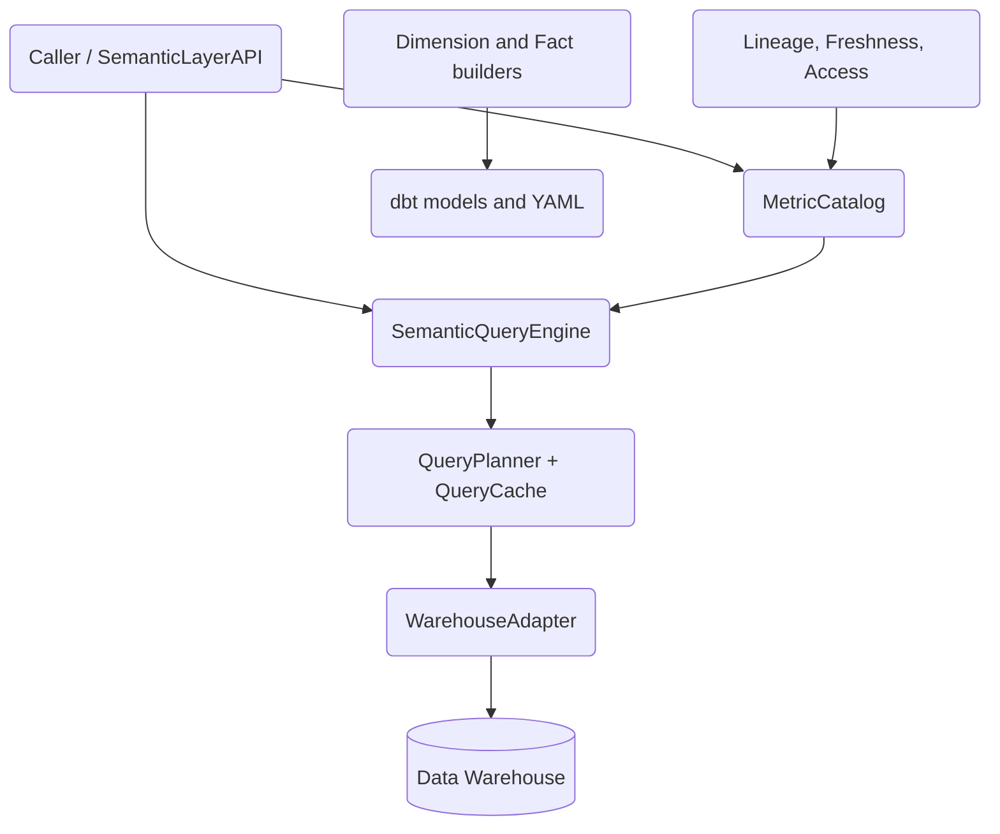

# Warehouse Semantic Layer

A metrics-as-code semantic layer for data warehouses, built from scratch in Python. It defines governed business metrics once, translates metric queries into warehouse-specific SQL (Snowflake, BigQuery, Postgres/Redshift, SQLite), and ships supporting building blocks for dimensional modeling, dbt integration, query optimization, and governance.

## Features

- **Metrics-as-code catalog** — register `MetricDefinition` objects (sum / count / count_distinct / average / min / max / derived) in a `MetricCatalog`, list and search them (`query_engine.py`).
- **Semantic-to-SQL translation** — `SemanticQueryEngine.generate_sql` builds `SELECT … GROUP BY` SQL with per-warehouse `DATE_TRUNC` and expands derived metric references like `{{ metric('total_revenue') }}` (`query_engine.py`).
- **Warehouse adapters** — a `WarehouseAdapter` hierarchy with `SnowflakeAdapter`, `BigQueryAdapter`, `PostgresAdapter` (also Redshift), `SQLiteAdapter`, and `InMemoryAdapter`, plus a `create_adapter` factory (`query_engine.py`).
- **Dimensional modeling** — typed `DimensionModel` / `FactModel` builders with prebuilt `DimCustomers`, `DimProducts`, `DimDates` (date-spine generator), `FctOrders`, `FctRevenue`, `FctCosts`, each emitting dbt SQL and schema YAML (`dimensions.py`, `facts.py`).
- **Programmatic API** — `SemanticLayerAPI` and `MetricRegistry` to list/get/query metrics, validate definitions, and import/export metric YAML (`api.py`).
- **Query optimization** — cost-based `QueryPlanner` with pre-aggregate routing, optimization rules, an in-memory `QueryCache` (TTL + LRU), optional `RedisCache`, and a `MaterializedViewAdvisor` (`optimization.py`).
- **Governance** — column-level `LineageTracker`, `FreshnessMonitor` with SLAs, role-based `AccessController`, and a `DocumentationGenerator` (`enterprise.py`).
- **dbt integration** — parse `manifest.json`, sync metrics, and shell out to the `dbt` CLI via `DbtRunner` (`dbt_integration.py`, requires `pyyaml`).

## Architecture



| Component | Module | Responsibility |
|-----------|--------|----------------|
| Metric catalog | `query_engine.py` | Register, look up, list, and search metric definitions |
| Query engine | `query_engine.py` | Translate `MetricQuery` to warehouse SQL; expand derived metrics |
| Warehouse adapters | `query_engine.py` | Execute SQL against Snowflake / BigQuery / Postgres / SQLite / in-memory |
| Dimension + fact builders | `dimensions.py`, `facts.py` | Define star-schema models, generate dbt SQL and schema YAML |
| API + registry | `api.py` | Public query/validate surface; YAML import/export |
| Optimization | `optimization.py` | Cost estimation, plan rewriting, caching, MV advice |
| Governance | `enterprise.py` | Lineage, freshness SLAs, access control, doc generation |
| dbt integration | `dbt_integration.py` | Manifest parsing, metric sync, `dbt` CLI runner |

## Quick Start

### Prerequisites

- Python 3.9+
- No external services are required to run the tests. Executing against a real warehouse requires the corresponding driver (e.g. `snowflake-connector-python`, `google-cloud-bigquery`, `psycopg2`) and credentials. `RedisCache` requires `redis`; dbt integration requires `pyyaml` (a core dependency) and the `dbt` CLI.

### Installation

```bash
pip install -e ".[dev]"
```

### Running

This project is a library, not a server. Import it and drive it from Python:

```bash
python -c "import semantic_layer; print(semantic_layer.__version__)"
```

## Usage

```python
from semantic_layer import (
    CalculationMethod,
    MetricCatalog,
    MetricDefinition,
    MetricQuery,
    SemanticQueryEngine,
    TimeGrain,
)

catalog = MetricCatalog()
catalog.add_metric(
    MetricDefinition(
        name="total_revenue",
        label="Total Revenue",
        description="Sum of all order totals",
        model="fct_orders",
        calculation_method=CalculationMethod.SUM,
        expression="order_total",
        timestamp="order_date",
        time_grains=[TimeGrain.DAY, TimeGrain.MONTH],
        dimensions=["country_code"],
    )
)

engine = SemanticQueryEngine(catalog, warehouse_type="snowflake")
query = MetricQuery(
    metrics=["total_revenue"],
    dimensions=["country_code"],
    filters=[],
    time_grain="month",
    start_date="2024-01-01",
    end_date="2024-12-31",
)

print(engine.generate_sql(query))
# SELECT
#     DATE_TRUNC('month', order_date) as period, country_code, SUM(order_total) as total_revenue
# FROM fct_orders
# WHERE order_date >= '2024-01-01' AND order_date < '2024-12-31'
# GROUP BY period, country_code
# ORDER BY period
```

Execute against a warehouse with a `QueryExecutor` and any adapter (the in-memory adapter needs no driver):

```python
import asyncio
from semantic_layer import QueryExecutor

executor = QueryExecutor(connection={"fct_orders": [{"period": "2024-01", "total_revenue": 1500}]},
                         warehouse_type="memory")
result = asyncio.run(executor.execute_metric_query(engine, query))
print(result.data, result.row_count)
```

## What's Real vs Simulated

- **Real:** metric catalog, semantic-to-SQL generation (including per-warehouse `DATE_TRUNC` and derived-metric expansion), query validation, dimension/fact model definitions with generated dbt SQL and YAML, the date-spine generator, metric YAML import/export, cost estimation, the query planner and optimization rules, the in-memory TTL/LRU cache, lineage tracking, freshness SLA evaluation, and access-control logic. These are exercised end-to-end by the test suite using the `InMemoryAdapter`.
- **Simulated / requires credentials:** the `InMemoryAdapter` does naive table extraction, not real SQL execution. `SnowflakeAdapter`, `BigQueryAdapter`, and `PostgresAdapter` wrap real driver connections you must supply — running queries needs those drivers plus credentials. `RedisCache` is a no-op until a reachable Redis is available. `DbtRunner` shells out to an installed `dbt` binary. CI/CD helpers emit workflow YAML text but do not run pipelines.

## Testing

```bash
pytest tests/ -v
```

The suite (~350 tests across 11 modules) covers models, adapters, the query engine, dimensions, facts, the API, optimization, governance, dbt-style testing helpers, config, and an integration flow. No external services are required — warehouse execution is exercised through the in-memory adapter.

## Project Structure

```
10-warehouse-semantic-layer/
  src/semantic_layer/
    models.py          # core dataclasses + CalculationMethod / TimeGrain enums
    config.py          # warehouse / model / source configuration
    query_engine.py    # catalog, SQL generation, warehouse adapters, executor
    dimensions.py      # dimension models, builders, date spine
    facts.py           # fact models and builders
    api.py             # SemanticLayerAPI, MetricRegistry, validators
    optimization.py    # planner, cost estimator, caches, MV advisor
    enterprise.py      # lineage, freshness, access control, docs
    dbt_integration.py # manifest parsing, metric sync, dbt CLI runner
  tests/               # ~350 pytest tests
  docs/                # BLUEPRINT.md (+ ARCHITECTURE, API, DEPLOYMENT, CONTRIBUTING)
```

## License

MIT — see [LICENSE](../LICENSE)
