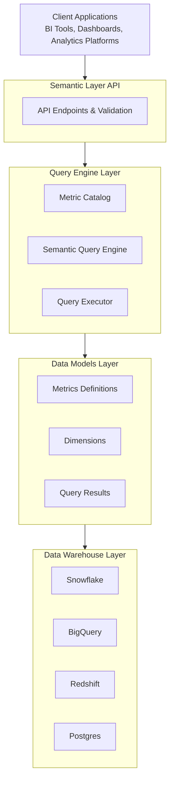

# Warehouse Semantic Layer Architecture

## Overview

The Warehouse Semantic Layer is a Python-based metrics platform that provides a unified interface for defining, managing, and querying business metrics across data warehouses. It acts as an abstraction layer between raw data warehouse tables and business intelligence tools, enabling consistent metric definitions and calculations.

## System Architecture



## Core Components

### 1. Data Models (`models.py`)

Defines the core data structures used throughout the system:

- **MetricDefinition**: Core metric configuration including calculation method, expression, and metadata
- **Dimension**: Dimensional attributes for slicing metrics
- **MetricQuery**: Query specification containing metrics, dimensions, filters, and time range
- **QueryResult**: Structured response containing data and metadata
- **CalculationMethod**: Enum for aggregation types (SUM, COUNT, COUNT_DISTINCT, AVERAGE, MIN, MAX, DERIVED)
- **TimeGrain**: Supported time granularities (DAY, WEEK, MONTH, QUARTER, YEAR)

### 2. Query Engine (`query_engine.py`)

Handles metric query translation and SQL generation:

- **MetricCatalog**: Central registry for metric definitions and dimensions
  - Stores and retrieves metric definitions
  - Supports filtering by category and search
  - Manages dimension configurations

- **SemanticQueryEngine**: Translates semantic queries to warehouse-specific SQL
  - Generates optimized SQL for different warehouse types
  - Handles time grain truncation per warehouse dialect
  - Expands derived metrics recursively
  - Validates queries before execution

- **QueryExecutor**: Executes queries against the data warehouse
  - Async execution support
  - Connection management
  - Result transformation

### 3. API Layer (`api.py`)

Provides high-level interfaces for metric operations:

- **SemanticLayerAPI**: Main API interface
  - List and search metrics
  - Query single or multiple metrics
  - Retrieve metric metadata
  - Validate queries

- **MetricRegistry**: Manages metric lifecycle
  - Register and validate metrics
  - Import/export YAML definitions
  - Ensure metric consistency

- **MetricValidator**: Validates metric definitions
  - Check required fields
  - Validate derived metric references
  - Ensure data consistency

### 4. Configuration (`config.py`)

Manages system configuration:
- Warehouse connection settings
- Authentication credentials
- Performance tuning parameters
- Cache configuration

### 5. Facts and Dimensions (`facts.py`, `dimensions.py`)

Specialized handlers for fact tables and dimensional data:
- Fact table management
- Dimension hierarchy handling
- Join path resolution
- Cardinality estimation

### 6. Enterprise Features (`enterprise.py`)

Advanced capabilities for enterprise deployments:
- Multi-tenant support
- Access control and permissions
- Audit logging
- Performance monitoring
- Cost tracking

## Data Flow

### Query Execution Flow

1. **Request Reception**: API receives metric query request
2. **Validation**: Request validated against catalog
3. **SQL Generation**: Query engine generates warehouse-specific SQL
4. **Execution**: SQL executed against data warehouse
5. **Result Processing**: Results formatted and returned


### Metric Registration Flow

1. **Definition**: Metric defined with metadata
2. **Validation**: Definition validated for completeness
3. **Registration**: Metric added to catalog
4. **Indexing**: Searchable indexes updated
5. **Availability**: Metric available for queries

## Key Design Patterns

### 1. Strategy Pattern
Different SQL generation strategies for each warehouse type (Snowflake, BigQuery, Redshift, PostgreSQL).

### 2. Factory Pattern
Metric factories for creating common metric types (revenue, user, conversion metrics).

### 3. Registry Pattern
Central catalog for managing metric definitions and ensuring consistency.

### 4. Builder Pattern
SQL query construction with progressive refinement based on query parameters.

### 5. Adapter Pattern
Warehouse-specific adapters for handling dialect differences.

## Performance Considerations

### Caching Strategy
- Metric definition caching in memory
- Query result caching with TTL
- SQL template caching for common patterns

### Query Optimization
- Automatic index recommendations
- Partition pruning hints
- Aggregation pushdown
- Join order optimization

### Connection Pooling
- Reusable warehouse connections
- Connection health monitoring
- Automatic retry with backoff

## Security Model

### Authentication
- API key authentication
- OAuth 2.0 support
- Service account integration

### Authorization
- Metric-level permissions
- Dimension filtering
- Row-level security passthrough

### Audit
- Query logging
- Metric usage tracking
- Performance monitoring

## Scalability Features

### Horizontal Scaling
- Stateless API design
- Load balancer compatible
- Distributed caching support

### Vertical Scaling
- Async query execution
- Query parallelization
- Batch processing support

### Multi-Tenancy
- Isolated metric namespaces
- Per-tenant configuration
- Resource quotas

## Integration Points

### dbt Integration
- Import metrics from dbt projects
- Use dbt models as sources
- Leverage dbt tests

### BI Tool Integration
- Tableau connector
- Looker integration
- Power BI support
- Generic JDBC/ODBC interface

### Monitoring Integration
- Prometheus metrics export
- DataDog integration
- Custom webhook support

## Deployment Architecture

### Containerized Deployment
```yaml
services:
  api:
    image: semantic-layer:latest
    replicas: 3
    environment:
      - WAREHOUSE_TYPE=snowflake
      - CACHE_ENABLED=true

  cache:
    image: redis:latest

  monitoring:
    image: prometheus:latest
```

### Cloud Deployment
- AWS ECS/Fargate support
- Google Cloud Run compatible
- Azure Container Instances ready
- Kubernetes native

## Extension Points

- Custom calculation methods
- Warehouse plugins
- Metric transformers
- Result formatters
- Cache backends