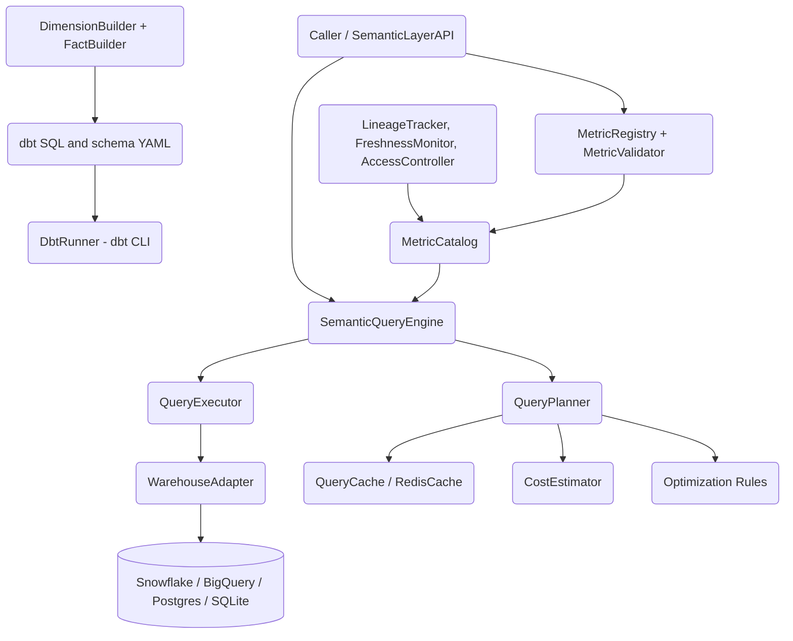

# Warehouse Semantic Layer

## Overview

The Warehouse Semantic Layer is a metrics-as-code analytics engineering library written from scratch in Python. It sits between a dimensionally modeled data warehouse and the tools that consume it, providing a single governed place to define business metrics and translate metric requests into warehouse-specific SQL.

The core idea is that a metric — "total revenue", "active users", "average order value" — should be defined exactly once, with its calculation, grain, allowed dimensions, and metadata captured as data rather than copied into every dashboard and report. Consumers then ask for metrics by name over a time range and set of dimensions, and the engine compiles that request into SQL for the target warehouse.

The project is built around a small set of orthogonal concerns:

- **Definition** — typed dataclasses (`MetricDefinition`, `Dimension`, `Model`, `Source`) describe metrics and the dbt models they sit on.
- **Translation** — the `SemanticQueryEngine` turns a `MetricQuery` into a SQL string, handling aggregation methods, per-warehouse date truncation, filter composition, and derived-metric expansion.
- **Execution** — a `WarehouseAdapter` hierarchy abstracts over Snowflake, BigQuery, Postgres/Redshift, SQLite, and an in-memory test backend behind one async `execute` method.
- **Modeling** — dimension and fact builders encode star-schema best practices and can emit dbt SQL and schema YAML.
- **Optimization** — a cost-based planner can route queries to pre-aggregated tables, prune projections, cache results, and recommend materialized views.
- **Governance** — column lineage, freshness SLAs, role-based access control, and documentation generation make the layer operable at team scale.

Concepts this project teaches: dimensional (Kimball-style) modeling, the metrics layer / metrics-as-code pattern, SQL generation across dialects, cost-based query planning and caching, and data governance primitives (lineage, freshness, access). It is a self-contained library — there is no long-running server; callers import the package and drive it from Python or wire it into dbt.

### Design principles

Three principles run through the codebase. **Separation of definition from execution** — metrics, dimensions, and facts are described by inert dataclasses, and every behavior (validation, SQL generation, planning, governance) is a function over those descriptions. This makes definitions trivially serializable (the YAML round-trip) and testable without a warehouse. **Dialect isolation** — everything warehouse-specific is confined to a handful of methods (`_get_time_column`, the adapter classes, the DDL generators), so adding a dialect touches a small, well-marked surface. **Graceful degradation** — optional capabilities (Redis caching, dbt integration, live warehouse execution) are present as interfaces that no-op or are gated on imports, so a minimal install still imports cleanly and the test suite runs with zero external services.

### Scope

In scope: metric definition and cataloging, SQL generation, warehouse adapter abstraction, dimensional model definitions with dbt SQL/YAML generation, query optimization and caching primitives, and governance primitives. Out of scope: a production query executor for every dialect (adapters wrap user-supplied driver connections), a hosted API server, and a full dbt project runtime (the layer integrates with dbt via manifest parsing and a CLI runner rather than reimplementing it).

The deliberate consequence of this scoping is that the project is small enough to read end to end yet realistic enough to demonstrate every layer of a metrics platform. Each module is independently importable and independently tested, and the dependency graph flows in one direction — definitions at the bottom, behavior in the middle, integration façades at the top — so a reader can start from `models.py` and work outward without circular surprises. The sections that follow trace that same path: architecture first, then each component, then the data shapes, the public API, performance characteristics, and the testing strategy that keeps it all honest.

## Architecture



The flow has two main paths. The **query path** (Caller -> Catalog/Engine -> Planner/Executor -> Adapter -> Warehouse) resolves a metric request into SQL and optionally runs it. The **modeling path** (Builders -> dbt SQL/YAML -> DbtRunner) produces the warehouse tables that metrics are defined against. Governance components observe the catalog and the models to enforce ownership, freshness, and access.

Walking the query path concretely: a caller asks `SemanticLayerAPI.query_metrics` (or builds a `MetricQuery` directly) for one or more metrics over a time range and dimension set. The API validates the request through the engine and, if valid, asks the engine to generate SQL; for an optimized run, `OptimizedQueryEngine.plan_query` first consults the rule pipeline and cost estimator to decide whether to target a base or aggregate table and computes a cache key. If a cache entry exists, the result returns immediately; otherwise the planner's SQL runs through a `QueryExecutor` and its adapter against the warehouse, the rows wrap into a `QueryResult`/`MetricQueryResponse`, the run is recorded for the materialized-view advisor, and the result is cached under its key. Every stage is a separate object, so a caller can stop at "just give me the SQL" or go all the way to "execute, optimize, and cache" depending on need.

The two paths meet at the warehouse: the modeling path defines what `fct_orders` and `dim_customers` contain, and the query path reads them through metrics defined on top. Keeping them as distinct paths — rather than one monolithic pipeline — is what lets the project teach dimensional modeling and the metrics layer as separable ideas.

### Layered description

- **Definition layer** (`models.py`, `config.py`) — pure dataclasses and enums. No behavior beyond holding shape; everything else consumes these.
- **Catalog + validation** (`query_engine.py`, `api.py`) — `MetricCatalog` is the in-memory registry; `MetricValidator` checks required fields and derived-metric references; `MetricRegistry` validates on registration and handles YAML round-tripping.
- **Translation + execution** (`query_engine.py`) — `SemanticQueryEngine` is stateless given a catalog; `QueryExecutor` pairs an engine with an adapter to run end-to-end metric queries.
- **Modeling** (`dimensions.py`, `facts.py`) — model definitions plus builders that generate dbt artifacts.
- **Optimization** (`optimization.py`) — a self-contained planning/caching subsystem that can be used independently of the base engine.
- **Governance** (`enterprise.py`) — lineage, freshness, access, and docs, unified under `SemanticLayerGovernance`.
- **dbt bridge** (`dbt_integration.py`) — manifest parsing and a CLI runner; gated on `pyyaml` import.

## Core Components

### Metric Catalog (`MetricCatalog`)

The catalog is an in-memory dictionary of metric name to `MetricDefinition`, with a parallel dimension map. It supports `add_metric`, `get_metric`, and `list_metrics(category, search)`. Search matches a lowercased substring against metric name and description; category filters on `meta["category"]`. The catalog is deliberately simple — persistence and validation live elsewhere so the catalog can be reused as a pure lookup.

This minimalism is intentional and load-bearing: the engine, the API, the governance components, and the freshness monitor all take a `MetricCatalog` and read from it, so the catalog is the single shared source of metric truth. Adding a metric is idempotent on name (a later definition replaces an earlier one), which makes YAML re-imports safe. Because the catalog holds no behavior, it can be constructed directly in tests with a few definitions, or populated from YAML, dbt manifest parsing, or programmatic builders — every upstream path converges on the same object.

### Semantic Query Engine (`SemanticQueryEngine`)

The engine is the heart of the translation layer. `generate_sql(query)` performs these steps:

1. **Resolve metrics** — each requested metric name is looked up in the catalog; a missing metric raises `ValueError`.
2. **Build the SELECT list** — a truncated time column aliased as `period`, then the requested dimensions verbatim, then one aggregation expression per metric aliased to the metric name.
3. **Build the FROM clause** — `_build_from_clause` collects the distinct `model` values of the requested metrics. The current implementation assumes a single shared table; cross-model joins are out of scope, and the code comment marks the join point for anyone extending it.
4. **Build the WHERE clause** — a half-open time-range predicate on the first metric's timestamp (`>= start_date`, `< end_date`), followed by query-level filters and then each metric's own `filters`.
5. **Build GROUP BY / ORDER BY** — group by `period` plus dimensions, order by `period`. Optional `LIMIT`/`OFFSET` are appended when present.

Two helpers carry the dialect and aggregation logic:

- `_get_time_column(metric, grain)` emits the warehouse-appropriate `DATE_TRUNC`. Snowflake, Postgres, and Redshift use `DATE_TRUNC('<grain>', <ts>)`; BigQuery uses `DATE_TRUNC(<ts>, <GRAIN>)`. An unknown warehouse falls back to the Snowflake form.
- `_build_aggregation(metric)` maps `CalculationMethod` to SQL: `SUM`, `COUNT`, `COUNT(DISTINCT …)`, `AVG`, `MIN`, `MAX`, and `derived`.

`_expand_derived_metric(expression)` resolves derived metrics. It regex-matches `{{ metric('name') }}` references with the pattern `\{\{\s*metric\('(\w+)'\)\s*\}\}` and replaces each with that metric's own aggregation expression, so `revenue_per_user = {{ metric('total_revenue') }} / {{ metric('active_users') }}` compiles to `SUM(order_total) / COUNT(DISTINCT customer_id)`. Because the replacement reuses `_build_aggregation`, a derived metric automatically inherits the correct aggregation form of each base metric, and a missing reference falls back to the bare metric name rather than raising — validation (below and in `MetricValidator`) is responsible for catching dangling references.

`validate_query(query)` returns a list of human-readable errors: unknown metrics, an invalid time grain (must be one of day/week/month/quarter/year), and `start_date >= end_date`. It returns a list rather than raising so a caller can surface every problem at once; `QueryExecutor.execute_metric_query` and `SemanticLayerAPI.query_metrics` both run validation first and raise `ValueError` only when the list is non-empty.

#### Worked example: SQL generation end to end

Given a catalog containing `total_revenue` (SUM of `order_total` on `fct_orders`, timestamped by `order_date`) and a query for that metric by `country_code` at month grain over calendar 2024, the engine assembles the statement in the order described above:

1. The SELECT list becomes `DATE_TRUNC('month', order_date) as period`, then `country_code`, then `SUM(order_total) as total_revenue`.
2. The FROM clause resolves to `fct_orders` (the single distinct model).
3. The WHERE clause is `order_date >= '2024-01-01' AND order_date < '2024-12-31'` plus any query- or metric-level filters.
4. GROUP BY is `period, country_code`; ORDER BY is `period`.

```sql
SELECT
    DATE_TRUNC('month', order_date) as period, country_code, SUM(order_total) as total_revenue
FROM fct_orders
WHERE order_date >= '2024-01-01' AND order_date < '2024-12-31'
GROUP BY period, country_code
ORDER BY period
```

Switching the engine to `warehouse_type="bigquery"` changes only the time column — the rest of the statement is identical:

```sql
SELECT
    DATE_TRUNC(order_date, MONTH) as period, country_code, SUM(order_total) as total_revenue
FROM fct_orders
WHERE order_date >= '2024-01-01' AND order_date < '2024-12-31'
GROUP BY period, country_code
ORDER BY period
```

This demonstrates that dialect handling is isolated to `_get_time_column`. Adding `limit=100` appends `LIMIT 100`, and supplying `offset` appends `OFFSET` after it.

A multi-metric query reuses the same machinery: each metric contributes one aggregation column and folds its own `filters` into the shared WHERE clause, so `total_revenue` and `active_users` over the same grain compile to a single grouped scan rather than two queries.

### Warehouse Adapters (`WarehouseAdapter` and subclasses)

All adapters implement an async `execute(sql) -> List[Dict]` and `close()`. They normalize cursor results into dictionaries keyed by column name:

- **`SQLiteAdapter`** — wraps a `sqlite3` connection; used for local development and tests that need real SQL execution.
- **`PostgresAdapter`** — wraps a DB-API connection; also used for Redshift, which is wire-compatible.
- **`SnowflakeAdapter`** — wraps a Snowflake connector connection.
- **`BigQueryAdapter`** — wraps a BigQuery client and iterates `query_job.result()`.
- **`InMemoryAdapter`** — holds preloaded `{table_name: [rows]}` data and returns the rows for the table named after `FROM`. It does naive parsing for testing, not real SQL evaluation.

`create_adapter(warehouse_type, connection)` is the factory; it maps `sqlite`, `postgres`/`postgresql`/`redshift`, `snowflake`, `bigquery`, and `memory` to the right class and raises on unknown types. The factory exists so that callers depend on warehouse *type* strings (which flow naturally from config) rather than importing concrete adapter classes, and so that Redshift can transparently reuse the Postgres adapter.

Result normalization is the shared contract across adapters. The SQL/cursor adapters (`SQLite`, `Postgres`, `Snowflake`) read `cursor.description` for column names, fetch all rows, and `zip` columns to values to produce `List[Dict]`; they guard against a `None` description (non-SELECT statements) by returning an empty column list. The BigQuery adapter takes a different route — it iterates `query_job.result()` and converts each `Row` directly to a dict — but presents the same shape. Adapters log a truncated form of each SQL statement at info level and re-raise driver errors after logging, so failures are traceable without leaking full query text.

`QueryExecutor` ties it together: it constructs the right adapter (special-casing `memory` so a plain dict can be passed as preloaded data), exposes `execute(sql)`, and provides `execute_metric_query(engine, query)` which validates, generates SQL, executes, and wraps the rows in a `QueryResult` with metadata (the requested metrics, dimensions, and grain), the generated SQL, and a row count. Because `execute` is async across all adapters, `OptimizedQueryEngine.execute` drives it from a synchronous context by spinning up a short-lived event loop, which keeps the optimization façade usable from ordinary scripts.

### Dimension and Fact Builders (`dimensions.py`, `facts.py`)

`DimensionModel` and `FactModel` are typed descriptions of star-schema tables. Columns carry semantics: dimension columns track keys (`is_key`, `is_natural_key`, `is_scd_valid`); fact columns distinguish keys, foreign keys, measures, and degenerate dimensions.

Prebuilt definitions encode realistic models:

- **`DimCustomers`** — customer dimension with derived segmentation (`prospect`/`new`/`active`/`loyal`) and a churn flag based on 90-day inactivity; `generate_sql()` returns a dbt model that aggregates orders into lifetime value, order counts, and date bounds.
- **`DimProducts`** — product attributes (category, brand, price, cost, active flag).
- **`DimDates`** — a calendar dimension whose `generate_date_spine(start, end)` produces one row per date with day/week/month/quarter attributes and month/quarter/year-end flags.
- **`FctOrders`** — incremental order fact (`merge` strategy) joining payments with order items; `generate_sql()` emits the `` guard.
- **`FctRevenue`** — daily revenue rollup by segment and country, using a surrogate key.
- **`FctCosts`** — cost-tracking fact by cost type and center.

`DimensionBuilder` and `FactBuilder` collect models and can `generate_yaml(name)` to emit dbt schema files with appropriate generic tests (unique/not_null on keys, relationships on foreign keys, non-negative expression tests on measures). `FactBuilder.get_incremental_facts()` lists facts configured as incremental.

The generated dbt SQL captures real modeling decisions. `DimCustomers.generate_sql()` aggregates the order fact back onto the customer grain, then derives segmentation and churn inline:

```sql
{{ config(materialized='table', unique_key='customer_id', tags=['daily']) }}

with customers as (
    select * from {{ ref('stg_stripe__customers') }}
),
orders as (
    select * from {{ ref('fct_orders') }}
),
customer_orders as (
    select
        customer_id,
        count(*) as total_orders,
        sum(order_total) as lifetime_value,
        min(order_date) as first_order_date,
        max(order_date) as last_order_date,
        avg(order_total) as average_order_value
    from orders
    group by 1
),
final as (
    select
        customers.customer_id,
        customers.email,
        customers.name,
        customers.country_code,
        customers.created_at,
        coalesce(customer_orders.total_orders, 0) as total_orders,
        coalesce(customer_orders.lifetime_value, 0) as lifetime_value,
        customer_orders.first_order_date,
        customer_orders.last_order_date,
        customer_orders.average_order_value,
        case
            when customer_orders.total_orders is null then 'prospect'
            when customer_orders.total_orders = 1 then 'new'
            when customer_orders.total_orders < 5 then 'active'
            else 'loyal'
        end as customer_segment,
        case
            when datediff('day', customer_orders.last_order_date, current_date()) > 90
            then true else false
        end as is_churned
    from customers
    left join customer_orders
        on customers.customer_id = customer_orders.customer_id
)
select * from final
```

`FctOrders.generate_sql()` shows the incremental pattern — it joins payments to order items, converts cents to dollars through a `cents_to_dollars` macro, and guards the scan with the `is_incremental()` block so reruns only process orders newer than the current maximum:

```sql
{{ config(materialized='incremental', unique_key='order_id', incremental_strategy='merge', tags=['hourly']) }}

with payments as (
    select * from {{ ref('int_payments_with_customers') }}
),
order_items as (
    select * from {{ ref('stg_shopify__order_items') }}
),
orders as (
    select
        payments.order_id,
        payments.customer_id,
        payments.created_at as order_date,
        payments.payment_method,
        payments.country_code,
        {{ cents_to_dollars('payments.amount_cents') }} as order_total,
        sum(order_items.quantity) as total_items,
        count(distinct order_items.product_id) as unique_products
    from payments
    left join order_items
        on payments.order_id = order_items.order_id
    group by 1, 2, 3, 4, 5, 6
)
select * from orders

where order_date > (select max(order_date) from {{ this }})

```

`DimDates.generate_date_spine(start, end)` builds the calendar dimension in Python: for each date it derives the `YYYYMMDD` key, ISO week, day/month names, quarter, and the month-end/quarter-end/year-end boolean flags, returning a list of row dicts ready to seed into the warehouse.

The `ref('…')` names in these models assume a conventional dbt project layout — staging models conformed per source, intermediate models for business logic, and marts split into core and finance. The builders target that structure:

```
models/
  staging/
    stripe/        stg_stripe__payments, stg_stripe__customers
    shopify/       stg_shopify__order_items, stg_shopify__products
  intermediate/
    finance/       int_payments_with_customers
  marts/
    core/          dim_customers, dim_products, dim_dates, fct_orders
    finance/       fct_revenue, fct_costs
```

Staging models rename and cast source columns (e.g. `amount` cents to a typed `amount_cents`, `created` to `created_at`) and filter to valid rows; intermediate models perform the joins (payments to customers) that marts then aggregate. The fact and dimension `generate_sql()` outputs slot into the `marts/` layer and reference the staging/intermediate models by these names.

### API and Registry (`api.py`)

`SemanticLayerAPI` is the programmatic surface: `list_metrics` (with category/search/tier filters), `get_metric`, `query_metric` / `query_metrics`, `get_dimensions_for_metric`, and `validate_query`. Query methods build a `MetricQuery`, validate it through the engine, generate SQL, and return a `MetricQueryResponse`; SQL is included only when `show_sql=True`. When no executor is wired, data comes back empty but the generated SQL is still produced, which is the common path in tests.

`MetricValidator` checks definitions for required fields (name, model, expression, timestamp, at least one time grain) and, for derived metrics, parses `metric('name')` references out of the expression and confirms each exists in the catalog. `validate_all_metrics` runs this across the catalog and returns a name-to-errors map, which is what the CI/CD validation hook consumes.

`MetricRegistry` validates on registration (raising `ValueError` with the joined errors if invalid) and round-trips metrics to and from YAML so definitions can live in version control alongside dbt. `export_yaml` emits the dbt-style metrics block — `name`, quoted `label`/`description`, `model: ref('…')`, `calculation_method`, `expression`, `timestamp`, a `time_grains` list, and nested `dimensions`, `filters`, and `meta`. `import_yaml` is the inverse: it `yaml.safe_load`s the document, strips the `ref('…')` wrapper from the model name, maps the calculation string back to a `CalculationMethod`, and registers each metric (so import inherits validation). This symmetry means a team can author metrics either in Python or in YAML and move freely between the two.

### Optimization Subsystem (`optimization.py`)

This subsystem can plan and cache queries independently of the base engine.

- **`AggregateTableManager`** — registers `AggregateTableConfig` pre-aggregates and finds a matching table for a query by source table, metric/dimension subset, and granularity compatibility (a coarser-or-equal aggregate can serve a finer request). It also generates create/refresh DDL and recommends aggregates from observed query patterns.
- **`CostEstimator`** — estimates rows, bytes, and time from `TableStats` and query selectivity (time-range fraction times a per-filter reduction factor), producing a `QueryCost` with IO/CPU components.
- **`QueryPlanner`** — applies a rule pipeline, estimates base vs. aggregate-table cost, chooses the cheaper plan, generates SQL, and computes a cache key and TTL. `explain(plan)` renders a human-readable plan.
- **Optimization rules** — each rule extends the abstract `OptimizationRule.apply(query, source_table)` and returns an `OptimizationResult(modified, query, note, aggregate_table)`. `AggregateTableRule` maps the query grain to an `AggregateGranularity` and, if a matching aggregate exists, marks the result modified with the qualified aggregate name. `TimeRangeOptimizationRule` is advisory — it leaves the query unmodified but adds a note suggesting a coarser grain when the range exceeds 90 days (week) or a year (month/week). `FilterPushdownRule` and `ProjectionPruningRule` are likewise advisory, recording how many filters can be pushed and how many columns the scan actually needs. Keeping advisory rules as notes rather than rewrites means the planner can surface optimization hints to developers without silently changing query semantics.
- **Caches** — `QueryCache` is an in-memory store with TTL expiry, LRU eviction at capacity, and hit/miss `CacheStats`. `RedisCache` mirrors the interface over Redis, connecting lazily and degrading to a no-op if Redis is unreachable.
- **`MaterializedViewAdvisor`** — records each query execution (query, time, rows scanned) and recommends materialized views for query *signatures* that recur frequently and run slowly. A signature is a SHA-256 over the sorted metrics, dimensions, and grain — deliberately excluding the date range so that the same shape of query over different windows collapses to one pattern. `analyze_and_recommend(min_occurrences, min_avg_time_ms)` groups history by signature and emits a `MaterializedViewRecommendation` (with an estimated storage size, speedup, and refresh strategy) only for groups that clear both thresholds, so the advisor recommends views for the queries that actually hurt rather than every query seen.

The aggregate manager also generates the warehouse-side DDL. For a daily aggregate over `fct_orders` with metrics `total_revenue` and `order_count` and a `country_code` dimension, `generate_create_ddl` emits a `CREATE TABLE IF NOT EXISTS agg_fct_orders_daily` with the time column, dimension columns, and a `_sum`/`_count` pair per metric, optionally adding a Snowflake `CLUSTER BY` or BigQuery `PARTITION BY`. `generate_refresh_query` emits the matching `INSERT … SELECT` that truncates the time column to the granularity and groups by time plus dimensions, so registering an aggregate yields both the table definition and its refresh job.
- **`OptimizedQueryEngine`** — the integration façade: plan, check cache, execute via an async adapter, record for the MV advisor, and cache the result.

The planner's decision procedure is explicit and auditable. For each query it runs every rule in order, accumulating notes and (for `AggregateTableRule`) a candidate aggregate table. It then asks `CostEstimator` for the base-table cost and, if a candidate aggregate exists, the aggregate cost; it only commits to the aggregate when its total cost is strictly lower, recording the percentage saving in the plan notes. Finally it generates SQL against the chosen table, computes a content-addressed cache key (a SHA-256 over sorted metrics, dimensions, grain, dates, and filters, truncated to 32 hex chars), and selects a TTL from the data's age. `explain(plan)` prints all of this — metrics, time range, applied optimizations, chosen table, cost estimates, cache key/TTL, and the generated SQL — which makes the planner easy to reason about in tests and in development.

Granularity compatibility is the key correctness rule for aggregate routing: an aggregate at granularity *G* can serve a query at granularity *Q* only when *G* is at least as fine as *Q* (a daily aggregate can answer monthly questions, but a monthly aggregate cannot answer daily ones). `_is_granularity_compatible` enforces this by comparing positions in the ordered list hourly → daily → weekly → monthly → quarterly → yearly.

### Governance (`enterprise.py`)

- **`LineageTracker`** / **`LineageGraph`** — track column-level transformations and metric-to-source-column dependencies, answer upstream/downstream queries, and run impact analysis by walking downstream edges.
- **`FreshnessMonitor`** — evaluates recorded update times against `FreshnessSLA` definitions, returning `FreshnessCheck` results classified fresh / stale / critical with SLA-violation flags.
- **`AccessController`** — role-based access with allow/deny lists, access levels (public/internal/restricted/confidential), and optional row-level filters and column masks.
- **`DocumentationGenerator`** — renders a Markdown metric catalog grouped by category (each metric's label, name, description, calculation, expression, dimensions, time grains, and metadata), a data-dictionary skeleton, and a Mermaid lineage diagram built from the lineage graph's edges (each edge becomes a `source --> target` arrow, labeled with the transformation when present). Because the metric docs derive entirely from the catalog, documentation never drifts from the definitions it describes — regenerating it is a single call.
- **`CICDIntegration`** — emits a GitHub Actions workflow (checkout, Python setup, dbt deps/compile/test, source freshness, and metric validation) and a pre-commit hook config (validate metrics, check docs, lint SQL), and validates changed files against the catalog. `validate_changes` partitions changed files into metric vs. model changes and warns on any metric missing a description or owner, so a pull request gets governance feedback before it merges. These methods produce configuration text; they orchestrate nothing themselves, which keeps the library free of any particular CI vendor lock-in.
- **`SemanticLayerGovernance`** — bundles lineage, freshness, access, and docs, and produces a governance report (owner and doc coverage percentages).

The governance report ties these together into a single health snapshot. `SemanticLayerGovernance.get_governance_report()` walks the catalog and returns total metric count, how many metrics have owners and descriptions, the number of freshness checks and access policies, and owner/doc coverage as percentages:

```python
{
    "total_metrics": 12,
    "metrics_with_owners": 10,
    "metrics_with_docs": 12,
    "freshness_checks": 4,
    "access_policies": 3,
    "coverage": {"owner_coverage": 83.3, "doc_coverage": 100.0},
}
```

Coverage percentages are the metric teams actually track — a metric without an owner or a description is an operational liability, and the report surfaces both as first-class numbers rather than requiring a manual audit.

Impact analysis deserves a closer look because it is the most algorithmic piece of governance. `LineageTracker.get_impact_analysis(model, column)` performs a breadth-first walk over the lineage graph's downstream edges starting from the changed column, collecting every reachable model and `model.column` pair while a `processed` set prevents revisiting nodes in cyclic or diamond-shaped graphs. After the structural walk it scans recorded metric-to-column dependencies and flags any metric whose source columns intersect the impacted set, so a proposed change to a staging column surfaces not just the downstream tables but the business metrics that would move. The returned shape makes this actionable:

```python
tracker.get_impact_analysis("stg_stripe__payments", "amount")
# {
#   "models":  ["fct_orders", "fct_revenue"],
#   "columns": ["fct_orders.order_total", "fct_revenue.total_revenue"],
#   "metrics": ["total_revenue", "average_order_value"],
# }
```

A reviewer reading this knows immediately that touching the raw `amount` column ripples all the way to the revenue metrics finance depends on. `FreshnessMonitor.check_freshness` classifies a metric by comparing the recorded last-update time to its SLA: beyond `max_delay_minutes` is `CRITICAL` with `sla_violated=True`, beyond `warning_threshold_minutes` is `STALE`, otherwise `FRESH`; with no SLA it falls back to a one-hour fresh/stale cutoff, and with no recorded update it returns `UNKNOWN`. `AccessController.check_access` evaluates deny lists first (a denied role always loses), then allow lists, then the access level as a default, which gives restrictive policies precedence by construction.

A concrete freshness evaluation makes the classification tangible. Given an SLA and a recorded update time, `check_freshness` returns a structured result:

```python
FreshnessSLA(
    metric_name="total_revenue",
    max_delay_minutes=120,
    warning_threshold_minutes=60,
    owner="finance-team",
)
# 30 minutes since last update  -> status=FRESH,    sla_violated=False
# 90 minutes since last update  -> status=STALE,    sla_violated=False  (past warning)
# 150 minutes since last update -> status=CRITICAL, sla_violated=True   (past max delay)
```

The lineage diagram generator renders the recorded edges as a Mermaid `graph LR` text block, so a transformation like `stg_stripe__payments.amount -> fct_orders.order_total` becomes a labeled arrow (`stg_stripe__payments_amount -->|cents_to_dollars| fct_orders_order_total`), and an unlabeled edge becomes a plain `source --> target`. Following these arrows answers two operational questions directly: where did this number come from, and what breaks if I change that column.

#### Worked example: an explained plan

`OptimizedQueryEngine.explain(query, source_table)` returns the full plan as text. For a daily revenue query against `fct_orders` with a registered daily aggregate covering the requested metrics and dimensions, the output names the metrics and range, lists the optimizations applied, identifies the chosen aggregate table, and prints cost estimates, the cache key and TTL, and the generated SQL. The same call against a table with no matching aggregate omits the aggregate line and plans against the base table, so the difference between an optimized and an unoptimized run is visible side by side without executing either.

#### Generated schema YAML

`FactBuilder.generate_yaml(name)` turns a `FactModel` into a dbt schema file, attaching tests by column role. A key column gets `unique` and `not_null`; a foreign key gets `not_null` plus a `relationships` test to its referenced dimension; a measure gets `not_null` plus a non-negative `dbt_utils.expression_is_true` test. The fact itself gets a `unique_combination_of_columns` test on its grain. For `fct_orders` the result is:

```yaml
version: 2
models:
  - name: fct_orders
    description: "Order fact table - one row per order"
    tests:
      - dbt_utils.unique_combination_of_columns:
          combination_of_columns:
            - order_id
    columns:
      - name: order_id
        description: "Primary key - unique order identifier"
        tests:
          - unique
          - not_null
      - name: customer_id
        description: "Foreign key to dim_customers"
        tests:
          - not_null
          - relationships:
              to: ref('dim_customers')
              field: customer_id
      - name: order_total
        description: "Total order amount in dollars"
        tests:
          - not_null
          - dbt_utils.expression_is_true:
              expression: ">= 0"
```

This is the same column metadata (`is_key`, `is_foreign_key`, `is_measure`) that the typed model carries, so the tests follow directly from how a column was declared — there is no separate place to keep them in sync.

### Data-Quality Testing Helpers (`testing.py`)

Separate from the Python test suite, this module builds the *dbt* tests that run inside the warehouse. `TestType` enumerates the generic tests (unique, not_null, accepted_values, relationships, expression_is_true, custom). `TestBuilder` offers a fluent API — `add_unique_test`, `add_not_null_test`, `add_accepted_values_test`, `add_relationships_test`, `add_expression_test`, `add_custom_test` — each appending a `TestDefinition` and returning `self` for chaining. `generate_yaml(model)` groups the accumulated tests by column and renders the dbt schema fragment.

Two convenience constructors encode common patterns: `create_dimension_tests(model, primary_key)` adds unique + not_null on the key, and `create_fact_tests(model, primary_key, foreign_keys, measures)` adds the key tests, a not_null + relationships test per foreign key, and a not_null + non-negative expression test per measure. `DataQualityChecker` covers checks that span tables — reconciliation between a source and a target query (with a tolerance), row-count bounds, and freshness windows — and can `generate_reconciliation_sql` that computes the absolute and relative difference between two scalar queries and flags rows exceeding the tolerance. This is how the layer expresses "mart revenue must match source revenue within $1" as runnable SQL.

### dbt Integration (`dbt_integration.py`)

Gated behind a `pyyaml` import (the package degrades gracefully if absent). `ManifestParser` reads a dbt `manifest.json` into typed `DbtModel` / `DbtSource` / `DbtMetric` objects; `YamlParser` reads metric/schema YAML; `MetricSyncer` reconciles dbt metrics with the catalog; and `DbtRunner` builds and executes `dbt run` / `dbt test` / `dbt compile` commands via `subprocess`, supporting `--select`, `--exclude`, and `--full-refresh`.

The optional-dependency handling is a deliberate design choice. `__init__.py` wraps the `dbt_integration` import in `try/except ImportError` and binds every exported name to `None` when `pyyaml` is unavailable, so importing the package never fails on a minimal install — callers that need dbt features check for `None` or install the extra. `DbtRunner._build_command` constructs argument lists rather than shell strings (passing `["dbt", "run", "--select", …]` to `subprocess`), which avoids shell-injection hazards and keeps the runner testable by inspecting the produced command. Boolean keyword arguments map to bare flags (`full_refresh=True` → `--full-refresh`) and non-boolean values map to `--flag value` pairs, mirroring dbt's CLI conventions.

### Configuration (`config.py`)

Configuration is captured as plain dataclasses rather than read from the environment, keeping the library framework-agnostic. `WarehouseConfig` holds connection parameters for any of the supported warehouses (with `account` for Snowflake and `project` for BigQuery). `ModelConfig` mirrors dbt model config (materialization, schema, unique key, incremental strategy, partitioning, clustering, tags). `SourceConfig` carries source freshness thresholds. `SemanticLayerConfig` is the top-level object that names the project, default schemas, and the on-disk locations of metric and dimension definitions. `MetricFilter` and `MetricMeta` give typed shapes for the loosely-typed dict fields on `MetricDefinition`, useful when building definitions programmatically.

## Data Structures

The definition layer is intentionally small and explicit. Core models (`models.py`):

```python
class CalculationMethod(Enum):
    SUM = "sum"
    COUNT = "count"
    COUNT_DISTINCT = "count_distinct"
    AVERAGE = "average"
    MIN = "min"
    MAX = "max"
    DERIVED = "derived"


class TimeGrain(Enum):
    DAY = "day"
    WEEK = "week"
    MONTH = "month"
    QUARTER = "quarter"
    YEAR = "year"


@dataclass
class MetricDefinition:
    name: str
    label: str
    description: str
    model: str
    calculation_method: CalculationMethod
    expression: str
    timestamp: str
    time_grains: List[TimeGrain]
    dimensions: List[str] = field(default_factory=list)
    filters: List[Dict[str, str]] = field(default_factory=list)
    meta: Dict[str, Any] = field(default_factory=dict)


@dataclass
class MetricQuery:
    metrics: List[str]
    dimensions: List[str]
    filters: List[Dict[str, Any]]
    time_grain: str
    start_date: str
    end_date: str
    limit: Optional[int] = None
    offset: Optional[int] = None


@dataclass
class QueryResult:
    data: List[Dict[str, Any]]
    metadata: Dict[str, Any]
    sql: str
    row_count: int
```

Dimensional model shapes (`dimensions.py`, `facts.py`):

```python
@dataclass
class DimensionColumn:
    name: str
    data_type: str
    description: str
    is_key: bool = False
    is_natural_key: bool = False
    is_scd_valid: bool = False


@dataclass
class DimensionModel:
    name: str
    description: str
    source_model: str
    columns: List[DimensionColumn]
    grain: str
    scd_type: int = 1
    unique_key: str = ""
    config: Dict[str, Any] = field(default_factory=dict)


@dataclass
class FactColumn:
    name: str
    data_type: str
    description: str
    is_key: bool = False
    is_foreign_key: bool = False
    is_measure: bool = False
    is_degenerate_dimension: bool = False


@dataclass
class FactModel:
    name: str
    description: str
    source_models: List[str]
    columns: List[FactColumn]
    grain: str
    unique_key: str = ""
    incremental_strategy: Optional[str] = None
    partition_by: Optional[Dict[str, Any]] = None
    config: Dict[str, Any] = field(default_factory=dict)
```

Optimization and governance shapes (`optimization.py`, `enterprise.py`):

```python
@dataclass
class AggregateTableConfig:
    name: str
    source_table: str
    metrics: List[str]
    dimensions: List[str]
    time_column: str
    granularity: AggregateGranularity
    refresh_schedule: str = "0 * * * *"
    retention_days: int = 365
    partitioned_by: Optional[str] = None
    clustered_by: List[str] = field(default_factory=list)


@dataclass
class QueryCost:
    estimated_rows: int
    estimated_bytes: int
    estimated_time_ms: float
    io_cost: float
    cpu_cost: float
    network_cost: float = 0.0


@dataclass
class ColumnLineage:
    source_model: str
    source_column: str
    target_model: str
    target_column: str
    transformation: str = ""
    confidence: float = 1.0


@dataclass
class FreshnessSLA:
    metric_name: str
    max_delay_minutes: int
    warning_threshold_minutes: int
    owner: str
    escalation_contacts: List[str] = field(default_factory=list)


@dataclass
class AccessPolicy:
    name: str
    level: AccessLevel                       # public / internal / restricted / confidential
    allowed_roles: List[str] = field(default_factory=list)
    denied_roles: List[str] = field(default_factory=list)
    row_level_filter: Optional[str] = None   # SQL predicate, may contain {user_role}
    column_mask: Optional[str] = None


@dataclass
class QueryPlan:
    original_query: MetricQuery
    rewritten_sql: str
    use_aggregate_table: bool
    aggregate_table_name: Optional[str]
    estimated_cost: QueryCost
    optimization_notes: List[str]
    cache_key: Optional[str] = None
    cache_ttl_seconds: Optional[int] = None
```

`AccessPolicy.row_level_filter` is a SQL predicate that can embed a `{user_role}` placeholder; `AccessController.get_row_filter` substitutes the caller's first role before the predicate is applied, which is how the same policy enforces different row visibility for different users. `QueryPlan` is the artifact the optimizer hands back — it carries both the decision (aggregate or not, which table) and the evidence (cost estimate, notes), so a plan is fully self-describing and `explain` is just a formatting pass over it.

The dbt bridge introduces its own typed shapes that mirror the manifest, so parsed dbt resources are as strongly typed as native definitions:

```python
@dataclass
class DbtColumn:
    name: str
    description: str = ""
    data_type: Optional[str] = None
    tests: List[str] = field(default_factory=list)


@dataclass
class DbtModel:
    name: str
    resource_type: DbtResourceType
    materialized: DbtMaterialization
    columns: List[DbtColumn] = field(default_factory=list)
    depends_on: List[str] = field(default_factory=list)
    # ... schema, database, tags, description


@dataclass
class DbtMetric:
    name: str
    label: str
    calculation_method: str
    expression: str
    # ... model, timestamp, time_grains, dimensions, filters


@dataclass
class DbtManifest:
    models: Dict[str, DbtModel] = field(default_factory=dict)
    sources: Dict[str, DbtSource] = field(default_factory=dict)
    metrics: Dict[str, DbtMetric] = field(default_factory=dict)
```

`ManifestParser` populates a `DbtManifest` from a real `manifest.json`, and `MetricSyncer` walks its metrics to reconcile them with the in-memory `MetricCatalog` — translating a `DbtMetric` into a `MetricDefinition` and registering it. This is the path by which a dbt project's declared metrics become queryable through the semantic engine without redefining them.

Metric definitions can also be authored as YAML and imported via `MetricRegistry.import_yaml`, mirroring the dbt metrics spec:

```yaml
version: 2
metrics:
  - name: total_revenue
    label: "Total Revenue"
    description: "Sum of all order totals"
    model: ref('fct_orders')
    calculation_method: sum
    expression: order_total
    timestamp: order_date
    time_grains: [day, week, month, quarter, year]
    dimensions:
      - customer_segment
      - country_code
    meta:
      owner: finance-team
      tier: 1
```

## API Design

The public surface is the package's `__all__` export (`semantic_layer/__init__.py`). The key entry points:

```python
# Catalog and translation
class MetricCatalog:
    def add_metric(metric: MetricDefinition) -> None
    def get_metric(name: str) -> Optional[MetricDefinition]
    def list_metrics(category=None, search=None) -> List[MetricDefinition]

class SemanticQueryEngine:
    def __init__(catalog: MetricCatalog, warehouse_type: str = "snowflake")
    def generate_sql(query: MetricQuery) -> str
    def validate_query(query: MetricQuery) -> List[str]

# Execution
def create_adapter(warehouse_type: str, connection: Any) -> WarehouseAdapter

class QueryExecutor:
    def __init__(connection: Any, warehouse_type: str = "memory")
    async def execute(sql: str) -> List[Dict[str, Any]]
    async def execute_metric_query(engine, query) -> QueryResult

# Programmatic API
class SemanticLayerAPI:
    def list_metrics(category=None, search=None, tier=None) -> List[MetricInfo]
    def get_metric(metric_name: str) -> Optional[MetricInfo]
    def query_metrics(metrics, start_date, end_date, time_grain="day",
                      dimensions=None, filters=None, limit=None,
                      offset=None, show_sql=False) -> MetricQueryResponse

class MetricRegistry:
    def register_metric(metric: MetricDefinition) -> None   # validates first
    def export_yaml() -> str
    def import_yaml(yaml_content: str) -> None
```

Helper constructors `create_revenue_metric(model, amount_column, timestamp_column)` and `create_user_metric(model, user_column, timestamp_column)` produce ready-made revenue and active-user metrics — the former a SUM over the amount column with finance-team metadata, the latter a COUNT_DISTINCT over the user column with product-team metadata.

The dbt-test building surface:

```python
class TestBuilder:
    def add_unique_test(model, column, severity="error") -> "TestBuilder"
    def add_not_null_test(model, column, severity="error") -> "TestBuilder"
    def add_accepted_values_test(model, column, values, severity="error") -> "TestBuilder"
    def add_relationships_test(model, column, to_model, to_column, severity="error") -> "TestBuilder"
    def add_expression_test(model, column, expression, severity="error") -> "TestBuilder"
    def generate_yaml(model: str) -> str

def create_dimension_tests(model_name, primary_key) -> TestBuilder
def create_fact_tests(model_name, primary_key, foreign_keys, measures) -> TestBuilder

# Governance
class SemanticLayerGovernance:
    def __init__(catalog: MetricCatalog)   # exposes .lineage / .freshness / .access / .docs
    def get_governance_report() -> Dict[str, Any]
```

A reconciliation check renders to SQL that fails (returns rows) only when the relative difference exceeds the tolerance:

```sql
with source_value as ( <source_query> ),
     target_value as ( <target_query> )
select
    source_value.total as source_total,
    target_value.total as target_total,
    abs(source_value.total - target_value.total) as difference,
    abs(source_value.total - target_value.total) / nullif(source_value.total, 0) as diff_ratio
from source_value, target_value
where abs(source_value.total - target_value.total) / nullif(source_value.total, 0) > <tolerance>
```

The optimization façade:

```python
class OptimizedQueryEngine:
    def __init__(warehouse_type="snowflake", use_cache=True,
                 cache_backend="memory", redis_config=None)
    def plan_query(query: MetricQuery, source_table: str) -> QueryPlan
    def execute(query, source_table, executor) -> Dict[str, Any]
    def explain(query, source_table) -> str
    def get_mv_recommendations() -> List[MaterializedViewRecommendation]
```

A representative generated statement (`warehouse_type="snowflake"`, month grain, one dimension):

```sql
SELECT
    DATE_TRUNC('month', order_date) as period, country_code, SUM(order_total) as total_revenue
FROM fct_orders
WHERE order_date >= '2024-01-01' AND order_date < '2024-12-31'
GROUP BY period, country_code
ORDER BY period
```

A registered daily aggregate produces both a table definition and a refresh query. The create DDL pairs a `_sum` and `_count` column with each metric:

```sql
CREATE TABLE IF NOT EXISTS agg_fct_orders_daily (
    order_date TIMESTAMP,
    country_code VARCHAR,
    total_revenue_sum DECIMAL(38,4),
    total_revenue_count BIGINT,
    order_count_sum DECIMAL(38,4),
    order_count_count BIGINT
)
```

And the refresh query rolls the base fact up to the granularity:

```sql
INSERT INTO agg_fct_orders_daily
SELECT
    DATE_TRUNC('day', order_date) as order_date, country_code,
    SUM(total_revenue) as total_revenue_sum, COUNT(total_revenue) as total_revenue_count,
    SUM(order_count) as order_count_sum, COUNT(order_count) as order_count_count
FROM fct_orders
GROUP BY DATE_TRUNC('day', order_date), country_code
```

Storing both a sum and a count per metric is what lets a coarser query re-aggregate correctly — a monthly average can be reconstructed from daily sums and counts without returning to the base table.

## Performance

The library generates SQL strings and plans rather than executing heavy workloads itself, so its own runtime cost is dominated by string assembly and dictionary lookups — effectively constant per query. The performance story is about the *generated* work and the optimization primitives that shape it. There are no hardware benchmarks in the repository; the numbers below are the model's own parameters, used by the cost estimator and cache, not measured throughput claims.

**Pre-aggregation routing.** `AggregateTableManager.find_matching_table` lets a query over a fine grain be served by a coarser-or-equal aggregate when the aggregate covers the requested metrics and dimensions, trading storage for scan reduction. The planner only switches to the aggregate when `CostEstimator` shows it is cheaper.

**Cost-based planning.** `CostEstimator` derives selectivity from the requested time range (fraction of an assumed one-year window) and a 0.1 reduction factor per filter (floored at 0.001), then estimates bytes scanned and IO/CPU cost using configurable per-byte and per-CPU-second constants. `QueryPlanner` compares base vs. aggregate cost and emits the cheaper plan with a percentage saving in its notes.

**Caching.** `QueryCache` is an in-memory store with per-entry TTL, LRU eviction once `max_size` (default 1000) is reached, and hit/miss statistics. Cache TTL is chosen by data age: 24 hours for data older than a week, 1 hour for data older than a day, and 5 minutes for current data — older data is more stable and safe to cache longer. `RedisCache` provides the same interface for cross-process sharing.

**Cost-model walkthrough.** `CostEstimator.estimate_cost` starts from `TableStats` (defaulting to one million rows and one gigabyte when no statistics are registered). It computes selectivity in `_estimate_selectivity`: the time-range fraction is `min(days / 365, 1.0)`, and each filter multiplies selectivity by 0.1, with a floor of 0.001 so an estimate is never zero. Estimated rows are `row_count * selectivity`; estimated bytes are rows times the average bytes-per-row derived from the stats. IO cost is bytes times a per-byte constant; CPU cost scales with the number of aggregations and the row count; estimated time is a rough linear function of total cost. When an aggregate table is in play, its (smaller) row count caps the estimate, which is what makes aggregate plans win the cost comparison.

**Cache TTL by data age.** `QueryPlanner._determine_cache_ttl` reads the query's `end_date` and returns 86400 seconds (24 hours) for data older than a week, 3600 seconds (1 hour) for data older than a day, and 300 seconds (5 minutes) for current data. The reasoning is that historical aggregates do not change, so they are safe to cache aggressively, while current-period data is still accumulating and must expire quickly. The cache key is content-addressed, so two callers issuing the same logical query share a cache entry regardless of argument order.

**Materialization strategy.** The dimensional models encode sensible defaults: staging as views, intermediate as ephemeral, marts as tables, and high-volume time-series facts (e.g. `FctOrders`) as incremental `merge` models so only new rows are processed per run. Together with pre-aggregate routing and result caching, this gives three layered defenses against expensive scans: process less at build time (incremental), scan less at query time (aggregates and projection pruning), and avoid scanning at all on repeat (caching).

## Testing Strategy

The suite contains roughly 350 tests across eleven modules and requires no external services; warehouse execution is exercised through the `InMemoryAdapter`, and `conftest.py` provides shared metric/dimension fixtures.

**Unit tests** cover each component in isolation. The approximate distribution reflects where the logic — and therefore the risk — concentrates: optimization (~64), enterprise governance (~46), facts and dimensions (~43 and ~39), data-quality and config helpers (~39 and ~32), the API (~23), models (~22), the query engine (~20), and adapters (~17).

- `test_models.py` — that enums carry the expected string values, that dataclass defaults (empty dimensions/filters/meta) initialize correctly, and that `MetricQuery`/`QueryResult` hold their shapes.
- `test_query_engine.py` — SQL generation across every calculation method, the per-warehouse `DATE_TRUNC` forms (Snowflake/Postgres vs. BigQuery), derived-metric expansion to nested aggregations, query- and metric-level filter composition into the WHERE clause, limit/offset appending, and the three validation error paths (unknown metric, bad grain, inverted dates).
- `test_adapters.py` — that `create_adapter` returns the right class per type string, that Redshift maps to the Postgres adapter, that unknown types raise, and that the in-memory adapter returns preloaded rows for the named table.
- `test_dimensions.py` / `test_facts.py` — model definitions and their column roles, the generated dbt SQL (segment/churn logic in `dim_customers`, the `is_incremental()` guard in `fct_orders`), the schema YAML with role-based tests, the date-spine row contents and end-of-period flags, and `get_incremental_facts` selection.
- `test_api.py` — `SemanticLayerAPI` listing with category/search/tier filters, `get_metric` shaping into `MetricInfo`, `query_metrics` producing SQL while leaving data empty without an executor, `MetricValidator` required-field and derived-reference checks, and `MetricRegistry` YAML round-tripping.
- `test_optimization.py` — the largest module: aggregate matching including granularity compatibility, create/refresh DDL generation, cost estimation and selectivity math, each optimization rule's note/rewrite, plan selection between base and aggregate cost, cache get/set/expiry/LRU-eviction and hit-rate stats, and MV recommendation thresholds.
- `test_enterprise.py` — lineage edge tracking, the BFS impact analysis over downstream edges and metric dependencies, freshness SLA classification into fresh/stale/critical, access-control deny-before-allow precedence and access-level defaults, Markdown/Mermaid doc generation, and the governance coverage report.
- `test_testing.py` — the fluent `TestBuilder` chaining, per-column YAML grouping, the reconciliation SQL generation, and the prebuilt dimension/fact test suites.
- `test_config.py` — configuration dataclass defaults and that warehouse/model/source configs hold their fields.

**Integration tests** (`test_integration.py`) wire the pieces together: register metrics in a catalog, generate SQL through the engine, and run it end-to-end against the in-memory adapter to confirm the definition-to-result path holds together. The shared fixtures in `conftest.py` build a realistic catalog — a `revenue` SUM, an `active_users` COUNT_DISTINCT with a filter, and an `order_count` COUNT — so the integration flow exercises multiple calculation methods and a metric-level filter in one pass. These tests are the proof that the seams between components line up: a definition authored as a dataclass, validated, compiled to SQL, and executed returns a `QueryResult` whose row count and metadata match the request. Because the adapter is in-memory, the whole flow runs in milliseconds with no setup, which keeps the integration tier fast enough to run on every change.

**Edge cases** exercised include unknown metrics (raising `ValueError`), invalid time grains, inverted date ranges, derived metrics referencing missing metrics, empty catalogs, cache expiry and eviction boundaries, and granularity-compatibility limits in aggregate matching.

**Why these tests give confidence.** The translation layer is pure (catalog plus query in, SQL string out), so its tests assert on exact substrings of the generated SQL — the presence of `SUM(order_total)`, the correct `DATE_TRUNC` form per warehouse, the half-open date predicate, and the GROUP BY/ORDER BY shape. This makes regressions in SQL generation immediately visible without a live warehouse. The optimization tests assert on plan decisions (which table was chosen, what saving was reported) and cache behavior (a second identical query hits the cache; an expired entry misses; the LRU evicts the least-recently-used entry once over capacity) rather than on wall-clock timing, so they are deterministic. Governance tests assert on classification outcomes (a metric past its SLA is `CRITICAL`; a denied role is refused even when also allowed) so the policy logic is pinned down precisely.

**What the tests do not cover, by design.** Because adapters wrap user-supplied driver connections, the suite does not connect to Snowflake, BigQuery, Postgres, or Redis; those paths are validated only at the construction/factory level. End-to-end execution is proven through the in-memory adapter, which is sufficient to show that validation, generation, execution, and result-wrapping compose correctly, but does not exercise real SQL semantics. The `DbtRunner` is tested by inspecting the commands it builds rather than by invoking a real `dbt` binary.

**Test layering.** The suite is layered to match the architecture: pure-function modules (models, query engine, optimization rules, governance logic) are tested by asserting on exact outputs, since they are deterministic given their inputs; builder modules (dimensions, facts, testing) are tested on their generated SQL and YAML; the API and integration tiers verify that the pieces compose. This layering means a failure usually points straight at the responsible component — a broken `DATE_TRUNC` shows up in `test_query_engine.py`, a broken aggregate decision in `test_optimization.py`, a broken policy in `test_enterprise.py` — rather than surfacing only as a vague end-to-end failure.

**Running.** Execute the suite with `pytest tests/ -v`. Coverage can be measured with `pytest --cov=semantic_layer`. No fixtures reach out to a network or a database, so the suite is fully hermetic and suitable for running on every commit in CI.

## References

- [dbt Documentation](https://docs.getdbt.com/) — the transformation framework whose project structure, `ref`/`source` functions, generic tests, and incremental materializations this layer targets.
- [dbt Best Practices](https://docs.getdbt.com/best-practices) — the staging / intermediate / marts layering and naming conventions the dimension and fact builders follow.
- [dbt Semantic Layer / Metrics](https://docs.getdbt.com/docs/build/metrics) — the metrics-as-code spec the `MetricDefinition` shape and YAML round-trip mirror.
- [The Data Warehouse Toolkit (Kimball)](https://www.kimballgroup.com/data-warehouse-business-intelligence-resources/books/) — the dimensional-modeling foundation behind facts, dimensions, grain, degenerate dimensions, and slowly-changing dimensions.
- [sqlglot](https://github.com/tobymao/sqlglot) — the SQL parsing/transpilation library available as a dependency for dialect-aware SQL handling.

Related docs in this project: `docs/ARCHITECTURE.md` for a higher-level architecture summary, `docs/API.md` for the full API reference, `docs/DEPLOYMENT.md` for deployment notes, and `docs/CONTRIBUTING.md` for contribution guidelines.
