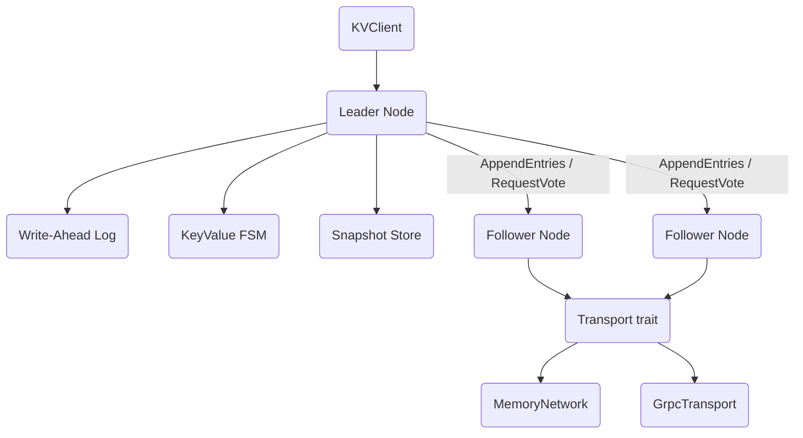

# Distributed Key-Value Store with Raft Consensus

A strongly consistent distributed key-value store built from scratch on the Raft
consensus algorithm in Rust. It provides replicated read/write operations across a
cluster of nodes with automatic leader election, a write-ahead log, snapshot-based log
compaction, and joint-consensus membership changes.

## Features

- **Full Raft state machine** — follower, candidate, and leader states with randomized
  election timeouts, term tracking, and the no-op-on-election rule (`RaftNode` / `node.rs`).
- **Log replication** — per-peer `next_index` / `match_index` tracking, conflict-index
  fast backtracking, and quorum-based commit advancement (`handle_append_entries`).
- **Pre-vote extension** — a disruption-avoiding pre-election round so a partitioned node
  cannot force term inflation (`PreVoteState`, `start_pre_vote`).
- **Check-quorum** — a leader steps down when it can no longer reach a majority of peers
  (`check_quorum`).
- **Write-ahead log** — length-prefixed, CRC32-checksummed records with crash recovery
  and segment files (`WriteAheadLog` / `storage.rs`).
- **Snapshots and compaction** — `InstallSnapshot` RPC plus FSM snapshot/restore and log
  truncation (`SnapshotStore`, `KeyValueFSM`).
- **Joint-consensus membership** — two-phase `C_old,new` then `C_new` configuration
  changes (`propose_membership_change`, `ClusterConfig::quorum_size`).
- **Pluggable transport** — one `Transport` trait with an in-process `MemoryNetwork` and a
  `tonic`-based gRPC implementation (`transport.rs`, `grpc.rs`).
- **Metrics** — counters, gauges, and a bucketed histogram for elections, replication, and
  latency (`RaftMetrics`, `Histogram`).
- **Test harness** — `TestCluster` over `MemoryNetwork` for partition and election tests.

## Architecture



| Component | Module | Responsibility |
|-----------|--------|----------------|
| Raft node | `node.rs` | Elections, log replication, commit/apply, snapshots, membership |
| Storage | `storage.rs` | `WriteAheadLog`, `KeyValueFSM`, `SnapshotStore`, `MemoryStorage` |
| Transport | `transport.rs` | `Transport` trait, in-process `MemoryNetwork`, `PeerTracker` |
| gRPC transport | `grpc.rs` | `tonic` client/server (`GrpcTransport`, `GrpcServerBuilder`) |
| RPC types | `rpc.rs` | `AppendEntries`, `RequestVote`, `InstallSnapshot`, client messages |
| Cluster | `cluster.rs` | `RaftClusterNode` event loop and `TestCluster` harness |
| Client | `client.rs` | `KVClient` with leader discovery and retry/backoff |
| Config | `config.rs` | `RaftConfig` builder and `ClusterConfig` quorum logic |
| Metrics | `metrics.rs` | `RaftMetrics`, `Histogram`, `HealthCheck` |
| Errors | `error.rs` | Unified `Error` / `Result` |

## Quick Start

### Prerequisites

- Rust stable, edition 2021 (`cargo`).
- `protoc`, the Protocol Buffers compiler — `build.rs` runs `tonic-build` against
  `proto/raft.proto` to generate the gRPC stubs at build time.

### Installation

```bash
cd 11-distributed-kv-raft
cargo build
```

### Running

This crate is a library, not a standalone binary. Drive it from tests, benchmarks, or
your own code:

```bash
cargo test          # run the full suite
cargo bench         # Criterion microbenchmarks (optional)
```

## Usage

A node is created from a `RaftConfig`, then driven through Raft RPCs. The example below
exercises the in-memory FSM and a single-node leader directly via the real public API:

```rust
use distributed_kv_raft::{Command, RaftConfig, RaftNode};

// Build a single-node configuration (no peers => quorum is 1).
let config = RaftConfig::builder().id(0).build();
let mut node = RaftNode::new(config);
node.start().unwrap();

// With no peers, a candidate immediately wins the election.
node.transition_to_candidate();
node.handle_request_vote_response(0, Default::default()); // self-vote already counted
assert!(node.is_leader());

// Propose a write; it is appended to the log on the leader.
let index = node.propose(Command::Put {
    key: b"name".to_vec(),
    value: b"raft".to_vec(),
}).unwrap();
println!("appended at log index {index}");
```

For a multi-node cluster, build one `RaftConfig` per node, wire them together over a
`MemoryNetwork`, and run them through `TestCluster` (see `cluster.rs` and `tests/`).

## What's Real vs Simulated

- **Real:** The Raft state machine (elections, log replication, commit/apply, conflict
  backtracking), pre-vote, check-quorum, the WAL with CRC checks and crash recovery, FSM
  snapshot/restore, `InstallSnapshot` handling, and joint-consensus membership are fully
  implemented. The `MemoryNetwork` transport is complete and backs the multi-node tests,
  including partition injection. The `GrpcTransport` client/server is functional and uses
  real `tonic` channels.
- **Simulated / not implemented:** `KVClient::send_request` is a stub that returns a
  success placeholder rather than performing real network I/O — it demonstrates the
  leader-discovery and retry/backoff logic, not end-to-end RPC. gRPC TLS is a
  configuration flag (`GrpcConfig::enable_tls`) only; encryption is not wired up. WAL
  `truncate_suffix` and `compact` update in-memory state and the index but do not yet
  rewrite or delete on-disk segment files.

## Testing

```bash
cargo test
```

The suite is 419 test functions across 8 files in `tests/` (plus inline `#[cfg(test)]`
modules). It covers Raft election and replication (`raft_tests.rs`), RPC handling
(`rpc_tests.rs`), WAL/FSM/snapshot storage (`storage_comprehensive_tests.rs`), the
transport layer and partitions (`transport_tests.rs`), client and config behavior
(`client_config_tests.rs`), metrics (`metrics_tests.rs`), edge cases (`edge_case_tests.rs`),
and broad integration scenarios (`comprehensive_tests.rs`). No external services are
required; multi-node tests run over the in-process `MemoryNetwork`.

## Project Structure

```
11-distributed-kv-raft/
  src/
    node.rs        # RaftNode: elections, replication, snapshots, membership
    storage.rs     # WriteAheadLog, KeyValueFSM, SnapshotStore, MemoryStorage
    transport.rs   # Transport trait, MemoryNetwork, PeerTracker
    grpc.rs        # tonic-based GrpcTransport, server builder, KV client
    rpc.rs         # Raft RPC message types
    cluster.rs     # RaftClusterNode event loop, TestCluster harness
    client.rs      # KVClient with leader discovery and retry
    config.rs      # RaftConfig builder, ClusterConfig quorum logic
    metrics.rs     # RaftMetrics, Histogram, HealthCheck
    error.rs       # Error / Result
    lib.rs         # public exports
  proto/raft.proto # gRPC service and message definitions
  tests/           # integration tests (8 files)
  benches/         # Criterion microbenchmarks
  docs/BLUEPRINT.md   # Full architecture and Raft protocol design
```

## License

MIT — see ../LICENSE
