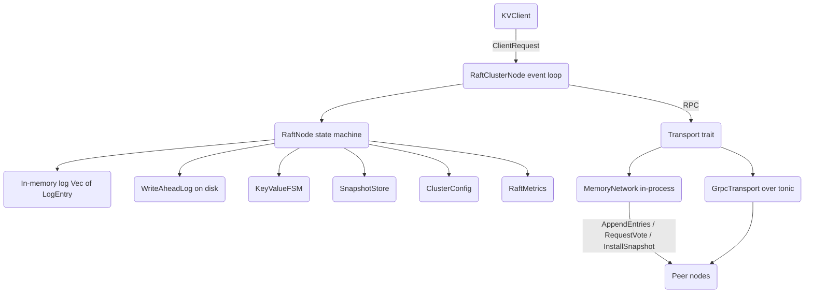

# Distributed Key-Value Store with Raft Consensus

## Overview

This project is a strongly consistent, replicated key-value store implemented from scratch
in Rust on top of the Raft consensus algorithm. Raft keeps an identical replicated log on
every node in a cluster; once an entry is committed, every node applies it to the same
deterministic state machine, so all replicas converge on the same key-value contents. The
store exposes the familiar `put` / `get` / `delete` operations, but underneath each write
is a log entry that is replicated to a majority of nodes before it is acknowledged.

The goals of the implementation are pedagogical and structural rather than
production-operational:

- **Teach the Raft protocol end to end.** Leader election, log replication, log matching
  and conflict resolution, commit-index advancement, snapshotting, and membership change
  are all implemented as separate, readable methods on `RaftNode`.
- **Show the safety-critical extensions.** Beyond the core paper, the code implements
  pre-vote (to avoid term inflation from partitioned nodes), check-quorum (so a stranded
  leader steps down), conflict-index fast backtracking, and leader leases for cheap reads.
- **Separate consensus from transport.** A single `Transport` trait abstracts message
  delivery; an in-process `MemoryNetwork` backs deterministic tests with partition
  injection, and a `tonic` gRPC implementation shows the same trait over real sockets.
- **Make durability explicit.** A write-ahead log writes length-prefixed, CRC32-checksummed
  records and recovers them on restart, and an FSM snapshot mechanism bounds log growth.

The scope is the consensus core and its supporting data structures, exercised by an
extensive test suite. It is not a turnkey server: the client-side network path is a stub,
gRPC TLS is a flag only, and on-disk log truncation is partial. Those boundaries are
called out explicitly throughout this document and in the README's "What's Real vs
Simulated" section.

The core types are concentrated in a handful of modules:

- `node.rs` — the `RaftNode` state machine and all RPC handlers.
- `storage.rs` — `WriteAheadLog`, `KeyValueFSM`, `SnapshotStore`, `MemoryStorage`.
- `transport.rs` — the `Transport` trait, `MemoryNetwork`, `PeerTracker`.
- `grpc.rs` — the `tonic`-based `GrpcTransport`, server builder, and KV client.
- `rpc.rs` — the wire message types.
- `cluster.rs` — `RaftClusterNode` (the async event loop) and the `TestCluster` harness.
- `client.rs`, `config.rs`, `metrics.rs`, `error.rs` — client, configuration, metrics, errors.

## Architecture



The system is layered:

- **Client layer (`client.rs`).** `KVClient` holds the list of node addresses, the
  currently believed leader, and retry/backoff parameters. It turns `put`/`get`/`delete`
  into a `ClientRequest` and retries against other nodes on `NotLeader` or failure. The
  actual send is a stub today; the layer demonstrates leader discovery and deduplication
  (`RequestTracker`) rather than real I/O.

- **Coordination layer (`cluster.rs`).** `RaftClusterNode` owns the async event loop. A
  `tokio::select!` multiplexes three sources: inbound `RaftMessage`s from the transport, a
  heartbeat timer (leaders replicate on every tick), and an election-check timer
  (followers/candidates start elections when their timeout elapses). It holds the
  `RaftNode` behind a `parking_lot::RwLock` and spawns per-peer tasks for replication and
  vote collection. `TestCluster` builds and runs a set of these nodes for tests.

- **Consensus layer (`node.rs`).** `RaftNode` is the pure(ish) state machine. Its methods
  take RPC requests and return responses, mutating term, vote, log, commit index, and
  state. It does not perform network I/O itself; the coordination layer feeds it messages
  and dispatches the requests it produces. This separation is what makes the protocol
  testable directly, without a network.

- **Storage layer (`storage.rs`).** The `KeyValueFSM` is the deterministic state machine
  that committed entries are applied to. The `WriteAheadLog` provides crash-durable
  persistence of log entries. The `SnapshotStore` persists FSM snapshots and supports
  chunked install. A `Storage` trait plus `MemoryStorage` give an in-memory backend for
  tests.

- **Transport layer (`transport.rs`, `grpc.rs`).** The `Transport` trait has exactly three
  methods — `send_request_vote`, `send_append_entries`, `send_install_snapshot`.
  `MemoryTransport`/`MemoryNetwork` implement it with `tokio::mpsc` channels and support
  injected partitions and delays. `GrpcTransport` implements it with cached `tonic`
  channels.

## Core Components

### RaftNode (node.rs)

`RaftNode` is the heart of the system. It holds the persistent state that Raft requires to
survive restarts (`current_term`, `voted_for`, `log`), the volatile state on all servers
(`commit_index`, `last_applied`, `state`), and the leader-only volatile state
(`next_index` / `match_index`, carried inside the `RaftState::Leader` variant).

**State transitions.** Three explicit methods drive the role machine:

- `transition_to_follower(leader_id)` resets the role to `Follower` and records the known
  leader.
- `transition_to_candidate()` increments the term, votes for self, and seeds a
  `votes_received` set containing only this node.
- `transition_to_leader()` initializes `next_index` to `last_log_index + 1` and
  `match_index` to `0` for every peer, then immediately appends a `NoOp` entry. The no-op
  is the standard Raft trick: a leader cannot directly commit entries from prior terms by
  counting replicas, but committing a fresh current-term entry indirectly commits
  everything before it.

**RequestVote.** `handle_request_vote` follows the paper's rules: reject if the
candidate's term is stale; step down and clear the vote if the term is newer; grant the
vote only if this node has not already voted for someone else this term *and* the
candidate's log is at least as up-to-date. Up-to-date is the lexicographic
`(last_log_term, last_log_index)` comparison. Granting a vote resets the election timeout
so a node that just voted does not immediately start competing.

**Vote counting.** `handle_request_vote_response` accumulates grants into the candidate's
`votes_received` set and calls `transition_to_leader()` as soon as the set reaches
`quorum_size`. A response carrying a higher term forces an immediate step-down.

**AppendEntries (follower side).** `handle_append_entries` implements the log-matching
rules: reject stale terms; adopt newer terms; always become a follower of the sender and
reset the election timeout; verify that the entry at `prev_log_index` matches
`prev_log_term`; truncate conflicting suffixes and append new entries; and advance the
commit index to `min(leader_commit, last_log_index)`, applying newly committed entries to
the FSM. On a `prev_log` mismatch it returns a `conflict_index` (and `conflict_term`) so
the leader can skip backward quickly instead of decrementing `next_index` one entry per
round trip.

**AppendEntries (leader side).** `handle_append_entries_response` updates `next_index` and
`match_index` on success, extends the leader lease, and then tries to advance the commit
index. On failure it backs `next_index` up to the follower's reported `conflict_index` (or
decrements by one as a fallback). `try_advance_commit_index` collects all `match_index`
values plus the leader's own last index, sorts them, and picks the highest index
replicated on a quorum — but only commits it if that entry belongs to the current term,
honoring the Raft safety rule about committing prior-term entries.

**Proposing and batching.** `propose(command)` appends a single current-term entry and
returns its index (leader only). `batch_propose(commands)` appends many entries in one
shot for pipelining. `write`/`read`/`delete` are thin wrappers that build the appropriate
`Command`.

**Walkthrough: the AppendEntries handler.** The follower-side handler is the densest piece
of the protocol, so it is worth tracing rule by rule. The five Raft rules map directly onto
the code:

```rust
pub fn handle_append_entries(&mut self, req: AppendEntriesRequest) -> AppendEntriesResponse {
    // Rule 1: reject a stale leader outright.
    if req.term < self.current_term {
        return AppendEntriesResponse {
            term: self.current_term, success: false,
            conflict_index: None, conflict_term: None,
        };
    }
    // Adopt a newer term and clear our vote.
    if req.term > self.current_term {
        self.current_term = req.term;
        self.voted_for = None;
    }
    // Any valid AppendEntries means a leader exists for this term: follow it.
    self.transition_to_follower(Some(req.leader_id));
    self.reset_election_timeout();

    // Rule 2: the entry at prev_log_index must match prev_log_term.
    if req.prev_log_index > 0 {
        match self.get_log_entry(req.prev_log_index) {
            None => return /* conflict_index = our log end + 1 */,
            Some(entry) if entry.term != req.prev_log_term => {
                // Report the first index of the conflicting term so the
                // leader can skip the whole region in one step.
                return /* conflict_index, conflict_term */;
            }
            _ => {}
        }
    }
    // Rule 3: truncate on conflict, then append.
    for entry in &req.entries {
        let idx = entry.index as usize;
        if idx <= self.log.len() {
            if self.log[idx - 1].term != entry.term {
                self.log.truncate(idx - 1);
                self.log.push(entry.clone());
            }
        } else {
            self.log.push(entry.clone());
        }
    }
    // Rule 5: advance commit index and apply.
    if req.leader_commit > self.commit_index {
        self.commit_index = std::cmp::min(req.leader_commit, self.last_log_index());
        self.apply_committed_entries();
    }
    AppendEntriesResponse { term: self.current_term, success: true, conflict_index: None, conflict_term: None }
}
```

Two subtleties deserve emphasis. First, the truncation in Rule 3 is conditional on a term
mismatch — an identical entry already present is left untouched, which is what makes
AppendEntries idempotent and safe to retry. Second, the conflict optimization is what keeps
catch-up cheap: instead of decrementing `next_index` by one per round trip (O(n) RPCs for a
divergence of length n), the follower returns the first index of the conflicting term, and
`handle_append_entries_response` jumps `next_index` straight there.

**Applying committed entries.** `apply_committed_entries` is the single place where the FSM
advances. It walks `last_applied` up toward `commit_index`, applying each entry exactly once
and in order:

```rust
fn apply_committed_entries(&mut self) {
    while self.last_applied < self.commit_index {
        self.last_applied += 1;
        if let Some(entry) = self.get_log_entry(self.last_applied).cloned() {
            let _ = self.fsm.apply(&entry);
        }
    }
}
```

Because every node runs this same loop against the same committed log, every FSM converges
on identical contents — the linearizability guarantee in one method.

**Commit-index advancement.** On the leader, `try_advance_commit_index` is the dual: it
gathers the `match_index` of every follower plus the leader's own last index, sorts them,
and selects the index that a quorum has reached.

```rust
fn try_advance_commit_index(&mut self) {
    if let RaftState::Leader { match_index, .. } = &self.state {
        let mut indices: Vec<LogIndex> = match_index.values().copied().collect();
        indices.push(self.last_log_index());      // include self
        indices.sort_unstable();
        let quorum_idx = indices.len() - self.config.quorum_size();
        let new_commit = indices[quorum_idx];
        if new_commit > self.commit_index {
            if let Some(entry) = self.get_log_entry(new_commit) {
                if entry.term == self.current_term { // only current-term entries
                    self.commit_index = new_commit;
                    self.apply_committed_entries();
                }
            }
        }
    }
}
```

The `entry.term == self.current_term` guard is the famous Figure-8 safety rule: a leader may
not consider a prior-term entry committed merely because it is now stored on a majority,
because such an entry could still be overwritten. It becomes committed only indirectly, once
a current-term entry above it (such as the post-election no-op) commits.

### Storage: WriteAheadLog, KeyValueFSM, SnapshotStore (storage.rs)

**KeyValueFSM** is the deterministic state machine. `apply(entry)` records the entry's
index/term and mutates a `HashMap<Vec<u8>, Vec<u8>>` according to the command: `Put`
inserts, `Delete` removes, `Get` returns the current value, `NoOp` is a no-op. Because
`apply` is deterministic and entries are applied in log order on every node, all replicas
reach identical state. `snapshot()` serializes the map with `bincode` together with the
last applied index/term; `restore(snapshot)` deserializes it back.

**WriteAheadLog** provides durability. Each record is written as
`[length: u32][crc: u32][bincode(entry)]` and the file is `sync_all`'d after a batch, so an
acknowledged append survives a crash. On startup, `recover()` scans every `*.log` segment
in order and `read_segment` replays records, stopping at the first truncated record or
CRC mismatch — exactly the failure modes a crash mid-write produces. An in-memory
`BTreeMap<LogIndex, LogPosition>` indexes records for fast lookup, and entries are also
cached in a `Vec` for iteration. New segments are created lazily with a zero-padded
base-index filename so lexicographic sort equals index order. `truncate_suffix` and
`compact` adjust the cached `Vec`, the index, and (for compaction) split the `BTreeMap`;
both currently leave on-disk segment files in place, which is a known limitation.

**SnapshotStore** persists FSM snapshots to `*.snap` files named by last-included index, so
the lexicographically last file is the newest. `load_latest()` restores it on startup.
`write_chunk(offset, data)` and `finalize()` support the chunked `InstallSnapshot` flow:
chunks are written to a temp file at the given offset, then atomically renamed into the
final snapshot path.

### Transport: trait, MemoryNetwork, PeerTracker (transport.rs)

The `Transport` trait is intentionally minimal — only the three Raft RPCs. This keeps the
consensus core agnostic of how messages travel.

`MemoryTransport` implements the trait with a `HashMap<NodeId, mpsc::Sender<RaftMessage>>`.
Sending wraps the request and a `oneshot` response channel into a `RaftMessage`, pushes it
onto the target's channel, and awaits the reply under a timeout. It also models faults: a
per-peer partition table makes `send_*` return `Error::Network` for cut peers, and an
optional `delay` sleeps before sending to simulate latency.

`MemoryNetwork` wires a set of `MemoryTransport`s together: it creates an `mpsc` channel
per node, registers every node as a peer of every other, and hands out the per-node
receivers. `create_partition(group1, group2)` cuts all cross-group links symmetrically, and
`heal_all_partitions()` clears them — this is the mechanism the chaos tests use.

`PeerTracker` tracks connection health independent of Raft: it records per-peer successes
and failures and marks a peer `Disconnected` after `max_failures` consecutive failures,
recovering it on the next success.

### gRPC transport (grpc.rs)

`GrpcTransport` implements the same `Transport` trait over `tonic`. It caches a `Channel`
per peer (`get_connection` builds one lazily with a connect timeout, reusing the cache on
subsequent calls), converts the in-crate RPC types to the generated protobuf messages,
issues the call, and invalidates the cached channel on transport errors so the next send
reconnects. The server side (`GrpcServerBuilder`, `RaftGrpcServer`, `KvGrpcServer`) bridges
inbound gRPC calls to an `mpsc` channel of `RpcMessage`, which the event loop drains. The
`proto/raft.proto` file defines two services — `RaftService` (RequestVote, AppendEntries,
InstallSnapshot) and `KVService` (Execute) — and `build.rs` runs `tonic-build` to generate
the stubs. `GrpcConfig::enable_tls` exists as a flag but TLS is not implemented.

### Cluster coordination (cluster.rs)

`RaftClusterNode` turns the synchronous `RaftNode` into a running participant. Its `run`
loop selects over inbound messages, a heartbeat tick, and an election-check tick.
`handle_message` dispatches `RequestVote`/`AppendEntries` straight to the node under a
write lock; `InstallSnapshot` and `ClientRequest` are handled here because they need to
touch the FSM and transport. `start_election` transitions to candidate then spawns a task
per peer to send `RequestVote` and feed responses back. `replicate_to_peers` builds a
tailored `AppendEntries` per peer (using that peer's `next_index`) and spawns a task per
peer to send it and apply the response. A critical detail throughout is that the `RwLock`
guard is always dropped before any `.await`, so the lock is never held across suspension
points.

`linearizable_read` shows the read-index protocol: if the leader lease is valid, read
locally; otherwise confirm leadership by exchanging `AppendEntries` with a quorum, wait
until `last_applied` reaches the saved commit index, then read from the FSM.

`TestCluster` builds a `RaftClusterNode` per config over a shared `MemoryNetwork`, starts
each in its own task, and offers `leader()` and `wait_for_leader(timeout)` helpers.

### Client (client.rs)

`KVClient` stores the cluster addresses, the believed leader, a timeout, and a retry
budget. `execute_with_retry` picks a target (the known leader, else round-robin), sends the
request, and on a `NotLeader` hint updates its leader belief and retries with exponential
backoff; on error it forgets the leader and retries. After the retry budget is exhausted it
returns `Error::ClusterUnavailable`. `RequestTracker` provides idempotency by remembering
the last `(sequence, response)` per `client_id`. The `send_request` method is a stub today.

### Configuration (config.rs)

`RaftConfig` carries the node id, listen address, peers, the randomized election-timeout
range (default 150–300 ms), heartbeat interval (default 50 ms), max entries per RPC,
snapshot threshold, data directory, and a leader-lease flag. `RaftConfigBuilder` provides a
fluent constructor. `quorum_size()` is `peers.len() / 2 + 1` over the full cluster, and
`random_election_timeout()` draws uniformly from the configured range. `ClusterConfig`
models membership for joint consensus: a `current` set and an optional `next` set, with a
`quorum_size()` that takes the max of both sub-quorums while in the joint state.

### Metrics (metrics.rs)

`RaftMetrics` aggregates atomic `Counter`s and `Gauge`s for elections, replication, RPC
counts, and state, plus three `Histogram`s for commit/apply/RPC latency. The `Histogram`
uses fixed microsecond bucket boundaries and reports an approximate mean and percentile.
`snapshot()` produces a `MetricsSnapshot` value type. `HealthCheck` summarizes a node's
role, term, indices, and peer connectivity, with an `is_healthy()` predicate. `PeerMetrics`
captures per-follower replication state, and `ClusterMetrics` keys `RaftMetrics` by node.

### Error handling (error.rs)

Every fallible operation returns `Result<T>`, an alias for `std::result::Result<T, Error>`.
`Error` is a `thiserror`-derived enum, so each variant carries a `Display` message and the
type is `Clone` (useful for fanning a single failure out to multiple waiters). The variants
map onto distinct, actionable conditions rather than a single catch-all:

- `NotLeader(Option<NodeId>)` — the request reached a non-leader; the payload is the leader
  hint the client uses to redirect.
- `QuorumNotReached` — a leadership confirmation or commit could not gather a majority.
- `ClusterUnavailable` — the client exhausted its retry budget.
- `Timeout` — an RPC or apply-wait exceeded its deadline.
- `Storage` / `Serialization` / `Network` / `Config` — wrap the underlying subsystem error
  string at the boundary where it occurs (WAL/snapshot I/O, `bincode`, transport, config).
- `LogEntryNotFound(u64)` and `InvalidStateTransition(String)` — guard against logic errors,
  e.g. starting a membership change while already in joint consensus.

Keeping `NotLeader` carry the hint is what lets the client's retry loop converge on the
leader instead of blindly round-robining: a single redirect usually suffices.

### Concurrency model

The design deliberately confines all consensus logic to a synchronous `RaftNode` and pushes
asynchrony into a thin shell. `RaftClusterNode` wraps the node in `Arc<RwLock<RaftNode>>`
(`parking_lot::RwLock`, which is not async-aware) and runs a single `tokio::select!` loop.
The invariant that makes this safe is that **the lock guard is never held across an
`.await`**: every handler reads or writes the node, derives the messages it needs to send,
drops the guard, and only then awaits the transport. The replication path makes this
concrete:

```rust
async fn replicate_to_peers(&self) {
    let peer_ids = self.node.read().peer_ids();          // guard dropped here
    for peer_id in peer_ids {
        let transport = Arc::clone(&self.transport);
        let node = Arc::clone(&self.node);
        let request = node.read().build_append_entries_request(peer_id); // and here
        let entries_count = request.entries.len();
        tokio::spawn(async move {                          // no lock held
            if let Ok(response) = transport.send_append_entries(peer_id, request).await {
                node.write().handle_append_entries_response(peer_id, response, entries_count);
            }
        });
    }
}
```

Each peer is served by its own spawned task, so a slow or partitioned follower cannot stall
replication to the others. Vote collection during an election follows the same one-task-per-
peer pattern. This keeps the consensus core trivially testable (call a method, assert state)
while still exploiting concurrency at the network edge.

## Data Structures

### Raft node state

```rust
pub struct RaftNode {
    pub config: RaftConfig,

    // Persistent state (must survive restarts)
    pub current_term: Term,
    pub voted_for: Option<NodeId>,
    pub log: Vec<LogEntry>,

    // Volatile state on all servers
    pub commit_index: LogIndex,
    pub last_applied: LogIndex,
    pub state: RaftState,

    pub cluster_config: ClusterConfig,

    // Components
    pub fsm: KeyValueFSM,
    pub storage: Option<Box<dyn Storage + Send + Sync>>,
    pub snapshot_store: Option<SnapshotStore>,

    pub last_heartbeat: Instant,

    pub pending_reads: Vec<PendingRead>,
    pub pending_writes: Vec<PendingWrite>,

    // Pre-vote and check-quorum extensions
    pub pre_vote_state: Option<PreVoteState>,
    pub enable_pre_vote: bool,
    pub enable_check_quorum: bool,
    pub last_quorum_check: Instant,
    pub peer_last_contact: HashMap<NodeId, Instant>,

    pub snapshot_last_index: LogIndex,
    pub snapshot_last_term: Term,

    pub is_running: bool,
    pub is_partitioned: bool,
}
```

The leader-only volatile state lives inside the role enum rather than as bare fields, so it
is impossible to read `next_index` unless the node is actually a leader:

```rust
pub enum RaftState {
    Follower { leader_id: Option<NodeId> },
    Candidate { votes_received: HashSet<NodeId> },
    Leader {
        lease_expiry: Option<Instant>,
        next_index: HashMap<NodeId, LogIndex>,
        match_index: HashMap<NodeId, LogIndex>,
    },
}
```

### Log entries and commands

```rust
pub struct LogEntry {
    pub term: Term,
    pub index: LogIndex,
    pub command: Command,
    pub entry_type: EntryType,
}

pub enum EntryType {
    Command,
    Configuration, // cluster membership change
    NoOp,          // leader's first entry after election
}

pub enum Command {
    Put { key: Vec<u8>, value: Vec<u8> },
    Delete { key: Vec<u8> },
    Get { key: Vec<u8> },
    NoOp,
}
```

`Term`, `LogIndex`, and `NodeId` are all `u64` type aliases declared in `lib.rs`, which
keeps signatures readable while staying primitive.

### Key-value FSM

```rust
pub struct KeyValueFSM {
    data: HashMap<Vec<u8>, Vec<u8>>,
    last_applied_index: LogIndex,
    last_applied_term: u64,
}

impl KeyValueFSM {
    pub fn apply(&mut self, entry: &LogEntry) -> ApplyResult {
        self.last_applied_index = entry.index;
        self.last_applied_term = entry.term;
        match &entry.command {
            Command::Put { key, value } => {
                self.data.insert(key.clone(), value.clone());
                ApplyResult::Success
            }
            Command::Delete { key } => {
                self.data.remove(key);
                ApplyResult::Success
            }
            Command::Get { key } => ApplyResult::Value(self.data.get(key).cloned()),
            Command::NoOp => ApplyResult::Success,
        }
    }

    pub fn snapshot(&self) -> Snapshot {
        Snapshot {
            last_included_index: self.last_applied_index,
            last_included_term: self.last_applied_term,
            data: bincode::serialize(&self.data).unwrap_or_default(),
        }
    }
}
```

### Write-ahead log record format

Each WAL record is a self-describing, checksummed frame:

```
+-------------+----------+------------------------+
| length: u32 | crc: u32 | bincode(LogEntry) ...  |
+-------------+----------+------------------------+
   4 bytes      4 bytes        length bytes
```

The in-memory index maps each log index to its byte location:

```rust
struct LogPosition {
    segment_id: u64,
    offset: u64,
    length: u32,
}
```

### Cluster configuration

```rust
pub struct ClusterConfig {
    pub current: HashSet<NodeId>,
    pub next: Option<HashSet<NodeId>>, // Some(..) while in joint consensus
}

impl ClusterConfig {
    pub fn quorum_size(&self) -> usize {
        match &self.next {
            None => self.current.len() / 2 + 1,
            Some(next) => std::cmp::max(
                self.current.len() / 2 + 1,
                next.len() / 2 + 1,
            ),
        }
    }
}
```

## API Design

### Transport trait

```rust
#[async_trait]
pub trait Transport: Send + Sync {
    async fn send_request_vote(&self, target: NodeId, request: RequestVoteRequest)
        -> Result<RequestVoteResponse>;
    async fn send_append_entries(&self, target: NodeId, request: AppendEntriesRequest)
        -> Result<AppendEntriesResponse>;
    async fn send_install_snapshot(&self, target: NodeId, request: InstallSnapshotRequest)
        -> Result<InstallSnapshotResponse>;
}
```

### RPC message types

```rust
pub struct AppendEntriesRequest {
    pub term: Term,
    pub leader_id: NodeId,
    pub prev_log_index: LogIndex,
    pub prev_log_term: Term,
    pub entries: Vec<LogEntry>, // empty for heartbeat
    pub leader_commit: LogIndex,
}

pub struct AppendEntriesResponse {
    pub term: Term,
    pub success: bool,
    pub conflict_index: Option<LogIndex>, // fast backtracking
    pub conflict_term: Option<Term>,
}

pub struct RequestVoteRequest {
    pub term: Term,
    pub candidate_id: NodeId,
    pub last_log_index: LogIndex,
    pub last_log_term: Term,
}

pub struct InstallSnapshotRequest {
    pub term: Term,
    pub leader_id: NodeId,
    pub last_included_index: LogIndex,
    pub last_included_term: Term,
    pub offset: u64,
    pub data: Vec<u8>,
    pub done: bool,
}
```

### RaftNode public surface (selected)

```rust
impl RaftNode {
    pub fn new(config: RaftConfig) -> Self;
    pub fn with_storage(config: RaftConfig, storage: Box<dyn Storage + Send + Sync>) -> Self;

    // Role transitions
    pub fn transition_to_follower(&mut self, leader_id: Option<NodeId>);
    pub fn transition_to_candidate(&mut self);
    pub fn transition_to_leader(&mut self);

    // RPC handlers
    pub fn handle_request_vote(&mut self, req: RequestVoteRequest) -> RequestVoteResponse;
    pub fn handle_append_entries(&mut self, req: AppendEntriesRequest) -> AppendEntriesResponse;
    pub fn handle_install_snapshot(&mut self, req: InstallSnapshotRequest) -> InstallSnapshotResponse;

    // Response handlers
    pub fn handle_request_vote_response(&mut self, from: NodeId, resp: RequestVoteResponse);
    pub fn handle_append_entries_response(&mut self, from: NodeId, resp: AppendEntriesResponse, entries_sent: usize);

    // Proposing
    pub fn propose(&mut self, command: Command) -> Result<LogIndex>;
    pub fn batch_propose(&mut self, commands: Vec<Command>) -> Result<Vec<LogIndex>>;

    // Snapshots and compaction
    pub fn create_snapshot(&mut self) -> Result<()>;
    pub fn maybe_create_snapshot(&mut self) -> Result<bool>;
    pub fn compact_log(&mut self, up_to: LogIndex) -> Result<()>;

    // Membership
    pub fn add_node(&mut self, node_id: NodeId) -> Result<LogIndex>;
    pub fn remove_node(&mut self, node_id: NodeId) -> Result<LogIndex>;
    pub fn propose_membership_change(&mut self, new_nodes: HashSet<NodeId>) -> Result<LogIndex>;
    pub fn finalize_membership_change(&mut self) -> Result<LogIndex>;

    // Extensions
    pub fn start_pre_vote(&mut self) -> bool;
    pub fn handle_pre_vote_request(&self, req: &RequestVoteRequest) -> RequestVoteResponse;
    pub fn handle_pre_vote_response(&mut self, from: NodeId, resp: RequestVoteResponse) -> bool;
    pub fn check_quorum(&mut self) -> bool;
}
```

### Client API

```rust
impl KVClient {
    pub fn new(cluster: Vec<NodeAddress>) -> Self;
    pub fn with_timeout(self, timeout: Duration) -> Self;
    pub fn with_retries(self, max_retries: usize) -> Self;

    pub async fn put(&mut self, key: Vec<u8>, value: Vec<u8>) -> Result<()>;
    pub async fn get(&mut self, key: &[u8]) -> Result<Option<Vec<u8>>>;
    pub async fn delete(&mut self, key: &[u8]) -> Result<()>;
}
```

### gRPC services (proto/raft.proto)

```
service RaftService {
    rpc RequestVote(RequestVoteRequest) returns (RequestVoteResponse);
    rpc AppendEntries(AppendEntriesRequest) returns (AppendEntriesResponse);
    rpc InstallSnapshot(InstallSnapshotRequest) returns (InstallSnapshotResponse);
}

service KVService {
    rpc Execute(ClientRequest) returns (ClientResponse);
}
```

## Protocol Details

### Leader election

Every follower and candidate runs an election timer. When `election_timeout_elapsed()`
returns true (the gap since `last_heartbeat` exceeds a freshly drawn random timeout in the
150–300 ms range), the node becomes a candidate: it bumps its term, votes for itself, and
sends `RequestVote` to all peers carrying its last log index/term. A peer grants its vote
only if it has not voted for anyone else this term and the candidate's log is at least as
up-to-date. When a candidate collects a quorum of grants it becomes leader and appends the
no-op entry. Randomized timeouts make split votes rare and self-correcting: when one
occurs, the nodes re-randomize and one usually times out first.

### Log replication and the matching property

A leader sends each follower an `AppendEntries` derived from that follower's `next_index`:
`prev_log_index`/`prev_log_term` identify the entry that must already match, followed by up
to `max_entries_per_rpc` new entries. The follower accepts only if its log contains a
matching entry at `prev_log_index`; otherwise it rejects and returns a `conflict_index`.
The leader uses that hint to jump `next_index` back to the start of the conflicting region
rather than decrementing one entry at a time, which makes catch-up after a long divergence
fast. Once the follower accepts, the leader advances `match_index` and recomputes the
commit index as the highest index replicated on a quorum — committing it only if that entry
is from the current term.

### Pre-vote

`start_pre_vote` runs a "dry-run" election at `current_term + 1` without actually
incrementing the term. A peer answers a pre-vote (`handle_pre_vote_request`/
`would_grant_vote`) by checking whether it *would* grant a real vote: the candidate's log
must be up-to-date and the peer must not have heard from a leader recently. Only if the
pre-vote wins a quorum does the node convert to a real candidate. This prevents a node that
was partitioned away — and has therefore inflated its term by repeatedly timing out — from
disrupting a healthy leader when it rejoins.

### Check-quorum

`check_quorum` periodically counts how many peers a leader has heard from within an
election timeout (tracked in `peer_last_contact`). If that count, including the leader
itself, falls below quorum, the leader steps down to follower. Together with pre-vote this
closes the gap where a partitioned leader keeps believing it leads while a new leader has
been elected on the majority side.

### Snapshots and compaction

When `last_applied - snapshot_last_index` exceeds the configured threshold,
`maybe_create_snapshot` triggers `create_snapshot`: it takes an FSM snapshot, persists it
via the `SnapshotStore`, records the new snapshot metadata, and compacts the log by
retaining only entries past the snapshot index. A leader that needs to bring a far-behind
follower up to date sends `InstallSnapshot` in chunks; `handle_install_snapshot` writes
each chunk and, on the final one, restores the FSM, drops superseded log entries, and fast-
forwards `commit_index`/`last_applied`.

### Membership changes (joint consensus)

`propose_membership_change` appends a `Configuration` entry describing the transitional
`C_old,new` and flips `ClusterConfig.next` to the proposed set. While `next` is `Some`,
`quorum_size` requires a majority of *both* the old and new configurations, so no decision
can be made without overlapping agreement — this is what makes the change safe across the
transition. Once the joint config commits, `finalize_membership_change` appends a second
`Configuration` entry for `C_new` and clears `next`. `add_node`/`remove_node` are
convenience wrappers that compute the target set.

### Linearizable reads

Reads do not go through the log by default. With leader leases enabled, a leader that holds
a valid lease (extended on every successful quorum `AppendEntries`) can answer reads from
its FSM directly. When the lease is not valid, the read-index protocol kicks in: save the
current commit index, confirm leadership by reaching a quorum, wait until `last_applied`
catches up to that index, then read. This guarantees the read reflects every write
acknowledged before it began.

## Performance

The repository ships Criterion microbenchmarks in `benches/raft_benchmarks.rs` covering the
components that dominate hot paths, rather than full-cluster throughput numbers:

- **Log entry serialization** — `bincode` serialize/deserialize for small, 1 KB, and 1 MB
  payloads, with throughput reported per element.
- **FSM operations** — `Put` (small and 1 KB), `Get` (hit and miss), and `Delete`.
- **FSM throughput** — sequential put/get over varying data-set sizes.
- **Snapshots** — snapshot creation and restore across data-set sizes.

These are the right things to measure because they isolate the per-entry costs that
consensus throughput is built on. End-to-end cluster throughput and recovery-time numbers
are not claimed here; the in-process `MemoryNetwork` is designed for deterministic
correctness tests, not latency measurement, and no benchmark harness produces published
cluster figures. Design choices that bound cost in the real paths include: batching via
`batch_propose` and `max_entries_per_rpc` to amortize replication; conflict-index
backtracking to make catch-up O(conflicting region) instead of O(log length); a
`BTreeMap` WAL index for fast positional lookup; and dropping the node lock before every
`.await` in the event loop so replication to different peers proceeds concurrently.

## Testing Strategy

Correctness is verified by 419 test functions across eight integration files in `tests/`,
plus inline `#[cfg(test)]` modules in `storage.rs`, `transport.rs`, and `cluster.rs`. The
multi-node tests run entirely over the in-process `MemoryNetwork`, so the suite is
deterministic and needs no external services.

**Unit-level (state machine).** `raft_tests.rs` (110 tests) and `rpc_tests.rs` (44 tests)
drive `RaftNode` directly: role transitions, vote granting under stale/newer terms and
log-freshness rules, `AppendEntries` acceptance/rejection, conflict-index computation,
commit-index advancement with the current-term safety rule, and the no-op-on-election
behavior. Because the node is a synchronous state machine, these tests assert exact state
after each RPC without any timing flakiness.

**Storage.** `storage_comprehensive_tests.rs` (35 tests) plus the inline storage tests
exercise FSM apply/get/delete, snapshot round-trips, and WAL behavior including CRC
verification and recovery from truncated or corrupted records — the exact failure modes a
crash mid-write produces.

**Transport and faults.** `transport_tests.rs` (28 tests) and the inline transport tests
cover `MemoryNetwork` construction, peer registration, symmetric partition creation and
healing, simulated delay, and the `PeerTracker` failure/recovery threshold.

**Client and configuration.** `client_config_tests.rs` (39 tests) covers `KVClient` leader
discovery and retry/backoff, `RequestTracker` deduplication, `RaftConfigBuilder`, and
`ClusterConfig` quorum math (including the joint-consensus max-of-both-quorums case).

**Metrics.** `metrics_tests.rs` (41 tests) verifies counter/gauge arithmetic, histogram
bucketing and percentile/mean estimates, the `MetricsSnapshot` view, and the `HealthCheck`
`is_healthy` predicate.

**Edge cases and integration.** `edge_case_tests.rs` (47 tests) targets boundary
conditions — empty logs, single-node clusters, index-zero handling, snapshot-vs-log
overlap. `comprehensive_tests.rs` (75 tests) assembles broader scenarios across the
components.

**Chaos-style scenarios.** Leader-failure and network-partition tests use
`TestCluster` together with `MemoryNetwork::create_partition` / `heal_all_partitions` to cut
the cluster, assert that a majority partition keeps a working leader while a minority
cannot elect one, and confirm convergence after healing.

## References

- Diego Ongaro and John Ousterhout, "In Search of an Understandable Consensus Algorithm
  (Extended Version)" — https://raft.github.io/raft.pdf
- The Raft website and visualization — https://raft.github.io/
- "Students' Guide to Raft" — https://thesquareplanet.com/blog/students-guide-to-raft/
- etcd's Raft library — https://github.com/etcd-io/raft
- TiKV's `raft-rs` — https://github.com/tikv/raft-rs
- `tonic` gRPC for Rust — https://github.com/hyperium/tonic
