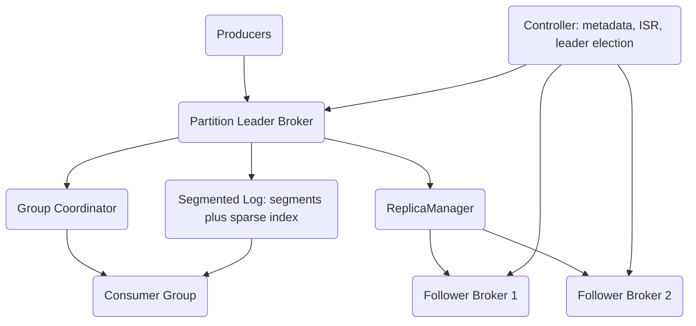

# Distributed Log System (Kafka-lite)

A high-throughput distributed commit log built from scratch in Rust, inspired by Apache Kafka. It provides durable, ordered, append-only log storage with topic partitioning, ISR-based leader/follower replication, consumer groups, and idempotent producer semantics — all backed by a segmented write-ahead log with sparse, memory-mapped offset indexes.

## Features

- **Segmented commit log** — append-only `.log` segments with sparse `.index` and `.timeindex` files, CRC32-checked records, and automatic segment rolling (`LogSegment` / `Partition` in `log.rs`).
- **Sparse offset indexing** — binary search over in-memory `IndexEntry` slices to locate a file position, then forward scan to the exact offset (`log.rs`).
- **Topic partitioning** — topics split into independent partitions, each an ordered log with its own segments, high watermark, and log-end offset (`Broker::create_topic` in `broker.rs`).
- **Leader/follower replication** — `ReplicaManager` and `ReplicaFetcher` drive a fetch-based follower loop and maintain in-sync replica (ISR) membership by lag time and lag offset (`replication.rs`).
- **Controller and leader election** — cluster metadata, broker liveness, failover, and leader election from the surviving ISR (`Controller` in `controller.rs`).
- **Producer with batching** — `RecordAccumulator` groups records per partition; key-hash or round-robin partitioning; `Acks` levels None/Leader/All (`producer.rs`).
- **Consumer and group coordination** — offset tracking, seek, commit, and a `GroupCoordinatorService` implementing join/sync/heartbeat/leave with `RangeAssignor` and `RoundRobinAssignor` strategies (`consumer.rs`, `group.rs`).
- **Idempotent producer state** — per-producer sequence tracking with epoch fencing and duplicate detection for exactly-once append semantics (`SequenceTracker` / `ProducerStateManager` in `idempotent.rs`).
- **Retention and compaction** — time/size-based segment deletion and key-based log compaction (`LogCleaner`, `LogCompactor`, `RetentionManager` in `cleaner.rs`).
- **gRPC transport** — Tokio TCP plus tonic/prost gRPC client, server, and builder (`transport.rs`, `proto/kafka.proto`).

## Architecture



| Component | Module | Responsibility |
|-----------|--------|----------------|
| Log storage | `log.rs` | Segments, sparse index, record batches, CRC, append/read |
| Broker | `broker.rs` | Partition ownership, produce/fetch handling, ISR checks, metrics |
| Replication | `replication.rs` | Leader/follower state, fetch loop, high-watermark and ISR updates |
| Controller | `controller.rs` | Cluster metadata, broker liveness, failover, leader election |
| Producer | `producer.rs` | Partitioning, record accumulation/batching, ack levels |
| Consumer | `consumer.rs` | Offset positions, commit, seek, partition assignors |
| Group coordinator | `group.rs` | Join/sync/heartbeat/leave, rebalance state machine |
| Idempotence | `idempotent.rs` | Producer sequence tracking, epoch fencing, duplicate detection |
| Cleaner | `cleaner.rs` | Retention deletion and key-based compaction |
| Protocol | `protocol.rs` | Request/response wire types and error codes |
| Transport | `transport.rs` | gRPC client/server and Tokio TCP transport |

## Quick Start

### Prerequisites

- Rust 1.75+ (edition 2021)
- No external services — tests and benchmarks run fully in-process using `tempfile` for storage.

### Installation

```bash
cd 12-distributed-log-system
cargo build
```

### Running

This crate is a library of broker, producer, and consumer components; there is no standalone binary. Exercise it through the test suite, the benchmarks, or by depending on the crate:

```bash
cargo test                  # run the full suite
cargo test -- --nocapture   # show tracing output
cargo bench                 # Criterion throughput benchmarks
```

## Usage

The example below uses the real public API: create a partition-backed broker, produce a batch, and read it back.

```rust
use distributed_log_system::{
    Broker, BrokerConfig, Producer, ProducerConfig, ProducerRecord,
    Consumer, ConsumerConfig, TopicPartition,
};

// Single in-process broker, data under a temp dir.
let mut config = BrokerConfig::default();
config.data_dir = tempfile::tempdir().unwrap().path().to_path_buf();
let broker = Broker::new(config).unwrap();
broker.create_topic("events".to_string(), 3, 1).unwrap();

// Produce: the producer accumulates records and builds a produce request.
let mut producer = Producer::new(ProducerConfig::default());
let record = ProducerRecord::new(
    "events",
    Some(b"user-42".to_vec()),
    Some(b"clicked".to_vec()),
);
producer.send(record).unwrap();
if let Some(request) = producer.build_produce_request() {
    let response = broker.handle_produce(request).unwrap();
    println!("base offset: {}", response.responses[0].base_offset);
}

// Consume: assign a partition, build a fetch request, read records.
let mut consumer = Consumer::new(ConsumerConfig::default());
consumer.assign(vec![TopicPartition::new("events", 0)]).unwrap();
let fetch = consumer.build_fetch_request();
let fetched = broker.handle_fetch(fetch).unwrap();
for partition in fetched.responses {
    for batch in partition.record_batches {
        println!("read {} records at base {}", batch.records.len(), batch.base_offset);
    }
}
```

## What's Real vs Simulated

- **Real:** Segmented log append/read with CRC32 verification and sparse memory-mapped-style index lookup; segment rolling; record-batch (de)serialization; partitioning that honors each topic's actual partition count (keyed records hash modulo the real count, so the same key always lands on the same partition and the distribution spans every partition); per-partition high watermark / log-end offset; producer batching and ack levels; consumer offset tracking, seek, and commit; range and round-robin assignors; the group-coordinator join/sync/heartbeat/leave state machine; idempotent sequence checking with epoch fencing and duplicate detection; controller metadata, broker liveness, failover, and leader election; time/size retention that unlinks segment files from disk to reclaim space; working key-based compaction that discovers candidate segments from the partition's real segment metadata and reduces each key to its latest value; multi-topic follower fetch (each `FetchPartitionResponse` carries its topic, so a follower can replicate many topics in one fetch); the protocol message types and gRPC transport. These are exercised by 181 test functions across five integration test files.
- **Simulated / incomplete:** The core produce/consume/retention/compaction paths are real. Compaction currently rewrites survivors into a working directory and reports the results (records kept/removed, bytes freed) but does not yet atomically swap the compacted segments back over the originals in place — the dedup logic and candidate discovery are complete; only the final in-place segment swap is left as a follow-up. Cluster metadata (topics, assignments, group and producer state) is in-memory and does not survive a full process restart, though the partition data on disk is durable.

## Testing

```bash
cargo test
cargo test -- --nocapture   # with tracing output
```

The suite has 181 integration test functions across `log_tests.rs` (segments, index, retention, deletion, compaction), `broker_tests.rs` (partitions, ISR, failover), `producer_consumer_tests.rs` (end-to-end produce/consume, partitioning across N partitions, assignors), `protocol_tests.rs` (wire encoding), and `integration_tests.rs` (multi-component scenarios), plus 47 unit tests inside the library modules (228 total). No external services are required; storage uses `tempfile`.

## Project Structure

```
12-distributed-log-system/
  src/
    lib.rs           # public API surface and error types
    log.rs           # segments, sparse index, record batches
    broker.rs        # partition leader, produce/fetch dispatch, metrics
    replication.rs   # ISR management, follower fetch loop
    controller.rs    # cluster metadata, liveness, leader election
    producer.rs      # batching, partitioning, ack levels
    consumer.rs      # offset management, assignors
    group.rs         # consumer-group coordinator
    idempotent.rs    # exactly-once producer state
    cleaner.rs       # retention and compaction
    protocol.rs      # request/response wire types
    transport.rs     # Tokio TCP and tonic/gRPC transport
  tests/             # 181 integration test functions across 5 files
  benches/kafka_benchmarks.rs   # Criterion throughput benchmarks
  proto/kafka.proto             # Protobuf definitions (tonic/gRPC)
  docs/BLUEPRINT.md             # full architecture and design
```

## License

MIT — see [LICENSE](../LICENSE)
