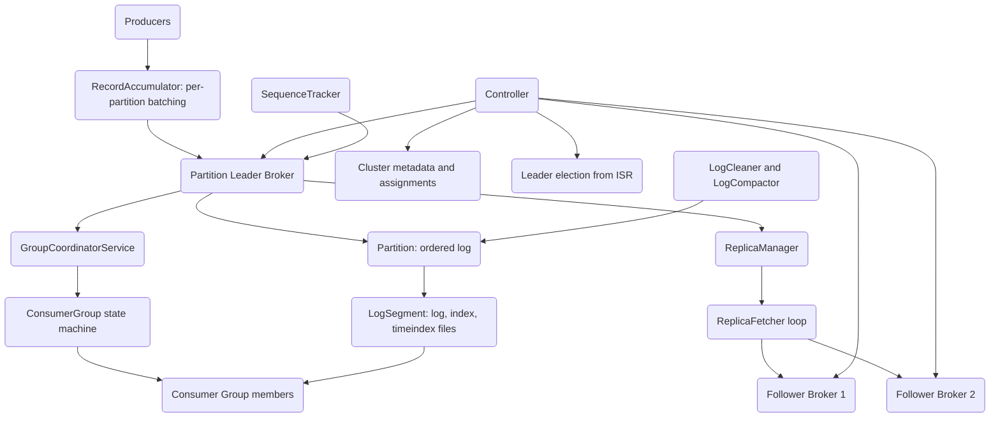

# Distributed Log System (Kafka-lite)

## Overview

This project is a distributed commit log — a durable, ordered, append-only record store — built from scratch in Rust and modeled on Apache Kafka. The central abstraction is the *log*: an immutable sequence of records, each addressed by a monotonically increasing 64-bit offset. Producers append to the tail of the log; consumers read forward from any offset they choose and track their own position. Because the log is the source of truth and reads are positional, many independent consumers can read the same data at different speeds without coordinating with producers.

A single log does not scale, so a *topic* is divided into *partitions*, each an independent log that can live on a different broker. Partitioning gives horizontal throughput (more partitions, more parallel appends and reads) and is the unit of ordering: records are ordered within a partition, not across partitions. Durability and availability come from *replication*: each partition has a leader broker that accepts writes and one or more followers that fetch and replicate the leader's log. The set of replicas that are sufficiently caught up is the *in-sync replica* (ISR) set, and the leader only advances its *high watermark* — the highest offset visible to consumers — to the minimum offset acknowledged across the ISR. If the leader fails, the controller elects a new leader from the surviving ISR, which guarantees no acknowledged write is lost.

On top of storage and replication sit two client-facing subsystems. The *consumer group* protocol lets a set of consumers share the partitions of subscribed topics, with a coordinator running a rebalance state machine (join, sync, heartbeat, leave) and assignment strategies that divide partitions among members. The *idempotent producer* protocol assigns each producer an ID and epoch and tracks per-partition sequence numbers, so the broker can reject duplicate batches and fence out stale producers — the foundation for exactly-once append semantics.

The concepts this codebase teaches are: log-structured storage with sparse indexing, the leader/follower replication and ISR model, watermark-based read visibility, controller-driven failover and leader election, consumer-group rebalancing, and idempotent/exactly-once delivery. The scope is a faithful in-process implementation of these mechanics with a gRPC transport layer; it is a teaching and exploration codebase rather than a hardened production broker. Two paths are deliberately stubbed (compaction-candidate scanning and the follower catch-up topic plumbing); the "What's Real vs Simulated" section of the README states these plainly.

A few design principles run through the whole system. *The log is the source of truth* — there is no separate state store; consumer positions, committed offsets, and replication progress are all expressed as offsets into the log. *Sequential I/O over random I/O* — appends are sequential file writes and the index exists only to turn a random read into a near-sequential one, which is what lets a disk-backed log outperform a naive random-access store. *Pull, not push, for replication and consumption* — followers fetch from leaders and consumers fetch from brokers using the same RPC, so a slow consumer or replica simply falls behind rather than overwhelming the source, and flow control is automatic. *Offsets are the universal currency* — partitioning, ordering, replication watermarks, retention, and consumer progress are all phrased in terms of a single monotonic `u64` offset per partition. Holding these four ideas in mind makes the rest of the code read as variations on a theme.

## Architecture



The system is layered. At the bottom is **storage** (`log.rs`): a `Partition` owns a `BTreeMap` of `LogSegment`s keyed by base offset, with one active segment for writes. Each segment is three files — a `.log` data file, a `.index` sparse offset index, and a `.timeindex` timestamp index — and append writes a length/CRC-framed, bincode-serialized `RecordBatch`.

Above storage is the **broker** (`broker.rs`): it owns a concurrent map of partitions (`DashMap<TopicPartition, RwLock<Partition>>`), routes `ProduceRequest`/`FetchRequest` to the right partition, enforces leadership, updates the high watermark, and records metrics. The broker also embeds a `GroupCoordinator` for consumer-group offset storage.

**Replication** (`replication.rs`) sits beside the broker. A `ReplicaManager` tracks which partitions this broker leads versus follows; for followed partitions a `ReplicaFetcher` runs a loop that builds fetch requests, sends them to leaders, and appends returned batches as a follower. The leader uses recorded follower fetch state to decide ISR membership and to advance the high watermark.

The **controller** (`controller.rs`) is the cluster brain: it registers brokers, tracks liveness via heartbeats, assigns partition leaders and replicas when topics are created, and — on broker failure — elects new leaders from the ISR and shrinks ISR sets. It builds `LeaderAndIsr` and `UpdateMetadata` requests to push state to brokers.

The **client layer** is the producer (`producer.rs`), consumer (`consumer.rs`), and group coordinator (`group.rs`). The **protocol** (`protocol.rs`) defines all request/response types and error codes; the **transport** (`transport.rs`) carries them over tonic/gRPC and Tokio TCP. **Idempotence** (`idempotent.rs`) and **retention/compaction** (`cleaner.rs`) are cross-cutting subsystems the broker invokes.

The layering is intentional and one-directional: storage knows nothing of brokers, brokers know nothing of the controller's election logic, and clients speak only the protocol. This keeps each layer independently testable — the `log.rs` tests never start a broker, the assignor tests never touch storage — and it mirrors how real log systems separate the data plane (append/fetch, which must be fast and is per-partition) from the control plane (metadata, leadership, membership, which is cluster-wide and changes rarely). The data plane is the produce/fetch path through broker and storage; the control plane is the controller and group coordinator. The two planes meet only at well-defined points: the controller hands brokers `LeaderAndIsr` assignments, and the group coordinator hands consumers partition assignments. Everything else flows along a single layer.

A useful way to read the codebase is to follow a single record: it is created as a `ProducerRecord`, accumulated into a `RecordBatch`, shipped in a `ProduceRequest`, assigned an offset and CRC-framed into a `LogSegment` by `Partition::append`, replicated to followers by the `ReplicaFetcher`, made visible once the high watermark passes it, and finally returned to a consumer inside a `FetchResponse`. Every module in `src/` is one stop on that journey.

## Core Components

### The topic, partition, and offset model

Before the individual modules, it helps to fix the three nouns the entire system is built from, because every component is ultimately a way of manipulating them.

A *topic* is a named stream of records — "events", "orders", "metrics". It is a logical name with no storage of its own. A *partition* is the physical, storable unit: one totally ordered, append-only log. A topic is split into a fixed number of partitions, and `TopicPartition { topic, partition }` is the key that identifies one partition cluster-wide. Splitting a topic into partitions is what buys horizontal scale (different partitions live on different brokers and are written and read in parallel) and is also the limit of ordering: records are ordered within a partition but there is no global order across a topic's partitions. An *offset* is a `u64` index into a partition — the position of a record in that partition's log. Offsets are dense, monotonic, and assigned by the partition leader at append time; they never change and are never reused, which is why they can serve simultaneously as a record's address, a consumer's bookmark, a replication watermark, and a retention boundary.

These three nouns appear in every module: `log.rs` stores a partition as segments of offset-addressed records; `broker.rs` maps `TopicPartition` to a partition and assigns offsets; `replication.rs` tracks per-partition log-end and high-watermark offsets; `consumer.rs` tracks per-`TopicPartition` positions and committed offsets; `controller.rs` assigns partitions to brokers; `cleaner.rs` reclaims space by offset range. Read any component as "what does it do to partitions, indexed by offset" and its role becomes clear.

### Log storage (`log.rs`)

A `Partition` is the durable unit. It holds segments in a `BTreeMap<Offset, LogSegment>` so that locating the segment for an offset is an ordered-range lookup (`segments.range(..=offset).next_back()`). Writes go to the active segment; when that segment reports `is_full()` (its position reached `max_segment_bytes`), `roll_segment` creates a new segment whose base offset is the current `log_end_offset`.

Appending a batch:

```rust
pub fn append(&mut self, batch: RecordBatch) -> Result<Offset> {
    let segment = self.segments.get_mut(&self.active_segment_offset)
        .ok_or(Error::Internal("No active segment".into()))?;
    if segment.is_full() {
        self.roll_segment()?;
    }
    let segment = self.segments.get_mut(&self.active_segment_offset).unwrap();

    let offset = self.log_end_offset;
    let mut batch = batch;
    batch.base_offset = offset;          // assign the partition-wide offset
    segment.append(&batch)?;
    self.log_end_offset = batch.last_offset() + 1;
    Ok(offset)
}
```

The on-disk record framing inside a segment is `[length: u32][crc: u32][bincode(batch)]`. On read, the length prefix is read, then the CRC, then the data; the CRC is recomputed and compared, and on mismatch the read stops with a warning rather than returning corrupt data.

Index maintenance is sparse. The segment counts `bytes_since_last_index`; once it crosses `index_interval_bytes` (default 4096) it records one `IndexEntry { relative_offset, position }` mapping an offset (relative to the segment base) to a byte position. A separate `.timeindex` records `TimeIndexEntry { timestamp, relative_offset }` whenever a new maximum timestamp is seen. The index is sparse precisely so it stays small enough to keep in memory and binary-search cheaply.

Two design decisions in the storage layer are worth calling out. First, offsets are stored *relative* to the segment base (`relative_offset: u32`) rather than absolute (`u64`); this halves index entry size and is valid because a segment never spans more than `max_segment_bytes` of records. The absolute offset is reconstructed as `base_offset + relative_offset`. Second, the index and time index are kept in memory (`index_entries: Vec<IndexEntry>`) as well as on disk: lookups never touch the index files, and the on-disk copy exists for recovery. `IndexEntry` and `TimeIndexEntry` are `#[repr(C)]` so the in-memory and on-disk byte layouts agree, which is what makes the fixed-width disk encoding and any slice-level casting sound.

The on-disk filenames embed the base offset zero-padded to twenty digits (`format!("{:020}.log", base_offset)`), so a directory listing sorts segments in offset order and the base offset is recoverable from the filename alone — the same convention Kafka uses.

The physical on-disk layout of a partition directory and a single record frame:

```
partition dir:  <data_dir>/<topic>/<partition_id>/
    00000000000000000000.log        00000000000000000000.index   00000000000000000000.timeindex
    00000000000000001000.log        00000000000000001000.index   00000000000000001000.timeindex
    ...                             (one triple per segment, named by base offset)

one record frame inside a .log file:
    +------------+------------+-----------------------------+
    | length u32 |  crc u32   |   bincode(RecordBatch)      |
    +------------+------------+-----------------------------+
    |  4 bytes   |  4 bytes   |   `length` bytes            |
    +------------+------------+-----------------------------+

one .index entry (fixed width, repr(C)):
    +--------------------+--------------+
    | relative_offset u32|  position u32|
    +--------------------+--------------+
```

The 8-byte length+CRC header is fixed and precedes every batch, so a reader can frame the stream without parsing the payload, and the CRC covers exactly the `length` payload bytes that follow it.

This framing is also what makes crash recovery tractable. Because each batch is self-describing (length, then CRC, then payload), a recovery pass can walk a `.log` file from the start, validating CRCs, until it either reaches the end or hits the first invalid frame — the point where a crash truncated a partial write. Everything before that point is intact and recoverable; the partial tail is discarded. The read path already embodies this: `LogSegment::read` stops on a short read (`read_exact` failing on the length prefix) or on a CRC mismatch, treating both as the logical end of valid data rather than an error. Durability is requested explicitly through `flush`, which calls `sync_all` on the log, index, and time-index files so the OS commits them to stable storage; the high-watermark contract means a record is only advertised to consumers after the replication layer has confirmed it, so a consumer never observes a record that a crash could later erase.

`Partition::flush` fans the flush across every segment, and `delete_segment` removes a segment from the in-memory map (the production path would also unlink the three files). The segment that is currently being written — the active segment — is the only one that grows; all earlier segments are immutable, which is what lets reads of historical data proceed without any locking against the writer beyond the per-partition `RwLock`.

### Reading by offset (`log.rs`)

A read first finds a starting file position, then scans forward:

```rust
fn find_position(&self, offset: Offset) -> Result<u64> {
    if offset < self.base_offset {
        return Err(Error::InvalidOffset(offset));
    }
    let relative_offset = (offset - self.base_offset) as u32;
    // largest index entry whose offset is <= target
    let idx = self.index_entries
        .partition_point(|e| e.relative_offset <= relative_offset);
    if idx > 0 {
        Ok(self.index_entries[idx - 1].position as u64)
    } else {
        Ok(0)
    }
}
```

`partition_point` is a binary search over the sorted in-memory `index_entries`. Because the index is sparse, the returned position may precede the target offset; the segment then reads framed batches forward, skipping batches whose `base_offset < offset`, until `max_bytes` is consumed. This two-step "binary search to a position, then linear scan" is the classic Kafka segment-read strategy, and it is why the index can be sparse without losing correctness.

The same two-step shape underlies time-based lookups. The `.timeindex` records `(timestamp, relative_offset)` whenever a segment sees a new maximum timestamp, so a query of the form "give me the first offset at or after time T" — the `ListOffsets` request with a timestamp — binary-searches the time index to a near offset, then maps to a log position and scans forward. This is what lets a consumer say "replay everything from 9am" without scanning the whole log: the timestamp index turns a time into an offset, and from there the ordinary offset path takes over. The special `ListOffsets` timestamps `-1` (latest) and `-2` (earliest) short-circuit to the partition's log-end and log-start offsets without touching the index at all.

### Broker (`broker.rs`)

The broker holds partitions in a `DashMap<TopicPartition, RwLock<Partition>>` — `DashMap` for concurrent topic-partition access, `RwLock` because a single partition's append/read must be serialized. `create_topic` materializes each partition's storage and, for simplicity in the single-broker case, sets this broker as the leader with itself as the only ISR member.

`handle_produce` walks the request's topics and partitions, checks that this broker is the assigned leader (returning `Error::NotLeader` otherwise), appends the batch, advances the high watermark to the new log-end offset (correct for a single-replica partition, where the leader's log end is committed immediately), and updates byte/message counters. `handle_fetch` reads from the partition, returns the high watermark and last-stable offset, and — when the request's `replica_id >= 0`, meaning a follower fetch — records that follower's fetch offset and timestamp in `replica_states` for later ISR evaluation.

`check_isr` is the leader-side ISR maintenance routine:

```rust
let mut new_isr = vec![self.id];          // leader is always in ISR
let now = Instant::now();
for &replica_id in &assignment.replicas {
    if replica_id == self.id { continue; }
    if let Some(state) = self.replica_states.get(&(tp.clone(), replica_id)) {
        let lag_time = now.duration_since(state.last_fetch_time);
        let lag_offset = partition.log_end_offset.saturating_sub(state.fetch_offset);
        if lag_time.as_millis() < self.config.isr_lag_time_ms as u128
            && lag_offset < self.config.isr_lag_offset {
            new_isr.push(replica_id);
        }
    }
}
```

A replica is in-sync only if it fetched recently (within `isr_lag_time_ms`, default 10s) and is within `isr_lag_offset` records (default 1000) of the leader's log end. The two-dimensional check — recency and closeness — prevents a replica that stopped fetching, or one that is far behind despite fetching, from being counted as in-sync.

The broker also owns observability. `BrokerMetrics` keeps `bytes_in`, `bytes_out`, `messages_in`, `messages_out`, `under_replicated_partitions`, and `active_connections` as `AtomicU64` counters updated on the produce/fetch paths with `Ordering::Relaxed`, and `snapshot()` reads them into a plain `MetricsSnapshot` for reporting. `under_replicated_partitions` is the single most important health signal in any replicated log: a non-zero value means some partition's ISR is smaller than its replica set, i.e. the cluster is one or more failures away from data loss on that partition. The broker further embeds a `GroupCoordinator` whose `get_or_create_group`, `commit_offsets`, and `fetch_offsets` provide the durable store for consumer-group committed offsets, keyed by `(group_id, topic-partition)` — the offsets a consumer reads back when it restarts or rebalances.

### Replication (`replication.rs`)

`ReplicaManager` partitions the broker's responsibilities into `leader_partitions` and `follower_state`, with transitions via `become_leader`/`become_follower`/`stop_replica`. For partitions it leads, `append_to_leader` writes locally; `maybe_update_isr_and_hw` recomputes ISR and advances the high watermark to the minimum acknowledged offset across ISR members. For partitions it follows, `get_follower_partitions_to_fetch` lists `(topic-partition, leader, next offset)` triples that need fetching, and `append_as_follower` applies returned batches.

A broker's role for a partition is not fixed; `become_leader` and `become_follower` are how the controller's election decisions take effect locally. `become_leader` moves the partition into `leader_partitions` and begins accepting writes and tracking remote replica state; `become_follower` records the leader and epoch in `follower_state` and starts fetching from that leader; `stop_replica` tears down either role. `RemoteReplicaState` (one per `(topic-partition, follower)` on a leader) holds the follower's last reported log-end offset and last fetch time — exactly the two values the ISR check needs. The manager exposes `leader_partitions`, `follower_partitions`, and `all_partitions` so the broker and metrics can introspect what it currently owns, and `flush_all` to force durability across every owned partition.

`ReplicaFetcher` drives the follower loop. `build_fetch_requests` groups partitions by leader broker into one `FetchRequest` each (with `replica_id` set to the follower's broker ID so the leader records follower state). Grouping by leader matters: a follower replicating ten partitions from the same leader sends one request, not ten, which is the same batching principle the producer uses applied to replication. `process_fetch_response` then appends the returned batches via `append_as_follower` and records fetch failures via `record_fetch_failure` so a leader that stops responding is eventually noticed. This is the path with a known simplification: `FetchPartitionResponse` carries only a partition number, not the topic name, so the follower reconstructs `TopicPartition` with an empty topic string as a placeholder. The README documents this as a stub.

### Replication ISR and high-watermark math (`replication.rs`)

`maybe_update_isr_and_hw` is the leader-side function that both recomputes the ISR and advances the high watermark in a single pass, and it is worth reading closely because it encodes the durability contract:

```rust
let log_end_offset = partition.log_end_offset;
let max_lag_time = Duration::from_millis(self.config.replica_lag_time_max_ms);

let mut new_isr = HashSet::new();
new_isr.insert(self.broker_id);              // leader is always in ISR

for replica_id in &assignment.replicas {
    if *replica_id == self.broker_id { continue; }
    if let Some(state) = self.remote_replicas.get(&(tp.clone(), *replica_id)) {
        let state = state.read();
        let lag_time = now.duration_since(state.last_fetch_time);
        let lag_offset = log_end_offset.saturating_sub(state.log_end_offset);
        if lag_time < max_lag_time && lag_offset < self.config.replica_lag_max_messages {
            new_isr.insert(*replica_id);
        }
    }
}

// high watermark = minimum log-end offset across the (new) ISR
let mut min_offset = log_end_offset;
for replica_id in &new_isr {
    if *replica_id == self.broker_id { continue; }
    if let Some(state) = self.remote_replicas.get(&(tp.clone(), *replica_id)) {
        min_offset = min_offset.min(state.read().log_end_offset);
    }
}
partition.high_watermark = min_offset;
```

The high watermark is the *minimum* log-end offset among ISR members, not the leader's log end. A record at offset N becomes visible to consumers only once every in-sync replica has it, which is exactly the property that makes `acks=All` safe: after a leader acknowledges an `All` write, that write sits at or below the high watermark on every ISR member, so any ISR member promoted to leader still holds it. `saturating_sub` guards against a follower transiently reporting a higher offset than the leader during races. This routine duplicates the lag check that `Broker::check_isr` performs because the two live at different layers (the manager owns `remote_replicas` keyed by `(topic-partition, broker)`, the broker owns `replica_states`); both apply the same recency-and-closeness rule.

### Controller (`controller.rs`)

The controller owns cluster-wide metadata and the failover logic. `register_broker` adds a `BrokerInfo`; `handle_heartbeat` records liveness; `check_broker_liveness` returns brokers that missed their heartbeat deadline. `try_become_controller` and `controller_epoch` model the single-controller election so that only one broker drives metadata changes at a time, and every mutating method early-returns `Error::Internal("Not controller")` if called on a non-controller.

`create_topic` assigns replicas with a round-robin walk over live brokers. For partition `p` the leader index is `p % live_brokers.len()`, and the replica set is the next `replication_factor` brokers wrapping around that index; replica zero is the leader and the initial ISR equals the full replica set. It refuses creation when fewer live brokers exist than the requested replication factor, which is the invariant that keeps every partition able to tolerate at least `replication_factor - 1` failures at birth.

`handle_broker_failure` is the heart of availability. It first marks the broker dead, then in one read pass collects the partitions the broker *led* (needing a new leader) separately from those where it was merely in the ISR (needing only an ISR shrink). It then elects leaders for the former and retains the ISR minus the failed broker for the latter:

```rust
for (tp, assignment) in &state.assignments {
    if assignment.leader == failed_broker {
        leader_elections_needed.push(tp.clone());
    } else if assignment.isr.contains(&failed_broker) {
        isr_shrinks.push((tp.clone(), assignment.clone()));
    }
}
```

`elect_leader` prefers a live ISR member; only if the ISR has no survivors does it fall back to any live replica — an *unclean* election that trades the no-data-loss guarantee for availability — and if even that fails the partition is recorded in `offline_partitions`. Every successful election bumps `leader_epoch`, which is the fencing token that lets followers and producers reject stale leaders. `under_replicated_partitions` and `offline_partitions` expose the resulting cluster health, and `build_leader_and_isr_request` / `build_update_metadata_request` produce the messages that propagate new assignments to brokers.

### Producer (`producer.rs`)

The producer batches before sending. A `RecordAccumulator` keeps a `HashMap<TopicPartition, Vec<Record>>` and per-partition byte sizes; `append` returns whether the partition's accumulated size has reached `batch_size`, and `ready_partitions` lists partitions whose batches are full. `build_produce_request` drains ready partitions into `RecordBatch`es and assembles a `ProduceRequest` with the configured `acks` level.

Batching is the single biggest throughput lever in a log system, and the accumulator is where it lives. Without batching, each record is a network round-trip and a separate framed write; with it, hundreds of records share one request, one batch header, and one CRC. The trade-off is latency: a record may wait in the accumulator until its partition's batch fills (or, in a fuller implementation, until `linger_ms` elapses). The `RecordMetadata` returned on a successful produce — topic, partition, offset, timestamp, serialized size — is the producer's acknowledgement that a specific record landed at a specific offset, which is exactly the information an exactly-once or transactional layer needs to correlate a send with its durable position.

Partition selection (`partition_for`): if a record has a key, the partition is `crc32(key) % 3`, so the same key always lands in the same partition (preserving per-key ordering); without a key, an atomic counter round-robins. The hard-coded modulus of 3 is a simplification noted in the README. Key-based partitioning is the mechanism behind per-key ordering guarantees: because all records for a key route to one partition, and a partition is a totally ordered log, a consumer sees a key's records in produce order.

The `Acks` enum maps to Kafka's wire values: `None` → 0 (fire-and-forget, lowest latency, no durability), `Leader` → 1 (wait for the leader's local append), `All` → -1 (wait for every ISR member, the strongest guarantee). The accumulator's two-level structure — a `Vec<Record>` and a running byte size per `TopicPartition` — lets `append` decide in O(1) whether a partition's batch is ready, and `ready_partitions` collect all full batches for a single multi-partition produce request, so one network round-trip can carry writes for many partitions.

### Consumer and assignors (`consumer.rs`)

The `Consumer` tracks `positions` (where it will read next) and `committed` (the last durably committed offsets) as `HashMap<TopicPartition, Offset>`. `build_fetch_request` turns the current assignment plus positions into a `FetchRequest` with `replica_id = -1` (the sentinel for a real consumer, distinguishing it from follower fetches). `seek`, `seek_to_beginning`, and `seek_to_end` reposition; `commit` snapshots positions into committed offsets.

Two `PartitionAssignor` strategies implement the trait. `RangeAssignor` groups partitions by topic, sorts them, and gives each member a contiguous range — the first `extra` members receive one additional partition so the split is balanced. Because it assigns per topic, range assignment tends to co-locate the same partition number of different topics on the same member, which is convenient for joins across co-partitioned topics. `RoundRobinAssignor` deals partitions out one at a time across all members regardless of topic, which spreads load more evenly when topics have different partition counts but does not co-locate. Both are unit-tested for even and uneven splits.

The consumer also distinguishes *position* from *committed offset*, and this distinction is the whole basis of at-least-once vs at-most-once delivery. Position is where the next fetch will read; committed offset is what a restarting consumer would resume from. If a consumer processes records and then commits, a crash between processing and commit replays the records (at-least-once); if it commits before processing, a crash loses them (at-most-once). `commit` snapshots positions into committed, and `seek`/`seek_to_beginning`/`seek_to_end` let an application override position explicitly to replay or skip. `build_fetch_request` always tags the request with `replica_id = -1`, the sentinel that tells the broker this is a real consumer and not a replicating follower, which is what keeps consumer fetches from being counted toward a partition's ISR.

### Group coordinator (`group.rs`)

`GroupCoordinatorService` runs the rebalance protocol — the mechanism by which a set of consumers agree on who reads which partitions. A `ConsumerGroup` moves through `GroupState`: `Empty` → `PreparingRebalance` → `CompletingRebalance` → `Stable`, with `Dead` for removal.

The lifecycle is a four-RPC handshake:

1. **JoinGroup.** `handle_join_group` adds the member and, from `Empty` or `Stable`, moves the group to `PreparingRebalance`. The coordinator waits for all known members to (re)join or for a join timeout (`DelayedJoin` carries a per-member deadline). When the membership settles, it picks one member as the group leader, bumps the `generation_id`, and returns the full member list to the leader only. While the rebalance is in flight, late joiners receive a pending response rather than a final assignment.
2. **SyncGroup.** The elected leader computes assignments (using an assignor such as range or round-robin) and sends them; `handle_sync_group` stores the per-member assignment and, once the leader has synced, transitions the group to `CompletingRebalance` then `Stable`, handing each member its slice of partitions. Non-leader members send an empty SyncGroup and block until the leader's assignment is available.
3. **Heartbeat.** `handle_heartbeat` keeps a member alive within its session timeout and is the channel by which the coordinator signals a fresh rebalance — it returns `REBALANCE_IN_PROGRESS` so the member knows to rejoin.
4. **LeaveGroup.** `handle_leave_group` removes a member and triggers a rebalance so the departed member's partitions are redistributed.

Generation IDs are the fencing mechanism: every successful rebalance increments the generation, and any request carrying a stale generation is rejected with `ILLEGAL_GENERATION`. This prevents a slow member that missed a rebalance from committing offsets or fetching under an assignment that no longer holds. `UNKNOWN_MEMBER_ID` and `NOT_COORDINATOR` cover the other two failure modes — an unrecognized member and a request sent to the wrong coordinator.

### Idempotence (`idempotent.rs`)

`SequenceTracker` maintains a `ProducerState` per producer ID: current epoch, last sequence, last offset, and a bounded ring of recent batch metadata. `check_sequence` is the decision function:

```rust
// New producer: valid only if it starts at sequence 0.
// Lower epoch than recorded: Fenced (a newer producer instance exists).
// Matching recent batch first_sequence: Duplicate (return existing offset).
// New epoch: expect sequence 0.
// Same epoch: expect last_sequence + 1, else OutOfOrder { expected }.
```

The four outcomes — `Valid`, `Duplicate`, `OutOfOrder`, `Fenced` — give exactly-once append semantics: duplicates from producer retries are rejected and report the original offset, out-of-order batches are refused, and an old producer epoch is fenced so a zombie producer cannot interleave writes. The actual decision order in `check_sequence` matters:

- A *new* producer (no recorded state) is valid only if its first sequence is 0; anything else is `OutOfOrder { expected: 0 }`. This is what forces a producer to start its sequence at the beginning.
- A *lower* epoch than the recorded one is immediately `Fenced`. Epoch is the zombie-fencing token: when a producer restarts and re-registers it gets a higher epoch, and any in-flight batch from the previous incarnation now carries a stale epoch and is rejected.
- A first sequence matching one already in `recent_batches` is a `Duplicate`, and the response returns the *original* offset, so a retried-but-already-committed batch reports success with the correct offset rather than appending twice.
- A *higher* epoch expects sequence 0 (a fresh producer instance); the *same* epoch expects exactly `last_sequence + 1`, otherwise `OutOfOrder { expected }`. The strict +1 rule is what guarantees in-order, gap-free appends per producer.

`recent_batches` is a bounded window (default five) so duplicate detection runs in constant memory; a retry beyond the window falls through to the sequence-order check rather than the duplicate check. `ProducerStateManager` allocates `(producer_id, epoch)` pairs via `allocate_producer_id` and fans `check_and_update` across partitions; `IdempotentProducer` is the client-side handle that stamps batches with the producer ID, epoch, and next sequence via `prepare_batch`, and exposes `next_sequence`/`current_sequence`/`reset_sequence` for per-partition sequence bookkeeping.

### Retention and compaction (`cleaner.rs`)

There are two distinct cleanup policies, captured by `CleanupPolicy`. *Delete* retention discards whole old segments; *compact* retention keeps the latest value per key. `RetentionManager` and `LogCleaner` implement deletion: a segment is eligible if it is older than `retention_ms`, and beyond that the oldest segments are deleted until total size falls under `retention_bytes`. Because retention operates at segment granularity, reclaiming space is a file delete, not a rewrite of live data — which is the whole reason the log is segmented in the first place.

`LogCompactor` implements key-based compaction, the log-as-changelog model where only the most recent value for each key matters:

1. Scan all segments building an `offset_map: HashMap<key, latest_offset>`.
2. Rewrite the segments keeping a record only if its offset equals the key's latest offset in the map, and dropping records whose value is `None` (tombstones), which is how a key is logically deleted.
3. Swap the rewritten segments in for the originals.

Records without a key are always kept, since compaction is meaningless without a key to dedupe on. The candidate-scanning entry point `LogCleaner::get_segment_metadata` currently returns an empty list (a documented stub), so `cleanable_ratio` reports nothing to clean until that is wired to the partition's segment set; the compaction *algorithm* itself is implemented, only the trigger that feeds it segment metadata is stubbed.

### Protocol and transport (`protocol.rs`, `transport.rs`)

`protocol.rs` defines `Request`/`Response` enums covering Produce, Fetch, ListOffsets, Metadata, OffsetCommit/Fetch, and the group RPCs (JoinGroup, SyncGroup, Heartbeat, LeaveGroup), plus an `error_codes` module mirroring Kafka's numeric codes. The request and response enums are deliberately symmetric — one response variant per request variant — so a dispatcher can match on the request and is guaranteed a corresponding response shape. All types derive `Serialize`/`Deserialize`, and every response carries a `throttle_time_ms` field and (where applicable) an `error_code`, mirroring Kafka's convention that errors are returned as data rather than as transport failures, so a single batched request can succeed for some partitions and fail for others.

The error codes are not arbitrary: they are the numeric values a remote client needs to take the right recovery action. `NOT_LEADER_FOR_PARTITION (6)` tells a producer to refresh metadata and retry against the new leader; `NOT_ENOUGH_REPLICAS (19)` and `NOT_ENOUGH_REPLICAS_AFTER_APPEND (20)` tell an `acks=All` producer the write could not be made durable; `ILLEGAL_GENERATION (22)` and `REBALANCE_IN_PROGRESS (27)` drive a consumer to rejoin its group; `NOT_COORDINATOR (16)` tells a client to find the right coordinator. Encoding the recovery semantics in the code, rather than in prose, is what lets clients be written generically.

`transport.rs` provides `BrokerClient`, `GroupCoordinatorClient`, a `BrokerHandler` trait, a `BrokerGrpcServer`, and a `KafkaServerBuilder` that serves over tonic/gRPC, with the protobuf schema in `proto/kafka.proto` compiled by `build.rs`. The `BrokerHandler` trait is the seam between transport and logic: the gRPC server (`BrokerGrpcServer<H: BrokerHandler>`) is generic over any handler, so the same wire layer can front a real `Broker`, a test double, or a routing proxy without change. `KafkaServerBuilder::serve` and `serve_with_shutdown` start the async server, the latter taking a shutdown signal for graceful teardown. Keeping the transport generic over the handler is what allows the broker logic to be unit-tested entirely in-process, with the gRPC path exercised separately.

### End-to-end request flows

**Produce.** A producer call to `send` resolves the partition (key hash or round-robin), converts the public `ProducerRecord` into an internal `Record`, and appends it to the `RecordAccumulator`. When a partition's accumulated bytes reach `batch_size`, `build_produce_request` drains the ready partitions into `RecordBatch`es and emits a `ProduceRequest` carrying the `acks` level. The broker's `handle_produce` checks leadership, calls `Partition::append` (which assigns the partition-wide offset, rolls the segment if full, writes the framed-and-CRC'd batch, and advances `log_end_offset`), updates the high watermark, and returns the base offset. With replication, `maybe_update_isr_and_hw` is what actually advances the watermark once followers have caught up; without it, the single-replica leader commits immediately.

**Fetch.** A consumer's `build_fetch_request` turns its assignment plus current positions into a `FetchRequest` with `replica_id = -1`. The broker's `handle_fetch` locates the partition, runs `find_position` (binary search over the sparse index) to a starting byte offset, scans framed batches forward verifying CRC until `max_bytes`, and returns them with the partition's high watermark and last-stable offset. The consumer reads only up to the high watermark in spirit (uncommitted records are not advertised), then advances its position past the last consumed offset. A *follower* fetch is the same RPC with `replica_id >= 0`, which additionally records the follower's fetch offset and timestamp for the leader's ISR computation.

**Failover.** When the controller detects a dead broker via `check_broker_liveness`, `handle_broker_failure` elects a new leader from each affected partition's ISR, bumps the leader epoch, and shrinks ISRs elsewhere. Producers and followers carrying the old epoch are fenced, so writes converge on the new leader without data loss as long as one ISR member survived.

### Concurrency and error model

Concurrency is deliberately partition-scoped. The broker stores partitions in `DashMap<TopicPartition, RwLock<Partition>>`: `DashMap` shards the outer map so lookups on different topic-partitions do not contend, while the inner `RwLock` serializes the append/read of a single partition (an append must see a consistent `log_end_offset` and active segment). Assignments and replica state live in their own `DashMap`s. Metrics are plain atomics updated with `Ordering::Relaxed`, since exact ordering across counters is not needed for monitoring. The replication manager uses `parking_lot::RwLock` around per-replica state for the same reason.

Errors are values, not panics: every fallible operation returns `Result<T, Error>` with a `thiserror`-derived enum. Storage faults surface as `Error::Io`; a bincode failure becomes `Error::Serialization`; routing a write to the wrong broker yields `Error::NotLeader`; an unknown partition yields `Error::PartitionNotFound`. On the wire, these map to the numeric `error_codes` so a remote caller sees, for example, `NOT_LEADER_FOR_PARTITION = 6` rather than an opaque failure. A CRC mismatch during a read is treated as end-of-valid-data: the read stops and logs a warning rather than propagating corrupt records, which keeps a single damaged batch from poisoning an entire fetch.

### Design trade-offs and known limitations

Several choices in this codebase trade fidelity for clarity, and naming them makes the gap to a production broker explicit:

- **Fixed three-partition hashing.** `Producer::partition_for` uses `% 3` rather than reading the actual partition count from metadata. The mechanism (key hash for stickiness, counter for round-robin) is real; only the partition count is hard-coded. A production producer would fetch the topic's partition count and hash modulo that.
- **Follower fetch topic plumbing.** `FetchPartitionResponse` carries a partition number but not the topic, so `ReplicaFetcher::process_fetch_response` reconstructs `TopicPartition` with an empty topic string. This is the documented replication stub: it works for the single-topic scenarios the tests drive but would need the topic threaded through the response to support a follower replicating many topics at once.
- **Compaction trigger stub.** The compaction algorithm in `LogCompactor` is complete, but `LogCleaner::get_segment_metadata` returns an empty list, so nothing schedules compaction automatically. Wiring it to `Partition`'s segment set is the missing piece.
- **High watermark in the single-broker path.** `Broker::handle_produce` advances the high watermark to the log-end offset immediately, which is correct only when the partition has one replica. The replicated path goes through `ReplicaManager::maybe_update_isr_and_hw`, which applies the true minimum-across-ISR rule.
- **In-memory metadata.** Topic, assignment, group, and producer state live in memory; there is no metadata log or quorum store, so cluster metadata does not survive a full restart. The partition data itself *is* durable on disk.

None of these affect the produce/consume hot path that the bulk of the tests exercise; they are the edges where a teaching implementation stops short of a production one.

## Data Structures

### Record batch and record (`log.rs`)

```rust
pub struct RecordBatch {
    pub base_offset: Offset,             // first offset in this batch
    pub batch_length: u32,
    pub partition_leader_epoch: u32,     // leader epoch when written
    pub magic: u8,                       // format version (2)
    pub crc: u32,
    pub attributes: u16,                 // compression, timestamp type
    pub last_offset_delta: u32,
    pub base_timestamp: Timestamp,
    pub max_timestamp: Timestamp,
    pub producer_id: i64,                // -1 when not idempotent
    pub producer_epoch: i16,
    pub base_sequence: u32,
    pub records: Vec<Record>,
}

pub struct Record {
    pub attributes: u8,
    pub timestamp_delta: i64,            // relative to batch base
    pub offset_delta: u32,               // relative to batch base
    pub key: Option<Vec<u8>>,
    pub value: Option<Vec<u8>>,          // None value = tombstone
    pub headers: Vec<Header>,
}

pub struct Header {
    pub key: String,
    pub value: Vec<u8>,
}
```

Records store deltas relative to the batch base for offset and timestamp, so a batch of N records needs only one absolute base offset and one base timestamp. `last_offset()` returns `base_offset + last_offset_delta`.

### Partition and segment (`log.rs`)

```rust
pub struct Partition {
    pub topic: String,
    pub partition_id: u32,
    dir: PathBuf,
    segments: BTreeMap<Offset, LogSegment>,   // base_offset -> segment
    active_segment_offset: Offset,
    config: SegmentConfig,
    pub leader_epoch: u32,
    pub high_watermark: Offset,               // committed across ISR
    pub log_end_offset: Offset,               // last appended + 1
    pub isr: HashSet<BrokerId>,
    pub leader: Option<BrokerId>,
}

pub struct LogSegment {
    pub base_offset: Offset,
    dir: PathBuf,
    log_file: File,                           // framed record data
    index_file: File,                         // sparse offset index
    time_index_file: File,                    // timestamp index
    position: u64,                            // current write position
    max_timestamp: Timestamp,
    config: SegmentConfig,
    bytes_since_last_index: u64,
    index_entries: Vec<IndexEntry>,           // in-memory sparse index
}
```

### Index entries (`log.rs`)

```rust
#[repr(C)]
pub struct IndexEntry {
    pub relative_offset: u32,   // offset relative to segment base
    pub position: u32,          // byte position in .log file
}

#[repr(C)]
pub struct TimeIndexEntry {
    pub timestamp: Timestamp,
    pub relative_offset: u32,
}
```

Both are `#[repr(C)]` so their byte layout is stable for fixed-width on-disk encoding and slice casting.

### Segment configuration (`log.rs`)

```rust
pub struct SegmentConfig {
    pub max_segment_bytes: u64,      // default 1 GiB -> triggers roll
    pub index_interval_bytes: u64,   // default 4096 -> sparse index density
}
```

### Producer state (`idempotent.rs`)

```rust
pub struct ProducerState {
    pub producer_id: ProducerId,        // i64
    pub producer_epoch: ProducerEpoch,  // i16, fencing
    pub last_sequence: SequenceNumber,  // i32
    pub last_offset: Offset,
    pub last_timestamp: Instant,
    pub recent_batches: Vec<BatchMetadata>,   // bounded duplicate window
}

pub enum SequenceCheckResult {
    Valid,
    Duplicate { existing_offset: Offset },
    OutOfOrder { expected: SequenceNumber },
    Fenced { current_epoch: ProducerEpoch },
}
```

### Broker assignment and replica state (`broker.rs`)

```rust
pub struct PartitionAssignment {
    pub leader: BrokerId,
    pub replicas: Vec<BrokerId>,
    pub isr: Vec<BrokerId>,
    pub leader_epoch: u32,
}

pub struct ReplicaState {
    pub fetch_offset: Offset,        // follower's next offset
    pub last_fetch_time: Instant,    // for ISR recency check
}
```

### Group state (`group.rs`, `broker.rs`)

```rust
pub enum GroupState {
    Empty,
    PreparingRebalance,
    CompletingRebalance,
    Stable,
    Dead,
}

pub struct MemberMetadata {
    pub member_id: String,
    pub client_id: String,
    pub client_host: String,
    pub session_timeout_ms: u32,
    pub subscriptions: Vec<String>,
}
```

`GroupState` is a five-state machine; the legal transitions are `Empty -> PreparingRebalance` (first join), `PreparingRebalance -> CompletingRebalance` (all members joined, leader elected), `CompletingRebalance -> Stable` (leader synced assignments), `Stable -> PreparingRebalance` (a member joined or left), and any state `-> Dead` (group emptied and removed). `MemberMetadata` carries the per-member session timeout that the coordinator uses to expire a member that stops heartbeating, and the subscription list that the leader's assignor consumes.

### Controller and cluster state (`controller.rs`)

```rust
pub struct PartitionAssignment {   // re-used from broker.rs
    pub leader: BrokerId,
    pub replicas: Vec<BrokerId>,
    pub isr: Vec<BrokerId>,
    pub leader_epoch: u32,
}

pub struct BrokerInfo {
    pub id: BrokerId,
    pub host: String,
    pub port: u32,
    pub rack: Option<String>,
    pub is_alive: bool,
    // last-heartbeat bookkeeping for liveness
}

pub enum ControllerElectionState {
    // models which broker currently holds the controller role
}
```

`is_alive` on `BrokerInfo` is the liveness flag `handle_broker_failure` flips, and `rack` is the rack-awareness hook the replica selector can use to spread replicas across failure domains. `LeaderAndIsrRequest` and `UpdateMetadataRequest` (with their per-partition state sub-structs) are the controller-to-broker control-plane messages that carry new leadership and metadata after an election or topic change.

### Retention and compaction types (`cleaner.rs`)

```rust
pub enum CleanupPolicy {
    Delete,    // time/size retention: drop whole old segments
    Compact,   // key-based: keep latest value per key
}

pub struct SegmentMetadata {
    pub size: u64,
    pub cleanable_bytes: u64,
    // base offset and modification time for retention decisions
}

pub struct CleanResult {
    pub segments_deleted: usize,
    pub bytes_freed: u64,
}
```

`CleanupPolicy` selects between the two reclamation models; `SegmentMetadata` is what `cleanable_ratio` would consume to decide whether a partition is worth compacting (and is the structure the stubbed `get_segment_metadata` is meant to populate); `CleanResult` and `CleanerStats` report what a cleaning pass accomplished.

## Configuration

Every subsystem carries a config struct with `Default` implementations drawn from the source, so the system runs out of the box and each knob is tunable in isolation.

`BrokerConfig` (`broker.rs`) defaults to listen address `127.0.0.1:9092`, data directory `/tmp/kafka-lite`, replication factor 3, three partitions, the default `SegmentConfig`, an ISR lag-time threshold of 10,000 ms, and an ISR lag-offset threshold of 1,000 records. The two ISR thresholds are the tuning surface for the durability/latency trade-off: lower them and slow replicas are dropped from the ISR sooner (faster writes, weaker durability); raise them and the ISR tolerates more lag.

`SegmentConfig` (`log.rs`) defaults to `max_segment_bytes = 1 GiB` (when the active segment reaches this it rolls) and `index_interval_bytes = 4096` (one index entry per 4 KiB of records). A smaller interval means a denser index — faster lookups, shorter forward scans, more memory; a larger interval is the reverse.

`ProducerConfig` (`producer.rs`) defaults to `acks = Leader`, a 30,000 ms timeout, `batch_size = 16384`, `linger_ms = 0`, `max_request_size = 1 MiB`, idempotence disabled, and three retries. `batch_size` and `linger_ms` govern the throughput/latency trade-off: larger batches and a non-zero linger amortize per-request overhead at the cost of added latency.

`ConsumerConfig` (`consumer.rs`) defaults to auto-commit on with a 5,000 ms interval, a 30,000 ms session timeout, a 3,000 ms heartbeat interval, `max_poll_records = 500`, `fetch_min_bytes = 1`, `fetch_max_bytes = 50 MiB`, `fetch_max_wait_ms = 500`, and `auto_offset_reset = Latest`. The fetch min-bytes/max-wait pair implements long-poll batching: a fetch waits up to `fetch_max_wait_ms` for at least `fetch_min_bytes` to accumulate before returning.

`IdempotentConfig` (`idempotent.rs`) defaults to 1,000 tracked producers per partition, a seven-day producer-state expiry, a five-batch duplicate-detection window per producer, and strict sequence checking enabled. The five-batch window bounds the memory each producer's state consumes while still catching the realistic case of a producer retrying its most recent in-flight batches.

## API Design

### Library exports (`lib.rs`)

The crate re-exports its public surface so callers depend on `distributed_log_system::*`:

```
Broker, BrokerConfig, BrokerId, BrokerMetrics
Producer, ProducerConfig, ProducerRecord, RecordMetadata, Acks
Consumer, ConsumerConfig, ConsumerRecord, ConsumerGroup
Controller, ControllerConfig, BrokerInfo, ClusterState
GroupCoordinatorService, GroupCoordinatorConfig
LogSegment, Partition, RecordBatch, SegmentConfig, TopicPartition, IndexEntry, TimeIndexEntry
ReplicaManager, ReplicaFetcher, ReplicationConfig
IdempotentProducer, ProducerStateManager, SequenceTracker
LogCleaner, LogCompactor, RetentionManager, CleanerConfig, CleanupPolicy
Request, Response, ProduceRequest, ProduceResponse, FetchRequest, FetchResponse
BrokerClient, BrokerHandler, GroupCoordinatorClient, KafkaServerBuilder, TransportConfig
```

`Offset = u64`, `Timestamp = i64`, and a `thiserror`-derived `Error` with variants for IO, serialization, invalid offset, missing topic/partition, not-leader, broker-unavailable, consumer-group, and replication failures, with `Result<T> = std::result::Result<T, Error>`.

### Core broker methods (`broker.rs`)

```rust
impl Broker {
    pub fn new(config: BrokerConfig) -> Result<Self>;
    pub fn create_topic(&self, name: String, partitions: u32, replication_factor: u32) -> Result<()>;
    pub fn handle_produce(&self, request: ProduceRequest) -> Result<ProduceResponse>;
    pub fn handle_fetch(&self, request: FetchRequest) -> Result<FetchResponse>;
    pub fn check_isr(&self, tp: &TopicPartition);
    pub fn leader_for(&self, tp: &TopicPartition) -> Option<BrokerId>;
    pub fn is_leader_for(&self, tp: &TopicPartition) -> bool;
    pub fn get_partition_info(&self, tp: &TopicPartition) -> Option<PartitionInfo>;
    pub fn list_topics(&self) -> Vec<String>;
    pub fn get_topic(&self, name: &str) -> Option<TopicMetadata>;
}
```

### Producer and consumer methods

```rust
impl Producer {
    pub fn new(config: ProducerConfig) -> Self;
    pub fn send(&mut self, record: ProducerRecord) -> Result<TopicPartition>;
    pub fn build_produce_request(&mut self) -> Option<ProduceRequest>;
    pub fn flush(&mut self) -> Vec<TopicPartition>;
}

impl Consumer {
    pub fn new(config: ConsumerConfig) -> Self;
    pub fn subscribe(&mut self, topics: Vec<String>) -> Result<()>;
    pub fn assign(&mut self, partitions: Vec<TopicPartition>) -> Result<()>;
    pub fn build_fetch_request(&self) -> FetchRequest;
    pub fn update_position(&mut self, tp: &TopicPartition, offset: Offset);
    pub fn commit(&mut self) -> Result<HashMap<TopicPartition, Offset>>;
    pub fn seek(&mut self, tp: TopicPartition, offset: Offset);
    pub fn assignment(&self) -> &[TopicPartition];
}
```

### Replication and controller methods

```rust
impl ReplicaManager {
    pub fn become_leader(&self, /* ... */) -> Result<()>;
    pub fn become_follower(&self, /* ... */) -> Result<()>;
    pub fn append_to_leader(&self, tp: &TopicPartition, batch: RecordBatch) -> Result<Offset>;
    pub fn append_as_follower(&self, /* ... */) -> Result<()>;
    pub fn maybe_update_isr_and_hw(&self, tp: &TopicPartition) -> Result<bool>;
    pub fn get_follower_partitions_to_fetch(&self) -> Vec<(TopicPartition, BrokerId, Offset)>;
}

impl Controller {
    pub fn register_broker(&self, info: BrokerInfo) -> Result<()>;
    pub fn handle_heartbeat(&self, broker_id: BrokerId) -> Result<()>;
    pub fn check_broker_liveness(&self) -> Result<Vec<BrokerId>>;
    pub fn handle_broker_failure(&self, failed_broker: BrokerId) -> Result<()>;
    pub fn elect_leader(&self, tp: &TopicPartition) -> Result<Option<BrokerId>>;
    pub fn create_topic(&self, /* name, partitions, replication */) -> Result<()>;
    pub fn under_replicated_partitions(&self) -> Vec<TopicPartition>;
}
```

### Group coordinator and idempotence methods

```rust
impl GroupCoordinatorService {
    pub fn handle_join_group(&self, request: JoinGroupRequest) -> JoinGroupResponse;
    pub fn handle_sync_group(&self, request: SyncGroupRequest) -> SyncGroupResponse;
    pub fn handle_heartbeat(&self, request: HeartbeatRequest) -> HeartbeatResponse;
    pub fn handle_leave_group(&self, request: LeaveGroupRequest) -> LeaveGroupResponse;
}

impl SequenceTracker {
    pub fn check_sequence(&self, id: ProducerId, epoch: ProducerEpoch,
                          first_sequence: SequenceNumber) -> SequenceCheckResult;
    pub fn check_and_update(&self, /* id, epoch, seq, offset */) -> SequenceCheckResult;
    pub fn producer_count(&self) -> usize;
}

impl IdempotentProducer {
    pub fn allocate(manager: &ProducerStateManager, enabled: bool) -> Self;
    pub fn next_sequence(&self, tp: &TopicPartition) -> SequenceNumber;
    pub fn prepare_batch(&self, tp: &TopicPartition, batch: &mut RecordBatch);
}
```

Each `handle_*` method returns a fully-formed response (never a `Result`); failures are conveyed through the response's `error_code`, consistent with the wire convention. `prepare_batch` is the single call a client makes to stamp a batch with producer ID, epoch, and the next per-partition sequence before sending it, which is what lets the broker's `SequenceTracker` deduplicate and order it on arrival.

### Wire protocol (`protocol.rs`)

The `Request`/`Response` enums enumerate every RPC. The produce/fetch pair is the hot path:

```rust
pub struct ProduceRequest {
    pub transactional_id: Option<String>,
    pub acks: i16,                        // 0 | 1 | -1
    pub timeout_ms: u32,
    pub topic_data: Vec<TopicProduceData>,
}

pub struct FetchRequest {
    pub replica_id: i32,                  // -1 consumer, >=0 follower broker id
    pub max_wait_ms: u32,
    pub min_bytes: u32,
    pub max_bytes: u32,
    pub isolation_level: i8,
    pub session_id: i32,
    pub session_epoch: i32,
    pub partitions: Vec<FetchPartition>,
}
```

Error codes in `protocol::error_codes` mirror Kafka, e.g. `NOT_LEADER_FOR_PARTITION = 6`, `NOT_ENOUGH_REPLICAS = 19`, `ILLEGAL_GENERATION = 22`, `REBALANCE_IN_PROGRESS = 27`, `NOT_COORDINATOR = 16`.

## Performance

Design choices target high append and read throughput rather than any fixed published number; the only measured numbers come from the Criterion suite in `benches/kafka_benchmarks.rs`, which benchmarks record-batch serialize/deserialize across batch sizes (10/100/1000 records), producer record creation and `send`, producer throughput, topic-partition hashing/cloning, CRC32 over 100 B / 1 KiB / 1 MiB, idempotent sequence checks, protocol message construction/serialization, and partition creation. Run `cargo bench` to produce concrete figures on a given machine; this document does not assert throughput targets the code has not been measured against.

The structural properties that make those operations cheap:

- **Append is sequential.** Writes go to the active segment's `.log` file in append mode, the access pattern disks (and the OS page cache) handle best. The per-record overhead is an 8-byte length+CRC frame plus the bincode payload.
- **Sparse indexing bounds memory and lookup cost.** One index entry per `index_interval_bytes` (4096) keeps `index_entries` small; an offset lookup is a `partition_point` binary search (O(log n) over a short vector) followed by a bounded forward scan limited by `max_bytes`.
- **Segment rolling caps file size and makes retention cheap.** Old data is whole `.log`/`.index`/`.timeindex` file groups, so retention deletes by file rather than rewriting live data.
- **Concurrency is partition-scoped.** `DashMap` shards topic-partition access and a per-partition `RwLock` serializes only that partition's append/read, so unrelated partitions proceed in parallel. Metrics use relaxed atomics to avoid contention.
- **Delta encoding shrinks batches.** Per-record offset and timestamp deltas mean a batch stores one absolute base of each, reducing serialized size for large batches.
- **CRC verification is per batch, not per record**, amortizing integrity checking over a whole batch read.

The high-watermark rule (advance only to the minimum ISR-acknowledged offset) trades a small replication latency for the durability guarantee that consumers never see an uncommitted record. The ISR lag thresholds (`isr_lag_time_ms`, `isr_lag_offset`) tune how aggressively slow replicas are dropped to keep the write path fast.

### Complexity of the hot paths

- **Append:** O(1) amortized. Writing a batch is a sequential file write plus at most one index-entry append; the only non-constant work is the occasional segment roll, which is O(1) file creation.
- **Offset lookup:** O(log s) where s is the number of in-memory index entries in the target segment (a `partition_point` binary search), plus a forward scan bounded by `index_interval_bytes` worth of records — by construction the scan never exceeds one index interval before reaching the target.
- **Segment selection:** O(log g) where g is the number of segments, via the `BTreeMap::range(..=offset).next_back()` lookup.
- **ISR recomputation:** O(r) in the number of replicas, run on demand rather than per write.

### What the benchmark suite measures

`benches/kafka_benchmarks.rs` groups the Criterion benchmarks by subsystem so a change can be attributed to a specific cost. It benchmarks `RecordBatch` serialize and deserialize at 10-, 100-, and 1000-record batch sizes (so the per-record marginal cost is visible); producer record construction, header construction, and `send`; producer throughput with `Throughput` annotations; `TopicPartition` construction, hashing, and cloning (the hash cost matters because it gates every partition map lookup); CRC32 over 100 B, 1 KiB, and 1 MiB inputs (the integrity-check cost that scales with batch size); idempotent sequence checks for a single producer and for many producers; protocol message construction and serialization; and partition creation. Running `cargo bench` yields concrete numbers for the host; this document deliberately states no fixed throughput target the code has not been measured against.

## Testing Strategy

Correctness is verified by 178 test functions across five integration files plus inline unit tests, with no external services — every test uses `tempfile` for storage so runs are hermetic.

**Unit tests (inline).** `log.rs` tests round-trip `RecordBatch` serialization and a full partition append/read, asserting the assigned offset and the recovered key. `consumer.rs` tests both assignors for even and uneven member/partition splits.

**Storage tests (`log_tests.rs`, 838 lines, 44 tests).** Cover segment append/read, sparse index lookup correctness across the binary-search-then-scan path, CRC handling, segment rolling at the size boundary, time-index behavior, and retention deletion of old segments.

**Broker tests (`broker_tests.rs`, 658 lines, 27 tests).** Exercise topic/partition creation, produce/fetch dispatch, leadership enforcement (`NotLeader` on the wrong broker), high-watermark advancement, follower fetch state recording, and ISR recomputation under varying lag.

**Producer/consumer tests (`producer_consumer_tests.rs`, 734 lines, 48 tests).** Drive end-to-end produce-then-consume, key-based vs round-robin partitioning, accumulator batching and drain, offset positions/commit/seek, and the assignor strategies at the group level.

**Protocol tests (`protocol_tests.rs`, 735 lines, 40 tests).** Validate serialize/deserialize round-trips for every request/response type and the stability of the numeric error codes.

**Integration tests (`integration_tests.rs`, 768 lines, 19 tests).** Compose multiple components into cluster-style scenarios: multi-partition topics, replication and ISR transitions, controller-driven leader failover (kill the leader, verify a surviving ISR member takes over and writes continue), and group rebalancing.

The edge cases the suite targets are the ones where a log system breaks: reading an offset that falls between sparse index entries, CRC mismatch on a corrupted batch, segment-boundary reads, leader failure with and without a surviving ISR member, duplicate and out-of-order producer batches, epoch fencing of a stale producer, and uneven partition-to-member assignment.

The two inline unit tests in `log.rs` capture the storage contract concisely:

```rust
#[test]
fn test_partition_append_read() {
    let dir = tempdir().unwrap();
    let mut partition =
        Partition::new(dir.path(), "test", 0, SegmentConfig::default()).unwrap();

    let records = vec![Record {
        attributes: 0, timestamp_delta: 0, offset_delta: 0,
        key: Some(b"key".to_vec()), value: Some(b"value".to_vec()), headers: vec![],
    }];
    let offset = partition.append(RecordBatch::new(0, records)).unwrap();
    assert_eq!(offset, 0);                       // first append gets offset 0

    let batches = partition.read(0, 1000).unwrap();
    assert_eq!(batches.len(), 1);
    assert_eq!(batches[0].records[0].key, Some(b"key".to_vec()));  // round-trips intact
}
```

The two assignor tests pin the partition-distribution math: with three partitions and two members the range assignor gives (2, 1), and with four partitions and two members the round-robin assignor gives (2, 2). These look trivial but they guard the exact off-by-one logic (`per_member + if i < extra { 1 } else { 0 }`) that decides who gets the extra partition, which is the kind of thing that silently breaks rebalancing.

Why these tests and not others: a log system's correctness lives at its boundaries. The sparse index is only correct if a read for an offset that has no index entry still finds its data — hence the between-entries read test. CRC is only useful if a corrupt batch actually halts the read — hence the mismatch test. Failover is only safe if a surviving ISR member is promoted *and* an empty ISR results in an offline partition rather than silent data loss — hence both failover variants. Idempotence is only exactly-once if a duplicate returns the original offset and a stale epoch is fenced — hence the duplicate and fencing tests. The suite is shaped around the invariants, not around line coverage.

To run a focused subset during development, Cargo's filter selects by test-function name, e.g. `cargo test isr` or `cargo test --test integration_tests`. The full run is hermetic — no broker process, port, or external service — so it is safe to run in CI and in parallel.

### Failure scenarios the integration tests walk through

The integration suite is organized around the failure modes that distinguish a real log system from an in-memory queue:

- **Leader failover with a surviving ISR.** Produce records, kill the leader broker, and assert that a former ISR member is elected (its `leader_epoch` bumped) and that subsequent produces and fetches still succeed against the new leader, with no acknowledged record lost.
- **Leader failover with an empty ISR.** Shrink the ISR to just the leader, kill it, and assert the partition goes offline (recorded in `offline_partitions`) rather than electing a replica that never had the data — the explicit unclean-election boundary.
- **ISR shrink and expand.** Stall a follower past `replica_lag_time_max_ms`, assert it drops out of the ISR and the high watermark stops advancing on its account; resume it, assert it rejoins and the watermark catches up.
- **Consumer group rebalance.** Add and remove members and assert that partitions are redistributed, generations advance, and stale-generation requests are rejected.
- **Idempotent retry.** Resend a batch with a sequence already committed and assert the broker returns the original offset (no duplicate append); send a stale epoch and assert it is fenced.
- **Segment roll under load.** Produce enough to cross `max_segment_bytes`, assert a new segment is created and that reads spanning the boundary return every record in order.

Each of these maps to a property in the design — durability, availability, ordering, exactly-once — so a regression in the design surfaces as a concrete test failure rather than a subtle production incident.

## Glossary

The vocabulary used throughout this document, each term tied to where it lives in the code:

- **Offset** — a `u64` position of a record within a partition; assigned by the leader at append (`Partition::append`).
- **Partition** — one ordered, append-only log; the unit of storage, ordering, and replication (`Partition` in `log.rs`).
- **Segment** — a fixed-size slice of a partition, three files `.log`/`.index`/`.timeindex` (`LogSegment`).
- **High watermark** — the highest offset replicated to all ISR members; the boundary of consumer visibility (`Partition::high_watermark`).
- **Log-end offset** — the offset of the next record to be appended (`Partition::log_end_offset`).
- **ISR** — in-sync replica set; replicas within the lag-time and lag-offset thresholds (`PartitionAssignment::isr`).
- **Leader epoch** — a monotonic fencing token bumped on every leader election (`PartitionAssignment::leader_epoch`).
- **Producer epoch** — a fencing token per idempotent producer that fences zombie instances (`ProducerState::producer_epoch`).
- **Sequence number** — a per-producer, per-partition counter enabling duplicate detection (`SequenceTracker`).
- **Generation ID** — a per-group counter bumped on every rebalance to fence stale members (`ConsumerGroup`).
- **Tombstone** — a record with a `None` value, signaling deletion of a key during compaction (`LogCompactor`).
- **Acks** — produce durability level: `None` (0), `Leader` (1), `All` (-1) (`producer::Acks`).
- **Controller** — the single broker that owns cluster metadata and drives leader election (`Controller`).
- **Coordinator** — the broker hosting a consumer group's rebalance state and committed offsets (`GroupCoordinatorService`).
- **Rebalance** — the group protocol that reassigns partitions to members on membership change (`handle_join_group` / `handle_sync_group`).
- **Sparse index** — an index with one entry per `index_interval_bytes`, traded against a bounded forward scan (`IndexEntry`).
- **Record batch** — the unit of append, CRC, and compression that groups records with delta-encoded offsets (`RecordBatch`).

## References

- Apache Kafka Protocol Guide — https://kafka.apache.org/protocol — the request/response shapes and error codes this project mirrors in `protocol.rs`.
- Apache Kafka Design — https://kafka.apache.org/documentation/#design — the segmented-log, ISR, and high-watermark model implemented in `log.rs`, `broker.rs`, and `replication.rs`.
- Kafka internals (Confluent) — https://developer.confluent.io/learn-kafka/architecture/get-started/ — controller, leader election, and consumer-group rebalancing, the basis for `controller.rs` and `group.rs`.
- Jay Kreps, "The Log: What every software engineer should know about real-time data's unifying abstraction" — the conceptual foundation for treating the log as the source of truth.
- Redpanda, a C++ Kafka-compatible log engine — https://github.com/redpanda-data/redpanda — a modern reference for a from-scratch Kafka-protocol log implementation.
