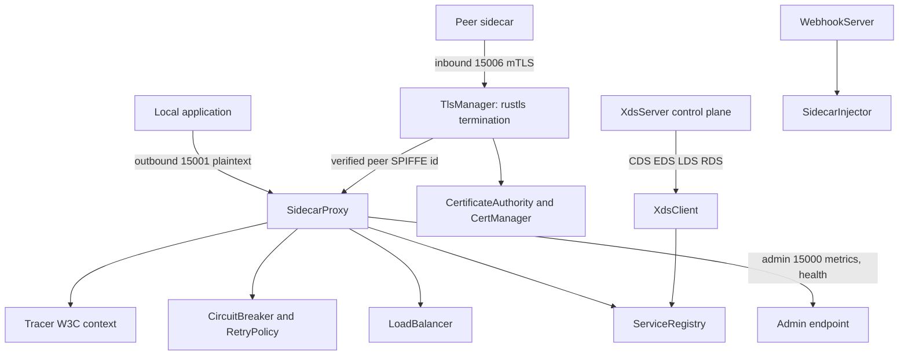

# Service Mesh

A service mesh data plane and control plane built from scratch in Rust. It provides
secure, observable service-to-service communication through a sidecar proxy with mTLS
(SPIFFE identity), service discovery and load balancing, traffic-management policies
(retries, circuit breaking, timeouts), Envoy-compatible xDS configuration, distributed
tracing, and a Kubernetes mutating webhook for sidecar injection.

## Features

- **Sidecar proxy** — inbound (15006) / outbound (15001) / admin (15000) TCP listeners
  that parse and forward HTTP/1.1 with retry and load balancing (`SidecarProxy`).
- **mTLS with SPIFFE identity** — an `rcgen`-based `CertificateAuthority` issues
  certificates carrying a `spiffe://cluster.local/ns/<ns>/sa/<sa>` URI SAN (for identity)
  and a DNS SAN (for handshake hostname verification); `CertManager` tracks rotation at
  80% of lifetime.
- **mTLS on the proxied data path** — when `ProxyConfig::mtls_mode` is `Permissive` or
  `Strict`, the sidecar terminates a real `tokio-rustls` TLS connection on its inbound
  listener using the CA-issued cert, extracts the peer's SPIFFE ID from its client
  certificate, and propagates it to the local app via an `x-forwarded-client-cert`
  header. In `Strict` mode, plaintext or untrusted-CA clients are rejected. (Outbound
  hops remain plaintext today — see *Real vs. simulated*.)
- **Service discovery** — concurrent `ServiceRegistry` (DashMap) keyed by
  `ServiceKey{name, namespace, port}` holding `ServiceEndpoints` with health state.
- **Load balancing** — `LoadBalancer` with RoundRobin, LeastConnections, Random, and a
  real consistent-hash **RingHash** (`ConsistentHashRing`, 128 virtual nodes per
  backend). `select_with_key(endpoints, key)` maps a key to a stable backend and
  reassigns only ~`1/N` of keys when membership changes; all strategies filter to
  healthy endpoints first (`LoadBalancerType`).
- **Traffic management** — `CircuitBreaker` (Closed / Open / HalfOpen), `RetryPolicy`
  with exponential backoff and jitter, and `TimeoutPolicy`.
- **xDS control plane** — `XdsServer` / `XdsClient` with CDS, EDS, LDS, and RDS handlers
  over Envoy-compatible resource types.
- **Kubernetes injection** — `SidecarInjector` generates a JSON patch (init container,
  sidecar, volumes, annotation); `WebhookServer` serves admission reviews.
- **Observability** — W3C `traceparent` context propagation (`Tracer`, `Span`) and a
  hand-written Prometheus exporter (`ProxyMetrics::to_prometheus()`).

## Architecture



| Component | Module | Responsibility |
|-----------|--------|----------------|
| Sidecar proxy | `proxy` | Inbound/outbound/admin listeners, HTTP/1.1 forwarding, retries |
| Certificates | `cert` | rcgen CA, SPIFFE SAN cert issuance, rotation tracking |
| TLS transport | `tls` | rustls acceptor/connector, inbound TLS termination, SPIFFE extraction from peer cert |
| Discovery & LB | `discovery` | Service registry, endpoint health, load-balancer strategies |
| Policies | `policy` | Circuit breaker, retry/backoff, timeout, authorization |
| Metrics | `metrics` | Counters/gauges/histograms, Prometheus text export |
| Tracing | `tracing_mesh` | Spans, W3C traceparent inject/extract |
| xDS | `xds` | Envoy-compatible CDS/EDS/LDS/RDS server and client |
| Kubernetes | `k8s` | Sidecar injection patch generation, admission webhook |

## Quick Start

### Prerequisites

- Rust 1.70+ (edition 2021) and Cargo.
- No external services are required to build or run the test suite.

### Installation

```bash
cargo build
```

### Running

The crate is a library; exercise it through the test suite or your own binary:

```bash
cargo test
```

## Usage

Issue a SPIFFE certificate, build a registry, and select an endpoint:

```rust
use service_mesh::discovery::{LoadBalancerType, ServiceKey};
use service_mesh::{
    CertificateAuthority, Endpoint, EndpointHealth, LoadBalancer, ServiceEndpoints,
    ServiceIdentity, ServiceRegistry,
};
use std::time::Duration;

// Issue an mTLS certificate for a workload identity.
let ca = CertificateAuthority::new(Duration::from_secs(24 * 3600)).unwrap();
let identity = ServiceIdentity::new("default", "frontend");
let cert = ca.issue_certificate(&identity).unwrap();
assert!(!cert.cert_chain.is_empty());
assert!(identity.spiffe_id.starts_with("spiffe://cluster.local/ns/default/sa/frontend"));

// Register a service and load-balance across its healthy endpoints.
let registry = ServiceRegistry::new();
registry.register(
    ServiceKey::new("backend", "default", 8080),
    ServiceEndpoints {
        endpoints: vec![Endpoint {
            address: "10.0.0.1:8080".parse().unwrap(),
            weight: 100,
            health: EndpointHealth::Healthy,
            metadata: Default::default(),
            tls_identity: ServiceIdentity::new("default", "backend"),
        }],
        load_balancer: LoadBalancerType::RoundRobin,
        policy: Default::default(),
    },
);

let lb = LoadBalancer::new(LoadBalancerType::RoundRobin);
let endpoints = registry.get_by_name("backend").unwrap();
let chosen = lb.select(&endpoints.endpoints).unwrap();
assert_eq!(chosen.health, EndpointHealth::Healthy);
```

Trip and recover a circuit breaker:

```rust
use service_mesh::{CircuitBreaker, CircuitBreakerConfig};
use std::time::Duration;

let cb = CircuitBreaker::new(CircuitBreakerConfig {
    consecutive_failures: 3,
    success_threshold: 2,
    base_ejection_time: Duration::from_millis(100),
    ..Default::default()
});

for _ in 0..3 {
    cb.record_failure();
}
assert!(cb.is_open());

std::thread::sleep(Duration::from_millis(150)); // ejection window elapses
assert!(!cb.is_open());                          // now half-open
cb.record_success();
cb.record_success();                             // closes the circuit
```

## What's Real vs Simulated

- **Real:** rcgen-based certificate issuance with SPIFFE SANs; **inbound mTLS on the
  proxied data path** via `tokio-rustls` — the sidecar performs a genuine rustls server
  handshake, verifies the client certificate chains to the CA, extracts the peer SPIFFE
  identity, and rejects plaintext/untrusted clients in `Strict` mode; a real
  consistent-hash **RingHash** ring (virtual nodes, stable key→backend mapping, bounded
  reassignment on membership change); circuit-breaker, retry/backoff and timeout logic;
  the other load-balancer strategies and the concurrent service registry; HTTP/1.1
  sidecar proxying over real TCP listeners; W3C trace-context propagation; the
  hand-written Prometheus exporter; xDS CDS/EDS/LDS/RDS resource handling; and webhook
  JSON-patch generation.
- **Simulated / in-process / out of scope:**
  - **Outbound (upstream) mTLS** is not yet wired: the inbound listener terminates TLS
    and surfaces the verified peer identity, but connections the sidecar makes *to*
    upstream backends still use plaintext TCP. The client-side `TlsManager::connect` and
    a SPIFFE-bearing client cert exist and are exercised by the mTLS tests, so extending
    the outbound hop is incremental; today the data path is encrypted on ingress only.
  - There is no live Kubernetes cluster connection — the webhook operates on
    `AdmissionReview` values directly, and no iptables interception is performed.
  - The xDS server and client share resources in-memory rather than over a real gRPC
    streaming transport (`tonic`/`hyper` are dependencies but the xDS exchange is
    in-process).
  - HTTP/2 is not implemented; proxying is HTTP/1.1 only.

## Testing

```bash
cargo test
```

Integration tests under `tests/` cover the proxy, certificate authority, service
discovery and load balancing (including consistent-hash RingHash stability, key
distribution, and bounded reassignment), circuit-breaker behaviour, retry policy,
concurrent registry access, tracing, and a network simulator. `tests/mtls_test.rs`
drives the sidecar end-to-end: a TLS client negotiates mTLS and the app observes the
client's SPIFFE identity, a plaintext client is rejected in `Strict` mode, and an
untrusted-CA client is rejected. Inline `#[cfg(test)]` modules cover each component
(cert, discovery, policy, proxy, tls, tracing, xDS, k8s). No external services are
required.

## Project Structure

```
13-service-mesh/
  README.md              # This file
  Cargo.toml
  src/
    lib.rs               # Public exports and error types
    config.rs            # ProxyConfig, ServiceIdentity, TlsConfig
    cert.rs              # CertificateAuthority, CertManager, IssuedCert
    tls.rs               # TlsManager, TlsStream, SecureConnection
    discovery.rs         # ServiceRegistry, LoadBalancer, Endpoint
    policy.rs            # CircuitBreaker, RetryPolicy, TimeoutPolicy
    proxy.rs             # SidecarProxy and HTTP forwarding
    metrics.rs           # ProxyMetrics and Prometheus export
    tracing_mesh.rs      # Tracer, Span, SpanContext
    xds/                 # XdsServer, XdsClient, Envoy-compatible types
    k8s/                 # SidecarInjector, WebhookServer
  tests/                 # Integration tests
  docs/BLUEPRINT.md      # Full architecture and design
```

## License

MIT — see [LICENSE](../LICENSE)
