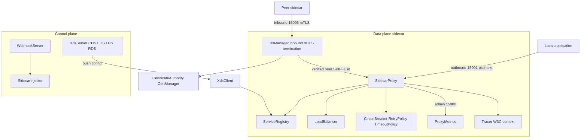
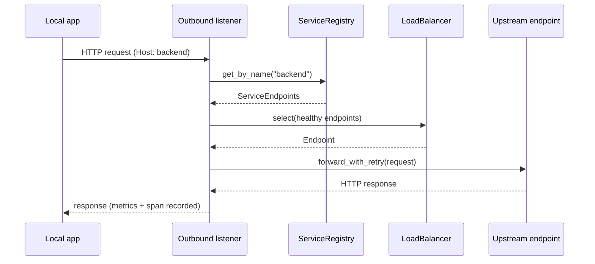

# Service Mesh

## Overview

This project is a service mesh implemented from scratch in Rust. It combines a data
plane — a sidecar proxy that intercepts and forwards application traffic — with the
supporting machinery a real mesh needs: mutual TLS based on SPIFFE workload identity,
service discovery and load balancing, traffic-management policies (retries, circuit
breaking, timeouts), an Envoy-compatible xDS control plane, distributed tracing, a
metrics exporter, and a Kubernetes mutating admission webhook for sidecar injection.

The goal is to make the core mechanisms of a mesh legible. Rather than wrapping an
existing proxy, every layer is written directly against `tokio`: the proxy parses
HTTP/1.1 off raw TCP streams, the CA mints X.509 certificates with `rcgen`, mTLS runs on
`tokio-rustls`, and the xDS resource model mirrors Envoy's CDS/EDS/LDS/RDS split. The
concepts it teaches are: how a sidecar transparently brokers service-to-service calls,
how SPIFFE identities are embedded in certificates and verified during the TLS handshake,
how circuit breakers and retry/backoff protect callers from failing dependencies, how a
control plane pushes dynamic configuration to proxies, and how Kubernetes admission
webhooks rewrite pod specs to inject a sidecar.

Scope is deliberately bounded. The proxy speaks HTTP/1.1, not HTTP/2 or gRPC framing.
The xDS server and client exchange resources in-process rather than over a live gRPC
stream. The Kubernetes integration generates the admission patch but does not talk to a
real API server, and no iptables interception is performed locally. mTLS secures the
inbound (ingress) hop of the data path — the sidecar terminates real rustls connections
and enforces peer identity — but the outbound hop to upstream backends is still plaintext
TCP today. These boundaries are called out explicitly in "Performance" and in the
README's "What's Real vs Simulated" section so the implemented surface is never
overclaimed.

A few design choices shape the whole codebase. First, the proxy treats HTTP as a
line-and-header protocol it can parse incrementally off a buffered reader, which keeps the
request/response model small and explicit and avoids pulling a full HTTP stack onto the
data path. Second, identity is the certificate: the SPIFFE URI lives in the certificate's
SAN, so authentication and identity are unified — verifying the TLS handshake is the same
operation as learning who the peer is. Third, state that is read on the hot path
(`ServiceRegistry`, xDS resource maps, load-balancer connection counts) is stored in
`DashMap`s so reads never serialize behind a single lock, while the small amount of mutable
control state (circuit-breaker transitions, the current certificate) sits behind brief
`parking_lot::RwLock`s. Fourth, the proxy, control plane, and webhook are independent
units that communicate through plain data types (`DiscoveryRequest`/`DiscoveryResponse`,
`AdmissionReview`, `JsonPatchOp`), which is what makes the in-process simulation faithful:
the same messages would cross the wire in a production deployment.

The crate is named `service-mesh` and is imported as `service_mesh`. It is licensed MIT
(see `../LICENSE`).

## Architecture

The system has two planes. The **data plane** is the `SidecarProxy`, deployed next to
each workload, brokering all inbound and outbound traffic. The **control plane** is the
`XdsServer` plus the Kubernetes `WebhookServer`, which together configure and install the
sidecars. Certificates, discovery, policy, tracing, and metrics are cross-cutting
services the data plane consumes.



Traffic flows through three listeners that the proxy binds on startup:

- **Inbound (15006)** — connections arriving from peer sidecars, destined for the local
  application. When `mtls_mode` is `Permissive`/`Strict` the proxy first terminates a
  rustls TLS connection and extracts the peer SPIFFE identity; it then reads the HTTP
  request over that encrypted stream, optionally extracts the W3C trace context, forwards
  to the application on its app port (adding an `x-forwarded-client-cert` header for the
  peer identity), and relays the response.
- **Outbound (15001)** — connections originating from the local application. The proxy
  resolves the target service from the `Host` header, filters to healthy endpoints via
  the registry, selects one with the load balancer, injects trace context, and forwards
  with retry and timeout.
- **Admin (15000)** — health (`/ready`, `/health`) and metrics (`/metrics`, Prometheus
  text) endpoints.

The control plane configures clusters and endpoints on the `XdsServer`; an `XdsClient`
in each proxy consumes CDS/EDS/LDS/RDS resources and can feed them into the registry.
Separately, the `WebhookServer` answers Kubernetes admission reviews by asking the
`SidecarInjector` to produce a JSON patch that adds the init and sidecar containers.



## Core Components

### Sidecar proxy (`proxy`)

`SidecarProxy` is constructed with
`SidecarProxy::new(config: ProxyConfig, registry: Arc<ServiceRegistry>, cert_manager: Arc<CertManager>)`.
`run()` binds the inbound, outbound, and admin `TcpListener`s and drives all three
handlers under a `tokio::select!`. Each accepted connection is handled in a spawned task.

Request parsing is hand-written. `read_http_request` and `read_http_response` consume a
buffered stream line by line: the request/status line, then headers until a blank line,
honouring `Content-Length` for the body. `forward_http_request` and `send_http_response`
serialize the structs back onto a stream. The `HttpRequest`/`HttpResponse` structs carry
method/path/version (or status), an ordered header list, and a `Bytes` body, with
case-insensitive `get_header`/`set_header` helpers.

The outbound path performs service discovery and load balancing, then calls
`forward_with_retry`, which wraps each attempt in `tokio::time::timeout`. On a retryable
failure (a 5xx or a configured status code, or a connection error or timeout) it sleeps
for an exponential backoff with jitter and retries up to `max_retries`. The inbound path
forwards to the local application on `localhost:<app_port>`.

A `ConnectionPool` keeps a bounded set of reusable connections per upstream address,
handing out idle entries and creating new ones up to `max_per_host`, with a `cleanup`
that evicts idle connections past a maximum idle duration.

The admin handler serves `/ready` and `/health` as plain `200 OK`, and `/metrics` as the
Prometheus exposition produced by `ProxyMetrics::to_prometheus()`.

#### Outbound request lifecycle

The outbound path is the most involved and is worth tracing end to end, since it touches
discovery, load balancing, policy, tracing, and metrics in one flow:

1. **Accept and parse.** The outbound listener accepts a connection from the local
   application and spawns a task. `read_http_request` parses the request line, headers,
   and (length-delimited) body into an `HttpRequest`.
2. **Trace context.** If a tracer is present, the proxy extracts any incoming W3C
   `traceparent` to use as the parent context, then opens a `proxy.outbound` span tagged
   with the HTTP method and path.
3. **Target resolution.** The destination service name is taken from the `Host` header
   (everything before the first colon). `ServiceRegistry::get_by_name` returns the
   `ServiceEndpoints`, or an `Error::ServiceNotFound` if the service is unknown.
4. **Health filtering.** Endpoints are filtered to `EndpointHealth::Healthy`. If none
   remain, the request fails fast with `ServiceNotFound("No healthy endpoints …")` rather
   than blocking.
5. **Selection.** `LoadBalancer::select` chooses one endpoint according to the configured
   strategy. The chosen address is tagged onto the span as `peer.address`.
6. **Context injection.** The span's context is injected back into the outgoing request as
   a `traceparent` header so downstream sidecars continue the same trace.
7. **Forward with retry.** `forward_with_retry` wraps each attempt in a timeout, retries
   on a retryable status or transport error up to `max_retries`, and sleeps for an
   exponential-backoff-with-jitter interval between attempts.
8. **Respond and record.** The upstream response is written back to the caller; the
   request counter and latency histogram are updated, and the span is finished with the
   status code (flagging `error` on 4xx/5xx).

The inbound path is a shorter mirror of this: parse, optionally continue the trace, forward
to `localhost:<app_port>`, relay the response, and record metrics. Both paths run their
per-connection work in independent tasks, so a slow upstream only stalls its own request,
not the listener.

### Certificates and mTLS (`cert`, `tls`)

`CertificateAuthority::new(cert_ttl: Duration)` builds a self-signed root certificate
using `rcgen` (`IsCa::Ca`, common name "Mesh Root CA"). `issue_certificate(identity)`
mints a leaf certificate whose subject is the service account and whose Subject
Alternative Names are the SPIFFE URI `spiffe://cluster.local/ns/<ns>/sa/<sa>` (identity)
plus a DNS name `<sa>.<ns>.mesh` (`ServiceIdentity::tls_server_name`). The DNS SAN lets a
client dial the upstream by workload name so rustls' WebPKI hostname check passes, while
authorization still reads the SPIFFE URI. The leaf is signed by the root via
`serialize_pem_with_signer`, and the returned `IssuedCert` carries the PEM cert chain
(leaf + root), the PEM private key, and an expiry of `now + cert_ttl`.

`CertManager::new(identity, cert, cert_ttl)` holds the current certificate behind a
`parking_lot::RwLock`. `needs_rotation()` returns true once the remaining lifetime drops
below `1.0 - rotation_threshold` of the TTL — with the default `rotation_threshold` of
0.8, that means rotation is signalled at 80% of the certificate's lifetime.
`update_cert` swaps in a freshly issued certificate.

`TlsManager` (in `tls`) turns an `IssuedCert` into a `tokio-rustls` configuration.
`from_issued_cert` parses the PEM chain and key with `rustls-pemfile`, builds a
`RootCertStore` from the CA portion of the chain, and constructs both a `ServerConfig`
(with `AllowAnyAuthenticatedClient` for mutual auth) and a `ClientConfig` (with a client
auth certificate). `acceptor()` and `connector()` expose the rustls primitives;
`accept`/`connect` perform the handshake. `TlsStream` is an enum over server- and
client-side streams that implements `AsyncRead`/`AsyncWrite`, and `peer_spiffe_id()`
parses the peer certificate with `x509-parser` to pull the `spiffe://` URI out of the SAN
extension. `SecureConnection` bundles a `TlsStream` with the extracted peer identity.

The end-to-end identity flow ties these pieces together. The CA issues each workload a leaf
certificate whose SAN is its SPIFFE URI and whose signature chains to the shared root. When
two sidecars connect, the rustls handshake performs mutual authentication: each side
presents its leaf, and `AllowAnyAuthenticatedClient` (built from the root store derived from
the cert chain) verifies the peer's certificate against the same root. A successful
handshake therefore proves two things at once — that the peer holds a key signed by the
mesh CA, and (by reading the SAN) exactly which service account it is. `peer_spiffe_id`
surfaces that identity to the application layer, where an `AuthorizationPolicy` can match it
against allowed principals and namespaces. Rotation closes the loop over time: `CertManager`
holds the active certificate, `needs_rotation` signals when 80% of the lifetime has elapsed,
and a control loop can issue a fresh certificate and call `update_cert` so the next handshake
uses it — all without restarting the proxy. Because the leaf is short-lived by design, a
compromised key is only useful until the next rotation.

**mTLS on the data path.** This identity machinery is wired into the sidecar's inbound
listener rather than left unused. `ProxyConfig::mtls_mode` (`MtlsMode`) selects the
enforcement level: `Disabled` keeps the inbound path plaintext; `Permissive` and `Strict`
terminate TLS. When enabled, `handle_inbound` builds one `TlsManager` from the sidecar's
`CertManager` and, for each accepted TCP connection, calls `TlsManager::accept` to run the
rustls server handshake using the CA-issued cert/key. The resulting `TlsStream::Server` is
wrapped so `peer_spiffe_id()` can read the client certificate's SPIFFE URI, and the same
encrypted stream (which implements `AsyncRead`/`AsyncWrite`) is then used to read and
forward the HTTP request — so the proxied bytes are genuinely encrypted, not plaintext. In
`Strict` mode a connection that omits a SPIFFE-bearing client certificate is rejected with
`Error::Unauthorized`, and because a plaintext client cannot complete the TLS handshake at
all, `TlsManager::accept` rejects it up front. The verified peer identity is propagated to
the local application through an `x-forwarded-client-cert` header (mirroring Envoy's XFCC),
letting the app authorize on the mTLS peer. The request-processing function is generic over
the stream type, so the plaintext and TLS paths share one code path. Outbound (upstream)
connections still use plaintext TCP today; the client-side `TlsManager::connect` and a
SPIFFE-bearing client cert exist (and are exercised by `tests/mtls_test.rs`), so extending
mTLS to the upstream hop is incremental.

### Service discovery and load balancing (`discovery`)

`ServiceRegistry` wraps a `DashMap<ServiceKey, ServiceEndpoints>` for lock-free concurrent
access. `ServiceKey{name, namespace, port}` is the registry key; `register`, `unregister`,
`get`, `update_endpoints`, `list_services`, and `get_by_name` manage entries.
`ServiceEndpoints` holds the endpoint list, the load-balancer type, and the service policy.
Each `Endpoint` carries its socket address, weight, `EndpointHealth` (Healthy / Unhealthy /
Unknown), arbitrary metadata, and the upstream's TLS identity.

`LoadBalancer::new(LoadBalancerType)` selects among endpoints. `select(&[Endpoint])` first
filters to healthy endpoints and returns `None` if none remain. RoundRobin advances an
atomic index (`fetch_add` modulo the healthy count), giving even distribution without a
lock; LeastConnections picks the address with the fewest tracked open connections,
maintained via `connection_opened`/`connection_closed` over a `DashMap<SocketAddr, usize>`;
Random picks uniformly at random. The four strategies are exposed through
`LoadBalancerType {RoundRobin, LeastConnections, Random, RingHash}`.

RingHash is a real consistent-hash ring, not random selection. `ConsistentHashRing`
places each backend at `DEFAULT_VNODES` (128) virtual-node positions on a 64-bit ring,
hashing `(addr, i)` with `DefaultHasher` so a backend's ownership is scattered into many
small arcs (keeping the load balanced). A key is routed by hashing it and walking
clockwise to the first ring position `>=` the key's hash, wrapping to the smallest
position at the end — implemented with a `BTreeMap` range query. Because ownership is
positional, adding or removing a backend only reassigns the keys that fell in that
backend's arcs — about `1/N` of keys — rather than reshuffling everything as a modulo
scheme would. The keyed entry point is `LoadBalancer::select_with_key(endpoints, key)`,
which builds a ring over the healthy endpoints and returns the owning `Endpoint`; the
same key maps to the same backend across calls. The keyless `select` has no routing key,
so for RingHash it falls back to round-robin to still return a valid healthy endpoint.
The ring properties (stability, distribution, bounded reassignment) are verified in
`tests/discovery_test.rs` and the inline `discovery` tests.

Health is a property of the endpoint, not the balancer, so the same registry entry can be
shared across callers while a separate health-checking process flips endpoints between
`Healthy`, `Unhealthy`, and `Unknown`. Because `select` always re-filters, an endpoint
marked unhealthy stops receiving traffic on the next selection without any coordination.
The registry's `update_endpoints` lets a discovery source replace the endpoint list for a
service atomically while readers continue to see a consistent snapshot.

### Traffic-management policies (`policy`)

The `CircuitBreaker` models three states with `CircuitState`: `Closed`,
`Open{opened_at, failures}`, and `HalfOpen{successes, allowed}`. `record_failure`
increments an atomic failure counter and, once it reaches `consecutive_failures`,
transitions to `Open`. `is_open` returns true while open, but once `base_ejection_time`
has elapsed it flips the breaker to `HalfOpen` and admits a probe request. `record_success`
in the half-open state counts successes and closes the circuit once `success_threshold` is
met; a success while closed resets the failure counter. `CircuitBreakerConfig` carries the
thresholds, monitoring interval, ejection time, and maximum ejection percentage.

`RetryPolicy{max_retries, retry_on, backoff}` lists the `RetryCondition`s that warrant a
retry (connection failure, 5xx, reset, connect failure, retriable 4xx, or a specific
status code). `BackoffConfig{base_interval, max_interval, jitter}` parameterizes the
exponential backoff: the proxy computes `base * 2^(attempt-1)`, caps it at `max_interval`,
and multiplies by `1 + random*jitter`.

`TimeoutPolicy` holds a request timeout and idle timeout. `ServicePolicy` aggregates the
retry, timeout, and circuit-breaker configs together with the `MtlsMode` (Disable /
Permissive / Strict) and an `AuthorizationPolicy`. The authorization policy has an
`AuthAction` (Allow / Deny) and a list of `AuthRule`s matching on source SPIFFE principals
and namespaces.

The three states form a deliberate hysteresis loop. In `Closed`, every request is allowed
and a single success resets the failure counter, so transient blips do not accumulate.
After `consecutive_failures` failures the breaker moves to `Open` and `is_open()` returns
true, shedding load instantly. The breaker stays open for `base_ejection_time`; the first
`is_open()` call after that window flips it to `HalfOpen` and admits exactly one probe.
A run of `success_threshold` successes in `HalfOpen` returns the breaker to `Closed`, while
a failure would re-open it. This is what prevents a recovering dependency from being
hammered the instant it comes back: only a trickle of probes flows until confidence is
restored. The retry layer composes with the breaker — retries cover individual flaky
requests, while the breaker covers a systematically failing dependency — and both share the
same notion of what counts as a failure via `RetryCondition`.

### xDS control plane (`xds`)

The xDS layer mirrors Envoy's discovery services over the resource types in
`xds::types`. `XdsServer::new(address)` keeps clusters, endpoint assignments, listeners,
and route configurations in separate `DashMap`s, with a monotonic version counter and a
`tokio::sync::broadcast` channel for change notifications. Setters (`set_cluster`,
`set_endpoints`, `set_listener`, `set_route_config`) bump the version and broadcast a
`ResourceUpdate`. `handle_discovery_request` dispatches on the request's type URL to the
per-service handlers (`handle_cds_request`, `handle_eds_request`, `handle_lds_request`,
`handle_rds_request`), returning a `DiscoveryResponse` whose resources are JSON-serialized
values tagged with the matching type URL. Nodes can register and unregister subscriptions,
and `stats()` reports counts.

`XdsClient::new(control_plane, node)` caches the four resource types behind
`tokio::sync::RwLock`s. `process_response` decodes a `DiscoveryResponse` by type URL and
populates the relevant cache; getters expose the cached clusters, endpoints, listeners,
and routes. `create_discovery_request` and `create_nack` build the request messages
(including the NACK `error_detail`), and a `RetryConfig` parameterizes reconnection
backoff. The exchange is in-memory: `fetch_clusters`/`fetch_endpoints` return cached
resources rather than issuing a live gRPC call.

The four discovery services map onto Envoy's resource model:

- **CDS (Cluster Discovery Service)** defines upstream `Cluster`s — a name, connect
  timeout, discovery type (`Static`, `StrictDns`, `LogicalDns`, `Eds`, `OriginalDst`),
  load-balancing policy, health checks, optional circuit-breaker thresholds, and an
  optional TLS context.
- **EDS (Endpoint Discovery Service)** supplies a `ClusterLoadAssignment` per cluster:
  endpoints grouped by `LocalityLbEndpoints` (region/zone), each `LbEndpoint` carrying a
  socket address, `HealthStatus`, weight, and metadata, plus optional drop-overload
  policy.
- **LDS (Listener Discovery Service)** defines `Listener`s — the addresses and filter
  chains a proxy should serve.
- **RDS (Route Discovery Service)** supplies `RouteConfiguration`s that map request
  attributes to clusters.

Resources are versioned and acknowledged. Every setter on the server bumps the monotonic
`version_counter` and stamps the new version into the broadcast `ResourceUpdate` and the
`DiscoveryResponse`'s `nonce`. A client that accepts a configuration echoes the version
back in its next `DiscoveryRequest` (an ACK); a client that rejects one calls `create_nack`
to send a request whose `error_detail` carries an `INVALID_ARGUMENT` status and the offending
version, leaving the previously good configuration in place. This ACK/NACK handshake is the
mechanism that lets a control plane roll out configuration safely. In this implementation the
request and response structs are exchanged directly in-process rather than streamed over gRPC,
but they are the same messages a real deployment would serialize.

### Kubernetes webhook (`k8s`)

`SidecarInjector::new(InjectionConfig)` decides whether a pod should be injected
(`should_inject`, honouring the `sidecar.mesh.io/inject` and `sidecar.mesh.io/injected`
annotations) and produces the mutation. `generate_patch(pod)` returns a list of
`JsonPatchOp`s that add an init container (the iptables-redirect setup, with `NET_ADMIN`
and `NET_RAW` capabilities), the `mesh-proxy` sidecar container (with downward-API env
vars, ports, volume mounts, resource limits, and readiness/liveness probes against the
admin port), the supporting volumes, and the `injected` annotation. `InjectionConfig`
carries the sidecar/init images, control-plane address, the three proxy ports, mTLS flag,
resource requests/limits, and excluded inbound/outbound ports.

`WebhookServer::new(address, InjectionConfig)` serves the admission webhook over `hyper`,
optionally with TLS via `with_tls`. `handle_admission_review(review)` extracts the
request, processes only Pod `CREATE` operations, runs the injector, and returns an
`AdmissionReview` carrying the patch (or an allow-without-patch for skipped pods).
`handle_request_body` is the JSON-in/JSON-out form used by the HTTP `/inject` and
`/mutate` routes, alongside `/health` and `/ready`.

### Tracing (`tracing_mesh`)

`Tracer::new(service_name, collector_endpoint)` creates spans. `start_span(name, parent)`
generates a random `span_id`, inherits the parent's `trace_id` (or generates one), and
returns a `Span` with tags and logs. `extract_context` parses a W3C `traceparent` header
(`00-<trace_id>-<span_id>-<flags>`) into a `SpanContext`, and `inject_context` formats a
`SpanContext` back into the header. A `Sampler` (AlwaysOn / AlwaysOff / Probabilistic)
gates sampling. The proxy's `TraceContextHelper` ties this into request handling: it
extracts the parent context off an incoming request, creates `proxy.inbound`/
`proxy.outbound` spans tagged with HTTP method/path/host, injects the context into the
forwarded request, and finishes the span with the response status (flagging `error` on
4xx/5xx).

### Metrics (`metrics`)

`ProxyMetrics` aggregates atomic `Counter`, `Gauge`, and `Histogram` primitives covering
requests, latency, request/response bytes, active connections, connection errors, TLS
handshake latency, certificate expiry, authorization denials, circuit openings, and
retries. `record_request(latency, status)` increments the request counter, observes the
latency histogram (bucketed in microseconds), and counts 5xx responses as connection
errors. `to_prometheus()` hand-renders the exposition format (`# HELP`/`# TYPE` plus the
sample lines) with `mesh_`-prefixed metric names. `snapshot()` returns a plain
`MetricsSnapshot` for assertions and admin output.

The histogram uses fixed microsecond bucket boundaries (1ms through 5s) and a parallel set
of atomic bucket counters; `observe` finds the first boundary the sample fits under and
increments that bucket along with the running sum and count, so percentiles can be derived
without storing individual observations. Because every primitive is a relaxed-ordering
atomic, recording a request never allocates and never blocks, which matters on the proxy's
hot path where every forwarded request calls `record_request`.

### Error model

All fallible operations return `Result<T, Error>` where `Error` is a `thiserror` enum
covering the failure modes the mesh actually encounters: `Io`, `Tls`, `Certificate`,
`Unauthorized`, `ServiceNotFound`, `CircuitOpen`, `Timeout`, `Connection`, `Config`, and
`Serialization`. The variants are chosen so callers can branch on them meaningfully — the
proxy's retry loop distinguishes a `Timeout` from a `Connection` error, and a
`ServiceNotFound` short-circuits without retrying. `serde_json::Error` is folded into
`Error::Serialization` via a `From` impl so the webhook and xDS paths can use `?` freely.
This keeps error handling explicit at every boundary rather than panicking, in line with
idiomatic Rust service code.

## Data Structures

The certificate types use `rcgen`, not OpenSSL — `IssuedCert` holds PEM bytes, and the CA
wraps an `rcgen::Certificate`:

```rust
pub struct IssuedCert {
    pub cert_chain: Vec<Vec<u8>>, // PEM: leaf then root
    pub private_key: Vec<u8>,     // PEM
    pub expiry: SystemTime,
}

pub struct CertificateAuthority {
    root_cert: rcgen::Certificate,
    cert_ttl: Duration,
}

impl CertificateAuthority {
    pub fn new(cert_ttl: Duration) -> Result<Self>;
    pub fn issue_certificate(&self, identity: &ServiceIdentity) -> Result<IssuedCert>;
    pub fn root_cert_pem(&self) -> Result<Vec<u8>>;
}
```

Identity is a SPIFFE URI plus its components:

```rust
pub struct ServiceIdentity {
    pub spiffe_id: String,        // spiffe://cluster.local/ns/<ns>/sa/<sa>
    pub service_account: String,
    pub namespace: String,
}
```

Discovery keys, endpoints, and load-balancer strategies:

```rust
pub struct ServiceKey { pub name: String, pub namespace: String, pub port: u16 }

pub struct Endpoint {
    pub address: SocketAddr,
    pub weight: u32,
    pub health: EndpointHealth,                 // Healthy | Unhealthy | Unknown
    pub metadata: HashMap<String, String>,
    pub tls_identity: ServiceIdentity,
}

pub enum LoadBalancerType { RoundRobin, LeastConnections, Random, RingHash }

pub struct ServiceEndpoints {
    pub endpoints: Vec<Endpoint>,
    pub load_balancer: LoadBalancerType,
    pub policy: ServicePolicy,
}
```

Policy state and configuration:

```rust
pub enum CircuitState {
    Closed,
    Open { opened_at: Instant, failures: u32 },
    HalfOpen { successes: u32, allowed: u32 },
}

pub struct CircuitBreakerConfig {
    pub consecutive_failures: u32,
    pub interval: Duration,
    pub base_ejection_time: Duration,
    pub max_ejection_percent: u32,
    pub success_threshold: u32,
}

pub struct RetryPolicy {
    pub max_retries: u32,
    pub retry_on: Vec<RetryCondition>,
    pub backoff: BackoffConfig,
}

pub struct BackoffConfig {
    pub base_interval: Duration,
    pub max_interval: Duration,
    pub jitter: f64,
}
```

The HTTP representation the proxy parses and forwards:

```rust
pub struct HttpRequest {
    pub method: String,
    pub path: String,
    pub version: String,
    pub headers: Vec<(String, String)>,
    pub body: Bytes,
}

pub struct HttpResponse {
    pub status_code: u16,
    pub status_text: String,
    pub headers: Vec<(String, String)>,
    pub body: Bytes,
}
```

The xDS wire model (in `xds::types`) is JSON-serializable via `serde`. The generic
`Resource` carries a type URL and an opaque value, dispatched against the Envoy v3 type
URL constants:

```rust
pub struct DiscoveryRequest {
    pub version_info: String,
    pub node: Node,
    pub resource_names: Vec<String>,
    pub type_url: String,
    pub response_nonce: String,
    pub error_detail: Option<Status>,
}

pub struct DiscoveryResponse {
    pub version_info: String,
    pub resources: Vec<Resource>,
    pub type_url: String,
    pub nonce: String,
}

pub struct Cluster {
    pub name: String,
    pub connect_timeout: Duration,
    pub cluster_type: ClusterType,             // Static | StrictDns | LogicalDns | Eds | OriginalDst
    pub lb_policy: LbPolicy,
    pub health_checks: Vec<HealthCheck>,
    pub circuit_breakers: Option<CircuitBreakerThresholds>,
    pub tls_context: Option<TlsContext>,
}

pub const TYPE_URL_CDS: &str = "type.googleapis.com/envoy.config.cluster.v3.Cluster";
pub const TYPE_URL_EDS: &str = "type.googleapis.com/envoy.config.endpoint.v3.ClusterLoadAssignment";
pub const TYPE_URL_LDS: &str = "type.googleapis.com/envoy.config.listener.v3.Listener";
pub const TYPE_URL_RDS: &str = "type.googleapis.com/envoy.config.route.v3.RouteConfiguration";
```

The EDS assignment describes endpoints by locality, with per-endpoint health and weight:

```rust
pub struct ClusterLoadAssignment {
    pub cluster_name: String,
    pub endpoints: Vec<LocalityLbEndpoints>,
    pub policy: Option<Policy>,
}

pub struct LocalityLbEndpoints {
    pub locality: Option<Locality>,            // region / zone / sub_zone
    pub lb_endpoints: Vec<LbEndpoint>,
    pub load_balancing_weight: Option<u32>,
    pub priority: u32,
}

pub struct LbEndpoint {
    pub endpoint: Endpoint,                     // SocketAddress + health check config
    pub health_status: HealthStatus,            // Unknown | Healthy | Unhealthy | Draining | Timeout | Degraded
    pub load_balancing_weight: Option<u32>,
    pub metadata: HashMap<String, String>,
}
```

The Kubernetes mutation is expressed as RFC 6902 JSON Patch operations against the pod
spec, wrapped in the admission review envelope:

```rust
pub struct JsonPatchOp {
    pub op: String,        // "add"
    pub path: String,      // e.g. "/spec/containers/-" or "/spec/initContainers"
    pub value: Option<serde_json::Value>,
}
```

`generate_patch` emits, in order: an `add` for the iptables init container, an `add` for
the sidecar container at `/spec/containers/-`, one or more `add`s for the mesh volumes, and
an `add` that writes the `sidecar.mesh.io/injected: "true"` annotation (escaping the `/` in
the annotation key as `~1` for the JSON Pointer). Whether a path is created or appended to
depends on whether the pod already has init containers, containers, volumes, or annotations.

Span context is the W3C-compatible trace tuple:

```rust
pub struct SpanContext { pub trace_id: u128, pub span_id: u64, pub flags: u8 }
```

### Dependencies

The crate is built directly on async and crypto building blocks rather than a wrapper
framework. The load-bearing dependencies (from `Cargo.toml`) are:

- **`tokio`** — async runtime, TCP listeners, timeouts, and synchronization.
- **`tokio-rustls` / `rustls` / `rustls-pemfile`** — the mTLS transport and PEM parsing.
- **`rcgen`** — certificate generation for the CA and issued leaf certificates.
- **`x509-parser`** — extracting the SPIFFE SAN from a peer certificate.
- **`hyper` (0.14)** — the HTTP server backing the Kubernetes webhook.
- **`tonic` (0.9)** — present for Envoy-style gRPC types; the xDS exchange in this
  implementation is in-memory, not a live gRPC stream.
- **`serde` / `serde_json`** — serialization of xDS resources and admission reviews.
- **`dashmap`** — concurrent maps for the registry and xDS server state.
- **`parking_lot`** — fast `RwLock`s for the cert manager and circuit-breaker state.
- **`tracing`** — structured logging across the proxy and control plane.
- **`bytes`**, **`rand`**, **`thiserror`**, **`base64`** — buffers, jitter/sampling,
  error types, and encoding helpers.

## API Design

Public exports are grouped by module (see `lib.rs`).

**Certificates and identity** (`cert`, `config`):

```
CertificateAuthority::new(cert_ttl: Duration) -> Result<Self>
CertificateAuthority::issue_certificate(&self, &ServiceIdentity) -> Result<IssuedCert>
CertManager::new(ServiceIdentity, IssuedCert, cert_ttl: Duration) -> Self
CertManager::needs_rotation(&self) -> bool
ServiceIdentity::new(namespace: &str, service_account: &str) -> Self
```

**TLS** (`tls`):

```
TlsManager::from_cert_manager(&CertManager) -> Result<Self>
TlsManager::accept(&self, TcpStream) -> Result<ServerTlsStream<TcpStream>>   // inbound handshake
TlsManager::connect(&self, TcpStream, server_name: &str) -> Result<ClientTlsStream<TcpStream>>
TlsStream::peer_spiffe_id(&self) -> Option<String>
// ProxyConfig::mtls_mode: MtlsMode { Disable, Permissive, Strict } gates inbound TLS.
```

**Discovery and load balancing** (`discovery`):

```
ServiceRegistry::new() -> Self
ServiceRegistry::register(&self, ServiceKey, ServiceEndpoints)
ServiceRegistry::get_by_name(&self, name: &str) -> Option<ServiceEndpoints>
LoadBalancer::new(LoadBalancerType) -> Self
LoadBalancer::select(&self, &[Endpoint]) -> Option<Endpoint>
LoadBalancer::select_with_key(&self, &[Endpoint], key: &K) -> Option<Endpoint>  // consistent-hash routing for RingHash
ConsistentHashRing::new(&[SocketAddr]) -> Self          // 128 virtual nodes/backend
ConsistentHashRing::lookup(&self, key: &K) -> Option<SocketAddr>
```

**Policies** (`policy`):

```
CircuitBreaker::new(CircuitBreakerConfig) -> Self
CircuitBreaker::is_open(&self) -> bool
CircuitBreaker::record_success(&self)
CircuitBreaker::record_failure(&self)
CircuitBreaker::state(&self) -> CircuitState
```

**Proxy** (`proxy`):

```
SidecarProxy::new(ProxyConfig, Arc<ServiceRegistry>, Arc<CertManager>) -> Self
SidecarProxy::run(&self) -> Result<()>          // binds 15006 / 15001 / 15000
SidecarProxy::config(&self) -> ProxyConfig
SidecarProxy::update_config(&self, ProxyConfig)
```

**Tracing and metrics** (`tracing_mesh`, `metrics`):

```
Tracer::new(service_name: String, collector_endpoint: String) -> Self
Tracer::start_span(&self, name: &str, parent: Option<&SpanContext>) -> Span
Tracer::extract_context(&self, &HashMap<String,String>) -> Option<SpanContext>
ProxyMetrics::record_request(&self, latency: Duration, status: u16)
ProxyMetrics::to_prometheus(&self) -> String
```

**Control plane and Kubernetes** (`xds`, `k8s`):

```
XdsServer::new(addr) -> Self
XdsServer::set_cluster(&self, Cluster) -> Result<()>
XdsServer::handle_discovery_request(&self, &DiscoveryRequest) -> DiscoveryResponse
XdsClient::new(control_plane: SocketAddr, node: Node) -> Self
XdsClient::process_response(&self, DiscoveryResponse) -> Result<()>
SidecarInjector::new(InjectionConfig) -> Self
SidecarInjector::generate_patch(&self, &Pod) -> Result<Vec<JsonPatchOp>>
WebhookServer::new(addr, InjectionConfig) -> Self
WebhookServer::handle_admission_review(&self, AdmissionReview) -> AdmissionReview
```

The admin HTTP surface exposed by `SidecarProxy::run` on the admin port:

```
GET /ready    -> 200 OK
GET /health   -> 200 OK
GET /metrics  -> 200 OK (Prometheus text, mesh_* metrics)
```

## Performance

No Criterion benchmarks ship with the crate, so the figures below are design targets and
illustrative bounds, not measured numbers.

- **Concurrency.** The proxy spawns a `tokio` task per connection and keeps no global
  lock on the hot path; the registry and xDS server use `DashMap` for lock-free reads,
  and the circuit breaker and cert manager use `parking_lot::RwLock`s held only briefly.
- **Allocation.** Bodies are carried as `Bytes`, allowing cheap clones when forwarding a
  request to the upstream and back without copying the payload.
- **Connection reuse.** The `ConnectionPool` bounds connections per upstream
  (`max_per_host`) and reclaims idle ones, trading a small bookkeeping cost for fewer TCP
  handshakes under load.
- **Backoff.** Retry backoff is exponential with jitter and capped at `max_interval`,
  bounding retry storms while spreading retries across callers.
- **Metrics overhead.** Counters and gauges are relaxed-ordering atomics; the latency
  histogram is a fixed set of atomic buckets, so recording a request is allocation-free.

Realistic latency and throughput depend on the workload and the (currently absent) mTLS
handshake cost on the hot path, so concrete RPS/p99 numbers are intentionally not quoted.

## Testing Strategy

Correctness is verified at two levels.

**Inline unit tests** live in `#[cfg(test)]` modules beside each component:
`discovery` (round-robin selection), `policy` (full circuit-breaker state machine),
`proxy` (config update, backoff, retryable-status classification, connection pool, HTTP
struct and header operations, trace context inject/extract, span lifecycle, metrics
snapshot), `tls` (manager construction and SPIFFE extraction guard), `tracing_mesh` (span
creation and context round-trip), `xds::server` and `xds::client` (CDS/EDS operations,
discovery request handling, version increment, cache clear, stats), and `k8s`
(`should_inject` decisions, patch generation, init/sidecar container shape, admission
review handling for Pod/non-Pod/non-CREATE/already-injected cases).

**Integration tests** under `tests/` exercise the public API across modules:

- `cert_test.rs` — CA creation, identity formatting, certificate issuance, cert-manager
  rotation/identity, root PEM retrieval, concurrent issuance, and cert update.
- `discovery_test.rs` — registry registration and lookup, health filtering, round-robin
  and random selection, empty/unhealthy endpoint handling, metadata, key construction,
  and concurrent access.
- `proxy_test.rs` — proxy initialization and config, authorization/timeout policies, the
  circuit breaker (trip, half-open, reset-on-success), retry policy, metrics snapshot and
  Prometheus export, load balancing, and backoff/retryable-error detection.
- `integration_test.rs` — end-to-end style checks including a circuit-breaker harness over
  a flaky `MockService`, load balancing with health checks, concurrent registry access
  under a barrier, a `NetworkSimulator` with latency/packet-loss/bandwidth, and tracing
  span parent/child propagation.

Edge cases are covered explicitly: no healthy endpoints (selection returns `None`),
already-injected pods (no patch), non-Pod and non-CREATE admission requests (allow without
patch), invalid certificate bytes (SPIFFE extraction returns `None`), and concurrency
across both the CA and the registry. The whole suite runs with `cargo test` and needs no
external services.

## References

- Envoy xDS protocol — <https://www.envoyproxy.io/docs/envoy/latest/api-docs/xds_protocol>
- Linkerd architecture — <https://linkerd.io/2/reference/architecture/>
- Istio sidecar injection — <https://istio.io/latest/docs/setup/additional-setup/sidecar-injection/>
- SPIFFE / SPIRE specification — <https://spiffe.io/docs/latest/spiffe-about/overview/>
- W3C Trace Context — <https://www.w3.org/TR/trace-context/>
