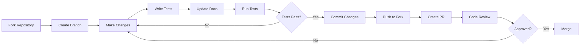

# Contributing to Service Mesh

Thank you for your interest in contributing to the Service Mesh project! This document provides guidelines and instructions for contributing to the project.

## Table of Contents

1. [Code of Conduct](#code-of-conduct)
2. [Getting Started](#getting-started)
3. [Development Setup](#development-setup)
4. [How to Contribute](#how-to-contribute)
5. [Coding Standards](#coding-standards)
6. [Testing Guidelines](#testing-guidelines)
7. [Documentation](#documentation)
8. [Pull Request Process](#pull-request-process)
9. [Issue Guidelines](#issue-guidelines)
10. [Release Process](#release-process)

## Code of Conduct

### Our Pledge

We are committed to providing a welcoming and inclusive environment for all contributors. We pledge to:

- Use welcoming and inclusive language
- Respect differing viewpoints and experiences
- Gracefully accept constructive criticism
- Focus on what is best for the community
- Show empathy towards other community members

### Unacceptable Behavior

The following behaviors are considered unacceptable:

- Harassment, discrimination, or offensive comments
- Personal attacks or trolling
- Publishing private information without permission
- Other conduct that could reasonably be considered inappropriate

### Enforcement

Project maintainers have the right to remove, edit, or reject contributions that violate this code of conduct. Instances of abusive behavior may be reported to [conduct@example.com].

## Getting Started

### Prerequisites

Before contributing, ensure you have:

1. **Rust Development Environment**
   - Rust 1.70 or higher
   - Cargo and rustup installed
   - rustfmt and clippy components

2. **Development Tools**
   - Git 2.30 or higher
   - Your favorite code editor with Rust support
   - Docker (for testing containerized deployments)
   - Kubernetes cluster (optional, for K8s testing)

3. **Knowledge Requirements**
   - Familiarity with Rust programming
   - Understanding of service mesh concepts
   - Basic knowledge of networking and TLS

### Fork and Clone

```bash
# Fork the repository on GitHub

# Clone your fork
git clone https://github.com/YOUR_USERNAME/service-mesh.git
cd service-mesh

# Add upstream remote
git remote add upstream https://github.com/original/service-mesh.git

# Verify remotes
git remote -v
```

## Development Setup

### Environment Setup

```bash
# Install Rust (if not already installed)
curl --proto '=https' --tlsv1.2 -sSf https://sh.rustup.rs | sh

# Install required components
rustup component add rustfmt clippy

# Install development tools
cargo install cargo-watch cargo-audit cargo-tarpaulin

# Install pre-commit hooks
cp scripts/pre-commit .git/hooks/pre-commit
chmod +x .git/hooks/pre-commit
```

### Build the Project

```bash
# Build in debug mode
cargo build

# Build in release mode
cargo build --release

# Run tests
cargo test

# Run with verbose output
RUST_LOG=debug cargo run
```

### IDE Setup

#### VS Code

```json
// .vscode/settings.json
{
    "rust-analyzer.cargo.features": ["all"],
    "rust-analyzer.checkOnSave.command": "clippy",
    "editor.formatOnSave": true,
    "[rust]": {
        "editor.defaultFormatter": "rust-lang.rust-analyzer"
    }
}
```

#### IntelliJ IDEA / CLion

1. Install the Rust plugin
2. Open the project as a Cargo project
3. Configure rustfmt on save
4. Enable clippy inspections

## How to Contribute

### Types of Contributions

#### 1. Bug Fixes

- Check existing issues for known bugs
- Create a minimal reproduction case
- Write tests that demonstrate the bug
- Submit a PR with the fix and tests

#### 2. New Features

- Discuss the feature in an issue first
- Get approval from maintainers
- Write comprehensive tests
- Update documentation
- Submit a PR with the implementation

#### 3. Performance Improvements

- Provide benchmark results
- Explain the optimization
- Ensure no functionality is broken
- Document any trade-offs

#### 4. Documentation

- Fix typos and improve clarity
- Add examples and use cases
- Update API documentation
- Translate documentation

#### 5. Testing

- Add missing tests
- Improve test coverage
- Add integration tests
- Add benchmark tests

### Contribution Workflow



## Coding Standards

### Rust Style Guide

We follow the official Rust style guide with some additional conventions:

```rust
// File organization
use std::collections::HashMap;  // Standard library imports first
use std::sync::Arc;

use tokio::sync::Mutex;        // External crates second
use serde::{Deserialize, Serialize};

use crate::config::Config;     // Internal imports last
use crate::error::Error;

// Constants in UPPER_SNAKE_CASE
const MAX_CONNECTIONS: usize = 100;

// Type aliases for clarity
type Result<T> = std::result::Result<T, Error>;

// Structs with derive macros
#[derive(Debug, Clone, Serialize, Deserialize)]
pub struct ServiceConfig {
    /// Service name (documented fields)
    pub name: String,

    /// Service port
    pub port: u16,

    // Private fields last
    internal_id: u64,
}

// Implementations
impl ServiceConfig {
    /// Creates a new ServiceConfig
    ///
    /// # Arguments
    ///
    /// * `name` - The service name
    /// * `port` - The service port
    ///
    /// # Examples
    ///
    /// ```
    /// let config = ServiceConfig::new("api", 8080);
    /// ```
    pub fn new(name: impl Into<String>, port: u16) -> Self {
        Self {
            name: name.into(),
            port,
            internal_id: 0,
        }
    }

    // Getters/setters
    pub fn name(&self) -> &str {
        &self.name
    }

    // Private methods last
    fn validate(&self) -> Result<()> {
        // Implementation
        Ok(())
    }
}

// Traits
pub trait ServiceDiscovery {
    /// Discover service endpoints
    fn discover(&self, service: &str) -> Result<Vec<Endpoint>>;

    /// Register a service
    fn register(&mut self, service: &str, endpoints: Vec<Endpoint>) -> Result<()>;
}

// Error handling
fn process_request(data: &[u8]) -> Result<Response> {
    // Use ? for error propagation
    let parsed = parse_data(data)?;

    // Use match for complex error handling
    match validate_data(&parsed) {
        Ok(valid) => Ok(process_valid_data(valid)),
        Err(e) if e.is_recoverable() => {
            log::warn!("Recoverable error: {}", e);
            Ok(Response::default())
        }
        Err(e) => Err(e),
    }
}

// Async functions
pub async fn handle_connection(socket: TcpStream) -> Result<()> {
    // Use async/await properly
    let (reader, writer) = socket.split();

    // Spawn tasks for concurrent execution
    let read_task = tokio::spawn(async move {
        // Reading logic
    });

    let write_task = tokio::spawn(async move {
        // Writing logic
    });

    // Wait for both tasks
    tokio::try_join!(read_task, write_task)?;

    Ok(())
}
```

### Code Formatting

```bash
# Format code
cargo fmt

# Check formatting
cargo fmt -- --check

# Configure rustfmt
# rustfmt.toml
edition = "2021"
max_width = 100
use_small_heuristics = "Max"
imports_granularity = "Module"
group_imports = "StdExternalCrate"
```

### Linting

```bash
# Run clippy
cargo clippy -- -D warnings

# Fix clippy suggestions
cargo clippy --fix

# Clippy configuration
# .clippy.toml
cognitive-complexity-threshold = 20
too-many-arguments-threshold = 8
```

## Testing Guidelines

### Test Organization

```rust
// Unit tests in the same file
#[cfg(test)]
mod tests {
    use super::*;

    #[test]
    fn test_basic_functionality() {
        // Arrange
        let config = ServiceConfig::new("test", 8080);

        // Act
        let result = config.validate();

        // Assert
        assert!(result.is_ok());
    }

    #[test]
    #[should_panic(expected = "invalid port")]
    fn test_panic_condition() {
        ServiceConfig::new("test", 0);
    }

    #[tokio::test]
    async fn test_async_function() {
        let result = async_operation().await;
        assert_eq!(result, expected);
    }
}

// Integration tests in tests/ directory
// tests/integration_test.rs
use service_mesh::*;

#[test]
fn test_end_to_end_flow() {
    // Test complete workflow
}
```

### Test Coverage

```bash
# Generate coverage report
cargo tarpaulin --out Html --output-dir coverage

# Minimum coverage requirements
# - Unit tests: 80%
# - Integration tests: 60%
# - Overall: 70%
```

### Property-Based Testing

```rust
use proptest::prelude::*;

proptest! {
    #[test]
    fn test_serialization_roundtrip(s: String, n: u16) {
        let config = ServiceConfig::new(s.clone(), n);
        let serialized = serde_json::to_string(&config).unwrap();
        let deserialized: ServiceConfig = serde_json::from_str(&serialized).unwrap();
        assert_eq!(config.name(), deserialized.name());
        assert_eq!(config.port, deserialized.port);
    }
}
```

### Benchmark Tests

```rust
use criterion::{black_box, criterion_group, criterion_main, Criterion};

fn bench_service_discovery(c: &mut Criterion) {
    let registry = create_test_registry();

    c.bench_function("discover_service", |b| {
        b.iter(|| {
            registry.discover(black_box("test-service"))
        });
    });
}

criterion_group!(benches, bench_service_discovery);
criterion_main!(benches);
```

## Documentation

### Code Documentation

```rust
/// Service mesh sidecar proxy
///
/// The `SidecarProxy` handles all network traffic for a service,
/// providing mTLS, load balancing, and observability.
///
/// # Examples
///
/// ```
/// use service_mesh::{SidecarProxy, ProxyConfig};
///
/// let config = ProxyConfig::default();
/// let proxy = SidecarProxy::new(config);
/// proxy.start().await?;
/// ```
///
/// # Errors
///
/// Returns `Error::Io` if unable to bind to the specified address.
pub struct SidecarProxy {
    // fields
}
```

### README Updates

When adding new features, update the README with:

- Feature description
- Usage examples
- Configuration options
- Performance impact

### API Documentation

```bash
# Generate documentation
cargo doc --no-deps --open

# Check documentation coverage
cargo doc-coverage

# Documentation must include:
# - All public APIs
# - Examples for complex functions
# - Error conditions
# - Performance considerations
```

## Pull Request Process

### Before Creating a PR

1. **Update your fork**
   ```bash
   git fetch upstream
   git checkout main
   git merge upstream/main
   ```

2. **Create a feature branch**
   ```bash
   git checkout -b feature/your-feature-name
   ```

3. **Make your changes**
   - Write clean, documented code
   - Add comprehensive tests
   - Update documentation

4. **Test thoroughly**
   ```bash
   # Run all tests
   cargo test

   # Run clippy
   cargo clippy -- -D warnings

   # Check formatting
   cargo fmt -- --check

   # Run security audit
   cargo audit
   ```

### PR Guidelines

#### Title Format

```
<type>(<scope>): <subject>

Types:
- feat: New feature
- fix: Bug fix
- docs: Documentation
- perf: Performance improvement
- refactor: Code refactoring
- test: Test improvements
- chore: Maintenance tasks

Examples:
- feat(proxy): Add circuit breaker support
- fix(discovery): Resolve endpoint caching issue
- docs(api): Update service registry examples
```

#### PR Description Template

```markdown
## Description
Brief description of the changes.

## Motivation and Context
Why is this change required? What problem does it solve?
Related issue: #123

## Changes Made
- Change 1
- Change 2
- Change 3

## Testing
- [ ] Unit tests pass
- [ ] Integration tests pass
- [ ] Manual testing completed

## Documentation
- [ ] API documentation updated
- [ ] README updated if needed
- [ ] CHANGELOG updated

## Screenshots (if applicable)

## Performance Impact
Describe any performance implications.

## Breaking Changes
List any breaking changes and migration steps.
```

### Review Process

1. **Automated Checks**
   - CI/CD pipeline must pass
   - Code coverage maintained
   - No security vulnerabilities

2. **Code Review**
   - At least 2 approvals required
   - All feedback addressed
   - No unresolved discussions

3. **Final Checks**
   - Branch up to date with main
   - Commits squashed if needed
   - CHANGELOG updated

## Issue Guidelines

### Bug Reports

```markdown
## Bug Description
Clear and concise description of the bug.

## Steps to Reproduce
1. Step 1
2. Step 2
3. Step 3

## Expected Behavior
What should happen.

## Actual Behavior
What actually happens.

## Environment
- Rust version:
- OS:
- Service Mesh version:

## Additional Context
Any additional information, logs, or screenshots.
```

### Feature Requests

```markdown
## Feature Description
Clear description of the proposed feature.

## Use Case
Explain the use case and why this feature would be valuable.

## Proposed Solution
Your suggested implementation approach.

## Alternatives Considered
Other solutions you've considered.

## Additional Context
Any mockups, examples, or references.
```

## Release Process

### Version Numbering

We follow Semantic Versioning (SemVer):
- MAJOR: Breaking changes
- MINOR: New features (backward compatible)
- PATCH: Bug fixes (backward compatible)

### Release Checklist

```markdown
- [ ] All tests passing
- [ ] Documentation updated
- [ ] CHANGELOG.md updated
- [ ] Version bumped in Cargo.toml
- [ ] Security audit completed
- [ ] Performance benchmarks run
- [ ] Release notes drafted
- [ ] Binaries built for all platforms
- [ ] Docker images built and tested
- [ ] Tag created and pushed
- [ ] GitHub release created
- [ ] Crates.io package published
```

### Release Commands

```bash
# Update version
cargo set-version 1.2.3

# Create tag
git tag -a v1.2.3 -m "Release v1.2.3"
git push origin v1.2.3

# Publish to crates.io
cargo publish

# Build release binaries
./scripts/build-release.sh
```

## Getting Help

### Resources

- [Documentation](https://docs.service-mesh.io)
- [API Reference](https://api.service-mesh.io)
- [Discord Community](https://discord.gg/service-mesh)
- [Stack Overflow](https://stackoverflow.com/questions/tagged/service-mesh)

### Communication Channels

- **GitHub Issues**: Bug reports and feature requests
- **Discord**: Real-time discussion and help
- **Mailing List**: Announcements and discussions
- **Twitter**: Updates and announcements

## Recognition

### Contributors

We maintain a list of all contributors in [CONTRIBUTORS.md](../CONTRIBUTORS.md). All contributors are added automatically via GitHub.

### Code Ownership

The [CODEOWNERS](../.github/CODEOWNERS) file defines who is responsible for different parts of the codebase.

## License

By contributing to this project, you agree that your contributions will be licensed under the same license as the project (Apache 2.0).

## Thank You!

Your contributions make this project better for everyone. Thank you for taking the time to contribute!