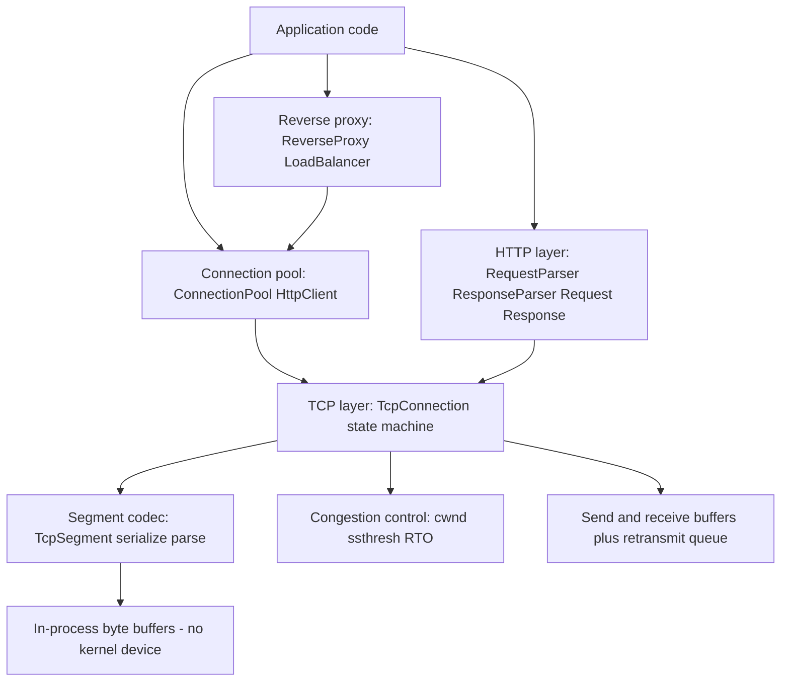

# Network Stack (TCP + HTTP)

A userspace TCP/IP and HTTP/1.1 stack written from scratch in Rust. It implements
the full RFC 793 TCP state machine, sequence-number arithmetic with `u32`
wrap-around, sliding-window flow control, RFC 6298 RTT estimation and
retransmission, TCP Reno congestion control, an incremental HTTP/1.1
request/response parser, a keep-alive connection pool, and a reverse proxy with
load balancing and health checks. The stack runs entirely in-process: it parses,
serializes, and drives protocol state on byte buffers rather than a real kernel
network device.

## Features

- **Full TCP state machine** — all 11 RFC 793 states (`TcpState`) with active/passive
  open, three-way handshake, simultaneous open, and the complete close sequence
  (`TcpConnection`).
- **Sequence-number arithmetic** — wrapping `u32` comparisons for ACK validation and
  out-of-order reassembly (`SeqNum`, `AckNum`).
- **Sliding-window flow control** — send volume is clamped by both the receiver's
  advertised window and the congestion window (`SendSequenceSpace`, `RecvSequenceSpace`).
- **Retransmission and RTT** — RFC 6298 SRTT/RTTVAR estimation, RTO with exponential
  back-off, and fast retransmit after 3 duplicate ACKs (`CongestionControl`,
  `RetransmitEntry`).
- **TCP Reno congestion control** — slow start, congestion avoidance, and fast
  recovery (`CongestionControl::on_ack` / `on_dup_ack` / `on_timeout`).
- **Segment parsing and serialization** — TCP header and options (MSS, window scale,
  timestamps) plus pseudo-header checksum (`TcpSegment`, `TcpOption`).
- **HTTP/1.1 parser** — incremental request and response parsing with Content-Length
  bodies, chunked transfer decoding, and case-insensitive headers (`RequestParser`,
  `ResponseParser`, `Headers`).
- **HTTP builders and URL parsing** — fluent `Request`/`Response` construction with
  serialization, and a `Url` parser (`Method`, `StatusCode`, `Url`).
- **Connection pool** — keep-alive reuse with idle-timeout eviction, per-host and
  total caps, lifetime limits, and metrics (`ConnectionPool`, `PoolConfig`).
- **Reverse proxy** — round-robin, weighted round-robin, least-connections, random, and
  IP-hash load balancing, plus threshold-based health tracking and access logging
  (`ReverseProxy`, `LoadBalancer`, `Backend`).

## Architecture



| Component | Module | Responsibility |
|-----------|--------|----------------|
| TCP connection | `tcp` | State machine, handshake, flow control, data transfer, close |
| Segment codec | `tcp` | Parse/serialize TCP headers, options, and checksum |
| Congestion control | `tcp` | Reno slow start / avoidance / fast recovery, RTT and RTO |
| HTTP parser | `http` | Incremental request/response parsing, chunked decoding, headers |
| HTTP messages | `http` | `Request`/`Response` builders, `Url` parsing, status codes |
| Connection pool | `pool` | Keep-alive reuse, idle eviction, per-host caps, metrics |
| Reverse proxy | `proxy` | Backend selection, load balancing, health checks, access log |

## Quick Start

### Prerequisites

- Rust 1.70+ with `cargo` (stable toolchain).
- No external services, network access, or kernel TUN/TAP device required to build or
  run the tests.

### Installation

```bash
cd 14-network-stack
cargo build
```

### Running

This crate is a library. Build it, run the test suite, or add it as a path dependency
and import it:

```rust
use network_stack::tcp::TcpConnection;
use network_stack::http::RequestParser;
```

```bash
cargo test
```

## Usage

Parse an HTTP/1.1 request incrementally with the real parser API:

```rust
use network_stack::http::{RequestParser, Method};

let mut parser = RequestParser::new();
let data = b"GET /index.html HTTP/1.1\r\n\
             Host: example.com\r\n\
             Content-Length: 5\r\n\
             \r\n\
             hello";

let request = parser.feed(data).unwrap().unwrap();
assert_eq!(request.method, Method::Get);
assert_eq!(request.uri, "/index.html");
assert_eq!(request.headers.get("host"), Some("example.com"));
assert_eq!(&request.body[..], b"hello");
```

Drive a TCP three-way handshake between two in-process connections:

```rust
use network_stack::tcp::{TcpConnection, TcpState};

let client_addr = "127.0.0.1:12345".parse().unwrap();
let server_addr = "127.0.0.1:80".parse().unwrap();

let mut client = TcpConnection::new(client_addr, server_addr);
let mut server = TcpConnection::new(server_addr, client_addr);

server.listen().unwrap();

let syn = client.connect().unwrap();          // CLOSED -> SYN_SENT
let syn_ack = server.on_segment(syn).unwrap().unwrap(); // -> SYN_RECEIVED
let ack = client.on_segment(syn_ack).unwrap().unwrap(); // -> ESTABLISHED
server.on_segment(ack).unwrap();              // -> ESTABLISHED

assert_eq!(client.state, TcpState::Established);
assert_eq!(server.state, TcpState::Established);
```

## What's Real vs Simulated

- **Real:** The TCP state machine, sequence arithmetic, sliding-window flow control,
  Reno congestion control, RFC 6298 RTT/RTO estimation, retransmission and fast
  retransmit, TCP segment parsing/serialization with checksum, the HTTP/1.1
  request/response parser (Content-Length and chunked), the connection pool, and the
  reverse proxy with load balancing and health tracking. All of this is exercised by
  the test suite.
- **Simulated / in-process only:** There is **no TUN/TAP or real kernel network
  device**. The stack operates on byte buffers and `TcpSegment` values passed between
  in-process `TcpConnection` instances; it does not send or receive actual IP packets
  on the host. `ReverseProxy::process_request` selects a backend and records metrics
  but synthesizes the backend response rather than forwarding over a socket.

## Testing

```bash
cargo test
```

The suite has 183 integration tests across `tests/tcp_test.rs` (60),
`tests/http_test.rs` (76), and `tests/pool_test.rs` (47), plus 32 in-module unit tests
(215 total). It covers segment parsing, handshake and close transitions, flow and
congestion control, retransmission, HTTP request/response and chunked parsing, URL
parsing, pool lifecycle, and load-balancer behavior. No external services or network
access are required.

## Project Structure

```
14-network-stack/
  README.md            # This file
  Cargo.toml           # Crate manifest and dependencies
  src/
    lib.rs             # Crate root, shared Error / Result types
    tcp.rs             # TCP state machine, segments, buffers, congestion control
    http.rs            # HTTP/1.1 parser, Request/Response, Headers, Url
    pool.rs            # Connection pool, host limiter, DNS cache, HttpClient
    proxy.rs           # Reverse proxy, load balancer, health checks, access log
  tests/
    tcp_test.rs        # TCP state machine, handshake, flow/congestion control
    http_test.rs       # Request/response parsing, chunked bodies, headers, URLs
    pool_test.rs       # Connection pool lifecycle and limits
  docs/
    BLUEPRINT.md       # Full architecture and design document
```

## License

MIT — see [LICENSE](../LICENSE)
