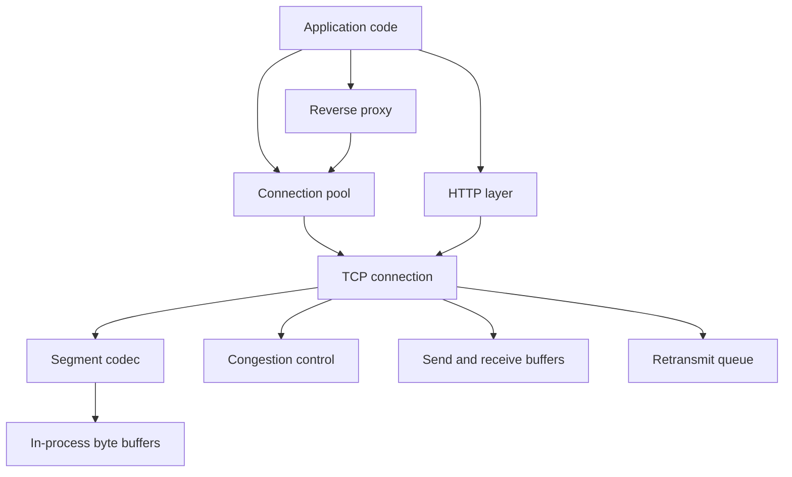
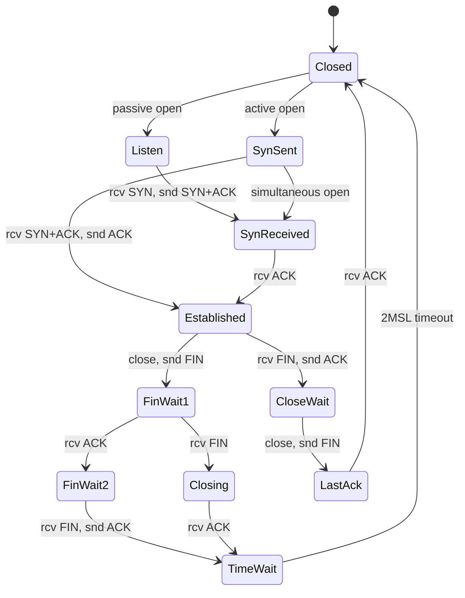

# Network Stack (TCP + HTTP)

## Overview

A userspace network stack covering TCP transport internals and HTTP/1.1 message
processing, written from scratch in Rust. The project implements the RFC 793 TCP state
machine, sequence/acknowledgment arithmetic over wrapping `u32` values, sliding-window
flow control, RFC 6298 RTT estimation and retransmission, TCP Reno congestion control,
an incremental HTTP/1.1 parser with chunked transfer decoding, a keep-alive connection
pool, and a reverse proxy with load balancing and health checks.

The goal is to make the mechanics of TCP and HTTP concrete: how a connection moves
through its eleven states, how sequence numbers and windows bound the amount of data in
flight, how lost segments are detected and retransmitted, how the congestion window
grows and collapses, and how an HTTP/1.1 byte stream is turned into structured requests
and responses. Everything operates in-process on byte buffers and `TcpSegment` values;
the stack does not bind to a real kernel network device, so the protocol logic can be
driven deterministically from tests without packet loss, NAT, or root privileges.

Scope:

- TCP connection management, flow control, congestion control, and retransmission.
- TCP segment parsing/serialization, including options and the pseudo-header checksum.
- HTTP/1.1 request and response parsing (Content-Length and chunked), plus builders.
- Connection pooling with idle/lifetime eviction and per-host limits.
- A reverse proxy with multiple load-balancing strategies and health tracking.

Out of scope: a real IP/Ethernet device (TUN/TAP), TLS, HTTP/2, and IPv6 checksum
handling. These are noted where the design touches them so the boundary stays honest.

## Architecture



The layers are organized so each one depends only on those beneath it:

- **TCP layer (`tcp`)** owns connection state. `TcpConnection` holds the send and
  receive sequence spaces, the congestion controller, send/receive buffers, the
  retransmit queue, and the out-of-order segment map. `TcpSegment` is the on-wire unit:
  it parses from and serializes to bytes and computes a checksum over an IPv4
  pseudo-header.
- **HTTP layer (`http`)** is independent of TCP and works on raw byte slices.
  `RequestParser` and `ResponseParser` are incremental state machines that accept
  partial input via `feed` and return a complete `Request`/`Response` once enough bytes
  have arrived. `Request`, `Response`, `Headers`, `Method`, `StatusCode`, and `Url`
  provide builders and accessors.
- **Pool layer (`pool`)** sits above TCP. `ConnectionPool` stores idle
  `PooledConnection`s keyed by `SocketAddr`, enforces per-host and total caps, and evicts
  stale, expired, or over-used connections. `HttpClient`, `ConnectionGuard`,
  `HostLimiter`, `Semaphore`, and `DnsCache` are supporting types.
- **Proxy layer (`proxy`)** composes the pool and HTTP layers. `ReverseProxy` selects a
  `Backend` through a `LoadBalancer`, prepares forwarding headers, and records access
  log entries and per-backend metrics.

The TCP connection moves through the standard lifecycle:



### Dependencies

The crate is built on a small set of well-scoped libraries, declared in `Cargo.toml`:

```toml
[dependencies]
tokio = { version = "1", features = ["full"] }   # async runtime primitives
bytes = "1"                                       # BytesMut buffers
bitflags = "2"                                    # TcpFlags bit set
etherparse = "0.13"                               # packet parsing helpers
rand = "0.8"                                       # ISN generation
thiserror = "1"                                   # Error derive
tracing = "0.1"                                    # structured logging
parking_lot = "0.12"                              # Mutex for pool/listener state
```

## Core Components

### TCP State Machine

`TcpConnection::on_segment` is the central dispatch: it matches on the current
`TcpState` and applies the RFC 793 transitions for the incoming segment, returning an
optional response segment to send back.

- **Active open** (`connect`) generates an initial send sequence number (ISN) via
  `rand::random`, emits a SYN carrying MSS and window-scale options, advances
  `send.nxt`, and moves to `SynSent`.
- **Passive open** (`listen`) moves the connection to `Listen`; a subsequent SYN
  produces a SYN-ACK and a transition to `SynReceived`.
- **Handshake completion** is handled in `SynSent` (validating the SYN-ACK's ACK number
  before moving to `Established`) and in `SynReceived` (consuming the final ACK).
- **Simultaneous open** is supported: a bare SYN received in `SynSent` produces a
  SYN-ACK and moves to `SynReceived` rather than failing.
- **Close** is driven by `close`, which sends a FIN and moves `Established -> FinWait1`
  or `CloseWait -> LastAck`. The closing path covers `FinWait1`, `FinWait2`, `Closing`,
  `LastAck`, and `TimeWait`, including the `FinWait1 -> Closing` simultaneous-close case.

The dispatch is a single `match` on `self.state`, with each arm responsible for the
transitions valid in that state and for synthesizing any response segment:

```rust
pub fn on_segment(&mut self, segment: TcpSegment) -> Result<Option<TcpSegment>> {
    self.last_activity = Instant::now();

    match self.state {
        TcpState::Listen => {
            if segment.flags.contains(TcpFlags::SYN) {
                // Record the peer's ISN and reply with SYN-ACK.
                self.recv = RecvSequenceSpace::new(segment.seq_num);
                self.state = TcpState::SynReceived;

                let mut syn_ack = TcpSegment::new(
                    self.local_addr.port(),
                    self.remote_addr.port(),
                );
                syn_ack.seq_num = self.send.iss;
                syn_ack.ack_num = self.recv.nxt;
                syn_ack.flags = TcpFlags::SYN | TcpFlags::ACK;
                syn_ack.window = self.recv.wnd;
                syn_ack.options.push(TcpOption::Mss(self.mss));
                self.send.nxt = self.send.iss.wrapping_add(1);
                Ok(Some(syn_ack))
            } else {
                Ok(None)
            }
        }
        TcpState::SynSent => {
            if segment.flags.contains(TcpFlags::SYN | TcpFlags::ACK) {
                if segment.ack_num != self.send.nxt {
                    return Err(Error::Protocol("Invalid ACK in SYN-ACK".into()));
                }
                self.recv = RecvSequenceSpace::new(segment.seq_num);
                self.send.una = segment.ack_num;
                self.send.wnd = segment.window;
                self.state = TcpState::Established;
                // ... emit ACK ...
            }
            // ... simultaneous-open branch on bare SYN ...
            Ok(None)
        }
        // Established, FinWait1, FinWait2, CloseWait, Closing, LastAck, TimeWait ...
        _ => Ok(None),
    }
}
```

The active open builds the SYN, advertises MSS and window scale, and reserves one
sequence number for the SYN itself:

```rust
pub fn connect(&mut self) -> Result<TcpSegment> {
    if self.state != TcpState::Closed {
        return Err(Error::InvalidState("Cannot connect in current state".into()));
    }
    self.state = TcpState::SynSent;

    let mut syn = TcpSegment::new(self.local_addr.port(), self.remote_addr.port());
    syn.seq_num = self.send.iss;
    syn.flags = TcpFlags::SYN;
    syn.options.push(TcpOption::Mss(self.mss));
    syn.options.push(TcpOption::WindowScale(7));

    self.send.nxt = self.send.iss.wrapping_add(1);
    Ok(syn)
}
```

Sequence comparison is done with wrapping arithmetic so the 32-bit sequence space wraps
cleanly. `is_seq_before`, `is_seq_after`, and `is_seq_between_or_equal` cast the
difference of two `u32`s to `i32` to determine ordering, and `is_valid_ack` checks that
an ACK falls within `[SND.UNA, SND.NXT]`.

### Send Path, Flow Control, and Reassembly

`send` appends application bytes to `send_buffer` and calls `flush_send_buffer`, which
segments the buffer into MSS-sized chunks bounded by the effective window. The effective
window is `min(send.wnd, congestion.cwnd)` minus the bytes already in flight
(`send.nxt - send.una`); when that available space reaches zero, flushing stops. Each
emitted segment is recorded in the `retransmit_queue` keyed by its starting sequence
number, with a send timestamp and a retransmit count.

The flush loop computes the available window each iteration, drains up to one MSS from
the send buffer, records the segment for retransmission, and advances `send.nxt`:

```rust
fn flush_send_buffer(&mut self) -> Result<Vec<TcpSegment>> {
    let mut segments = Vec::new();

    while !self.send_buffer.is_empty() {
        let in_flight = self.send.nxt.wrapping_sub(self.send.una);
        let window = (self.send.wnd as u32).min(self.congestion.cwnd);
        if in_flight >= window {
            break; // window full
        }

        let available = window - in_flight;
        let to_send = available
            .min(self.mss as u32)
            .min(self.send_buffer.len() as u32);
        if to_send == 0 {
            break;
        }

        let data: Vec<u8> = self.send_buffer.drain(..to_send as usize).collect();

        let mut segment = TcpSegment::new(self.local_addr.port(), self.remote_addr.port());
        segment.seq_num = self.send.nxt;
        segment.ack_num = self.recv.nxt;
        segment.flags = TcpFlags::ACK | TcpFlags::PSH;
        segment.payload = BytesMut::from(&data[..]);

        self.retransmit_queue.insert(self.send.nxt, RetransmitEntry {
            seq: self.send.nxt,
            data: segment.payload.clone(),
            sent_at: Instant::now(),
            retransmits: 0,
        });

        self.send.nxt = self.send.nxt.wrapping_add(to_send);
        segments.push(segment);
    }
    Ok(segments)
}
```

On the receive side, `process_data` delivers in-order data directly into `recv_buffer`
and advances `recv.nxt`. Out-of-order segments are parked in the `ooo_segments`
`BTreeMap` keyed by sequence number; whenever a gap is filled, contiguous parked
segments are drained into the receive buffer. Every data segment is acknowledged with the
current `recv.nxt` and an advertised window computed from the remaining receive-buffer
space:

```rust
fn process_data(&mut self, seq: SeqNum, data: BytesMut) -> Result<TcpSegment> {
    if seq == self.recv.nxt {
        // In-order: append and pull any now-contiguous out-of-order segments.
        self.recv_buffer.extend(data.iter());
        self.recv.nxt = self.recv.nxt.wrapping_add(data.len() as u32);
        while let Some(entry) = self.ooo_segments.remove(&self.recv.nxt) {
            self.recv_buffer.extend(entry.iter());
            self.recv.nxt = self.recv.nxt.wrapping_add(entry.len() as u32);
        }
    } else if self.is_seq_after(seq, self.recv.nxt) {
        // Gap ahead of RCV.NXT: park until the hole is filled.
        self.ooo_segments.insert(seq, data);
    }
    // ... build and return the ACK segment ...
}
```

### Retransmission and Timers

RTT estimation and the retransmission timeout live in `CongestionControl` and follow
RFC 6298:

- `update_rtt` maintains a smoothed RTT (`srtt`) and RTT variance (`rttvar`) with the
  standard `alpha = 1/8`, `beta = 1/4` weights, then sets `rto = srtt + 4 * rttvar`,
  clamped to the range 200 ms to 60 s.
- `get_retransmits` walks the retransmit queue and re-emits any segment whose age exceeds
  the current RTO, updating its send time and incrementing its retransmit count. If any
  segment timed out, `on_timeout` is applied to the congestion controller.
- Fast retransmit is triggered through duplicate-ACK accounting in `process_ack`: a
  repeated ACK for `send.una` calls `on_dup_ack`, and the third duplicate enters fast
  recovery.

The RTO computation follows RFC 6298 directly, with the variance term weighted four
times the smoothed RTT and the result clamped to a sane range:

```rust
pub fn update_rtt(&mut self, measured_rtt: Duration) {
    let alpha = 0.125;
    let beta = 0.25;

    let diff = if measured_rtt > self.srtt {
        measured_rtt - self.srtt
    } else {
        self.srtt - measured_rtt
    };

    self.rttvar = Duration::from_secs_f64(
        (1.0 - beta) * self.rttvar.as_secs_f64() + beta * diff.as_secs_f64(),
    );
    self.srtt = Duration::from_secs_f64(
        (1.0 - alpha) * self.srtt.as_secs_f64() + alpha * measured_rtt.as_secs_f64(),
    );
    self.rto = self.srtt + 4 * self.rttvar;

    if self.rto < Duration::from_millis(200) { self.rto = Duration::from_millis(200); }
    if self.rto > Duration::from_secs(60) { self.rto = Duration::from_secs(60); }
}
```

`get_retransmits` re-emits timed-out segments and, if anything timed out, applies the
timeout response to the congestion controller after the loop:

```rust
pub fn get_retransmits(&mut self) -> Vec<TcpSegment> {
    let mut segments = Vec::new();
    let now = Instant::now();
    let rto = self.congestion.rto;

    for entry in self.retransmit_queue.values_mut() {
        if now.duration_since(entry.sent_at) > rto {
            let mut segment = TcpSegment::new(/* ports */);
            segment.seq_num = entry.seq;
            segment.flags = TcpFlags::ACK | TcpFlags::PSH;
            segment.payload = entry.data.clone();
            entry.sent_at = now;
            entry.retransmits += 1;
            segments.push(segment);
        }
    }

    if !segments.is_empty() {
        self.congestion.on_timeout();
    }
    segments
}
```

### Congestion Control (TCP Reno)

`CongestionControl` implements TCP Reno over the congestion window `cwnd` and slow-start
threshold `ssthresh`:

- **Slow start** (`cwnd < ssthresh`): `on_ack` grows `cwnd` by the number of bytes
  acknowledged, giving exponential growth per RTT.
- **Congestion avoidance** (`cwnd >= ssthresh`): `on_ack` grows `cwnd` by roughly one
  MSS per RTT using the `(MSS * bytes_acked) / cwnd` approximation.
- **Fast recovery**: the third duplicate ACK (`on_dup_ack`) halves `ssthresh`, inflates
  `cwnd` to `ssthresh + 3 * MSS`, and sets the `fast_recovery` flag; further duplicates
  inflate `cwnd` by one MSS each. The next new ACK exits recovery by setting `cwnd` back
  to `ssthresh`.
- **Timeout** (`on_timeout`): `ssthresh` is set to half of `cwnd`, `cwnd` collapses to
  one MSS, and the RTO doubles (exponential back-off, capped at 60 s).

The three event handlers encode the full Reno response:

```rust
pub fn on_ack(&mut self, bytes_acked: u32) {
    if self.fast_recovery {
        self.cwnd = self.ssthresh;        // exit fast recovery
        self.fast_recovery = false;
    } else if self.cwnd < self.ssthresh {
        self.cwnd += bytes_acked;          // slow start: exponential
    } else {
        self.cwnd += (1460 * bytes_acked) / self.cwnd; // avoidance: ~1 MSS/RTT
    }
    self.dup_acks = 0;
}

pub fn on_dup_ack(&mut self) {
    self.dup_acks += 1;
    if self.dup_acks == 3 && !self.fast_recovery {
        self.ssthresh = self.cwnd / 2;
        self.cwnd = self.ssthresh + 3 * 1460; // inflate by the 3 dup-ACKed segments
        self.fast_recovery = true;
    } else if self.fast_recovery {
        self.cwnd += 1460;                  // keep inflating while in recovery
    }
}

pub fn on_timeout(&mut self) {
    self.ssthresh = self.cwnd / 2;
    self.cwnd = 1460;                       // reset to 1 MSS
    self.dup_acks = 0;
    self.fast_recovery = false;
    self.rto *= 2;                          // exponential back-off
    if self.rto > Duration::from_secs(60) { self.rto = Duration::from_secs(60); }
}
```

### HTTP/1.1 Parser

`RequestParser` and `ResponseParser` are incremental state machines over an internal
`BytesMut` buffer. `feed` appends bytes and runs the parser until either a full message
is produced or more input is needed (returning `Ok(None)`). The states are the request
or status line, headers, fixed-length body, chunked body, and complete.

- **Line parsing** uses `find_line_end` to locate CRLF boundaries; the request line is
  split into method, URI, and version, while the status line splits into version, status
  code, and an optional reason phrase.
- **Headers** are accumulated case-insensitively in `Headers`, which stores values in a
  `HashMap<String, Vec<String>>` and exposes helpers such as `content_length`,
  `is_chunked`, and `is_keep_alive`.
- **Body framing** is chosen after the header terminator: chunked transfer encoding
  routes to the chunked decoder, a `Content-Length` routes to the fixed-length body
  reader, and neither completes the message immediately.
- **Chunked decoding** parses each hex chunk size (ignoring extensions after `;`),
  reads that many bytes into the body, consumes the trailing CRLF, and finishes on a
  zero-length chunk after skipping trailers.

The parser is a loop over `state`; each state either makes progress or returns
`Ok(None)` to request more bytes, and the body-framing decision happens at the end of
the header block:

```rust
fn parse(&mut self) -> Result<Option<Request>> {
    loop {
        match self.state {
            ParserState::RequestLine => {
                if !self.parse_request_line()? { return Ok(None); }
            }
            ParserState::Headers => {
                if !self.parse_headers()? { return Ok(None); }
            }
            ParserState::Body => {
                if !self.parse_body()? { return Ok(None); }
            }
            ParserState::Chunked => {
                if !self.parse_chunked()? { return Ok(None); }
            }
            ParserState::Complete => {
                let request = self.request.take();
                self.reset();
                return Ok(request);
            }
        }
    }
}

// On the empty line that terminates headers:
if request.headers.is_chunked() {
    self.state = ParserState::Chunked;
} else if let Some(len) = request.headers.content_length() {
    self.body_remaining = len;
    self.state = ParserState::Body;
} else {
    self.state = ParserState::Complete;
}
```

The chunked decoder is itself a small state machine over `chunk_state`:

```rust
fn parse_chunked(&mut self) -> Result<bool> {
    loop {
        match self.chunk_state {
            ChunkState::Size => {
                if let Some(line_end) = self.find_line_end() {
                    let line = str::from_utf8(&self.buffer[..line_end])?;
                    let size_str = line.split(';').next().unwrap_or(line).trim();
                    let size = usize::from_str_radix(size_str, 16)?;
                    let _ = self.buffer.split_to(line_end + 2);
                    self.chunk_state = if size == 0 {
                        ChunkState::Trailer
                    } else {
                        ChunkState::Data { remaining: size }
                    };
                } else { return Ok(false); }
            }
            ChunkState::Data { remaining } => {
                if self.buffer.len() >= remaining {
                    let chunk = self.buffer.split_to(remaining);
                    self.request.as_mut().unwrap().body.extend_from_slice(&chunk);
                    self.chunk_state = ChunkState::DataEnd;
                } else { return Ok(false); }
            }
            ChunkState::DataEnd => { /* consume CRLF, back to Size */ }
            ChunkState::Trailer => { /* skip trailers, then Complete */ }
        }
    }
}
```

`Request` and `Response` provide fluent builders (`header`, `body`) and `serialize`,
which emits the start line, headers, an inferred `Content-Length` when a body is present,
and the body. `Url::parse` splits a URL into scheme, host, optional port, path, and
query and computes the effective port.

### Connection Pool

`ConnectionPool` manages keep-alive reuse. Idle connections are stored per `SocketAddr`
in a `HashMap<SocketAddr, VecDeque<PooledConnection>>`, with separate per-host active
counts and a global total. `acquire_slot` enforces the per-host (`max_per_host`) and
total (`max_total`) caps before a new connection is created. `get` returns a reusable
idle connection, skipping any that are stale (`max_idle_time`), expired
(`max_lifetime`), or have served `max_requests_per_conn` requests; it increments the
per-host active count and the `reused` metric. `put` returns a connection to the idle
set unless it is expired, over-used, or the host is already at capacity.

`ConnectionGuard` implements RAII return-to-pool on `Drop`, with `broken` and `take`
escape hatches. `HostLimiter` and `Semaphore` provide simple per-host concurrency limits,
and `DnsCache` memoizes host-to-address resolution with a TTL. `PoolMetrics` tracks
creates, reuses, misses, returns, and the several eviction reasons.

### Reverse Proxy

`ReverseProxy` composes a `LoadBalancer` over a set of `Backend`s. `select` filters to
backends that `can_accept` (healthy and below their connection cap) and then applies the
configured `LoadBalanceStrategy`:

- **RoundRobin** advances a shared counter modulo the healthy-backend count.
- **WeightedRoundRobin** distributes selections proportionally to each backend's
  `weight`.
- **LeastConnections** picks the backend with the fewest active connections.
- **Random** selects using a time-derived index.
- **IpHash** hashes the client IP for sticky routing.

Health is threshold-based: `mark_healthy` and `mark_unhealthy` track consecutive
successes and failures and flip a backend's `HealthStatus` once `healthy_threshold` or
`unhealthy_threshold` is reached. `process_request` selects a backend, records metrics
and an `AccessLogEntry`, and returns a response; in this in-process build the backend
response is synthesized rather than forwarded over a socket. `prepare_headers` strips
hop-by-hop headers and adds `X-Forwarded-For` / `X-Real-IP`.

## Data Structures

The core TCP connection control block aggregates state, sequence spaces, buffers, and
the retransmit and out-of-order maps:

```rust
pub struct TcpConnection {
    pub state: TcpState,
    pub local_addr: SocketAddr,
    pub remote_addr: SocketAddr,
    pub send: SendSequenceSpace,
    pub recv: RecvSequenceSpace,
    pub congestion: CongestionControl,
    pub send_buffer: VecDeque<u8>,
    pub recv_buffer: VecDeque<u8>,
    pub retransmit_queue: BTreeMap<SeqNum, RetransmitEntry>,
    pub ooo_segments: BTreeMap<SeqNum, BytesMut>,
    pub mss: u16,
    pub window_scale: u8,
    pub last_activity: Instant,
}

pub enum TcpState {
    Closed, Listen, SynSent, SynReceived, Established,
    FinWait1, FinWait2, CloseWait, Closing, LastAck, TimeWait,
}

pub struct SendSequenceSpace {
    pub una: SeqNum,   // send unacknowledged
    pub nxt: SeqNum,   // send next
    pub wnd: WindowSize,
    pub wl1: SeqNum,
    pub wl2: AckNum,
    pub iss: SeqNum,   // initial send sequence number
}

pub struct RecvSequenceSpace {
    pub nxt: SeqNum,   // next expected sequence number
    pub wnd: WindowSize,
    pub irs: SeqNum,   // initial receive sequence number
}
```

The segment type carries header fields, parsed options, and a payload, and knows how to
parse and serialize itself:

```rust
pub struct TcpSegment {
    pub src_port: u16,
    pub dst_port: u16,
    pub seq_num: SeqNum,
    pub ack_num: AckNum,
    pub data_offset: u8,        // header length in 32-bit words
    pub flags: TcpFlags,
    pub window: WindowSize,
    pub checksum: u16,
    pub urgent_ptr: u16,
    pub options: Vec<TcpOption>,
    pub payload: BytesMut,
}

bitflags! {
    pub struct TcpFlags: u8 {
        const FIN = 0b00000001;
        const SYN = 0b00000010;
        const RST = 0b00000100;
        const PSH = 0b00001000;
        const ACK = 0b00010000;
        const URG = 0b00100000;
        const ECE = 0b01000000;
        const CWR = 0b10000000;
    }
}

pub enum TcpOption {
    Mss(u16),
    WindowScale(u8),
    SackPermitted,
    Sack(Vec<(SeqNum, SeqNum)>),
    Timestamps { ts_val: u32, ts_ecr: u32 },
}
```

Congestion control state and a retransmit-queue entry:

```rust
pub struct CongestionControl {
    pub cwnd: u32,
    pub ssthresh: u32,
    pub srtt: Duration,
    pub rttvar: Duration,
    pub rto: Duration,
    pub dup_acks: u32,
    pub fast_recovery: bool,
}

pub struct RetransmitEntry {
    pub seq: SeqNum,
    pub data: BytesMut,
    pub sent_at: Instant,
    pub retransmits: u32,
}
```

The HTTP message types and parser store headers case-insensitively and frame bodies by
length or chunked encoding:

```rust
pub struct Request {
    pub method: Method,
    pub uri: String,
    pub version: HttpVersion,
    pub headers: Headers,
    pub body: BytesMut,
}

pub struct Response {
    pub version: HttpVersion,
    pub status: StatusCode,
    pub headers: Headers,
    pub body: BytesMut,
}

pub struct Headers {
    headers: HashMap<String, Vec<String>>,  // lowercase keys
}

pub struct RequestParser {
    state: ParserState,           // RequestLine | Headers | Body | Chunked | Complete
    buffer: BytesMut,
    request: Option<Request>,
    body_remaining: usize,
    chunk_state: ChunkState,      // Size | Data { remaining } | DataEnd | Trailer
}
```

The pool and proxy configuration and runtime types:

```rust
pub struct PoolConfig {
    pub max_per_host: usize,
    pub max_total: usize,
    pub connect_timeout: Duration,
    pub max_idle_time: Duration,
    pub max_lifetime: Duration,
    pub max_requests_per_conn: u64,
}

pub struct PooledConnection {
    pub connection: TcpConnection,
    pub created_at: Instant,
    pub last_used: Instant,
    pub requests_served: u64,
}

pub struct BackendConfig {
    pub address: String,
    pub weight: u32,
    pub max_connections: usize,
    pub health_check_path: String,
    pub health_check_interval: Duration,
    pub unhealthy_threshold: u32,
    pub healthy_threshold: u32,
}

pub enum LoadBalanceStrategy {
    RoundRobin, LeastConnections, WeightedRoundRobin, Random, IpHash,
}

pub enum HealthStatus { Healthy, Unhealthy, Unknown }
```

## API Design

The crate root re-exports a shared error type and `Result` alias:

```rust
pub enum Error {
    Connection(String),
    Protocol(String),
    Timeout,
    ConnectionRefused,
    ConnectionReset,
    InvalidState(String),
    Parse(String),
    Io(std::io::Error),
}

pub type Result<T> = std::result::Result<T, Error>;
```

TCP — driving a connection and its segments:

```rust
impl TcpConnection {
    pub fn new(local_addr: SocketAddr, remote_addr: SocketAddr) -> Self;
    pub fn connect(&mut self) -> Result<TcpSegment>;
    pub fn listen(&mut self) -> Result<()>;
    pub fn on_segment(&mut self, segment: TcpSegment) -> Result<Option<TcpSegment>>;
    pub fn send(&mut self, data: &[u8]) -> Result<Vec<TcpSegment>>;
    pub fn read(&mut self) -> Vec<u8>;
    pub fn close(&mut self) -> Result<Option<TcpSegment>>;
    pub fn get_retransmits(&mut self) -> Vec<TcpSegment>;
}

impl TcpSegment {
    pub fn new(src_port: u16, dst_port: u16) -> Self;
    pub fn parse(data: &[u8]) -> Result<Self>;
    pub fn serialize(&self) -> BytesMut;
    pub fn calculate_checksum(&self, src_ip: IpAddr, dst_ip: IpAddr) -> u16;
}

impl CongestionControl {
    pub fn update_rtt(&mut self, measured_rtt: Duration);
    pub fn on_ack(&mut self, bytes_acked: u32);
    pub fn on_dup_ack(&mut self);
    pub fn on_timeout(&mut self);
}
```

HTTP — parsing and building messages:

```rust
impl RequestParser {
    pub fn new() -> Self;
    pub fn feed(&mut self, data: &[u8]) -> Result<Option<Request>>;
}

impl ResponseParser {
    pub fn new() -> Self;
    pub fn feed(&mut self, data: &[u8]) -> Result<Option<Response>>;
}

impl Request {
    pub fn new(method: Method, uri: impl Into<String>) -> Self;
    pub fn header(self, name: impl Into<String>, value: impl Into<String>) -> Self;
    pub fn body(self, body: impl Into<BytesMut>) -> Self;
    pub fn serialize(&self) -> BytesMut;
}

impl Url {
    pub fn parse(url: &str) -> Result<Self>;
    pub fn effective_port(&self) -> u16;
}
```

Pool and proxy:

```rust
impl ConnectionPool {
    pub fn new(config: PoolConfig) -> Self;
    pub fn get(&self, addr: SocketAddr) -> Result<Option<PooledConnection>>;
    pub fn acquire_slot(&self, addr: SocketAddr) -> Result<bool>;
    pub fn put(&self, addr: SocketAddr, conn: PooledConnection);
    pub fn cleanup(&self);
    pub fn stats(&self) -> PoolStats;
}

impl LoadBalancer {
    pub fn new(backends: Vec<BackendConfig>, strategy: LoadBalanceStrategy) -> Self;
    pub fn select(&self, client_ip: Option<&str>) -> Option<&Backend>;
    pub fn mark_healthy(&mut self, index: usize);
    pub fn mark_unhealthy(&mut self, index: usize);
}

impl ReverseProxy {
    pub fn new(config: ProxyConfig, backends: Vec<BackendConfig>) -> Self;
    pub fn process_request(&mut self, request: &Request, client_ip: &str)
        -> Result<Response, ProxyError>;
    pub fn prepare_headers(&self, headers: &Headers, client_ip: &str) -> Headers;
}
```

## Performance

Performance targets are qualitative; the project optimizes for clarity and correct
protocol behavior rather than measured throughput, and no benchmark numbers are claimed.

- **Segmentation is window-bounded.** `flush_send_buffer` only emits data that fits in
  `min(send.wnd, cwnd)` after accounting for in-flight bytes, so a single send never
  overruns either the receiver or the congestion controller.
- **Reassembly is ordered.** Out-of-order segments are held in a `BTreeMap` keyed by
  sequence number and drained in order once gaps fill, keeping in-order delivery to the
  application at the cost of buffering out-of-order data.
- **Parsing is incremental and allocation-light.** Both HTTP parsers accumulate into a
  single `BytesMut` and use `split_to` to consume framed regions, so partial input is
  handled without re-parsing from the start.
- **Pool reuse avoids handshakes.** Returning live connections to `ConnectionPool` lets
  subsequent requests to the same host skip a fresh three-way handshake, bounded by the
  per-host and total caps in `PoolConfig`.
- **Lock scope is narrow.** Pool and listener state use `parking_lot::Mutex` held only
  for the duration of a map lookup or counter update.

The initial congestion window is 10 MSS (RFC 6928), `ssthresh` starts at `u32::MAX`, and
the RTO is clamped to the 200 ms to 60 s range; these are design constants, not measured
results.

## Testing Strategy

Correctness is verified with in-module unit tests and per-module integration suites that
drive the public API directly. No external services, sockets, or kernel devices are
involved, so tests are deterministic.

- **Unit tests** (32, in `src/`) cover segment parse/serialize round-trips, the
  three-way handshake, congestion-control transitions, header handling, pool acquire and
  reuse, semaphore and DNS-cache behavior, and load-balancer selection.
- **TCP integration tests** (`tests/tcp_test.rs`, 60) exercise the state machine,
  handshake and close paths, sequence arithmetic, flow control, and congestion control.
- **HTTP integration tests** (`tests/http_test.rs`, 76) cover request and response
  parsing, chunked bodies, header semantics, URL parsing, and message builders.
- **Pool integration tests** (`tests/pool_test.rs`, 47) cover pool lifecycle, per-host
  and total limits, eviction, connection guards, host limiting, and DNS caching.

A representative integration scenario drives two in-process connections through the
handshake:

```rust
let mut client = TcpConnection::new(client_addr, server_addr);
let mut server = TcpConnection::new(server_addr, client_addr);

server.listen().unwrap();

let syn = client.connect().unwrap();
let syn_ack = server.on_segment(syn).unwrap().unwrap();
let ack = client.on_segment(syn_ack).unwrap().unwrap();
server.on_segment(ack).unwrap();

assert_eq!(client.state, TcpState::Established);
assert_eq!(server.state, TcpState::Established);
```

Edge cases under test include sequence-number wrap-around, out-of-order delivery,
duplicate ACKs and fast retransmit, timeout-driven back-off, chunked bodies split across
`feed` calls, and pool eviction at the per-host and total caps. Because there is no real
network device, adversarial conditions such as packet loss and reordering are modeled by
constructing and delivering `TcpSegment` values directly rather than by injecting faults
into a live socket.

### TCP Reno and CUBIC

TCP Reno is the implemented controller (see Core Components). CUBIC is documented here as
a design reference for how the same `cwnd`/`ssthresh` state would evolve under a
cubic-growth controller; it is not part of the shipped `CongestionControl` type.

```rust
// TCP CUBIC growth, for reference alongside the implemented Reno controller.
pub struct CubicCongestion {
    cwnd: u32,
    ssthresh: u32,
    mss: u16,
    w_max: f64,           // window size before last reduction
    k: f64,               // time to reach w_max
    epoch_start: Instant,
    beta: f64,            // multiplicative decrease (0.7)
    c: f64,               // scaling constant (0.4)
}

impl CubicCongestion {
    pub fn on_ack(&mut self, _rtt: Duration) {
        let t = self.epoch_start.elapsed().as_secs_f64();

        // CUBIC window function: W(t) = C * (t - K)^3 + W_max
        let target = self.c * (t - self.k).powi(3) + self.w_max;

        // TCP friendliness: stay at least as aggressive as Reno.
        let reno_cwnd = self.cwnd as f64
            + (self.mss as f64 * self.mss as f64) / self.cwnd as f64;

        self.cwnd = std::cmp::max(target as u32, reno_cwnd as u32);
    }

    pub fn on_loss(&mut self) {
        self.epoch_start = Instant::now();
        self.w_max = self.cwnd as f64;
        self.ssthresh = (self.cwnd as f64 * self.beta) as u32;
        self.cwnd = self.ssthresh;
        self.k = ((self.w_max * (1.0 - self.beta)) / self.c).cbrt();
    }
}
```

## References

- [RFC 793: Transmission Control Protocol](https://www.rfc-editor.org/rfc/rfc793)
- [RFC 5681: TCP Congestion Control](https://www.rfc-editor.org/rfc/rfc5681)
- [RFC 6298: Computing TCP's Retransmission Timer](https://www.rfc-editor.org/rfc/rfc6298)
- [RFC 6928: Increasing TCP's Initial Window](https://www.rfc-editor.org/rfc/rfc6928)
- [RFC 7230: HTTP/1.1 Message Syntax and Routing](https://www.rfc-editor.org/rfc/rfc7230)
- [RFC 8312: CUBIC for Fast Long-Distance Networks](https://www.rfc-editor.org/rfc/rfc8312)
- [TCP/IP Illustrated, Volume 1: The Protocols](https://www.pearson.com/en-us/subject-catalog/p/tcpip-illustrated-volume-1-the-protocols/P200000009480)
