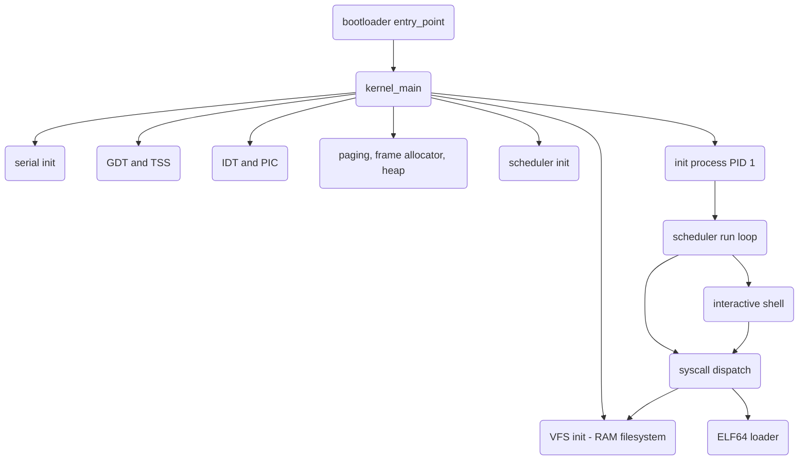

# Minimal OS Kernel

A minimal x86_64 operating system kernel written from scratch in `no_std` Rust.
It demonstrates the classic boot-to-userspace OS path: GDT/TSS setup, an IDT
with CPU-exception and hardware-IRQ handlers, 4-level paging with a frame
allocator and kernel heap, process control blocks with fork/exec/exit and
signals, a round-robin scheduler with an assembly context switch, a system-call
dispatch table, a VFS over a RAM filesystem, an ELF64 loader, and an interactive
shell. The crate builds both as a host-testable library (`minimal-os-kernel`)
and as a bootable disk image linked with the `bootloader` crate.

## Features

- **Boot entry point** — `bootloader::entry_point!` hands a `&'static BootInfo`
  to `kernel_main`, which brings up each subsystem in order (`src/main.rs`,
  `src/lib.rs`).
- **GDT and TSS** — kernel/user code and data segments plus a TSS with an IST
  double-fault stack and a ring-0 privilege stack (`gdt.rs`).
- **Interrupts** — an `InterruptDescriptorTable` wiring all CPU exceptions, a
  timer IRQ that drives scheduling, and a PS/2 keyboard IRQ, behind a chained
  8259 PIC (`interrupts.rs`).
- **Memory management** — 4-level paging via `OffsetPageTable`, a
  `BootInfoFrameAllocator` over the bootloader memory map, and a bump-based
  kernel heap (`memory/mod.rs`, `memory/allocator.rs`).
- **Processes** — a `Process` control block with CPU context, credentials, file
  descriptors, signal handlers, and scheduling fields, plus `fork`, `exit`, and
  signal queueing (`process.rs`).
- **Scheduler** — a round-robin `Scheduler` with ready/blocked/zombie queues,
  timer-tick time slicing, and reaping/reparenting (`scheduler.rs`).
- **Context switch** — naked-function `save_context` / `restore_context` in
  inline assembly operating on a `repr(C)` `CpuContext` (`context.rs`).
- **System calls** — a Linux-style numeric dispatch table (`read`, `write`,
  `open`, `close`, `fork`, `execve`, `exit`, `wait4`, `kill`, `getpid`, ...)
  returning negated errno codes (`syscall.rs`).
- **VFS and RAM filesystem** — inode-based `RamFs` with directories, regular
  files, device nodes, and POSIX-style open flags, exposed through a
  descriptor-based API (`vfs.rs`).
- **ELF64 loader** — header and program-header parsing and validation for
  `PT_LOAD` segments (`elf.rs`).
- **Interactive shell** — built-ins (`cd`, `pwd`, `ls`, `cat`, `echo`, `mkdir`,
  `touch`, `rm`, `ps`, `kill`, `help`, `clear`, `exit`) plus external-command
  execution via fork/exec (`shell.rs`).
- **Serial output** — `serial_println!` over a UART 16550 port for debug output
  under QEMU (`serial.rs`).

## Architecture



| Component | Module | Responsibility |
|-----------|--------|----------------|
| Boot entry | `src/main.rs`, `src/lib.rs` | Receive `BootInfo`, run `kernel_main` bring-up |
| Segments | `src/gdt.rs` | GDT, TSS, kernel/user selectors, IST stacks |
| Interrupts | `src/interrupts.rs` | IDT, CPU exceptions, timer/keyboard IRQs, PIC |
| Memory | `src/memory/mod.rs`, `src/memory/allocator.rs` | Paging, frame allocation, kernel heap |
| Processes | `src/process.rs` | PCB, fork, exit, signals, file descriptors |
| Scheduler | `src/scheduler.rs` | Ready/blocked/zombie queues, time slicing |
| Context switch | `src/context.rs` | Save/restore `CpuContext` in assembly |
| Syscalls | `src/syscall.rs` | Numeric dispatch table, errno encoding |
| Filesystem | `src/vfs.rs` | VFS layer over inode-based `RamFs` |
| ELF loader | `src/elf.rs` | ELF64 header / program-header parsing |
| User mode | `src/usermode.rs` | Ring-3 transition helpers, user-pointer checks |
| Shell | `src/shell.rs` | Command parsing and built-ins |
| Init | `src/init.rs` | PID 1 setup, shell spawn, zombie reaping |
| Serial | `src/serial.rs` | UART 16550 debug output |

## Quick Start

### Prerequisites

- A nightly Rust toolchain (pinned in `rust-toolchain.toml`) — bare-metal builds
  use unstable features (`build-std`, `abi_x86_interrupt`, `naked_functions`).
- The `rust-src` and `llvm-tools-preview` rustup components.
- `cargo-bootimage` to link the kernel with the bootloader into a disk image.
- `qemu-system-x86_64` to boot the resulting image.

### Installation

```bash
rustup component add rust-src llvm-tools-preview
cargo install bootimage
```

### Running

```bash
# Compile the kernel
cargo build

# Link a bootable disk image (target/.../bootimage-minimal-os-kernel.bin)
cargo bootimage

# Run the host-target library unit tests (no QEMU needed)
cargo test --lib

# Boot the image in QEMU (serial output is piped to stdio)
cargo run
```

## Usage

Booting the image starts `kernel_main`, which initializes each subsystem,
creates the init process (PID 1), and enters the scheduler. The shell reads
commands and dispatches built-ins or forks external programs:

```text
MinOS Shell v0.1
Type 'help' for available commands.

/$ ls /
d  bin
d  dev
d  etc
/$ echo hello
hello
/$ ps
  PID  STATE    NAME
    1  RUN    init
```

The library API is also exercisable directly in unit tests on the host target.
For example, the ELF loader validates a header before reporting the entry point:

```rust
use minimal_os_kernel::elf;

let header = elf::parse_header(&elf_bytes)?;      // checks magic, class, machine
let loaded = elf::load_elf(&elf_bytes)?;          // collects PT_LOAD segments
let entry = loaded.entry;                          // e_entry from the header
```

> **Boot caveat:** the QEMU boot path has not been verified end-to-end — see
> *What's Real vs Simulated* below before relying on a live boot.

## What's Real vs Simulated

**Real (implemented and host-testable):** The kernel logic compiles as a library
and is exercised by `cargo test --lib`. The ELF header/program-header parser, the
shell command parser and path normalizer, the user-pointer validation, and the
`CpuContext` layout all have unit tests. The scheduler queues, RAM filesystem
inode operations, syscall dispatch table, GDT/IDT setup, paging/frame-allocator,
bump heap, and assembly context switch are all implemented.

**Simulated / unverified:**
- **QEMU boot is not verified.** The `init -> scheduler -> shell` path has not
  been confirmed to run end-to-end under QEMU. `kernel_main` calls
  `scheduler::run()`, which is defined in `scheduler.rs` and performs the initial
  schedule before entering `init::init_main` (which spawns the shell), so the
  boot path is wired. `usermode::init`, `usermode::jump_to_usermode`, and
  `context::switch_context` are implemented but not yet exercised by that path.
- **No automated integration tests.** The `isa-debug-exit` QEMU harness is
  configured in `Cargo.toml` (`test-args`) but is not exercised.
- **Stubbed syscall paths.** `sys_read`/`sys_write` to non-standard descriptors,
  `sys_kill` signal delivery, and file-descriptor tracking inside the PCB return
  placeholder values rather than performing the full operation.
- **Heap.** The active global allocator is a bump allocator that never frees;
  a `LinkedListAllocator` exists in `allocator.rs` but is not wired in.

> **Build-target note:** `bootloader = "0.9"` uses the custom-target-JSON
> workflow, while `.cargo/config.toml` builds for the built-in
> `x86_64-unknown-none` target. These can disagree under `cargo bootimage`; the
> comment in `Cargo.toml` records the two resolution paths.

## Testing

```bash
cargo test --lib
```

Tests run on the host target and cover the ELF parser, shell parsing/path
normalization, user-pointer validation, the `CpuContext` size invariant, and
init constants. No QEMU or other external services are required. There are no
automated boot/integration tests yet.

## Project Structure

```
15-minimal-os-kernel/
  README.md              # This file
  Cargo.toml             # Crate, dependencies, bootimage metadata
  rust-toolchain.toml    # Pins the nightly toolchain
  .cargo/config.toml     # build-std + bootimage runner config
  src/
    main.rs              # Bootable binary entry (entry_point! -> kernel_main)
    lib.rs               # Library crate root, kernel_main bring-up
    gdt.rs               # GDT and TSS
    interrupts.rs        # IDT, CPU exceptions, IRQ handlers, PIC
    memory/
      mod.rs             # Paging and frame allocator
      allocator.rs       # Kernel heap (bump + linked-list allocators)
    process.rs           # PCB, fork, exit, signals
    scheduler.rs         # Round-robin scheduler
    context.rs           # CpuContext save/restore (assembly)
    syscall.rs           # Syscall dispatch table
    vfs.rs               # VFS trait surface + RAM filesystem
    elf.rs               # ELF64 loader
    usermode.rs          # Ring-3 transition helpers
    shell.rs             # Interactive shell
    init.rs              # Init process (PID 1)
    serial.rs            # UART serial output
  docs/
    BLUEPRINT.md         # Full architecture and design document
```

## License

MIT — see [LICENSE](../LICENSE)
