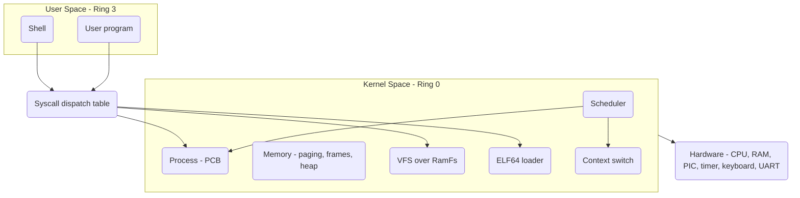

# Minimal Operating System Kernel

## Overview

A minimal but functional x86_64 operating system kernel, written from scratch in
`no_std` Rust, that demonstrates the core abstractions an OS provides between
hardware and user programs: the boot handoff, segmentation and interrupts,
virtual memory, processes and scheduling, system calls, a filesystem, and a
shell.

The crate is built two ways from the same source. As a **library**
(`minimal-os-kernel`) the kernel logic is reusable and host-testable with
`cargo test --lib`. As a **bootable binary** (`src/main.rs`) it is linked with
the `bootloader` crate into a disk image and booted under QEMU. Keeping the
logic in a library is what makes the parsing, scheduling-queue, and
filesystem-inode code unit-testable without hardware.

The concepts this project is meant to teach:

- The **boot handoff**: how a bootloader switches the CPU into 64-bit long mode
  and jumps to a Rust entry point with a validated `BootInfo`.
- **Segmentation**: why a 64-bit kernel still needs a GDT and TSS (IST stacks,
  ring-0/ring-3 selectors).
- **Interrupts and exceptions**: building an IDT, the difference between CPU
  exceptions and hardware IRQs, and acknowledging the PIC.
- **Virtual memory**: 4-level paging, translating addresses through the page
  tables, allocating physical frames, and bootstrapping a kernel heap.
- **Processes and scheduling**: a process control block, fork/exec/exit, a
  round-robin ready queue, time slicing, and an assembly context switch.
- **System calls**: a numeric dispatch table and the errno-return convention.
- **Filesystems**: an inode-based RAM filesystem behind a VFS surface.
- **User space**: an ELF64 loader and the ring-3 transition.

> **Honesty caveat.** The kernel logic is implemented and host-testable, but the
> **QEMU boot path has not been verified end-to-end**. `kernel_main` calls
> `scheduler::run()`, which is defined in `scheduler.rs` and enters
> `init::init_main`, so that seam is wired. Some already-written pieces
> (`usermode::init`, `usermode::jump_to_usermode`, `context::switch_context`)
> are not yet exercised by the boot path; and the `isa-debug-exit` integration harness is configured
> but not exercised. Code blocks below that show a *design target* rather than
> the current source are explicitly labeled **(illustrative)**.

## Architecture

The system is split into a kernel half (ring 0) that owns the hardware and a
user half (ring 3) that reaches the kernel only through the syscall interface.



The boot bring-up is a fixed sequence in `kernel_main` (`src/lib.rs`). Each step
must complete before the next is safe — for example, the heap cannot be
initialized before paging, and the scheduler cannot run before the heap exists
(its queues allocate).

```mermaid
stateDiagram-v2
    [*] --> SerialInit
    SerialInit --> GdtInit: serial::init
    GdtInit --> IdtInit: gdt::init
    IdtInit --> MemInit: interrupts::init_idt
    MemInit --> HeapInit: memory::init + frame allocator
    HeapInit --> PicEnable: allocator::init_heap
    PicEnable --> SchedInit: PICS init + sti
    SchedInit --> VfsInit: scheduler::init
    VfsInit --> InitProc: vfs::init
    InitProc --> SchedRun: init::start (PID 1)
    SchedRun --> [*]: scheduler::run (unverified)
```

### Virtual memory layout

This is the conceptual x86_64 split the kernel targets — a higher-half kernel
above the non-canonical hole, user space below it. It is a memory map, not a
diagram, so it stays a plain code block.

```
+------------------+ 0xFFFFFFFF_FFFFFFFF
|   Kernel Space   |
|   (higher half)  |
+------------------+ 0xFFFF8000_00000000
|                  |
|   Non-canonical  |
|   hole           |
|                  |
+------------------+ 0x00007FFF_FFFFFFFF
|   User stack     |
+------------------+
|   User heap      |
+------------------+
|   User code/data |
+------------------+ 0x00000000_00400000
|   Reserved       |
+------------------+ 0x00000000_00000000
```

The kernel heap itself is placed at a fixed virtual address by the allocator
(`HEAP_START = 0x_4444_4444_0000`, `HEAP_SIZE = 100 KiB`) and backed by frames
mapped during `init_heap`.

### Dependencies

The crate is deliberately thin and leans on the established bare-metal Rust
ecosystem (`Cargo.toml`):

- `bootloader = "0.9"` — boots the machine, sets up long mode, and calls the
  `entry_point!`-generated `_start` with a `BootInfo`.
- `x86_64 = "0.14"` — typed wrappers for GDT/IDT/TSS, page tables, control
  registers, and privileged instructions.
- `uart_16550 = "0.2"` — the serial port driver behind `serial_println!`.
- `pic8259 = "0.10"` — the chained 8259 PIC used for timer/keyboard IRQs.
- `pc-keyboard = "0.6"` — scancode-set-1 decoding in the keyboard IRQ handler.
- `spin = "0.9"` and `lazy_static` — spinlocks and lazily-initialized statics
  (`SERIAL1`, `IDT`, `GDT`, the global `SCHEDULER`/`VFS`).
- `bitflags = "2"` and `crossbeam-queue` (alloc-only) — bit flags and lock-free
  queue primitives available to the kernel.

The dev/release profiles both set `panic = "abort"`; there is no unwinding in a
`no_std` kernel.

## Core Components

### Boot and init

`src/main.rs` is intentionally tiny: it registers `kernel_entry` with
`bootloader::entry_point!`, which type-checks the `fn(&'static BootInfo) -> !`
signature and emits the real `_start`. `kernel_entry` immediately calls the
library's `kernel_main`.

`kernel_main` (`src/lib.rs`) performs the bring-up in the order shown in the
state diagram above, logging each step over serial, then calls `init::start()`
and `scheduler::run()`. The ordering is load-bearing: paging must exist before
the heap is mapped, the heap must exist before the scheduler allocates its
queues, and interrupts are only enabled once the IDT and PIC are ready.

```rust
pub fn kernel_main(boot_info: &'static BootInfo) -> ! {
    serial::init();
    gdt::init();
    interrupts::init_idt();

    let phys_mem_offset = VirtAddr::new(boot_info.physical_memory_offset);
    let mut mapper = unsafe { memory::init(phys_mem_offset) };
    let mut frame_allocator = unsafe {
        memory::BootInfoFrameAllocator::init(&boot_info.memory_map)
    };
    memory::allocator::init_heap(&mut mapper, &mut frame_allocator)
        .expect("heap initialization failed");

    unsafe { interrupts::PICS.lock().initialize() };
    x86_64::instructions::interrupts::enable();

    scheduler::init();
    vfs::init();

    init::start();        // create PID 1
    scheduler::run();     // <-- defined; enters init::init_main (QEMU boot unverified)
    hlt_loop();
}
```

The panic handler (which logs over serial and halts) and the
`#[alloc_error_handler]` both live in the library so the bootable binary stays
minimal.

`init::start` (`src/init.rs`) creates the PID 1 process control block (running as
root, cwd `/`) and adds it to the scheduler. The fuller `init::init_main` —
which mounts the base directory tree (`/bin`, `/dev`, `/etc`, ...), writes
`/etc/passwd`, creates device nodes, forks the shell, and then loops reaping
zombies — is implemented but not yet invoked from the boot path.

### GDT and TSS

`src/gdt.rs` builds a `GlobalDescriptorTable` with five descriptors: kernel
code, kernel data, the TSS, user data, and user code. The TSS provides an IST
entry for the double-fault handler (so a corrupted stack can't turn a fault into
a triple fault) and a ring-0 privilege stack. `gdt::init` loads the GDT, reloads
all segment registers, and loads the TSS. Selector getters expose the kernel and
user code/data selectors to the rest of the kernel.

```rust
static ref GDT: (GlobalDescriptorTable, Selectors) = {
    let mut gdt = GlobalDescriptorTable::new();
    let code_selector      = gdt.add_entry(Descriptor::kernel_code_segment());
    let data_selector      = gdt.add_entry(Descriptor::kernel_data_segment());
    let tss_selector       = gdt.add_entry(Descriptor::tss_segment(&TSS));
    let user_data_selector = gdt.add_entry(Descriptor::user_data_segment());
    let user_code_selector = gdt.add_entry(Descriptor::user_code_segment());
    (gdt, Selectors { code_selector, data_selector, tss_selector,
                      user_code_selector, user_data_selector })
};
```

The order of `add_entry` calls fixes the selector indices, which `usermode.rs`
hard-codes when programming `STAR` for `syscall`/`sysret`
(`USER_CODE_SELECTOR = (4 << 3) | 3`, etc.). The double-fault IST stack and the
ring-0 privilege stack are both 20 KiB (`4096 * 5`) static buffers.

### Interrupts and the IDT

`src/interrupts.rs` lazily builds an `InterruptDescriptorTable` with handlers for
every CPU exception (divide error, breakpoint, double fault, page fault, general
protection fault, and so on) and for two hardware IRQs:

- **Timer** (`PIC_1_OFFSET = 32`): calls `scheduler::tick()` to advance the tick
  counter and decrement the current process's time slice, then signals
  end-of-interrupt.
- **Keyboard** (`PIC_1_OFFSET + 1`): reads a scancode from port `0x60`, decodes
  it with `pc-keyboard` (US layout, scancode set 1), and prints the key.

The double-fault handler is installed with the IST stack index from `gdt.rs`.
Hardware IRQs go through a `ChainedPics` (`PICS`) remapped to offsets 32/40 to
avoid colliding with CPU exception vectors.

```rust
extern "x86-interrupt" fn timer_interrupt_handler(_sf: InterruptStackFrame) {
    crate::scheduler::tick();
    unsafe {
        PICS.lock().notify_end_of_interrupt(InterruptIndex::Timer.as_u8());
    }
}
```

Most exception handlers panic with a formatted stack frame; the page-fault
handler additionally reports the faulting address from `CR2` before panicking
(demand paging is noted as the place a real kernel would recover instead). The
keyboard handler keeps a `lazy_static` `Keyboard` decoder and acknowledges the
PIC after processing each scancode.

### Memory: paging, frame allocator, heap

`src/memory/mod.rs` initializes an `OffsetPageTable` over the active level-4
table (read from `CR3`) using the bootloader's physical-memory offset.
`translate_addr` walks the four page-table levels by hand to map a virtual to a
physical address, illustrating the paging structure directly.

`BootInfoFrameAllocator` produces usable physical frames by filtering the
bootloader memory map for `Usable` regions and stepping through them in 4 KiB
increments. It is a simple "next index" allocator that never reuses frames — fine
for bootstrap, and explicit about its limitation.

`src/memory/allocator.rs` provides the kernel heap. The active global allocator
is a `BumpAllocator`: it hands out aligned spans from a fixed window and only
counts allocations — `dealloc` is a no-op. `init_heap` maps the heap's page range
to freshly allocated frames and then arms the allocator. A second
`LinkedListAllocator` (with free-region splitting) is implemented as the natural
next step but is not wired in as the global allocator.

### Processes and the PCB

`src/process.rs` defines the `Process` control block (see *Data Structures*),
with PIDs allocated from a global atomic counter starting at 1. `Process::new`
sets sensible defaults (state `Ready`, fds starting at 3, time slice 10, cwd
`/`). `fork` clones the parent's context, memory bounds, credentials, signal
handlers, file descriptors, and scheduling fields into a new PCB. `exit` marks
the process a `Zombie`, records the exit code, and drops its file descriptors.
Signals are a 32-bit pending bitmask plus a 32-bit mask; `send_signal`,
`has_pending_signals`, and `next_signal` (lowest-numbered deliverable signal
first) implement the queue.

```rust
pub fn send_signal(&mut self, signal: u32) {
    if signal < 32 { self.pending_signals |= 1 << signal; }
}

pub fn next_signal(&mut self) -> Option<u32> {
    let deliverable = self.pending_signals & !self.signal_mask;
    if deliverable == 0 { return None; }
    let signal = deliverable.trailing_zeros();
    self.pending_signals &= !(1 << signal);
    Some(signal)
}
```

`SignalAction` is `Default`, `Ignore`, or `Handler(u64)`, stored in a 32-entry
array that `fork` copies and `exec` resets. Actually *dispatching* a pending
signal to a user-mode handler (building a signal frame on the user stack and
returning through a trampoline) is the natural extension — the bookkeeping is in
place, the delivery path is not.

### Scheduler and context switch

`src/scheduler.rs` is a round-robin `Scheduler` holding four owners of process
boxes: a `ready_queue`, the `current` process, a `blocked` queue, and a
`zombies` queue. `schedule` files the outgoing process into the queue matching
its state and pops the next ready process. `tick` (called from the timer IRQ)
decrements the current time slice and reschedules when it hits zero.
`block_current`, `wake`, `reap`, and `check_sleepers` move processes between
queues. A set of free functions (`fork`, `waitpid`, `execve`, `kill`,
`yield_cpu`, `list_processes`, `reparent_children`) wrap the global `SCHEDULER`
spinlock for use by syscalls, the shell, and init.

`src/context.rs` implements the low-level switch. `save_context` and
`restore_context` are `#[naked]` functions that read/write a `repr(C)`
`CpuContext` field-by-field through fixed byte offsets in inline assembly
(matching the struct layout — a unit test asserts `size_of::<CpuContext>()` so
the offsets stay valid). `switch_context` saves the outgoing context and restores
the incoming one. `context::tss::set_kernel_stack` updates the ring-0 stack in
the TSS for the next process.

```rust
pub fn schedule(&mut self) {
    if let Some(mut current) = self.current.take() {
        match current.state {
            ProcessState::Running => {
                current.state = ProcessState::Ready;
                self.ready_queue.push_back(current);
            }
            ProcessState::Zombie       => self.zombies.push_back(current),
            ProcessState::Blocked(_)   => self.blocked.push_back(current),
            _                          => self.ready_queue.push_back(current),
        }
    }
    if let Some(mut next) = self.ready_queue.pop_front() {
        next.state = ProcessState::Running;
        self.current = Some(next);
    }
}
```

`schedule` is pure bookkeeping over the queues; it does not itself perform the
register-level switch. The top-level `scheduler::run` that `kernel_main` calls is
defined and enters `init::init_main`; wiring `schedule` to `switch_context` for
preemptive register-level switching is the remaining seam between the implemented
pieces and a live multitasking boot.

### System calls

`src/syscall.rs` defines `SyscallNumber` with Linux-style numbers (`Read = 0`,
`Write = 1`, ..., `Fork = 57`, `Execve = 59`, `Exit = 60`) and `SyscallError`
with the standard errno values. `syscall_handler` is the dispatch table: it
matches the syscall number, calls the implementing function, and encodes the
result as either the raw `i64` value or a negated errno. Implemented handlers
include `getpid`, `fork`, `execve` (read from VFS, load ELF, exec), `exit`,
`wait4`, and `write` to stdout/stderr (forwarded to serial). Handlers for
unrecognized numbers return `-ENOSYS`. Reading user strings/arrays is bounded to
guard against runaway pointers.

### VFS and the RAM filesystem

`src/vfs.rs` provides POSIX-style open flags (`O_RDONLY`, `O_CREAT`, `O_TRUNC`,
`O_APPEND`, ...) and file-mode constants, plus an inode-based `RamFs`. Each inode
carries `InodeMetadata` and one of three data variants: a byte vector for regular
files, a name-to-inode `BTreeMap` for directories, or a target string for
symlinks. `RamFs` supports `lookup` (path walk from root inode 1), `create`,
`mkdir`, `read`, `write`, `readdir`, `stat`, and `exists`. A `Vfs` wrapper owns
the root `RamFs`; module-level functions and a descriptor-based API
(`open`/`close`/`read_fd`/`write_fd`, tracked in a global open-file table) sit on
top. Whole-file helpers `read_file`/`write_file` back the ELF loader and init.

```rust
pub fn read(&self, ino: u64, offset: usize, buf: &mut [u8])
    -> Result<usize, SyscallError> {
    let inode = self.inodes.get(&ino).ok_or(SyscallError::ENOENT)?;
    match &inode.data {
        RamInodeData::File(data) => {
            let available = data.len().saturating_sub(offset);
            let to_read = buf.len().min(available);
            buf[..to_read].copy_from_slice(&data[offset..offset + to_read]);
            Ok(to_read)
        }
        RamInodeData::Directory(_) => Err(SyscallError::EISDIR),
        _ => Err(SyscallError::EINVAL),
    }
}
```

Writes grow the backing `Vec<u8>` as needed and update the inode's `size`.
Device nodes created by `mknod` (e.g. `/dev/null`, `/dev/zero`) record their
type in the inode mode but back onto an empty byte vector — the node exists in
the tree without a real driver behind it.

### ELF64 loader

`src/elf.rs` parses ELF64 executables. `parse_header` checks the file is large
enough, then `validate_header` verifies the magic, 64-bit class, little-endian
encoding, and `EM_X86_64` machine. `parse_program_headers` reads the program
header table, and `load_elf` collects every `PT_LOAD` segment's virtual address,
memory size, and permission flags, computes a stack top above the highest mapped
address, and returns the entry point. The loader reports *what* to map; copying
bytes and building page tables would be the caller's job. Helpers
(`is_executable`/`is_writable`/`is_readable`) decode segment permission bits.

### User mode

`src/usermode.rs` holds the ring-3 machinery: `jump_to_usermode` builds an
`iretq` frame (SS, RSP, RFLAGS-with-IF, CS, RIP) to drop into ring 3,
`sysret_to_usermode` returns via `sysretq`, and `init` enables
`SYSTEM_CALL_EXTENSIONS` in EFER and programs `STAR`/`SFMASK`. `validate_user_ptr`
and `copy_from_user`/`copy_to_user` bound user pointers below the user/kernel
split. These functions are implemented and unit-tested where pure, but the
syscall fast-path (`LSTAR` -> assembly entry) is left as a documented gap.

### Shell

`src/shell.rs` is the interactive shell. `shell_main` prints a prompt, reads a
line, and dispatches. `parse_command` tokenizes with quote and escape handling.
Built-ins cover navigation and files (`cd`, `pwd`, `ls`, `cat`, `echo`, `mkdir`,
`touch`, `rm`), process control (`ps`, `kill`), and session control (`clear`,
`help`, `exit`). Unknown commands are run as external programs through
`fork` -> `execve` -> `waitpid`. `normalize_path` resolves `.`/`..`. Console
input (`read_char`) is currently a stub returning `None` — wiring the keyboard
IRQ into a console buffer is the missing link for live interaction.

### Serial

`src/serial.rs` wraps a `uart_16550::SerialPort` at `0x3F8` in a lazily
initialized spinlock and exposes the `serial_print!` / `serial_println!` macros
used throughout the kernel for debug output. Writes run inside
`without_interrupts` to avoid deadlocking against IRQ handlers that also log.

## Data Structures

These definitions are transcribed from the current source so the documentation
stays in step with the code.

### Process control block (`process.rs`)

```rust
pub struct Process {
    pub pid: Pid,                    // u64
    pub ppid: Pid,
    pub state: ProcessState,

    pub context: CpuContext,

    // Memory bounds
    pub heap_start: u64,
    pub heap_end: u64,
    pub stack_top: u64,
    pub stack_bottom: u64,

    // Open files
    pub file_descriptors: BTreeMap<Fd, FileDescriptor>,
    pub next_fd: Fd,                 // i32, starts at 3

    // Credentials
    pub uid: Uid,                    // u32
    pub gid: Gid,
    pub euid: Uid,
    pub egid: Gid,

    // Signals
    pub signal_handlers: [SignalAction; 32],
    pub pending_signals: u32,        // bitmask
    pub signal_mask: u32,            // blocked signals

    // Scheduling
    pub priority: i32,
    pub nice: i32,
    pub time_slice: u64,

    // Statistics
    pub user_time: u64,
    pub system_time: u64,
    pub start_time: u64,

    pub exit_code: Option<i32>,
    pub cwd: String,
    pub name: String,
}

pub enum ProcessState {
    Ready,
    Running,
    Blocked(BlockReason),
    Zombie,
    Stopped,
}

pub enum BlockReason { Io, Child, Sleep, Signal }

pub enum SignalAction {
    Default,
    Ignore,
    Handler(u64),                    // handler address
}
```

### CPU context (`process.rs`, used by `context.rs`)

The context is `#[repr(C)]` so the assembly in `context.rs` can address fields
by fixed byte offset. A unit test pins `size_of::<CpuContext>() == 160`.

```rust
#[repr(C)]
pub struct CpuContext {
    // General purpose registers (offsets 0x00..0x78)
    pub rax: u64, pub rbx: u64, pub rcx: u64, pub rdx: u64,
    pub rsi: u64, pub rdi: u64, pub rbp: u64, pub rsp: u64,
    pub r8: u64,  pub r9: u64,  pub r10: u64, pub r11: u64,
    pub r12: u64, pub r13: u64, pub r14: u64, pub r15: u64,

    pub rip: u64,    // 0x80
    pub rflags: u64, // 0x88

    pub cs: u64,     // 0x90
    pub ss: u64,     // 0x98
}
```

The matching save half of the context switch (`context.rs`):

```rust
#[naked]
pub unsafe extern "C" fn save_context(ctx: *mut CpuContext) {
    asm!(
        "mov [rdi + 0x00], rax",
        "mov [rdi + 0x08], rbx",
        // ... general-purpose registers ...
        "mov rax, rsp",
        "add rax, 8",                 // adjust for the return address
        "mov [rdi + 0x38], rax",
        "mov rax, [rsp]",
        "mov [rdi + 0x80], rax",      // save RIP (return address)
        "pushfq",
        "pop rax",
        "mov [rdi + 0x88], rax",      // save RFLAGS
        "ret",
        options(noreturn)
    )
}
```

### Page table walk and frame allocator (`memory/mod.rs`)

The kernel uses `x86_64::structures::paging` types rather than redefining page
tables, and walks them explicitly to translate addresses:

```rust
pub fn translate_addr(addr: VirtAddr) -> Option<PhysAddr> {
    let phys_mem_offset = unsafe { PHYS_MEM_OFFSET? };
    let (level_4_table_frame, _) = Cr3::read();
    let table_indexes = [
        addr.p4_index(), addr.p3_index(),
        addr.p2_index(), addr.p1_index(),
    ];

    let mut frame = level_4_table_frame;
    for &index in &table_indexes {
        let virt = phys_mem_offset + frame.start_address().as_u64();
        let table = unsafe { &*(virt.as_ptr() as *const PageTable) };
        frame = match table[index].frame() {
            Ok(frame) => frame,
            Err(_) => return None,
        };
    }
    Some(frame.start_address() + u64::from(addr.page_offset()))
}

pub struct BootInfoFrameAllocator {
    memory_map: &'static MemoryMap,
    next: usize,                      // next usable-frame index
}
```

### Bump allocator (`memory/allocator.rs`)

```rust
pub const HEAP_START: usize = 0x_4444_4444_0000;
pub const HEAP_SIZE: usize  = 100 * 1024; // 100 KiB

pub struct BumpAllocator {
    heap_start: usize,
    heap_end: usize,
    next: usize,
    allocations: usize,               // freed only when count drops (no-op here)
}
```

### Syscall numbers and errors (`syscall.rs`)

```rust
#[repr(u64)]
pub enum SyscallNumber {
    Read = 0,   Write = 1,  Open = 2,    Close = 3,
    Stat = 4,   Fstat = 5,  Lseek = 6,   Mmap = 9,
    Munmap = 11, Brk = 12,  Ioctl = 16,  Dup = 32, Dup2 = 33,
    Getpid = 39, Fork = 57, Execve = 59, Exit = 60,
    Wait4 = 61, Kill = 62,  Getcwd = 79, Chdir = 80,
    Getuid = 102, Setuid = 105, Getppid = 110,
}

#[repr(i64)]
pub enum SyscallError {
    EPERM = 1, ENOENT = 2, ESRCH = 3, EINTR = 4, EIO = 5,
    ENOEXEC = 8, EBADF = 9, ECHILD = 10, EAGAIN = 11, ENOMEM = 12,
    // ... through ENOTEMPTY = 39 ...
}

pub type SyscallResult = Result<i64, SyscallError>;
```

### Filesystem inode types (`vfs.rs`)

```rust
pub struct InodeMetadata {
    pub ino: u64,
    pub mode: u32,                    // file type + permission bits
    pub uid: u32, pub gid: u32,
    pub size: u64,
    pub atime: u64, pub mtime: u64, pub ctime: u64,
    pub nlink: u32,
}

enum RamInodeData {
    File(Vec<u8>),
    Directory(BTreeMap<String, u64>), // name -> inode number
    Symlink(String),
}

pub struct RamFs {
    inodes: BTreeMap<u64, RamInode>,
    next_ino: u64,                    // root is inode 1
}
```

### ELF64 structures (`elf.rs`)

```rust
#[repr(C, packed)]
pub struct Elf64Header {
    pub e_ident: [u8; 16],
    pub e_type: u16, pub e_machine: u16, pub e_version: u32,
    pub e_entry: u64, pub e_phoff: u64, pub e_shoff: u64,
    pub e_flags: u32,
    pub e_ehsize: u16, pub e_phentsize: u16, pub e_phnum: u16,
    pub e_shentsize: u16, pub e_shnum: u16, pub e_shstrndx: u16,
}

#[repr(C, packed)]
pub struct Elf64ProgramHeader {
    pub p_type: u32, pub p_flags: u32,
    pub p_offset: u64, pub p_vaddr: u64, pub p_paddr: u64,
    pub p_filesz: u64, pub p_memsz: u64, pub p_align: u64,
}

pub struct LoadedElf {
    pub entry: u64,
    pub segments: Vec<LoadedSegment>,
    pub stack_top: u64,
}
```

## API Design

### Syscall dispatch

The kernel-internal syscall entry takes a number and six argument registers and
returns an `i64`. Success returns the value; errors return a negated errno. This
is the contract a user program would invoke via the `syscall` instruction.

```rust
pub fn syscall_handler(
    num: u64,
    arg1: u64, arg2: u64, arg3: u64,
    _arg4: u64, _arg5: u64, _arg6: u64,
) -> i64 {
    let result = match num {
        0  => sys_read(arg1 as Fd, arg2, arg3 as usize),
        1  => sys_write(arg1 as Fd, arg2, arg3 as usize),
        2  => sys_open(arg1, arg2 as u32, arg3 as u32),
        3  => sys_close(arg1 as Fd),
        39 => sys_getpid(),
        57 => sys_fork(),
        59 => sys_execve(arg1, arg2, arg3),
        60 => sys_exit(arg1 as i32),
        61 => sys_wait4(arg1 as i32),
        62 => sys_kill(arg1 as Pid, arg2 as i32),
        110 => sys_getppid(),
        _  => Err(SyscallError::ENOSYS),
    };
    match result {
        Ok(val) => val,
        Err(err) => -(err as i64),
    }
}
```

### Filesystem surface

The VFS exposes two layers. Path-oriented helpers operate on whole files or
directories; a descriptor-oriented API tracks offsets in a global open-file
table.

```rust
// Path-oriented
pub fn exists(path: &str) -> bool;
pub fn create_file(path: &str) -> Result<u64, SyscallError>;
pub fn mkdir(path: &str, mode: u32) -> Result<u64, SyscallError>;
pub fn stat(path: &str) -> Result<InodeMetadata, SyscallError>;
pub fn readdir(path: &str) -> Result<Vec<DirEntry>, SyscallError>;
pub fn read_file(path: &str) -> Result<Vec<u8>, SyscallError>;
pub fn write_file(path: &str, data: &[u8]) -> Result<(), SyscallError>;

// Descriptor-oriented
pub fn open(path: &str, flags: u32, mode: u32) -> Result<Fd, SyscallError>;
pub fn close(fd: Fd) -> Result<(), SyscallError>;
pub fn read_fd(fd: Fd, buf: &mut [u8]) -> Result<usize, SyscallError>;
pub fn write_fd(fd: Fd, buf: &[u8]) -> Result<usize, SyscallError>;
pub fn unlink(path: &str) -> Result<(), SyscallError>;
```

### Scheduler and process control

Free functions wrap the global scheduler lock so syscalls, the shell, and init
never touch the `Mutex<Option<Scheduler>>` directly.

```rust
pub fn add_process(process: Box<Process>);
pub fn current_pid() -> Option<Pid>;
pub fn fork() -> Result<Pid, SyscallError>;            // child PID to parent, 0 to child
pub fn execve(path: &str, argv: &[&str], envp: &[&str]) -> Result<(), SyscallError>;
pub fn waitpid(pid: Pid, flags: i32) -> Result<(Pid, i32), SyscallError>;
pub fn exit(code: i32);
pub fn kill(pid: Pid, signal: u32) -> Result<(), SyscallError>;
pub fn yield_cpu();
pub fn list_processes() -> Vec<ProcessInfo>;
```

### ELF loader

```rust
pub fn parse_header(data: &[u8]) -> Result<Elf64Header, ElfError>;
pub fn parse_program_headers(data: &[u8], header: &Elf64Header)
    -> Result<Vec<Elf64ProgramHeader>, ElfError>;
pub fn load_elf(data: &[u8]) -> Result<LoadedElf, ElfError>;
```

## Performance

The kernel is built for clarity over throughput, so the relevant numbers are
the fixed sizes and the algorithmic costs of the data structures rather than
measured benchmarks (no benchmarks are run; the figures below are exact values
or complexity bounds read from the source).

- **Kernel heap**: 100 KiB (`HEAP_SIZE`) at a fixed virtual base. The active
  bump allocator is O(1) per allocation and never frees, so total live memory is
  monotonic until reboot — adequate for bring-up, not for long-running
  workloads. The `LinkedListAllocator` is the intended upgrade for reuse.
- **Frame allocation**: `BootInfoFrameAllocator::allocate_frame` is O(n) in the
  number of usable frames because it re-scans the memory map up to `next` each
  call. A free list or bitmap would make this O(1); the simple version keeps the
  paging bootstrap easy to read.
- **Scheduling**: round-robin over a `VecDeque` is O(1) to enqueue/dequeue. The
  default time slice is 10 ticks (`Process::time_slice`), reset each time a
  process is rescheduled by the timer IRQ.
- **Context switch**: a fixed sequence of register moves over the 160-byte
  `CpuContext`; cost is constant and dominated by the memory traffic for those
  20 fields.
- **Filesystem lookup**: path resolution walks one `BTreeMap` per path
  component, so a lookup is O(depth x log(entries-per-dir)). All data lives in
  RAM, so there is no I/O latency to model.

## Testing Strategy

### Unit tests (host target, implemented)

`cargo test --lib` compiles the library for the host and runs the `#[cfg(test)]`
modules. Current coverage:

- **ELF loader** (`elf.rs`): magic/class/machine validation and segment
  permission decoding.
- **Shell** (`shell.rs`): command tokenization (simple, quoted, empty,
  whitespace) and path normalization (`.`/`..`, root).
- **User mode** (`usermode.rs`): `validate_user_ptr` for null, valid, and
  kernel-space pointers; `SyscallFrame` defaults.
- **Context** (`context.rs`): `CpuContext` size invariant and
  `KernelEntryContext` defaults.
- **Init** (`init.rs`): `INIT_PID` and `WaitFlags` constants.

### Integration tests (planned, not yet exercised)

`Cargo.toml` already configures a QEMU `isa-debug-exit` harness in
`test-args` (`-device isa-debug-exit,iobase=0xf4,iosize=0x04`, serial to stdio,
no display), which is the standard way to run kernel tests that boot under QEMU
and signal pass/fail by writing an exit code to an I/O port. That harness is
**not yet exercised** — there are no boot-level integration tests, and the live
`init -> scheduler -> shell` path is unverified under QEMU. `scheduler::run` is
defined and wired into the boot path (it enters `init::init_main`); closing the
gap means booting it under the `isa-debug-exit` harness with a
`#[test_case]`-style runner.

### Edge cases worth covering as the kernel grows

- Page-fault handling for legitimate stack growth versus genuine faults.
- Frame exhaustion during `init_heap` and during process creation.
- Fork/exec/wait ordering, zombie reaping, and orphan reparenting to init.
- Bounded user-string reads rejecting overlong or non-terminated input.

## References

- [Writing an OS in Rust](https://os.phil-opp.com/) — Philipp Oppermann's series,
  the closest analogue to this project's structure (bootloader 0.9, `x86_64`,
  serial testing, `isa-debug-exit`).
- [OSDev Wiki](https://wiki.osdev.org/) — reference for the GDT/TSS, IDT, PIC,
  paging, and long-mode boot details.
- [Intel 64 and IA-32 Architectures Software Developer Manuals](https://software.intel.com/content/www/us/en/develop/articles/intel-sdm.html)
  — authoritative source for segmentation, paging, interrupts, and the
  syscall/sysret mechanism.
- [System V AMD64 ABI](https://gitlab.com/x86-psABIs/x86-64-ABI) — calling
  convention and the ELF64 / program-header definitions the loader parses.
- [xv6](https://github.com/mit-pdos/xv6-public) — a teaching Unix kernel that
  parallels the process, syscall, and filesystem model used here.
