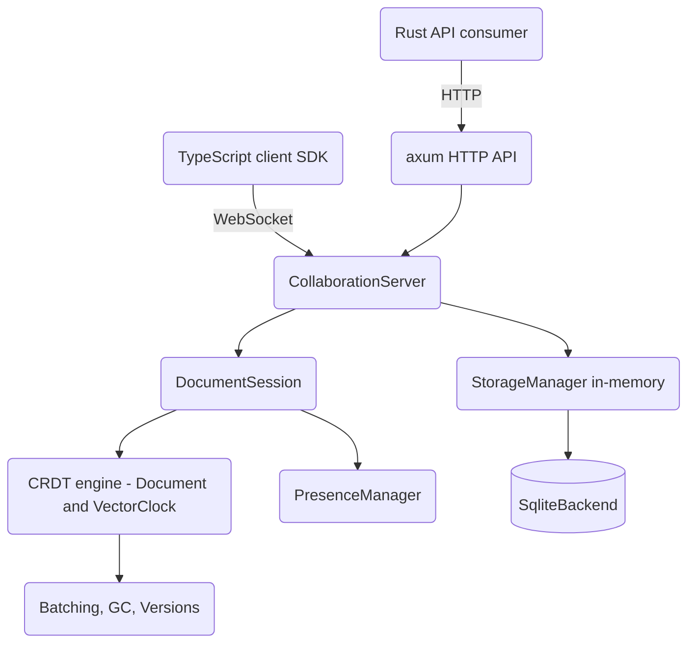

# CRDT-Based Real-Time Collaboration Engine

A Google Docs-lite collaborative text editing engine built from scratch in Rust on
Conflict-free Replicated Data Types (CRDTs). It provides an RGA-style sequence CRDT for
text, vector-clock causality tracking, a WebSocket collaboration server, presence and
awareness, offline editing with a pending-operation queue, and SQLite-backed persistence.
A companion TypeScript client SDK implements the same CRDT model for browser editors.

## Features

- **RGA-style sequence CRDT** — character-level insert/delete/format with tombstones and a total order over `PositionId` (lamport, client, seq) for deterministic convergence (`crdt::Element`, `document::Document`).
- **Vector clocks and causality** — `crdt::VectorClock` tracks per-client logical time and answers `happens_before`, `is_concurrent`, and `dominates` for conflict detection and GC.
- **Additional CRDTs** — grow-only `GCounter`, positive-negative `PNCounter`, and last-writer-wins `LWWRegister` with deterministic tie-breaking.
- **WebSocket collaboration server** — per-document sessions broadcast operations to connected clients and acknowledge senders (`server::CollaborationServer`, `server::DocumentSession`).
- **Typed protocol** — a tagged `protocol::Message` enum covers operations, acks, sync, cursor/selection presence, join/leave, heartbeat, auth, and errors.
- **Presence and awareness** — cursor/selection tracking and active/idle/away status per user (`presence::PresenceManager`, `presence::DocumentPresence`).
- **Offline editing** — connection-state machine, per-document pending-operation queue, retry with TTL, serialize/restore, and conflict detection (`offline::OfflineManager`).
- **HTTP API** — axum routes for document CRUD, content, history, snapshots, ACLs, and share links (`api::create_router`).
- **Persistence** — an in-memory `storage::StorageManager` for live sessions and a real SQLite backend (`persistent::SqliteBackend`, rusqlite bundled) implementing the `StorageBackend` trait.
- **Performance utilities** — operation batching, tombstone garbage collection, version history, log compaction, and memory monitoring (`performance` module).
- **TypeScript client SDK** — a browser CRDT document plus a reconnecting WebSocket client (`client-sdk/`).

## Architecture



| Component | Module | Responsibility |
|-----------|--------|----------------|
| CRDT engine | `crdt`, `document` | Sequence CRDT, vector clocks, operations, snapshots |
| Collaboration server | `server` | Document sessions, broadcast, sync, client lifecycle |
| Protocol | `protocol` | WebSocket message schema (`Message` enum) |
| HTTP API | `api` | Document CRUD, history, snapshots, ACLs, share links |
| Presence | `presence` | Cursor/selection/status awareness per document |
| Offline | `offline` | Pending-operation queue, reconnection, conflict detection |
| In-memory storage | `storage` | Snapshots, operation logs, metadata, ACL, audit types |
| SQLite backend | `persistent` | Durable `StorageBackend` over rusqlite |
| Performance | `performance` | Batching, tombstone GC, version history, compaction |
| Client SDK | `client-sdk` | TypeScript CRDT document and WebSocket client |

## Quick Start

### Prerequisites

- Rust 1.75+ (edition 2021) and Cargo
- No external services required — the SQLite backend uses the bundled `rusqlite` library, and tests run fully in-memory
- Node.js 18+ only if building the TypeScript client SDK

### Installation

```bash
cargo build
```

### Running

This is a library crate; there is no standalone server binary. Embed the engine in your
own binary by constructing a `CollaborationServer` and mounting the axum router:

```rust
use std::sync::Arc;
use crdt_collaboration::api::{create_router, ApiState};
use crdt_collaboration::server::{CollaborationServer, ServerConfig};
use crdt_collaboration::storage::StorageManager;

#[tokio::main]
async fn main() {
    let storage = Arc::new(StorageManager::new());
    let server = Arc::new(CollaborationServer::new(ServerConfig::default(), storage.clone()));
    let state = Arc::new(ApiState::new(server, storage));
    let app = create_router(state);

    let listener = tokio::net::TcpListener::bind("0.0.0.0:8080").await.unwrap();
    axum::serve(listener, app).await.unwrap();
}
```

## Usage

Apply CRDT operations on two replicas and observe convergence, mirroring
`tests/integration_tests.rs`:

```rust
use std::collections::HashMap;
use crdt_collaboration::crdt::{Operation, PositionId};
use crdt_collaboration::document::Document;
use crdt_collaboration::{ClientId, DocumentId};

// Two replicas of the same document.
let mut doc1 = Document::new(DocumentId::new_v4());
let mut doc2 = doc1.clone();

let alice = ClientId::new_v4();
let bob = ClientId::new_v4();
let root = PositionId::root();

// Concurrent inserts at the document root.
let op_a = doc1.insert(alice, root.clone(), 'A', HashMap::new()).unwrap();
let op_b = doc2.insert(bob, root.clone(), 'B', HashMap::new()).unwrap();

// Exchange operations (order does not matter).
doc1.apply(&op_b).unwrap();
doc2.apply(&op_a).unwrap();

// Both replicas converge to the same text.
assert_eq!(doc1.text(), doc2.text());
```

Durable persistence with the SQLite backend:

```rust
use crdt_collaboration::persistent::{SqliteBackend, StorageBackend};
use crdt_collaboration::document::Document;
use crdt_collaboration::DocumentId;

# async fn demo() -> crdt_collaboration::Result<()> {
let backend = SqliteBackend::in_memory()?; // or SqliteBackend::new("docs.db")?
let doc = Document::new(DocumentId::new_v4());
backend.save_snapshot(&doc.snapshot()).await?;
let loaded = backend.load_snapshot(&doc.id).await?;
assert!(loaded.is_some());
# Ok(())
# }
```

## What's Real vs Simulated

- **Real:** The CRDT engine (insert/delete/format, tombstones, total-order convergence), vector-clock causality, G/PN counters and LWW register, per-document sessions with broadcast and acks, the axum HTTP API handlers, presence tracking, the offline pending-operation queue (queueing, retry, TTL cleanup, serialize/restore), the in-memory `StorageManager`, and the SQLite `StorageBackend` (schema, snapshots, operations, ACLs, audit). All are exercised by the test suites.
- **Simulated / partial:** There is no shipped server binary or live WebSocket route — `server::handle_client` accepts generic stream/sink types and must be wired to a transport by the embedder. The HTTP API uses the in-memory `StorageManager`, not `SqliteBackend`. `offline::OfflineManager::sync_with_server` returns an empty response (no live transport). Share-link tokens are generated but not stored. Audit logging and version history are implemented and tested as components but are not yet invoked from the request handlers. The benchmark numbers in `docs/BLUEPRINT.md` are illustrative design targets, not measured results.

## Testing

```bash
cargo test
```

The suites cover CRDT convergence and causality (`tests/crdt_tests.rs`,
`tests/integration_tests.rs`), and server sessions, in-memory and SQLite storage, ACLs,
audit logging, and the performance utilities (`tests/server_storage_tests.rs`), plus
inline `#[cfg(test)]` modules in each source file. The HTTP API is tested with
`tower::ServiceExt::oneshot`. No external services are required. The TypeScript SDK has
its own Jest suite under `client-sdk/tests/` (`npm test`).

## Project Structure

```
16-crdt-collaboration/
  README.md              # This file
  Cargo.toml             # Crate manifest and dependencies
  src/
    lib.rs               # Public exports, Error/Result, ID and Timestamp types
    crdt.rs              # Vector clocks, PositionId, Operation, Element, counters, LWW
    document.rs          # Document, snapshots, metadata
    protocol.rs          # WebSocket Message enum and payloads
    server.rs            # CollaborationServer, DocumentSession, client lifecycle
    api.rs               # axum HTTP API router and handlers
    presence.rs          # Presence/awareness tracking
    offline.rs           # Offline manager, pending queue, conflict detection
    storage.rs           # In-memory StorageManager, ACL, audit types
    persistent.rs        # SQLite StorageBackend and compaction manager
    performance.rs       # Batching, tombstone GC, version history, compaction
  tests/                 # CRDT, integration, server/storage/performance tests
  client-sdk/            # TypeScript client SDK (CRDT document + WebSocket client)
  docs/BLUEPRINT.md      # Full architecture and design document
```

## License

MIT — see [../LICENSE](../LICENSE).
</content>
