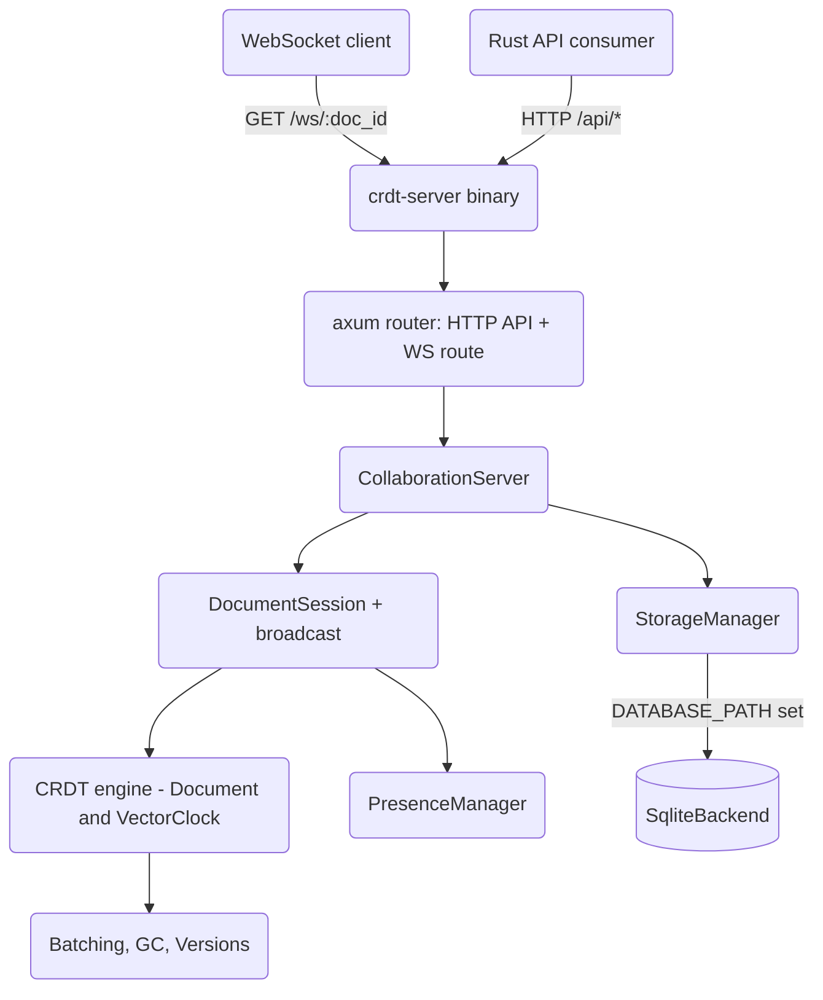

# CRDT-Based Real-Time Collaboration Engine

A Google Docs-lite collaborative text editing engine built from scratch in Rust on
Conflict-free Replicated Data Types (CRDTs). It provides an RGA-style sequence CRDT for
text, vector-clock causality tracking, a WebSocket collaboration server, presence and
awareness, offline editing with a pending-operation queue, and SQLite-backed persistence.
A companion TypeScript client SDK implements the same CRDT model for browser editors.

## Features

- **RGA-style sequence CRDT** — character-level insert/delete/format with tombstones and a total order over `PositionId` (lamport, client, seq) for deterministic convergence (`crdt::Element`, `document::Document`).
- **Vector clocks and causality** — `crdt::VectorClock` tracks per-client logical time and answers `happens_before`, `is_concurrent`, and `dominates` for conflict detection and GC.
- **Additional CRDTs** — grow-only `GCounter`, positive-negative `PNCounter`, and last-writer-wins `LWWRegister` with deterministic tie-breaking.
- **Runnable server binary** — `crdt-server` (`src/bin/server.rs`) boots the axum HTTP API and a live WebSocket collaboration endpoint (`GET /ws/:doc_id`) with configurable bind address and storage backend.
- **WebSocket collaboration server** — per-document sessions broadcast operations to connected clients and acknowledge senders (`server::CollaborationServer`, `server::DocumentSession`). The `/ws/:doc_id` route applies inbound CRDT ops to the shared document and fans them out to the other subscribers via a per-document `tokio::sync::broadcast` channel so replicas converge.
- **Typed protocol** — a tagged `protocol::Message` enum covers operations, acks, sync, cursor/selection presence, join/leave, heartbeat, auth, and errors.
- **Presence and awareness** — cursor/selection tracking and active/idle/away status per user (`presence::PresenceManager`, `presence::DocumentPresence`).
- **Offline editing** — connection-state machine, per-document pending-operation queue, retry with TTL, serialize/restore, and conflict detection (`offline::OfflineManager`).
- **HTTP API** — axum routes for document CRUD, content, history, snapshots, ACLs, and share links (`api::create_router`).
- **Persistence** — `storage::StorageManager` runs in-memory by default or, via `StorageManager::with_backend`, delegates to a durable `StorageBackend`. The server wires in the SQLite backend (`persistent::SqliteBackend`, rusqlite bundled) when `DATABASE_PATH` is set, so document snapshots survive a restart.
- **Performance utilities** — operation batching, tombstone garbage collection, version history, log compaction, and memory monitoring (`performance` module).
- **TypeScript client SDK** — a browser CRDT document plus a reconnecting WebSocket client (`client-sdk/`).

## Architecture



| Component | Module | Responsibility |
|-----------|--------|----------------|
| CRDT engine | `crdt`, `document` | Sequence CRDT, vector clocks, operations, snapshots |
| Server binary | `bin/server` | Boots the axum router (HTTP + WS), selects storage backend |
| Collaboration server | `server` | Document sessions, broadcast, sync, client lifecycle |
| Protocol | `protocol` | WebSocket message schema (`Message` enum) |
| HTTP API + WS | `api` | Document CRUD, history, snapshots, ACLs, share links, and the `/ws/:doc_id` collaboration endpoint |
| Presence | `presence` | Cursor/selection/status awareness per document |
| Offline | `offline` | Pending-operation queue, reconnection, conflict detection |
| In-memory storage | `storage` | Snapshots, operation logs, metadata, ACL, audit types |
| SQLite backend | `persistent` | Durable `StorageBackend` over rusqlite |
| Performance | `performance` | Batching, tombstone GC, version history, compaction |
| Client SDK | `client-sdk` | TypeScript CRDT document and WebSocket client |

## Quick Start

### Prerequisites

- Rust 1.75+ (edition 2021) and Cargo
- No external services required — the SQLite backend uses the bundled `rusqlite` library, and tests run fully in-memory
- Node.js 18+ only if building the TypeScript client SDK

### Installation

```bash
cargo build
```

### Running the server

The crate ships a runnable server binary, `crdt-server`, that serves the HTTP API and the
real-time WebSocket collaboration endpoint:

```bash
# In-memory storage (ephemeral), listening on 127.0.0.1:8080
cargo run --bin crdt-server

# Durable SQLite storage + auth, custom bind address
DATABASE_PATH=docs.db API_KEYS=secret-key BIND_ADDR=0.0.0.0:8080 \
  cargo run --bin crdt-server
```

Configuration (all optional):

| Env var | Default | Effect |
|---------|---------|--------|
| `BIND_ADDR` | `127.0.0.1:8080` | Socket address to listen on. |
| `DATABASE_PATH` (alias `SQLITE_PATH`) | *(unset → in-memory)* | SQLite file path. When set, documents persist across restarts. |
| `API_KEYS` | *(unset → auth off)* | Comma-separated keys required on `/api/*` and the WS handshake. |

Clients open a document session with `GET /ws/:doc_id`. When auth is enabled, the WebSocket
handshake accepts the key via the `Authorization`/`x-api-key` headers or a `?api_key=<key>`
query parameter (browsers cannot set headers on a WebSocket handshake). A connected client
sends `protocol::Message::Operation` frames; the server applies each op to the shared
document and broadcasts it to the other subscribers so all replicas converge.

To embed the engine in your own binary instead, construct a `CollaborationServer`, wrap it
in `ApiState`, and mount `api::create_router` on an axum listener (see `src/bin/server.rs`).

## Usage

Apply CRDT operations on two replicas and observe convergence, mirroring
`tests/integration_tests.rs`:

```rust
use std::collections::HashMap;
use crdt_collaboration::crdt::{Operation, PositionId};
use crdt_collaboration::document::Document;
use crdt_collaboration::{ClientId, DocumentId};

// Two replicas of the same document.
let mut doc1 = Document::new(DocumentId::new_v4());
let mut doc2 = doc1.clone();

let alice = ClientId::new_v4();
let bob = ClientId::new_v4();
let root = PositionId::root();

// Concurrent inserts at the document root.
let op_a = doc1.insert(alice, root.clone(), 'A', HashMap::new()).unwrap();
let op_b = doc2.insert(bob, root.clone(), 'B', HashMap::new()).unwrap();

// Exchange operations (order does not matter).
doc1.apply(&op_b).unwrap();
doc2.apply(&op_a).unwrap();

// Both replicas converge to the same text.
assert_eq!(doc1.text(), doc2.text());
```

Durable persistence with the SQLite backend:

```rust
use crdt_collaboration::persistent::{SqliteBackend, StorageBackend};
use crdt_collaboration::document::Document;
use crdt_collaboration::DocumentId;

# async fn demo() -> crdt_collaboration::Result<()> {
let backend = SqliteBackend::in_memory()?; // or SqliteBackend::new("docs.db")?
let doc = Document::new(DocumentId::new_v4());
backend.save_snapshot(&doc.snapshot()).await?;
let loaded = backend.load_snapshot(&doc.id).await?;
assert!(loaded.is_some());
# Ok(())
# }
```

## What's Real vs Simulated

- **Real:** The CRDT engine (insert/delete/format, tombstones, total-order convergence), vector-clock causality, G/PN counters and LWW register, the runnable `crdt-server` binary, the live `GET /ws/:doc_id` WebSocket endpoint (handshake auth, apply-and-broadcast so two clients converge), per-document sessions with broadcast and acks, the axum HTTP API handlers, presence tracking, the offline pending-operation queue (queueing, retry, TTL cleanup, serialize/restore), the in-memory `StorageManager`, and the SQLite `StorageBackend` wired through `StorageManager::with_backend` so state survives restarts (schema, snapshots with full element map, operations, ACLs, audit). All are exercised by the test suites, including a two-client convergence test and a drop-and-recover persistence test (`tests/ws_persistence_tests.rs`).
- **Simulated / out of scope (honestly):**
  - `offline::OfflineManager::sync_with_server` still returns an empty response — the offline manager's queueing/retry/persistence is real and tested, but full offline reconciliation against the live server is **not** implemented.
  - The TypeScript client SDK under `client-sdk/` is a separate, unwired browser implementation; it is not built or tested by `cargo test`.
  - Presence/cursor frames are relayed over the WS route but there is no server-authoritative presence broadcast on the new endpoint beyond join/leave.
  - The broadcast channel is per-process; there is no horizontal scale-out (multi-node fan-out) of collaboration.
  - Share-link tokens are generated but not stored; audit logging and version history are tested as components but not yet invoked from the request handlers. The benchmark numbers in `docs/BLUEPRINT.md` are illustrative design targets, not measured results.

## Security & limits

The HTTP API (`api::create_router`) ships an opt-in hardening baseline configured via
environment variables. All three layers are applied to the `/api/*` routes; the
`/health` route is always left open. The `/ws/:doc_id` collaboration route is part of the
same router but is deliberately exempt from the request-timeout and rate-limit layers (the
socket is long-lived): it instead enforces the same `API_KEYS` check at handshake time,
accepting the key via header or `?api_key=` query parameter.

| Env var | Default | Effect |
|---------|---------|--------|
| `API_KEYS` | *(unset → auth disabled)* | Comma-separated valid keys. When set, requests must send `Authorization: Bearer <key>` or `x-api-key: <key>`; otherwise `401` with `WWW-Authenticate`. Keys are compared in constant time. When unset, a startup warning is logged and auth is disabled. |
| `RATE_LIMIT_PER_MINUTE` | `120` | In-process sliding-window limit per caller (keyed by API key, else peer IP). Over the limit returns `429` with `Retry-After`. `0` disables. |
| `REQUEST_TIMEOUT_SECONDS` | `30` | Per-request timeout on `/api/*` (returns `408`). `0` disables. |

## Testing

```bash
cargo test
```

The suites cover CRDT convergence and causality (`tests/crdt_tests.rs`,
`tests/integration_tests.rs`); server sessions, in-memory and SQLite storage, ACLs,
audit logging, and the performance utilities (`tests/server_storage_tests.rs`); and
end-to-end WebSocket collaboration and SQLite persistence against a live server
(`tests/ws_persistence_tests.rs` — two clients converging over `/ws/:doc_id`, handshake
auth, and drop-and-recover persistence over a real SQLite file), plus inline
`#[cfg(test)]` modules in each source file. The HTTP API is tested with
`tower::ServiceExt::oneshot`. No external services are required. The TypeScript SDK has
its own Jest suite under `client-sdk/tests/` (`npm test`).

## Project Structure

```
16-crdt-collaboration/
  README.md              # This file
  Cargo.toml             # Crate manifest and dependencies
  src/
    lib.rs               # Public exports, Error/Result, ID and Timestamp types
    crdt.rs              # Vector clocks, PositionId, Operation, Element, counters, LWW
    document.rs          # Document, snapshots, metadata
    protocol.rs          # WebSocket Message enum and payloads
    server.rs            # CollaborationServer, DocumentSession, client lifecycle
    api.rs               # axum router: HTTP API handlers + /ws/:doc_id WebSocket endpoint
    presence.rs          # Presence/awareness tracking
    offline.rs           # Offline manager, pending queue, conflict detection
    storage.rs           # StorageManager (in-memory or backend-delegating), ACL, audit types
    persistent.rs        # SQLite StorageBackend and compaction manager
    performance.rs       # Batching, tombstone GC, version history, compaction
    bin/
      server.rs          # crdt-server binary: boots HTTP + WebSocket, selects storage
  tests/                 # CRDT, integration, server/storage, WS + persistence tests
  client-sdk/            # TypeScript client SDK (CRDT document + WebSocket client)
  docs/BLUEPRINT.md      # Full architecture and design document
```

## License

MIT — see [LICENSE](../LICENSE)
