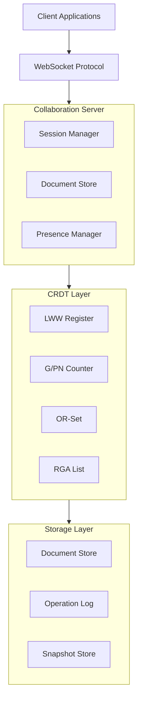
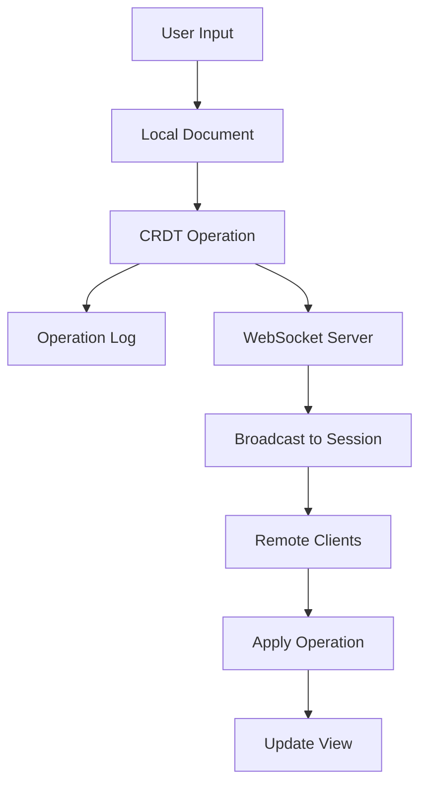
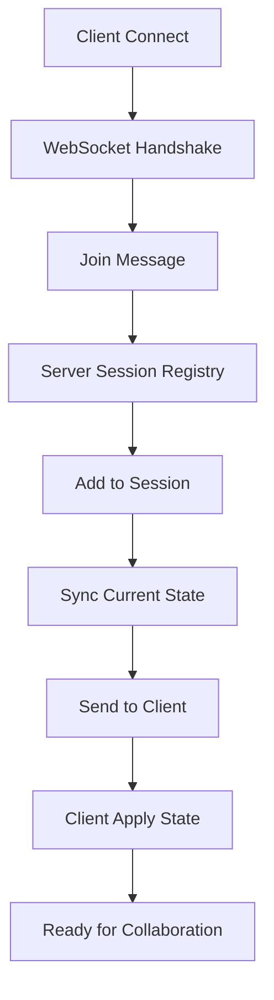
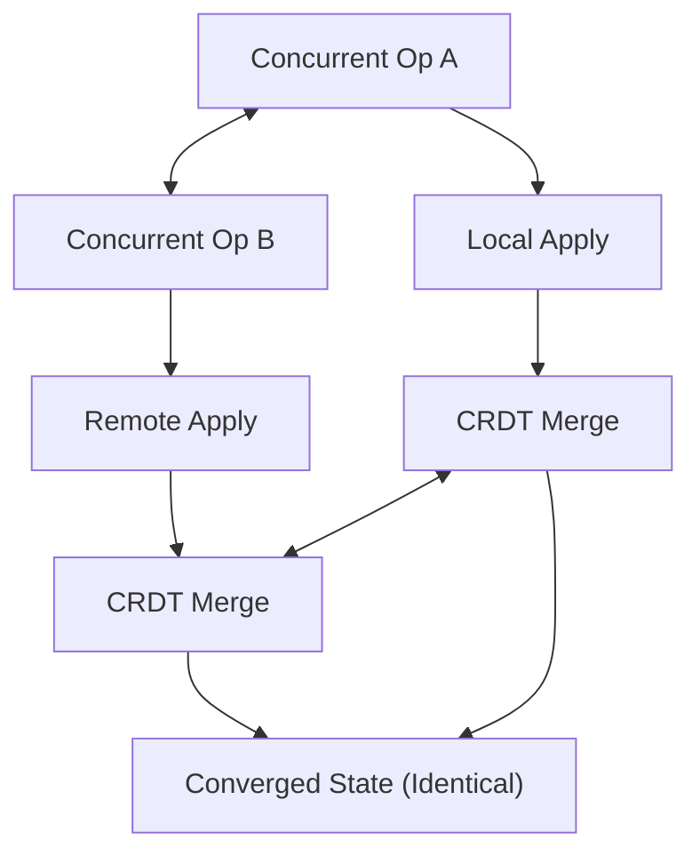

# CRDT Collaboration System Architecture

## Overview

The CRDT Collaboration System is a real-time collaborative editing framework built in Rust that leverages Conflict-free Replicated Data Types (CRDTs) to enable multiple users to simultaneously edit documents without conflicts. The system guarantees eventual consistency across all replicas without requiring a central authority.

## System Architecture



## Core Components

### 1. CRDT Types (`src/crdt.rs`)

The foundation of the system, implementing various CRDT types:

- **LWW Register (Last-Write-Wins)**: For simple value storage with automatic conflict resolution
- **G-Counter**: Increment-only distributed counter
- **PN-Counter**: Increment and decrement distributed counter
- **OR-Set**: Add-remove set with observed-remove semantics
- **RGA List**: Replicated growable array for ordered sequences

Each CRDT type provides:
- Local operations without coordination
- Deterministic merge operations
- Commutativity and associativity guarantees
- Idempotence for reliable distributed systems

### 2. Document Management (`src/document.rs`)

The collaborative document system that:

- **Text Operations**: Insert, delete, and update operations on document content
- **Operation History**: Complete log of all operations for replay and synchronization
- **Conflict Resolution**: Automatic resolution using CRDT merge semantics
- **Cursor Tracking**: Real-time cursor position synchronization
- **Selection Management**: Shared selection ranges across users
- **Undo/Redo**: Local undo/redo with proper CRDT semantics
- **Metadata**: Key-value metadata storage for document properties

### 3. Collaboration Server (`src/server.rs`)

The central coordination point that:

- **Session Management**: Create and manage collaboration sessions
- **Client Connections**: WebSocket-based real-time connections
- **Operation Broadcasting**: Efficient operation distribution to session participants
- **State Synchronization**: Initial state sync for new participants
- **Connection Recovery**: Automatic reconnection and state recovery

### 4. Presence System (`src/presence.rs`)

Real-time user awareness featuring:

- **User Status**: Online/offline/idle status tracking
- **Cursor Positions**: Real-time cursor location sharing
- **Selection Ranges**: Visible selection highlighting
- **User Colors**: Consistent color assignment for visual distinction
- **Activity Tracking**: Last activity timestamps

### 5. Protocol (`src/protocol.rs`)

WebSocket message protocol defining:

```rust
enum Message {
    Join { session_id, user_id, document_id },
    Leave { session_id, user_id },
    Operation { operation },
    CursorPosition { user_id, position },
    Selection { user_id, start, end },
    SyncRequest { document_id, from_version },
    SyncResponse { operations, version },
    Acknowledge { operation_id },
    Error { code, message },
    Ping,
    Pong,
}
```

### 6. Storage Layer (`src/storage.rs`)

Persistence and recovery system:

- **Document Storage**: Save and load document states
- **Operation Log**: Persistent operation history
- **Snapshot Management**: Periodic state snapshots for fast recovery
- **Compaction**: Log compaction to manage storage growth
- **Backup/Restore**: Full system backup and restore capabilities

## Data Flow

### 1. Edit Operation Flow



### 2. Join Session Flow



### 3. Conflict Resolution Flow



## Key Design Decisions

### 1. CRDT Selection

We chose specific CRDT types for different aspects:

- **RGA** for document text: Preserves intention and ordering
- **LWW Register** for metadata: Simple last-write-wins semantics
- **OR-Set** for presence: Add-remove semantics for user tracking
- **Vector Clocks** for causality tracking

### 2. Operation-Based vs State-Based

We use operation-based CRDTs (CmRDTs) for:
- Smaller message sizes
- Precise intention preservation
- Better performance for text editing

### 3. WebSocket Protocol

Chosen for:
- Real-time bidirectional communication
- Wide browser support
- Efficient binary and text message support
- Built-in connection management

### 4. Rust Implementation

Benefits:
- Memory safety without garbage collection
- High performance for real-time operations
- Strong type system for protocol safety
- Excellent async/await support

## Scalability Considerations

### Horizontal Scaling

- **Session Sharding**: Distribute sessions across multiple servers
- **Read Replicas**: Scale read operations independently
- **Load Balancing**: Distribute clients across server instances

### Performance Optimizations

- **Operation Batching**: Batch multiple operations for network efficiency
- **Lazy Synchronization**: Sync only visible document portions
- **Delta Compression**: Send only changes, not full state
- **Snapshot Intervals**: Periodic snapshots for fast recovery

### Storage Optimization

- **Log Compaction**: Periodic compaction of operation logs
- **Snapshot Pruning**: Keep only recent snapshots
- **Archival Storage**: Move old documents to cold storage

## Security Architecture

### Authentication

- Token-based authentication
- Session-level access control
- Document-level permissions

### Data Protection

- TLS for all WebSocket connections
- End-to-end encryption option
- Operation signing for integrity

### Privacy

- User data isolation
- Minimal metadata collection
- GDPR compliance support

## Monitoring and Observability

### Metrics

- Operation latency
- Sync time
- Active sessions/users
- Storage usage
- Network bandwidth

### Logging

- Structured logging with tracing
- Operation audit trail
- Error tracking
- Performance profiling

### Health Checks

- Server health endpoints
- Storage health monitoring
- Network connectivity checks

