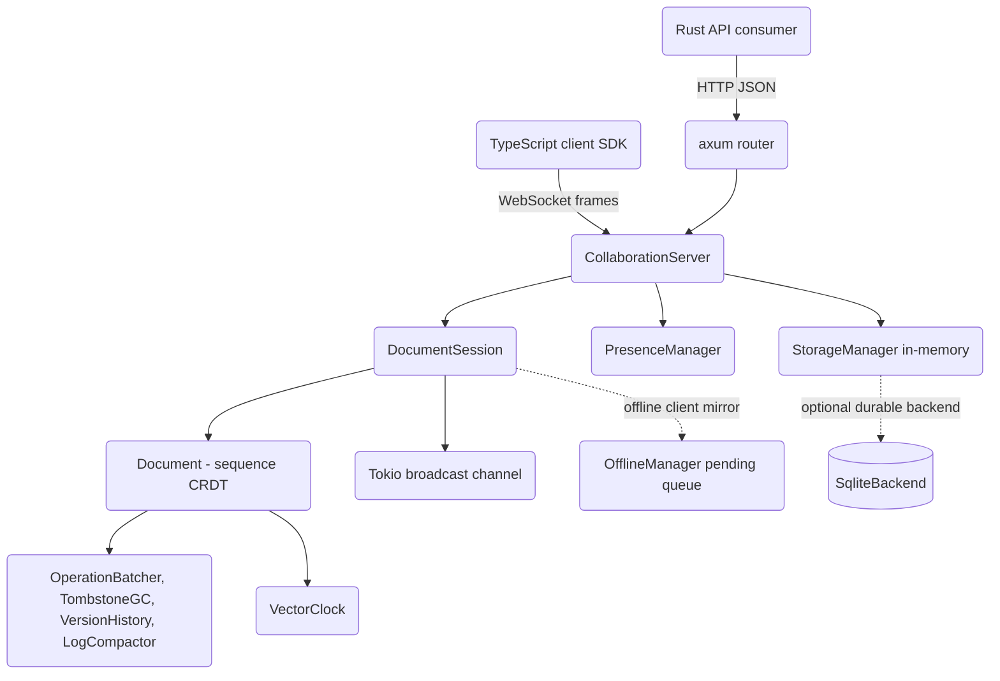

# CRDT-Based Real-Time Collaboration Engine

## Overview

This project is a Google Docs-lite collaborative text editing engine built from scratch in
Rust on top of Conflict-free Replicated Data Types (CRDTs). It lets multiple users edit the
same document concurrently and guarantees that every replica converges to the same content
without a central lock, an operational-transformation server, or a consensus protocol.
Conflict resolution is a property of the data type itself: operations are commutative,
associative, and idempotent, so they can be applied in any order and any number of times and
still yield the same result. Merge is therefore trivial — a replica that has seen the same
*set* of operations, regardless of arrival order or duplication, holds the same state as
every other replica that has seen that set.

The engine is organized as a Rust library crate, `crdt-collaboration`, plus a companion
TypeScript client SDK (`client-sdk/`) that mirrors the CRDT model in the browser. The Rust
side contains the sequence CRDT, the vector-clock causality machinery, a per-document
WebSocket collaboration server, an axum HTTP API for document management, presence/awareness
tracking, an offline editing manager, an in-memory store, and a durable SQLite backend. The
crate is a *library*: it exposes types an embedder composes into a binary, rather than
shipping a standalone server. That boundary is deliberate — the CRDT engine is pure and
transport-agnostic, and everything above it (transport, storage choice, auth) is a policy the
embedder selects.

The concepts this codebase teaches are:

- **Sequence CRDTs** — representing ordered text as a set of uniquely identified, totally
  ordered elements (an RGA-style design) rather than as index-addressed mutable strings.
- **Causality and logical time** — vector clocks and Lamport timestamps for ordering events
  in a distributed system without synchronized physical clocks.
- **Eventual consistency** — the convergence guarantees (commutativity, associativity,
  idempotency) that make merge deterministic, and why they hold for this design.
- **Tombstones and garbage collection** — why deletions must leave a marker, and how to
  reclaim them once they are causally stable across every participant.
- **Real-time transport** — a typed WebSocket protocol, broadcast fan-out, acknowledgement,
  and reconnection/sync.
- **Convergent scalar types** — grow-only and positive-negative counters and a
  last-writer-wins register, the simplest CRDTs, as a foil for the sequence CRDT.
- **Operational concerns** — snapshots, operation-log compaction, batching, presence,
  access control, audit, and version history.

### Scope and honesty

The CRDT engine, the per-document session/broadcast logic, the HTTP handlers, presence,
the offline pending-operation queue, the in-memory store, and the SQLite backend are all
implemented and tested. Several pieces are intentionally partial and are flagged where they
appear:

- There is no shipped server binary; the crate is a library.
- `server::CollaborationServer::handle_client` is generic over its transport (a
  tungstenite stream/sink pair) and is not bound to a live WebSocket route in this crate.
- The HTTP API in `api.rs` is wired to the in-memory `StorageManager`, not `SqliteBackend`.
- `offline::OfflineManager::sync_with_server` returns an empty `SyncResponse` because there
  is no live transport bound in the crate; the surrounding queueing, retry, TTL, persistence,
  and conflict-detection logic are real and tested.
- Share-link tokens are generated but not persisted.
- Audit logging and version history exist as tested components that the request handlers do
  not yet invoke.
- The performance numbers below are illustrative design targets, not measured results; the
  crate has no Criterion benchmarks.
- LSEQ is described as a design alternative only; the shipped sequence CRDT is RGA-style.

## Architecture



The system has four layers, each in its own module set, plus cross-cutting utilities that
hang off them.

**CRDT engine (`crdt`, `document`).** The pure, transport-agnostic core. `Document` holds the
sequence CRDT and a `VectorClock`; `crdt` defines `PositionId`, `Operation`, `Element`, the
`AttributeValue` enum, the `GCounter`/`PNCounter` counters, and the `LWWRegister`. Nothing
here knows about networking or storage, which keeps convergence logic easy to test in
isolation (`tests/crdt_tests.rs`, `tests/integration_tests.rs`). The engine is the only place
where CRDT invariants live; every other layer treats a `Document` as an opaque, converging
value.

**Collaboration server (`server`, `protocol`).** `CollaborationServer` owns a `DashMap` of
`DocumentId -> Arc<DocumentSession>`. Each `DocumentSession` wraps the document in a
`parking_lot::RwLock`, tracks connected clients in a `DashMap`, and owns a Tokio `broadcast`
channel that fans operations out to every subscriber. `protocol` defines the wire schema: a
tagged `Message` enum with operation, ack, sync, presence, control, and auth variants.

**HTTP API (`api`).** An axum `Router` exposes REST endpoints for document CRUD, content,
operation history, snapshots, ACLs, and share links. It shares the `CollaborationServer` and
`StorageManager` through an `Arc<ApiState>` and layers CORS and HTTP tracing on top.

**Storage (`storage`, `persistent`).** `StorageManager` is an in-memory store
(`RwLock<HashMap<...>>`) used by the live server; it holds snapshots, operation logs, and
metadata, and defines the ACL/audit/checkpoint types used across the crate. `SqliteBackend`
is a durable implementation of the `StorageBackend` trait over rusqlite (bundled), with a
full relational schema and its own tested CRUD path.

Cross-cutting utilities layer on top: `presence` tracks who is editing and where, `offline`
provides a client-side pending-operation queue with reconnection and conflict detection, and
`performance` collects batching, tombstone GC, version-history, compaction, and
memory-monitoring helpers. The TypeScript SDK in `client-sdk/` re-implements the same
comparison-based CRDT interleaving in the browser and adds a reconnecting WebSocket client.

### Why RGA and not OT

Operational Transformation (OT) achieves the same convergence goal but requires a central
server to transform concurrent operations against one another, and the transformation
functions are notoriously hard to get right. A sequence CRDT sidesteps transformation
entirely: because each character carries a globally unique, totally ordered identity, two
replicas that apply the same set of operations reach the same order *mechanically*, with no
server-side arbitration. The trade-off is metadata — every character carries a `PositionId`
and deleted characters linger as tombstones — which the `performance` module's GC and
compaction utilities exist to bound.

## Core Components

### CRDT engine and the RGA sequence

The text document is an RGA-style (Replicated Growable Array) sequence CRDT. Instead of
storing text as an index-addressed string, the document stores a set of `Element`s, each
identified by a globally unique, totally ordered `PositionId`. Insertion specifies the
element to insert *after*; concurrent inserts after the same anchor are ordered
deterministically by comparing their `PositionId`s. Because identity is independent of
position, an element keeps its identity even as neighbors are inserted or deleted around it,
which is what makes concurrent edits commute.

`Document` (`document.rs`) maintains:

- `elements: BTreeMap<PositionId, Element>` — every element ever inserted, keyed by its id.
  A `BTreeMap` keeps elements ordered by id, which is convenient for range operations such as
  formatting, though the readable order is defined by the `left`/`right` linked structure.
- `tombstones: HashSet<PositionId>` — ids of deleted elements (see tombstones below).
- `vector_clock: VectorClock` — the document's causal state.
- `root: PositionId` — a sentinel head element (`PositionId::root()`, value `'\0'`, created
  in `Document::new`), so every insert has a valid anchor even in an empty document.
- `seq_counters: HashMap<ClientId, u32>` — per-client sequence counters for id generation, so
  that two ids created by the same client in the same Lamport tick still differ.

Key operations:

- `generate_position(client)` increments the vector clock for the client (yielding a Lamport
  value), bumps the client's `seq` counter, and returns a fresh `PositionId { lamport,
  client_id, seq }`. Lamport time comes from the vector clock; `seq` disambiguates within a
  tick; `client_id` breaks ties between clients.
- `insert(client, after, value, attributes)` generates a position, builds an `Element` linked
  after the given anchor, splices it into the linked structure via `insert_element`, and
  returns an `Operation::Insert`. Note the returned op carries an empty attribute map — the
  attributes are applied locally at insert time and, in this design, formatting is propagated
  as a separate `Operation::Format`.
- `delete(client, id)` errors with `InvalidOperation("Element not found")` if the id is
  unknown, otherwise flips the element's `deleted` flag and records the id in `tombstones`,
  returning an `Operation::Delete { id, deleted_by }` where `deleted_by` is a freshly
  generated position (so the delete advances the clock too).
- `apply(op)` replays a remote operation. `Insert` is idempotent: if the id already exists,
  it returns early. After applying an insert or delete, it advances the vector clock to cover
  the operation's Lamport time by merging a single-entry clock for `(client_id, lamport)`.
- `text()` walks the linked list from `root` following `right` pointers, emitting non-deleted,
  non-sentinel characters. `char_at`, `position_at`, `len`, and `is_empty` are index helpers
  that walk the same chain.

#### The insertion (interleaving) algorithm

`insert_element` resolves where a new element goes among concurrent siblings. Starting from
the anchor (`left`), it scans forward over right-siblings and stops before the first sibling
whose `PositionId` is greater than the new element's id:

```rust
let mut insert_after = left.clone();
while let Some(ref right) = self.elements.get(&insert_after).and_then(|e| e.right.clone()) {
    if right > &id {
        break;
    }
    insert_after = right.clone();
}
```

It then relinks `insert_after.right`, the new element's `left`/`right`, and the old right
neighbor's `left`. Because `PositionId` defines a *total* order (Lamport, then client id,
then seq — see Data Structures), every replica that receives the same set of operations
produces the same final ordering regardless of arrival order. This is the convergence
property verified by `test_concurrent_inserts` in `document.rs`: two replicas insert `'A'`
and `'B'` concurrently after the root, exchange operations, and end with identical text.
Because the scan only walks forward while siblings are *less than* the new id, higher-id
concurrent inserts land after lower-id ones deterministically, and no replica needs to know
the order in which the operations were produced.

#### Tombstones and deletion

Deletion cannot physically remove an element, because a concurrent insert may reference the
deleted element as its anchor. If the element vanished, a late-arriving insert that says
"after X" would have no X to attach to. Instead, `delete` flips `Element::deleted` and records
the id in the `tombstones` set. `text()` and `len()` skip deleted elements, so the document
reads correctly, but the structural link is preserved for late-arriving concurrent
operations. Tombstones accumulate over the life of a document; `gc_tombstones` (below) and the
`TombstoneGC` helper exist to reclaim them once they are causally stable.

#### Formatting

`Operation::Format` carries a `(start, end)` range, an attribute name, and an
`AttributeValue`. `apply` computes a timestamp as `max(start.lamport, end.lamport)`, then
walks all elements whose `PositionId` falls in `[start, end]` (using the `BTreeMap` ordering)
and updates the named attribute using a last-writer-wins rule: each attribute is stored as a
`(Timestamp, AttributeValue)` pair, and a write only takes effect if its timestamp exceeds the
stored one. Concurrent formatting therefore converges deterministically to the write with the
larger Lamport time.

#### Tombstone garbage collection at the document level

`Document::gc_tombstones(min_vector_clock)` retains only tombstones that the supplied minimum
clock does *not* dominate. The minimum clock is the pointwise minimum across all connected
clients' clocks: if the minimum dominates a tombstone's `(client_id, lamport)`, every client
has already seen the delete, so no future operation can reference the tombstone as an anchor,
and it is safe to drop. This is the causal-stability condition that makes GC safe rather than
merely convenient.

### Vector clocks and causality

`VectorClock` (`crdt.rs`) maps `ClientId -> Timestamp` and implements the standard causal
operations:

- `increment(client)` — bump and return the client's logical time (used for Lamport stamps).
- `get(client)` / `set(client, t)` — read/write a single component, treating absent clients
  as time 0.
- `merge(other)` — pointwise maximum, the join used when receiving remote state.
- `happens_before(other)` — true if `self` is causally dominated by `other`: every component
  of `self` is `<=` the corresponding component of `other`, and at least one is strictly `<`
  (accounting for clients present only in `other`).
- `is_concurrent(other)` — neither `happens_before` the other; the basis for conflict
  detection.
- `dominates(other)` — `self >=` `other` componentwise; used by tombstone GC and the operation
  log's `get_after_clock` filter.
- `clients()` — the set of clients the clock knows about, used when computing minimum clocks.

`tests/integration_tests.rs` exercises these for transitive causality chains
(`A -> B -> C`) and concurrency detection, and `crdt.rs`'s inline tests cover the
happens-before and concurrent cases directly. The clock is also the unit of state
advancement: when a document applies an operation, it merges in a single-entry clock for the
operation's `(client_id, lamport)`.

### Convergent counters and register

Alongside the sequence CRDT, `crdt.rs` provides three scalar CRDTs that demonstrate the same
convergence properties in miniature:

- `GCounter` — a grow-only counter storing a per-client `HashMap<ClientId, u64>`. `value()` is
  the sum of all entries; `merge` takes the pointwise maximum. Because increments only ever
  raise a client's own entry and merge takes the max, the counter is monotone and convergent.
- `PNCounter` — a positive-negative counter composed of two `GCounter`s. `increment` raises
  the positive counter, `decrement` raises the negative counter, `value()` is
  `positive - negative` as an `i64`, and `merge` merges both halves. Decrement is modeled as
  "increment a separate grow-only counter" precisely so the whole thing stays monotone.
- `LWWRegister<T>` — a last-writer-wins register carrying a value, a timestamp, and a client
  id. `set` overwrites only when the incoming timestamp is greater, or equal with a greater
  client id; `merge` is `set` applied to the other register's fields. The client-id tiebreak
  makes concurrent writes at the same timestamp resolve deterministically.

These are the simplest CRDTs and serve as a conceptual on-ramp to the sequence CRDT: the same
"monotone local update plus pointwise-join merge" recipe underlies all of them.

### Document model, snapshots, and metadata

`Document::snapshot()` produces a `DocumentSnapshot` containing the full `elements` map, the
vector clock, a materialized `content` string (from `text()`), and a wall-clock millisecond
timestamp. The materialized `content` lets a reader get the text without re-walking the linked
structure. `from_snapshot` restores a document from one; note that `tombstones` and
`seq_counters` are reset to empty, since a snapshot represents already-merged state and the
elements themselves carry their `deleted` flags. `DocumentMetadata` carries id, title, owner,
created/updated timestamps, a version counter, and an `archived` flag, and is the unit the
storage layer indexes for listing.

### WebSocket protocol and connection lifecycle

`protocol::Message` is a `#[serde(tag = "type", content = "payload")]` enum, so each message
serializes as `{ "type": "...", "payload": {...} }`. Its variants group as:

- **Operations:** `Operation(OperationMessage)`, `OperationAck(OperationAck)`,
  `SyncRequest(SyncRequest)`, `SyncResponse(SyncResponse)`.
- **Presence:** `CursorUpdate`, `SelectionUpdate`, `UserJoin`, `UserLeave`, `PresenceSync`.
- **Control:** `Heartbeat`, `Error`.
- **Auth:** `Auth(AuthMessage)`, `AuthResponse(AuthResponse)`.

`OperationMessage` carries the document id, originating client id, the sender's vector clock,
a batch of `Operation`s, and a monotonic `seq`. `SyncResponse` carries a serialized state blob
(the JSON-encoded snapshot), any pending operations, and the current vector clock.
Supporting structs (`UserInfo`, `JoinDocument`, `ConnectionOptions`) round out the protocol;
`ConnectionOptions::default` enables reconnection with up to 10 attempts at a 1000 ms delay.

The server-side lifecycle lives in `CollaborationServer::handle_client`, which is generic over
a tungstenite `StreamExt`/`SinkExt` pair so it can be driven by any WebSocket transport. On
connect the server:

1. Resolves the session with `get_or_create_session`, loading a snapshot from storage if one
   exists, otherwise creating a fresh `Document`.
2. Enforces `max_connections_per_doc` (default 100), replying with an `Error` message of code
   429 and returning if the limit is exceeded.
3. Registers a per-client `mpsc::Sender<Message>` (channel depth 100) in the session's client
   map, adds the user to presence with a color, and subscribes to the session broadcast.
4. Sends an initial `SyncResponse` with the current snapshot and clock.
5. Broadcasts a `UserJoin` to the rest of the session.

The main loop is a `tokio::select!` over three sources: inbound WebSocket frames, the client's
outbound mpsc queue, and the session broadcast. Operations whose originating `client_id`
matches the connection are filtered out of the broadcast branch so a sender never receives its
own echo. On disconnect (a `Close` frame or a stream error) the client is removed from the
session and presence, a `UserLeave` is broadcast, and if the session is now empty a snapshot
is persisted via storage and the session is dropped from the server map.

`handle_message` dispatches inbound messages:

- `Operation` — applied via `session.apply_operations`, which acquires the document write
  lock, applies each op, bumps the atomic op counter to get a `seq`, and broadcasts an
  `OperationMessage`. The handler then sends an `OperationAck` back to the sender through its
  mpsc channel, and every `snapshot_interval` operations (default 1000) persists a snapshot.
- `CursorUpdate` / `SelectionUpdate` — update the document's presence entry and rebroadcast to
  the session.
- `SyncRequest` — reply to the requester with a fresh `SyncResponse`.
- `Heartbeat` — refresh the user's `last_active` and set status to `Active`.

### Presence and awareness

`presence.rs` tracks who is editing and where. `PresenceState` holds a client id, name, color,
optional `CursorPosition` (position plus selection anchor) and `Selection` range, a
`last_active` timestamp, and a `UserStatus` (`Active`/`Idle`/`Away`). `update_status` derives
the status from inactivity: `Idle` after 30 s, `Away` after 5 min, otherwise `Active`; the
setters (`set_cursor`, `set_selection`) always reset the user to `Active` and refresh
`last_active`. `DocumentPresence` is a `DashMap<ClientId, PresenceState>` per document with
cursor/selection updates, `active_count`/`total_count`, and a `get_all` that snapshots every
state (used to build `PresenceSync`). `PresenceManager` owns one `Arc<DocumentPresence>` per
document and can `cleanup` documents that have no users. A `ColorGenerator` cycles a fixed
palette of ten hex colors so each user gets a stable, distinct cursor color.

### Offline editing

`offline.rs` provides client-oriented offline support around an `OfflineManager`. It tracks a
`ConnectionState` (`Online`/`Offline`/`Reconnecting`/`Syncing`), a per-document
`VecDeque<PendingOperation>` queue, per-document local vector clocks, a monotonic
`next_op_id`, the last heartbeat `Instant`, and a `broadcast` channel of `OfflineEvent`s. An
`OfflineConfig` tunes queue size, TTL, retry count/delay, persistence, conflict strategy, and
the heartbeat/timeout windows.

- `queue_operation` assigns a monotonic id, enforces `max_queue_size` (default 10000, erroring
  with `InvalidState("Operation queue is full")` when exceeded), enqueues the operation, emits
  `OperationQueued`, and — if online — tries to flush immediately.
- `try_send_pending` clones the front operation, increments its attempt count and stamps
  `last_attempt`, builds an `OperationMessage`, and sends it over the configured mpsc channel;
  it pops the operation on success, or drops it after `max_retries`.
- `record_heartbeat` / `check_connection` implement liveness: a heartbeat records an `Instant`
  and marks the connection online (unless syncing); if no heartbeat arrives within
  `connection_timeout_ms`, `check_connection` flips the state to `Offline` and returns false.
- `handle_reconnection` transitions to `Syncing`, emits `SyncStarted`, reads the local clock,
  calls `sync_with_server`, then drains the pending queue — running `detect_conflict` against
  the server response for each op and forwarding the op over the mpsc channel — and finally
  reports a `SyncResult` (local ops synced, server ops received, conflicts resolved,
  duration) and returns to `Online`.
- `cleanup_expired` drops operations older than `operation_ttl_secs` (default 24 h);
  `serialize_queue`/`restore_queue` persist the queue as JSON keyed by document id.

`detect_conflict` flags an operation as conflicting when neither the local nor the server
vector clock happens-before the other (i.e. the edits are concurrent), attaching the
configured `ConflictResolution` strategy (`AutoMerge`, `ServerWins`, `LocalWins`, `Manual`)
and the conflicting server ops. `PersistentOfflineManager` layers a `LocalStorage` trait (with
an in-memory test implementation, `InMemoryLocalStorage`) over the base manager, persisting the
queue to a per-client key after each `queue_operation` when `persist_queue` is set, and
restoring it on startup.

**Partial:** `sync_with_server` currently returns an empty `SyncResponse` because there is no
live transport bound in this crate. The queueing, retry, TTL, persistence, and
conflict-detection logic are real and tested by the module's `#[cfg(test)]` block.

### Persistence and storage (in-memory + SQLite)

There are two storage implementations.

`StorageManager` (`storage.rs`) is the in-memory store the live server uses. It holds
snapshots, operation logs, and metadata in three `RwLock<HashMap<...>>` maps. `OperationLog`
is an append-only `Vec<OperationEntry>` with a `next_seq` counter starting at 1; `append`
returns the assigned sequence, `get_since` returns entries after a sequence number,
`get_after_clock` returns operations from entries the supplied clock does not dominate, and
`truncate_before` drains all but the most recent `keep` entries. The manager's `compact` calls
`truncate_before(100)`. This module also defines the `Checkpoint`, `AuditEvent`/`AuditAction`,
`AuditLog`, and ACL types used across the crate.

`SqliteBackend` (`persistent.rs`) is a durable implementation of the `StorageBackend` trait
over rusqlite with the `bundled` feature, so no system SQLite is required. It opens a file
(`new(path)`) or an in-memory database (`in_memory()`), initializes the schema on
construction, and serializes operations, vector clocks, snapshot content, and permission lists
to JSON text columns. The connection is wrapped in an `Arc<Mutex<Connection>>` for
thread-safety. A `CompactionManager` wraps any `StorageBackend` and calls `compact` when a
document's log exceeds a configured threshold, keeping a recent tail. The backend is fully
exercised by `tests/server_storage_tests.rs` and the module's inline tests for metadata,
operations, compaction, ACLs, and audit.

**Honest note:** the HTTP API in `api.rs` is constructed with a `StorageManager` (in-memory),
not `SqliteBackend`. The SQLite backend is a complete, tested alternative store but is not
wired into the running server in this crate; an embedder would swap it in behind the
`StorageBackend` trait.

### Access control lists

`DocumentAcl` (`storage.rs`) holds the owner, a list of `AclEntry` (principal, permissions,
grantor, grant time, optional expiry), and an optional `public_access` level. `Permission` is
ordered `Read < Comment < Write < Admin` via a `permission_level` helper (1..4).
`has_permission` short-circuits for the owner (who has everything), then checks public access,
then matching non-expired entries, using the level ordering so a higher permission implies the
lower ones. `grant` appends an entry with no expiry; `revoke` removes all entries for a
principal. The HTTP API exposes `GET/PUT /api/documents/:id/acl`; on the server side ACLs are
stored in an in-memory `RwLock<HashMap<DocumentId, DocumentAcl>>` on `ApiState`. SQLite ACL
persistence (`save_acl`/`load_acl`) exists and is tested but is not the path the API uses.

### Version history and snapshots

`VersionHistory` (`performance.rs`) manages named and automatic versions per document. Each
`Version` records a UUID, document id, version number, timestamp, author, optional label,
vector clock, sequence number, and an optional snapshot. `create_version` appends a version,
numbering it by current count, and prunes to `max_versions` by removing middle entries (index
1) while keeping the first and last. `record_operation` increments a per-document counter and
returns true when the auto-version interval is reached, signaling the caller to snapshot.
`compare_versions` returns a `VersionComparison` reporting the operation distance
(`to_seq - from_seq`) and timestamps between two versions. Getters cover lookup by number, by
id, and latest. This is a complete, tested component, but the server/API do not call it yet.

### Audit logging

`AuditLog` (`storage.rs`) is an in-memory append log of `AuditEvent`s (event id, timestamp,
user, document, `AuditAction`, JSON details), queryable by document or user. `AuditAction`
enumerates document lifecycle events (created, opened, edited, shared, permission changed,
deleted, restored). `SqliteBackend` additionally persists audit events via `log_audit` and
`get_audit_for_document`. Both are tested. As with version history, audit is implemented as a
component but is not invoked from the request-handling path in this crate.

### Performance utilities

`performance.rs` collects optimization helpers, each with its own atomic statistics counters:

- `OperationBatcher` — coalesces operations per document into a `PendingBatch`, flushing on
  size (`max_batch_size`, default 50) or time (`max_batch_delay_ms`, default 100), returning
  the coalesced ops from `add_operation` when a flush is due. `flush` forces a document's
  batch, `flush_expired` sweeps all stale batches, and `get_stats` reports ops batched,
  batches flushed, and average batch size.
- `TombstoneGC` — decides when to garbage-collect based on an operation count since the last
  GC and a tombstone ratio (`should_run_gc`), and computes the collectible ids
  (`collect_tombstones`) using both a minimum-age check and a causal-stability check against
  the minimum vector clock across all connected clients. Only causally stable, sufficiently
  old tombstones are removed.
- `LogCompactor` — given a snapshot and a slice of `OperationEntry`, produces a `Checkpoint` at
  a cutoff and keeps only the most recent entries; `needs_compaction` gates it on a minimum
  log size.
- `MemoryMonitor` — tracks per-document `MemoryStats`, estimates document and log memory from
  element/entry counts, computes total memory, and raises alerts for documents past a
  configurable byte threshold.

## Data Structures

The following are the real types from the source.

### Position identifier and total order

```rust
pub struct PositionId {
    pub lamport: Timestamp, // u64 Lamport timestamp
    pub client_id: ClientId, // uuid::Uuid
    pub seq: u32,           // sequence within the same lamport tick
}

impl Ord for PositionId {
    fn cmp(&self, other: &Self) -> Ordering {
        match self.lamport.cmp(&other.lamport) {
            Ordering::Equal => match self.client_id.cmp(&other.client_id) {
                Ordering::Equal => self.seq.cmp(&other.seq),
                ord => ord,
            },
            ord => ord,
        }
    }
}
```

The ordering — Lamport, then client id, then seq — is *total*: any two distinct positions
compare deterministically on every replica, which is the foundation of convergence.
`PositionId::root()` is the zeroed sentinel head (`lamport 0`, nil client id, `seq 0`), so it
sorts before every real position.

### Operations and elements

```rust
pub enum Operation {
    Insert { id: PositionId, after: PositionId, value: char,
             attributes: HashMap<String, AttributeValue> },
    Delete { id: PositionId, deleted_by: PositionId },
    Format { start: PositionId, end: PositionId, attribute: String, value: AttributeValue },
}

pub struct Element {
    pub id: PositionId,
    pub value: char,
    pub left: Option<PositionId>,
    pub right: Option<PositionId>,
    pub attributes: HashMap<String, (Timestamp, AttributeValue)>, // LWW per attribute
    pub deleted: bool, // tombstone flag
}

pub enum AttributeValue { Null, Bool(bool), Number(f64), String(String) }
```

`Operation::position_id()` returns the primary id of any operation (the insert/delete id or a
format range's start), which the operation log and batcher use as a stable key.

### Vector clock

```rust
pub struct VectorClock {
    clocks: HashMap<ClientId, Timestamp>,
}
// increment, get, set, merge (pointwise max),
// happens_before, is_concurrent, dominates, clients
```

### Document and snapshot

```rust
pub struct Document {
    pub id: DocumentId,
    elements: BTreeMap<PositionId, Element>,
    tombstones: HashSet<PositionId>,
    pub vector_clock: VectorClock,
    root: PositionId,
    seq_counters: HashMap<ClientId, u32>,
}

pub struct DocumentSnapshot {
    pub id: DocumentId,
    pub elements: BTreeMap<PositionId, Element>,
    pub vector_clock: VectorClock,
    pub content: String,
    pub timestamp: u64,
}

pub struct DocumentMetadata {
    pub id: DocumentId,
    pub title: String,
    pub owner: ClientId,
    pub created_at: u64,
    pub updated_at: u64,
    pub version: u64,
    pub archived: bool,
}
```

### Convergent register and counters

```rust
pub struct GCounter { counts: HashMap<ClientId, u64> }        // grow-only; value = sum, merge = max
pub struct PNCounter { positive: GCounter, negative: GCounter } // value = pos - neg
pub struct LWWRegister<T> { value: T, timestamp: Timestamp, client_id: ClientId }
// LWWRegister::set keeps the value with the higher timestamp; ties broken by higher client id.
```

### Session, protocol, and presence

```rust
pub struct DocumentSession {
    pub doc_id: DocumentId,
    pub document: RwLock<Document>,
    pub clients: DashMap<ClientId, ClientConnection>,
    pub broadcast: broadcast::Sender<Message>,
    pub op_counter: std::sync::atomic::AtomicU64,
}

pub struct OperationMessage {
    pub doc_id: DocumentId,
    pub client_id: ClientId,
    pub vector_clock: VectorClock,
    pub operations: Vec<Operation>,
    pub seq: u64,
}

pub struct PresenceState {
    pub client_id: ClientId,
    pub name: String,
    pub color: String,
    pub cursor: Option<CursorPosition>,
    pub selection: Option<Selection>,
    pub last_active: u64,
    pub status: UserStatus, // Active | Idle | Away
}
```

### Offline queue and storage entries

```rust
pub struct PendingOperation {
    pub id: u64,
    pub doc_id: DocumentId,
    pub operations: Vec<Operation>,
    pub vector_clock: VectorClock,
    pub created_at: u64,
    pub attempts: u32,
    pub last_attempt: Option<u64>,
}

pub struct OperationEntry {
    pub seq: u64,
    pub operations: Vec<Operation>,
    pub vector_clock: VectorClock,
    pub timestamp: u64,
}

pub struct Checkpoint {
    pub id: uuid::Uuid,
    pub doc_id: DocumentId,
    pub timestamp: u64,
    pub vector_clock: VectorClock,
    pub seq: u64,
    pub snapshot: DocumentSnapshot,
}
```

### Errors and aliases

```rust
pub type ClientId = uuid::Uuid;
pub type DocumentId = uuid::Uuid;
pub type Timestamp = u64;
pub type Result<T> = std::result::Result<T, Error>;

pub enum Error {
    DocumentNotFound(DocumentId), InvalidOperation(String), PermissionDenied,
    Connection(String), Serialization(String), Storage(String), InvalidState(String),
}
```

### SQLite schema

`SqliteBackend` creates the relational schema on construction (verbatim summary):

```sql
CREATE TABLE documents (id TEXT PRIMARY KEY, title TEXT, owner TEXT,
    created_at INTEGER, updated_at INTEGER, version INTEGER, archived INTEGER);
CREATE TABLE snapshots (id TEXT PRIMARY KEY, doc_id TEXT, content TEXT,
    vector_clock TEXT, timestamp INTEGER, UNIQUE(doc_id));
CREATE TABLE operations (id INTEGER PRIMARY KEY AUTOINCREMENT, doc_id TEXT, seq INTEGER,
    operations TEXT, vector_clock TEXT, timestamp INTEGER, UNIQUE(doc_id, seq));
CREATE TABLE acl (id INTEGER PRIMARY KEY AUTOINCREMENT, doc_id TEXT, owner TEXT,
    public_access TEXT, UNIQUE(doc_id));
CREATE TABLE acl_entries (id INTEGER PRIMARY KEY AUTOINCREMENT, doc_id TEXT, principal TEXT,
    permissions TEXT, granted_by TEXT, granted_at INTEGER, expires_at INTEGER);
CREATE TABLE audit_log (id INTEGER PRIMARY KEY AUTOINCREMENT, event_id TEXT, timestamp INTEGER,
    user_id TEXT, doc_id TEXT, action TEXT, details TEXT);
CREATE TABLE checkpoints (id TEXT PRIMARY KEY, doc_id TEXT, seq INTEGER, timestamp INTEGER,
    snapshot_id TEXT);
```

Indexes are created on `operations(doc_id, seq)`, `acl_entries(doc_id)`, `audit_log(doc_id)`,
`audit_log(user_id)`, and `checkpoints(doc_id)`. Operations, vector clocks, snapshot content,
and permission lists are stored as JSON text via serde. The `UNIQUE(doc_id)` constraint on
`snapshots` means each document has at most one persisted snapshot (upserted on save), while
operations are appended per `(doc_id, seq)`.

## API Design

### Server HTTP API (axum)

`api::create_router` builds the router with a CORS layer and HTTP tracing, sharing an
`Arc<ApiState>` (which holds the `CollaborationServer` and `StorageManager`):

```
POST   /api/documents               create_document
GET    /api/documents               list_documents
GET    /api/documents/:id           get_document          (metadata + character count)
DELETE /api/documents/:id           delete_document       (soft archive, 204 No Content)
GET    /api/documents/:id/content   get_document_content  (materialized text)
GET    /api/documents/:id/history   get_document_history  (operation entries)
POST   /api/documents/:id/snapshot  create_snapshot
GET    /api/documents/:id/snapshot  get_snapshot
GET    /api/documents/:id/acl       get_acl
PUT    /api/documents/:id/acl       update_acl
POST   /api/documents/:id/share     create_share_link     (token generated, not persisted)
GET    /health                      health_check
```

Handlers return JSON request/response structs — `CreateDocumentRequest`/`CreateDocumentResponse`,
`DocumentInfoResponse`, `DocumentContentResponse`, `DocumentListResponse`,
`OperationHistoryResponse`, `AclResponse`/`AclEntryResponse`, `UpdateAclRequest`/`AclEntryRequest`,
`ShareLinkRequest`/`ShareLinkResponse`, and `SnapshotResponse`. The `Error` enum implements
`IntoResponse`, mapping `DocumentNotFound` to 404, `PermissionDenied` to 403,
`InvalidOperation` to 400, and everything else to 500. The real-time WebSocket path is handled
separately by `CollaborationServer::handle_client`; this crate does not bind it to an axum WS
route.

### Rust engine API

```rust
// Document
Document::new(id) -> Document
Document::insert(client, after, value, attributes) -> Result<Operation>
Document::delete(client, id) -> Result<Operation>
Document::apply(&Operation) -> Result<()>
Document::text() -> String
Document::char_at(index) -> Option<char>
Document::position_at(index) -> Option<PositionId>
Document::len() -> usize
Document::snapshot() -> DocumentSnapshot
Document::from_snapshot(snapshot) -> Document
Document::gc_tombstones(&min_vector_clock)

// Server
CollaborationServer::new(config, storage) -> Self
CollaborationServer::get_or_create_session(doc_id) -> Result<Arc<DocumentSession>>
CollaborationServer::handle_client(client_id, doc_id, name, color, ws_receiver, ws_sender)
DocumentSession::apply_operations(client, ops) -> Result<u64>
DocumentSession::get_sync_response() -> SyncResponse

// Storage
StorageManager::{save_snapshot, load_snapshot, append_operations, get_operations_since,
                 get_operations_after_clock, save_metadata, load_metadata, list_documents,
                 delete_document, compact}
SqliteBackend::{new, in_memory} + StorageBackend trait (save/load snapshot, append/get
                 operations, save/load metadata, list, delete, compact, save/load acl,
                 log_audit, get_audit_for_document)
```

### TypeScript client SDK

The SDK (`client-sdk/`) re-implements the CRDT model in the browser and adds a reconnecting
WebSocket client. Public surface from `client-sdk/src/index.ts`:

- `CollaborationClient` (`client.ts`) — an `EventEmitter` that connects to a WebSocket URL,
  joins/leaves documents, and exposes editing methods: `insert`, `insertAt`, `delete`,
  `deleteAt`, `deleteRange`, `format`, `updateCursor`, `updateSelection`, `getText`,
  `getLength`. It buffers messages while disconnected, sends heartbeats, and reconnects with
  exponential backoff (`maxReconnectAttempts`, `reconnectDelay`). It emits
  `connectionStateChange`, `documentState`, `remoteOperation`, `remoteOperations`,
  `presenceUpdate`, `userJoined`, `userLeft`, `operationAck`, and `error`.
- `CRDTDocument` (`crdt.ts`) — the client-side RGA document with `insert`, `delete`, `format`,
  `applyRemoteOperation`, `getText`, `getContent`, `getPositionAtIndex`, `getIndexOfPosition`,
  `getLength`, and `loadSnapshot`. `applyRemoteInsert` performs the same comparison-based
  interleaving as the Rust engine, using `comparePositionIds`.
- Helpers `generateUUID`, `comparePositionIds`, `positionIdsEqual`, and the type definitions
  in `types.ts` (`Operation`, `PositionId`, `VectorClock`, `PresenceState`, `ClientConfig`,
  message enums, etc.).

The SDK ships its own JSON message vocabulary (`welcome`, `doc_state`, `join`, `leave`,
`operation`, `operations_batch`, `cursor_update`, `presence_update`, `ping`, `ack`,
`user_joined`, `user_left`, `error`). This is a superset/variant of the Rust
`protocol::Message` vocabulary; the two are conceptually aligned but not guaranteed
wire-identical, so an embedder bridging them should reconcile the message names.

## Performance

The design targets below are illustrative goals that motivate the optimizations in
`performance.rs`; they are not benchmark measurements (the crate has no Criterion benchmarks).

| Operation | Illustrative target |
|-----------|---------------------|
| Local insert (engine) | sub-millisecond |
| Remote operation apply | low single-digit ms |
| Document sync on join | bounded by snapshot size |
| Snapshot creation | proportional to element count |
| Presence broadcast | one fan-out per connected client |

The optimizations that exist in code:

- **Operation batching** (`OperationBatcher`) reduces per-keystroke network and storage
  overhead by coalescing operations within a size/time window before flushing (default 50 ops
  or 100 ms).
- **Snapshotting** in the server (`snapshot_interval`, default 1000 operations) bounds replay
  cost and is the unit loaded on session creation and persisted when a session empties.
- **Operation-log compaction** (`StorageManager::compact` keeping the most recent 100 entries,
  `LogCompactor`, `SqliteBackend::compact`, `CompactionManager`) prunes old log entries behind
  a checkpoint so the log does not grow unbounded.
- **Tombstone garbage collection** (`TombstoneGC`, `Document::gc_tombstones`) reclaims deleted
  elements that are causally stable across all clients, using a minimum vector clock so no
  client can still reference a removed id.
- **Memory monitoring** (`MemoryMonitor`) estimates per-document memory from element and log
  counts and flags documents past a configurable threshold.

Concurrency is handled with `parking_lot::RwLock` around document state, `DashMap` for the
sessions/clients/presence maps (so unrelated documents never contend on a single lock), an
`AtomicU64` operation counter per session, and Tokio `broadcast`/`mpsc` channels for fan-out
and per-client queues. The broadcast channel is bounded (depth 1000) and per-client mpsc
channels are bounded (depth 100); a slow or dead client cannot stall the session because its
own send loop drains its queue independently.

### Cost of the CRDT design

The RGA design trades memory for merge simplicity. Every character carries a `PositionId`
(two `u64`-ish fields plus a UUID) and left/right link ids, and deleted characters remain as
tombstones until GC. `MemoryMonitor::estimate_document_memory` models this as roughly
`(active + tombstone) * (48 + avg_element_size + 16)` bytes. The GC and compaction utilities
exist precisely to keep this metadata bounded over a long-lived document's lifetime.

## Testing Strategy

Correctness rests primarily on the CRDT convergence properties, verified directly.

**Unit tests (inline `#[cfg(test)]`).** Each module carries inline tests:

- `crdt.rs` — vector-clock happens-before and concurrency, the PN counter, and LWW-register
  tie-breaking.
- `document.rs` — basic insert, the concurrent-insert convergence scenario, and delete.
- `api.rs` — HTTP handlers via `tower::ServiceExt::oneshot`, asserting status codes including
  404 for a missing document.
- `presence.rs` — presence-state cursor updates and document add/remove.
- `offline.rs` — the full offline manager: creation defaults, state transitions, queueing,
  queue-size limits, heartbeat-timeout detection, event subscription, serialize/restore,
  TTL cleanup, the in-memory local storage, the persistent manager round-trip, and
  get/clear/update-clock helpers.
- `persistent.rs` — the SQLite backend across metadata, operations, compaction, ACL, and
  audit.
- `performance.rs` — batch config defaults, batcher add/flush, version-history create/get/
  compare, GC gating, compaction gating, and memory monitoring with and without alerts.

**Integration tests (`tests/`).**

- `crdt_tests.rs` — LWW register conflict resolution and tie-breaking, G/PN counter
  increment/merge (including idempotency and commutativity), vector-clock increment/merge/
  causality, and `PositionId` total ordering.
- `integration_tests.rs` — document creation/insert/delete, the concurrent-insert convergence
  scenario, distributed counter convergence across three replicas, and transitive causality
  chains (`A -> B -> C`).
- `server_storage_tests.rs` — server config defaults, `DocumentSession` add/remove client and
  `apply_operations`, multi-session management, `StorageManager` save/load/list/delete/compact,
  `OperationLog` append/truncate, ACL grant/revoke/public-access checks, audit-log queries, and
  the performance utilities.

The convergence tests follow the canonical pattern: build two (or three) replicas, perform
concurrent or independent edits, cross-apply the operations, and assert identical final state
— directly demonstrating commutativity and idempotency. Idempotency in particular is exercised
by re-applying an already-known insert and asserting the early return leaves state unchanged.
The TypeScript SDK has its own Jest suites under `client-sdk/tests/` for the client document
and the WebSocket client, run with `npm test`.

A natural extension (not yet present) would be property-based randomized convergence tests
that generate arbitrary operation interleavings and assert convergence across permutations;
the deterministic total order over `PositionId` is exactly the invariant that would make such
tests pass, and the existing hand-written concurrent-insert cases are the two-replica base
case of that general property.

## References

- Shapiro, Preguiça, Baquero, Zawirski — *Conflict-free Replicated Data Types* (2011), the
  foundational CRDT paper defining CvRDTs and CmRDTs and their convergence properties.
- Roh, Jeon, Kim, Lee — *Replicated Abstract Data Types: Building Blocks for Collaborative
  Applications* (RGA), the basis for the sequence CRDT used here.
- Nédelec et al. — *LSEQ: an Adaptive Structure for Sequences in Distributed Collaborative
  Editing*, the alternative dense position-allocation scheme described above as a design
  option.
- Lamport — *Time, Clocks, and the Ordering of Events in a Distributed System* (1978), the
  origin of logical clocks and the happens-before relation.
- Kleppmann & Beresford — *A Conflict-Free Replicated JSON Datatype*, and Martin Kleppmann's
  broader CRDT writing.
- [crdt.tech](https://crdt.tech/) — CRDT resources and a bibliography.
- [Yjs](https://github.com/yjs/yjs) and [Automerge](https://automerge.org/) — production CRDT
  libraries that inform the design of real-time editors.
</content>
</invoke>
