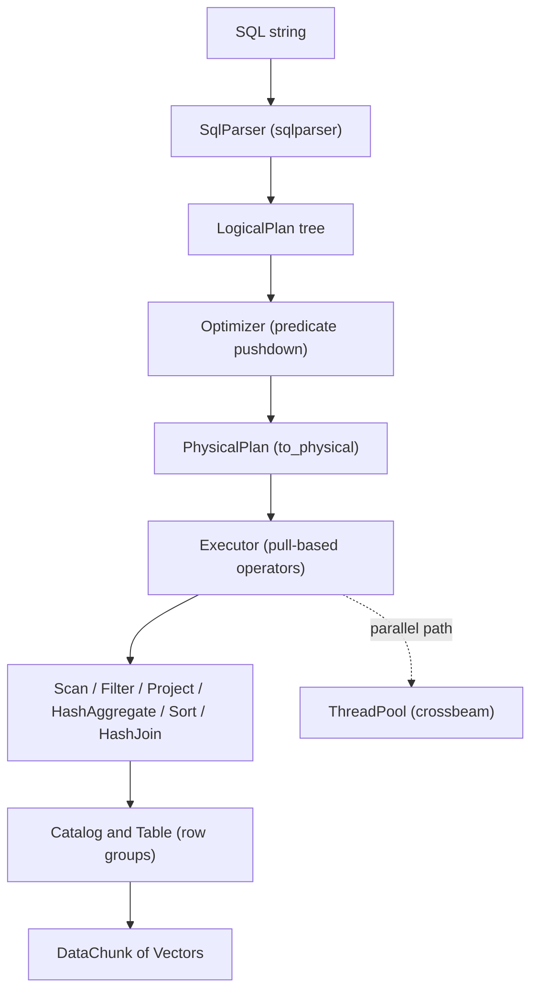

# Columnar Query Engine

A from-scratch in-memory analytical query engine in Rust, modeled on DuckDB. It stores
data column-by-column, parses SQL into logical and physical plans, and runs queries with a
vectorized, pull-based operator pipeline (batches of `VECTOR_SIZE` = 2048 tuples).

## Features

- **Columnar storage** — tables hold row groups of per-column `ColumnChunk`s with a validity
  bitmap and min/max/null statistics (`storage::Table`, `RowGroup`, `ColumnStats`).
- **Typed value system** — 18 `DataType` variants (integers, floats, decimal, date/timestamp,
  string, binary, list, struct) backed by a tagged `Value` enum (`types::DataType` / `Value`).
- **Vectorized batches** — `Vector` and `DataChunk` carry typed column data plus a `bitvec`
  null mask, with `slice`, `filter`, and constant/dictionary encodings (`vector`).
- **SQL front end** — `SqlParser` turns SQL into a `LogicalPlan` tree using the `sqlparser`
  crate: projections, filters, joins, GROUP BY, ORDER BY, LIMIT, DISTINCT, UNION, VALUES.
- **Expression evaluation** — vectorized binary/unary ops, CASE, CAST, IN, BETWEEN, LIKE
  (regex-compiled), IS NULL, and scalar functions (ABS, UPPER, LOWER, LENGTH, COALESCE).
- **Logical and physical plans** — `LogicalPlan` and `PhysicalPlan` enums with a rule-based
  `Optimizer` (predicate pushdown) and `to_physical` lowering (`plan`).
- **Pull-based operators** — `Operator` trait with scan, filter, project, hash aggregate,
  sort, limit, hash join, union, and distinct implementations (`executor`).
- **Aggregation** — `Accumulator` for COUNT, SUM, AVG, MIN, MAX, FIRST, LAST over hash groups.
- **Parallel execution** — a `crossbeam`-channel `ThreadPool` driving partitioned parallel
  scan and partitioned hash aggregate, plus a `CostBasedOptimizer` (`parallel`).

## Architecture



| Component | Module | Responsibility |
|-----------|--------|----------------|
| Types | `types` | `DataType`, `Value`, `Schema`, `Column`, join/sort/aggregate enums |
| Vectors | `vector` | `Vector`, `VectorData`, `DataChunk`, `SelectionVector` |
| Storage | `storage` | `Catalog`, `Table`, `RowGroup`, `ColumnChunk`, encode/decode |
| Expressions | `expression` | `Expression` tree and vectorized evaluation |
| Plans | `plan` | `LogicalPlan`, `PhysicalPlan`, `Optimizer` |
| Parser | `parser` | `SqlParser` SQL-to-`LogicalPlan` lowering |
| Executor | `executor` | `Operator` trait and operator implementations |
| Parallel | `parallel` | `ThreadPool`, parallel operators, `CostBasedOptimizer` |

## Quick Start

### Prerequisites

- Rust 1.70+ (`cargo`). No external services are needed; the engine is fully in-process.

### Installation

```bash
cargo build
```

### Running

This crate is a library. Drive it from a test or a small binary:

```bash
cargo test
```

## Usage

Build a table, then execute a physical plan through the `Executor`:

```rust
use columnar_query_engine::executor::Executor;
use columnar_query_engine::plan::PhysicalPlan;
use columnar_query_engine::storage::{Catalog, StorageConfig};
use columnar_query_engine::types::{Column, DataType, Value};
use columnar_query_engine::vector::{DataChunk, Vector};
use std::sync::Arc;

let catalog = Arc::new(Catalog::new());
let schema = columnar_query_engine::types::Schema::new(vec![
    Column::new("id", DataType::Int64, false),
    Column::new("amount", DataType::Float64, false),
]);
let table = catalog
    .create_table("sales", schema, StorageConfig::default())
    .unwrap();

let mut ids = Vector::new(DataType::Int64);
let mut amounts = Vector::new(DataType::Float64);
for (i, a) in [(1i64, 150.0f64), (2, 89.99), (3, 450.0)] {
    ids.push(Value::Int64(i)).unwrap();
    amounts.push(Value::Float64(a)).unwrap();
}
table.insert(DataChunk::new(vec![ids, amounts])).unwrap();

let executor = Executor::new(catalog);
let plan = PhysicalPlan::SeqScan {
    table_name: "sales".to_string(),
    projection: vec![0, 1],
    filter: None,
};
let chunks = executor.collect(&plan).unwrap();
let rows: usize = chunks.iter().map(|c| c.len()).sum();
assert_eq!(rows, 3);
```

To parse SQL into a logical plan, register schemas in the catalog and call `SqlParser::parse`:

```rust
use columnar_query_engine::parser::SqlParser;

let parser = SqlParser::new(&catalog);
let logical = parser.parse("SELECT id, amount FROM sales WHERE amount > 100").unwrap();
```

## What's Real vs Simulated

- **Real:** columnar storage with encode/decode and statistics, the typed `Value`/`Vector`
  system, vectorized expression evaluation, the SQL parser and logical/physical plan trees,
  predicate pushdown, and the executor's scan, filter, project, hash aggregate, sort, limit,
  hash join, union, and distinct operators. The `ThreadPool` and parallel scan/aggregate run
  on real OS threads. All exercised by the test suite.
- **Simulated / simplified:** column encoding always uses `Encoding::Plain` (the RLE/dictionary/
  delta/bit-packing variants are declared but not applied on write); the optimizer's
  projection pushdown and join reordering are placeholders; the SQL planner maps join keys to
  fixed indices rather than resolving them; outer-join null padding is not emitted; and
  `benches/benchmarks.rs` is a placeholder, so this README states no throughput numbers.

## Testing

```bash
cargo test
```

The suite covers vectors and storage encode/decode, expression evaluation, individual
operators, the SQL parser, and end-to-end queries over a sample orders database
(`tests/integration_tests.rs`). A few integration cases are marked `#[ignore]` for known
pre-existing aggregate type-mismatch behavior. No external services are required.

## Project Structure

```
17-columnar-query-engine/
  src/
    types.rs        # DataType, Value, Schema, enums
    vector.rs       # Vector, DataChunk, SelectionVector
    storage.rs      # Catalog, Table, RowGroup, encode/decode
    expression.rs   # Expression tree and evaluation
    plan.rs         # LogicalPlan, PhysicalPlan, Optimizer
    parser.rs       # SqlParser
    executor.rs     # Operator trait and operators
    parallel.rs     # ThreadPool, parallel operators, CostBasedOptimizer
    lib.rs          # Error type, Result, VECTOR_SIZE
  tests/            # vector, storage, expression, executor, integration tests
  benches/          # criterion harness (placeholder)
  docs/
    BLUEPRINT.md    # full design document
```

## License

MIT — see [LICENSE](../LICENSE)
