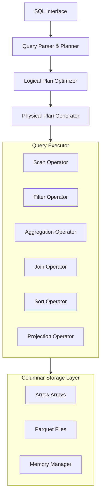

# Columnar Query Engine Architecture

## Overview

A high-performance columnar query engine inspired by DuckDB, built in Rust using Apache Arrow for efficient analytical query processing.

## Architecture Components



## Core Components

### 1. Storage Layer (`src/storage.rs`)
- **Columnar Format**: Uses Apache Arrow for in-memory columnar storage
- **Compression**: Supports dictionary encoding, RLE, and bit-packing
- **Parquet Integration**: Native Parquet file format support
- **Memory Management**: Efficient memory pooling and buffer management

### 2. Expression Engine (`src/expression.rs`)
- **Expression Evaluation**: Vectorized expression evaluation
- **Type System**: Strong typing with Arrow DataTypes
- **Operators**: Arithmetic, comparison, logical, and string operations
- **Functions**: Built-in scalar and aggregate functions

### 3. Query Planner (`src/plan.rs`)
- **Logical Planning**: SQL to logical plan transformation
- **Optimization Rules**: Predicate pushdown, projection pruning, join reordering
- **Physical Planning**: Logical to physical plan conversion
- **Cost Model**: Statistics-based query optimization

### 4. Query Executor (`src/executor.rs`)
- **Vectorized Execution**: Batch-oriented processing
- **Pipeline Parallelism**: Multi-threaded execution
- **Operator Implementation**: Scan, filter, project, join, aggregate, sort
- **Memory Spilling**: Graceful handling of memory pressure

### 5. Vector Operations (`src/vector.rs`)
- **SIMD Operations**: Hardware-accelerated vector processing
- **Columnar Algorithms**: Optimized for cache efficiency
- **Null Handling**: Efficient bitmap-based null processing

### 6. Type System (`src/types.rs`)
- **Data Types**: Comprehensive type support (numeric, string, temporal, nested)
- **Schema Management**: Dynamic and static schema support
- **Type Coercion**: Automatic type conversion rules

## Query Processing Pipeline

### 1. Parse Phase
```
SQL Query → Tokenizer → Parser → AST
```

### 2. Plan Phase
```
AST → Logical Plan → Optimizer → Optimized Logical Plan
```

### 3. Execute Phase
```
Logical Plan → Physical Plan → Executor → Result Set
```

## Key Design Decisions

### Columnar Storage
- **Advantages**: Better compression, cache efficiency, vectorization
- **Trade-offs**: Higher insert cost, better for analytical workloads

### Apache Arrow
- **Zero-copy**: Efficient data sharing between processes
- **Standardized**: Industry-standard columnar format
- **Ecosystem**: Rich ecosystem of tools and libraries

### Vectorized Execution
- **Batch Processing**: Process multiple rows at once
- **CPU Efficiency**: Better instruction and data cache utilization
- **SIMD**: Leverage modern CPU vector instructions

## Performance Optimizations

### 1. Predicate Pushdown
Push filters close to data source to reduce I/O

### 2. Projection Pruning
Only read columns that are actually needed

### 3. Join Optimization
- Hash joins for equi-joins
- Sort-merge joins for large datasets
- Broadcast joins for small dimension tables

### 4. Aggregation Strategies
- Hash aggregation for high-cardinality
- Sort aggregation for pre-sorted data
- Partial aggregation for distributed processing

### 5. Compression
- Dictionary encoding for low-cardinality columns
- Run-length encoding for sorted columns
- Bit-packing for boolean and small integers

## Scalability Features

### Horizontal Scaling
- Partition-aware query planning
- Distributed query execution
- Result set merging

### Vertical Scaling
- Multi-core parallelism
- NUMA-aware memory allocation
- Adaptive query execution

