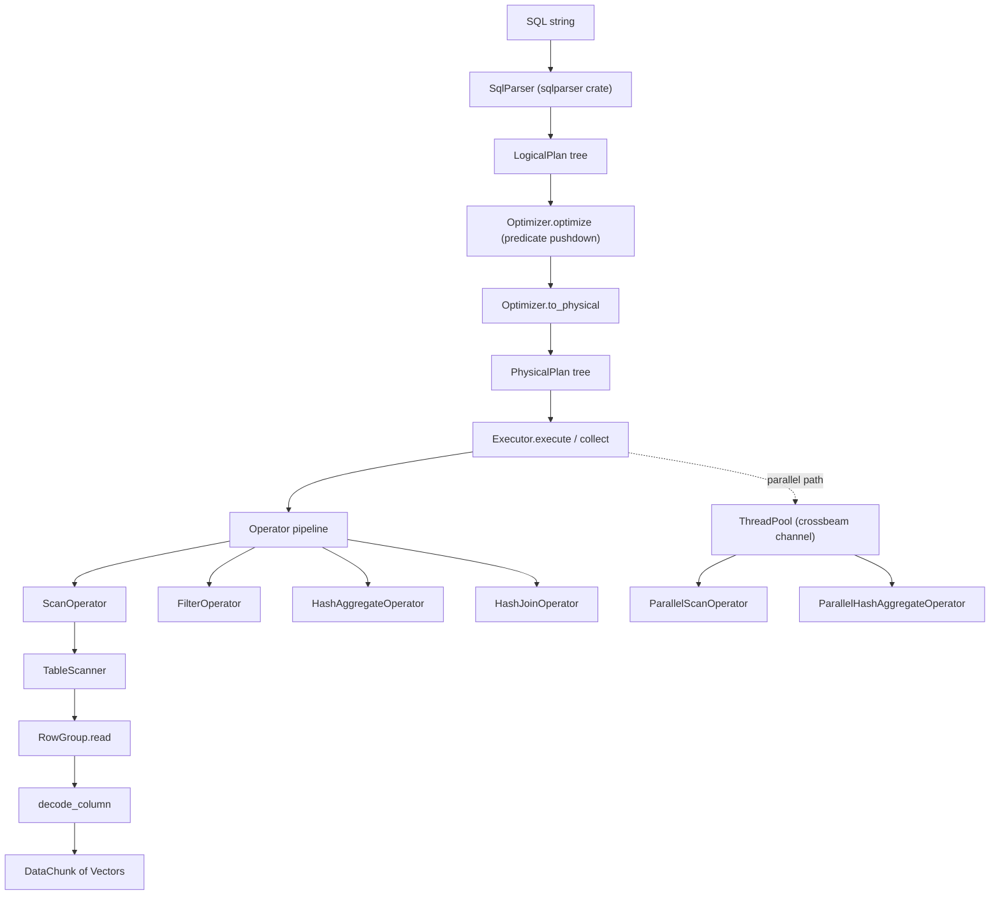

# Columnar Query Engine

## Overview

This project is a from-scratch in-memory analytical (OLAP) query engine written in Rust,
modeled on DuckDB. It demonstrates the full path a query takes inside a column-store database:
SQL text is parsed into a logical plan, the logical plan is optimized and lowered to a physical
plan, and the physical plan is executed by a pull-based pipeline of vectorized operators that
read column-oriented batches out of an in-memory catalog of tables.

The engine is built around three ideas that distinguish analytical databases from row-oriented
OLTP systems:

- **Columnar layout.** Data is stored column-by-column rather than row-by-row. A `Table` is a
  list of `RowGroup`s, and each row group holds one `ColumnChunk` per column. Scanning a query
  that touches three columns out of twenty only materializes those three columns.
- **Vectorized execution.** Operators do not process one tuple at a time. They process
  `DataChunk`s — batches of up to `VECTOR_SIZE` (2048) values per column — so that per-tuple
  interpreter overhead is amortized across a whole batch and inner loops stay cache-friendly.
- **Plan-based evaluation.** A query is compiled into an explicit tree of plan nodes. The same
  logical shape can be lowered to different physical strategies (sequential vs. parallel scan,
  hash vs. merge join), and a cost model can choose between them.

The concepts this project teaches are: columnar storage and encoding, null handling with
validity bitmaps, the Volcano/pull execution model in its vectorized form, relational algebra
as a plan tree, rule-based and cost-based optimization, hash aggregation and hash join, and
partitioned parallelism with a thread pool.

Scope: the engine runs entirely in process against in-memory tables. There is no disk format,
no transactions, and no network layer. It targets read-mostly analytical queries — scans,
filters, projections, aggregations, joins, sorts, and limits — not point lookups or updates.

## Architecture



The system is layered so that each layer depends only on the ones below it:

- **Type layer (`types`).** The vocabulary every other module speaks: `DataType` (the static
  type of a column), `Value` (a single dynamic scalar), `Schema`/`Column` (table shape), and the
  small enums `SortOrder`, `JoinType`, and `AggregateFunction`.
- **Vector layer (`vector`).** The physical representation of a batch. A `Vector` is a typed,
  contiguous column with a validity bitmap; a `DataChunk` is a set of vectors of equal length.
- **Storage layer (`storage`).** The catalog of named tables. Each table owns row groups of
  encoded column chunks plus column statistics, and exposes a `TableScanner` that yields
  `DataChunk`s.
- **Expression layer (`expression`).** The `Expression` tree and its vectorized `evaluate`,
  which turns an expression plus an input `DataChunk` into an output `Vector`.
- **Plan layer (`plan`).** `LogicalPlan` (relational algebra), `PhysicalPlan` (execution
  strategy), and the `Optimizer` that rewrites and lowers between them.
- **Parser layer (`parser`).** `SqlParser`, which uses the `sqlparser` crate's AST and builds
  a `LogicalPlan`, resolving table names against the catalog's schemas.
- **Execution layer (`executor`).** The `Operator` trait and its implementations, plus the
  `Executor` that walks a `PhysicalPlan` and wires operators together into a pipeline.
- **Parallel layer (`parallel`).** A `ThreadPool`, partitioned parallel operators, and a
  `CostBasedOptimizer` with a configurable cost model.

A query flows top to bottom: SQL → AST → `LogicalPlan` → optimized `LogicalPlan` →
`PhysicalPlan` → an `Operator` tree → repeated `next()` calls that pull `DataChunk`s up from
the storage layer.

To make the flow concrete, consider `SELECT category, SUM(amount) FROM sales WHERE amount > 100
GROUP BY category ORDER BY 2 DESC`. The parser builds a `LogicalPlan` of
`Sort(Projection(Aggregate(Filter(Scan(sales)))))`. The optimizer's predicate-pushdown rule folds
the `Filter` into the `Scan`, so the scan itself carries `amount > 100`. `to_physical` lowers the
tree to `Sort(Project(HashAggregate(SeqScan)))` — or, if `sales` is registered with a large row
count and parallelism is enabled, to a `ParallelHashAggregate` over a `ParallelScan`. At
execution time the root `SortOperator` pulls from the `ProjectOperator`, which pulls from the
`HashAggregateOperator`, which drains its child (the scan) completely to build per-category
accumulators before emitting grouped rows; the sort then materializes and orders those rows. Data
never flows the other way: every `next()` call pulls exactly one `DataChunk` up the tree.

## Core Components

Errors flow through a single crate-level `Error` enum (`Type`, `InvalidOperation`,
`ColumnNotFound`, `TableNotFound`, `Parse`, `Execution`, and an `Io` variant that wraps
`std::io::Error`) with a `Result<T>` alias, both defined in `lib.rs` alongside the
`VECTOR_SIZE` constant. Every fallible operation — pushing a mismatched value into a vector,
referencing a missing column, parsing invalid SQL, evaluating an unsupported expression — returns
`Err(Error::...)` rather than panicking, so failures surface as values the caller can match on.
This is the Rust idiom the style guide calls for, and it keeps the engine composable: an operator
that encounters a bad chunk propagates the error up the pull chain instead of aborting the process.

### Type system (`types`)

`DataType` enumerates the static column types: `Boolean`; signed and unsigned integers from 8 to
64 bits; `Float32`/`Float64`; `String`; `Binary`; `Date` (days since epoch) and `Timestamp`
(microseconds since epoch); `Decimal { precision, scale }`; and the nested `List(Box<DataType>)`
and `Struct(Vec<(String, DataType)>)`. `DataType::size` returns the in-memory width of a value,
`is_numeric` and `is_integer` classify types for arithmetic, and `Display` renders SQL-style
names (`VARCHAR`, `BIGINT`-style `INT64`, `DECIMAL(p,s)`).

`Value` is the dynamic counterpart — one variant per type plus `Null`. It carries helpers used
throughout evaluation: `data_type()`, `is_null()`, and the lossy converters `as_i64()` and
`as_f64()`. Equality and ordering are implemented for the common comparable variants (boolean,
int64, float64, string); other combinations compare as not-equal / unordered, which the
operators treat conservatively.

`Schema` is an ordered list of `Column`s (name, `DataType`, nullable). It offers lookups by name
and index (`column`, `column_index`, `get_column_type`), construction from `(name, type)` pairs,
and `merge` for combining the left and right schemas of a join.

Three small enums round out the type layer and recur throughout the plan and execution code.
`SortOrder` is `Ascending`/`Descending` and drives the comparator in the sort operator and the
parser's ORDER BY lowering. `JoinType` enumerates `Inner`, `Left`, `Right`, `Full`, `Cross`,
`Semi`, and `Anti`; the parser maps SQL join syntax onto these, and the hash-join operator branches
on them (with outer/semi/anti padding currently simplified to inner behavior for unmatched rows).
`AggregateFunction` is `Count`, `Sum`, `Avg`, `Min`, `Max`, `First`, `Last`, and it is the value
that `Accumulator::new` switches on to construct the right accumulator. Keeping these as dedicated
enums rather than strings means the parser validates them once (an unknown function name simply is
not recognized as an aggregate) and every downstream match is exhaustive and compiler-checked.

### Vectors and chunks (`vector`)

`Vector` is the workhorse physical type. It stores a `DataType`, a length, a `BitVec<u64, Lsb0>`
validity bitmap (one bit per slot, set means non-null), and a `VectorData` payload. `VectorData`
has a dedicated `Vec<T>` for each primitive type, plus three logical encodings:

- `Constant(Box<Value>)` — a single value logically replicated `len` times, produced when an
  expression evaluates to a literal.
- `Dictionary { indices, dictionary }` — small integer indices into a shared dictionary vector.
- The flat per-type vectors for everything materialized.

Key operations: `push` appends a `Value` (updating the validity bit and coercing date/timestamp/
decimal into their backing integer/float storage), `get` reads a `Value` back (re-tagging the
backing storage to the logical type and following dictionary indices), `slice` produces a
zero-copy-ish window, and `filter` gathers a subset by index. Typed accessors `as_i64_slice`,
`as_f64_slice`, and `as_string_slice` expose the raw backing storage for tight loops.

A subtlety in `push`/`get` is the date/timestamp/decimal coercion. There is no separate physical
storage for `Date`, `Timestamp`, or `Decimal`: dates and timestamps live in the `Int32`/`Int64`
backing vectors (days/microseconds since epoch), and decimals live in `Float64`. `push` matches on
the `(VectorData, Value)` pair and routes `Value::Date(d)` into the int32 vector, `Value::Timestamp(t)`
into the int64 vector, and `Value::Decimal(d)` into the float64 vector. `get` performs the inverse:
it inspects the vector's logical `data_type` and re-tags the backing storage, so a vector declared
`DataType::Date` returns `Value::Date` even though the bytes sit in an `Int32` array. This keeps the
hot value arrays primitive and densely packed while preserving the logical type at the boundary.

`DataChunk` bundles one `Vector` per column with a shared row count. It supports `slice`,
`filter` (apply a selection to every column), and `append` (concatenate another chunk row by
row). This is the unit of data that flows between operators.

`SelectionVector` is a list of selected row indices, used to represent the result of a predicate
without copying the underlying data until materialization is required.

### Storage engine (`storage`)

The catalog is the top of the storage layer. `Catalog` maps table names to `Arc<Table>` under a
`parking_lot::RwLock`, with `create_table`, `get_table`, `drop_table`, `list_tables`,
`get_table_schema`, and `register_schema` (used by the parser to declare a table's shape without
inserting data).

A `Table` owns its `Schema`, a `RwLock<Vec<Arc<RowGroup>>>`, a running row count, and a
`StorageConfig` (row-group size, whether to compute statistics, a compression flag). `insert`
takes a `DataChunk`, builds a `RowGroup` by encoding each vector into a `ColumnChunk`, and
appends it. `scan`/`scan_all` return a `TableScanner`.

Each `ColumnChunk` records its column index, data type, encoded bytes, value count, null count,
optional `ColumnStats` (min, max, null count, optional distinct count), and an `Encoding` tag.
`encode_column` serializes a vector: it writes the validity bitmap length-prefixed, then the
values. Primitive types (int64, float64, int32, boolean, string) get specialized little-endian
encoders; anything else falls back to length-prefixed JSON. `decode_column` reverses this,
reconstructing a `Vector` and re-tagging int32/int64 storage as date/timestamp where the column
type demands it. `compute_stats` walks a vector once to find min/max and the null count.

`TableScanner` is a stateful iterator over a table's row groups. `next_batch(batch_size)` reads
the current row group's projected columns into a `DataChunk` and slices out the next `batch_size`
rows, advancing across row group boundaries. The `Iterator` impl yields `VECTOR_SIZE`-row
batches, which is what the scan operator consumes.

Concurrency is handled with `parking_lot` locks and `Arc` sharing rather than a bespoke
transaction manager. The catalog's table map sits behind an `RwLock`, each table's row-group
vector and row count behind their own `RwLock`s, and row groups are stored as `Arc<RowGroup>` so a
scanner can clone the current snapshot of row groups (`table.row_groups.read().clone()`) and read
from it without holding the table lock for the duration of the scan. This gives a simple
multiple-reader / single-writer story: inserts take the write locks briefly to append a new row
group, while concurrent scans operate over the `Arc` snapshot they captured at creation. There is
no isolation level beyond this snapshot-at-scan-start behavior, which is appropriate for the
read-mostly analytical workload the engine targets.

The on-disk-style byte layout of a `ColumnChunk`'s `data` field is deliberately simple. The
validity bitmap is written first as a length-prefixed run of one byte per slot (a `1`/`0` flag),
then the values follow in a type-specific encoding:

```text
ColumnChunk.data layout (Encoding::Plain)
+-----------------------------+------------------------------------------+
| validity_len: u32 (LE)      | validity bytes: [u8; validity_len]       |
+-----------------------------+------------------------------------------+
| values (one of):                                                       |
|   Int64/Timestamp : [i64 LE; n]                                        |
|   Float64         : [f64 LE; n]                                        |
|   Int32/Date      : [i32 LE; n]                                        |
|   Boolean         : [u8; n]                                            |
|   String          : repeated { len: u32 LE, bytes: [u8; len] }        |
|   fallback        : repeated { len: u32 LE, json: [u8; len] }          |
+------------------------------------------------------------------------+
```

The `Encoding` enum declares `Plain`, `Rle`, `Dictionary`, `Delta`, and `BitPacked`, but
`encode_column` always tags chunks `Plain` and emits the layout above; the other variants are
present so the design can grow without changing the chunk type. Null slots still occupy a value
slot (written as a zero / empty placeholder) so that value offsets stay aligned with the validity
bitmap during decode.

### Expressions (`expression`)

`Expression` is a recursive tree covering everything a SELECT list or predicate can contain:
`ColumnRef(index)` and `ColumnName(name)`; `Literal(Value)`; `BinaryOp`/`UnaryOp`; scalar
`Function`; `Aggregate`; `Case`; `Cast`; `IsNull`/`IsNotNull`; `InList`; `Between`; `Like`;
`Sort`; and `Wildcard`.

The heart of the module is `evaluate(&DataChunk) -> Result<Vector>`. It is vectorized: each
expression node produces an entire output column. `BinaryOp` evaluates both sides to vectors and
dispatches to `evaluate_binary_op`, which handles arithmetic (promoting to `Float64` and
producing `NaN` on divide-by-zero), the six comparisons (producing a boolean vector with
SQL null propagation), three-valued `And`/`Or`, and string `Concat`. `UnaryOp` handles `Not`,
`Negate`, `BitwiseNot`, and unary `Plus`. `IsNull`/`IsNotNull` read the validity bitmap.
`Cast` walks `cast_value`, which converts between string, int64, float64, and boolean. `Case`
supports both simple (operand-compared) and searched (boolean-WHEN) forms. `Like` compiles the
SQL pattern into a regex via `like_to_regex` (translating `%`→`.*`, `_`→`.`, and escaping regex
metacharacters). The scalar `Function` path implements `ABS`, `UPPER`, `LOWER`, `LENGTH`, and
`COALESCE`.

The expression vocabulary, as implemented end to end (parser → tree → evaluation):

```text
Binary ops:  + - * /  (arithmetic, → Float64, /0 → NaN)
             = != < <= > >=  (comparison, → Boolean, null-propagating)
             AND OR  (three-valued logic)
             || (Concat, → String)
Unary ops:   NOT (Boolean), - (Negate, → Float64), ~ (BitwiseNot, → Int64), + (Plus)
Predicates:  IS NULL / IS NOT NULL, IN (list), BETWEEN lo AND hi, LIKE pattern
Control:     CASE (simple and searched), CAST(expr AS type)
Scalar fns:  ABS, UPPER, LOWER, LENGTH, COALESCE
Aggregates:  COUNT, SUM, AVG, MIN, MAX, FIRST, LAST
```

Each row of this table corresponds to a concrete arm in `Expression::evaluate` (or, for
aggregates, in `Accumulator`), so the documented surface and the implemented surface are the same
set. Anything outside it — window functions, subquery expressions, user-defined functions — is
rejected at parse time or returns an `InvalidOperation` error during evaluation rather than
silently producing wrong results.

`Expression::data_type` computes the static output type given the input column types, used by
the planner for schema inference. `binary_op_result_type` and `unary_op_result_type` encode the
type rules (arithmetic → `Float64`, comparisons/logic → `Boolean`, concat → `String`).

Two evaluation details are worth calling out because they shape the rest of the engine. First,
**null propagation is three-valued**: a comparison or arithmetic op with a null operand produces
a null result, and `And`/`Or` short-circuit on the dominant value (`false AND null` is `false`,
`true OR null` is `true`) but otherwise yield null. Second, **literals become constant vectors**:
`Expression::Literal` evaluates to `Vector::constant(value, chunk.len())`, so a predicate like
`amount > 100` evaluates the right side once and replicates it logically rather than allocating a
full column. Because `evaluate_binary_op` clamps the index with `i.min(left.len() - 1)`, a
constant vector of logical length transparently lines up against a flat vector of real length.

### Plans and the optimizer (`plan`)

`LogicalPlan` is relational algebra: `Scan`, `Filter`, `Projection`, `Aggregate`, `Sort`,
`Limit`, `Join`, `Union`, `Distinct`, `Values`, `Subquery`, and `Empty`. Each node carries the
schema it produces (or borrows its child's), and the enum offers `schema()`, `children()`, and a
`transform` combinator that applies a closure bottom-up across the tree — the mechanism the
optimizer rules use to rewrite plans.

`PhysicalPlan` is the executable counterpart and is richer because it names concrete strategies:
`SeqScan` and `ParallelScan`; `IndexScan` (declared); `Filter`; `Project`; `HashAggregate`,
`ParallelHashAggregate`, and `SortAggregate`; `Sort` and `TopN`; `Limit`; `HashJoin`,
`NestedLoopJoin`, and `MergeJoin`; `UnionAll`; `HashDistinct`; `Values`; and `Empty`. It exposes
`children()` and `estimate_cost()`, a coarse heuristic cost (a sequential scan costs 1000 units,
a parallel scan divides that by its partition count, a nested-loop join multiplies child costs,
and so on).

`Optimizer` holds rule toggles (`predicate_pushdown`, `projection_pushdown`, `join_reorder`),
parallelism settings (`enable_parallel`, `parallel_threshold`, `num_partitions` defaulting to
`num_cpus::get()`), and a map of table row counts for cost-based decisions. `optimize` runs the
enabled rewrite rules; `push_down_predicates` uses `transform` to fold a `Filter` directly into
the `Scan` beneath it (combining with any existing scan filter via `And`). `to_physical` lowers a
logical plan into a physical one, and it is here that the cost-based parallelism decision is made:
`estimate_input_rows` propagates cardinality estimates through the tree, and when the estimate
exceeds `parallel_threshold` a scan or aggregate is lowered to its parallel variant.

`estimate_input_rows` is a small but illustrative cardinality model. A scan reports its
registered row count (default 1000), reduced by a fixed 10% selectivity when a filter is present.
A `Filter` node applies the same 10% selectivity to its child. An `Aggregate` collapses to one
row when there is no GROUP BY, otherwise to roughly 10% of its input (an assumed group count). A
`Join` multiplies child cardinalities and applies 10% selectivity; a `Limit` reports its limit
value; a `Distinct` halves its input. These are deliberately coarse heuristics — the point is to
make a binary parallel/sequential decision, not to drive a full cascades-style search.
`push_down_projections` and the `join_reorder` rule are present as toggles but currently return
their input unchanged; the real cost-based join reordering lives in `CostBasedOptimizer`.

### SQL-to-plan lowering (`parser`)

`SqlParser` borrows a `Catalog` so it can resolve table names to schemas. `parse` runs the
`sqlparser` crate's `Parser` with a `GenericDialect`, rejects empty or multi-statement input, and
dispatches on the statement: only `Statement::Query` is supported. `plan_query` handles the query
body, then wraps it in `Sort` (for ORDER BY, mapping ASC/DESC and NULLS FIRST/LAST) and `Limit`
(for LIMIT/OFFSET) nodes. `plan_select` assembles a select in the canonical relational order:
FROM (`plan_from` / `plan_table_with_joins`), then WHERE → `Filter`, then GROUP BY/aggregates →
`Aggregate`, then HAVING → `Filter`, then the projection list → `Projection`, then DISTINCT →
`Distinct`.

Several helpers do the AST translation: `plan_expr` maps `sqlparser` expressions onto the
`Expression` tree (identifiers become `ColumnName`, binary/unary ops are translated operator by
operator, functions are split into aggregates vs. scalar functions, and CASE/CAST/IN/BETWEEN/LIKE
each get their own arm); `plan_value` converts literals (numbers with a `.` become `Float64`,
otherwise `Int64`); `plan_join_operator` maps inner/left/right/full/cross/semi/anti joins, while
`NATURAL` and `USING` are rejected; and `plan_data_type` maps SQL type names onto `DataType`.
Schema inference for projections and aggregates runs through `infer_type`, which mirrors the
expression type rules so the resulting `LogicalPlan` carries an accurate output schema.

### Executor and operators (`executor`)

The `Executor` walks a `PhysicalPlan` and builds a tree of boxed `Operator` trait objects.
`Operator` has a single required method, `next(&mut self) -> Result<Option<DataChunk>>`, plus an
optional `reset`. This is the vectorized Volcano model: a chunk is pulled from the root, which
pulls from its children, all the way down to a `ScanOperator` that drives a `TableScanner`.
`collect` repeatedly calls `next()` and gathers every chunk.

The `Executor` itself is small: it holds an `Arc<Catalog>`, an optional `Arc<ThreadPool>`, and a
`ParallelConfig`. `Executor::new` builds a sequential executor; `Executor::with_parallelism`
additionally spins up the thread pool. `execute` is a recursive match over `PhysicalPlan` variants
that constructs the corresponding operator and recursively executes child plans to obtain their
operators — so the operator tree's shape exactly mirrors the physical plan's shape. The parallel
variants (`ParallelScan`, `ParallelHashAggregate`) are handled specially: their operator is
constructed and then, if a thread pool is present, `execute_parallel(pool)` is invoked eagerly so
the heavy work happens before the first `next()` call drains the buffered results.

The operators:

- **`ScanOperator`** wraps a `TableScanner` and an optional pushed-down filter, applying the
  predicate to each scanned chunk and emitting only the surviving rows.
- **`FilterOperator`** evaluates a predicate against each child chunk and emits the selected rows,
  skipping empty results.
- **`ProjectOperator`** evaluates each projection expression to a vector and assembles a new chunk.
- **`HashAggregateOperator`** consumes the entire input, hashing each row's group-by values
  (serialized with `serde_json` as the key) into a `HashMap` of `AggregateState`. Each group
  holds one `Accumulator` per aggregate. After input is exhausted it emits one row per group; with
  no GROUP BY it emits a single row of initial accumulator values.
- **`SortOperator`** materializes all input, builds `(sort_keys, chunk_idx, row_idx)` tuples,
  sorts them with SQL null-ordering semantics (nulls-first/last per column, ascending/descending),
  and rebuilds chunks in sorted order. The comparator walks the `order_by` columns in priority
  order, returning at the first non-equal column; nulls are ordered explicitly (a `Value::Null`
  compares less or greater than a non-null depending on the column's `nulls_first` flag), and
  `Descending` reverses the per-column ordering. Because the keys are extracted once into a flat
  `Vec` and the row positions are sorted indirectly, the underlying chunk data is touched only
  during the final rebuild pass.
- **`LimitOperator`** applies OFFSET then LIMIT by slicing chunks as they pass through.
- **`HashJoinOperator`** builds a hash table from the left (build) side keyed on the join keys,
  then probes with the right side, emitting combined rows and applying any residual condition.
- **`UnionOperator`**, **`DistinctOperator`** (hash-set dedup), **`ValuesOperator`** (inline
  literals), and **`EmptyOperator`** round out the set.

`Accumulator` is the aggregate state machine: `Count(i64)`, `Sum(f64)`, `Avg { sum, count }`,
`Min`/`Max`/`First`/`Last(Option<Value>)`. `new` constructs the initial state for an
`AggregateFunction`, `update` folds in a value (skipping nulls), and `finalize` produces the
result `Value` (AVG of an empty group yields `Null`).

The `Operator` contract is a pull (demand-driven) interface: `next()` returns `Ok(Some(chunk))`
while data remains, `Ok(None)` at end of stream, and `Err(..)` on failure. Operators fall into two
classes. **Streaming operators** — scan, filter, project, limit — produce output incrementally and
hold little state; they call their child's `next()`, transform the chunk, and return it. They are
the operators that keep memory bounded regardless of input size. **Pipeline-breaking operators** —
hash aggregate, sort, hash join build side, distinct — must consume their entire input before they
can emit anything, so they buffer state (a hash map, a vector of rows) on the first `next()` call
and then drain it on subsequent calls. The `ScanOperator` blends in optional filter pushdown: when
the scan carries a predicate, it evaluates it against each freshly scanned chunk and recurses to
the next chunk if the whole batch is filtered out, so an empty selection never propagates upward.

The hash-aggregate group key deserves a note. `HashAggregateOperator::hash_group` serializes the
group-by `Value`s with `serde_json::to_vec` and uses the resulting bytes as the `HashMap` key.
This is simple and correct — equal logical groups serialize identically — but it allocates a
`Vec<u8>` per row, which is the dominant cost in aggregation. The same approach keys the
`HashJoinOperator`'s build-side table and the `DistinctOperator`'s seen-set. The build phase of
the hash join stores each left row as a one-row `DataChunk` under its key, and the probe phase
concatenates the matched left chunk with the current right row; the residual `condition`, if any,
is evaluated on the combined row and filters non-matches. Outer-join semantics (emitting padded
nulls for unmatched rows) are stubbed — left/full joins currently behave like inner joins for
unmatched probe rows.

### Parallel execution and cost model (`parallel`)

`ThreadPool` spawns a fixed set of worker threads that pull boxed closures from an unbounded
`crossbeam_channel`. Workers poll with a timeout so they can observe a shutdown flag; `Drop`
sets the flag and joins every worker. `ParallelConfig` controls thread count, the parallel
threshold, and the work batch size.

`ParallelScanOperator` creates one `TableScanner` per partition and, in `execute_parallel`,
submits each scanner to the pool as a task that scans, applies the filter, and pushes surviving
chunks into a shared `Mutex<Vec<DataChunk>>`; an atomic counter lets the caller wait for all
tasks to finish. `ParallelHashAggregateOperator` partitions group keys across several
`RwLock<HashMap<...>>` partial-state maps, then merges the partials into a final result. Merging
relies on an `AccumulatorMerge` trait that combines two partial accumulators (summing counts and
sums, taking the smaller min / larger max).

`CostBasedOptimizer` carries per-table `TableStats` (row count, per-column NDV and stats, average
row size) and a `CostConfig` of per-operation costs (sequential vs. random page cost, CPU tuple
cost, hash and sort costs, page size). `estimate_cost` returns a `PlanCost` (`startup_cost`,
`total_cost`, `output_rows`) for each physical operator using textbook formulas — e.g. a sort
costs `n · log2(n) · sort_cost`, a hash join sums build and probe costs. `choose_join_algorithm`
builds hash, merge, and nested-loop candidates and picks the cheapest; `reorder_joins` greedily
joins the smallest tables first.

The two-phase parallel aggregate is the most involved parallel path. In phase one the operator
drains its child and, for each row, hashes the group key, picks a partition with
`partition_key` (a multiplicative hash modulo the partition count), and updates that partition's
`RwLock`-guarded partial-state map. Because different keys land in different partitions, the
partition locks rarely contend. In phase two the partials are merged into a single map: when two
partitions hold the same key, their accumulators are combined element-wise through
`AccumulatorMerge` (counts and sums add, mins take the smaller, maxes the larger). Phase three
builds the final `DataChunk`. The design mirrors a real partitioned aggregation, with the
simplification that the merge runs single-threaded after all workers finish rather than as a
parallel reduction tree.

The parallel scan is intentionally simpler and is the clearest example of a teaching shortcut:
`ParallelScanOperator::new` creates `num_partitions` scanners, but each scanner currently iterates
the whole table, so the parallel path demonstrates the thread-pool plumbing and result-collection
pattern rather than a true disjoint partitioning of row groups. The `Operator::next` impl simply
drains the shared result vector that the worker tasks populated.

## Data Structures

The static and dynamic type vocabulary:

```rust
pub enum DataType {
    Boolean,
    Int8, Int16, Int32, Int64,
    UInt8, UInt16, UInt32, UInt64,
    Float32, Float64,
    String, Binary,
    Date, Timestamp,
    Decimal { precision: u8, scale: u8 },
    List(Box<DataType>),
    Struct(Vec<(String, DataType)>),
}

pub enum Value {
    Null,
    Boolean(bool),
    Int8(i8), Int16(i16), Int32(i32), Int64(i64),
    UInt8(u8), UInt16(u16), UInt32(u32), UInt64(u64),
    Float32(f32), Float64(f64),
    String(String), Binary(Vec<u8>),
    Date(i32), Timestamp(i64), Decimal(i128),
    List(Vec<Value>), Struct(Vec<(String, Value)>),
}

pub struct Schema { pub columns: Vec<Column> }
pub struct Column { pub name: String, pub data_type: DataType, pub nullable: bool }
```

The physical batch representation:

```rust
pub struct Vector {
    pub data_type: DataType,
    pub len: usize,
    pub validity: BitVec<u64, Lsb0>,  // bit set = non-null
    pub data: VectorData,
}

pub enum VectorData {
    Boolean(Vec<bool>),
    Int8(Vec<i8>), Int16(Vec<i16>), Int32(Vec<i32>), Int64(Vec<i64>),
    UInt8(Vec<u8>), UInt16(Vec<u16>), UInt32(Vec<u32>), UInt64(Vec<u64>),
    Float32(Vec<f32>), Float64(Vec<f64>),
    String(Vec<String>), Binary(Vec<Vec<u8>>),
    Constant(Box<Value>),
    Dictionary { indices: Vec<u32>, dictionary: Arc<Vector> },
}

pub struct DataChunk { pub vectors: Vec<Vector>, pub len: usize }
```

The storage structures:

```rust
pub struct Table {
    pub name: String,
    pub schema: Schema,
    pub row_groups: RwLock<Vec<Arc<RowGroup>>>,
    pub row_count: RwLock<usize>,
    pub config: StorageConfig,
}

pub struct RowGroup { pub index: usize, pub num_rows: usize, pub columns: Vec<ColumnChunk> }

pub struct ColumnChunk {
    pub column_idx: usize,
    pub data_type: DataType,
    pub data: Vec<u8>,          // encoded bytes (validity + values)
    pub num_values: usize,
    pub null_count: usize,
    pub stats: Option<ColumnStats>,
    pub encoding: Encoding,     // Plain in practice; others declared
}

pub struct ColumnStats {
    pub min: Value,
    pub max: Value,
    pub null_count: usize,
    pub distinct_count: Option<usize>,
}

pub enum Encoding { Plain, Rle, Dictionary, Delta, BitPacked }
```

The plan trees (abbreviated to representative variants):

```rust
pub enum LogicalPlan {
    Scan { table_name: String, projection: Option<Vec<usize>>, filter: Option<Expression>, schema: Schema },
    Filter { input: Arc<LogicalPlan>, predicate: Expression },
    Projection { input: Arc<LogicalPlan>, expressions: Vec<Expression>, schema: Schema },
    Aggregate { input: Arc<LogicalPlan>, group_by: Vec<Expression>,
                aggregates: Vec<(AggregateFunction, Expression, String)>, schema: Schema },
    Sort { input: Arc<LogicalPlan>, order_by: Vec<(Expression, SortOrder, bool)> },
    Limit { input: Arc<LogicalPlan>, limit: usize, offset: usize },
    Join { left: Arc<LogicalPlan>, right: Arc<LogicalPlan>, join_type: JoinType,
           condition: Option<Expression>, schema: Schema },
    Union { left: Arc<LogicalPlan>, right: Arc<LogicalPlan>, all: bool },
    Distinct { input: Arc<LogicalPlan> },
    Values { values: Vec<Vec<Expression>>, schema: Schema },
    Subquery { input: Arc<LogicalPlan>, alias: String },
    Empty { schema: Schema },
}

pub enum PhysicalPlan {
    SeqScan { table_name: String, projection: Vec<usize>, filter: Option<Expression> },
    ParallelScan { table_name: String, projection: Vec<usize>, filter: Option<Expression>, num_partitions: usize },
    Filter { input: Arc<PhysicalPlan>, predicate: Expression },
    Project { input: Arc<PhysicalPlan>, expressions: Vec<Expression> },
    HashAggregate { input: Arc<PhysicalPlan>, group_by: Vec<Expression>,
                    aggregates: Vec<(AggregateFunction, Expression)> },
    ParallelHashAggregate { /* + num_partitions */ },
    Sort { input: Arc<PhysicalPlan>, order_by: Vec<(usize, SortOrder, bool)> },
    Limit { input: Arc<PhysicalPlan>, limit: usize, offset: usize },
    HashJoin { left: Arc<PhysicalPlan>, right: Arc<PhysicalPlan>, join_type: JoinType,
               left_keys: Vec<usize>, right_keys: Vec<usize>, condition: Option<Expression> },
    UnionAll { inputs: Vec<Arc<PhysicalPlan>> },
    HashDistinct { input: Arc<PhysicalPlan> },
    Values { values: Vec<Vec<Expression>> },
    Empty,
    // IndexScan, SortAggregate, TopN, NestedLoopJoin, MergeJoin also declared
}
```

The aggregate accumulator:

```rust
pub enum Accumulator {
    Count(i64),
    Sum(f64),
    Avg { sum: f64, count: i64 },
    Min(Option<Value>),
    Max(Option<Value>),
    First(Option<Value>),
    Last(Option<Value>),
}
```

The configuration and cost types that parameterize storage, parallelism, and cost-based planning:

```rust
pub struct StorageConfig {
    pub row_group_size: usize,   // default 100_000
    pub compression: bool,       // flag only; Plain encoding in practice
    pub statistics: bool,        // compute min/max/null stats on insert
}

pub struct ParallelConfig {
    pub num_threads: usize,          // default num_cpus::get()
    pub parallel_threshold: usize,   // default 10_000 rows
    pub batch_size: usize,           // default VECTOR_SIZE
}

pub struct CostConfig {
    pub seq_page_cost: f64,    pub random_page_cost: f64,
    pub cpu_tuple_cost: f64,   pub hash_cost: f64,
    pub sort_cost: f64,        pub page_size: usize,
}

pub struct PlanCost {
    pub startup_cost: f64,   // cost before first row
    pub total_cost: f64,     // cost to produce all rows
    pub output_rows: f64,    // estimated cardinality
}
```

`StorageConfig` controls how `Table::insert` builds row groups and whether `compute_stats` runs;
`ParallelConfig` is consumed by `Executor::with_parallelism` and the thread pool; and `CostConfig`
/ `PlanCost` are the inputs and outputs of `CostBasedOptimizer::estimate_cost`. All three carry
`Default` implementations so callers can opt into the defaults and override only what they need.

## API Design

The public surface is the set of module exports plus the crate-level `Error`, `Result`, and
`VECTOR_SIZE` from `lib.rs`. There is no SQL "connection" object; callers compose the layers
directly.

Storage and catalog:

```rust
let catalog = Arc::new(Catalog::new());
let table = catalog.create_table(name, schema, StorageConfig::default())?;
table.insert(DataChunk::new(vectors))?;            // append a row group
let mut scanner = table.scan(&[0, 1]);             // projected scan
while let Some(chunk) = scanner.next_batch(2048)? { /* ... */ }
```

Building vectors and chunks:

```rust
let mut v = Vector::new(DataType::Int64);
v.push(Value::Int64(42))?;
let chunk = DataChunk::new(vec![v]);
```

Parsing SQL into a logical plan (table schemas must be registered first):

```rust
let parser = SqlParser::new(&catalog);
let logical: LogicalPlan = parser.parse("SELECT id FROM users WHERE age > 18")?;
```

Optimizing and lowering:

```rust
let optimizer = Optimizer::default();
let optimized = optimizer.optimize(logical);
let physical: PhysicalPlan = optimizer.to_physical(&optimized);
```

Executing:

```rust
let executor = Executor::new(catalog.clone());
let chunks: Vec<DataChunk> = executor.collect(&physical)?;

// or with parallelism
let executor = Executor::with_parallelism(catalog, ParallelConfig::with_threads(4));
```

Evaluating an expression directly against a chunk:

```rust
let pred = Expression::BinaryOp {
    left: Box::new(Expression::ColumnRef(0)),
    op: BinaryOperator::GreaterThan,
    right: Box::new(Expression::Literal(Value::Int64(100))),
};
let mask: Vector = pred.evaluate(&chunk)?;
```

The supported SQL surface, as implemented by the parser, is: `SELECT` with projections,
wildcards, and aliases; `WHERE`; `GROUP BY` with COUNT/SUM/AVG/MIN/MAX/FIRST/LAST and `HAVING`;
`ORDER BY` with ASC/DESC and NULLS FIRST/LAST; `LIMIT`/`OFFSET`; `DISTINCT`; inner/left/right/
full/cross/semi/anti joins via `JOIN ... ON`; `UNION [ALL]`; and `VALUES`. CTEs (`WITH`),
`NATURAL`/`USING` joins, multi-statement input, and non-query statements are explicitly
rejected with parse errors.

## Performance

The engine's performance model rests on the columnar, vectorized design rather than on measured
benchmarks (the Criterion harness in `benches/benchmarks.rs` is a placeholder, so no throughput
or latency numbers are claimed here).

The design choices that drive performance:

- **Projection at scan time.** `TableScanner` reads only the requested column indices, so a query
  over a few columns never touches the rest. `Table::scan(&[..])` takes the projection up front.
- **Batched execution.** `VECTOR_SIZE` is 2048. Operators process a whole `DataChunk` per
  `next()` call, amortizing dispatch overhead and keeping the working set small enough to stay in
  cache. Vectors pre-allocate `VECTOR_SIZE` capacity to avoid reallocation churn.
- **Validity bitmaps.** Nulls are tracked in a packed `BitVec` rather than with sentinel values
  or `Option` per element, so the value arrays stay densely packed and branch-predictable.
- **Predicate pushdown.** The optimizer folds filters into scans, so rows are discarded as early
  as possible, before projection or aggregation sees them.
- **Cost-based parallelism.** `estimate_input_rows` gates the parallel scan and parallel
  aggregate behind a row threshold (default 10,000), so small queries avoid thread-pool overhead
  while large ones fan out across `num_cpus` partitions.
- **Hash-based set operations.** Aggregation, distinct, and joins all use hash tables for
  near-linear behavior instead of nested-loop scans where keys are available.
- **Snapshot scans.** A scanner clones the `Arc<RowGroup>` list once at creation, so reads never
  block on the table lock and large scans run lock-free against an immutable snapshot.

The complexity profile of the operators follows from these choices. A scan is O(rows · projected
columns). A filter or projection is O(rows) per pass with constant per-row work. Hash aggregation
and distinct are O(rows) in the number of input rows plus O(groups) to emit, dominated in practice
by the per-row key serialization. The hash join is O(left + right) to build and probe, versus the
O(left · right) of the nested-loop fallback. The sort is O(n · log n) comparisons over the
materialized key tuples. These are the textbook bounds the cost model in `CostBasedOptimizer`
encodes, which is why its formulas (sort as `n · log2(n)`, hash join as build-plus-probe) line up
with the operators they cost.

Known costs and simplifications: group and join keys are serialized with `serde_json` to form
hash-map keys, which is correct but allocation-heavy; the parallel scan currently runs each
partition over the full table rather than over disjoint row groups; and all columns are stored
with `Encoding::Plain`, so the declared compression encodings do not yet reduce memory.

The design isolates each of these simplifications behind a stable boundary, which is itself a
performance property: the `Encoding` tag on every `ColumnChunk` means an alternative encoder is a
local change to `encode_column`/`decode_column`; the `ColumnStats` min/max stored on every chunk
is exactly the information a zone-map skip would consult during a predicate-pushed scan; and the
`SelectionVector` / `DataChunk::filter` pair exists so that filtering can be expressed as an index
list rather than a copy. The `Vector`/`DataChunk`/`ColumnChunk` boundaries keep these concerns
separable from the operator and plan layers above them.

## Testing Strategy

Tests live both inline (`#[cfg(test)]` modules in `plan`, `parser`, and `parallel`) and in the
`tests/` integration directory.

- **Unit tests.** `storage_tests.rs` exercises encode/decode round-trips, statistics, scanning,
  and the catalog; `expression_tests.rs` covers binary/unary ops, CASE, CAST, LIKE-to-regex, and
  the scalar functions; `executor_tests.rs` drives individual operators (filter, project, hash
  aggregate, sort, limit, hash join, distinct) over hand-built chunks.
- **Parser tests.** The inline tests in `parser.rs` assert that representative SQL — simple
  selects, WHERE, aggregates, GROUP BY, ORDER BY, LIMIT, joins, CASE, IN, LIKE, UNION, DISTINCT,
  and multiple aggregates — produces the expected top-level `LogicalPlan` shape, and that invalid
  or empty SQL returns an error.
- **Optimizer tests.** The inline tests in `plan.rs` verify the cost-based parallelism decision
  (large tables lower to `ParallelScan`/`ParallelHashAggregate`, small tables stay sequential),
  cardinality estimation, and the relative ordering of cost estimates. The tests in `parallel.rs`
  check thread-pool construction, cost estimation, and join reordering.
- **Integration tests.** `integration_tests.rs` builds a small orders database (customers,
  products, orders, order_items) and runs end-to-end queries: scans, WHERE filters, hash joins,
  ORDER BY + LIMIT with order verification, DISTINCT, null handling, and large-table scans
  (10,000 rows). A handful of aggregate/multi-join cases are annotated `#[ignore]` to document
  known pre-existing type-mismatch behavior rather than hide it.

Edge cases covered include empty tables, empty projections, `LIMIT 0`, filters that match no
rows, and null propagation through predicates. Correctness is checked by asserting row counts and
spot-checking specific values and sort order.

Concrete examples from the integration suite illustrate the style. `test_simple_select_all`
builds the orders database and asserts a `SeqScan` over `customers` returns five rows.
`test_join_customers_orders` joins customers and orders on `customer_id` and asserts all eight
orders match. `test_order_by_with_limit` sorts orders by `total` descending, limits to three, and
then walks the result asserting each total is `<=` the previous one — verifying the sort order, not
just the row count. `test_null_handling_in_queries` inserts a column with an embedded null and
checks that an `IsNotNull` filter returns exactly the non-null rows. `test_large_table_scan`
inserts 10,000 rows and confirms the scan returns all of them across multiple `VECTOR_SIZE`
batches. `test_filtered_large_table` inserts 1,000 rows across ten categories and asserts an
equality filter returns exactly the 100 matching rows.

The deliberately `#[ignore]`-annotated cases (`test_aggregation_group_by`,
`test_having_equivalent`, `test_top_n_query`, and a few others) document a known type-mismatch in
the aggregate path where the result vectors are constructed as `Float64`/`String` regardless of the
group column's real type. Marking them ignored rather than deleting them keeps the intended
behavior visible and the regression surface explicit. The honest framing in the README's
"What's Real vs Simulated" section corresponds one-to-one with these ignored tests and the
simplifications called out in the component descriptions above.

Because the engine is entirely in-process, the whole suite runs under `cargo test` with no
fixtures, network, or filesystem state to set up, which keeps the tests deterministic and fast.

## References

- [DuckDB: an Embeddable Analytical Database](https://duckdb.org/pdf/SIGMOD2019-demo-duckdb.pdf)
- [MonetDB/X100: Hyper-Pipelining Query Execution](https://www.cidrdb.org/cidr2005/papers/P19.pdf)
- [Volcano — An Extensible and Parallel Query Evaluation System](https://paperhub.s3.amazonaws.com/dace52a42c07f7f8348b08dc2b186061.pdf)
- [How Query Engines Work](https://howqueryengineswork.com/)
- [CMU 15-445 Database Systems](https://15445.courses.cs.cmu.edu/)
