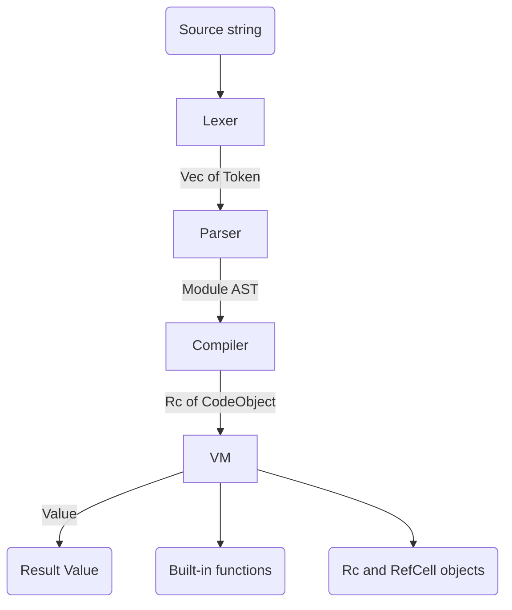

# Python Subset Compiler and Interpreter

A compiler and tree-walking-free bytecode interpreter for a substantial subset of
Python, written from scratch in Rust. Source flows through a full pipeline — lexer,
recursive-descent and Pratt parser, bytecode compiler, and a stack-based virtual
machine — implemented without any parser-generator or interpreter framework.

## Features

- **Full compilation pipeline** — `run()` ties together the `Lexer`, `Parser`,
  `Compiler`, and `VM` to take a source string to a runtime `Value`.
- **Indentation-aware lexer** — emits `Indent`/`Dedent`/`Newline` tokens from an
  indentation stack and suppresses newlines inside brackets (`lexer.rs`, `token.rs`).
- **Pratt-style expression parsing** — operator precedence and right-associative `**`
  driven by `BinaryOp::precedence` and `is_right_associative` (`parser.rs`, `ast.rs`).
- **Stack-based bytecode VM** — a flat `Vec<u8>` bytecode stream dispatched over the
  `OpCode` enum, with call frames whose locals live separate from the expression stack
  (`compiler.rs`, `vm.rs`).
- **Functions, closures, and recursion** — `MakeFunction`/`MakeClosure` with free-variable
  capture via `LoadDeref`/`StoreDeref` and closure cells.
- **Classes and methods** — `class` definitions, `__init__`, instance fields, and bound
  methods built via `BuildClass` (`value.rs`).
- **Decorators** — `@decorator` application plus built-in `@property`, `@staticmethod`,
  and `@classmethod` descriptors.
- **Control flow and exceptions** — `if`/`elif`/`else`, `while`, `for`, and
  `try`/`except`/`else`/`finally` with `SetupExcept`/`Raise` opcodes.
- **Collections and comprehensions** — lists, dicts, tuples, `range`, list
  comprehensions, and a `ValueIterator` trait backing `GetIter`/`ForIter`.
- **Built-in library** — `print`, `len`, `range`, `int`, `str`, `sorted`, `map`,
  `filter`, `isinstance`, and more registered in `builtins.rs`.

## Architecture



| Component | Module | Responsibility |
|-----------|--------|----------------|
| Lexer | `src/lexer.rs` | Scan characters into `Token`s, track indentation, handle f-strings and escapes |
| Token set | `src/token.rs` | `TokenType` variants and keyword lookup |
| Parser | `src/parser.rs` | Recursive-descent statements, Pratt-parsed expressions into a `Module` |
| AST | `src/ast.rs` | `Expr`, `Stmt`, `Param`, operator enums, precedence |
| Compiler | `src/compiler.rs` | Lower the AST to `CodeObject` bytecode, manage locals/closures |
| VM | `src/vm.rs` | Execute bytecode on a value stack with call frames and exception handlers |
| Values | `src/value.rs` | `Value` enum, `Function`, `Class`, `Instance`, iterators, descriptors |
| Built-ins | `src/builtins.rs` | Native functions registered into VM globals |

## Quick Start

### Prerequisites

- Rust 1.70+ with Cargo (Rust 2021 edition).
- No external services are required to build, test, or run.

### Installation

```bash
cargo build
```

### Running

This crate is a library; the entry point is the `run` function. Add it as a dependency
or call it from a test or binary of your own:

```toml
[dependencies]
py-compiler = { path = "." }
```

## Usage

```rust
use py_compiler::run;

fn main() {
    let code = r#"
def fib(n):
    if n <= 1:
        return n
    return fib(n - 1) + fib(n - 2)

result = fib(10)
print(result)
"#;

    // run() lexes, parses, compiles, and executes the source.
    run(code).unwrap();
}
```

The pipeline stages are also public if you want to inspect intermediate output:

```rust
use py_compiler::{lexer::Lexer, parser::Parser, compiler::Compiler, vm::VM};

let tokens = Lexer::new("x = 1 + 2 * 3").tokenize().unwrap();
let module = Parser::new(tokens).parse().unwrap();
let code = Compiler::new().compile(&module).unwrap();
let mut vm = VM::new();
let value = vm.run(&code).unwrap();
```

Supported language constructs include:

```python
# Variables, arithmetic, and collections
x = 10 + 20 * 3
numbers = [1, 2, 3]
squares = [n * n for n in numbers]
person = {"name": "Alice", "age": 30}

# Functions, defaults, and closures
def make_counter():
    count = 0
    def step():
        return count + 1
    return step

# Classes with methods and inheritance
class Point:
    def __init__(self, x, y):
        self.x = x
        self.y = y

    def distance_sq(self):
        return self.x * self.x + self.y * self.y

# Control flow and exceptions
for i in range(10):
    if i % 2 == 0:
        print(i)

try:
    raise ValueError
except ValueError:
    print("caught")
finally:
    print("done")
```

## What's Real vs Simulated

- **Real:** The complete lexer, parser, bytecode compiler, and stack VM. Functions,
  closures, recursion, classes, methods, bound methods, decorators (including
  `@property`/`@staticmethod`/`@classmethod`), list comprehensions, `range`, iteration,
  and `try`/`except`/`finally` are implemented and exercised by the test suite. The
  built-in functions in `builtins.rs` run real logic.
- **Simulated / partial:** `break` and `continue` parse but raise a compile error
  ("break outside loop") because loop-target tracking is not wired up. `import`
  statements are accepted but bind the imported name to `None` rather than loading a
  module. There is **no garbage collector**; runtime objects use `Rc`/`RefCell`
  reference counting, so reference cycles are not reclaimed. There is no separate
  semantic-analysis or type-checking pass — the compiler lowers the AST directly to
  bytecode. `async`/`await` and generators have opcodes and AST/value support but are
  not fully driven end to end. There is no standalone REPL or CLI binary.

## Testing

```bash
cargo test
```

The suite has roughly 379 tests split across the pipeline: `lexer_tests.rs`,
`parser_tests.rs`, `compiler_tests.rs`, `vm_tests.rs`, `decorator_tests.rs`, and
end-to-end `integration_tests.rs`. No external services are needed.

## Performance

Criterion benchmarks live in `benches/benchmarks.rs` (recursive `fib(20)`, a
1000-iteration loop, and 100 object constructions). Run them with:

```bash
cargo bench
```

No fixed performance targets are committed; the benchmarks measure the current build.

## Project Structure

```
18-compiler-interpreter/
  src/
    lib.rs        # run() entry point, Error type, Span
    lexer.rs      # tokenizer with indentation handling
    token.rs      # TokenType and keyword table
    parser.rs     # recursive-descent + Pratt parser
    ast.rs        # Expr, Stmt, operator enums
    compiler.rs   # AST to bytecode (OpCode, CodeObject)
    vm.rs         # stack-based bytecode interpreter
    value.rs      # runtime Value, Function, Class, iterators
    builtins.rs   # native built-in functions
  tests/          # lexer, parser, compiler, vm, decorator, integration
  benches/        # Criterion benchmarks
  docs/BLUEPRINT.md   # full architecture and design
```

## License

MIT — see ../LICENSE
