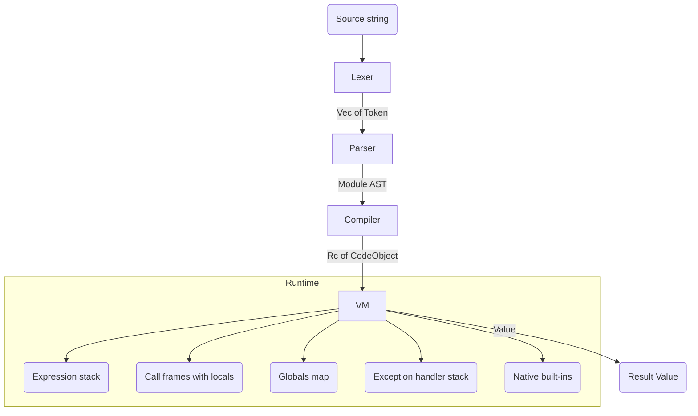

# Python Subset Compiler and Interpreter

## Overview

This project is a compiler and bytecode interpreter for a substantial subset of Python,
written from scratch in Rust with no parser-generator, interpreter framework, or external
language runtime. It implements the classic four-stage language pipeline — lexical
analysis, parsing, bytecode compilation, and virtual-machine execution — and exposes a
single `run` function that drives source text all the way to a runtime value.

The goal is pedagogical: to show how a dynamic, indentation-sensitive language is taken
apart and put back together. Each stage is a separate module with a small, inspectable
public surface, so the intermediate artifacts (token stream, AST, `CodeObject` bytecode)
can be examined in isolation. The design mirrors CPython's general shape — an
indentation-aware lexer, an AST, a flat bytecode stream addressed by opcode, and a
stack-based VM with call frames — while staying small enough to read end to end.

What it covers:

- Tokenizing Python's significant-whitespace syntax into `Indent`/`Dedent`/`Newline`
  tokens using an indentation stack, with bracket-aware newline suppression.
- Recursive-descent statement parsing combined with Pratt (precedence-climbing)
  expression parsing, including right-associative exponentiation.
- Lowering an AST into a compact bytecode `CodeObject` with a constant pool, name table,
  local-variable slots, and free/cell variable lists for closures.
- Executing bytecode on a stack machine with separate expression-stack and locals
  storage, call frames, closures, classes, bound methods, decorators, and an
  exception-handler stack.

What it deliberately does **not** do: there is no garbage collector (objects are
reference-counted via `Rc`/`RefCell`), no separate semantic-analysis or type-checking
pass, and no standalone REPL or CLI. Several constructs are partially wired (see
"Implemented vs Partial" below). The blueprint describes the system as it actually exists
in the source, not an idealized superset.

## Architecture



The pipeline is strictly linear and each stage owns one transformation:

1. **Lexer** (`src/lexer.rs`) consumes a `&str` and produces a `Vec<Token>`. It is the
   only stage that understands raw characters, whitespace, and indentation.
2. **Parser** (`src/parser.rs`) consumes the token vector and produces a `Module` — the
   AST root, a `Vec<Stmt>`. It is the only stage that understands grammar and precedence.
3. **Compiler** (`src/compiler.rs`) consumes the `Module` and produces an
   `Rc<CodeObject>` — a flat bytecode program plus its constant/name/varname tables. It is
   the only stage that knows the instruction set and scope/closure layout.
4. **VM** (`src/vm.rs`) consumes the `CodeObject` and produces a `Value`. It is the only
   stage that performs computation, allocates runtime objects, and dispatches built-ins.

The glue is `run` in `src/lib.rs`:

```rust
pub fn run(source: &str) -> Result<value::Value> {
    let tokens = lexer::Lexer::new(source).tokenize()?;
    let ast = parser::Parser::new(tokens).parse()?;
    let code = compiler::Compiler::new().compile(&ast)?;
    let mut vm = vm::VM::new();
    vm.run(&code)
}
```

Errors from every stage funnel into one `Error` enum (`src/lib.rs`) with `thiserror`
formatting: `Lexer`, `Parse`, `Semantic`, `Compile`, `Runtime`, `Type`, `Name`, `Index`,
`Key`, `Value`, `Attribute`, and `Io`. Each carries a message and, where relevant, line
and column information from a `Span`.

## Core Components

### Lexer

The lexer (`src/lexer.rs`) holds the source as a `Vec<char>` and walks it with `start`
and `current` cursors while tracking `line` and `column` for spans. Two pieces of state
make Python's syntax work:

- `indent_stack: Vec<usize>` starts as `vec![0]` and records the current nesting of
  indentation levels.
- `paren_depth: usize` counts open brackets so that newlines and indentation inside
  `()`/`[]`/`{}` are ignored (implicit line continuation).

At the start of each logical line (when `at_line_start` is true and `paren_depth == 0`),
`handle_indentation` counts leading spaces and compares them to the top of the stack: a
larger value pushes a new level and emits `Indent`; a smaller value pops one or more
levels, emitting a `Dedent` per pop, and an indentation that matches no stack level is a
lexical error. At end of input, any remaining levels above the base are flushed as
`Dedent`s, then a final `Eof` token is appended.

The scanner classifies characters into numbers (`Integer`/`Float`), strings (with escape
handling), identifiers (looked up against the keyword table via `TokenType::keyword`), and
operators/delimiters. Multi-character operators are scanned with lookahead: `/` versus `//`,
`*` versus `**`, `=` versus `==`, and the augmented-assignment forms (`+=`, `-=`, and so on)
are disambiguated by peeking at the next character before committing to a `TokenType`. Numeric
scanning distinguishes integers from floats by the presence of a decimal point, producing
`Integer(i64)` or `Float(f64)` with the parsed value already attached, so later stages never
re-parse literals. The lexer is consumed by value: `tokenize(self)` returns the owned token
vector, so a `Lexer` is single-use, and the same one-shot ownership pattern is mirrored by
`Parser::parse` and `Compiler::compile`, making each stage a clean, non-reusable transform.

### Token Set

`src/token.rs` defines `TokenType`, a flat enum covering literals (`Integer(i64)`,
`Float(f64)`, `String(String)`, `True`/`False`/`None`), identifiers, every keyword
(`Def`, `Class`, `If`, `Elif`, `Else`, `While`, `For`, `In`, `Return`, `Try`, `Except`,
`Finally`, `Raise`, `Import`, `From`, `As`, `And`, `Or`, `Not`, `Is`, `Lambda`, `Global`,
`Nonlocal`, `Pass`, `Break`, `Continue`, `Yield`, `Async`, `Await`, `With`), arithmetic
and comparison operators, augmented-assignment operators, delimiters, the synthetic
indentation tokens (`Indent`, `Dedent`, `Newline`), and `Eof`. A `Token` pairs a
`TokenType` with its source `lexeme` and `Span`. `TokenType::keyword` is the single source
of truth for which identifiers are reserved words.

### Parser

The parser (`src/parser.rs`) is a hand-written recursive-descent parser at the statement
level and a Pratt parser at the expression level. `parse(self)` loops over statements,
skipping blank `Newline`s, and collects them into a `Module`.

Statement dispatch keys off the leading token: `@` begins a decorated definition, `def`/
`async` a function, `class` a class, and so on down to a fallback that handles expression
statements and assignments. Compound statements (`if`, `while`, `for`, `try`, `with`,
`def`, `class`) recurse into indented blocks delimited by the `Indent`/`Dedent` tokens the
lexer produced.

Expressions use precedence climbing. `BinaryOp::precedence` in `src/ast.rs` assigns levels
(`or` = 1, `and` = 2, `+`/`-` = 4, `*`/`/`/`//`/`%` = 5, `**` = 6), and
`BinaryOp::is_right_associative` marks `**` as the only right-associative operator. The
parser feeds these into a min-precedence loop so that `2 ** 3 ** 2` groups right and
`1 + 2 * 3` groups by precedence without explicit grammar rules per level. The associativity
flag is what makes the loop right-associate `**`: for a right-associative operator the
recursive call uses the same precedence rather than `precedence + 1`, so a chain of `**`
nests to the right.

Assignment is disambiguated from expression statements by parsing a leading expression and
then checking for an `=` or an augmented-assignment token. A bare expression becomes
`Stmt::Expr`; `x = e` becomes `Stmt::Assign`; `x += e` becomes `Stmt::AugAssign` carrying the
underlying `BinaryOp`. Decorators are parsed before the `def`/`class` they precede: each `@`
line is collected into a `Vec<Expr>` and threaded into the resulting `FunctionDef`/`ClassDef`,
preserving source order so the compiler can apply them inside-out. Compound statements read
their suite by expecting the `Colon`, a `Newline`, an `Indent`, a run of statements, and a
matching `Dedent` — the same indentation tokens the lexer synthesized, now consumed as block
delimiters.

### AST

`src/ast.rs` defines the tree the compiler walks. `Expr` covers literals, collection
literals (`List`, `Dict`, `Tuple`), `BinaryOp`/`UnaryOp`/`Compare`, access forms
(`Identifier`, `Attribute`, `Subscript`), `Call` (with positional `args` and `kwargs`),
`ListComp`, `Lambda`, conditional `IfExpr`, and the generator/async expression forms
`Yield`, `YieldFrom`, and `Await`. `Stmt` covers simple statements (`Expr`, `Assign`,
`AugAssign`, `Return`, `Raise`, `Pass`, `Break`, `Continue`, `Global`, `Nonlocal`) and
compound statements (`If` with `elif_clauses`, `While`, `For`, `FunctionDef`, `ClassDef`,
`Try` with handlers/else/finally, `Import`, `ImportFrom`, plus the async variants and
`With`). Supporting types include `Param` (name plus optional default), `WithItem`,
`ExceptHandler`, `Alias`, and the `Module` root.

### Compiler

The compiler (`src/compiler.rs`) lowers an AST into an `Rc<CodeObject>`. It is itself a
small stack-of-state machine: a `Compiler` owns one `CodeObject`, a `locals` map from name
to slot index, and closure-tracking fields (`enclosing_vars`, `deref_vars`). Functions and
class bodies are compiled by spawning a *new* `Compiler` (`new_function`,
`new_nested_function`) and embedding the resulting code object as a constant in the parent.

Code generation is direct AST traversal. `compile_stmt` and `compile_expr` emit bytes into
`code.bytecode` through helpers: `emit(OpCode)` writes one opcode byte, `emit_u8`/`emit_u16`
write operands (big-endian for `u16`), `add_constant`/`add_name`/`add_local`/`add_freevar`
intern values into their respective pools and return an index.

Control flow uses backpatching. `emit_jump` writes a jump opcode followed by a two-byte
placeholder and returns the placeholder offset; `patch_jump` later computes the forward
distance and fills it in; `emit_loop` emits a backward jump to a recorded loop start. For
example, `if`/`elif`/`else` compiles the test, emits a `PopJumpIfFalse` over the body,
emits a `Jump` to the end, patches the false-branch target, then repeats for each `elif`
and the `else`, finally patching all the end jumps.

Scope resolution decides which opcode an identifier becomes. Inside a function, a name in
`locals` is `LoadFast`/`StoreFast`; a name in `deref_vars` or in the captured
`enclosing_vars` is a free variable and becomes `LoadDeref`/`StoreDeref` (registered via
`add_freevar`); everything else is a global `LoadName`/`StoreName`. At module level,
assignments always use `StoreName`. When a nested function references a free variable, the
parent emits the cells to capture and finishes with `MakeClosure`; functions with no free
variables finish with `MakeFunction`.

Generators are detected structurally: `stmt_contains_yield`/`expr_contains_yield` scan a
function body for `yield`, and if found the code object's `function_type` is promoted from
`Regular` to `Generator` (or `Coroutine` to `AsyncGenerator`). Decorators are compiled by
emitting the decorated function/class, then for each decorator in reverse order loading the
decorator, `RotTwo` to swap, and `Call` with one argument — exactly the `f = dec(f)`
desugaring.

Two compiled forms show how higher-level syntax reduces to the same primitives. A **list
comprehension** `[e for x in it if c]` compiles to: build an empty list, get the iterator,
then a `ForIter` loop that stores the loop variable, optionally tests the condition with a
`PopJumpIfFalse` skip, `Dup`s the accumulator list, evaluates the element, and `ListAppend`s
it — leaving the populated list on the stack when the loop exits. There is no special
comprehension machinery; it is the `for`-loop lowering plus `ListAppend`. A **try/except**
statement compiles to `SetupExcept handler` over the try body, `PopExcept` on the normal path,
a `Jump` past the handlers, then the handler blocks (each binding the exception to a local via
`StoreFast` when named, or `Pop`ping it otherwise), and finally the `finally` body terminated
by `EndFinally`. Jump targets between these regions are all backpatched with `patch_jump`, the
same mechanism used for `if`.

### Virtual Machine

The VM (`src/vm.rs`) is a stack machine over the `OpCode` enum. Its state is an expression
`stack: Vec<Value>`, a `frames: Vec<CallFrame>` call stack, a `globals: HashMap`, an
`exception_handlers: Vec<ExceptionHandler>` stack, and a `current_exception` slot. `VM::new`
seeds globals by calling `builtins::register_builtins`.

A central design choice: **local variables live in `CallFrame::locals`, separate from the
expression stack.** Earlier designs stored locals at `stack[bp + idx]`, which let a `for`
loop's `StoreFast` overwrite the iterator sitting on the stack. Keeping locals in their own
vector means iterators and temporaries on the expression stack are never clobbered by
variable assignment. `LoadFast`/`StoreFast` index into `frame.locals`; `LoadDeref`/
`StoreDeref` index into the frame's `closure` cells.

The fetch-decode-execute loop reads one opcode via `read_op`, reads any operands via
`read_u8`/`read_u16`, and matches on the opcode. Call dispatch (`OpCode::Call`) inspects the
callee value:

- `Value::Function` with `Regular` type pushes a new `CallFrame` whose `locals` are the
  popped arguments. A `Generator`/`Coroutine` function instead builds a generator/coroutine
  object seeded with named locals and pushes that.
- `Value::NativeFunction` runs immediately: arguments are drained and passed to the native
  `fn(&[Value]) -> Result<Value>`.
- `Value::Class` constructs an `Instance`, and if the class defines `__init__`, pushes a
  frame with `locals = [self, *args]` and `returns_instance` set so the constructor returns
  the instance rather than `__init__`'s `None`.
- `Value::BoundMethod` pushes a frame with the receiver prepended as `self`.
- `Value::BoundListMethod` dispatches list mutators (`append`, `pop`, and similar) directly
  against the captured list.

`Return` pops the frame, truncates the stack back to the frame base, and either returns the
final value (outermost frame) or pushes it for the caller — substituting `returns_instance`
when present.

Class construction is itself a small interpreter-in-an-interpreter. `BuildClass` pops the
class name, the class-body code object, and the bases tuple, then runs the class body in a
**fresh `VM`** whose globals are cloned from the outer VM (so the body can see existing
names and decorators). After execution, it diffs the inner VM's globals against the outer
set: every name that did not pre-exist becomes a method on the new `Class`. This keeps the
method-collection logic trivial — class-body assignments land in globals, and the diff is
the class namespace.

Iteration is `GetIter` (build a `ValueIterator` for the object) followed by `ForIter`, which
peeks the iterator on the stack, advances it via `next_value`, and either pushes the next
value or takes the relative jump past the loop when the iterator is exhausted. Because the
iterator stays on the expression stack while the loop variable is written to `frame.locals`,
the two never collide.

Exceptions use a dedicated handler stack. `SetupExcept` pushes an `ExceptionHandler`
recording the handler's target IP (current IP plus the relative offset), the current stack
height, and the current frame index. `PopExcept` removes it on normal completion of the try
body. `Raise` (and `Reraise`) pops the nearest handler, truncates the expression stack back
to the recorded level, unwinds any frames pushed since the handler was installed, sets the
instruction pointer to the handler, stores the exception in `current_exception`, and pushes
the exception value so a named `except E as e` clause can bind it. With no handler on the
stack, the exception propagates out as an `Error::Runtime`.

### Operator and Attribute Semantics

The VM keeps the dispatch loop thin by delegating each binary opcode to a small typed
helper. `BinaryAdd` pops the two operands and calls `add`, which pattern-matches the operand
pair: `Int + Int` stays an `Int`, any `Float` involvement promotes to `Float`,
`String + String` concatenates, and `List + List` extends a clone. Mismatched types produce
a Python-style `Error::Type("unsupported operand type(s) for +: 'X' and 'Y'")`. `sub`, `mul`,
`div`, `floor_div`, `modulo`, and `pow` follow the same shape, with `mul` additionally
supporting string repetition (`String * Int`). This mirrors Python's numeric tower for the
two numeric types the language models while keeping each operation a single, testable
function.

Comparisons split between identity-style and ordering opcodes. `CompareEq`/`CompareNe` use
`Value`'s custom `PartialEq` (which coerces `Int`/`Float`), while `CompareLt`/`CompareLe`/
`CompareGt`/`CompareGe` route through `compare_lt`/`compare_le` helpers that order numbers
and strings. Short-circuit `and`/`or` are *not* opcodes in the usual sense: the compiler
emits `JumpIfFalse`/`JumpIfTrue` around the right operand so the second operand is only
evaluated when needed, matching Python semantics and leaving the deciding value on the stack.

Attribute access is where the object model lives. `LoadAttr` pops the object and calls
`get_attr`, which for an `Instance` first checks instance `fields`, then the class `methods`
map. A plain method becomes a `BoundMethod` carrying the instance as receiver. The descriptor
protocol is honored here: a `Property` returns a bound getter, a `StaticMethod` returns the
unwrapped function with no binding, and a `ClassMethod` binds to the class rather than the
instance. `StoreAttr` writes into the instance's `fields` map. `LoadSubscript`/
`StoreSubscript` index lists, dicts, and tuples, raising `Error::Index`/`Error::Key` on
out-of-range or missing keys.

### Values

`src/value.rs` defines `Value`, the tagged union of every runtime object: `None`, `Bool`,
`Int(i64)`, `Float(f64)`, `String(Rc<String>)`, `List(Rc<RefCell<Vec<Value>>>)`,
`Dict(Rc<RefCell<HashMap<String, Value>>>)`, `Tuple(Rc<Vec<Value>>)`, `Function`,
`NativeFunction`, `Class`, `Instance`, `BoundMethod`, `Range`, `Iterator`, `Generator`,
`Coroutine`, the decorator descriptors (`Property`, `StaticMethod`, `ClassMethod`), and
`BoundListMethod`. Mutable containers use `Rc<RefCell<...>>`; immutable ones use `Rc`.

`Value` implements `is_truthy` (Python truthiness rules: empty containers, zero, empty
string, `None`, and `False` are falsy), `type_name` (the Python-facing type label), and
`repr`. Equality is custom (`PartialEq`) and includes int/float coercion. Supporting types:
`Function` (name, `Rc<CodeObject>`, defaults, optional closure cells), `NativeFunction`
(name, arity, `fn` pointer), `Class` (name, base classes, method map), `Instance` (class,
field map), `BoundMethod` (receiver + method), and `RangeValue` (start/stop/step).

Iteration is unified by the `ValueIterator` trait with `next_value(&mut self) -> Option<Value>`.
Concrete iterators cover ranges, lists, strings (per character), tuples, and dict keys.
`Generator` and `Coroutine` carry their own state machine (`Created`/`Running`/`Suspended`/
`Completed`), instruction pointer, local stack, and locals, designed for resumable execution.

### Built-ins

`src/builtins.rs` registers native functions into the VM's global map via
`register_builtins`. Each is a `fn(&[Value]) -> Result<Value>` wrapped in a
`NativeFunction` with a declared arity (`-1` for variadic). The set includes `print`, `len`,
`range`, `int`, `float`, `str`, `bool`, `list`, `dict`, `tuple`, `type`, `abs`, `min`,
`max`, `sum`, `round`, `sorted`, `reversed`, `enumerate`, `zip`, `map`, `filter`, `input`,
`ord`, `chr`, `isinstance`, `hasattr`, `getattr`, `setattr`, and the decorator factories
`property`, `staticmethod`, and `classmethod`. Helpers `format_value`/`repr_value` produce
Python-style string output, and `iterable_to_vec` normalizes lists, tuples, strings, and
ranges into a `Vec<Value>` for the higher-order built-ins.

The built-ins reproduce Python behavior closely where it is observable:

- **Numeric coercion.** `int` parses strings, truncates floats, and maps `True`/`False` to
  `1`/`0`; `float` parses or widens; `abs`/`round` branch on `Int` vs `Float`. Bad inputs
  raise `Error::Value` with Python's exact message text (e.g. `invalid literal for int()`).
- **Iteration consumers.** `sum`, `min`, `max`, `sorted`, `reversed`, and `enumerate` accept
  lists or tuples; `sum` promotes to `Float` the moment it sees one, mirroring Python's mixed
  arithmetic. `sorted` orders ints, floats, and strings with a stable comparator.
- **Higher-order functions.** `map`, `filter`, and `zip` are *eager* — they return a list,
  not a lazy iterator. `map`/`filter` apply only `NativeFunction` callables directly; applying
  a user-defined function via `map` is intentionally rejected with a message steering the user
  to list-comprehension syntax, because invoking VM-level functions from inside a native
  built-in would require re-entering the interpreter.
- **Reflection.** `isinstance` checks an instance's class name and its (recorded) bases, and
  also accepts a type-name string or a tuple of types. `hasattr`/`getattr`/`setattr` read and
  write instance fields and methods, with `getattr` honoring an optional default.
- **Output.** `print` joins its variadic arguments with spaces via `format_value`, which
  renders containers recursively using `repr_value` so nested strings are quoted.

## Compilation Walkthrough

Tracing one program through every stage makes the contracts between modules concrete.
Consider:

```python
def fib(n):
    if n <= 1:
        return n
    return fib(n - 1) + fib(n - 2)

result = fib(10)
```

**Lexing.** The lexer walks characters and emits a flat token stream. The `def` line
yields `Def`, `Identifier("fib")`, `LParen`, `Identifier("n")`, `RParen`, `Colon`,
`Newline`. The newline sets `at_line_start`, and the next line's leading spaces drive
`handle_indentation`, which pushes a level and emits `Indent`. The nested `if` body emits a
second `Indent`; the two `return` statements at the outer body trigger a `Dedent` back to
the function-body level. At end of file the lexer flushes remaining `Dedent`s and appends
`Eof`. Inside `fib(n - 1)` the `(` increments `paren_depth`, so any incidental newline there
would be swallowed.

**Parsing.** `parse` loops over statements. The `Def` token routes to function-definition
parsing, which reads the parameter list into `Vec<Param>` and the indented block into a
`Vec<Stmt>`. The `if` becomes `Stmt::If { test, body, elif_clauses, else_body }`; its test
`n <= 1` is a `Expr::Compare`. The expression `fib(n - 1) + fib(n - 2)` is built by the
Pratt loop: `+` has precedence 4, the two `fib(...)` calls are `Expr::Call` prefixes, and
each argument `n - 1` is a nested `Expr::BinaryOp`. The whole program becomes a `Module`
with two top-level statements: the `FunctionDef` and the `result = fib(10)` `Assign`.

**Compiling.** The top-level `Compiler` compiles the `FunctionDef` by spawning a nested
`Compiler` via `new_nested_function`, passing the enclosing locals so free-variable
resolution works. The nested compiler registers `n` as local slot 0, then compiles the body:
the `if` compiles its compare, emits `PopJumpIfFalse` over the then-branch, and backpatches
the jump after the body. The recursive calls compile as `LoadName fib`, `LoadFast n`,
`LoadConst 1`, `BinarySub`, `Call 1` — note `fib` resolves to `LoadName` (a global) while
`n` resolves to `LoadFast` (a local). The function has no free variables, so it finishes
with `MakeFunction` and the parent stores it with `StoreName fib`. The `result = fib(10)`
assignment compiles to `LoadName fib`, `LoadConst 10`, `Call 1`, `StoreName result`. The
module appends an implicit `LoadConst None` / `Return`.

**Executing.** `VM::run` pushes a base frame for the module code and enters the dispatch
loop. `StoreName fib` puts the function value in globals. Reaching `Call 1` for `fib(10)`,
the VM sees a `Value::Function` of `Regular` type, drains the single argument into a new
`CallFrame { locals: [10], ... }`, and pushes it. Each recursive `fib(n - 1)` pushes another
frame, growing the `frames` stack to the recursion depth; each `Return` pops a frame,
truncates the expression stack to that frame's base, and pushes the result for the caller.
When the outermost module frame returns, `run` yields the final `Value`.

This walkthrough touches every contract: tokens to the parser, AST to the compiler,
`CodeObject` to the VM, and the locals-vs-stack discipline that keeps recursion and
iteration correct.

## Data Structures

### Runtime Value

```rust
pub enum Value {
    None,
    Bool(bool),
    Int(i64),
    Float(f64),
    String(Rc<String>),
    List(Rc<RefCell<Vec<Value>>>),
    Dict(Rc<RefCell<HashMap<String, Value>>>),
    Tuple(Rc<Vec<Value>>),
    Function(Rc<Function>),
    NativeFunction(Rc<NativeFunction>),
    Class(Rc<Class>),
    Instance(Rc<RefCell<Instance>>),
    BoundMethod(Rc<BoundMethod>),
    Range(Rc<RangeValue>),
    Iterator(Rc<RefCell<Box<dyn ValueIterator>>>),
    Generator(Rc<RefCell<Generator>>),
    Coroutine(Rc<RefCell<Coroutine>>),
    Property(Rc<PropertyDescriptor>),
    StaticMethod(Rc<StaticMethodDescriptor>),
    ClassMethod(Rc<ClassMethodDescriptor>),
    BoundListMethod(Rc<RefCell<Vec<Value>>>, String),
}
```

Reference counting (`Rc`) and interior mutability (`RefCell`) together provide shared,
mutable heap objects without a tracing collector. Dict keys are restricted to `String`,
which simplifies hashing at the cost of full Python key generality.

### Bytecode Instruction Set

```rust
#[repr(u8)]
pub enum OpCode {
    // Stack and names
    LoadConst, LoadName, LoadFast, StoreName, StoreFast,
    LoadAttr, StoreAttr, LoadSubscript, StoreSubscript,
    // Arithmetic
    BinaryAdd, BinarySub, BinaryMul, BinaryDiv, BinaryFloorDiv,
    BinaryMod, BinaryPow, UnaryNeg, UnaryNot,
    // Comparison
    CompareEq, CompareNe, CompareLt, CompareLe, CompareGt,
    CompareGe, CompareIs, CompareIn,
    // Control flow
    Jump, JumpIfTrue, JumpIfFalse, PopJumpIfTrue, PopJumpIfFalse,
    // Functions
    Call, Return, MakeFunction,
    // Collections
    BuildList, BuildDict, BuildTuple, ListAppend,
    // Iteration
    GetIter, ForIter,
    // Class
    BuildClass, LoadMethod, CallMethod,
    // Misc
    Pop, Dup, Nop, RotTwo,
    // Exceptions
    SetupExcept, PopExcept, Raise, Reraise, EndFinally,
    // Generators / coroutines
    YieldValue, YieldFrom, GetAwaitable, GetAiter, GetAnext,
    SetupWith, WithCleanup,
    // Closures
    LoadDeref, StoreDeref, LoadClosure, MakeClosure,
}
```

Opcodes are single bytes (`#[repr(u8)]`); operands are appended inline as `u8` or
big-endian `u16`. The bytecode is therefore a self-contained `Vec<u8>` that the VM walks
with an instruction pointer.

### Code Object

```rust
pub struct CodeObject {
    pub name: String,
    pub bytecode: Vec<u8>,
    pub constants: Vec<Value>,
    pub names: Vec<String>,
    pub varnames: Vec<String>,
    pub freevars: Vec<String>,  // captured from an enclosing scope
    pub cellvars: Vec<String>,  // captured by an inner scope
    pub arg_count: u16,
    pub function_type: FunctionType,
}

pub enum FunctionType { Regular, Generator, Coroutine, AsyncGenerator }
```

A `CodeObject` is the compiled unit for the module, each function, each lambda, and each
class body. `constants` is the constant pool indexed by `LoadConst`; `names` backs global
loads/stores and attribute names; `varnames` indexes locals; `freevars`/`cellvars` describe
closure capture. Nested functions are themselves stored as `Value::Function` constants in
their parent's pool.

### Call Frame

```rust
struct CallFrame {
    code: Rc<CodeObject>,
    ip: usize,
    bp: usize,
    locals: Vec<Value>,
    closure: Option<Rc<RefCell<Vec<Value>>>>,
    returns_instance: Option<Value>,
}
```

`ip` is the instruction pointer into `code.bytecode`; `bp` is the expression-stack base so
`Return` can truncate cleanly; `locals` holds variables by varname slot, kept off the
expression stack; `closure` holds free-variable cells; `returns_instance` makes `__init__`
return the constructed instance instead of `None`.

### AST Nodes

```rust
pub enum Expr {
    Integer(i64), Float(f64), String(String), Bool(bool), None,
    List(Vec<Expr>), Dict(Vec<(Expr, Expr)>), Tuple(Vec<Expr>),
    BinaryOp { left: Box<Expr>, op: BinaryOp, right: Box<Expr> },
    UnaryOp { op: UnaryOp, operand: Box<Expr> },
    Compare { left: Box<Expr>, ops: Vec<(CompareOp, Expr)> },
    Identifier(String),
    Attribute { value: Box<Expr>, attr: String },
    Subscript { value: Box<Expr>, index: Box<Expr> },
    Call { func: Box<Expr>, args: Vec<Expr>, kwargs: Vec<(String, Expr)> },
    ListComp { element: Box<Expr>, target: String, iter: Box<Expr>, condition: Option<Box<Expr>> },
    Lambda { params: Vec<Param>, body: Box<Expr> },
    IfExpr { test: Box<Expr>, body: Box<Expr>, orelse: Box<Expr> },
    Yield(Option<Box<Expr>>), YieldFrom(Box<Expr>), Await(Box<Expr>),
}
```

`Stmt` mirrors this for statements (`Assign`, `AugAssign`, `If` with `elif_clauses`,
`While`, `For`, `FunctionDef`, `ClassDef`, `Try`, and the async/with variants). Boxing
recursive positions keeps node sizes bounded.

### Iterators and Resumable Objects

Iteration is unified behind a single trait so every `for` loop and comprehension uses the
same `GetIter`/`ForIter` path regardless of what it iterates:

```rust
pub trait ValueIterator: fmt::Debug {
    fn next_value(&mut self) -> Option<Value>;
}
```

Concrete implementors cover the iterable types: `RangeIterator` (steps by `step` until it
passes `stop`, supporting negative steps), `ListIterator` (indexes a shared
`Rc<RefCell<Vec<Value>>>`), `StringIterator` (yields each character as a one-character
string), `TupleIterator`, and `DictIterator` (snapshots the keys at creation time and yields
them). `GetIter` wraps the appropriate concrete iterator in
`Value::Iterator(Rc<RefCell<Box<dyn ValueIterator>>>)`, and `ForIter` advances it by calling
`next_value` on the boxed trait object — classic dynamic dispatch standing in for Python's
iterator protocol.

Generators and coroutines model suspended execution as explicit state machines:

```rust
pub enum GeneratorState { Created, Running, Suspended, Completed }

pub struct Generator {
    pub name: String,
    pub code: Rc<CodeObject>,
    pub state: GeneratorState,
    pub ip: usize,                      // resume point
    pub stack: Vec<Value>,              // saved operand stack
    pub locals: HashMap<String, Value>, // saved locals
    pub send_value: Option<Value>,      // value injected on resume
}
```

`Coroutine` is structurally identical with an extra `awaiting` slot. A generator function
call constructs one of these objects (seeded with the arguments as named locals) rather than
executing immediately, which is why the compiler must detect `yield` up front and tag the
code object's `function_type`. The saved `ip`, `stack`, and `locals` are everything needed to
resume mid-function; this state is present and constructed, while the VM-side stepping that
would fully drive resumption is among the partial features noted below.

## API Design

The crate is a library; its public surface is the pipeline plus the convenience entry
point.

```rust
// One-call pipeline: source -> Value
pub fn run(source: &str) -> Result<value::Value>;

// Stage by stage:
impl Lexer    { pub fn new(source: &str) -> Self;  pub fn tokenize(self) -> Result<Vec<Token>>; }
impl Parser   { pub fn new(tokens: Vec<Token>) -> Self;  pub fn parse(self) -> Result<Module>; }
impl Compiler { pub fn new() -> Self;  pub fn compile(self, module: &Module) -> Result<Rc<CodeObject>>; }
impl VM       { pub fn new() -> Self;  pub fn run(&mut self, code: &Rc<CodeObject>) -> Result<Value>; }
```

Each stage is consumed (or borrowed-mut, for the VM) and returns a `Result<T, Error>`. The
error enum is shared, so a caller pattern-matches one type regardless of which stage failed:

```rust
use py_compiler::{run, Error};

match run("x = ") {
    Ok(value) => println!("{:?}", value),
    Err(Error::Parse { message, line }) => eprintln!("parse error on line {line}: {message}"),
    Err(e) => eprintln!("{e}"),
}
```

`Span { start, end, line, column }` accompanies tokens and lexer errors so diagnostics can
point at source positions.

### Error Model

A single `Error` enum (`src/lib.rs`) spans the whole pipeline, with `thiserror` deriving the
`Display` formatting. Each variant maps to a stage or a Python-level exception category:

```rust
pub enum Error {
    Lexer { message: String, line: usize, column: usize },
    Parse { message: String, line: usize },
    Semantic(String),
    Compile(String),
    Runtime(String),
    Type(String),
    Name(String),
    Index(String),
    Key(String),
    Value(String),
    Attribute(String),
    Io(#[from] std::io::Error),
}
pub type Result<T> = std::result::Result<T, Error>;
```

`Lexer` and `Parse` carry source position. `Type`, `Name`, `Index`, `Key`, `Value`, and
`Attribute` correspond to the Python exceptions of the same names and are produced by the VM
and built-ins with Python-flavored messages — for example `Error::Name("name 'foo' is not
defined")` from a failed global load, or `Error::Type("object of type 'int' has no len()")`
from `len`. Because every stage returns `Result<T, Error>` and the variants share one type,
`run`'s caller handles failure uniformly with a single `match`. The `Semantic` variant exists
in the enum but is currently unused, reflecting that no separate semantic-analysis pass runs.

### Closure Mechanics

Closures are the subtlest part of the compiler/VM contract, so the data flow is worth
spelling out. When a function references a name that is neither its own local nor a global —
it lives in an enclosing function — the compiler calls `add_freevar`, which appends the name
to the code object's `freevars` list and records its index in `deref_vars`. References to it
compile to `LoadDeref`/`StoreDeref` against that index.

At the *definition* site, the parent compiler sees the child has free variables and, instead
of `MakeFunction`, emits one load per free variable (capturing the value from the parent's
locals or its own deref cells) followed by `MakeClosure n`. At runtime, `MakeClosure` collects
those `n` captured values into an `Rc<RefCell<Vec<Value>>>` — the closure's cells — and stores
them on the resulting `Value::Function`. When that function is later called, its frame's
`closure` field points at those shared cells, so `LoadDeref`/`StoreDeref` read and write the
captured variables through reference-counted, interior-mutable storage shared with the parent.

## Performance

Performance is measured, not asserted. `benches/benchmarks.rs` defines a Criterion harness
with three workloads exercised through the public `run` entry point:

- `fibonacci_20` — recursive `fib(20)`, stressing function-call dispatch and frame setup.
- `loop_1000` — a 1000-iteration `for` loop accumulating a sum, stressing the
  `GetIter`/`ForIter` path and local storage.
- `class_creation_100` — constructing 100 `Point` instances and appending them to a list,
  stressing instance allocation and `__init__` dispatch.

Run them with `cargo bench`. No fixed throughput or latency targets are committed; the
harness reports timings for the current build so regressions are visible across changes.

Design choices that bound runtime cost:

- **Flat bytecode.** The program is a `Vec<u8>` walked by an instruction pointer, avoiding
  per-node tree-walking overhead at execution time.
- **Locals as a vector.** `frame.locals` is indexed by slot, so variable access is an
  array index rather than a hash lookup. Globals and attribute names still use a `HashMap`.
- **Interned pools.** `add_constant`/`add_name`/`add_local` deduplicate so repeated names
  and constants share one slot.
- **`Rc`/`RefCell` objects.** Cloning a `Value` clones a reference count, not the
  underlying container, keeping argument passing cheap — at the cost of no cycle collection.

The main known costs are the `HashMap` lookups for globals and attribute access, and the
absence of a garbage collector for cyclic structures.

Two specific hot paths shape execution time. First, **call dispatch** allocates a `Vec` for
the new frame's locals on every invocation (the drained arguments), so recursion-heavy code
like `fib` pays an allocation per call; the offsetting win is that arguments are already laid
out as the callee's local slots, so no copy into a separate locals area is needed. Second,
**class-body execution** spins up a fresh nested `VM` per `class` statement and clones the
outer globals into it; this is cheap for the small class bodies typical of the test programs
but is linear in the number of globals, so it is a deliberate simplicity-over-speed trade.
Neither path is optimized further because the project's aim is a readable reference, not a
production interpreter — the structure makes each cost visible rather than hiding it behind
caches or specialized opcodes.

## Testing Strategy

The suite contains roughly 379 tests across seven files, each targeting one stage or the
whole pipeline. All tests are pure and require no external services; run them with
`cargo test`.

- **Lexer tests** (`tests/lexer_tests.rs`, ~58) verify tokenization of literals, operators,
  keywords, string escapes, and especially indentation — that nested blocks emit balanced
  `Indent`/`Dedent` tokens and that brackets suppress newlines.
- **Parser tests** (`tests/parser_tests.rs`, ~81) verify AST shape for expressions and
  statements: operator precedence and `**` right-associativity, function and class
  definitions, comprehensions, conditionals, and compound-statement nesting.
- **Compiler tests** (`tests/compiler_tests.rs`, ~67) verify bytecode generation: that
  expressions and control flow emit the expected opcodes, jumps backpatch correctly, and
  locals/closures resolve to `LoadFast`/`LoadDeref`/`LoadName` as appropriate.
- **VM tests** (`tests/vm_tests.rs`, ~116) are the largest group and exercise execution:
  arithmetic and comparison semantics, truthiness, function calls and recursion, closures,
  class instantiation and method dispatch, iteration, and exception handling.
- **Decorator tests** (`tests/decorator_tests.rs`, ~17) cover `@decorator` application and
  the `@property`/`@staticmethod`/`@classmethod` descriptors.
- **Integration tests** (`tests/integration_tests.rs`, ~39) run full programs through
  `run`: algorithms like factorial, Fibonacci, list summation, and even-counting, asserting
  the pipeline completes successfully end to end.

A representative end-to-end test compiles and runs a recursive algorithm and asserts the
pipeline succeeds:

```rust
#[test]
fn test_algorithm_factorial() {
    let code = r#"
def factorial(n):
    if n <= 1:
        return 1
    return n * factorial(n - 1)
result = factorial(5)
"#;
    assert!(run(code).is_ok());
}
```

Stage-level tests are tighter. A lexer test asserts that a function body produces the exact
`Indent`/`Dedent` framing; a parser test matches on the returned `Stmt::FunctionDef` and
checks the parameter count; a VM test runs a snippet and asserts the resulting `Value`. This
layering means a regression is caught at the earliest stage it manifests: a tokenization bug
fails a lexer test rather than surfacing as a confusing VM error.

Edge cases are pushed at the boundaries that historically broke: indentation consistency,
iterator preservation across loop-variable assignment (the locals-vs-stack split), and
`__init__` returning the instance rather than `None`. The decorator suite specifically guards
the descriptor protocol — that `@staticmethod` returns an unbound function, `@classmethod`
binds to the class, and `@property` access invokes the getter — since those are the cases the
`get_attr` dispatch must get exactly right. Because the whole suite is pure and offline, it
runs as a fast inner loop with `cargo test` and gates every change to the pipeline.

## Implemented vs Partial

To keep the blueprint honest about the current source:

- **Fully implemented:** the lexer, parser, compiler, and VM; functions, closures,
  recursion; classes, single inheritance, bound methods; decorators and the three built-in
  descriptors; list comprehensions; `range` and iteration; `if`/`elif`/`else`, `while`,
  `for`; `try`/`except`/`else`/`finally`; the built-in function set.
- **Partial / not wired end to end:** `break` and `continue` parse but raise a compile
  error because loop-target tracking is not implemented. `import` is parsed but binds the
  name to `None` instead of loading a module. The parser accepts `class C(Base):` and the
  compiler builds and emits a bases tuple, but `BuildClass` currently constructs the class
  with an empty `bases` list, so the base classes are not yet attached at runtime even
  though `isinstance` is written to consult them. `async`/`await` and generators have
  opcodes, AST nodes, and value types, but resumable execution is not fully driven by the
  VM.
- **Absent by design:** there is no garbage collector (objects are reference-counted, so
  cycles are not reclaimed), no separate semantic-analysis or type-checking pass (the
  compiler lowers the AST directly), and no standalone REPL or CLI binary.

## References

- [Crafting Interpreters](https://craftinginterpreters.com/) — bytecode VM, stack-based
  execution, and closure design.
- [CPython Internals](https://realpython.com/cpython-source-code-guide/) — code objects,
  the evaluation loop, and frame layout.
- [Python Language Reference](https://docs.python.org/3/reference/) — lexical structure,
  indentation rules, and statement/expression grammar.
- [Pratt Parsing](https://matklad.github.io/2020/04/13/simple-but-powerful-pratt-parsing.html)
  — precedence-climbing expression parsing.
