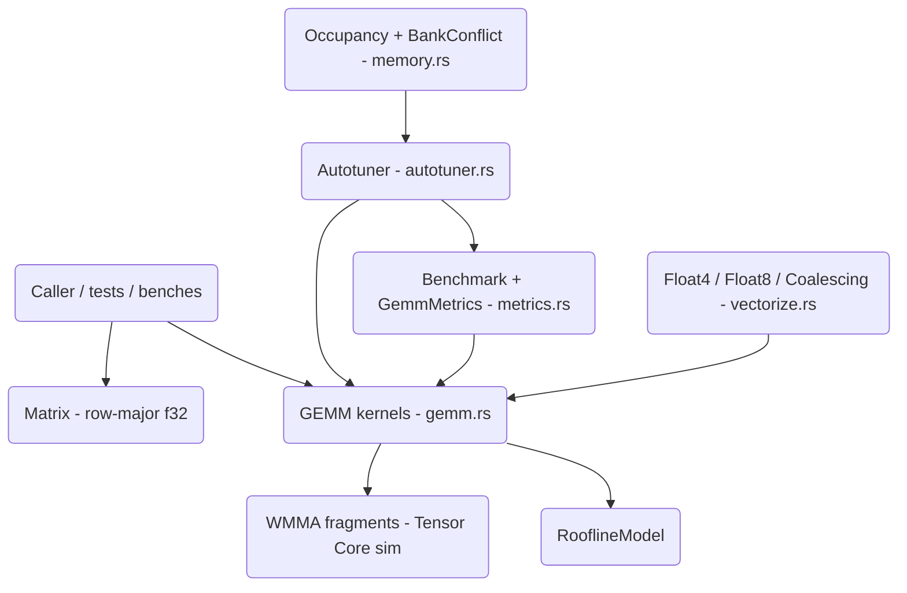

# GPU GEMM Optimization (cuBLAS-lite)

A from-scratch Rust library that teaches GPU kernel-optimization concepts for General Matrix Multiplication (GEMM). The kernels run on the CPU but mirror the GPU optimization progression — naive, shared-memory tiling, register tiling, double buffering, vectorized loads, and simulated Tensor Cores — alongside autotuning, roofline analysis, occupancy modeling, and bank-conflict detection.

## Features

- **Progressive GEMM kernels** — naive, shared-memory tiling, register tiling, parallel tiling, and double buffering (`naive_gemm`, `tiled_gemm`, `register_tiled_gemm`, `parallel_tiled_gemm`, `double_buffered_gemm` in `gemm.rs`).
- **BLAS-style and fused variants** — `scaled_gemm` (alpha/beta), `gemm_activation`, `gemm_bias_activation`, and `gemm_fused` with a 7-way `Activation` enum (ReLU, GELU, SiLU, …).
- **Batched GEMM** — `batched_gemm`, `batched_scaled_gemm`, and `strided_batched_gemm` parallelized with Rayon (`gemm.rs`).
- **Tensor Core simulation** — `wmma_gemm` and `wmma_mma_sync` over `WmmaFragment` with 16x16x16 and other `WmmaConfig` fragment shapes.
- **Autotuner** — grid, random, simulated-annealing, and genetic search over the `GemmConfig` space, plus `TuningCache` and `HeuristicSelector` (`autotuner.rs`).
- **Roofline analysis** — `RooflineModel` computes arithmetic intensity, ridge point, and `ComputeBound` / `MemoryBound` / `Balanced` classification (`gemm.rs`).
- **Occupancy and bank-conflict modeling** — `OccupancyCalculator` (Ampere/Volta/Turing presets) and `BankConflictAnalysis` with padding suggestions (`memory.rs`).
- **Vectorized memory ops** — `Float4` / `Float8` SIMD-style loads simulating `LDG.128`, plus `CoalescingAnalysis` (`vectorize.rs`).
- **Benchmarking and metrics** — `Benchmark` runner with warmup/median timing and `GemmMetrics` (GFLOPS, bandwidth, efficiency) in `metrics.rs`.

## Architecture



| Component | Module | Responsibility |
|-----------|--------|----------------|
| Matrix | `matrix.rs` | Row-major `f32` storage, constructors, transpose, layout conversion, packing |
| GEMM kernels | `gemm.rs` | Naive through double-buffered kernels, fused/batched/WMMA variants, roofline |
| Autotuner | `autotuner.rs` | Search strategies over `GemmConfig`, tuning cache, heuristic selection |
| Metrics | `metrics.rs` | `Benchmark` runner, `GemmMetrics`, `PerformanceModel`, kernel comparison |
| Vectorize | `vectorize.rs` | `Float4`/`Float8` vector ops, vectorized GEMM, coalescing analysis |
| Memory | `memory.rs` | Bank-conflict analysis, shared-memory padding, occupancy modeling |

## Quick Start

### Prerequisites

- Rust 1.70 or later (edition 2021)
- No GPU, services, or credentials are required — everything runs on the CPU.

### Installation

```bash
cd 19-gpu-kernel-optimization
cargo build --release
```

### Running

This is a library crate; exercise it through the test suite or benchmarks:

```bash
cargo test          # run the suite
cargo bench         # Criterion benchmarks (naive vs tiled, 128x128)
```

## Usage

Basic GEMM and a tiled variant, verified against the naive baseline:

```rust
use gpu_gemm_optimization::{Matrix, naive_gemm, tiled_gemm, GemmConfig, register_tiled_gemm};

fn main() -> gpu_gemm_optimization::Result<()> {
    let a = Matrix::random(256, 256);
    let b = Matrix::random(256, 256);

    // Baseline kernel: one "thread" per output element.
    let mut c = Matrix::zeros(256, 256);
    naive_gemm(&a, &b, &mut c)?;

    // Shared-memory tiled kernel with a 32-wide tile.
    let mut c_tiled = Matrix::zeros(256, 256);
    tiled_gemm(&a, &b, &mut c_tiled, 32)?;
    assert!(c_tiled.approx_eq(&c, 1e-3));

    // Register-tiled kernel driven by a block/thread config.
    let mut c_reg = Matrix::zeros(256, 256);
    register_tiled_gemm(&a, &b, &mut c_reg, &GemmConfig::default())?;
    println!("result norm = {}", c_reg.frobenius_norm());
    Ok(())
}
```

Autotuning a kernel over a parameter space:

```rust
use gpu_gemm_optimization::Matrix;
use gpu_gemm_optimization::autotuner::{Autotuner, AutotuneConfig, ParameterSpace, SearchStrategy};
use gpu_gemm_optimization::gemm::register_tiled_gemm;

let tuner = Autotuner::new(
    AutotuneConfig { strategy: SearchStrategy::GridSearch, ..Default::default() },
    ParameterSpace::small(),
);

let a = Matrix::random(128, 128);
let b = Matrix::random(128, 128);
let result = tuner.tune(&a, &b, |a, b, c, cfg| register_tiled_gemm(a, b, c, cfg)).unwrap();
println!("{}", result.format()); // best block/thread config + GFLOPS
```

## What's Real vs Simulated

- **Real:** All GEMM kernels, fused/batched/WMMA variants, the autotuner (grid/random/annealing/genetic) with caching, the roofline model, `Benchmark`/`GemmMetrics` timing, vectorized `Float4`/`Float8` ops, coalescing analysis, bank-conflict analysis, shared-memory padding, and occupancy calculation are fully implemented in Rust and exercised by the tests.
- **Simulated:** There is no GPU execution. "Shared memory," "registers," "warps," and "Tensor Cores" are CPU stand-ins (local arrays, `WmmaFragment`s, Rayon parallelism). Occupancy and bank-conflict math use NVIDIA architecture constants (32 banks, Ampere/Volta/Turing limits) but model — rather than measure — hardware. GFLOPS/efficiency are computed against a configurable software `peak_gflops`, not a real device peak.

## Testing

```bash
cargo test
```

Five integration/unit suites (`integration_test.rs`, `test_gemm.rs`, `test_matrix.rs`, `test_autotuner.rs`, `test_metrics.rs`) plus in-module `#[cfg(test)]` tests cover kernel correctness (every kernel is checked against the naive reference), identity/zero/numerical-stability edge cases, all four search strategies, roofline/occupancy math, and bank-conflict/coalescing analysis. No external services are needed.

## Performance

Throughput is reported as GFLOPS derived from `2*M*N*K` over measured median time, with
efficiency relative to a configurable software `peak_gflops` rather than a real device
peak. `RooflineModel` classifies a workload as `MemoryBound`, `ComputeBound`, or
`Balanced` from its arithmetic intensity and emits matching recommendations. The
repository ships no fixed benchmark table — run `cargo bench` to measure naive vs tiled
GEMM on your own machine. See [docs/BLUEPRINT.md](docs/BLUEPRINT.md) for the full
roofline, occupancy, and tiling analysis.

## Project Structure

```
19-gpu-kernel-optimization/
  src/
    lib.rs         # public API and re-exports
    matrix.rs      # Matrix type, layout conversion, packing
    gemm.rs        # kernels, fused/batched/WMMA, roofline
    autotuner.rs   # search strategies, tuning cache
    metrics.rs     # Benchmark, GemmMetrics, PerformanceModel
    vectorize.rs   # Float4/Float8, coalescing analysis
    memory.rs      # bank conflicts, occupancy
  tests/           # integration + per-module test suites
  benches/         # Criterion benchmarks
  docs/BLUEPRINT.md   # full architecture and design
```

## License

MIT — see [LICENSE](../LICENSE)
