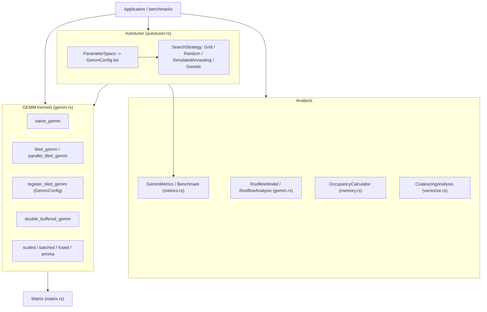
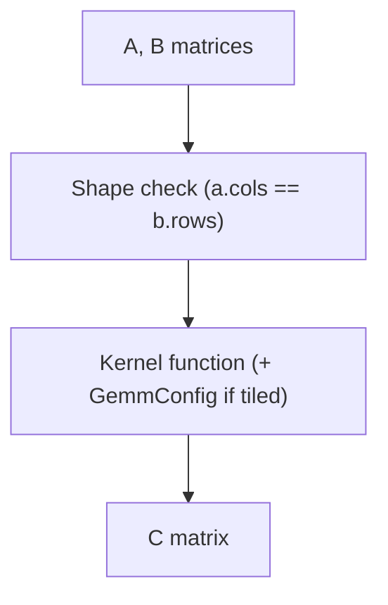
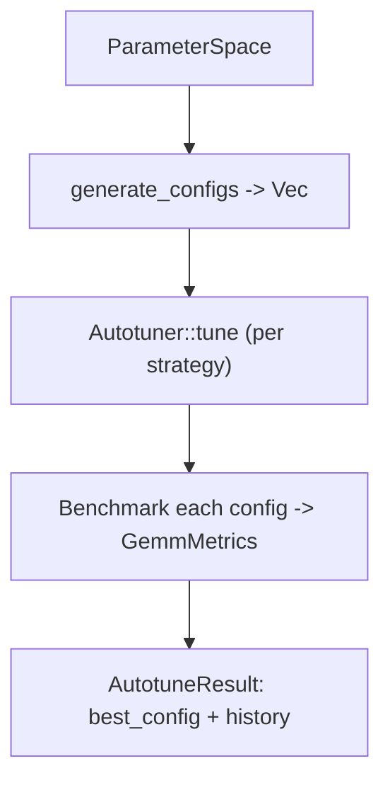

# GPU GEMM Optimization - System Architecture

## Overview

This project implements progressively optimized General Matrix Multiplication
(GEMM) kernels together with GPU-oriented analysis tools (roofline, occupancy,
shared-memory bank conflicts, memory coalescing). It is written in Rust and runs
on the CPU, but the kernel structure and optimization concepts mirror GPU kernel
development.

The crate is **function-oriented**: kernels are free functions over `Matrix`
values, and the supporting types are plain data structs. There is no monolithic
"kernel object" — you pick a kernel function and, where relevant, pass a
`GemmConfig`.

## System Components



## Module Architecture

### Matrix Module (`matrix.rs`)
- **Purpose**: Core dense matrix type and layout helpers.
- **Key items**:
  - `Matrix`: row-major storage with public `data`, `rows`, `cols`.
  - Factories `zeros` / `ones` / `random` / `identity`; accessors `get` / `set` /
    `get_mut` / `row_ptr` / `row_ptr_mut`; utilities `transpose`,
    `frobenius_norm`, `approx_eq`, `max_diff`, `max_relative_error`.
  - `Layout` enum (`RowMajor`, `ColumnMajor`) plus `convert_layout`,
    `pack_matrix_a`, `pack_matrix_b`.

### GEMM Module (`gemm.rs`)
- **Purpose**: Progressively optimized GEMM kernels and roofline analysis.
- **Key items**:
  - `GemmConfig`: block/thread tile sizes (`block_m/n/k`, `thread_m/n`) with
    `validate()`.
  - `GemmKernel`: a trait (`compute`, `name`) for wrapping a kernel behind a
    common interface.
  - Kernel functions: `naive_gemm`, `tiled_gemm`, `register_tiled_gemm`,
    `parallel_tiled_gemm`, `double_buffered_gemm`, `scaled_gemm`, the batched
    family, the fused-activation family (`Activation`, `gemm_activation`,
    `gemm_bias_activation`, `gemm_fused`), and the WMMA simulation
    (`WmmaConfig`, `WmmaFragment`, `wmma_mma_sync`, `wmma_gemm`).
  - Roofline: `RooflineModel`, `RooflineAnalysis`, `PerformanceBound`.

### Autotuner Module (`autotuner.rs`)
- **Purpose**: Search a configuration space for a good `GemmConfig`.
- **Key items**:
  - `Autotuner`: `new(config, param_space)` and `tune(a, b, kernel_fn)`.
  - `AutotuneConfig`, `SearchStrategy` (`GridSearch`, `Random`,
    `SimulatedAnnealing`, `Genetic`).
  - `ParameterSpace` (with `small()` / `large()` presets, `generate_configs`).
  - `AutotuneResult`, plus `TuningCache` and `HeuristicSelector` helpers.

### Metrics Module (`metrics.rs`)
- **Purpose**: Performance measurement and reporting.
- **Key items**:
  - `GemmMetrics`: GFLOPS, bandwidth, arithmetic intensity, efficiency.
  - `Benchmark`: warmup + measurement loop over a kernel closure.
  - `BenchmarkResults`, `PerformanceModel`, `KernelComparison`, `MemoryProfile`.

### Vectorize Module (`vectorize.rs`)
- **Purpose**: SIMD-style vector loads/stores and coalescing analysis.
- **Key items**:
  - `Float4`, `Float8` vector types; `VectorizedOps` trait and `SimdVectorOps`.
  - `CoalescingAnalysis` for memory-access-pattern evaluation.

### Memory Module (`memory.rs`)
- **Purpose**: Shared-memory and occupancy modeling.
- **Key items**:
  - Constants `NUM_BANKS`, `BANK_WIDTH`, `MAX_SHARED_MEM`.
  - `BankConflictAnalysis`, `SharedMemoryConfig`.
  - `OccupancyCalculator` (with `ampere()` / `volta()` / `turing()` presets),
    `KernelRequirements`, `OccupancyResult`, `MemoryAccessPattern`.

## Data Flow

### Standard GEMM Operation



### Autotuning Workflow



## Optimization Concepts

The kernels demonstrate the standard GEMM optimization progression:

1. **Naive** (`naive_gemm`): one output element per "thread", no reuse.
2. **Tiling** (`tiled_gemm`, `parallel_tiled_gemm`): block the computation so
   operand tiles stay resident (simulated shared memory); the parallel variant
   distributes tiles across threads with `rayon`.
3. **Register blocking** (`register_tiled_gemm`): each thread accumulates a
   `thread_m × thread_n` micro-tile in registers, driven by `GemmConfig`.
4. **Software pipelining** (`double_buffered_gemm`): overlap loading of the next
   tile with computation of the current one.
5. **Fusion** (`gemm_activation`, `gemm_bias_activation`, `gemm_fused`): fold
   bias add, activation, and scaling into the GEMM pass.
6. **Tensor Cores** (`wmma_gemm`): tile the problem into fixed-size WMMA
   fragments and accumulate with `wmma_mma_sync`.

## Performance Analysis

### Roofline Model

`RooflineModel` classifies a workload as `ComputeBound`, `MemoryBound`, or
`Balanced` by comparing its arithmetic intensity to the hardware ridge point:

```
theoretical_peak = min(peak_gflops, arithmetic_intensity * peak_bandwidth_gbs)
ridge_point       = peak_gflops / peak_bandwidth_gbs
```

`analyze_gemm` returns a `RooflineAnalysis` (arithmetic intensity, theoretical
peak, achieved GFLOPS, efficiency percent, bound, ridge point) and
`recommendations()` yields tuning hints based on the bound.

### Occupancy

`OccupancyCalculator` models an SM (threads, blocks, registers, and shared
memory per SM) and, given `KernelRequirements`, returns an `OccupancyResult`
including the achieved occupancy and its `LimitingFactor`.

### Metrics

`GemmMetrics::calculate` derives GFLOPS, effective bandwidth, arithmetic
intensity, and efficiency from a measured `Duration` and a peak-GFLOPS estimate.
`Benchmark` wraps warmup and repeated measurement, returning the median-time
`GemmMetrics`.

## Error Handling

The crate uses a single error enum, `Error`, with two variants:

- `Error::DimensionMismatch(String)` — incompatible matrix or batch shapes.
- `Error::InvalidConfig(String)` — an invalid `GemmConfig` (block tile not
  divisible by thread tile), reported by `GemmConfig::validate`.

All fallible operations return `Result<T> = std::result::Result<T, Error>`.

## Dependencies

### Core
- `rayon`: data-parallel tile execution.
- `rand`: random matrix / config generation.
- `thiserror`: `Error` derivation.

### Development
- `criterion`: benchmarking harness (`gemm_benchmarks`).

## Performance Characteristics

### Time Complexity
- GEMM: O(M × N × K) for all kernels; tiling and register blocking improve the
  constant factor and cache behavior, not the asymptotic cost.

### Space Complexity
- Inputs: O(M×K + K×N); output: O(M×N); per-tile working memory: O(tile_size²).
