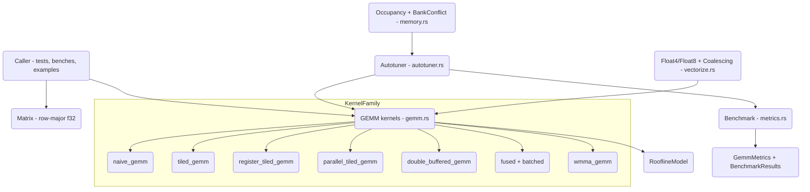

# GPU GEMM Optimization (cuBLAS-lite)

## Overview

This project is a Rust library that teaches the techniques behind high-performance
GPU matrix multiplication by implementing them on the CPU. General Matrix
Multiplication — `C = alpha * A * B + beta * C` — is the workhorse of dense linear
algebra and deep learning, and the gap between a naive triple loop and a tuned
vendor kernel (cuBLAS, rocBLAS) is two to three orders of magnitude. That gap is
closed by a well-understood sequence of optimizations: blocking for the memory
hierarchy, reusing data in fast storage, overlapping memory traffic with compute,
issuing wide vector loads, and feeding specialized matrix units. This library
implements each step as a separate, testable kernel so the progression can be read,
benchmarked, and reasoned about without a GPU.

The kernels execute on the CPU, but the *structure* mirrors GPU code. A thread block
becomes a tile loop, shared memory becomes a stack-allocated tile buffer, registers
become a small fixed-size accumulator array, and a warp of cooperating threads
becomes a Rayon parallel iterator. The simulated abstractions are deliberate: they
let a reader map each line of CPU code onto its CUDA counterpart while keeping the
build dependency-free (`rayon`, `rand`, `thiserror` only) and runnable anywhere.

Beyond the kernels themselves, the library models the *analysis* side of kernel
optimization. A roofline model classifies a workload as compute- or memory-bound and
emits recommendations. An occupancy calculator reproduces the NVIDIA block-residency
arithmetic across Ampere, Volta, and Turing. A bank-conflict analyzer detects shared
memory access collisions and suggests padding. A coalescing analyzer scores memory
access patterns. An autotuner searches the kernel configuration space with four
strategies and caches the winners. Together these turn the project into a working
sandbox for the full optimization loop: write a kernel, measure it, analyze the
bottleneck, retune, repeat.

**Scope.** The library covers single-precision (`f32`) GEMM and its common fused and
batched forms, plus the modeling tools above. It does not target GPU execution, mixed
precision, or sparse formats; the WMMA path is a fragment-level simulation of the
Tensor Core programming model rather than real hardware MMA. Everything is correct
and benchmarkable on the CPU, and every kernel is validated against the naive
reference to within `1e-3` relative error.

**Concepts taught.** Cache/shared-memory tiling; register blocking and outer-product
accumulation; software pipelining via double buffering; arithmetic intensity and the
roofline model; occupancy and its limiting resources; shared-memory bank conflicts;
memory coalescing; vectorized loads; operator fusion; batched and strided-batched
GEMM; and black-box autotuning with grid, random, simulated-annealing, and genetic
search.

**Design philosophy.** Two principles run through the code. First, *every optimization
is a separate, named function* rather than a flag on one mega-kernel, so the diff
between two rungs of the ladder is exactly the optimization being taught — a reader can
hold `naive_gemm` and `tiled_gemm` side by side and see precisely what tiling adds.
Second, *measurement and analysis are first-class*, not afterthoughts: the same FLOP
and byte accounting underlies `GemmMetrics`, `RooflineModel`, and `PerformanceModel`,
so a number reported by the benchmark can be checked against the number predicted by
the model. The result is a codebase where you can not only run an optimization but
explain, before and after, why it should and did move the needle. That explain-ability
is the real deliverable; the CPU execution is just the substrate that makes it
runnable everywhere without special hardware.

## Architecture



The crate is organized into six modules, re-exported from `lib.rs`:

- **`matrix`** is the data layer: a dense row-major `f32` matrix plus layout
  conversion and GPU-style packing helpers. Every other module consumes `Matrix`.
- **`gemm`** holds the kernel family and two analysis types (`RooflineModel`,
  `RooflineAnalysis`) that share the GEMM FLOP/byte accounting.
- **`metrics`** wraps kernels in a warmup/measure `Benchmark` harness, computes
  `GemmMetrics`, and provides a roofline-flavored `PerformanceModel` and a
  `KernelComparison` table.
- **`autotuner`** drives kernels through `Benchmark` to search `GemmConfig` space.
- **`vectorize`** provides SIMD-style vector types and a vectorized GEMM, plus
  coalescing analysis.
- **`memory`** models the on-chip resources that constrain a GPU kernel: shared
  memory banks and occupancy.

The dependency direction is strictly downward: `autotuner` depends on `gemm` and
`metrics`; `metrics` and `vectorize` depend on `matrix`; `memory` is standalone
(it analyzes address lists, not matrices). There are no cycles, and the public
surface is a flat set of free functions plus a handful of structs.

### Error handling

The crate defines one error type used throughout:

```rust
#[derive(thiserror::Error, Debug)]
pub enum Error {
    #[error("Dimension mismatch: {0}")]
    DimensionMismatch(String),
    #[error("Invalid configuration: {0}")]
    InvalidConfig(String),
}
pub type Result<T> = std::result::Result<T, Error>;
```

`DimensionMismatch` guards every kernel entry point (`A.cols == B.rows`, and `C`
shaped `M x N`); `InvalidConfig` guards `GemmConfig::validate` and surfaces from the
autotuner when no configuration produced a valid run. Kernels return `Result<()>` and
mutate the output matrix in place rather than allocating, matching the BLAS calling
convention and keeping hot loops allocation-free.

### Optimization progression

The kernel ladder is the spine of the project. Each rung removes a specific bottleneck
that the previous rung exposes, and the analysis modules exist to *name* that
bottleneck before the next rung is added. Read top to bottom, the progression is:

1. **Naive** — correctness baseline. Bottleneck: zero data reuse; every output element
   re-streams a row of `A` and a column of `B`. Arithmetic intensity is at its floor.
2. **Shared-memory tiling** — load a tile of each operand once into fast local storage
   and reuse it across the tile. Bottleneck removed: redundant global loads.
   Bottleneck exposed: each value is still loaded from "shared memory" into the ALU on
   every use.
3. **Register tiling** — give each thread a micro-tile and accumulate an outer product
   in registers. Bottleneck removed: shared-memory load pressure. Bottleneck exposed:
   the kernel stalls waiting for the next tile to arrive.
4. **Double buffering** — prefetch the next K-tile while computing the current one.
   Bottleneck removed: load latency on the critical path.
5. **Vectorized loads** (`vectorize.rs`) — issue wide `Float4`/`Float8` loads to use
   the full memory-transaction width. Bottleneck removed: under-utilized load width.
6. **Tensor Cores** (`wmma_gemm`) — hand fixed-size fragments to a dedicated
   matrix-multiply unit. Bottleneck removed: scalar ALU throughput ceiling.

On a real GPU each step is worth roughly an order of magnitude; on the CPU the *shape*
of each transformation is preserved even though absolute timings differ. The autotuner
then searches within a rung (the block/thread geometry of register tiling) for the
configuration that best fits a particular problem and machine.

## Core Components

### Matrix (`matrix.rs`)

`Matrix` is a flat `Vec<f32>` in row-major order with explicit `rows`/`cols`. Indexing
is `data[row * cols + col]`, exposed through inlined `get`/`set`/`get_mut` and slice
accessors `row_ptr`/`row_ptr_mut`. Constructors cover the common cases — `zeros`,
`ones`, `random` (uniform in `[-1, 1)`), and `identity`.

Correctness tooling lives here because every kernel test depends on it: `approx_eq`
compares two matrices within a relative tolerance, `max_diff` and
`max_relative_error` quantify divergence, and `frobenius_norm` gives a cheap scalar
summary used to assert results are finite and non-zero.

Two GPU-flavored utilities round out the module. `convert_layout` transposes between
row-major and column-major storage — the canonical trick for making one operand's
inner-loop access contiguous. `pack_matrix_a`/`pack_matrix_b` reorganize a matrix into
contiguous tile blocks, simulating the data-packing pass that real GEMM libraries run
to guarantee coalesced/streaming access inside the microkernel:

```rust
pub fn pack_matrix_a(a: &Matrix, block_m: usize, block_k: usize) -> Vec<f32> {
    let (m, k) = (a.rows, a.cols);
    let num_blocks_m = (m + block_m - 1) / block_m;
    let num_blocks_k = (k + block_k - 1) / block_k;
    let mut packed = vec![0.0; num_blocks_m * num_blocks_k * block_m * block_k];
    // each (bm, bk) block is laid out contiguously, zero-padded at the edges
    // ...
    packed
}
```

Edge tiles are zero-padded so the microkernel can run a fixed tile size without
boundary branches — the same reason GPU kernels pad tiles to the block dimension.

The comparison helpers deserve emphasis because they define what "correct" means for
every kernel. `approx_eq` uses a *relative* tolerance with a floor of 1.0 in the
denominator, so it neither rejects valid results near zero nor accepts large absolute
errors on large values — the right notion for accumulated floating-point sums.
`max_relative_error` exposes the worst per-element relative error directly, used when a
test needs to report *how* far off a result is rather than a pass/fail. These choices
are what let the suite assert that, say, the double-buffered kernel matches naive to
`1e-3` across random inputs without flaking on edge magnitudes.

### GEMM kernels (`gemm.rs`)

The kernels form a ladder, each adding one optimization. They share the same
signature contract (validate dimensions, then fill `C`) and are individually
verifiable against `naive_gemm`.

**Stage 1 — `naive_gemm`.** The textbook triple loop: one accumulation per output
element, no reuse. Every `C[i][j]` re-reads a full row of `A` and column of `B` from
"global memory." This is the GPU "one thread per output element" baseline and the
correctness oracle for all other kernels.

**Stage 2 — `tiled_gemm`.** Block-level tiling. The output is partitioned into
`tile_size x tile_size` tiles; for each output tile the kernel streams the
corresponding tiles of `A` and `B` into stack buffers (`a_tile`, `b_tile`) — the
"shared memory" stand-in — accumulates partial products into `c_acc`, then writes
back. Each loaded tile is reused `tile_size` times, raising arithmetic intensity. Edge
tiles are zero-padded inside the load step.

**Stage 3 — `register_tiled_gemm`.** Two-level tiling. A block tile (`block_m x
block_n`, stepping `block_k` in K) is subdivided so each simulated thread owns a
`thread_m x thread_n` micro-tile. The inner loop loads a column slice of `A` and a row
slice of `B` into fixed-size register arrays and computes an outer product into a
`c_regs` accumulator:

```rust
// register accumulators for one "thread" (TM x TN)
let mut c_regs = [[0.0f32; 8]; 8];
let mut a_regs = [0.0f32; 8];
let mut b_regs = [0.0f32; 8];
for k_offset in 0..bk.min(k - kk) {
    for i in 0..tm { a_regs[i] = /* A[row][k] */ ; }
    for j in 0..tn { b_regs[j] = /* B[k][col] */ ; }
    for i in 0..tm {
        for j in 0..tn {
            c_regs[i][j] += a_regs[i] * b_regs[j]; // outer product
        }
    }
}
```

This is the heart of every fast GEMM: the `O(TM*TN)` multiply-adds per loaded
`O(TM+TN)` operands amortize memory traffic across the register file. The fixed
`[8][8]` arrays cap `thread_m`/`thread_n` at 8, which is reflected in the default
configuration.

**`parallel_tiled_gemm`.** The tiling of Stage 2, but output tiles are processed
independently across a Rayon `into_par_iter`, each producing its `c_acc`, with results
written back serially afterward. This simulates many thread blocks executing
concurrently on independent SMs.

**Stage 4 — `double_buffered_gemm`.** Software pipelining. Two pairs of tile buffers
(`a_buffer[2]`, `b_buffer[2]`) let the kernel prefetch the next K-tile while computing
on the current one, swapping `buffer_idx` each iteration. On a GPU this overlaps
global-memory latency with arithmetic; here it demonstrates the data-flow structure of
the optimization.

**BLAS scaling — `scaled_gemm`.** Implements the full `C = alpha * A*B + beta * C`,
reading the prior `C` value before overwriting it.

**Fused operations.** `gemm_activation`, `gemm_bias_activation`, and `gemm_fused`
apply an `Activation` to each output as it is produced, avoiding a second pass over
`C`. The `Activation` enum implements `None`, `ReLU`, `LeakyReLU(alpha)`, `GeLU` (tanh
approximation), `Sigmoid`, `Tanh`, and `SiLU`, each via an inlined `apply`. `gemm_fused`
is the most general form: `alpha * activation(A*B + bias) + beta * C` with an optional
bias. Fusion is the canonical bandwidth optimization for neural-network layers: a
non-fused pipeline would write the GEMM result to memory, read it back, apply the
activation, and write again — three extra `M*N` memory passes that fusion eliminates by
applying the activation to each accumulator while it is still in a register. The bias
length is validated against the output column count so a `Linear + ReLU` layer maps
directly onto `gemm_bias_activation`, the exact shape deep-learning frameworks fuse.

**Batched operations.** `batched_gemm` and `batched_scaled_gemm` run independent
multiplications over slices of matrices in parallel with `par_iter_mut` — the access
pattern of multi-head attention, where each head is its own small GEMM. Both validate
every matrix in the batch up front (matching batch lengths, and `A.cols == B.rows`,
`C` shaped per element) before dispatching, so a malformed batch fails before any work
starts. `strided_batched_gemm` operates on a single contiguous buffer with per-matrix
strides (the 3D-tensor layout used by deep-learning frameworks); because the output
offsets `batch * stride_c` provably do not overlap across batches, it writes through a
raw pointer inside the parallel loop, the one place the crate steps outside safe
indexing and documents exactly why it is sound. This is the layout a framework hands to
cuBLAS's `cublasSgemmStridedBatched`, reproduced so the strided indexing arithmetic is
visible.

**Tensor Core simulation.** `WmmaFragment` is a small dense tile with
`load_matrix_sync`/`store_matrix_sync`/`fill`, modeling the warp-distributed fragments
of the WMMA API. `wmma_mma_sync` computes `D = A*B + C` over fragments, and `wmma_gemm`
tiles a full GEMM into `WmmaConfig`-sized fragments (default 16x16x16, plus 8x32x16 and
32x8x16 presets) and accumulates across K. The control flow mirrors real WMMA code:
for each output fragment, initialize the accumulator from `C`, then loop over K loading
an `A` fragment and a `B` fragment, calling `wmma_mma_sync` to fuse multiply and add,
and finally store the accumulator back. The fragment-distributed register layout of
real hardware is collapsed to a dense array here, so the simulation captures the *API
shape and tiling*, not the warp-cooperative storage or the hardware throughput.

```rust
for tile_m in (0..m).step_by(wmma_m) {
    for tile_n in (0..n).step_by(wmma_n) {
        let mut c_frag = WmmaFragment::new(wmma_m, wmma_n);
        c_frag.load_matrix_sync(c, tile_m, tile_n);   // accumulator init
        for tile_k in (0..k).step_by(wmma_k) {
            let mut a_frag = WmmaFragment::new(wmma_m, wmma_k);
            let mut b_frag = WmmaFragment::new(wmma_k, wmma_n);
            a_frag.load_matrix_sync(a, tile_m, tile_k);
            b_frag.load_matrix_sync(b, tile_k, tile_n);
            let mut d_frag = WmmaFragment::new(wmma_m, wmma_n);
            wmma_mma_sync(&a_frag, &b_frag, &c_frag, &mut d_frag)?; // D = A*B + C
            c_frag = d_frag;
        }
        c_frag.store_matrix_sync(c, tile_m, tile_n);
    }
}
```

**Roofline analysis.** `RooflineModel` (peak GFLOPS, peak GB/s) computes the ridge
point, the theoretical peak for a given arithmetic intensity, and a `PerformanceBound`
classification. Its GEMM-specific helpers compute arithmetic intensity for both
untiled and tiled access, and `analyze_gemm` packages everything into a
`RooflineAnalysis` whose `recommendations` returns concrete next steps keyed off the
bound and measured efficiency. A `MemoryBound` result recommends more tiling and
coalesced access; a `ComputeBound` result recommends inner-loop and Tensor Core work;
and an efficiency below 50% adds bank-conflict and alignment checks regardless of
bound. This closes the loop back to the kernel ladder: the analysis tells the
developer which rung to climb next.

The dimension and configuration guards run first in every kernel, so an out-of-shape
call fails fast with a descriptive `DimensionMismatch` rather than producing silent
garbage or panicking on an out-of-bounds index. Because kernels never allocate the
output, a caller can reuse one `C` buffer across many invocations — the pattern the
`Benchmark` runner relies on to time a kernel repeatedly without allocation noise.

### Autotuner (`autotuner.rs`)

The autotuner searches `GemmConfig` space for the configuration that maximizes
measured GFLOPS on a given problem. It is generic over the kernel under test via a
closure `Fn(&Matrix, &Matrix, &mut Matrix, &GemmConfig) -> Result<()>`, so the same
search drives `register_tiled_gemm` or any compatible kernel.

`ParameterSpace` enumerates candidate `block_m/n/k` and `thread_m/n` values, with
`default`, `small`, and `large` presets. `generate_configs` takes the Cartesian
product and keeps only configurations that pass `GemmConfig::validate`
(`block_m % thread_m == 0`, `block_n % thread_n == 0`).

`AutotuneConfig` selects the `SearchStrategy` and bounds the search by `max_trials`,
an optional `time_budget`, an `early_stop` patience counter, and `benchmark_iters`.
The four strategies:

- **`GridSearch`** evaluates configurations in enumeration order up to `max_trials`,
  tracking the best and stopping early after `early_stop` non-improving trials.
- **`Random`** samples configurations uniformly with the same best-tracking and
  early-stop logic — cheaper coverage of a large space.
- **`SimulatedAnnealing`** starts from the default config and at each step mutates one
  parameter (`mutate_config`), accepting worse neighbors with probability
  `exp(delta / temperature)` while the temperature cools by 0.95 per step until it
  falls below `0.01`.
- **`Genetic`** maintains a population of 20, keeps 4 elites per generation, and
  produces children by tournament selection, uniform `crossover`, and probabilistic
  mutation, validating each child before admission.

Each evaluation goes through `Benchmark::run`, which warms up, measures
`benchmark_iters` times, and reports the median to suppress outliers. Results are
returned as an `AutotuneResult` with the best config, its metrics, the trial count,
wall time, and the full history.

The genetic strategy is the most elaborate. `tournament_select` picks the fittest of
three random population members, `crossover` builds a child by choosing each of the
five parameters from one parent or the other with equal probability, and
`mutate_config` randomly resamples a single parameter from its allowed set. Invalid
children (those failing `GemmConfig::validate`) are rejected and the slot is retried,
so the population stays inside the feasible region across generations. Simulated
annealing reuses the same `mutate_config` neighbor function but explores via the
Metropolis acceptance rule rather than a population.

A typical tuning call looks like:

```rust
let tuner = Autotuner::new(
    AutotuneConfig { strategy: SearchStrategy::Genetic, max_trials: 60, ..Default::default() },
    ParameterSpace::large(),
);
let result = tuner.tune(&a, &b, |a, b, c, cfg| register_tiled_gemm(a, b, c, cfg))?;
// result.best_config is the winning block/thread geometry;
// result.history records every (config, metrics) pair evaluated.
```

Two convenience layers sit on top. `TuningCache` memoizes the best config per
`(M, N, K)` and exposes `get_or_tune` so repeated calls on the same shape skip the
search — the amortization strategy real frameworks use when the same layer shape
recurs across iterations. `HeuristicSelector` skips search entirely, returning a
hand-tuned config based on `max(M, N)` size thresholds (64, 256, 1024, larger) — the
fast path when tuning latency matters more than peak performance. Smaller problems get
smaller block tiles (e.g. 32x32x8 with 4x4 micro-tiles) and larger problems get larger
ones (256x256x16 with 8x8 micro-tiles), reflecting the usual occupancy-versus-reuse
trade-off.

### Metrics and benchmarking (`metrics.rs`)

`GemmMetrics::calculate` is the shared accounting: FLOPs = `2*M*N*K`, bytes =
`4*(M*K + K*N + M*N)`, from which it derives GFLOPS, effective bandwidth, arithmetic
intensity, and efficiency against a configurable `peak_gflops`.

`Benchmark` runs a kernel through `warmup_iters` untimed iterations then
`measure_iters` timed ones, returning median-based `GemmMetrics` from `run` or a full
statistical `BenchmarkResults` from `run_detailed`. `BenchmarkResults` computes min,
median, mean, standard deviation, coefficient of variation, and both best- and
median-case GFLOPS — the standard guard against benchmark noise.

`PerformanceModel` is a second roofline implementation oriented toward CPU prediction:
it holds memory bandwidth, peak compute, and three cache sizes, and exposes
`predict_gflops`, `ridge_point`, `is_memory_bound`, and an `optimal_tile_size`
heuristic that sizes a tile so three tile-matrices fit in a chosen cache level. The
prediction is the roofline minimum: `min(peak_compute, bandwidth * intensity)`, so the
model returns the bandwidth-limited number below the ridge point and the compute peak
above it. The tests pin this behavior at known points (intensity 1.0 with a ridge of
2.0 returns the 50 GB/s-scaled value; intensity 3.0 returns the 100 GFLOPS peak),
which doubles as documentation of the roofline shape.

`KernelComparison` aggregates multiple `BenchmarkResults` and prints a speedup table
relative to a named baseline — the canonical way to present "naive → tiled → register
→ double-buffered" as a sequence of multipliers. `MemoryProfile` estimates cache
hit/miss counts for naive vs tiled access patterns from closed-form expressions over
the tile and cache-line sizes, giving a back-of-the-envelope reason for the speedups
the benchmark measures: the naive profile charges a miss for every column read of `B`,
while the tiled profile amortizes loads over `tile_size^2` reuse.

### Vectorization (`vectorize.rs`)

`Float4` and `Float8` are explicit SIMD-style vector types (the module avoids the
unstable `std::simd`). `Float4` supports `add`, `scale`, and a true fused
`fma` via `f32::mul_add`; `Float8` carries an 8-lane array. The `VectorizedOps` trait
plus `SimdVectorOps` implementation provide aligned `load_float4`/`load_float8` and
matching stores, simulating GPU wide loads such as `LDG.128`.

`vectorized_gemm` and `vectorized_gemm_transposed_b` use these loads in the inner K
loop, splitting K into a vectorized body and a scalar tail. The transposed variant
makes both operands contiguous along K so both loads are "coalesced," demonstrating why
GEMM kernels often pre-transpose `B`.

`CoalescingAnalysis::analyze` scores a list of `(row, col)` accesses by linearizing
them under the declared layout and counting unit-stride (coalesced) versus
larger-stride accesses, yielding an efficiency in `[0, 1]`. Row-major sequential
access scores near 1.0; column access in row-major layout scores below 0.5. The
analyzer also reports the average non-unit stride, which is exactly the figure that
predicts how many separate memory transactions a warp would issue on real hardware — a
stride of 1 coalesces into one transaction, a stride equal to the row width forces one
transaction per thread.

The two `vectorized_gemm` variants make the layout lesson concrete. The plain variant
reads `A` contiguously but gathers `B` down a column (`b[kk*n + j]`), so only the `A`
load is wide; the transposed variant reads `B_T` contiguously too, so both loads are
`Float4`-wide and aligned. The difference is the same one `convert_layout` exists to
create, tying the data layer (`matrix.rs`) and the vector layer (`vectorize.rs`)
together around a single idea: arrange storage so the inner loop streams.

### Memory modeling (`memory.rs`)

This module models the two on-chip resources that most constrain GPU kernels.

`BankConflictAnalysis::analyze` maps each byte address to a bank via
`(addr / BANK_WIDTH) % NUM_BANKS` (4-byte banks, 32 banks), counts accesses per bank,
and reports the conflict count (`n` accesses to a bank = `n-1` conflicts), the worst
bank, the conflict ratio, and a `suggested_padding` that, when added per row, would
spread the colliding accesses across distinct banks. `SharedMemoryConfig` applies that
idea: it stores a tile with an optional per-row padding, computes stride and byte size,
and `with_auto_padding` adds a pad element when the row width is an exact multiple of
the bank count — the classic `[TILE][TILE + 1]` fix.

`OccupancyCalculator` reproduces NVIDIA's occupancy arithmetic. Given
`KernelRequirements` (threads/block, registers/thread, shared memory/block) it computes
the maximum resident blocks per SM as the minimum of the thread, register, and
shared-memory limits, records which resource is the `limiting_factor`, and reports
active warps and occupancy percentage. Presets `ampere`, `volta`, and `turing` carry
each architecture's real limits (e.g. Ampere: 2048 threads/SM, 65536 registers/SM,
164KB shared memory/SM). `find_optimal_block_size` sweeps common block sizes and
returns the one with the highest modeled occupancy.

`MemoryAccessPattern::analyze` classifies an address list as `Sequential`, `Strided`,
`Random`, or `Broadcast` and predicts a coarse cache behavior, used to reason about
access quality independent of the matrix kernels. A `Broadcast` pattern (all threads
reading the same address) is recognized as a cache hit because hardware serves it from
one cache line, while a large-stride pattern is predicted to miss — the qualitative
companion to the quantitative `CoalescingAnalysis`.

Taken together, the `memory` module answers the two questions that gate a tiled
kernel's performance: *how many blocks can run concurrently* (occupancy) and *will the
shared-memory accesses serialize* (bank conflicts). Both are pure functions of a
kernel's resource requirements and access pattern, so they can be evaluated before a
kernel is ever run — which is precisely how a developer chooses a tile size. The
constants (`NUM_BANKS = 32`, `BANK_WIDTH = 4`, the per-architecture limits) are the
real NVIDIA values, so the modeled numbers line up with what a profiler would report
for the same configuration even though no profiling occurs here.

## Data Structures

```rust
/// Dense row-major f32 matrix (matrix.rs).
pub struct Matrix {
    pub data: Vec<f32>,
    pub rows: usize,
    pub cols: usize,
}

/// Storage order; convert_layout moves between them.
pub enum Layout { RowMajor, ColumnMajor }

/// Block/thread tiling configuration for register_tiled_gemm (gemm.rs).
pub struct GemmConfig {
    pub block_m: usize,  // block tile M
    pub block_n: usize,  // block tile N
    pub block_k: usize,  // block tile K
    pub thread_m: usize, // thread tile M (<= 8)
    pub thread_n: usize, // thread tile N (<= 8)
}
// Default: 64, 64, 8, 8, 8
// validate(): block_m % thread_m == 0 && block_n % thread_n == 0

/// Fused-kernel activation functions.
pub enum Activation {
    None, ReLU, LeakyReLU(f32), GeLU, Sigmoid, Tanh, SiLU,
}

/// Tensor Core fragment shape (gemm.rs). Default 16x16x16.
pub struct WmmaConfig { pub m: usize, pub n: usize, pub k: usize }

/// A simulated warp-distributed matrix fragment.
pub struct WmmaFragment { /* data: Vec<f32>, rows, cols */ }
```

```rust
/// Roofline hardware model (gemm.rs).
pub struct RooflineModel {
    pub peak_gflops: f64,
    pub peak_bandwidth_gbs: f64,
}
pub enum PerformanceBound { ComputeBound, MemoryBound, Balanced }
pub struct RooflineAnalysis {
    pub arithmetic_intensity: f64,
    pub theoretical_peak_gflops: f64,
    pub achieved_gflops: f64,
    pub efficiency_percent: f64,
    pub bound: PerformanceBound,
    pub ridge_point: f64,
}
```

```rust
/// Performance accounting per run (metrics.rs).
pub struct GemmMetrics {
    pub execution_time: std::time::Duration,
    pub dimensions: (usize, usize, usize),
    pub gflops: f64,
    pub bandwidth_gbs: f64,
    pub arithmetic_intensity: f64,
    pub efficiency: f64,
}

/// Statistical benchmark result.
pub struct BenchmarkResults {
    pub dimensions: (usize, usize, usize),
    pub times: Vec<std::time::Duration>,
    pub min_time: std::time::Duration,
    pub median_time: std::time::Duration,
    pub mean_time: std::time::Duration,
    pub std_dev: std::time::Duration,
    pub best_gflops: f64,
    pub median_gflops: f64,
}
```

```rust
/// Autotuning state (autotuner.rs).
pub enum SearchStrategy { GridSearch, Random, SimulatedAnnealing, Genetic }
pub struct AutotuneConfig {
    pub strategy: SearchStrategy,
    pub max_trials: usize,
    pub time_budget: Option<std::time::Duration>,
    pub early_stop: usize,
    pub benchmark_iters: usize,
}
pub struct ParameterSpace {
    pub block_m: Vec<usize>, pub block_n: Vec<usize>, pub block_k: Vec<usize>,
    pub thread_m: Vec<usize>, pub thread_n: Vec<usize>,
}
pub struct AutotuneResult {
    pub best_config: GemmConfig,
    pub best_metrics: GemmMetrics,
    pub num_trials: usize,
    pub total_time: std::time::Duration,
    pub history: Vec<(GemmConfig, GemmMetrics)>,
}
```

```rust
/// Memory modeling types (memory.rs).
pub const NUM_BANKS: usize = 32;
pub const BANK_WIDTH: usize = 4;
pub const MAX_SHARED_MEM: usize = 49152;

pub struct OccupancyResult {
    pub blocks_per_sm: usize,
    pub warps_per_sm: usize,
    pub max_warps_per_sm: usize,
    pub occupancy: f32,
    pub limiting_factor: LimitingFactor,
}
pub enum LimitingFactor { Threads, Registers, SharedMemory, Blocks, None }
```

```rust
/// Vector types (vectorize.rs).
pub struct Float4 { pub x: f32, pub y: f32, pub z: f32, pub w: f32 }
pub struct Float8 { pub data: [f32; 8] }
pub struct CoalescingAnalysis {
    pub coalesced_count: usize,
    pub strided_count: usize,
    pub avg_stride: f32,
    pub efficiency: f32,
}
```

## API Design

The public surface (re-exported from `lib.rs`) is a flat set of free functions plus
the structs above. All kernels take immutable `A`, `B` and a mutable `C`, returning
`Result<()>`.

```text
// Core kernels (gemm.rs)
naive_gemm(a, b, c) -> Result<()>
tiled_gemm(a, b, c, tile_size) -> Result<()>
register_tiled_gemm(a, b, c, &GemmConfig) -> Result<()>
parallel_tiled_gemm(a, b, c, tile_size) -> Result<()>
double_buffered_gemm(a, b, c, tile_size) -> Result<()>
scaled_gemm(a, b, c, alpha, beta) -> Result<()>

// Fused (gemm.rs)
gemm_activation(a, b, c, Activation) -> Result<()>
gemm_bias_activation(a, b, c, &[f32] bias, Activation) -> Result<()>
gemm_fused(a, b, c, alpha, beta, Option<&[f32]> bias, Activation) -> Result<()>

// Batched (gemm.rs)
batched_gemm(&[Matrix], &[Matrix], &mut [Matrix]) -> Result<()>
batched_scaled_gemm(&[Matrix], &[Matrix], &mut [Matrix], alpha, beta) -> Result<()>
strided_batched_gemm(&[f32], &[f32], &mut [f32], batch, m, n, k, sa, sb, sc) -> Result<()>

// Tensor Core simulation (gemm.rs)
wmma_gemm(a, b, c, WmmaConfig) -> Result<()>
wmma_mma_sync(&a_frag, &b_frag, &c_frag, &mut d_frag) -> Result<()>

// Roofline (gemm.rs)
RooflineModel::new(peak_gflops, peak_bw).analyze_gemm(m, n, k, achieved) -> RooflineAnalysis
RooflineModel::gemm_arithmetic_intensity(m, n, k) -> f64

// Autotuning (autotuner.rs)
Autotuner::new(AutotuneConfig, ParameterSpace).tune(a, b, kernel_fn) -> Result<AutotuneResult>
TuningCache::get_or_tune(a, b, &tuner, kernel_fn) -> Result<GemmConfig>
HeuristicSelector::default().select(m, n, k) -> GemmConfig

// Metrics (metrics.rs)
Benchmark::new(warmup, measure, peak).run(a, b, kernel) -> Result<GemmMetrics>
Benchmark::run_detailed(a, b, kernel) -> Result<BenchmarkResults>
PerformanceModel::default().predict_gemm(m, n, k) -> f64

// Vectorize (vectorize.rs)
vectorized_gemm(&[f32], &[f32], &mut [f32], m, n, k)
CoalescingAnalysis::analyze(&[(usize, usize)], row_major, cols) -> CoalescingAnalysis

// Memory (memory.rs)
BankConflictAnalysis::analyze(&[usize] addresses) -> BankConflictAnalysis
OccupancyCalculator::ampere().calculate(&KernelRequirements) -> OccupancyResult
```

The kernel signature was chosen to mirror BLAS: caller-owned output, in-place writes,
no hidden allocation in the hot path, and an explicit error type. The autotuner's
closure-based `tune` keeps it decoupled from any specific kernel.

## Performance

The numbers that matter in this project are *relationships*, not absolute device
throughput, because execution is on the CPU.

**Arithmetic intensity.** For square `M=N=K=N`, AI = `2N^3 / (3 * 4 * N^2) = N/6`
FLOP/byte (untiled `f32`). Intensity grows linearly with size, so small matrices are
memory-bound and large ones are compute-bound. `RooflineModel::classify_bound` encodes
this: AI below half the ridge point is `MemoryBound`, above twice is `ComputeBound`,
otherwise `Balanced`. The ridge point itself is `peak_gflops / peak_bandwidth_gbs`.

**Why tiling helps.** Naive GEMM loads `O(N)` operands per output element with no
reuse. Tiling reuses each loaded tile `tile_size` times, and
`RooflineModel::tiled_gemm_arithmetic_intensity` computes the resulting (higher)
intensity directly from the tile dimensions — the quantitative form of the optimization.
The function counts the bytes actually loaded assuming perfect caching within a tile
(`A` tiles loaded `num_m_tiles * num_k_tiles` times, `B` tiles
`num_k_tiles * num_n_tiles` times, plus the `C` write) and divides the unchanged FLOP
count by that smaller byte count, so a larger tile yields a higher number — until the
tile no longer fits in cache, the trade-off `PerformanceModel::optimal_tile_size`
sizes against L1/L2/L3.

**Register blocking.** `register_tiled_gemm` performs `thread_m * thread_n`
multiply-adds per `thread_m + thread_n` loaded operands, so the FLOP-to-load ratio
scales with the micro-tile area. The default 8x8 micro-tile yields 64 MACs per 16
operand loads.

**Occupancy.** Higher occupancy hides memory latency but competes with register
blocking for the register file. `OccupancyCalculator` makes the trade-off concrete:
raising `registers_per_thread` lowers `blocks_per_sm` and flips `limiting_factor` to
`Registers`. The tests pin the expected limiting factor for representative
configurations (1024 threads/block → `Threads`; 255 registers/thread → register/block
limited). The calculation works the way the hardware does: it derives warps per block
(`ceil(threads / 32)`), multiplies by the per-thread register count to get registers
per block, and divides the SM register file by that to get the register-limited block
count; the analogous division gives the shared-memory-limited and thread-limited
counts. The minimum of those three (capped by the architectural max blocks/SM) is the
resident block count, its source becomes the `limiting_factor`, and occupancy is active
warps over the SM's maximum warps. Because each component is a named division rather
than a black box, the result explains *why* a configuration is constrained, which is
the information a developer needs to relax the right resource.

This is also the bridge back to the kernel family. `register_tiled_gemm`'s `block_m /
thread_m` by `block_n / thread_n` "threads" and its register footprint (the `c_regs`,
`a_regs`, `b_regs` arrays) map onto exactly the inputs `OccupancyCalculator` consumes,
so a developer can model a candidate `GemmConfig`'s occupancy before benchmarking it —
or feed both the modeled occupancy and the measured GFLOPS into the same decision the
autotuner automates.

**Bank conflicts.** A naive `[TILE][TILE]` shared layout with `TILE` a multiple of 32
serializes accesses onto one bank; `SharedMemoryConfig::with_auto_padding` adds a pad
element to restore one-access-per-bank. `BankConflictAnalysis` quantifies both the
conflict and the fix.

**Vectorization width.** `vectorized_gemm` splits K into a body processed four lanes
at a time via `Float4` loads and a scalar remainder, so any K is handled while wide
loads dominate when K is a multiple of four. The transposed-B variant makes both
operands contiguous along K, which is the access pattern `CoalescingAnalysis` scores
near 1.0 — the model and the kernel agree by construction.

**Parallel scaling.** `parallel_tiled_gemm`, `batched_gemm`, and `strided_batched_gemm`
parallelize over independent output tiles or batch elements with Rayon, so throughput
scales with available cores up to the point where memory bandwidth saturates — the same
ceiling the roofline model predicts. The serial write-back in `parallel_tiled_gemm`
keeps the parallel section free of synchronization; `strided_batched_gemm` proves its
output regions disjoint and writes through a raw pointer to avoid even that.

**Benchmark methodology.** All timing uses warmup iterations followed by measured
iterations, reporting the *median* (`Benchmark`) or full distribution with CV
(`BenchmarkResults`) so a single slow run does not distort results. GFLOPS are derived
from `2*M*N*K` and measured median time; efficiency is relative to a configurable
software `peak_gflops`, not a hardware peak. The repository ships no fixed benchmark
table — run `cargo bench` (Criterion, naive vs tiled at 128x128) to measure on your
own machine. `KernelComparison` formats a side-by-side speedup table when several
kernels are benchmarked on the same problem, which is the standard way to present an
optimization sequence.

## Testing Strategy

Correctness is anchored on a single oracle: the naive triple loop. The integration
suite's `verify_gemm` recomputes the product independently, and
`test_all_kernels_produce_same_result` asserts that tiled, register-tiled, parallel,
and double-buffered kernels all match naive within `1e-3`. Per-module suites
(`test_gemm.rs`, `test_matrix.rs`, `test_autotuner.rs`, `test_metrics.rs`) plus
in-module `#[cfg(test)]` tests cover the rest.

- **Unit — kernels.** Each kernel is tested on square, rectangular, identity, zero,
  and non-tile-divisible shapes, plus dimension-mismatch error paths.
- **Unit — matrix.** Constructors, get/set, transpose, layout conversion round-trips,
  packing, and the comparison helpers (`approx_eq`, `max_diff`, `frobenius_norm`).
- **Unit — autotuner.** `ParameterSpace` presets and validity filtering, all four
  search strategies returning a valid best config with positive GFLOPS, time-budget
  cutoff, `TuningCache` store/clear, and `HeuristicSelector` thresholds.
- **Unit — metrics.** `GemmMetrics::calculate` against a hand-computed GFLOPS value,
  `PerformanceModel` ridge point and roofline predictions at known points, and
  `BenchmarkResults` min/median/max ordering.
- **Unit — vectorize.** `Float4`/`Float8` arithmetic, load/store correctness, a small
  `vectorized_gemm` checked against the exact 2x2 product, and coalescing efficiency
  for sequential vs strided patterns.
- **Unit — memory.** Bank-conflict detection for conflict-free and colliding strides,
  auto-padding behavior, occupancy bounds (0–100%), and limiting-factor identification.
- **Integration / edge cases.** End-to-end workflows across multiple kernels, the full
  optimize-analyze loop (`test_full_optimization_workflow`), numerical stability across
  six orders of magnitude of scaling, identity and zero matrices, and a sweep of odd
  matrix sizes.

The decisive property — *every optimized kernel computes the same result as the naive
reference* — is exactly the invariant that must hold for a real GPU GEMM library, so
the test design transfers directly to the system it teaches. No external services,
GPUs, or credentials are required; `cargo test` runs the entire suite locally.

## References

The kernel ladder follows the classic CPU GEMM optimization literature (FLAME, Goto/van
de Geijn) and the GPU tiling hierarchy formalized by CUTLASS and the CUDA programming
guide; the analysis tooling is built on the roofline model and NVIDIA's published
occupancy and bank-conflict rules.

- [How to Optimize GEMM](https://github.com/flame/how-to-optimize-gemm) — step-by-step CPU GEMM optimization.
- [CUTLASS](https://github.com/NVIDIA/cutlass) — NVIDIA's template library for GEMM and the tiling hierarchy it formalizes.
- [CUDA C++ Programming Guide](https://docs.nvidia.com/cuda/cuda-c-programming-guide/) — shared memory, occupancy, and the WMMA API.
- [Roofline: An Insightful Visual Performance Model](https://dl.acm.org/doi/10.1145/1498765.1498785) — Williams, Waterman, Patterson.
- [Anatomy of High-Performance Matrix Multiplication](https://dl.acm.org/doi/10.1145/1356052.1356053) — Goto and van de Geijn; the packing/blocking strategy.
- [cuBLAS Documentation](https://docs.nvidia.com/cuda/cublas/) — the reference GEMM API this library imitates.
