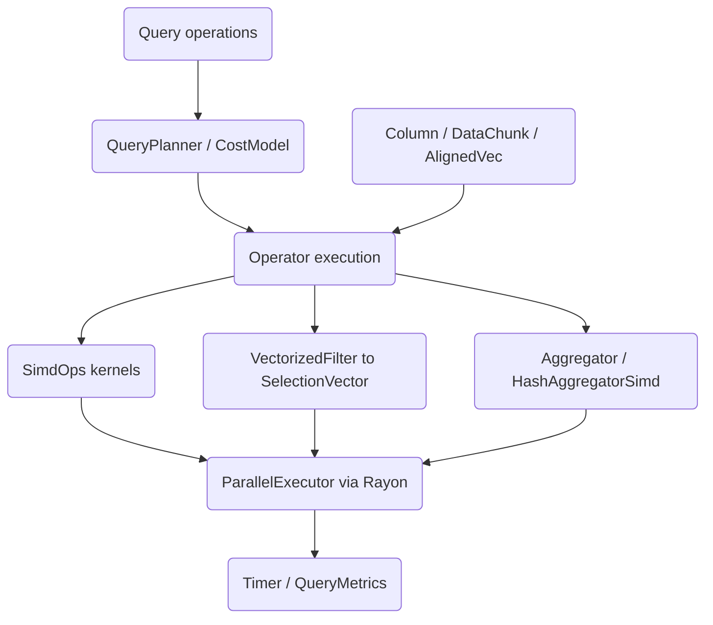

# SIMD Analytics Engine

A CPU-optimized columnar analytics engine built from scratch in Rust. It explores
auto-vectorizable kernels, cache-conscious blocking, aligned columnar storage, hash-based
operators, a cost-based query planner, and multi-core execution over scan, filter,
aggregate, and group-by pipelines.

## Features

- **Aligned columnar storage** — cache-line aligned buffers and typed columns (`AlignedVec`,
  `Column`, `DataChunk` in `column.rs`).
- **Vectorized kernels** — sum/min/max, dot product, FMA, gather/scatter, and horizontal
  reductions written to auto-vectorize (`SimdOps`, `HorizontalOps` in `simd.rs`).
- **Bitmap filtering** — predicate evaluation that produces a packed `SelectionVector`, with
  AND/OR/NOT combination and range filters (`VectorizedFilter`, `FilterOp` in `filter.rs`).
- **Aggregation** — SUM/COUNT/MIN/MAX/AVG over columns, filtered aggregates, mergeable
  partials, and Welford running statistics (`Aggregator`, `PartialAggregate` in `aggregate.rs`).
- **Hash operators** — open-addressing hash table, group-by aggregation, hash join, plus
  Bloom filter, Count-Min sketch, and HyperLogLog (`HashTable`, `HashAggregatorSimd`,
  `HashJoin` in `hash.rs`).
- **Cost-based planner** — hardware-parameterized cost model for scan/filter/aggregate/join/
  sort and parallel speedup estimates (`CostModel`, `QueryPlanner` in `planner.rs`).
- **Cache and bandwidth optimizations** — cache-blocked reductions, branch-free ops, tiled
  matrix-vector multiply, and an auto-tuner (`CacheBlockedOps`, `TiledOps`, `AutoTuner` in
  `optimize.rs`).
- **Multi-core execution** — Rayon-backed parallel sum/filter/aggregate/map and a pipeline
  abstraction (`ParallelExecutor`, `Pipeline` in `scheduler.rs`).
- **NUMA abstractions** — topology detection, partitioned vectors, and per-node allocation
  accounting (`NumaTopology`, `NumaExecutor` in `numa.rs`).
- **Metrics** — timers, throughput metrics, a benchmark runner with statistics, and a
  performance model (`Timer`, `Benchmark`, `QueryMetrics` in `metrics.rs`).

## Architecture



| Component | Module | Responsibility |
|-----------|--------|----------------|
| Storage | `column` | Aligned buffers, typed columns, multi-column chunks |
| Kernels | `simd` | Auto-vectorizable reductions and element-wise ops |
| Filtering | `filter` | Predicate evaluation into packed selection bitmaps |
| Aggregation | `aggregate` | Column and filtered aggregates, mergeable partials |
| Hashing | `hash` | Hash table, group-by, join, probabilistic structures |
| Planner | `planner` | Cost model and operator plan construction |
| Optimizers | `optimize` | Cache blocking, branch-free ops, tiling, auto-tuning |
| Scheduler | `scheduler` | Rayon parallel operators and pipeline stages |
| NUMA | `numa` | Topology, partitioned data, allocation accounting |
| Metrics | `metrics` | Timing, throughput, benchmark statistics |

## Quick Start

### Prerequisites

- Rust 1.70+ with Cargo (edition 2021)
- No external services are required to build, test, or benchmark

### Installation

```bash
cd 20-simd-analytics-engine
cargo build
```

### Running

This crate is a library. Add it as a dependency or run its tests and benchmarks:

```bash
cargo test
cargo bench
```

## Usage

```rust
use simd_analytics_engine::{
    Column, DataChunk, VectorizedFilter, FilterOp, FilterPredicate,
    Aggregator, AggregateOp, ParallelExecutor,
};

// Build a two-column chunk.
let price = Column::from_f64(&[10.0, 25.0, 7.5, 40.0, 18.0]).unwrap();
let qty = Column::from_i64(&[1, 4, 2, 1, 3]).unwrap();
let chunk = DataChunk::new(vec![price, qty]).unwrap();

// Filter rows where price > 15.0, producing a selection bitmap.
let predicate = FilterPredicate::Float64(FilterOp::Gt, 15.0);
let selection = VectorizedFilter::filter_column(chunk.column(0).unwrap(), &predicate).unwrap();
assert_eq!(selection.count(), 3); // 25.0, 40.0, 18.0

// Aggregate the price column.
let total = Aggregator::aggregate(chunk.column(0).unwrap(), AggregateOp::Sum).unwrap();
assert_eq!(total.as_f64(), Some(101.0));

// Multi-core aggregation over a larger slice.
let data: Vec<f64> = (1..=100).map(|i| i as f64).collect();
let executor = ParallelExecutor::default();
let sum = executor.parallel_aggregate_f64(&data, AggregateOp::Sum);
assert_eq!(sum.as_f64(), Some(5050.0));
```

## What's Real vs Simulated

- **Real:** Aligned columnar storage, the vectorized kernels, bitmap filtering and
  combination, scalar and hash-based aggregation, hash join, Bloom/Count-Min/HyperLogLog
  structures, the cost model and planner, cache-blocking and tiling optimizers, and
  Rayon-based multi-core execution. These are fully implemented and exercised by the tests.
- **Simulated / not yet wired:** All "SIMD" paths rely on LLVM auto-vectorization rather than
  explicit `std::arch` intrinsics; the `avx2` Cargo feature is a scaffolded flag with no
  intrinsic code behind it. NUMA support falls back to a single simulated node on systems
  without `libnuma` (macOS included) — node-local allocation, affinity pinning, and
  cross-node bandwidth are modelled in software, not enforced by the OS. Prefetch and
  non-temporal store paths in `optimize.rs` are documented and structured but emit ordinary
  scalar/iterator code. Cache hit rates in `metrics.rs` are estimates, not hardware counters.

## Testing

```bash
cargo test
```

The suite has 145 tests: 69 unit tests in the source modules plus 76 integration tests
(`tests/test_hash.rs`, `tests/test_metrics.rs`). They cover kernel correctness, filter
bitmaps, aggregation, the hash operators and sketches, planner cost estimates, NUMA
partitioning, and metrics. No external services are needed.

## Project Structure

```
20-simd-analytics-engine/
  src/
    lib.rs        # Crate root, error type, shared constants
    column.rs     # AlignedVec, Column, DataChunk
    simd.rs       # SimdOps kernels, HorizontalOps
    filter.rs     # VectorizedFilter, SelectionVector, RangeFilter
    aggregate.rs  # Aggregator, PartialAggregate, RunningStats
    hash.rs       # HashTable, group-by, join, Bloom/CMS/HLL
    planner.rs    # CostModel, QueryPlanner, HardwareParams
    optimize.rs   # CacheBlockedOps, BranchFreeOps, TiledOps, AutoTuner
    scheduler.rs  # ParallelExecutor, Pipeline, Partitioner
    numa.rs       # NumaTopology, NumaExecutor, partitioned vectors
    metrics.rs    # Timer, Benchmark, QueryMetrics, PerformanceModel
  tests/          # Integration tests for hash and metrics modules
  benches/        # Criterion benchmark harness
  docs/BLUEPRINT.md   # Full architecture and design
```

## License

MIT — see ../LICENSE
