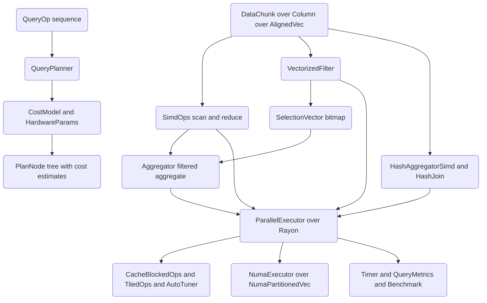

# SIMD Analytics Engine

## Overview

The SIMD Analytics Engine is a CPU-optimized columnar analytics library written from scratch
in Rust. It is built to make the mechanics of a vectorized analytical query engine legible:
how data is laid out in aligned columnar buffers, how scan/filter/aggregate operators consume
that layout, how hash-based operators implement group-by and join, how a cost model reasons
about cache behavior and parallelism, and how multi-core execution stitches the pieces
together.

The engine targets the analytical (OLAP) access pattern: large scans over a few columns,
predicate-heavy filters, and reductions that collapse many rows into few. That access pattern
rewards three structural decisions, each of which is implemented here:

- **Columnar storage.** Each column is a contiguous, cache-line aligned buffer of a single
  type. Scanning one column touches only the bytes it needs, and a tight per-element loop over
  homogeneous data is exactly what an auto-vectorizing compiler turns into wide SIMD.
- **Vectorized operators.** Operators process columns in fixed-width chunks with accumulator
  arrays, so the compiler can keep several independent partial results in vector registers.
  Filters emit a packed bitmap (`SelectionVector`) rather than materializing intermediate
  rows, keeping the hot path branch-light and memory-dense.
- **Cost-aware, parallel execution.** A hardware-parameterized cost model estimates the cycles,
  memory traffic, and cache misses of each operator, classifies operators as memory- or
  compute-bound, and predicts parallel speedup. A Rayon-backed executor then runs the heavy
  operators across cores.

The concepts this project teaches are the load-bearing ideas behind systems like DuckDB,
ClickHouse, and Apache Arrow's compute kernels: data-oriented layout, vectorized execution,
selection vectors, hash aggregation and join, probabilistic sketches for cardinality and
membership, the memory hierarchy as the dominant performance constraint, and cost-based
planning. It is a learning-oriented engine, so several hardware-specific mechanisms are
modelled rather than driven through raw intrinsics or OS calls. The
[Modelled vs Hardware-Driven Behavior](#modelled-vs-hardware-driven-behavior) section states
exactly which, and the project README carries the same honesty note for users.

Scope. The engine exposes operators and data structures as a Rust library, not a SQL frontend.
There is no parser; "queries" are expressed either by composing operator calls directly or by
describing a sequence of `QueryOp` values for the planner to cost. The engine operates on
in-memory `DataChunk`s; there is no on-disk storage format, network layer, or transaction
manager.

## Architecture



The system is organized as a set of cooperating layers, each in its own module under `src/`.

**Storage layer (`column.rs`).** The foundation is `AlignedVec<T>`, a manually managed buffer
allocated with an explicit alignment (cache-line by default). `Column` wraps an `AlignedVec`
per supported type (`Int32`, `Int64`, `Float32`, `Float64`, `Bool`), and `DataChunk` groups
columns of equal length into a row-aligned batch. Everything above this layer reads columns as
plain Rust slices via `as_slice`, which is what lets the kernels stay simple and vectorizable.

**Kernel layer (`simd.rs`).** `SimdOps` provides the element-wise and reduction primitives:
`sum`/`min`/`max` per type, `add`/`mul`/`fma`/`scale`, `dot`, masked sum, threshold counts,
gather/scatter, and a scalar MurmurHash3 finalizer. `HorizontalOps` provides tree reductions
across a fixed lane count. These are deliberately written as chunked loops over accumulator
arrays so the compiler vectorizes them.

**Operator layer (`filter.rs`, `aggregate.rs`, `hash.rs`).** Filters turn a column plus a
predicate into a `SelectionVector` and support boolean combination and compaction. Aggregators
compute scalar reductions over a whole column or over a selection, and expose mergeable
`PartialAggregate` and `RunningStats` for parallel combination. The hash module provides an
open-addressing `HashTable`, group-by (`HashAggregatorSimd`), `HashJoin`, and three
probabilistic structures (`BloomFilter`, `CountMinSketch`, `HyperLogLog`).

**Planning layer (`planner.rs`).** `CostModel` estimates per-operator cost from
`HardwareParams` (cache sizes, latencies, bandwidth, core count, SIMD width). `QueryPlanner`
threads a `QueryOp` sequence through the model, propagating row counts and producing a
`PlanNode` list with attached `CostEstimate`s.

**Execution and tuning layers (`scheduler.rs`, `optimize.rs`, `numa.rs`).**
`ParallelExecutor` runs the heavy operators across cores with Rayon, falling back to serial
execution below a batch-size threshold. `optimize.rs` holds cache-blocked reductions,
branch-free helpers, tiled 2D kernels, and an `AutoTuner`. `numa.rs` provides topology, data
partitioning, and per-node allocation accounting.

**Observability layer (`metrics.rs`).** `Timer`, `PerfMetrics`, `QueryMetrics`, `Benchmark`,
`BenchmarkResult`, `CacheStats`, and `PerformanceModel` measure and estimate performance.

Shared vocabulary lives in `lib.rs`: the `Error`/`Result` types and the tuning constants
`CACHE_LINE_SIZE` (64), `VECTOR_WIDTH` (8), `BLOCK_SIZE` (4096), and `PREFETCH_DISTANCE` (16).

## Core Components

### Aligned columnar storage

`AlignedVec<T>` (`column.rs`) is the lowest-level building block. It allocates with
`std::alloc::alloc` using a `Layout` built from an explicit alignment, stores a `NonNull<T>`
plus length, capacity, and alignment, and frees the same `Layout` on `Drop`. Cache-line
alignment matters because aligned loads/stores are cheaper on most architectures and because a
column that starts on a cache-line boundary avoids straddling lines on the first access.

```rust
let mut vec: AlignedVec<f32> = AlignedVec::with_capacity(100).unwrap();
assert!(vec.is_aligned(CACHE_LINE_SIZE));
```

`AlignedVec` is fixed-capacity: `push` past capacity returns an error rather than reallocating,
which keeps the pointer stable and avoids hidden copies in hot loops. `Send`/`Sync` are
implemented manually (guarded on `T: Send`/`Sync`) so partitioned columns can cross thread
boundaries under Rayon.

`Column` is a tagged union over `AlignedVec` of each supported type. It offers typed
constructors (`from_i32`, `from_f64`, `from_bool`, ...), typed accessors that return a slice or
a `TypeMismatch` error (`as_f64`, `as_i64`, ...), and metadata (`column_type`, `len`,
`size_bytes`). Bool columns are stored as `u8` (0/1) so they remain a flat numeric buffer.

`DataChunk` groups columns of equal length. Its constructor validates that every column has the
same row count and rejects empty input. `slice(offset, length)` produces an independent
sub-chunk by copying each column's range, which is how operators carve a chunk into batches.

The memory-safety contract of `AlignedVec` is worth spelling out because it is hand-written
`unsafe`. The buffer is allocated with a `Layout::from_size_align(capacity * size_of::<T>(),
alignment)` and freed in `Drop` with the identical layout — the pair must match exactly or the
global allocator's behavior is undefined, so the type stores `alignment` to reconstruct it. A
zero-capacity vector uses `NonNull::dangling()` and never touches the allocator, which keeps the
empty case allocation-free. Because the engine hands columns across Rayon worker threads, the
manual `unsafe impl Send`/`Sync` is gated on `T: Send`/`Sync`, asserting that a buffer of `Send`
elements is itself safe to move between threads — true here because `AlignedVec` owns its
allocation exclusively and exposes no interior mutability. The fixed-capacity choice (push past
capacity errors instead of reallocating) is what guarantees the backing pointer never moves, so a
`&[T]` view obtained from `as_slice` stays valid for the lifetime of the borrow even while other
elements are pushed.

### Vectorized kernels

`SimdOps` (`simd.rs`) is a stateless namespace of associated functions. The reduction kernels
share one shape: split the slice into `chunks_exact(WIDTH)`, accumulate into a `[T; WIDTH]`
array (one lane per accumulator), then do a final horizontal reduction and handle the
remainder. Keeping `WIDTH` independent accumulators breaks the loop-carried dependency that
would otherwise serialize a naive `sum += data[i]`, which is what lets the compiler issue
several vector adds in flight.

```rust
let chunks = data.chunks_exact(VECTOR_WIDTH);
let mut acc = [0.0f32; VECTOR_WIDTH];
for chunk in chunks {
    for i in 0..VECTOR_WIDTH { acc[i] += chunk[i]; }
}
let mut sum: f32 = acc.iter().sum();
```

The f32 kernels use `VECTOR_WIDTH` (8) lanes; the f64/i64 kernels use 4 lanes, matching a
256-bit register. `dot_f32`/`dot_f64` fuse multiply and accumulate across paired chunks.
`fma_f32` uses `f64::mul_add` for a single rounded multiply-add. `count_gt_f32`/`count_lt_f32`
keep per-lane counters. `gather_f32`/`scatter_f32` implement indexed access with bounds
checks. `hash_i64` applies the MurmurHash3 finalizer per element.

`HorizontalOps` provides explicit tree reductions (`hsum_8xf32`, `hsum_4xf64`, `hmin`/`hmax`)
that fold a fixed lane array pairwise; these mirror the final horizontal step a hand-written
intrinsic kernel would perform after the main loop. A horizontal sum of eight lanes is done in
three pairwise rounds (8 -> 4 -> 2 -> 1) rather than a seven-add serial chain, halving the
dependency depth:

```rust
let v4 = [v[0]+v[4], v[1]+v[5], v[2]+v[6], v[3]+v[7]];
let v2 = [v4[0]+v4[2], v4[1]+v4[3]];
v2[0] + v2[1]
```

Two width choices are worth noting. The f32 kernels use eight lanes because a 256-bit register
holds eight 32-bit floats, while the f64/i64 kernels hard-code four because the same register
holds four 64-bit values; `VECTOR_WIDTH` is the f32 width and the wider kernels carry their own
local `vector_width = 4`. The `blocked_sum_f32` kernel composes `sum_f32` over `BLOCK_SIZE`
slices so that even very large inputs reduce one cache-resident block at a time.

A subtle correctness point the kernels respect: because floating-point addition is not
associative, the chunked-accumulator order differs from a strict left-to-right scalar sum, so
tests compare against a reference with a tolerance rather than for bit-exact equality. The
integer kernels, by contrast, are exact and use `wrapping_mul` in the hash finalizer to match C
semantics.

### Filtering and selection vectors

`SelectionVector` (`filter.rs`) is a packed bitmap: a `Vec<u64>` where bit `i` indicates whether
row `i` survives. It tracks `num_rows` and a cached `selected_count` (refreshed by `recount`
via `count_ones`). It supports per-row `set`/`is_selected`, whole-word `get_word`/`set_word`
(the fast path filters use), boolean `and`/`or`/`not` over the underlying words, and
`selected_indices`. Representing survivors as a bitmap rather than a list of indices keeps the
intermediate dense and lets multi-predicate filters combine with cheap bitwise ops.

`VectorizedFilter` evaluates a predicate one 64-bit word at a time: for each word it walks up to
64 rows, sets the matching bits, and writes the word in one store. There are typed entry points
(`filter_f32`, `filter_f64`, `filter_i64`, `filter_i32`) plus `filter_column`, which dispatches
on a `FilterPredicate` and the column's type. `FilterOp` covers the six comparisons
(`Eq`, `Ne`, `Gt`, `Ge`, `Lt`, `Le`). Compaction helpers (`compact_f32`/`f64`/`i64`)
materialize only selected values into a fresh `AlignedVec`. `RangeFilter` implements BETWEEN by
ANDing a `Ge low` selection with a `Le high` selection.

The word-at-a-time loop is the heart of the design. For word `w`, the filter computes the row
range `[w*64, min(w*64+64, len))`, evaluates the predicate for each row, and accumulates set
bits into a local `u64` before a single `set_word`:

```rust
for word_idx in 0..num_words {
    let start = word_idx * 64;
    let end = (start + 64).min(data.len());
    let mut word = 0u64;
    for i in start..end {
        if Self::compare_f64(data[i], op, threshold) {
            word |= 1u64 << (i - start);
        }
    }
    selection.set_word(word_idx, word);
}
```

This keeps the inner predicate test free of any heap or bounds-checked bitmap writes, and the
per-row comparison (`compare_f64` and friends) is a small `match` over `FilterOp` that the
compiler can hoist out of the loop once `op` is known. The boolean combinators work directly on
the `Vec<u64>` words, so `and`/`or` are one bitwise op per 64 rows; `not` additionally masks the
trailing partial word so bits beyond `num_rows` stay zero (otherwise a NOT would spuriously
"select" padding rows). `recount` then refreshes `selected_count` with `count_ones`.

Two design tradeoffs are deliberate. First, the filter materializes a full-length bitmap even
for highly selective predicates; this trades a little memory for the ability to combine
predicates cheaply and to drive filtered aggregates without re-scanning. Second, compaction is a
separate explicit step rather than fused into filtering, so a query that only needs a count or a
filtered sum never pays to move surviving values.

### Aggregation

`Aggregator` (`aggregate.rs`) computes SUM/COUNT/MIN/MAX/AVG. The whole-column entry points
delegate reductions to `SimdOps` (so SUM rides the vectorized kernel), and `aggregate` dispatches
on column type, widening i32 to i64 and counting set bits for bool columns.
`aggregate_filtered_f64` applies an aggregate only over selected rows.

For parallel and incremental aggregation the module exposes two mergeable accumulators:

- `PartialAggregate` holds `sum`, `count`, `min`, `max`; `add` folds in one value, `merge`
  combines two partials, and `finalize(op)` projects out the requested aggregate. This is what
  the parallel executor builds per chunk and reduces across chunks.
- `RunningStats` implements Welford's online algorithm, maintaining `mean` and `m2` for a
  numerically stable variance/standard deviation, and `merge` combines two independently
  accumulated streams using the parallel-variance formula. The naive "sum of squares minus square
  of sum" variance loses precision catastrophically when the mean is large relative to the
  variance; Welford avoids that by updating the mean incrementally and accumulating squared
  deviations from the running mean:

  ```rust
  self.count += 1;
  let delta = value - self.mean;
  self.mean += delta / self.count as f64;
  let delta2 = value - self.mean;
  self.m2 += delta * delta2;          // variance = m2 / (count - 1)
  ```

  `merge` then combines two streams' `m2` with a correction term proportional to the squared
  difference of their means, so a dataset split across threads yields the same variance as a
  serial pass. This is the statistical analogue of the `PartialAggregate` merge: both are
  associative reductions designed to be computed per chunk and combined.

`HashAggregator` (a `HashMap`-backed group-by used inside this module) and the richer
`HashAggregatorSimd` in `hash.rs` cover the GROUP BY case below.

### Hashing, group-by, and join

`hash.rs` centers on `HashTable<K, V>`, an open-addressing table with linear probing and a
power-of-two capacity (so indexing is a mask, not a modulo). It resizes at a 0.7 load factor by
doubling and rehashing, and exposes `insert`, `get`, `get_mut`, `get_or_insert_with`, `iter`,
and `clear`. `get_or_insert_with` is the group-by primitive: it returns a mutable handle to the
slot for a key, creating it with a closure on first sight.

Linear probing is chosen over chaining because it keeps all entries in two flat `Vec`s with no
per-entry allocation, so probing walks contiguous memory and stays cache-friendly. Indexing is a
mask rather than a modulo because capacity is always a power of two (`next_power_of_two` in
`new`), and the probe sequence advances with `idx = (idx + 1) & mask`. A probe that wraps the
whole table without finding a slot is treated as "full" — for `get`/`get_mut` it returns
`None`/miss, and for `insert`/`get_or_insert_with` it panics, which is safe because the 0.7
load-factor resize keeps the table from ever truly filling under normal use. `resize` doubles
capacity and rehashes every live entry into the new array, which is why insert is amortized O(1)
despite the occasional full rehash.

```rust
let mut idx = self.hash_to_index(&key);
loop {
    match &self.keys[idx] {
        None => { /* empty slot: insert here */ }
        Some(existing) if existing == &key => { /* found: update in place */ }
        Some(_) => { idx = (idx + 1) & self.mask; /* collision: probe next */ }
    }
}
```

`HashAggregatorSimd` maps `i64` group keys to `AggState` (running sum/count/min/max).
`aggregate(keys, values)` processes input in `BLOCK_SIZE` chunks for cache locality, and the
getters (`get_sum`, `get_count`, `get_avg`, `get_min`, `get_max`) and `get_results` read the
table back. `HashJoin<V>` builds a `HashTable<i64, Vec<V>>` over the build side and `probe`s a
key array against it, returning matched value lists.

`VectorizedHash` supplies the hash functions: a MurmurHash3 finalizer for integers
(`hash_i64`/`hash_u64`/`hash_i32`), FNV-1a for bytes/strings, and a `combine_hashes` helper for
compound keys. Three probabilistic structures build on these:

- `BloomFilter` sizes its bit array and hash count from an expected item count and target
  false-positive rate, using double hashing (`hash_nth`) to derive `k` indices.
- `CountMinSketch` estimates frequencies with a `depth x width` counter grid, taking the
  minimum counter as the estimate; `with_error_bounds(epsilon, delta)` derives the dimensions.
- `HyperLogLog` estimates cardinality from register leading-zero ranks, with the standard alpha
  bias correction and small-range linear-counting fallback, and is mergeable. Each value is
  hashed; the top `precision` bits choose a register and the remaining bits' leading-zero count
  (plus one) is the rank stored as a running max in that register. The estimate is
  `alpha * m^2 / sum(2^-register)`, and when it falls below `2.5 * m` with empty registers the
  code switches to linear counting (`m * ln(m / zeros)`) for better small-cardinality accuracy.
  Because registers store maxima, merging two sketches is an element-wise max — the same value
  observed on two threads collapses correctly, which is why HLL is the cardinality primitive for
  distributed counts.

### Cost model and planner

`HardwareParams` (`planner.rs`) captures the machine: CPU frequency, core count (detected via
`available_parallelism`), SIMD width, L1/L2/L3 sizes, per-level latencies in cycles, memory
latency, and bandwidth. `CostModel` turns these into `CostEstimate`s (CPU cycles, memory
accesses, cache misses, wall time, memory-bound flag) for each operator:

- `estimate_scan` counts cache-line accesses, treats the operator as memory-bound when memory
  transfer time exceeds compute time, and takes the max of the two as wall time.
- `estimate_filter` adds predicate-evaluation cycles and a 10% overhead over the underlying scan.
- `estimate_aggregate` adds one op per row.
- `estimate_hash_aggregate`/`estimate_hash_join` add hashing and probe-latency cycles and treat
  group state that overflows L2 as extra misses.
- `estimate_sort` models O(n log n) comparisons and degrades cache behavior for out-of-cache
  inputs.
- `estimate_parallel_speedup` caps memory-bound speedup at ~2x (bandwidth-limited) and applies
  80% parallel efficiency otherwise.

`QueryPlanner.plan` walks a `Vec<QueryOp>`, propagating the current row count between operators
(a filter shrinks it by selectivity, an aggregate collapses it to one, a hash-aggregate to the
group count) and attaching the cost of each. Row-count propagation is what makes the cost of a
later operator depend on what came before: a `Scan` of 1M rows followed by a `Filter` at 0.1
selectivity hands only 100k rows to a downstream `Aggregate`, so the aggregate is costed on
100k, not 1M. `estimate_total_time` sums node times, `should_parallelize` triggers above 10k
rows, and `ColumnStats` provides equality (`1/distinct`) and range (overlap fraction of
min/max) selectivity estimates used to drive filter costs. The `optimize` method is a documented
placeholder — it returns the plan unchanged, leaving filter pushdown and join reordering as the
clearly-marked next step rather than pretending to implement them.

The cost model's value is less in its absolute accuracy than in the decisions it encodes:
distinguishing memory-bound from compute-bound operators, recognizing that group state spilling
out of L2 adds misses, and capping parallel speedup for bandwidth-limited work. These are the
qualitative judgments a real planner uses to choose between physical operators.

### Parallel execution and pipelines

`ParallelExecutor` (`scheduler.rs`) wraps an `ExecutorConfig` (thread count, batch size,
parallel toggle) and provides `parallel_sum_f64`, `parallel_aggregate_f64`,
`parallel_filter_f64`/`f32`, `parallel_map_f64`, `parallel_scale_f64`, `parallel_add_f64`,
`parallel_dot_f64`, and `parallel_count_if`. Each falls back to a serial path when parallelism
is disabled or the input is smaller than the batch size, avoiding fork/join overhead on small
inputs. The aggregate path builds a `PartialAggregate` per `par_chunk` and merges them; the
filter path computes a per-chunk `SelectionVector` and stitches the bits back into a
full-length result.

The two parallel reduction shapes are worth contrasting. `parallel_aggregate_f64` is a clean
map-reduce: it produces one `PartialAggregate` per `par_chunk` and folds them with `merge`, so
the only cross-thread data is a handful of small structs. `parallel_filter_f64` is harder
because the result is a single bitmap: each chunk computes a local `SelectionVector` over its own
rows, and a serial merge pass copies those bits back into the full-length result at the right
offset before a final `recount`. That stitching is the price of returning one contiguous bitmap
rather than a list of per-chunk selections, and it is why filtering shows less parallel speedup
than aggregation in the cost model.

`Partitioner` splits data into equal chunks or hash-partitions key/value pairs across buckets;
hash partitioning is what a parallel group-by would use to send each key to exactly one worker so
no merge of partial group tables is needed. `WorkQueue<T>` is a `parking_lot::Mutex`-guarded task
stack for dynamic load balancing. The `Pipeline` abstraction chains `PipelineStage` trait objects
(`FilterStage`, `MapStage`) and runs them in sequence via `execute`, or in parallel batches via
`execute_batched`, which splits the input, runs the full stage chain on each batch in parallel,
and flattens the results.

### Cache, branch-free, and tiled optimizations

`optimize.rs` gathers techniques that complement the kernels. `CacheBlockConfig` describes L1/
L2/L3 block sizes and a prefetch distance, with a constructor that derives blocks from cache
sizes. `CacheBlockedOps` processes data in L1-sized blocks with unrolled 4-wide accumulators
(`blocked_sum_f64`, `blocked_min_f64`, `blocked_max_f64`, `blocked_dot_f64`, `blocked_map_f64`).
`BranchFreeOps` provides predictable-cost helpers (`min`/`max`/`clamp`/`abs`/`sign`/`select`,
`conditional_sum`, `conditional_count`). `StreamingOps` models non-temporal streaming
sum/fill/copy. `TiledOps` implements tiled matrix-vector multiply and 2D row reduction.
`Prefetcher` computes prefetch distances per access pattern, `BandwidthOptimizer` reasons about
memory-bound vs compute-bound regimes, and `AutoTuner` picks block sizes and records throughput.

### NUMA abstractions

`numa.rs` detects topology (`NumaTopology::detect`, which returns a single simulated node on
systems without `libnuma`) and can synthesize a multi-node topology for tests
(`NumaTopology::simulated`) including a node-distance matrix. `NumaAllocator` accounts for
per-node allocation via atomics; `NumaPartitionedVec<T>` splits data into per-node partitions
and recombines them; `NumaExecutor` runs a closure over each partition in parallel and reduces
the results. `AffinitySettings` and `BandwidthEstimator` describe pinning and transfer-time
estimates.

The point of these abstractions, even simulated, is to make NUMA-aware code expressible: a query
that partitions a column across nodes, runs a per-partition reduction, and combines the results
is structurally identical whether the partitions live on distinct memory controllers or all on
one. `NumaExecutor::parallel_partitions` runs the per-partition closure with Rayon and tags each
call with its node index, so a real implementation could pin the worker and allocate node-local
memory without changing the operator code above it. `BandwidthEstimator::estimate_transfer_time`
scales effective bandwidth by the node-distance factor from the topology matrix, so a remote
access is modelled as proportionally slower — the test suite checks that remote estimates exceed
local ones, which is the invariant a real system must preserve.

### Metrics

`metrics.rs` measures and estimates. `Timer` records named split times. `PerfMetrics` and
`QueryMetrics` derive throughput (rows/s, GB/s), selectivity, and a text dashboard. `Benchmark`
runs a closure with warmup and measurement iterations and returns a `BenchmarkResult` with
min/median/mean/max and standard deviation. `CacheStats::estimate_sequential_scan` models a hit
distribution across the hierarchy, and `PerformanceModel` estimates memory- and compute-bound
durations.

`BenchmarkResult::from_times` sorts the samples, then reports the minimum (the most reproducible
estimate of best-case time, least perturbed by OS noise), the median, and the mean with a
standard deviation computed in nanoseconds. Reporting min and median alongside the mean is
deliberate: a single slow sample (a scheduler preemption or a cache flush) skews the mean but
not the min, so comparing both reveals measurement noise.

### Modelled vs Hardware-Driven Behavior

This engine is intended to teach the structure of a vectorized analytics engine, so a few
mechanisms that would normally require architecture-specific intrinsics or OS facilities are
implemented in portable Rust that has the right shape but does not drive the hardware directly.
Stating this precisely matters for anyone reading the code as a reference:

- **Vectorization is compiler-driven, not intrinsic.** The kernels in `simd.rs` are written so
  that LLVM auto-vectorizes them (chunked loops, independent accumulators, no data-dependent
  branches in the hot path). There are no `std::arch::x86_64::_mm256_*` calls. The `avx2` Cargo
  feature is a scaffolded flag (declared in `Cargo.toml`) with no intrinsic code behind it yet,
  so `VECTOR_WIDTH` and the per-kernel lane counts express the intended width rather than a
  guaranteed instruction selection. The actual SIMD width achieved depends on the target CPU and
  the optimizer.
- **NUMA is simulated by default.** `NumaTopology::detect` returns a single node on macOS and any
  system without `libnuma`; `NumaAllocator::alloc_on_node` allocates ordinary heap memory and
  only records the byte count per node in an atomic counter — there is no `numa_alloc_onnode` or
  thread pinning. `NumaTopology::simulated` exists so the partitioning and distance logic can be
  tested on a synthetic multi-node machine.
- **Prefetch and non-temporal stores are structured but not emitted.** In `optimize.rs`,
  `blocked_sum_f64_prefetch` computes a prefetch offset and `StreamingOps` documents where
  non-temporal stores would go, but both run ordinary scalar/iterator code; no
  `_mm_prefetch`/`_mm256_stream_pd` is issued.
- **Cache statistics are estimates.** `CacheStats::estimate_sequential_scan` and the
  `CostModel`/`PerformanceModel` figures are analytic models parameterized by `HardwareParams`,
  not reads of hardware performance counters (no `perf_event_open`).

Everything else — storage, kernels, filtering, aggregation, the hash operators and sketches, the
cost model and planner, and Rayon-based parallelism — is fully implemented and exercised by the
test suite.

## Data Structures

```rust
/// Fixed-capacity, explicitly aligned buffer (column.rs).
pub struct AlignedVec<T> {
    ptr: NonNull<T>,
    len: usize,
    capacity: usize,
    alignment: usize,
    _marker: PhantomData<T>,
}

/// Typed column backed by an aligned buffer.
pub enum Column {
    Int32(AlignedVec<i32>),
    Int64(AlignedVec<i64>),
    Float32(AlignedVec<f32>),
    Float64(AlignedVec<f64>),
    Bool(AlignedVec<u8>),
}

/// Row-aligned batch of equal-length columns.
pub struct DataChunk {
    pub columns: Vec<Column>,
    pub num_rows: usize,
}
```

The filter layer is built around a packed bitmap and a small predicate enum:

```rust
pub enum FilterOp { Eq, Ne, Gt, Ge, Lt, Le }

pub enum FilterPredicate {
    Int32(FilterOp, i32),
    Int64(FilterOp, i64),
    Float32(FilterOp, f32),
    Float64(FilterOp, f64),
}

/// One bit per row; survivors are set bits.
pub struct SelectionVector {
    bitmap: Vec<u64>,
    num_rows: usize,
    selected_count: usize,
}
```

Aggregation uses mergeable accumulators so partial results combine cleanly across threads:

```rust
pub enum AggregateOp { Sum, Count, Min, Max, Avg }

pub enum AggregateValue { Int64(i64), Float64(f64), Count(usize), Null }

pub struct PartialAggregate { pub sum: f64, pub count: usize, pub min: f64, pub max: f64 }

/// Welford's online mean/variance (aggregate.rs).
pub struct RunningStats { count: usize, mean: f64, m2: f64, min: f64, max: f64 }
```

The hash layer's table and group-by state:

```rust
/// Open-addressing table; capacity is a power of two so indexing masks.
pub struct HashTable<K, V> {
    keys: Vec<Option<K>>,
    values: Vec<Option<V>>,
    capacity: usize,
    mask: usize,
    len: usize,
    max_load_factor: f64,
}

/// Per-group running aggregate.
pub struct AggState { pub sum: f64, pub count: usize, pub min: f64, pub max: f64 }
```

The planner's hardware description and cost output:

```rust
pub struct HardwareParams {
    pub cpu_freq_ghz: f64,
    pub num_cores: usize,
    pub simd_width: usize,
    pub l1_cache_size: usize,
    pub l2_cache_size: usize,
    pub l3_cache_size: usize,
    pub l1_latency_cycles: f64,
    pub l2_latency_cycles: f64,
    pub l3_latency_cycles: f64,
    pub mem_latency_cycles: f64,
    pub mem_bandwidth_gb_s: f64,
}

pub struct CostEstimate {
    pub cpu_cycles: f64,
    pub memory_accesses: usize,
    pub cache_misses: usize,
    pub time_seconds: f64,
    pub memory_bound: bool,
}

pub enum QueryOp {
    Scan { rows: usize, row_size: usize },
    Filter { input_rows: usize, selectivity: f64 },
    Aggregate { rows: usize },
    HashAggregate { rows: usize, groups: usize },
    HashJoin { build_rows: usize, probe_rows: usize, output_rows: usize },
    Sort { rows: usize },
}
```

Shared constants and the error type live in `lib.rs`:

```rust
pub const CACHE_LINE_SIZE: usize = 64;
pub const VECTOR_WIDTH: usize = 8;    // AVX2: 256-bit = 8 x f32
pub const BLOCK_SIZE: usize = 4096;
pub const PREFETCH_DISTANCE: usize = 16;

pub enum Error {
    TypeMismatch { expected: String, got: String },
    DimensionMismatch(String),
    InvalidOperation(String),
    AlignmentError(String),
    IndexOutOfBounds { index: usize, len: usize },
    EmptyData,
}
```

## API Design

The crate root re-exports the public surface (`src/lib.rs`). The main entry points by layer:

```rust
// Storage
AlignedVec::<T>::with_capacity(capacity) -> Result<AlignedVec<T>>
AlignedVec::<T>::with_capacity_aligned(capacity, alignment) -> Result<AlignedVec<T>>
Column::from_f64(&[f64]) -> Result<Column>            // and from_i32/i64/f32/bool
Column::as_f64(&self) -> Result<&[f64]>               // typed accessors
DataChunk::new(Vec<Column>) -> Result<DataChunk>
DataChunk::slice(offset, length) -> Result<DataChunk>

// Kernels
SimdOps::sum_f32(&[f32]) -> f32                        // sum_f64/sum_i64
SimdOps::min_f32(&[f32]) -> Option<f32>               // min/max f32/f64
SimdOps::dot_f32(&[f32], &[f32]) -> f32               // dot_f64
SimdOps::fma_f32(a, b, c, out)                         // a*b + c
SimdOps::count_gt_f32(&[f32], threshold) -> usize

// Filtering
VectorizedFilter::filter_f64(&[f64], FilterOp, threshold) -> SelectionVector
VectorizedFilter::filter_column(&Column, &FilterPredicate) -> Result<SelectionVector>
SelectionVector::and(&self, &SelectionVector) -> Result<SelectionVector>   // or / not
RangeFilter::filter_f64_range(&[f64], low, high) -> SelectionVector

// Aggregation
Aggregator::aggregate(&Column, AggregateOp) -> Result<AggregateValue>
Aggregator::aggregate_filtered_f64(&[f64], &SelectionVector, AggregateOp) -> AggregateValue
PartialAggregate::from_slice(&[f64]) -> PartialAggregate
PartialAggregate::merge(&mut self, &PartialAggregate)

// Hash operators
HashAggregatorSimd::aggregate(&mut self, keys: &[i64], values: &[f64]) -> Result<()>
HashAggregatorSimd::get_sum(&self, key: i64) -> Option<f64>
HashJoin::<V>::build(&mut self, keys: &[i64], values: &[V]) -> Result<()>
HashJoin::<V>::probe(&self, &[i64]) -> Vec<Option<Vec<V>>>
BloomFilter::new(expected_items, fp_rate) ; might_contain(value) -> bool
HyperLogLog::new(precision) ; add(value) ; estimate() -> f64

// Planning
CostModel::estimate_scan(num_rows, row_size_bytes) -> CostEstimate
QueryPlanner::plan(Vec<QueryOp>) -> Vec<PlanNode>

// Parallel execution
ParallelExecutor::default() -> ParallelExecutor
ParallelExecutor::parallel_aggregate_f64(&self, &[f64], AggregateOp) -> AggregateValue
ParallelExecutor::parallel_filter_f64(&self, &[f64], FilterOp, threshold) -> SelectionVector

// NUMA, optimize, metrics
NumaPartitionedVec::<T>::from_vec(Vec<T>, num_nodes) -> NumaPartitionedVec<T>
NumaExecutor::parallel_sum(&self, &NumaPartitionedVec<f64>) -> f64
CacheBlockedOps::blocked_sum_f64(&[f64], &CacheBlockConfig) -> f64
Benchmark::run(&self, FnMut()) -> BenchmarkResult
```

Conventions follow the repo's Rust guidance: fallible constructors and accessors return
`Result<T, Error>`; pure kernels and infallible reductions return the value (or `Option` when
empty input is meaningful); operators are grouped under stateless namespace structs
(`SimdOps`, `VectorizedFilter`, `Aggregator`) or small stateful structs (`HashTable`,
`ParallelExecutor`). Errors are a single `thiserror`-derived enum so callers match one type.

A representative end-to-end flow, expressing a filtered group-by:

```rust
use simd_analytics_engine::{HashAggregatorSimd, VectorizedFilter, FilterOp};

let group = vec![1i64, 2, 1, 2, 1];
let value = vec![10.0f64, 20.0, 30.0, 40.0, 50.0];

// Filter values > 15.0, then group surviving rows by key.
let sel = VectorizedFilter::filter_f64(&value, FilterOp::Gt, 15.0);
let (keys, vals): (Vec<i64>, Vec<f64>) = group.iter().zip(value.iter())
    .enumerate()
    .filter(|(i, _)| sel.is_selected(*i))
    .map(|(_, (&k, &v))| (k, v))
    .unzip();

let mut agg = HashAggregatorSimd::new();
agg.aggregate(&keys, &vals).unwrap();
assert_eq!(agg.get_sum(1), Some(80.0)); // 30 + 50
assert_eq!(agg.get_sum(2), Some(60.0)); // 20 + 40
```

## Performance

The engine encodes its performance model rather than only chasing benchmarks. The dominant
constraint for analytical scans is memory bandwidth: a scan that reads N bytes cannot finish
faster than `N / bandwidth`, regardless of how fast the compute is. `CostModel::estimate_scan`
makes this explicit by taking `max(memory_time, compute_time)` and flagging the operator as
memory-bound when memory dominates; `estimate_parallel_speedup` then caps memory-bound speedup
at roughly 2x because adding cores cannot exceed the shared bandwidth, while compute-bound
operators scale at ~80% efficiency.

The design choices that support throughput:

- **Aligned, contiguous columns.** Cache-line alignment avoids split-line first accesses, and a
  column scan walks memory sequentially, which the hardware prefetcher handles well. Defaults
  in `HardwareParams` model a 3 GHz, multi-core machine with 32 KB L1, 256 KB L2, 8 MB L3, and
  50 GB/s memory.
- **Independent accumulators.** The reduction kernels keep `VECTOR_WIDTH` (or 4) partial sums so
  the multiply/add chain is not serialized; this is the difference between a vectorized reduction
  and a scalar one.
- **Bitmap selection.** Filters emit one bit per row and combine with bitwise AND/OR, so a
  multi-predicate filter does not materialize intermediate row sets, and `count_ones` recounts
  survivors in a few instructions per 64 rows.
- **Cache blocking and tiling.** `CacheBlockedOps` and `TiledOps` process data in L1-sized
  blocks so working sets stay resident; `AutoTuner::optimal_block_size` selects the block size
  from the data size relative to the configured cache levels.
- **Threshold-gated parallelism.** `ParallelExecutor` only forks when the input exceeds
  `BLOCK_SIZE` (4096), so small inputs avoid Rayon's coordination overhead. The planner's
  `should_parallelize` uses a parallel 10k-row threshold for the same reason, and `AutoTuner`
  applies a `data_size * operation_cost > 100_000` work threshold before recommending a parallel
  path.

The roofline intuition the cost model encodes is concrete. `BandwidthOptimizer::is_memory_bound`
computes operational intensity (flops per byte) and compares it to a machine balance of ~10
flops/byte: a plain scan-and-sum does roughly one add per 8 bytes loaded, an intensity of ~0.125,
so it is firmly memory-bound and its wall time is governed by bandwidth. A dot product or an FMA
chain raises intensity and shifts toward compute-bound, where adding cores helps. This is exactly
why `estimate_scan` returns `memory_bound = true` for large inputs while
`estimate_hash_aggregate` returns `false` (its hashing and probe latency make it compute-bound),
and why `estimate_parallel_speedup` then treats the two differently.

A worked propagation through the planner makes the cost composition visible. For
`Scan(1M, 8B) -> Filter(0.1) -> Aggregate`, the scan reads 8 MB and is bandwidth-bound at
`8e6 / 50e9 ≈ 160 µs`; the filter adds a predicate pass plus 10% overhead on the same scan; the
aggregate then runs on the ~100k surviving rows. The absolute numbers depend on `HardwareParams`,
but the relative ordering — scan and filter dominate, aggregate is cheap — is the kind of
judgment that drives operator selection.

`metrics.rs` provides the measurement side: `Benchmark` runs warmup plus measurement iterations
and reports min/median/mean/standard-deviation, and `PerfMetrics`/`QueryMetrics` compute
rows/second and GB/second from observed timings. The repository ships a Criterion harness
(`benches/simd_benchmarks.rs`) wired into Cargo; it currently contains a placeholder benchmark,
so concrete throughput numbers are intentionally not asserted here — they depend on the host
CPU, memory subsystem, and compiler auto-vectorization, and should be obtained with
`cargo bench` on the target machine.

## Testing Strategy

Correctness is verified with 145 tests: 69 `#[cfg(test)]` unit tests distributed across the
source modules and 76 integration tests in `tests/`. The suite runs with `cargo test` and needs
no external services.

**Kernel correctness (`simd.rs`).** Reductions are checked against scalar references with a
small epsilon for floating point (`sum_f32`, `sum_f64`), and exact cases pin specific values
(`dot_f32` = 70.0, `count_gt_f32` = 5, `hsum_8xf32` = 36.0). These guard the chunked-accumulator
rewrites against off-by-one and remainder-handling bugs.

**Storage (`column.rs`).** Tests assert cache-line alignment of freshly allocated `AlignedVec`,
round-trip values through `Column`, and verify `DataChunk` rejects mismatched lengths.

**Filtering (`filter.rs`).** Tests cover per-row selection, each comparison operator, boolean
`and`/`or` over selections, range filters, and compaction, including boundary rows (e.g. that
`5.0` is excluded by `Gt 5.0`).

**Aggregation (`aggregate.rs`).** All five aggregates are checked on a known column;
`HashAggregator` group sums are verified; `PartialAggregate::from_slice` and `RunningStats`
(mean/min/max and a split-then-merge case) confirm the mergeable accumulators combine correctly.

**Hash operators (`hash.rs` and `tests/test_hash.rs`).** The 48-test integration file exercises
hash determinism, table insert/update/resize across a 100-key load (forcing rehash), group-by
sums and counts, build/probe joins with hits and misses, Bloom-filter false-positive bounds,
Count-Min exact-count recovery on low-collision inputs, and HyperLogLog estimates within a few
percent of true cardinality plus a merge case.

**Planner (`planner.rs`).** Tests assert each cost estimator returns positive cycles and time,
that parallel speedup reduces estimated time, that a scan-filter-aggregate plan produces the
expected node count, and that `ColumnStats` selectivity matches hand-computed values (1/100
equality, 0.5 for a half-range).

**Execution, optimization, NUMA, metrics.** `scheduler.rs` checks parallel sum/aggregate/filter
against serial references and the `Pipeline` chaining a filter and a map. `optimize.rs` verifies
blocked reductions match exact sums, branch-free and conditional ops, tiled matvec/reduction,
and the auto-tuner's throughput math. `numa.rs` checks topology detection, simulated multi-node
distances, partition round-trips, and that remote transfer estimates exceed local. The 28-test
`tests/test_metrics.rs` plus unit tests cover `PerfMetrics`, `Timer` splits, and
`BenchmarkResult` statistics.

The general approach is reference-comparison for kernels (vectorized vs scalar), invariant
checks for data structures (alignment, length validation, load-factor behavior), tolerance-based
checks for probabilistic structures, and shape/positivity checks for the cost model where exact
values would be brittle. Edge cases tested include empty inputs (returning `Null`/`None`),
remainder handling at non-multiple-of-width lengths, hash-table resize under load, and predicate
boundaries.

## References

- Daniel Lemire, "What Every Programmer Should Know About Memory" (Ulrich Drepper) — the memory
  hierarchy and cache-conscious access patterns this engine models.
- Peter Boncz, Marcin Zukowski, Niels Nes, "MonetDB/X100: Hyper-Pipelining Query Execution"
  (CIDR 2005) — vectorized, columnar execution and selection vectors.
- Mark Raasveldt and Hannes Mühleisen, "DuckDB: an Embeddable Analytical Database" (SIGMOD 2019)
  — the embeddable columnar engine this design echoes.
- Philippe Flajolet et al., "HyperLogLog: the analysis of a near-optimal cardinality estimation
  algorithm" (AOFA 2007) — the cardinality estimator in `hash.rs`.
- Graham Cormode and S. Muthukrishnan, "An Improved Data Stream Summary: The Count-Min Sketch
  and its Applications" — the frequency sketch in `hash.rs`.
- Austin Appleby, MurmurHash3 — the integer hash finalizer used throughout.
- B. P. Welford, "Note on a Method for Calculating Corrected Sums of Squares and Products"
  (Technometrics, 1962) — the online variance algorithm in `RunningStats`.
- The Rayon data-parallelism library — the work-stealing runtime behind `ParallelExecutor`.
