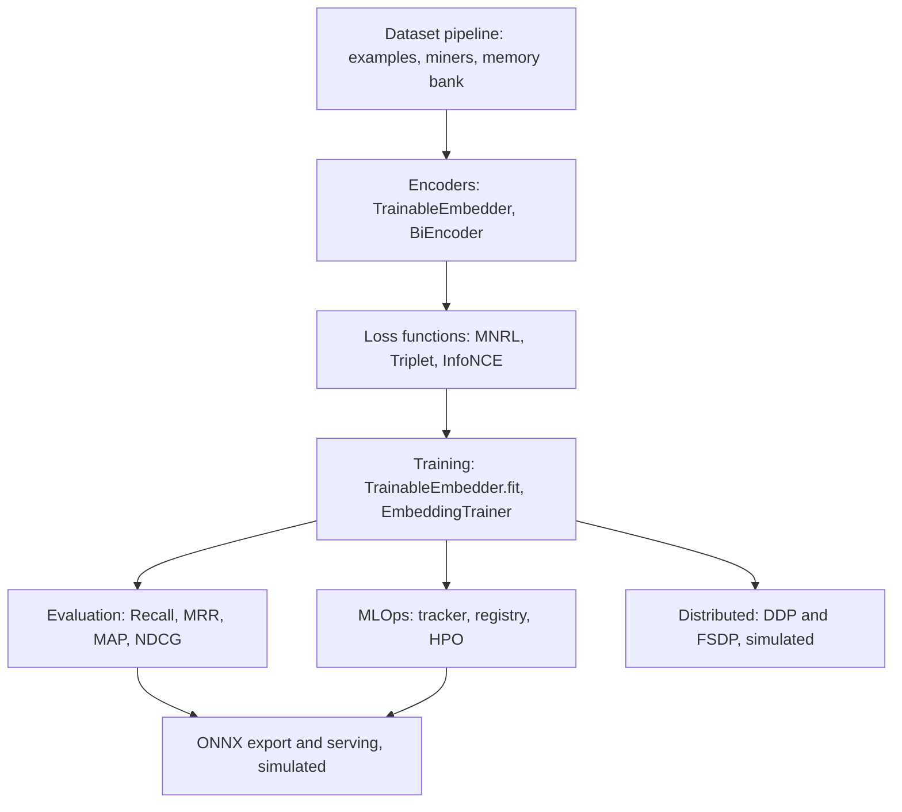

# Custom Embedding Model

A from-scratch, dependency-free Rust crate for training and evaluating text-embedding
models with contrastive learning. It pairs a genuinely trainable token-embedding model
(`TrainableEmbedder`, real hand-derived SGD) with a wider toolkit — bi-encoder pooling,
contrastive loss functions, hard-negative mining, retrieval metrics, and CPU-simulated
MLOps/distributed/ONNX surfaces — all implemented in pure Rust with no ML backend.

## Features

- **Genuinely trainable embedder** — `TrainableEmbedder` learns a `vocab_size × dim`
  token-embedding table by analytic gradient descent on a logistic contrastive loss
  (`trainable.rs`); training provably reduces loss and separates positive from negative pairs.
- **Bi-encoder pooling** — `BiEncoder` with CLS / mean / max pooling, optional projection
  head, and L2 normalization (`model.rs`); also a `CrossEncoder` reranker and a
  `SimpleTokenizer`.
- **Contrastive losses** — `MultipleNegativesRankingLoss`, `TripletMarginLoss`, and
  `InfoNCELoss` behind a shared `LossFunction` trait (`loss.rs`).
- **Hard-negative mining** — `HardNegativeMiner` ranks corpus embeddings by cosine
  similarity and excludes the positive; plus `MemoryBank`, `InBatchNegativeSampler`,
  `CurriculumSampler`, and `RandomNegativeSampler` (`dataset.rs`).
- **Retrieval evaluation** — `EmbeddingEvaluator` computes Recall@k, Precision@k, NDCG@k,
  MRR, and MAP, plus clustering quality metrics (`evaluation.rs`).
- **Training loop** — `EmbeddingTrainer` with gradient accumulation, LR warmup/cosine
  decay (`LRScheduler`), AdamW state, and throughput metrics (`trainer.rs`).
- **MLOps tracking** — `ExperimentTracker`, `ModelRegistry` with stage transitions, and
  `HyperparameterSearch` with JSON-serializable state (`mlops.rs`).
- **Distributed wrappers** — `DistributedDataParallel` (DDP) and
  `FullyShardedDataParallel` (FSDP) with sharding strategies and a `DistributedSampler`
  (`distributed.rs`), CPU-simulated single-process.
- **ONNX surface** — `OnnxExporter`, `OnnxQuantizer`, `OnnxSession`, and `DynamicBatcher`
  modeling export/quantize/inference (`onnx.rs`), simulated.
- **Serving types** — `EmbeddingService` with request/response types for encode and
  similarity endpoints (`serving.rs`), in-process (no HTTP listener).

## Architecture



| Component | Module | Responsibility |
|-----------|--------|----------------|
| Trainable embedder | `trainable` | Token-embedding table trained by real SGD on contrastive loss |
| Bi-encoder | `model` | Pooling (CLS/mean/max), projection, normalization; cross-encoder; tokenizer |
| Dataset pipeline | `dataset` | Examples, hard-negative mining, memory bank, samplers, similarity helpers |
| Loss functions | `loss` | MNRL, triplet, InfoNCE behind `LossFunction` |
| Trainer | `trainer` | Epoch loop, scheduler, AdamW state, metrics (simulated weight update) |
| Evaluation | `evaluation` | Retrieval and clustering metrics |
| MLOps | `mlops` | Experiment tracking, model registry, hyperparameter search |
| Distributed | `distributed` | DDP / FSDP wrappers, sharding, distributed sampler (simulated) |
| ONNX | `onnx` | Export, quantization, session, dynamic batching (simulated) |
| Serving | `serving` | Embedding service and request/response types (in-process) |

## Quick Start

### Prerequisites

- Rust 1.70+ (`edition = "2021"`) and `cargo`.
- No external services, GPUs, or ML runtimes are required.

### Installation

```bash
cd 21-custom-embedding-model
cargo build
```

### Running

This is a library crate; exercise it through the test suite or a small driver:

```bash
cargo test          # run the full suite
cargo bench         # optional Criterion benchmarks
```

## Usage

Train the genuinely-learnable embedder on labelled pairs and confirm it separates topics:

```rust
use custom_embedding_model::{TrainableEmbedder, TrainingPair};

fn main() {
    // Vocab: topic-A tokens {0,1}, topic-B tokens {2,3}; 8-dim embeddings.
    let mut model = TrainableEmbedder::new(4, 8);

    let pairs = vec![
        TrainingPair::positive(vec![0, 1], vec![1, 0]), // same topic A
        TrainingPair::positive(vec![2, 3], vec![3, 2]), // same topic B
        TrainingPair::negative(vec![0, 1], vec![2, 3]), // A vs B
        TrainingPair::negative(vec![2, 3], vec![0, 1]), // B vs A
    ];

    // Real SGD: returns mean loss per epoch (monotonically decreasing here).
    let losses = model.fit(&pairs, 300, 0.5);
    println!("loss {:.3} -> {:.3}", losses[0], losses[losses.len() - 1]);

    // Learned geometry: same-topic similarity exceeds cross-topic similarity.
    let same = model.similarity(&[0, 1], &[1, 0]);
    let diff = model.similarity(&[0, 1], &[2, 3]);
    assert!(same > diff);
}
```

Encode with the bi-encoder and score retrieval metrics:

```rust
use custom_embedding_model::{BiEncoder, PoolingStrategy, EmbeddingEvaluator};
use std::collections::HashMap;

let encoder = BiEncoder::new(64, PoolingStrategy::Mean, true, None);
let tokens = vec![vec![1.0; 64], vec![2.0; 64]]; // token embeddings -> pooled vector
let emb = encoder.encode(&tokens).unwrap();
assert_eq!(emb.len(), 64);

let evaluator = EmbeddingEvaluator::new(vec![1, 5, 10]);
let queries = vec![emb.clone()];
let corpus = vec![emb.clone(), vec![0.0; 64]];
let relevance: HashMap<usize, Vec<usize>> = HashMap::from([(0, vec![0])]);
let metrics = evaluator.evaluate_retrieval(&queries, &corpus, &relevance);
println!("{}", metrics.format());
```

## What's Real vs Simulated

- **Real:** `TrainableEmbedder` (`trainable.rs`) is a fully learnable model — mean-pooled
  token embeddings, dot-product similarity, and analytic gradients of a logistic
  contrastive loss (`dL/ds = sigmoid(s) - y`) applied by hand-rolled SGD. Tests verify
  loss decreases and positive pairs out-score negatives. Also real: all loss functions,
  retrieval/clustering metrics, the hard-negative miner, memory bank, samplers, tokenizer,
  pooling, and the MLOps tracker/registry/HPO logic — pure-Rust computation backed by tests.
- **Simulated / no ML backend:** the legacy `BiEncoder` projection weights are random and
  never trained, and `EmbeddingTrainer::update_weights` perturbs weights with random noise
  instead of gradients, so that path does not learn. `DistributedDataParallel`,
  `FullyShardedDataParallel`, and the ONNX exporter/quantizer/session run CPU-simulated:
  the data structures, configuration, and API surface are complete, but no real gradient
  synchronization, ONNX graph serialization, or runtime inference occurs. `EmbeddingService`
  defines request/response types and an in-process handler but starts no HTTP listener.

## Testing

```bash
cargo test
```

The suite runs 273 unit tests across all modules — encoders, losses, miners, metrics,
trainer, MLOps, distributed, ONNX, and serving — with no external services or ML runtimes
required. Criterion benchmarks for encode / loss / eval live under `benches/`.

## Project Structure

```
21-custom-embedding-model/
  README.md                       # This file
  Cargo.toml                      # Crate manifest (thiserror, rand, rayon, serde, ...)
  src/
    lib.rs                        # Crate root, exports, Error type, constants
    trainable.rs                  # TrainableEmbedder: real SGD on contrastive loss
    model.rs                      # BiEncoder, CrossEncoder, SimpleTokenizer
    dataset.rs                    # Examples, HardNegativeMiner, MemoryBank, samplers
    loss.rs                       # MNRL, Triplet, InfoNCE (LossFunction trait)
    trainer.rs                    # EmbeddingTrainer, LRScheduler, AdamW state
    evaluation.rs                 # EmbeddingEvaluator: Recall/MRR/MAP/NDCG, clustering
    mlops.rs                      # ExperimentTracker, ModelRegistry, HyperparameterSearch
    distributed.rs                # DDP / FSDP wrappers, DistributedSampler (simulated)
    onnx.rs                       # OnnxExporter/Quantizer/Session, DynamicBatcher (simulated)
    serving.rs                    # EmbeddingService and request/response types
  benches/
    embedding_benchmarks.rs       # Criterion benchmarks
  docs/
    BLUEPRINT.md                  # Full architecture and design
```

## License

MIT — see [LICENSE](../LICENSE)
