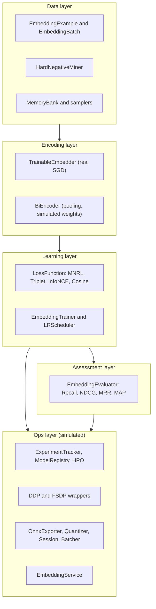

# Custom Embedding Model

## Overview

This crate is a from-scratch, dependency-free study of how text-embedding models are
trained with contrastive learning, written in pure Rust. Its centerpiece is
`TrainableEmbedder` — a small but genuinely learnable model whose backpropagation is
hand-derived and fully visible, so the gradient math is the documentation. Around that
core sits the wider machinery of an embedding-training stack: bi-encoder pooling, a family
of contrastive loss functions, hard-negative mining, retrieval and clustering metrics, a
training loop with scheduling, and CPU-simulated MLOps, distributed-training, ONNX-export,
and serving surfaces.

The goals are pedagogical and structural rather than production performance:

- Show a complete, *correct* contrastive learning step end to end — pooling, similarity,
  loss, analytic gradient, weight update — without hiding it behind an autodiff framework.
- Model the surrounding system (datasets, miners, samplers, metrics, trainer, registry,
  distributed wrappers, ONNX, serving) with realistic types and APIs, so the shape of a
  real embedding platform is visible even where the heavy numerics are simulated.
- Stay honest about the boundary between what actually learns and what is a stub. The
  crate deliberately keeps two encoder paths: a real one (`TrainableEmbedder`) and a legacy
  simulated one (`BiEncoder` + `EmbeddingTrainer`) whose update is random noise, not
  gradients. This document marks that boundary at every layer.

Concepts the crate teaches:

- **Contrastive / metric learning**: pulling relevant pairs together and pushing
  irrelevant pairs apart in embedding space using a logistic or softmax objective.
- **Pooling strategies**: turning a sequence of token vectors into one sentence vector via
  CLS, mean, or max pooling, with optional projection and L2 normalization.
- **Hard-negative mining**: selecting negatives that are close to the anchor (and so most
  informative) rather than random ones.
- **In-batch negatives and memory banks**: reusing other batch elements and a FIFO buffer
  of past embeddings as cheap negatives.
- **Retrieval evaluation**: Recall@k, Precision@k, NDCG@k, MRR, and MAP.
- **Training infrastructure**: LR warmup/cosine decay, gradient accumulation, AdamW state,
  experiment tracking, model registry stages, and hyperparameter search.
- **Scale-out and deployment patterns**: DDP/FSDP wrappers, ONNX export/quantization,
  dynamic batching, and an inference service interface.

Scope: everything runs on CPU with no external services. The dependency set is small —
`thiserror`, `rand`, `rayon`, `serde`/`serde_json`, `num-traits`, `chrono`, `uuid`, and
`criterion` for benchmarks — and no ML backend (`candle`/`tch`/`burn`) is used. The
crate has 273 unit tests.

## Architecture



The layers map onto the crate's modules:

- **Data layer** (`dataset.rs`) defines the training example schema and the collated batch,
  plus the negative-sampling machinery: a cosine-ranking hard-negative miner, a FIFO memory
  bank, an in-batch sampler, a curriculum sampler, and a seeded random sampler. It also
  hosts the shared vector helpers (`cosine_similarity`, `dot_similarity`, `normalize`).
- **Encoding layer** holds the two encoder paths. `trainable.rs` provides the real,
  learnable `TrainableEmbedder`. `model.rs` provides the legacy `BiEncoder` (pooling +
  projection over a random, untrained weight matrix), a `CrossEncoder` reranker, and a
  `SimpleTokenizer`.
- **Learning layer** combines losses (`loss.rs`) behind the `LossFunction` trait with the
  training loop (`trainer.rs`). The trainer's optimizer update is simulated noise; the real
  optimization lives in `TrainableEmbedder::fit`.
- **Assessment layer** (`evaluation.rs`) ranks corpus documents per query and reports
  retrieval metrics, plus an intra/inter-cluster distance summary.
- **Ops layer** (`mlops.rs`, `distributed.rs`, `onnx.rs`, `serving.rs`) models tracking,
  registry, hyperparameter search, distributed wrappers, ONNX export/quantization, and a
  serving interface. The data structures and APIs are complete; the heavy numerics
  (gradient sync, ONNX serialization, HTTP) are simulated.

All cross-cutting types live in `lib.rs`: the `Result` alias, the `Error` enum (via
`thiserror`), and the constants `EMBEDDING_DIM = 768` and `DEFAULT_TEMPERATURE = 0.05`.

## Core Components

### TrainableEmbedder (the real model)

`trainable.rs` is the heart of the crate. The model is a `vocab_size × dim` table of
`f32` rows. Encoding a token sequence mean-pools the rows of its tokens; similarity is the
dot product of two pooled vectors:

```rust
pub fn embed(&self, tokens: &[usize]) -> Vec<f32> {
    let mut v = vec![0.0f32; self.dim];
    let mut n = 0usize;
    for &t in tokens {
        if t < self.vocab_size {
            for d in 0..self.dim { v[d] += self.table[t][d]; }
            n += 1;
        }
    }
    if n > 0 {
        let inv = 1.0 / n as f32;
        for d in 0..self.dim { v[d] *= inv; }
    }
    v
}
```

Training is real SGD on a logistic contrastive loss. For a pair with pooled embeddings
`u_a`, `u_b`, score `s = <u_a, u_b>` and probability `p = sigmoid(s)`, the loss is the
binary cross-entropy `-[y·ln p + (1-y)·ln(1-p)]`, whose derivative with respect to the
score is simply `dL/ds = p - y`. Because `s` is bilinear in the pooled embeddings and each
pooled embedding is `1/|tokens|` times the sum of its rows, the gradient with respect to a
token row `t ∈ a` is `(p - y) · (1/|a|) · u_b` (and symmetrically for `t ∈ b`). The update
applies that gradient directly:

```rust
fn train_pair(&mut self, pair: &TrainingPair, lr: f32) -> f32 {
    let ua = self.embed(&pair.a);
    let ub = self.embed(&pair.b);
    let s = dot(&ua, &ub);
    let pred = sigmoid(s);

    let eps = 1e-7;
    let loss = -(pair.label * (pred + eps).ln()
        + (1.0 - pair.label) * (1.0 - pred + eps).ln());

    let dl_ds = pred - pair.label;
    let na = pair.a.iter().filter(|&&t| t < self.vocab_size).count().max(1) as f32;
    let nb = pair.b.iter().filter(|&&t| t < self.vocab_size).count().max(1) as f32;

    for &t in &pair.a {
        if t < self.vocab_size {
            for d in 0..self.dim {
                self.table[t][d] -= lr * dl_ds * (1.0 / na) * ub[d];
            }
        }
    }
    // ... symmetric loop over pair.b using ua ...
    loss
}
```

Two subtleties make this correct. First, `ua`/`ub` are captured *before* the update, so
mutating the table inside the loop does not corrupt the gradient (the gradient is evaluated
at the pre-step point). Second, out-of-range tokens are skipped consistently in both
pooling and the per-row count, so the `1/|tokens|` factor matches the embedding.

`fit(pairs, epochs, lr)` runs `epochs` passes and returns the mean pre-update loss per
epoch. The tests demonstrate genuine learning: loss falls from its initial value below
`0.25` over 300 epochs, same-topic similarity ends up above cross-topic similarity, and two
independently-initialized models reach the same separation ordering — a property of the
gradient signal, not of randomness. A production system would swap this hand-rolled
backprop for an autodiff backend while keeping the same objective and pooling.

### BiEncoder and friends (legacy, simulated)

`model.rs` provides the bi-encoder path used by the rest of the system. `BiEncoder::encode`
takes a slice of token embeddings, applies a `PoolingStrategy` (CLS takes the first token,
Mean averages, Max takes the per-dimension maximum), optionally projects to a smaller
dimension through a random weight matrix, and optionally L2-normalizes:

```rust
let encoder = BiEncoder::new(64, PoolingStrategy::Mean, true, Some(32));
let emb = encoder.encode(&token_embeddings)?; // length 32, unit norm
```

The pooling and normalization are exact and tested (e.g. mean of `[[1,0],[0,1]]` is
`[0.5,0.5]`; max is `[1,1]`). What is *simulated* is the encoder itself: `encoder_weights`
and `projection_weights` are random and never trained, and `encode_text` fabricates token
embeddings from a byte hash so that serving has something deterministic to return. The
companion `CrossEncoder` scores a query/document pair through a sigmoid over a random weight
vector, and `SimpleTokenizer` does whitespace tokenization against a 4-entry special-token
vocabulary with padding/truncation to a fixed length.

### Dataset pipeline

`dataset.rs` defines `EmbeddingExample` (anchor, positive, a list of negatives, optional
domain tag, and a `difficulty` score) and the collated `EmbeddingBatch` (parallel vectors
of anchor/positive/negative embeddings plus diagonal `labels`). The negative-sampling
toolkit is the substantive part:

- **`HardNegativeMiner`** builds an in-memory index from corpus embeddings and IDs, then
  for each anchor computes cosine similarity to every corpus vector, sorts descending,
  excludes the known positive by ID, and returns the top-k indices. This is exact
  brute-force ANN — `O(corpus × dim)` per anchor — appropriate for the test-scale corpora
  here and a faithful model of FAISS-style hard-negative mining.
- **`MemoryBank`** is a fixed-capacity FIFO ring of past embeddings, exposing the valid
  prefix (or the full buffer once it has wrapped) as additional negatives.
- **`InBatchNegativeSampler`** returns the current batch plus (optionally) the memory bank
  as negatives, and updates the bank after each step.
- **`CurriculumSampler`** sorts examples by difficulty and exposes only those below a
  threshold that rises each epoch.
- **`RandomNegativeSampler`** draws seeded, deduplicated, exclusion-aware random indices —
  deterministic for reproducibility.

The curriculum and random samplers reward a closer look because their behavior is fully
tested. `CurriculumSampler::new` sorts examples by difficulty and starts with a threshold of
`0.3`; `get_epoch_indices` returns only those at or below the current threshold, and
`next_epoch` raises it by a fixed rate, capped at `1.0`:

```rust
pub fn get_epoch_indices(&self) -> Vec<usize> {
    self.examples.iter()
        .filter(|(_, d)| *d <= self.difficulty_threshold)
        .map(|(i, _)| *i)
        .collect()
}
pub fn next_epoch(&mut self) {
    self.difficulty_threshold = (self.difficulty_threshold + self.increase_rate).min(1.0);
}
```

`RandomNegativeSampler` uses a seeded `StdRng` and rejection-samples until it has `k`
indices that are neither in the exclusion set nor already chosen — so two samplers built
with the same seed produce identical draws, which the tests assert directly. Together these
give the training loop a spectrum of negative-selection policies: easy-to-hard curriculum,
uniformly random, in-batch, and mined hard negatives.

The shared vector helpers underpin everything above. `cosine_similarity` returns `0.0` for a
zero vector (avoiding a NaN), `dot_similarity` is the raw inner product, and `normalize`
divides by the L2 norm in place (a no-op on the zero vector). These are tested against
exact expected values for identical, orthogonal, opposite, partial-angle, and 768-dimensional
inputs.

### Loss functions

`loss.rs` exposes a `LossFunction` trait (`compute(anchors, positives, negatives) -> f32`,
plus a `name`) with four implementations:

- **`MultipleNegativesRankingLoss`** treats every other positive in the batch (and any
  explicit negatives) as a negative, scales cosine similarities by `scale`, and applies a
  numerically-stable cross-entropy with the diagonal as the target via log-sum-exp.
- **`TripletMarginLoss`** enforces `d(a,p) + margin < d(a,n)` using cosine or Euclidean
  distance and a ReLU hinge, taking the first (hardest) negative per anchor.
- **`InfoNCELoss`** is the NT-Xent contrastive loss: temperature-scaled positive vs.
  in-batch and explicit negatives, again with a max-subtraction for stability.
- **`CosineEmbeddingLoss`** is a simple per-pair loss (`1 - cos` for positives, hinged
  `cos - margin` for negatives).

These are all real, deterministic computations exercised by 53 tests.

The numerical-stability handling is worth calling out because it is real and tested. MNRL
and InfoNCE both exponentiate scaled similarities, which would overflow for large `scale`
or small `temperature`. Both subtract the per-row maximum before exponentiating so the
largest term is `exp(0) = 1`:

```rust
// MNRL: cross-entropy with the diagonal as target, via log-sum-exp.
let max_score = scores.iter().cloned().fold(f32::NEG_INFINITY, f32::max);
let log_sum_exp: f32 = scores.iter()
    .map(|&s| (s - max_score).exp())
    .sum::<f32>().ln() + max_score;
let loss = log_sum_exp - scores[i]; // -log softmax at the positive
```

The triplet loss instead operates on distances (`1 - cos` or Euclidean) and a ReLU hinge,
so it never exponentiates; it simply skips anchors that have no negatives. The
`CosineEmbeddingLoss` is the simplest of the four and is the closest in spirit to the
objective `TrainableEmbedder` actually optimizes — minimize `1 - cos` on positives and push
`cos` below a margin on negatives — which is why the real learning was implemented as a
standalone module rather than retrofitted onto this trait.

### Trainer

`trainer.rs` wires a `BiEncoder`, a `LossFunction`, and a `TrainerConfig` into an
`EmbeddingTrainer`. `train_epoch` iterates batches, computes loss through the loss function,
updates the memory bank, logs at an interval, and returns `TrainingMetrics` (loss, steps,
wall time, samples, throughput). Supporting types include `LRScheduler` (linear warmup then
cosine annealing) and an `AdamWOptimizer` holding first/second-moment state.

The one deliberately-simulated step is `update_weights`, which perturbs parameters with
scaled random noise rather than computing and applying gradients:

```rust
fn update_weights(&mut self, _loss: f32) {
    let lr = self.get_learning_rate();
    for param in self.model.parameters_mut() {
        for p in param.iter_mut() {
            *p -= lr * rand::random::<f32>() * 0.001; // noise, not a gradient
        }
    }
}
```

This is why the `BiEncoder` path does not learn, and why the real learning lives in
`TrainableEmbedder`. The loss numbers, scheduling, and metrics around the update are all
genuine; only the optimizer step is a stand-in.

The supporting optimizer machinery, however, is implemented correctly even though the
trainer does not currently feed it real gradients. `AdamWOptimizer::step` is a faithful
AdamW: it maintains biased first/second moment estimates, applies bias correction, and
decouples weight decay from the gradient update:

```rust
self.m[i] = self.beta1 * self.m[i] + (1.0 - self.beta1) * grads[i];
self.v[i] = self.beta2 * self.v[i] + (1.0 - self.beta2) * grads[i] * grads[i];
let m_hat = self.m[i] / bias_correction1;
let v_hat = self.v[i] / bias_correction2;
params[i] -= self.lr * (m_hat / (v_hat.sqrt() + self.eps) + self.weight_decay * params[i]);
```

`clip_grad_norm` computes the global L2 norm and rescales in place if it exceeds the
threshold, returning the pre-clip norm. `LRScheduler::get_lr` does linear warmup up to
`warmup_steps`, then cosine annealing `base_lr · (1 + cos(π · progress)) / 2` to zero over
the remaining steps. These are the pieces a real training loop would compose once a true
backward pass replaces the simulated update — the objective and pooling from
`TrainableEmbedder` plus this optimizer, scheduler, and clipper.

### Evaluation

`evaluation.rs`'s `EmbeddingEvaluator` takes a set of K values and, given query embeddings,
corpus embeddings, and a query→relevant-docs map, ranks the corpus per query by cosine
similarity and accumulates:

- **Recall@k** = relevant docs retrieved in top-k / total relevant.
- **Precision@k** = relevant docs in top-k / k.
- **NDCG@k** = DCG over binary relevance with `1/log2(rank+2)` gains, normalized by the
  ideal DCG.
- **MRR** = reciprocal rank of the first relevant document, averaged.
- **MAP** = mean of average precisions across queries.

`evaluate_clustering` summarizes embedding geometry by comparing mean intra-cluster and
inter-cluster cosine distances. All metric math is real and tested against hand-computed
expectations.

### MLOps

`mlops.rs` models experiment tracking and model lifecycle:

- **`ExperimentTracker`** starts/ends runs (`ExperimentRun` with params, metrics as
  time-series `MetricPoint`s, tags, artifacts, and a `RunStatus`), and serializes to JSON.
- **`ModelRegistry`** registers `ModelVersion`s and transitions them through `ModelStage`s
  (e.g. staging → production), exposes the current production/latest version, and persists
  to JSON.
- **`HyperparameterSearch`** samples configurations from a list of `HyperparameterSpace`
  definitions (grid/random `SearchType`), records trials with scores, and reports the best
  params/score.

This logic is fully implemented in pure Rust; only the storage is local JSON rather than a
remote tracking server.

The registry enforces a real deployment lifecycle. `register_model` auto-increments the
version per model name and stamps it with a `run_id`, creation time, and the metrics it was
registered with. `transition_stage` validates that the model and version exist, and — the
important invariant — when promoting a version to `Production` it first demotes any current
production version to `Archived`, so there is at most one production model at a time:

```rust
if stage == ModelStage::Production {
    for m in versions.iter_mut() {
        if m.stage == ModelStage::Production {
            m.stage = ModelStage::Archived;
        }
    }
}
if let Some(model) = versions.iter_mut().find(|m| m.version == version) {
    model.stage = stage;
}
```

`get_production_model` then returns the single production version, and `get_latest_version`
returns the most recently registered one regardless of stage. Runs and registries both
round-trip through `save`/`load` as JSON, which the tests exercise to confirm metrics,
params, tags, and stages survive serialization.

### Distributed (simulated)

`distributed.rs` mirrors PyTorch's DDP/FSDP APIs on a single CPU process. A
`DistributedConfig` (rank, world size, backend — defaulting to `Simulated`) drives a
`ProcessGroup` whose `barrier`/`broadcast` are no-ops at world size 1.
`DistributedDataParallel::sync_gradients` tracks gradient norm and communication-byte stats,
optionally compresses gradients by zeroing sub-threshold entries, and performs an
`all_reduce` that divides by world size for the mean op. `FullyShardedDataParallel` shards
named parameters across ranks (`ShardingStrategy::FullShard` / `ShardGradOp` / …) and
simulates `all_gather` and `reduce_scatter`. A `DistributedSampler` partitions dataset
indices per rank with epoch-based shuffling. The structures, configs, and call sequences are
complete; no real inter-process communication happens.

The sharding arithmetic is exact even in simulation. `shard_parameters` splits each named
parameter into `ceil(full_size / world_size)`-sized shards and records each rank's offset
and actual (possibly truncated) shard length:

```rust
let shard_size = (full_size + world_size - 1) / world_size;
let shard_offset = rank * shard_size;
let actual_size = shard_size.min(full_size.saturating_sub(shard_offset));
```

`all_gather` reconstructs a full-length buffer and copies the local shard into its slice;
`reduce_scatter` returns this rank's slice of the reduced gradients, dividing by world size
to model averaging. `DistributedSampler::num_samples` rounds the dataset up to a multiple of
the replica count (or down when `drop_last` is set) and divides, matching PyTorch's padding
semantics so every rank sees an equal number of samples. A test simulates four ranks and
checks that their shards tile the parameter without gaps or overlap.

### ONNX (simulated)

`onnx.rs` models the export-and-serve path. `OnnxExporter::export` walks model parameters,
builds an in-memory `OnnxGraph` of input nodes and weight initializers, optionally runs a
graph-optimization pass, and returns an `ExportResult` (model size, parameter count, opset
version, node count, export time) — but does not serialize a real ONNX protobuf.
`OnnxQuantizer::quantize` reports a compression ratio from the target weight type
(Int8/Uint8 → ÷4, Float16 → ÷2). `OnnxSession::run` fabricates output tensors and records
latency in `SessionStats`. `DynamicBatcher` collects tensors until a max batch size or wait
time and flushes grouped batches. Strong typing (`OnnxTensor`, `TensorInfo`,
`ExecutionProvider`, `GraphOptimizationLevel`) is real; the numerics are simulated.

The type layer is genuinely useful even without a runtime behind it. `OnnxDataType` knows
its byte size and the ONNX type enum value; `TensorInfo` carries a name, dtype, and shape
and can report whether it is dynamic (any `-1` dimension) and its element count when fully
specified; `OnnxTensor` wraps either an `f32` or `i64` payload with typed accessors. The
`DynamicBatcher` is the most operationally realistic piece: `add` accumulates pending
requests and emits grouped batches once `max_batch_size` is reached, while `flush` drains
whatever is pending — the standard latency-vs-throughput trade-off a serving stack makes.
`OnnxExporter` reports a real `ExportResult` derived from the actual parameter map (model
size in bytes = `params × 4`, parameter and node counts, opset version, export time), so the
*shape* of the export is accurate even though no protobuf is written. The honest gap is the
serialization itself and any real inference: `OnnxSession::run` returns fabricated outputs
and only the latency bookkeeping is meaningful.

### Putting it together

A complete training-and-serving narrative, threading the real and simulated pieces:

1. Build `EmbeddingExample`s and mine hard negatives. `HardNegativeMiner::build_index` is
   given corpus embeddings and IDs; `mine` returns, per anchor, the indices of the most
   similar corpus vectors that are not the positive.
2. Encode and learn. For the real path, tokenize into id sequences and call
   `TrainableEmbedder::fit(pairs, epochs, lr)`, watching the returned per-epoch loss fall.
   For the bi-encoder path, `EmbeddingTrainer::train_epoch` runs the loss and metrics loop
   (with the simulated optimizer step).
3. Evaluate. `EmbeddingEvaluator::evaluate_retrieval` ranks the corpus per query and reports
   Recall@k / NDCG@k / MRR / MAP; `evaluate_clustering` summarizes geometry.
4. Track and register. An `ExperimentTracker` run logs params and per-step metrics; a
   `ModelRegistry` registers the resulting version and promotes it to `Production`.
5. Export and serve. `OnnxExporter::export` produces an `ExportResult`; an `EmbeddingService`
   answers `encode` and `similarity` requests and reports p95/p99 latency.

Steps 1–3 are backed by real computation; steps 4–5 are real in their control flow and
data structures, with the heavy numerics (ONNX serialization, HTTP transport) simulated.

### Serving (in-process)

`serving.rs` defines an `EmbeddingService` around a `ServerConfig` and the request/response
types (`EmbeddingRequest`/`EmbeddingResponse`, `SimilarityRequest`/`SimilarityResponse`,
`HealthResponse`, `ModelStats`). Handlers validate input (non-empty, within max batch size),
encode through the bi-encoder's deterministic `encode_text`, optionally re-normalize, and
record latency for p95/p99 stats. No HTTP listener is started; the service is a typed
in-process handler.

The similarity handler is a complete retrieval-in-miniature: it encodes the query and each
candidate through `encode_text`, normalizes both, scores by cosine similarity, sorts
descending, assigns 1-indexed ranks, and truncates to `top_k`. The latency tracking is also
real — `record_latency` keeps a rolling window of the last 1000 observations and recomputes
the average and the p95/p99 percentiles on each call:

```rust
let mut sorted = self.latency_history.clone();
sorted.sort_by(|a, b| a.partial_cmp(b).unwrap_or(std::cmp::Ordering::Equal));
let p95_idx = ((n * 0.95) as usize).min(sorted.len() - 1);
let p99_idx = ((n * 0.99) as usize).min(sorted.len() - 1);
self.stats.p95_latency_ms = sorted[p95_idx];
self.stats.p99_latency_ms = sorted[p99_idx];
```

The handlers enforce the same validation a real service would: an unloaded model is an
`InvalidConfig` error, empty input is `EmptyData`, and a batch larger than
`max_batch_size` is rejected. What is missing relative to a production service is only the
transport and the trained weights — the request lifecycle, statistics, and health reporting
(`uptime`, `model_loaded`, crate version) are genuine.

## Data Structures

The training pair and the real model (`trainable.rs`):

```rust
pub struct TrainingPair {
    pub a: Vec<usize>,   // token ids of the first text
    pub b: Vec<usize>,   // token ids of the second text
    pub label: f32,      // 1.0 = relevant (positive), 0.0 = irrelevant (negative)
}

pub struct TrainableEmbedder {
    vocab_size: usize,
    dim: usize,
    table: Vec<Vec<f32>>, // vocab_size x dim embedding table, trained by SGD
}
```

The dataset example and batch (`dataset.rs`):

```rust
pub struct EmbeddingExample {
    pub anchor_id: String,
    pub anchor_text: String,
    pub positive_id: String,
    pub positive_text: String,
    pub negative_ids: Vec<String>,
    pub negative_texts: Vec<String>,
    pub domain: Option<String>,
    pub difficulty: f32, // 0 = easy, 1 = hard
}

pub struct EmbeddingBatch {
    pub anchor_embeddings: Vec<Vec<f32>>,
    pub positive_embeddings: Vec<Vec<f32>>,
    pub negative_embeddings: Vec<Vec<Vec<f32>>>, // batch x num_neg x dim
    pub labels: Vec<usize>,                       // diagonal positives
}
```

The encoder and trainer configuration (`model.rs`, `trainer.rs`):

```rust
pub enum PoolingStrategy { Cls, Mean, Max }

pub struct TrainerConfig {
    pub num_epochs: usize,
    pub batch_size: usize,
    pub learning_rate: f32,
    pub weight_decay: f32,
    pub max_grad_norm: f32,
    pub temperature: f32,
    pub use_memory_bank: bool,
    pub memory_bank_size: usize,   // default 65536
    pub log_interval: usize,
    pub eval_interval: usize,
    pub save_interval: usize,
    pub gradient_accumulation: usize,
    pub warmup_ratio: f32,
}
```

Retrieval metrics (`evaluation.rs`):

```rust
pub struct RetrievalMetrics {
    pub recall: HashMap<usize, f32>,    // k -> Recall@k
    pub precision: HashMap<usize, f32>, // k -> Precision@k
    pub ndcg: HashMap<usize, f32>,      // k -> NDCG@k
    pub mrr: f32,
    pub map: f32,
}
```

The loss configurations (`loss.rs`) — each loss is a small struct of hyperparameters behind
the shared trait:

```rust
pub trait LossFunction: Send + Sync {
    fn compute(&self, anchors: &[Vec<f32>], positives: &[Vec<f32>],
               negatives: Option<&[Vec<Vec<f32>>]>) -> f32;
    fn name(&self) -> &'static str;
}

pub struct MultipleNegativesRankingLoss { pub scale: f32 }      // default 20.0
pub struct TripletMarginLoss { pub margin: f32, pub cosine_distance: bool } // 0.5, true
pub struct InfoNCELoss { pub temperature: f32 }                 // default 0.07
pub struct CosineEmbeddingLoss { pub margin: f32 }              // default 0.0
```

The MLOps lifecycle types (`mlops.rs`):

```rust
pub enum RunStatus { Running, Finished, Failed, Killed }

pub struct ModelVersion {
    pub name: String,
    pub version: u32,
    pub stage: ModelStage,                 // None | Staging | Production | Archived
    pub run_id: uuid::Uuid,
    pub model_path: PathBuf,
    pub created_at: chrono::DateTime<chrono::Utc>,
    pub description: Option<String>,
    pub metrics: HashMap<String, f64>,
}
```

The distributed and ONNX configuration enums (`distributed.rs`, `onnx.rs`):

```rust
pub enum ShardingStrategy { FullShard, ShardGradOp, NoShard, HybridShard }
pub enum ReduceOp { Sum, Mean, Max, Min }

pub enum OnnxDataType { Float32, Float16, Int64, Int32, Int8, Uint8, Bool, String }
pub enum ExecutionProvider { Cpu, Cuda { device_id: i32 }, TensorRT { device_id: i32 },
                            CoreML, DirectML { device_id: i32 }, OpenVINO, Nnapi }
pub enum GraphOptimizationLevel { Disabled, Basic, Extended, All }
```

The crate-wide error type (`lib.rs`):

```rust
pub enum Error {
    DimensionMismatch { expected: usize, got: usize },
    InvalidConfig(String),
    TrainingError(String),
    EvaluationError(String),
    IoError(std::io::Error),
    EmptyData,
    OnnxError(String),
    DistributedError(String),
}

pub const EMBEDDING_DIM: usize = 768;
pub const DEFAULT_TEMPERATURE: f32 = 0.05;
```

## API Design

The public API is the crate's re-exports from `lib.rs`. Key entry points:

```text
// Real, trainable model
TrainableEmbedder::new(vocab_size, dim) -> TrainableEmbedder
TrainableEmbedder::embed(&self, &[usize]) -> Vec<f32>
TrainableEmbedder::similarity(&self, &[usize], &[usize]) -> f32
TrainableEmbedder::fit(&mut self, &[TrainingPair], epochs, lr) -> Vec<f32>
TrainingPair::positive(a, b) / TrainingPair::negative(a, b)

// Bi-encoder path
BiEncoder::new(embedding_dim, PoolingStrategy, normalize, projection_dim) -> BiEncoder
BiEncoder::encode(&self, &[Vec<f32>]) -> Result<Vec<f32>>
BiEncoder::encode_batch(&self, &[Vec<Vec<f32>>]) -> Result<Vec<Vec<f32>>>

// Dataset / mining
HardNegativeMiner::build_index(&mut self, Vec<Vec<f32>>, Vec<String>) -> Result<()>
HardNegativeMiner::mine(&self, &[Vec<f32>], &[String], k) -> Vec<Vec<usize>>
MemoryBank::new(max_size, embedding_dim) / update / get_embeddings

// Losses (LossFunction trait)
MultipleNegativesRankingLoss::new(scale)
TripletMarginLoss::new(margin, cosine_distance)
InfoNCELoss::new(temperature)
LossFunction::compute(&self, anchors, positives, negatives) -> f32

// Training
EmbeddingTrainer::new(BiEncoder, loss_fn, TrainerConfig)
EmbeddingTrainer::train_epoch(&mut self, &[EmbeddingBatch], epoch) -> TrainingMetrics

// Evaluation
EmbeddingEvaluator::new(k_values)
EmbeddingEvaluator::evaluate_retrieval(&self, queries, corpus, relevance) -> RetrievalMetrics

// MLOps
ExperimentTracker / ModelRegistry / HyperparameterSearch

// Ops surfaces (simulated)
DistributedDataParallel / FullyShardedDataParallel / DistributedSampler
OnnxExporter / OnnxQuantizer / OnnxSession / DynamicBatcher
EmbeddingService::encode(&mut self, &EmbeddingRequest) -> Result<EmbeddingResponse>
```

The serving request/response types are JSON-serializable (`serde`), so the in-process
`EmbeddingService` mirrors what a real HTTP service would accept and return:

```text
POST /embed     EmbeddingRequest { texts, normalize, pooling }    -> EmbeddingResponse
POST /similarity SimilarityRequest { query, candidates, top_k }   -> SimilarityResponse
GET  /health                                                       -> HealthResponse
```

These endpoints describe the intended HTTP surface; the crate implements the handlers as
in-process methods, not a running server.

## Performance

The crate is a CPU reference implementation, so the numbers that matter are algorithmic
complexity and what the benchmarks measure, not hardware throughput. No GPU or
hardware-specific benchmarks are claimed.

- **Pooling / encoding**: `O(tokens × dim)` per sequence for mean/max pooling, plus
  `O(input_dim × output_dim)` if a projection head is configured.
- **`TrainableEmbedder` step**: each pair touches only the rows of its tokens, so an SGD
  step is `O((|a| + |b|) × dim)` — independent of vocabulary size.
- **Hard-negative mining**: brute-force cosine ranking is `O(corpus × dim)` per anchor plus
  an `O(corpus log corpus)` sort. This is exact and appropriate at the corpus sizes used in
  tests; a production miner would swap in an approximate index (the structure mirrors FAISS
  IVF usage).
- **Loss functions**: MNRL and InfoNCE compute a full `O(batch² × dim)` similarity grid
  over in-batch negatives, with log-sum-exp stabilization; triplet and cosine losses are
  `O(batch × dim)`.
- **Retrieval evaluation**: `O(queries × corpus × dim)` for scoring plus per-query sorts.

`benches/embedding_benchmarks.rs` defines Criterion benchmarks for the encode / loss / eval
paths; run them with `cargo bench`. The configuration types carry realistic
production-scale defaults so the API shape matches real training even though the heavy
compute is simulated:

| Default | Value | Source |
|---------|------:|--------|
| Embedding dimension | 768 | `EMBEDDING_DIM` (`lib.rs`) |
| Contrastive temperature | 0.05 | `DEFAULT_TEMPERATURE`, `TrainerConfig` |
| Batch size | 32 | `TrainerConfig` |
| Learning rate | 2e-5 | `TrainerConfig` |
| Weight decay | 0.01 | `TrainerConfig` / AdamW |
| Max gradient norm | 1.0 | `TrainerConfig` (clipping) |
| Memory-bank size | 65536 | `TrainerConfig` |
| Warmup ratio | 0.1 | `TrainerConfig` / scheduler |
| MNRL scale | 20.0 | `MultipleNegativesRankingLoss::default` |
| InfoNCE temperature | 0.07 | `InfoNCELoss::default` |
| Triplet margin | 0.5 | `TripletMarginLoss::default` |
| Server port / workers | 8080 / 4 | `ServerConfig` |
| Max batch (serving) | 64 | `ServerConfig` |
| FSDP min-wrap params | 100000 | `FSDPConfig` size-based auto-wrap |

These mirror common settings for sentence-embedding fine-tuning (small LR with warmup,
modest temperature, large in-batch-negative memory bank). They are configuration values,
not measured results — the crate makes no hardware throughput claims.

## Testing Strategy

The suite is 273 unit tests, all in-process with no external services or ML runtimes, and
runs in well under a second.

- **Real-learning verification** (`trainable.rs`): tests assert that `fit` *reduces* loss
  over epochs (final loss below 0.25 from a higher start), that same-topic similarity
  exceeds cross-topic similarity after training, and that two independently-initialized
  models converge to the same separation ordering — distinguishing a true gradient signal
  from noise. An edge-case test confirms the embedding of an empty token list is the zero
  vector.
- **Pooling and encoding** (`model.rs`): exact expected outputs for CLS/mean/max pooling
  (including with negatives), unit-norm checks after normalization, projection-dimension
  checks, parameter counting, empty-input error handling, and tokenizer padding/truncation/
  unknown-token behavior.
- **Loss correctness** (`loss.rs`): positivity, NaN-freedom, batch-size handling,
  margin/temperature effects, and the in-batch-negative construction for each loss.
- **Dataset and mining** (`dataset.rs`): miner correctly excludes the positive and returns
  the next-most-similar negatives; memory bank FIFO wrap-around and size accounting;
  curriculum threshold advancement and capping; deterministic, deduplicated random
  sampling; and exact cosine/dot/normalize results (identical, orthogonal, opposite, zero,
  and high-dimensional vectors).
- **Evaluation** (`evaluation.rs`): Recall/Precision/NDCG/MRR/MAP against hand-computed
  values and the intra/inter-cluster distance summary.
- **Trainer, MLOps, distributed, ONNX, serving**: config defaults, scheduler warmup/decay
  shape, experiment-run lifecycle and JSON round-trips, registry stage transitions,
  hyperparameter sampling and best-trial selection, multi-rank simulation and sharding
  arithmetic, ONNX export/quantization result fields and dynamic-batching flush behavior,
  and serving request validation and latency-stat recording.

The strategy deliberately puts the strongest assertions where the real computation is —
the trainable model, the losses, the miner, and the metrics — and treats the simulated
surfaces as contract/shape tests (the data structures and call sequences behave, even
though the underlying numerics are stand-ins).

The 273 tests are distributed roughly in proportion to where the real logic lives:

| Module | Tests | Emphasis |
|--------|------:|----------|
| `loss` | 53 | Loss correctness, stability, batch/negative handling |
| `dataset` | 45 | Miner, memory bank, samplers, vector helpers |
| `model` | 43 | Pooling exactness, normalization, tokenizer |
| `evaluation` | 39 | Recall/NDCG/MRR/MAP against hand-computed values |
| `trainer` | 32 | Config defaults, scheduler shape, AdamW, clipping |
| `distributed` | 16 | Sharding arithmetic, multi-rank simulation, sampler |
| `onnx` | 15 | Tensor/types, export-result fields, batcher flush |
| `serving` | 14 | Request validation, similarity ranking, latency stats |
| `mlops` | 11 | Run lifecycle, registry stage invariants, HPO |
| `trainable` | 4 | Real-learning verification (the core claim) |
| `lib` | 1 | Constant sanity |

The four `trainable` tests are few but carry the crate's central claim: that this is a model
that actually learns. They are the assertions that would fail loudest if the gradient math
were wrong, which is precisely why they are written as behavioral checks (loss decreases,
ordering separates, two seeds agree) rather than as exact-value snapshots that could pass
for the wrong reason.

### Error handling and invariants

Errors flow through the single `Error` enum and the `Result<T>` alias. The fallible paths
each map to a specific variant: a corpus/ID length mismatch in `HardNegativeMiner::build_index`
returns `DimensionMismatch`; encoding an empty token list in `BiEncoder::encode` returns
`EmptyData`; an unloaded model or an oversized batch in `EmbeddingService` returns
`InvalidConfig`; and IO during MLOps `save`/`load` is converted from `std::io::Error` via the
`#[from]` attribute. The infallible numeric paths instead encode their invariants as
saturating behavior — zero vectors yield zero similarity rather than NaN, normalization is a
no-op on the zero vector, and out-of-range token ids are skipped consistently in both pooling
and the gradient's token-count factor. These choices keep the hot loops branch-light while
still being well-defined on degenerate input, and the tests cover each degenerate case
explicitly.

## References

- Reimers and Gurevych, "Sentence-BERT: Sentence Embeddings using Siamese BERT-Networks"
  (https://arxiv.org/abs/1908.10084)
- Gao, Yao, and Chen, "SimCSE: Simple Contrastive Learning of Sentence Embeddings"
  (https://arxiv.org/abs/2104.08821)
- Oord, Li, and Vinyals, "Representation Learning with Contrastive Predictive Coding"
  (InfoNCE / NT-Xent) (https://arxiv.org/abs/1807.03748)
- Xiong et al., "Approximate Nearest Neighbor Negative Contrastive Learning for Dense Text
  Retrieval" (ANCE) (https://arxiv.org/abs/2007.00808)
- Thakur et al., "BEIR: A Heterogeneous Benchmark for Zero-shot Evaluation of Information
  Retrieval Models" (https://arxiv.org/abs/2104.08663)
- He et al., "Momentum Contrast for Unsupervised Visual Representation Learning" (memory
  bank) (https://arxiv.org/abs/1911.05722)
