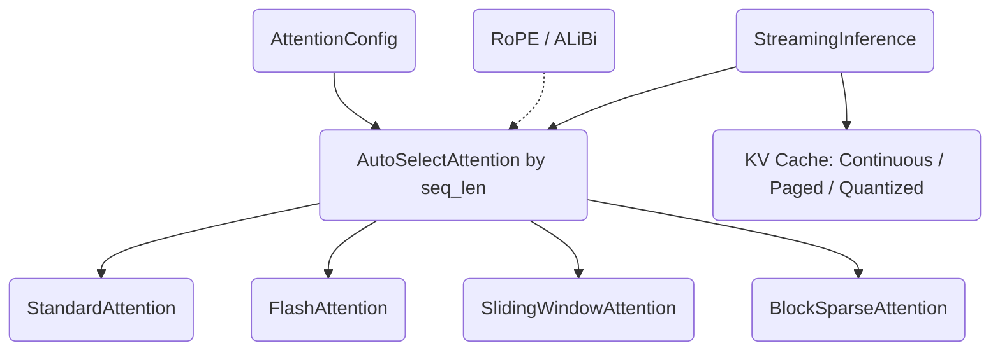

# Long-Context Attention

A from-scratch Rust library of memory-efficient attention mechanisms for long
transformer sequences. It implements standard, FlashAttention-style, sliding
window, block sparse, and linear attention, plus RoPE/ALiBi positional encoding,
KV caching, and a streaming inference engine — all as plain CPU code over flat
`Vec<f32>` buffers, with an auto-selection engine that picks an algorithm from
the sequence length.

## Features

- **Standard attention** — reference O(n²) scaled dot-product with causal masking and numerical-stability softmax (`StandardAttention` / `attention`).
- **FlashAttention-style tiling** — blocked computation with online softmax for O(n) intermediate memory, plus a logsumexp track for backward (`FlashAttention` / `flash`).
- **Linear attention** — ELU+1 feature-map approximation with O(n) cost (`LinearAttention` / `flash`).
- **Sliding window attention** — fixed local window for O(n · window) memory, with a dilated variant (`SlidingWindowAttention`, `DilatedSlidingWindowAttention` / `sliding_window`).
- **Block sparse attention** — Longformer-style local window plus global tokens and random blocks, with sparsity bookkeeping (`BlockSparseAttention`, `SparsePattern` / `block_sparse`).
- **Positional encodings** — rotary embeddings, ALiBi linear-bias slopes, and sinusoidal embeddings (`RotaryEmbedding`, `ALiBiPositionalBias` / `rope`).
- **KV cache implementations** — continuous pre-allocated, vLLM-style paged, and INT8-quantized caches (`ContinuousKVCache`, `PagedKVCache`, `QuantizedKVCache` / `kv_cache`).
- **Auto-selection** — sequence-length thresholds (tunable per GPU profile) choosing standard/flash/sliding/block-sparse, with a profiler (`AutoSelectAttention`, `SelectionThresholds` / `auto_select`).
- **Streaming inference** — prefill plus token-by-token decode with a pluggable cache, exposed through a builder (`StreamingInference`, `StreamingInferenceBuilder` / `streaming`).
- **Grouped-query attention** — KV-head expansion for GQA/MQA (`expand_kv_heads`).
- **Typed configuration and errors** — builder-style `AttentionConfig` with validation and a `Result`/`Error` enum.

## Architecture



| Component | Module | Responsibility |
|-----------|--------|----------------|
| Configuration | `config` | `AttentionConfig`, `AttentionType`, `TensorShape`, validation |
| Standard attention | `attention` | Reference O(n²) attention, softmax, causal mask, GQA expansion |
| Flash / linear | `flash` | Tiled online-softmax attention and linear-attention approximation |
| Sliding window | `sliding_window` | Local-window and dilated-window attention |
| Block sparse | `block_sparse` | Sparse pattern build (local + global + random) and execution |
| Positional encoding | `rope` | RoPE, ALiBi, sinusoidal embeddings |
| KV cache | `kv_cache` | Continuous, paged, and INT8-quantized caches |
| Auto-selection | `auto_select` | Threshold-based dispatch and timing profiler |
| Streaming | `streaming` | Prefill/decode engine with builder |

## Quick Start

### Prerequisites

- Rust 1.70+ with `cargo` (edition 2021).
- No external services or GPU — everything runs on CPU.

### Installation

```bash
git clone <repo-url>
cd 22-long-context-attention
cargo build --release
```

### Running

This is a library crate. Build it, run its tests, or add it as a path dependency:

```toml
[dependencies]
long-context-attention = { path = "../22-long-context-attention" }
```

## Usage

Compute attention over flat `[batch, seq_len, num_heads, head_dim]` buffers using
the auto-selecting engine:

```rust
use long_context_attention::{
    AttentionConfig, AutoSelectAttention, TensorShape,
};

let batch = 1;
let seq_len = 128;
let num_heads = 8;
let head_dim = 64;

let config = AttentionConfig::new(num_heads, head_dim).with_causal(true);
let attention = AutoSelectAttention::new(config);

let size = batch * seq_len * num_heads * head_dim;
let query: Vec<f32> = (0..size).map(|i| (i as f32) * 0.001).collect();
let key = query.clone();
let value = query.clone();

let shape = TensorShape::new(batch, seq_len, num_heads, head_dim);
let out = attention
    .forward(&query, &key, &value, shape, shape, None)
    .unwrap();

assert_eq!(out.output.len(), size);
```

Stream tokens through the prefill/decode engine built with the builder:

```rust
use long_context_attention::StreamingInferenceBuilder;

let mut engine = StreamingInferenceBuilder::new()
    .num_layers(1)
    .batch_size(1)
    .num_heads(8)
    .head_dim(64)
    .max_seq_len(2048)
    .flash_attention()
    .continuous_cache()
    .build();

let n = 8 * 64; // one token: num_heads * head_dim
let q = vec![0.01f32; 4 * n]; // prompt of 4 tokens
let prefill = engine.prefill(&q, &q, &q, 4, 0).unwrap();
assert_eq!(prefill.total_seq_len, 4);

let tok = vec![0.02f32; n];
let step = engine.decode_step(&tok, &tok, &tok, 0).unwrap();
assert_eq!(step.total_seq_len, 5);
```

## What's Real vs Simulated

- **Real:** All attention variants, positional encodings, KV caches, the
  auto-selection dispatch, and the streaming prefill/decode loop are fully
  implemented in safe Rust and exercised by the test suite. FlashAttention's
  output is verified to match `StandardAttention` within tolerance, RoPE is
  checked to preserve vector magnitude, and the INT8 cache round-trips through
  quantize/dequantize.
- **Simulated / not implemented:** This is a **CPU-only, algorithmic**
  implementation. There is no GPU, CUDA, ROCm, Metal, or Triton code — kernels
  are straightforward nested loops over `Vec<f32>`, not hardware kernels. The
  `GpuArchitecture` enum only selects integer thresholds; it does not detect or
  run on any GPU. No backward/training pass is implemented (FlashAttention
  stores logsumexp but exposes only forward). Numbers like "1M tokens" describe
  the algorithms' asymptotic memory behavior, not measured throughput.

## Testing

```bash
cargo test
cargo bench   # Criterion micro-benchmarks (standard/flash/streaming)
```

The suite has 142 unit tests across the modules, covering output shapes, causal
masking, numerical stability, flash-vs-standard equivalence, RoPE/ALiBi
properties, KV-cache round-trips, paged allocation, and streaming state. No
external services are required.

## Project Structure

```
22-long-context-attention/
  src/
    lib.rs            # Crate root, re-exports, Error/Result
    config.rs         # AttentionConfig, AttentionType, TensorShape
    attention.rs      # StandardAttention, softmax, causal mask, GQA
    flash.rs          # FlashAttention, LinearAttention
    sliding_window.rs # Sliding and dilated window attention
    block_sparse.rs   # Block sparse attention + SparsePattern
    rope.rs           # RoPE, ALiBi, sinusoidal embeddings
    kv_cache.rs       # Continuous, Paged, Quantized KV caches
    auto_select.rs    # AutoSelectAttention, thresholds, profiler
    streaming.rs      # StreamingInference + builder
  benches/attention.rs  # Criterion benchmarks
  docs/BLUEPRINT.md     # Full architecture and design
```

## License

MIT — see ../LICENSE
